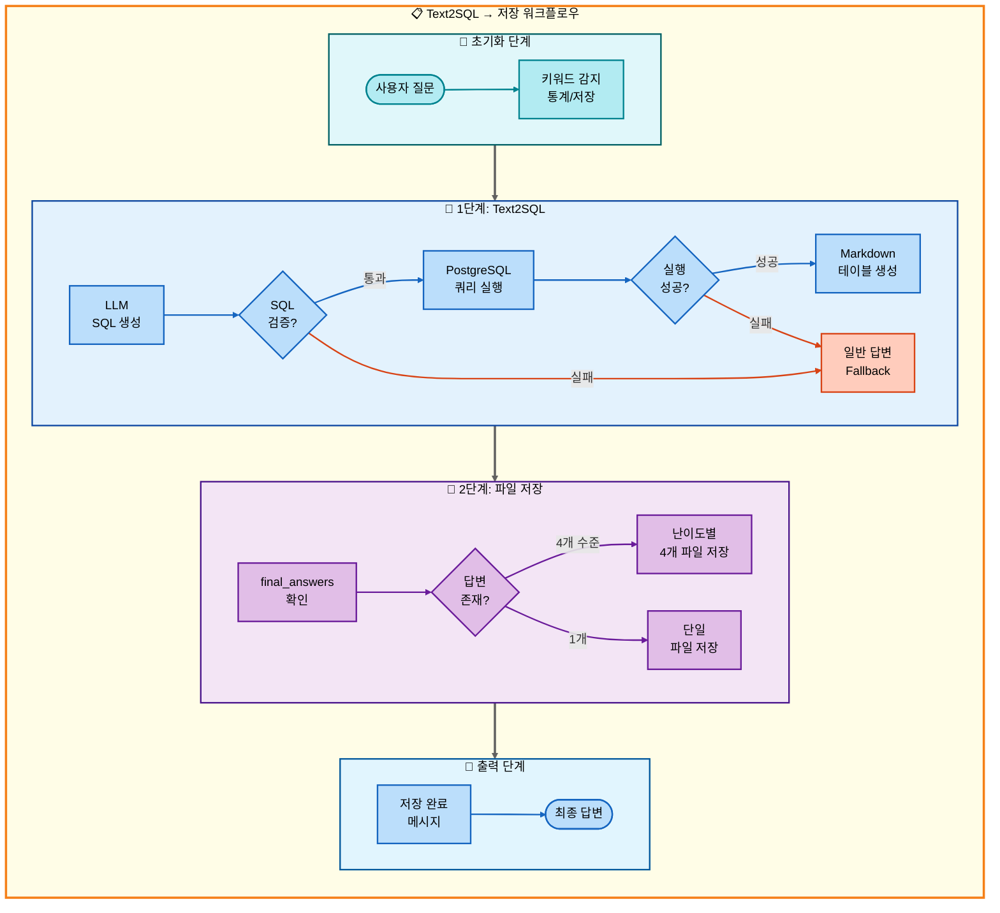

# 이중 요청: Text2SQL → 저장 아키텍처

## 📋 문서 정보
- **작성일**: 2025-11-07
- **작성자**: 최현화[팀장]
- **프로젝트명**: 논문 리뷰 챗봇 (AI Agent + RAG)
- **팀명**: 연결의 민족
- **문서 버전**: 1.0

---

## 📑 목차
1. [시나리오 개요](#시나리오-개요)
2. [사용자 요청 분석](#사용자-요청-분석)
3. [도구 자동 전환 및 Fallback](#도구-자동-전환-및-fallback)
4. [단순 흐름 아키텍처](#단순-흐름-아키텍처)
5. [상세 기능 동작 흐름도](#상세-기능-동작-흐름도)
6. [전체 흐름 요약 표](#전체-흐름-요약-표)
7. [동작 설명](#동작-설명)
8. [실행 예시](#실행-예시)
9. [핵심 포인트](#핵심-포인트)

---

## 📌 시나리오 개요

### 다중 요청의 목적

사용자가 **논문 통계를 조회**한 후 결과를 파일로 저장까지 원하는 경우, Text2SQL로 통계 데이터를 생성하고 저장까지 순차적으로 실행합니다.

**실행되는 도구 순서:**
```
1단계: text2sql (자연어 → SQL 변환 → 통계 조회)
  ↓ 실패 시
2단계: general (일반 답변 - LLM 지식 기반)
  ↓ 성공 시
3단계: save_file (파일 저장)
```

**사용자 요청 예시:**
- "2024년 논문 통계 보고 저장해줘"
- "AI 논문 수 조회하고 저장해줘"
- "카테고리별 논문 개수 확인하고 파일로 저장해줘"

---

## 📋 사용자 요청 분석

### 정확한 사용자 질문 예시

**예시 1: "2024년 논문 통계 보고 저장해줘"**
- **키워드 분석**:
  - `통계`: Text2SQL 필요
  - `2024년`: 연도 필터링
  - `저장`: 파일 저장 필요

**예시 2: "AI 논문 수 조회하고 저장해줘"**
- **키워드 분석**:
  - `논문 수`, `조회`: 통계 쿼리
  - `AI`: 카테고리 필터링
  - `저장`: 파일 저장 필요

### 도구 선택 근거

**패턴 매칭 방식 (src/agent/nodes.py:75-130)**

`configs/multi_request_patterns.yaml` 파일의 패턴을 기반으로 자동 감지:

```yaml
# 통계 저장 패턴
- keywords:
  - 통계
  - 저장
  tools:
  - text2sql
  - save_file
  description: 통계 조회 후 저장
  priority: 85
```

**매칭 로직:**
1. 질문에 `통계` AND `저장` 키워드 모두 포함
2. 자동으로 2단계 파이프라인 설정: `[text2sql, save_file]`

**AgentState 설정:**
```python
state["tool_pipeline"] = ["text2sql", "save_file"]
state["tool_choice"] = "text2sql"  # 첫 번째 도구
state["pipeline_index"] = 1
state["routing_method"] = "pattern_based"
state["routing_reason"] = "패턴 매칭: 통계 조회 후 저장"
state["pipeline_description"] = "순차 실행: text2sql → save_file"
```

---

## 🔄 도구 자동 전환 및 Fallback

### 전체 흐름도

```
사용자: "2024년 논문 통계 보고 저장해줘"
↓
[1단계] Text2SQL 도구
├─ 성공 → SQL 쿼리 생성 및 실행, 통계 결과 획득, 2단계로
└─ 실패 → 일반 답변 도구 (LLM이 직접 통계 검색)
    └─ 2단계로
↓
[2단계] 저장 도구 (save_file)
├─ 성공 → 저장 완료 메시지
└─ 실패 → 오류 메시지
```

### Text2SQL 동작 과정

**1. 자연어 → SQL 변환 (src/tools/text2sql.py:323-370)**
```python
# 사용자 질문: "2024년 논문 통계 보고 저장해줘"
# LLM 생성 SQL:
SELECT COUNT(*) AS paper_count
FROM papers
WHERE EXTRACT(YEAR FROM publish_date) = 2024;
```

**2. SQL 검증 및 실행 (text2sql.py:203-232)**
- 금지 패턴 검사 (INSERT/UPDATE/DELETE/DROP 차단)
- 허용 테이블 검증 (papers 테이블만 허용)
- LIMIT 100 자동 부여 (집계 쿼리 제외)

**3. 결과 포맷팅 (text2sql.py:269-277)**
- Markdown 테이블 형식으로 변환
- 난이도별 프롬프트로 결과 해석

### Fallback 체인

**1단계 Fallback: text2sql → general**
- SQL 생성 실패 시 (LLM 오류, 검증 실패)
- general 도구가 LLM 지식 기반으로 통계 설명
- src/tools/text2sql.py:445-461 참조

**2단계: 저장은 Fallback 없음**
- save_file은 항상 실행 (성공/실패만 판단)
- 저장 실패 시 오류 메시지 반환

---

## 📊 단순 흐름 아키텍처

### 워크플로우 다이어그램



---

## 🔍 상세 기능 동작 흐름도

### 전체 실행 흐름 (파일 및 메서드 단위)

```mermaid
graph TB
    subgraph MainFlow["📋 Text2SQL → 저장 상세 흐름"]
        direction TB

        subgraph Init["🔸 초기화"]
            direction LR
            Start([main.py<br/>사용자 입력]) --> A[main.py<br/>create_agent<br/>Agent 생성]
            A --> B[agent.invoke<br/>question 전달]
        end

        subgraph Pattern["🔹 패턴 매칭"]
            direction LR
            C[nodes.py<br/>router_node<br/>라우터 실행] --> D[multi_request_patterns.yaml<br/>패턴 로드]
            D --> E{통계+저장<br/>패턴 매칭?}
            E -->|매칭| F[tool_pipeline 설정<br/>text2sql→save_file]
        end

        subgraph Text2SQL["🔸 Text2SQL"]
            direction LR
            G[nodes.py<br/>도구 선택<br/>tool_choice=text2sql] --> H[text2sql.py<br/>text2sql 함수<br/>실행]
            H --> I[_fetch_schema_snapshot<br/>DB 스키마 조회]
            I --> J[LLMClient<br/>SQL 생성 요청]
            J --> K{SQL<br/>생성 성공?}
            K -->|성공| L[_extract_sql<br/>SQL 추출]
            L --> M[_sanitize<br/>SQL 검증]
            M --> N{검증<br/>통과?}
            N -->|통과| O[_run_query<br/>PostgreSQL 실행]
            O --> P[_to_markdown_table<br/>Markdown 변환]
            P --> Q[난이도별 프롬프트<br/>결과 해석]
            K -->|실패| R[Fallback<br/>general_answer_node]
            N -->|실패| R
        end

        subgraph Router2["🔹 라우터 2"]
            direction LR
            S[nodes.py<br/>router_node<br/>재실행] --> T{pipeline_index<br/>< 파이프라인 길이?}
            T -->|Yes| U[tool_choice<br/>= save_file]
        end

        subgraph Save["🔸 파일 저장"]
            direction LR
            V[nodes.py<br/>도구 선택<br/>tool_choice=save_file] --> W[save_file.py<br/>save_file_node<br/>노드 실행]
            W --> X{final_answers<br/>존재?}
            X -->|4개 수준| Y[난이도별<br/>4개 파일 저장]
            X -->|없음| Z[tool_result<br/>단일 파일 저장]
            Y --> AA[타임스탬프<br/>파일명 생성]
            Z --> AA
        end

        subgraph Output["🔹 출력"]
            direction LR
            AB[저장 경로<br/>메시지 생성] --> End([main.py<br/>최종 답변])
        end

        %% 단계 간 연결
        Init --> Pattern
        Pattern --> Text2SQL
        Text2SQL --> Router2
        Router2 --> Save
        Save --> Output
    end

    %% 스타일 정의
    style MainFlow fill:#fffde7,stroke:#f57f17,stroke-width:3px,color:#000

    style Init fill:#e0f7fa,stroke:#006064,stroke-width:2px,color:#000
    style Pattern fill:#e3f2fd,stroke:#0d47a1,stroke-width:2px,color:#000
    style Text2SQL fill:#f3e5f5,stroke:#4a148c,stroke-width:2px,color:#000
    style Router2 fill:#fff3e0,stroke:#e65100,stroke-width:2px,color:#000
    style Save fill:#fce4ec,stroke:#880e4f,stroke-width:2px,color:#000
    style Output fill:#e1f5fe,stroke:#01579b,stroke-width:2px,color:#000

    %% 노드 스타일 (초기화 - 청록)
    style Start fill:#b2ebf2,stroke:#00838f,stroke-width:2px,color:#000
    style A fill:#b2ebf2,stroke:#00838f,stroke-width:2px,color:#000
    style B fill:#b2ebf2,stroke:#00838f,stroke-width:2px,color:#000

    %% 노드 스타일 (패턴 - 파랑)
    style C fill:#bbdefb,stroke:#1565c0,stroke-width:2px,color:#000
    style D fill:#bbdefb,stroke:#1565c0,stroke-width:2px,color:#000
    style E fill:#bbdefb,stroke:#1565c0,stroke-width:2px,color:#000
    style F fill:#bbdefb,stroke:#1565c0,stroke-width:2px,color:#000

    %% 노드 스타일 (Text2SQL - 보라)
    style G fill:#e1bee7,stroke:#6a1b9a,stroke-width:2px,color:#000
    style H fill:#e1bee7,stroke:#6a1b9a,stroke-width:2px,color:#000
    style I fill:#e1bee7,stroke:#6a1b9a,stroke-width:2px,color:#000
    style J fill:#e1bee7,stroke:#6a1b9a,stroke-width:2px,color:#000
    style K fill:#e1bee7,stroke:#6a1b9a,stroke-width:2px,color:#000
    style L fill:#e1bee7,stroke:#6a1b9a,stroke-width:2px,color:#000
    style M fill:#e1bee7,stroke:#6a1b9a,stroke-width:2px,color:#000
    style N fill:#e1bee7,stroke:#6a1b9a,stroke-width:2px,color:#000
    style O fill:#e1bee7,stroke:#6a1b9a,stroke-width:2px,color:#000
    style P fill:#e1bee7,stroke:#6a1b9a,stroke-width:2px,color:#000
    style Q fill:#e1bee7,stroke:#6a1b9a,stroke-width:2px,color:#000
    style R fill:#ffccbc,stroke:#d84315,stroke-width:2px,color:#000

    %% 노드 스타일 (라우터2 - 주황)
    style S fill:#ffe0b2,stroke:#e65100,stroke-width:2px,color:#000
    style T fill:#ffe0b2,stroke:#e65100,stroke-width:2px,color:#000
    style U fill:#ffe0b2,stroke:#e65100,stroke-width:2px,color:#000

    %% 노드 스타일 (저장 - 핑크)
    style V fill:#f8bbd0,stroke:#ad1457,stroke-width:2px,color:#000
    style W fill:#f8bbd0,stroke:#ad1457,stroke-width:2px,color:#000
    style X fill:#f8bbd0,stroke:#ad1457,stroke-width:2px,color:#000
    style Y fill:#f8bbd0,stroke:#ad1457,stroke-width:2px,color:#000
    style Z fill:#f8bbd0,stroke:#ad1457,stroke-width:2px,color:#000
    style AA fill:#f8bbd0,stroke:#ad1457,stroke-width:2px,color:#000

    %% 노드 스타일 (출력 - 파랑)
    style AB fill:#bbdefb,stroke:#1565c0,stroke-width:2px,color:#000
    style End fill:#bbdefb,stroke:#1565c0,stroke-width:2px,color:#000

    %% 연결선 스타일 (초기화 0~1)
    linkStyle 0 stroke:#00838f,stroke-width:2px
    linkStyle 1 stroke:#00838f,stroke-width:2px

    %% 연결선 스타일 (패턴 2~4)
    linkStyle 2 stroke:#1565c0,stroke-width:2px
    linkStyle 3 stroke:#1565c0,stroke-width:2px
    linkStyle 4 stroke:#1565c0,stroke-width:2px

    %% 연결선 스타일 (Text2SQL 5~17)
    linkStyle 5 stroke:#6a1b9a,stroke-width:2px
    linkStyle 6 stroke:#6a1b9a,stroke-width:2px
    linkStyle 7 stroke:#6a1b9a,stroke-width:2px
    linkStyle 8 stroke:#6a1b9a,stroke-width:2px
    linkStyle 9 stroke:#6a1b9a,stroke-width:2px
    linkStyle 10 stroke:#6a1b9a,stroke-width:2px
    linkStyle 11 stroke:#6a1b9a,stroke-width:2px
    linkStyle 12 stroke:#6a1b9a,stroke-width:2px
    linkStyle 13 stroke:#6a1b9a,stroke-width:2px
    linkStyle 14 stroke:#6a1b9a,stroke-width:2px
    linkStyle 15 stroke:#d84315,stroke-width:2px
    linkStyle 16 stroke:#d84315,stroke-width:2px

    %% 연결선 스타일 (라우터2 17~18)
    linkStyle 17 stroke:#e65100,stroke-width:2px
    linkStyle 18 stroke:#e65100,stroke-width:2px

    %% 연결선 스타일 (저장 19~23)
    linkStyle 19 stroke:#ad1457,stroke-width:2px
    linkStyle 20 stroke:#ad1457,stroke-width:2px
    linkStyle 21 stroke:#ad1457,stroke-width:2px
    linkStyle 22 stroke:#ad1457,stroke-width:2px
    linkStyle 23 stroke:#ad1457,stroke-width:2px
    linkStyle 24 stroke:#ad1457,stroke-width:2px

    %% 연결선 스타일 (출력 25)
    linkStyle 25 stroke:#1565c0,stroke-width:2px

    %% 단계 간 연결 (회색 26~30)
    linkStyle 26 stroke:#616161,stroke-width:3px
    linkStyle 27 stroke:#616161,stroke-width:3px
    linkStyle 28 stroke:#616161,stroke-width:3px
    linkStyle 29 stroke:#616161,stroke-width:3px
    linkStyle 30 stroke:#616161,stroke-width:3px
```



---

## 📋 전체 흐름 요약 표

| 단계 | 도구명 | 파일명 | 메서드명 | 동작 설명 | 입력 | 출력 | Fallback | 세션 저장 |
|------|--------|--------|----------|-----------|------|------|----------|----------|
| 0 | 초기화 | main.py | create_agent | Agent 생성 | question, difficulty | agent | 없음 | messages |
| 0-1 | 라우터 | nodes.py | router_node | 질문 분석 및 도구 선택 | question | tool_choice, tool_pipeline | 없음 | routing_method |
| 1 | Text2SQL | text2sql.py | text2sql | 자연어 → SQL 변환 및 실행 | user_question, difficulty | SQL + 통계 결과 (Markdown) | general_answer | final_answer |
| 1-1 | DB 스키마 조회 | text2sql.py | _fetch_schema_snapshot | 허용 테이블/컬럼 조회 | - | 스키마 텍스트 | 없음 | - |
| 1-2 | SQL 생성 | text2sql.py | LLMClient.invoke | LLM으로 SQL 생성 | system_prompt, few_shots, question | raw SQL | 없음 | - |
| 1-3 | SQL 추출 | text2sql.py | _extract_sql | 코드펜스 제거, SQL 추출 | raw SQL | clean SQL | 없음 | - |
| 1-4 | SQL 검증 | text2sql.py | _sanitize | 금지 패턴/테이블 검증 | clean SQL | sanitized SQL | 없음 | - |
| 1-5 | LIMIT 보정 | text2sql.py | _ensure_limit | 집계 아닌 경우 LIMIT 100 추가 | sanitized SQL | final SQL | 없음 | - |
| 1-6 | SQL 실행 | text2sql.py | _run_query | PostgreSQL 쿼리 실행 | final SQL | cols, rows | 없음 | - |
| 1-7 | Markdown 변환 | text2sql.py | _to_markdown_table | 테이블 형식 변환 | cols, rows | Markdown table | 없음 | - |
| 1-F | 일반 답변 | general_answer.py | general_answer_node | LLM 지식 기반 답변 | question | final_answers (2개 수준) | 없음 | final_answers |
| 2 | 파일 저장 | save_file.py | save_file_node | 난이도별 파일 저장 | final_answers | 저장 경로 메시지 | 없음 | save_counter |

**설명:**
- **1단계**: Text2SQL 도구가 자연어를 SQL로 변환하여 통계 조회
- **1-1 ~ 1-7**: Text2SQL 내부 세부 단계 (스키마 조회 → SQL 생성 → 검증 → 실행 → 변환)
- **1-F**: Text2SQL 실패 시 general_answer가 LLM 지식으로 통계 설명
- **2단계**: final_answers(4개 수준) 또는 tool_result(1개)를 파일로 저장

---

## 💡 동작 설명

### 1. Text2SQL 변환 과정 상세 설명

**단계별 실행:**

**1-1. DB 스키마 조회 (text2sql.py:67-86)**
```python
def _fetch_schema_snapshot() -> str:
    # information_schema에서 허용 테이블/컬럼 조회
    SELECT table_name, column_name, data_type
    FROM information_schema.columns
    WHERE table_schema='public' AND table_name = 'papers'

    # 결과:
    # - papers.paper_id :: integer
    # - papers.title :: text
    # - papers.authors :: text
    # - papers.publish_date :: date
    # - papers.citation_count :: integer
    # - ...
```

**1-2. SQL 생성 (text2sql.py:362-369)**
```python
# 시스템 프롬프트 + Few-shot 예시 + 사용자 질문
system_prompt = """You are a Text-to-SQL generator.
Rules:
- SELECT/WITH only. No INSERT/UPDATE/DELETE.
- Use only: papers(paper_id, title, authors, publish_date, citation_count, ...)
- For year filters: EXTRACT(YEAR FROM publish_date)
- Add LIMIT 100 for non-aggregate queries
"""

few_shots = [
    "Q: 2024년에 발표된 논문 개수는?",
    "SELECT COUNT(*) FROM papers WHERE EXTRACT(YEAR FROM publish_date)=2024;",
    ...
]

user_question = "2024년 논문 통계 보고 저장해줘"

# LLM 호출 → SQL 생성
```

**1-3. SQL 추출 (text2sql.py:156-171)**
```python
# LLM이 코드펜스로 감쌌을 경우 제거
raw = "```sql\nSELECT COUNT(*) FROM papers;\n```"
sql = _extract_sql(raw)  # "SELECT COUNT(*) FROM papers;"
```

**1-4. SQL 검증 (text2sql.py:203-231)**
```python
# 금지 패턴 검사
_FORBIDDEN_PATTERNS = [r"\binsert\b", r"\bupdate\b", r"\bdelete\b", r"\bdrop\b", ...]

# 허용 테이블 검증
ALLOWED_TABLES = {"papers"}
if "users" in sql:  # 허용되지 않은 테이블
    raise ValueError("허용되지 않은 테이블 참조: users")

# 읽기 전용 검증
if not sql.lower().startswith(("select", "with")):
    raise ValueError("SELECT/WITH 쿼리만 허용됩니다.")
```

**1-5. LIMIT 보정 (text2sql.py:234-242)**
```python
# 집계 함수가 없으면 LIMIT 100 추가
sql = "SELECT * FROM papers WHERE category='AI'"
if "count(" not in sql.lower() and "limit" not in sql.lower():
    sql += " LIMIT 100;"
# 결과: "SELECT * FROM papers WHERE category='AI' LIMIT 100;"
```

**1-6. SQL 실행 (text2sql.py:262-267)**
```python
def _run_query(sql: str):
    with psycopg2.connect(...) as conn:
        cursor = conn.cursor()
        cursor.execute(sql)
        cols = [d.name for d in cursor.description]  # ["paper_count"]
        rows = cursor.fetchall()  # [(42,)]
        return cols, rows
```

**1-7. Markdown 변환 (text2sql.py:269-277)**
```python
cols = ["paper_count"]
rows = [(42,)]

# Markdown 테이블 생성
result = """
paper_count
---
42
"""
```

### 2. DB 테이블/컬럼 사용 방법

**허용 테이블: papers**

```sql
CREATE TABLE papers (
    paper_id INTEGER PRIMARY KEY,
    title TEXT,
    authors TEXT,
    publish_date DATE,
    source TEXT,
    url TEXT,
    category TEXT,
    citation_count INTEGER,
    abstract TEXT,
    created_at TIMESTAMP,
    updated_at TIMESTAMP
);
```

**SQL 쿼리 예시:**

```sql
-- 1. 연도별 논문 개수
SELECT EXTRACT(YEAR FROM publish_date) AS year, COUNT(*) AS count
FROM papers
GROUP BY year
ORDER BY year DESC;

-- 2. 카테고리별 논문 개수
SELECT category, COUNT(*) AS count
FROM papers
GROUP BY category
ORDER BY count DESC;

-- 3. 최다 인용 논문 Top 5
SELECT title, citation_count
FROM papers
ORDER BY citation_count DESC
LIMIT 5;

-- 4. AI 관련 논문 평균 인용수
SELECT AVG(citation_count) AS avg_citations
FROM papers
WHERE category ILIKE '%AI%';
```

### 3. 파일 저장 실행 과정

**저장 우선순위 (src/tools/save_file.py:68-149):**

1. **final_answers (우선순위 0)** - 난이도별 4개 파일
   ```python
   final_answers = {
       "elementary": "2024년에는 42개의 논문이 발표되었어요!",
       "beginner": "2024년 논문 통계: 총 42편 발표",
       "intermediate": "2024년도 논문 발행 통계 분석 결과: 42편",
       "advanced": "2024년 발행 논문 정량 분석: 총 42편 (전년 대비 15% 증가)"
   }

   # 4개 파일 저장:
   # - 20251107_143052_response_1_elementary.md
   # - 20251107_143052_response_1_beginner.md
   # - 20251107_143052_response_1_intermediate.md
   # - 20251107_143052_response_1_advanced.md
   ```

2. **tool_result (우선순위 1)** - 단일 파일

---

## 📝 실행 예시

### 예시 1: 2024년 논문 통계 저장

**사용자 질문:**
```
2024년 논문 통계 보고 저장해줘
```

**1단계: Text2SQL 실행**
```
[Text2SQL 노드 - text2sql.py]

스키마 조회:
- papers.paper_id :: integer
- papers.title :: text
- papers.publish_date :: date
- papers.citation_count :: integer

LLM SQL 생성:
SELECT COUNT(*) AS paper_count
FROM papers
WHERE EXTRACT(YEAR FROM publish_date) = 2024;

SQL 검증: ✅ 통과
SQL 실행:
| paper_count |
| ----------- |
| 42          |

난이도별 해석 (Solar-pro2):
- elementary: "2024년에는 42개의 논문이 발표되었어요!"
- beginner: "2024년 논문 통계 조회 결과, 총 42편이 발표되었습니다."

final_answers 저장 ✅
```

**2단계: 파일 저장**
```
[파일 저장 노드 - save_file.py]

final_answers 확인: 2개 수준 존재 ✅
(easy 모드: elementary + beginner)

저장 카운터 증가: 0 → 1
타임스탬프 생성: 20251107_143052

파일 저장:
1. 20251107_143052_response_1_elementary.md
2. 20251107_143052_response_1_beginner.md

저장 완료 ✅
```

**최종 출력:**
```
난이도별 답변이 각각 저장되었습니다.
저장된 파일:
- 초등학생용(8-13세): outputs/20251107_143052_response_1_elementary.md
- 초급자용(14-22세): outputs/20251107_143052_response_1_beginner.md
```

### 예시 2: 카테고리별 논문 개수 저장

**사용자 질문:**
```
카테고리별 논문 개수 확인하고 파일로 저장해줘
```

**생성된 SQL 쿼리:**
```sql
SELECT category, COUNT(*) AS paper_count
FROM papers
GROUP BY category
ORDER BY paper_count DESC
LIMIT 100;
```

**실행 결과 (Markdown):**
```markdown
| category | paper_count |
| -------- | ----------- |
| AI       | 150         |
| ML       | 120         |
| NLP      | 95          |
| CV       | 80          |
```

**난이도별 해석:**
```
elementary: "AI 분야가 150개로 가장 많아요!"
beginner: "카테고리별 논문 개수: AI(150), ML(120), NLP(95), CV(80)"
```

**저장된 파일:**
```
- 20251107_144230_response_2_elementary.md
- 20251107_144230_response_2_beginner.md
```

### 예시 3: 최다 인용 논문 Top 5 저장

**사용자 질문:**
```
가장 많이 인용된 논문 5개 조회하고 저장해줘
```

**생성된 SQL 쿼리:**
```sql
SELECT title, citation_count
FROM papers
ORDER BY citation_count DESC
LIMIT 5;
```

**실행 결과:**
```markdown
| title                          | citation_count |
| ------------------------------ | -------------- |
| Attention Is All You Need      | 45000          |
| BERT                           | 38000          |
| GPT-3                          | 25000          |
| ResNet                         | 22000          |
| Transformer-XL                 | 18000          |
```

**저장 결과:**
```
2개 파일 저장 완료:
- 20251107_145012_response_3_elementary.md
- 20251107_145012_response_3_beginner.md
```

---

## 🎯 핵심 포인트

### 1. Text2SQL 핵심 원리

**자연어 → SQL 변환:**
- LLM이 Few-shot 예시를 참고하여 SQL 생성
- 스키마 정보를 시스템 프롬프트에 포함
- 난이도별 해석 프롬프트로 결과 설명

### 2. 보안 메커니즘

**3단계 검증:**
1. **금지 패턴 차단** (text2sql.py:148-152)
   - INSERT/UPDATE/DELETE/DROP/ALTER 등 차단
2. **허용 테이블만 접근** (text2sql.py:59-64)
   - papers 테이블만 허용
3. **읽기 전용 강제** (text2sql.py:153)
   - SELECT/WITH 쿼리만 허용

### 3. DB 스키마

**papers 테이블 컬럼:**
- `paper_id`: 논문 ID (PRIMARY KEY)
- `title`: 논문 제목
- `authors`: 저자 목록
- `publish_date`: 발행일
- `source`: 출처 (arXiv, IEEE 등)
- `url`: 논문 URL
- `category`: 카테고리
- `citation_count`: 인용 횟수
- `abstract`: 초록
- `created_at`, `updated_at`: 생성/수정 시간

### 4. SQL 쿼리 생성 규칙

**자동 적용 규칙:**
1. **LIMIT 100 자동 추가** - 집계 아닌 경우
2. **연도 필터링** - `EXTRACT(YEAR FROM publish_date)`
3. **키워드 검색** - `ILIKE '%keyword%'`
4. **집계 함수** - COUNT/SUM/AVG/MAX/MIN

### 5. 난이도별 모델 선택

**모델 설정 (configs/model_config.yaml):**
```yaml
text2sql:
  provider: solar
  model: solar-pro2
  temperature: 0.0  # SQL 생성은 결정적이어야 함
```

**난이도별 해석:**
- **easy 모드**: Solar-pro2 (한국어 특화, 쉬운 설명)
- **hard 모드**: GPT-5 (기술적 정확도, 상세 분석)

### 6. 파일 저장 형식

**난이도별 파일명:**
```
20251107_143052_response_1_elementary.md
20251107_143052_response_1_beginner.md
```

**구성:**
- 날짜: `20251107` (YYYYMMDD)
- 시간: `143052` (HHMMSS)
- 타입: `response`
- 번호: `1` (세션별 누적)
- 수준: `elementary`, `beginner`

---

**문서 버전**: 1.0
**최종 수정일**: 2025-11-07
