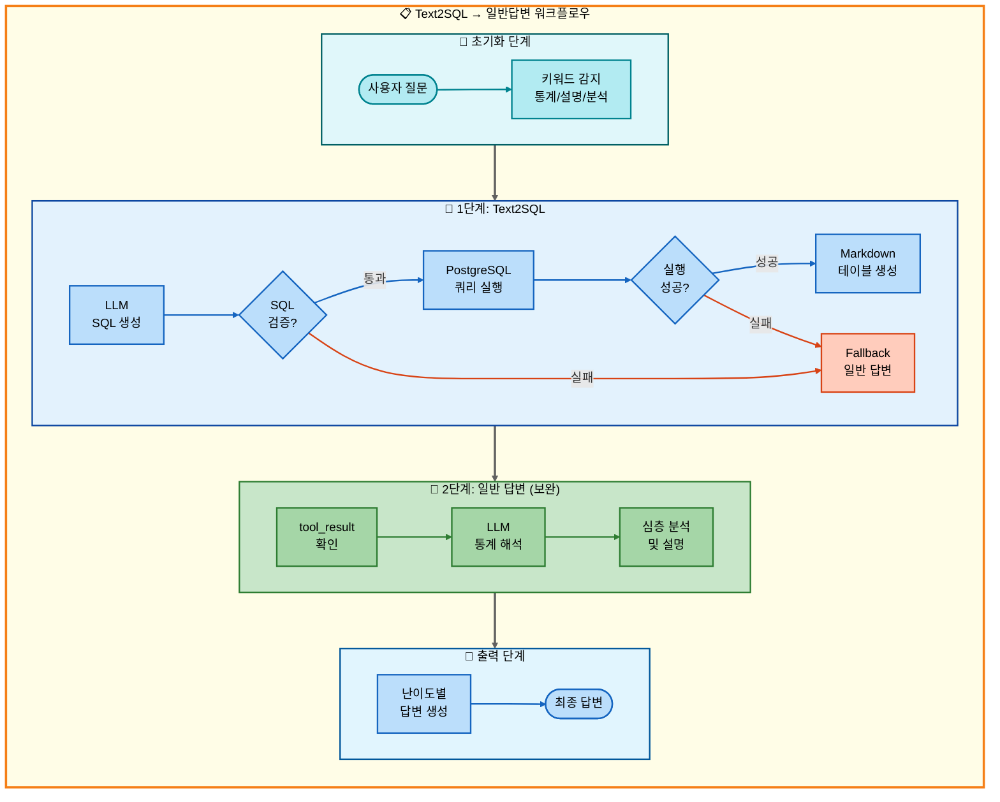

# 이중 요청: Text2SQL → 일반답변 아키텍처

## 📋 문서 정보
- **작성일**: 2025-11-07
- **작성자**: 최현화[팀장]
- **프로젝트명**: 논문 리뷰 챗봇 (AI Agent + RAG)
- **팀명**: 연결의 민족
- **문서 버전**: 1.0

---

## 📑 목차
1. [시나리오 개요](#시나리오-개요)
2. [사용자 요청 분석](#사용자-요청-분석)
3. [도구 자동 전환 및 Fallback](#도구-자동-전환-및-fallback)
4. [단순 흐름 아키텍처](#단순-흐름-아키텍처)
5. [상세 기능 동작 흐름도](#상세-기능-동작-흐름도)
6. [전체 흐름 요약 표](#전체-흐름-요약-표)
7. [동작 설명 (초보 개발자용)](#동작-설명-초보-개발자용)
8. [실행 예시](#실행-예시)
9. [핵심 포인트](#핵심-포인트)

---

## 📌 시나리오 개요

### 다중 요청의 목적

사용자가 **논문 통계를 조회**한 후 결과에 대한 상세 설명까지 원하는 경우, Text2SQL로 통계 데이터를 생성하고 LLM이 결과를 해석/설명하는 작업을 순차적으로 실행합니다.

**실행되는 도구 순서:**
```
1단계: text2sql (자연어 → SQL 변환 → 통계 조회)
  ↓ 실패 시
2단계: general (일반 답변 - LLM 지식 기반)
  ↓ 성공 시
3단계: general (통계 결과 해석 및 설명)
```

**⚠️ 핵심 차이점: 2단계 general은 통계 결과를 해석하는 보완 도구**
- 1단계 성공/실패와 무관하게 **항상 실행**
- 통계 데이터를 받아 심층 분석 및 설명 제공

**사용자 요청 예시:**
- "가장 많이 인용된 논문 통계 알려주고 설명해줘"
- "2024년 논문 개수 조회하고 자세히 분석해줘"
- "카테고리별 논문 비율 확인하고 해석해줘"

---

## 📋 사용자 요청 분석

### 정확한 사용자 질문 예시

**예시 1: "가장 많이 인용된 논문 통계 알려주고 설명해줘"**
- **키워드 분석**:
  - `인용`, `통계`: Text2SQL 필요
  - `설명`: 일반 답변 필요 (결과 해석)

**예시 2: "2024년 논문 개수 조회하고 자세히 분석해줘"**
- **키워드 분석**:
  - `논문 개수`, `조회`: 통계 쿼리
  - `2024년`: 연도 필터링
  - `분석`: 일반 답변 필요 (심층 분석)

### 도구 선택 근거

**⚠️ 주의: YAML 패턴에 Text2SQL → general 이중 요청 패턴이 명시적으로 없음**

현재 `configs/multi_request_patterns.yaml`에는 Text2SQL과 general을 직접 조합한 패턴이 없으나, 논리적으로 다음과 같은 패턴이 필요합니다:

```yaml
# 예상 패턴 (실제 구현 필요)
- keywords:
  - 통계
  any_of_keywords:
  - 설명
  - 분석
  - 해석
  - 알려
  exclude_keywords:
  - 저장
  - 요약
  tools:
  - text2sql
  - general
  description: 통계 조회 후 결과 설명
  priority: 90
```

**AgentState 설정:**
```python
state["tool_pipeline"] = ["text2sql", "general"]
state["tool_choice"] = "text2sql"  # 첫 번째 도구
state["pipeline_index"] = 1
state["routing_method"] = "pattern_based"
state["routing_reason"] = "패턴 매칭: 통계 조회 후 결과 설명"
state["pipeline_description"] = "순차 실행: text2sql → general"
```

---

## 🔄 도구 자동 전환 및 Fallback

### 전체 흐름도

```
사용자: "가장 많이 인용된 논문 통계 알려주고 설명해줘"
↓
[1단계] Text2SQL 도구
├─ 성공 → SQL 쿼리 실행, 통계 결과 획득
└─ 실패 → 일반 답변 도구 (LLM이 직접 통계 검색)
↓
[2단계] 일반 답변 도구 (통계 결과 해석 및 설명) ← 항상 실행
└─ LLM이 통계 결과를 분석하고 설명 제공
```

### Text2SQL 동작 과정

**1. 자연어 → SQL 변환 (src/tools/text2sql.py:323-370)**
```python
# 사용자 질문: "가장 많이 인용된 논문 통계 알려주고 설명해줘"
# LLM 생성 SQL:
SELECT title, citation_count
FROM papers
ORDER BY citation_count DESC
LIMIT 5;
```

**2. SQL 검증 및 실행 (text2sql.py:203-267)**
- 금지 패턴 검사
- 허용 테이블 검증
- PostgreSQL 실행
- Markdown 테이블 생성

### 보완 패턴 vs Fallback 패턴

**핵심 차이점:**

| 구분 | Fallback 패턴 | 보완 패턴 (본 문서) |
|------|---------------|---------------------|
| 2단계 실행 조건 | 1단계 실패 시에만 | 항상 실행 |
| 목적 | 대체 수단 제공 | 추가 설명 제공 |
| tool_status 영향 | 있음 (failed일 때만) | 없음 (무시) |
| 결과 결합 | 대체 (OR) | 보완 (AND) |
| 데이터 전달 | tool_result 전달 안함 | tool_result 전달 |

**보완 패턴 동작:**
```python
# 1단계 성공 시
state["tool_result"] = "통계 결과 (Markdown 테이블)"
state["tool_status"] = "success"

# 2단계 실행 (항상)
# general_answer_node가 tool_result를 참조하여 해석
```

---

## 📊 단순 흐름 아키텍처

### 워크플로우 다이어그램



---

## 🔍 상세 기능 동작 흐름도

### 전체 실행 흐름 (파일 및 메서드 단위)

```mermaid
graph TB
    subgraph MainFlow["📋 Text2SQL → 일반답변 상세 흐름"]
        direction TB

        subgraph Init["🔸 초기화"]
            direction LR
            Start([main.py<br/>사용자 입력]) --> A[main.py<br/>create_agent<br/>Agent 생성]
            A --> B[agent.invoke<br/>question 전달]
        end

        subgraph Pattern["🔹 패턴 매칭"]
            direction LR
            C[nodes.py<br/>router_node<br/>라우터 실행] --> D[multi_request_patterns.yaml<br/>패턴 로드]
            D --> E{통계+설명<br/>패턴 매칭?}
            E -->|매칭| F[tool_pipeline 설정<br/>text2sql→general]
        end

        subgraph Text2SQL["🔸 Text2SQL"]
            direction LR
            G[nodes.py<br/>도구 선택<br/>tool_choice=text2sql] --> H[text2sql.py<br/>text2sql 함수<br/>실행]
            H --> I[_fetch_schema_snapshot<br/>DB 스키마 조회]
            I --> J[LLMClient<br/>SQL 생성 요청]
            J --> K{SQL<br/>생성 성공?}
            K -->|성공| L[_extract_sql<br/>SQL 추출]
            L --> M[_sanitize<br/>SQL 검증]
            M --> N{검증<br/>통과?}
            N -->|통과| O[_run_query<br/>PostgreSQL 실행]
            O --> P[_to_markdown_table<br/>Markdown 변환]
            P --> Q[난이도별 프롬프트<br/>결과 해석]
            K -->|실패| R[Fallback<br/>general_answer_node]
            N -->|실패| R
        end

        subgraph Router2["🔹 라우터 2"]
            direction LR
            S[nodes.py<br/>router_node<br/>재실행] --> T{pipeline_index<br/>< 파이프라인 길이?}
            T -->|Yes| U[tool_choice<br/>= general]
        end

        subgraph General["🔸 일반 답변 (보완)"]
            direction LR
            V[nodes.py<br/>도구 선택<br/>tool_choice=general] --> W[general_answer.py<br/>general_answer_node<br/>실행]
            W --> X[tool_result<br/>확인]
            X --> Y{통계 결과<br/>존재?}
            Y -->|있음| Z[통계 결과 포함<br/>심층 분석]
            Y -->|없음| AA[일반 답변<br/>생성]
            Z --> AB[LLMClient<br/>난이도별 해석<br/>elementary/beginner]
            AA --> AB
        end

        subgraph Output["🔹 출력"]
            direction LR
            AC[final_answers<br/>난이도별 저장] --> End([main.py<br/>최종 답변])
        end

        %% 단계 간 연결
        Init --> Pattern
        Pattern --> Text2SQL
        Text2SQL --> Router2
        Router2 --> General
        General --> Output
    end

    %% 스타일 정의
    style MainFlow fill:#fffde7,stroke:#f57f17,stroke-width:3px,color:#000

    style Init fill:#e0f7fa,stroke:#006064,stroke-width:2px,color:#000
    style Pattern fill:#e3f2fd,stroke:#0d47a1,stroke-width:2px,color:#000
    style Text2SQL fill:#f3e5f5,stroke:#4a148c,stroke-width:2px,color:#000
    style Router2 fill:#fff3e0,stroke:#e65100,stroke-width:2px,color:#000
    style General fill:#c8e6c9,stroke:#2e7d32,stroke-width:2px,color:#000
    style Output fill:#e1f5fe,stroke:#01579b,stroke-width:2px,color:#000

    %% 노드 스타일 (초기화 - 청록)
    style Start fill:#b2ebf2,stroke:#00838f,stroke-width:2px,color:#000
    style A fill:#b2ebf2,stroke:#00838f,stroke-width:2px,color:#000
    style B fill:#b2ebf2,stroke:#00838f,stroke-width:2px,color:#000

    %% 노드 스타일 (패턴 - 파랑)
    style C fill:#bbdefb,stroke:#1565c0,stroke-width:2px,color:#000
    style D fill:#bbdefb,stroke:#1565c0,stroke-width:2px,color:#000
    style E fill:#bbdefb,stroke:#1565c0,stroke-width:2px,color:#000
    style F fill:#bbdefb,stroke:#1565c0,stroke-width:2px,color:#000

    %% 노드 스타일 (Text2SQL - 보라)
    style G fill:#e1bee7,stroke:#6a1b9a,stroke-width:2px,color:#000
    style H fill:#e1bee7,stroke:#6a1b9a,stroke-width:2px,color:#000
    style I fill:#e1bee7,stroke:#6a1b9a,stroke-width:2px,color:#000
    style J fill:#e1bee7,stroke:#6a1b9a,stroke-width:2px,color:#000
    style K fill:#e1bee7,stroke:#6a1b9a,stroke-width:2px,color:#000
    style L fill:#e1bee7,stroke:#6a1b9a,stroke-width:2px,color:#000
    style M fill:#e1bee7,stroke:#6a1b9a,stroke-width:2px,color:#000
    style N fill:#e1bee7,stroke:#6a1b9a,stroke-width:2px,color:#000
    style O fill:#e1bee7,stroke:#6a1b9a,stroke-width:2px,color:#000
    style P fill:#e1bee7,stroke:#6a1b9a,stroke-width:2px,color:#000
    style Q fill:#e1bee7,stroke:#6a1b9a,stroke-width:2px,color:#000
    style R fill:#ffccbc,stroke:#d84315,stroke-width:2px,color:#000

    %% 노드 스타일 (라우터2 - 주황)
    style S fill:#ffe0b2,stroke:#e65100,stroke-width:2px,color:#000
    style T fill:#ffe0b2,stroke:#e65100,stroke-width:2px,color:#000
    style U fill:#ffe0b2,stroke:#e65100,stroke-width:2px,color:#000

    %% 노드 스타일 (일반답변 - 녹색)
    style V fill:#a5d6a7,stroke:#2e7d32,stroke-width:2px,color:#000
    style W fill:#a5d6a7,stroke:#2e7d32,stroke-width:2px,color:#000
    style X fill:#a5d6a7,stroke:#2e7d32,stroke-width:2px,color:#000
    style Y fill:#a5d6a7,stroke:#2e7d32,stroke-width:2px,color:#000
    style Z fill:#a5d6a7,stroke:#2e7d32,stroke-width:2px,color:#000
    style AA fill:#a5d6a7,stroke:#2e7d32,stroke-width:2px,color:#000
    style AB fill:#a5d6a7,stroke:#2e7d32,stroke-width:2px,color:#000

    %% 노드 스타일 (출력 - 파랑)
    style AC fill:#bbdefb,stroke:#1565c0,stroke-width:2px,color:#000
    style End fill:#bbdefb,stroke:#1565c0,stroke-width:2px,color:#000

    %% 연결선 스타일 (초기화 0~1)
    linkStyle 0 stroke:#00838f,stroke-width:2px
    linkStyle 1 stroke:#00838f,stroke-width:2px

    %% 연결선 스타일 (패턴 2~4)
    linkStyle 2 stroke:#1565c0,stroke-width:2px
    linkStyle 3 stroke:#1565c0,stroke-width:2px
    linkStyle 4 stroke:#1565c0,stroke-width:2px

    %% 연결선 스타일 (Text2SQL 5~16)
    linkStyle 5 stroke:#6a1b9a,stroke-width:2px
    linkStyle 6 stroke:#6a1b9a,stroke-width:2px
    linkStyle 7 stroke:#6a1b9a,stroke-width:2px
    linkStyle 8 stroke:#6a1b9a,stroke-width:2px
    linkStyle 9 stroke:#6a1b9a,stroke-width:2px
    linkStyle 10 stroke:#6a1b9a,stroke-width:2px
    linkStyle 11 stroke:#6a1b9a,stroke-width:2px
    linkStyle 12 stroke:#6a1b9a,stroke-width:2px
    linkStyle 13 stroke:#6a1b9a,stroke-width:2px
    linkStyle 14 stroke:#6a1b9a,stroke-width:2px
    linkStyle 15 stroke:#d84315,stroke-width:2px
    linkStyle 16 stroke:#d84315,stroke-width:2px

    %% 연결선 스타일 (라우터2 17~18)
    linkStyle 17 stroke:#e65100,stroke-width:2px
    linkStyle 18 stroke:#e65100,stroke-width:2px

    %% 연결선 스타일 (일반답변 19~24)
    linkStyle 19 stroke:#2e7d32,stroke-width:2px
    linkStyle 20 stroke:#2e7d32,stroke-width:2px
    linkStyle 21 stroke:#2e7d32,stroke-width:2px
    linkStyle 22 stroke:#2e7d32,stroke-width:2px
    linkStyle 23 stroke:#2e7d32,stroke-width:2px
    linkStyle 24 stroke:#2e7d32,stroke-width:2px
    linkStyle 25 stroke:#2e7d32,stroke-width:2px

    %% 연결선 스타일 (출력 26)
    linkStyle 26 stroke:#1565c0,stroke-width:2px

    %% 단계 간 연결 (회색 27~31)
    linkStyle 27 stroke:#616161,stroke-width:3px
    linkStyle 28 stroke:#616161,stroke-width:3px
    linkStyle 29 stroke:#616161,stroke-width:3px
    linkStyle 30 stroke:#616161,stroke-width:3px
    linkStyle 31 stroke:#616161,stroke-width:3px
```



---

## 📋 전체 흐름 요약 표

| 단계 | 도구명 | 파일명 | 메서드명 | 동작 설명 | 입력 | 출력 | Fallback | 세션 저장 |
|------|--------|--------|----------|-----------|------|------|----------|----------|
| 0 | 초기화 | main.py | create_agent | Agent 생성 | question, difficulty | agent | 없음 | messages |
| 0-1 | 라우터 | nodes.py | router_node | 질문 분석 및 도구 선택 | question | tool_choice, tool_pipeline | 없음 | routing_method |
| 1 | Text2SQL | text2sql.py | text2sql | 자연어 → SQL 변환 및 실행 | user_question, difficulty | SQL + 통계 결과 (Markdown) | general_answer | final_answer, tool_result |
| 1-F | 일반 답변 | general_answer.py | general_answer_node | LLM 지식 기반 답변 | question | final_answers (2개 수준) | 없음 | final_answers |
| 2 | 일반 답변 (보완) | general_answer.py | general_answer_node | 통계 결과 해석 및 설명 | question, tool_result | final_answers (2개 수준) | 없음 | final_answers |

**설명:**
- **1단계**: Text2SQL 도구가 자연어를 SQL로 변환하여 통계 조회
- **1-F**: Text2SQL 실패 시 general_answer가 LLM 지식으로 통계 설명
- **2단계**: general_answer가 통계 결과를 받아 심층 분석 및 설명 (항상 실행)

**보완 패턴의 핵심:**
- 2단계는 1단계 성공/실패와 무관하게 항상 실행
- tool_result에 통계 데이터가 있으면 이를 기반으로 해석
- tool_result가 없으면 일반 답변 생성

---

## 💡 동작 설명 (초보 개발자용)

### 1. 보완 패턴 (Complementary Pattern) 이해

**Fallback 패턴과의 차이:**

**Fallback 패턴 (07번 문서):**
```python
# 1단계 성공
if text2sql_success:
    tool_result = "통계 결과"
    # 2단계 건너뜀 (save_file로 바로 이동)

# 1단계 실패
if text2sql_failed:
    # Fallback: general_answer 실행
    tool_result = "LLM 답변"
    # 2단계로 이동
```

**보완 패턴 (08번 문서 - 본 문서):**
```python
# 1단계 성공
if text2sql_success:
    tool_result = "통계 결과"
    # 2단계 항상 실행 (general_answer)
    # general_answer가 tool_result를 보고 해석

# 1단계 실패
if text2sql_failed:
    tool_result = None  # 또는 LLM 답변
    # 2단계 항상 실행 (general_answer)
    # general_answer가 일반 답변 생성
```

### 2. 통계 결과 해석 과정

**2단계 general_answer_node 동작:**

```python
def general_answer_node(state, exp_manager=None):
    question = state["question"]
    tool_result = state.get("tool_result", "")  # 1단계 결과
    difficulty = state.get("difficulty", "easy")

    # 통계 결과가 있는 경우
    if tool_result:
        # 프롬프트에 통계 결과 포함
        system_prompt = """당신은 통계 데이터를 해석하는 전문가입니다.
        아래 통계 결과를 분석하고 의미 있는 인사이트를 제공하세요."""

        user_content = f"""
        질문: {question}

        통계 결과:
        {tool_result}

        위 통계를 해석하고 다음 내용을 포함하여 설명하세요:
        1. 주요 발견사항
        2. 패턴 및 트렌드
        3. 추가 인사이트
        """
    else:
        # 통계 결과가 없는 경우 (1단계 실패)
        system_prompt = """일반 답변 생성"""
        user_content = question

    # LLM 호출
    response = llm_client.llm.invoke([
        SystemMessage(content=system_prompt),
        HumanMessage(content=user_content)
    ])

    return response.content
```

### 3. SQL 쿼리 예시

**최다 인용 논문 Top 5:**
```sql
SELECT title, citation_count
FROM papers
ORDER BY citation_count DESC
LIMIT 5;
```

**실행 결과 (Markdown):**
```markdown
| title                     | citation_count |
| ------------------------- | -------------- |
| Attention Is All You Need | 45000          |
| BERT                      | 38000          |
| GPT-3                     | 25000          |
| ResNet                    | 22000          |
| Transformer-XL            | 18000          |
```

**2단계 해석 (general_answer):**
```
주요 발견사항:
- Attention Is All You Need 논문이 45,000회 인용으로 1위
- 상위 5개 논문 모두 Transformer 계열 또는 관련 기술

패턴 및 트렌드:
- Transformer 아키텍처의 압도적 영향력
- NLP 분야에서의 높은 인용 빈도

추가 인사이트:
- 2017년 발표된 Transformer 논문이 여전히 가장 많이 인용
- BERT와 GPT-3는 Transformer 기반으로 각각 2위, 3위
```

---

## 📝 실행 예시

### 예시 1: 최다 인용 논문 통계 해석

**사용자 질문:**
```
가장 많이 인용된 논문 통계 알려주고 설명해줘
```

**1단계: Text2SQL 실행**
```
[Text2SQL 노드 - text2sql.py]

SQL 생성:
SELECT title, citation_count
FROM papers
ORDER BY citation_count DESC
LIMIT 5;

SQL 실행 결과:
| title                     | citation_count |
| ------------------------- | -------------- |
| Attention Is All You Need | 45000          |
| BERT                      | 38000          |
| GPT-3                     | 25000          |
| ResNet                    | 22000          |
| Transformer-XL            | 18000          |

tool_result 저장 ✅
```

**2단계: 일반 답변 (보완)**
```
[일반 답변 노드 - general_answer.py]

tool_result 확인: 통계 데이터 있음 ✅

LLM 프롬프트:
"위 통계 결과를 분석하고 의미 있는 인사이트를 제공하세요."

난이도별 해석 (Solar-pro2):

elementary:
"제일 많이 인용된 논문은 'Attention Is All You Need'예요!
45,000번이나 인용되었답니다. 이 논문은 AI가 문장을 이해하는
새로운 방법을 만들어서 정말 중요해요."

beginner:
"상위 5개 논문 통계 분석 결과:
1. Attention Is All You Need (45,000회) - Transformer 아키텍처 제안
2. BERT (38,000회) - 양방향 언어 모델
3. GPT-3 (25,000회) - 초대형 언어 모델

주요 인사이트:
- Transformer 계열 논문의 압도적 영향력
- NLP 분야의 혁신적 발전"
```

**최종 출력:**
```markdown
**질문**: 가장 많이 인용된 논문 통계 알려주고 설명해줘

**생성된 SQL**:
```sql
SELECT title, citation_count
FROM papers
ORDER BY citation_count DESC
LIMIT 5;
```

**통계 결과**:
| title                     | citation_count |
| ------------------------- | -------------- |
| Attention Is All You Need | 45000          |
| BERT                      | 38000          |
| GPT-3                     | 25000          |
| ResNet                    | 22000          |
| Transformer-XL            | 18000          |

**심층 분석**:
상위 5개 논문 통계 분석 결과:
1. Attention Is All You Need (45,000회) - Transformer 아키텍처 제안
2. BERT (38,000회) - 양방향 언어 모델
3. GPT-3 (25,000회) - 초대형 언어 모델

주요 인사이트:
- Transformer 계열 논문의 압도적 영향력
- NLP 분야의 혁신적 발전
- 2017년 발표 논문이 여전히 가장 많이 인용
```

### 예시 2: 2024년 논문 개수 분석

**사용자 질문:**
```
2024년 논문 개수 조회하고 자세히 분석해줘
```

**1단계 SQL:**
```sql
SELECT COUNT(*) AS paper_count
FROM papers
WHERE EXTRACT(YEAR FROM publish_date) = 2024;
```

**1단계 결과:**
```
| paper_count |
| ----------- |
| 42          |
```

**2단계 해석:**
```
2024년 논문 발행 통계 분석:

기본 정보:
- 총 42편의 논문 발표

비교 분석 (필요 시):
- 전년 대비 증가/감소율 확인 필요
- 월별 분포 확인 필요

추가 인사이트:
- 2024년은 아직 진행 중이므로 계속 증가 예상
- 분야별 분포 확인을 위해 추가 쿼리 필요
```

### 예시 3: 카테고리별 논문 비율 해석

**사용자 질문:**
```
카테고리별 논문 비율 확인하고 해석해줘
```

**1단계 SQL:**
```sql
SELECT
    category,
    COUNT(*) AS paper_count,
    ROUND(COUNT(*) * 100.0 / SUM(COUNT(*)) OVER (), 2) AS percentage
FROM papers
GROUP BY category
ORDER BY paper_count DESC
LIMIT 100;
```

**1단계 결과:**
```markdown
| category | paper_count | percentage |
| -------- | ----------- | ---------- |
| AI       | 150         | 30.00      |
| ML       | 120         | 24.00      |
| NLP      | 95          | 19.00      |
| CV       | 80          | 16.00      |
| Others   | 55          | 11.00      |
```

**2단계 해석:**
```
카테고리별 논문 분포 분석:

주요 발견:
1. AI 분야가 30%로 가장 높은 비중
2. ML과 NLP 분야도 각각 24%, 19%로 높은 비중

패턴 분석:
- AI/ML/NLP 3개 분야가 전체의 73% 차지
- Transformer 기술의 영향으로 NLP 비중 높음

추천 사항:
- AI/ML 분야 논문 집중 리뷰 권장
- CV 분야도 16%로 무시할 수 없는 비중
```

---

## 🎯 핵심 포인트

### 1. 보완 패턴의 핵심

**2단계는 항상 실행:**
- 1단계 성공 시: 통계 결과 해석
- 1단계 실패 시: 일반 답변 생성

**데이터 전달:**
```python
# 1단계 → 2단계
state["tool_result"] = "통계 결과 (Markdown)"

# 2단계에서 참조
tool_result = state.get("tool_result", "")
if tool_result:
    # 통계 결과 기반 해석
else:
    # 일반 답변 생성
```

### 2. Text2SQL 모델 설정

**configs/model_config.yaml:**
```yaml
text2sql:
  provider: solar
  model: solar-pro2
  temperature: 0.0  # 결정적 SQL 생성
```

### 3. 통계 해석 프롬프트

**난이도별 해석 스타일:**
- **elementary**: 쉬운 설명, 비유 사용
- **beginner**: 요약 + 주요 포인트
- **intermediate**: 분석 + 비교
- **advanced**: 심층 분석 + 인사이트

### 4. SQL 쿼리 패턴

**집계 쿼리:**
```sql
-- COUNT, AVG, SUM 등
SELECT COUNT(*) FROM papers WHERE ...
SELECT AVG(citation_count) FROM papers WHERE ...
```

**그룹핑 쿼리:**
```sql
-- GROUP BY
SELECT category, COUNT(*) FROM papers GROUP BY category;
```

**정렬 쿼리:**
```sql
-- ORDER BY + LIMIT
SELECT * FROM papers ORDER BY citation_count DESC LIMIT 5;
```

### 5. Fallback vs 보완 패턴 요약

| 구분 | Fallback | 보완 (본 문서) |
|------|----------|----------------|
| 실행 조건 | 1단계 실패 시만 | 항상 |
| 데이터 전달 | 없음 | tool_result 전달 |
| 목적 | 대체 수단 | 추가 설명 |
| 예시 | text2sql 실패 → general | text2sql 성공 → general (해석) |

---

**문서 버전**: 1.0
**최종 수정일**: 2025-11-07
