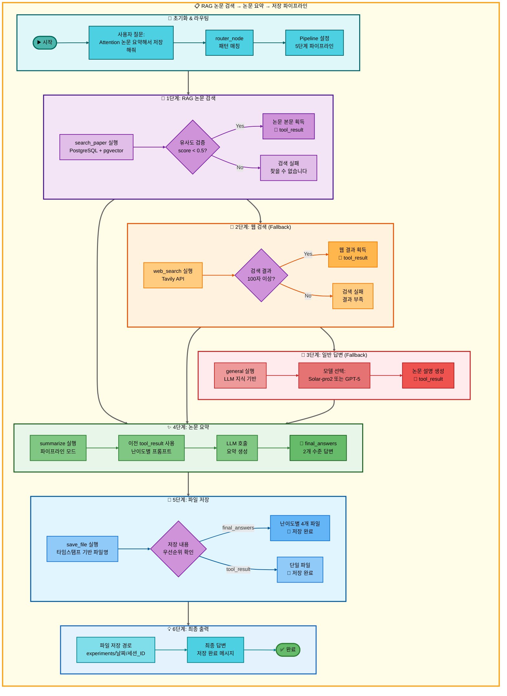

# 삼중 요청: RAG 논문 검색 → 논문 요약 → 저장 아키텍처

## 📋 문서 정보
- **작성일**: 2025-11-07
- **작성자**: 최현화[팀장]
- **프로젝트명**: 논문 리뷰 챗봇 (AI Agent + RAG)
- **팀명**: 연결의 민족
- **문서 버전**: 1.0

---

## 📑 목차
1. [시나리오 개요](#시나리오-개요)
2. [사용자 요청 분석](#사용자-요청-분석)
3. [도구 자동 전환 및 Fallback](#도구-자동-전환-및-fallback)
4. [단순 흐름 아키텍처](#단순-흐름-아키텍처)
5. [상세 기능 동작 흐름도](#상세-기능-동작-흐름도)
6. [전체 흐름 요약 표](#전체-흐름-요약-표)
7. [동작 설명 (초보 개발자용)](#동작-설명-초보-개발자용)
8. [실행 예시](#실행-예시)
9. [핵심 포인트](#핵심-포인트)

---

## 📌 시나리오 개요

### 다중 요청의 목적

사용자가 논문을 검색하고, 요약한 후, 결과를 파일로 저장하고 싶을 때, 세 가지 도구를 순차적으로 실행하여 한 번에 처리합니다.

**실행되는 도구 순서:**
```
1단계: search_paper (RAG 논문 검색)
  ↓ 실패 시
2단계: web_search (웹 논문 검색)
  ↓ 실패 시
3단계: general (일반 답변 - LLM 지식 기반)
  ↓ 성공 시
4단계: summarize (논문 요약)
  ↓ 성공 시
5단계: save_file (파일 저장)
```

**사용자 요청 예시:**
- "Attention 논문 요약해서 저장해줘"
- "BERT 논문 정리하고 저장해줘"
- "Transformer 논문 찾아서 요약하고 저장해줘"

---

## 📋 사용자 요청 분석

### 정확한 사용자 질문 예시

**예시 1: "Attention 논문 요약해서 저장해줘"**
- **키워드 분석**:
  - `논문`: 논문 검색 필요
  - `요약`: 요약 작업 필요
  - `저장`: 파일 저장 필요
  - 시간 키워드 없음 (`최신`, `2024년` 등): RAG 검색 우선

**예시 2: "BERT 논문 정리하고 저장해줘"**
- **키워드 분석**:
  - `논문`: 논문 검색 필요
  - `정리`: 요약 작업 필요
  - `저장`: 파일 저장 필요

### 도구 선택 근거

**패턴 매칭 방식 (src/agent/nodes.py:75-130)**

`configs/multi_request_patterns.yaml` 파일의 패턴을 기반으로 자동 감지:

```yaml
- keywords:
  - 논문
  - 요약
  - 저장
  tools:
  - search_paper
  - web_search
  - general
  - summarize
  - save_file
  description: 논문 검색, 요약 후 저장 (5단계 파이프라인)
  priority: 100
```

**매칭 로직:**
1. 질문에 `논문` AND `요약` AND `저장` 키워드 모두 포함
2. 자동으로 5단계 파이프라인 설정: `[search_paper, web_search, general, summarize, save_file]`

**AgentState 설정 (src/agent/nodes.py:117-129):**
```python
state["tool_pipeline"] = ["search_paper", "web_search", "general", "summarize", "save_file"]
state["tool_choice"] = "search_paper"  # 첫 번째 도구
state["pipeline_index"] = 1            # 실행 후 인덱스
state["routing_method"] = "pattern_based"
state["routing_reason"] = "패턴 매칭: 논문 검색, 요약 후 저장 (5단계 파이프라인)"
state["pipeline_description"] = "순차 실행: search_paper → web_search → general → summarize → save_file"
```

---

## 🔄 도구 자동 전환 및 Fallback

### 전체 Fallback 체인

```
사용자: "Attention 논문 요약해서 저장해줘"
↓
[1단계] RAG 논문 검색 (search_paper)
├─ ✅ 성공 (유사도 점수 < 0.5)
│   └─ 논문 본문 획득 → [4단계] 요약으로 직행 (web_search, general 스킵)
│
└─ ❌ 실패 (유사도 낮음 또는 결과 없음)
    ↓
    [2단계] 웹 논문 검색 (web_search)
    ├─ ✅ 성공 (Tavily API로 웹 검색 성공, 100자 이상)
    │   └─ 웹 검색 결과 획득 → [4단계] 요약으로 직행 (general 스킵)
    │
    └─ ❌ 실패 (검색 결과 부족 또는 API 오류)
        ↓
        [3단계] 일반 답변 (general)
        ├─ ✅ 성공 (LLM 지식으로 논문 설명)
        │   └─ LLM 설명 텍스트 획득 → [4단계] 요약으로 진행
        │
        └─ ❌ 실패 (불가능: general은 항상 성공)
            └─ [4단계] 요약으로 진행
↓
[4단계] 논문 요약 (summarize)
├─ ✅ 성공 (이전 단계 결과를 난이도별 프롬프트로 요약)
│   └─ final_answers 생성 → [5단계] 저장으로 진행
│
└─ ❌ 실패 (LLM API 오류 등)
    └─ 일반 답변 (general)으로 Fallback
        └─ "요약을 생성할 수 없습니다" 메시지 → [5단계] 저장으로 진행
↓
[5단계] 파일 저장 (save_file)
├─ ✅ 성공 (항상 성공)
│   ├─ final_answers 있음 → 난이도별 파일 4개 저장
│   │   - elementary: 날짜_시간_response_번호_elementary.md
│   │   - beginner: 날짜_시간_response_번호_beginner.md
│   │   - intermediate: 날짜_시간_response_번호_intermediate.md
│   │   - advanced: 날짜_시간_response_번호_advanced.md
│   │
│   └─ final_answers 없음 → tool_result 저장
│       - 날짜_시간_response_번호.md
│
└─ ❌ 실패 (불가능: save_file은 항상 성공)
    └─ 최악의 경우 "저장할 내용이 없습니다." 저장
```

### 성공 시나리오별 흐름

**시나리오 A: RAG 검색 성공 → 요약 → 저장**
```
search_paper (성공) → summarize (요약) → save_file (저장)
     ↓                      ↓                   ↓
tool_result:           final_answers:       파일 저장:
논문 본문 (1500자)    난이도별 2개 답변    실험 폴더/outputs/
                                           4개 파일 (난이도별)
(web_search, general 스킵)
```

**시나리오 B: RAG 실패 → 웹 검색 성공 → 요약 → 저장**
```
search_paper (실패) → web_search (성공) → summarize (요약) → save_file (저장)
                           ↓                    ↓                   ↓
                      tool_result:         final_answers:       파일 저장:
                      웹 검색 결과         난이도별 2개 답변    4개 파일
(general 스킵)
```

**시나리오 C: RAG/웹 모두 실패 → 일반 답변 → 요약 → 저장**
```
search_paper (실패) → web_search (실패) → general (성공) → summarize (요약) → save_file (저장)
                                               ↓                 ↓                   ↓
                                          tool_result:      final_answers:       파일 저장:
                                          LLM 답변         난이도별 2개 답변    4개 파일
```

**시나리오 D: 요약 실패 → 일반 답변 → 저장**
```
search_paper/web_search/general (성공) → summarize (실패) → general (Fallback) → save_file (저장)
                                                                  ↓                   ↓
                                                             tool_result:         파일 저장:
                                                             "요약 불가"          1개 파일
```

### 스킵 로직 상세 (src/agent/graph.py:333-354)

**RAG 검색 성공 시 스킵:**
```python
# search_paper 성공 시: web_search, general 스킵하고 summarize로 이동
if last_tool == "search_paper" and tool_result and "찾을 수 없습니다" not in tool_result:
    if "summarize" in tool_pipeline[pipeline_index:]:
        summarize_index = tool_pipeline.index("summarize", pipeline_index)
        state["pipeline_index"] = summarize_index
        # pipeline_index: 1 → 3 (web_search, general 스킵)
```

**웹 검색 성공 시 스킵:**
```python
# web_search 성공 시: general 스킵하고 summarize로 이동
elif last_tool == "web_search" and tool_result and len(tool_result) > 100:
    if "summarize" in tool_pipeline[pipeline_index:]:
        summarize_index = tool_pipeline.index("summarize", pipeline_index)
        state["pipeline_index"] = summarize_index
        # pipeline_index: 2 → 3 (general 스킵)
```

### Fallback 전환 메커니즘 (src/agent/nodes.py:469-548)

**도구 실패 감지 (src/agent/tool_wrapper.py):**
```python
# tool_wrapper가 각 도구 실행 후 상태 자동 설정
tool_status = state.get("tool_status", "success")  # "success" | "failed" | "partial" | "error"
```

**Fallback Router 동작 (src/agent/nodes.py:469-548):**
```python
# 파이프라인 모드: 실패한 도구를 Fallback 도구로 교체
TOOL_FALLBACKS = {
    "search_paper": "web_search",
    "web_search": "general",
    "glossary": "general",
    "summarize": "general",
    "text2sql": "general"
}

failed_tool = state.get("tool_choice")
fallback_tool = TOOL_FALLBACKS.get(failed_tool)

if fallback_tool:
    # 파이프라인에서 실패한 도구를 Fallback 도구로 교체
    current_index = pipeline_index - 1
    tool_pipeline[current_index] = fallback_tool
    state["tool_pipeline"] = tool_pipeline
    state["tool_choice"] = fallback_tool
```

---

## 📊 단순 흐름 아키텍처



---

## 🔧 상세 기능 동작 흐름도

```mermaid
graph TB
    subgraph MainFlow["📋 RAG 논문 검색 → 논문 요약 → 저장 상세 흐름"]
        direction TB

        subgraph Init["🔸 초기화"]
            direction LR
            A[main.py] --> B[chat_interface.py]
            B --> C[AgentState 초기화]
            C --> D[router_node 호출]
        end

        subgraph Pattern["🔹 패턴 매칭"]
            direction LR
            E[multi_request_patterns.yaml] --> F{키워드 매칭<br/>논문 + 요약 + 저장?}
            F -->|Yes| G[tool_pipeline 설정<br/>5단계 파이프라인]
            F -->|No| H[LLM 라우팅]
            H --> G
        end

        subgraph Search1["🔺 RAG 검색 도구"]
            direction LR
            I[search_paper_node] --> J[RAGRetriever 초기화]
            J --> K[벡터 검색<br/>pgvector]
            K --> L[키워드 검색<br/>PostgreSQL FTS]
            L --> M[하이브리드 병합<br/>70% + 30%]
            M --> N{유사도<br/>< 0.5?}
            N -->|Yes| O[💾 tool_result<br/>논문 본문]
            N -->|No| P[tool_status: failed]
        end

        subgraph Search2["🔶 웹 검색 도구 (Fallback)"]
            direction LR
            Q[web_search_node] --> R[Tavily API<br/>호출]
            R --> S[결과 포매팅]
            S --> T{결과<br/>> 100자?}
            T -->|Yes| U[💾 tool_result<br/>웹 결과]
            T -->|No| V[tool_status: failed]
        end

        subgraph Search3["✨ 일반 답변 도구 (Fallback)"]
            direction LR
            W[general_answer_node] --> X[난이도 매핑<br/>easy 또는 hard]
            X --> Y[LLM 호출 2회<br/>Solar-pro2 또는 GPT-5]
            Y --> Z[💾 tool_result<br/>LLM 답변]
        end

        subgraph Router["🔷 Pipeline Router"]
            direction LR
            AA[check_pipeline] --> AB{tool_status?}
            AB -->|success| AC[pipeline_router]
            AB -->|failed| AD[fallback_router]
            AC --> AE{스킵 로직}
            AE -->|검색 성공| AF[summarize 직행]
            AE -->|검색 실패| AG[다음 도구]
            AD --> AH[TOOL_FALLBACKS<br/>도구 교체 매핑]
        end

        subgraph Summarize["💾 논문 요약 도구"]
            direction LR
            AI[summarize_node] --> AJ{파이프라인<br/>모드?}
            AJ -->|Yes| AK[이전 tool_result 사용]
            AJ -->|No| AL[논문 제목 추출<br/>DB 검색]
            AK --> AM[난이도별 프롬프트]
            AL --> AM
            AM --> AN[LLM 호출]
            AN --> AO[💾 final_answers<br/>2개 수준]
        end

        subgraph Save["🔵 파일 저장 도구"]
            direction LR
            AP[save_file_node] --> AQ{저장 우선순위<br/>확인}
            AQ -->|1순위| AR[💾 final_answers<br/>4개 파일]
            AQ -->|2순위| AS[💾 tool_result<br/>1개 파일]
            AR --> AT[파일명 생성<br/>timestamp + counter]
            AS --> AT
            AT --> AU[파일 쓰기<br/>experiments/outputs/]
        end

        subgraph Output["💡 최종 출력"]
            direction LR
            AV[chat_interface.py] --> AW[파일 경로 표시<br/>저장 완료 메시지]
            AW --> AX([✅ 완료])
        end

        %% 단계 간 연결
        Init --> Pattern
        Pattern --> Search1
        Search1 --> Router
        Router --> Search2
        Router --> Search3
        Router --> Summarize
        Search2 --> Router
        Search3 --> Router
        Summarize --> Save
        Save --> Output
    end

    %% 메인 워크플로우 배경
    style MainFlow fill:#fffde7,stroke:#f9a825,stroke-width:4px,color:#000

    %% Subgraph 스타일
    style Init fill:#e0f7fa,stroke:#006064,stroke-width:3px,color:#000
    style Pattern fill:#e1f5ff,stroke:#01579b,stroke-width:3px,color:#000
    style Search1 fill:#f3e5f5,stroke:#4a148c,stroke-width:3px,color:#000
    style Search2 fill:#fff3e0,stroke:#e65100,stroke-width:3px,color:#000
    style Search3 fill:#ffebee,stroke:#c62828,stroke-width:3px,color:#000
    style Router fill:#fce4ec,stroke:#880e4f,stroke-width:3px,color:#000
    style Summarize fill:#e8f5e9,stroke:#1b5e20,stroke-width:3px,color:#000
    style Save fill:#e3f2fd,stroke:#1565c0,stroke-width:3px,color:#000
    style Output fill:#f1f8e9,stroke:#558b2f,stroke-width:3px,color:#000

    %% 노드 스타일 (초기화 - 청록 계열)
    style A fill:#4dd0e1,stroke:#006064,stroke-width:2px,color:#000
    style B fill:#4dd0e1,stroke:#006064,stroke-width:2px,color:#000
    style C fill:#4dd0e1,stroke:#006064,stroke-width:2px,color:#000
    style D fill:#4dd0e1,stroke:#006064,stroke-width:2px,color:#000

    %% 노드 스타일 (패턴 - 파랑 계열)
    style E fill:#90caf9,stroke:#1976d2,stroke-width:2px,color:#000
    style F fill:#ce93d8,stroke:#7b1fa2,stroke-width:2px,color:#000
    style G fill:#64b5f6,stroke:#1976d2,stroke-width:2px,color:#000
    style H fill:#90caf9,stroke:#1976d2,stroke-width:2px,color:#000

    %% 노드 스타일 (RAG 검색 - 보라 계열)
    style I fill:#e1bee7,stroke:#7b1fa2,stroke-width:2px,color:#000
    style J fill:#e1bee7,stroke:#7b1fa2,stroke-width:2px,color:#000
    style K fill:#e1bee7,stroke:#7b1fa2,stroke-width:2px,color:#000
    style L fill:#e1bee7,stroke:#7b1fa2,stroke-width:2px,color:#000
    style M fill:#ce93d8,stroke:#6a1b9a,stroke-width:2px,color:#000
    style N fill:#ce93d8,stroke:#7b1fa2,stroke-width:2px,color:#000
    style O fill:#ce93d8,stroke:#6a1b9a,stroke-width:2px,color:#000
    style P fill:#e1bee7,stroke:#7b1fa2,stroke-width:2px,color:#000

    %% 노드 스타일 (웹 검색 - 주황 계열)
    style Q fill:#ffcc80,stroke:#f57c00,stroke-width:2px,color:#000
    style R fill:#ffb74d,stroke:#f57c00,stroke-width:2px,color:#000
    style S fill:#ffcc80,stroke:#f57c00,stroke-width:2px,color:#000
    style T fill:#ce93d8,stroke:#7b1fa2,stroke-width:2px,color:#000
    style U fill:#ffb74d,stroke:#f57c00,stroke-width:2px,color:#000
    style V fill:#ffcc80,stroke:#f57c00,stroke-width:2px,color:#000

    %% 노드 스타일 (일반 답변 - 빨강 계열)
    style W fill:#ef9a9a,stroke:#c62828,stroke-width:2px,color:#000
    style X fill:#e57373,stroke:#c62828,stroke-width:2px,color:#000
    style Y fill:#ef9a9a,stroke:#c62828,stroke-width:2px,color:#000
    style Z fill:#ef5350,stroke:#b71c1c,stroke-width:2px,color:#000

    %% 노드 스타일 (Router - 핑크 계열)
    style AA fill:#f8bbd0,stroke:#880e4f,stroke-width:2px,color:#000
    style AB fill:#ce93d8,stroke:#7b1fa2,stroke-width:2px,color:#000
    style AC fill:#f8bbd0,stroke:#880e4f,stroke-width:2px,color:#000
    style AD fill:#f48fb1,stroke:#880e4f,stroke-width:2px,color:#000
    style AE fill:#ce93d8,stroke:#7b1fa2,stroke-width:2px,color:#000
    style AF fill:#f48fb1,stroke:#880e4f,stroke-width:2px,color:#000
    style AG fill:#f48fb1,stroke:#880e4f,stroke-width:2px,color:#000
    style AH fill:#f8bbd0,stroke:#880e4f,stroke-width:2px,color:#000

    %% 노드 스타일 (요약 - 녹색 계열)
    style AI fill:#81c784,stroke:#2e7d32,stroke-width:2px,color:#000
    style AJ fill:#ce93d8,stroke:#7b1fa2,stroke-width:2px,color:#000
    style AK fill:#81c784,stroke:#2e7d32,stroke-width:2px,color:#000
    style AL fill:#81c784,stroke:#2e7d32,stroke-width:2px,color:#000
    style AM fill:#81c784,stroke:#2e7d32,stroke-width:2px,color:#000
    style AN fill:#81c784,stroke:#2e7d32,stroke-width:2px,color:#000
    style AO fill:#66bb6a,stroke:#1b5e20,stroke-width:2px,color:#000

    %% 노드 스타일 (저장 - 파랑 계열)
    style AP fill:#90caf9,stroke:#1976d2,stroke-width:2px,color:#000
    style AQ fill:#ce93d8,stroke:#7b1fa2,stroke-width:2px,color:#000
    style AR fill:#64b5f6,stroke:#1976d2,stroke-width:2px,color:#000
    style AS fill:#90caf9,stroke:#1976d2,stroke-width:2px,color:#000
    style AT fill:#64b5f6,stroke:#1976d2,stroke-width:2px,color:#000
    style AU fill:#64b5f6,stroke:#1976d2,stroke-width:2px,color:#000

    %% 노드 스타일 (출력 - 연두 계열)
    style AV fill:#aed581,stroke:#558b2f,stroke-width:2px,color:#000
    style AW fill:#9ccc65,stroke:#558b2f,stroke-width:2px,color:#000
    style AX fill:#66bb6a,stroke:#2e7d32,stroke-width:3px,color:#000

    %% 연결선 스타일 (초기화 0~2)
    linkStyle 0 stroke:#006064,stroke-width:2px
    linkStyle 1 stroke:#006064,stroke-width:2px
    linkStyle 2 stroke:#006064,stroke-width:2px

    %% 연결선 스타일 (패턴 3~6)
    linkStyle 3 stroke:#01579b,stroke-width:2px
    linkStyle 4 stroke:#01579b,stroke-width:2px
    linkStyle 5 stroke:#01579b,stroke-width:2px
    linkStyle 6 stroke:#01579b,stroke-width:2px

    %% 연결선 스타일 (RAG 검색 7~13)
    linkStyle 7 stroke:#7b1fa2,stroke-width:2px
    linkStyle 8 stroke:#7b1fa2,stroke-width:2px
    linkStyle 9 stroke:#7b1fa2,stroke-width:2px
    linkStyle 10 stroke:#7b1fa2,stroke-width:2px
    linkStyle 11 stroke:#7b1fa2,stroke-width:2px
    linkStyle 12 stroke:#7b1fa2,stroke-width:2px
    linkStyle 13 stroke:#7b1fa2,stroke-width:2px

    %% 연결선 스타일 (웹 검색 14~18)
    linkStyle 14 stroke:#e65100,stroke-width:2px
    linkStyle 15 stroke:#e65100,stroke-width:2px
    linkStyle 16 stroke:#e65100,stroke-width:2px
    linkStyle 17 stroke:#e65100,stroke-width:2px
    linkStyle 18 stroke:#e65100,stroke-width:2px

    %% 연결선 스타일 (일반 답변 19~21)
    linkStyle 19 stroke:#c62828,stroke-width:2px
    linkStyle 20 stroke:#c62828,stroke-width:2px
    linkStyle 21 stroke:#c62828,stroke-width:2px

    %% 연결선 스타일 (Router 22~28)
    linkStyle 22 stroke:#880e4f,stroke-width:2px
    linkStyle 23 stroke:#880e4f,stroke-width:2px
    linkStyle 24 stroke:#880e4f,stroke-width:2px
    linkStyle 25 stroke:#880e4f,stroke-width:2px
    linkStyle 26 stroke:#880e4f,stroke-width:2px
    linkStyle 27 stroke:#880e4f,stroke-width:2px
    linkStyle 28 stroke:#880e4f,stroke-width:2px

    %% 연결선 스타일 (요약 29~35)
    linkStyle 29 stroke:#2e7d32,stroke-width:2px
    linkStyle 30 stroke:#2e7d32,stroke-width:2px
    linkStyle 31 stroke:#2e7d32,stroke-width:2px
    linkStyle 32 stroke:#2e7d32,stroke-width:2px
    linkStyle 33 stroke:#2e7d32,stroke-width:2px
    linkStyle 34 stroke:#2e7d32,stroke-width:2px
    linkStyle 35 stroke:#2e7d32,stroke-width:2px

    %% 연결선 스타일 (저장 36~40)
    linkStyle 36 stroke:#1565c0,stroke-width:2px
    linkStyle 37 stroke:#1565c0,stroke-width:2px
    linkStyle 38 stroke:#1565c0,stroke-width:2px
    linkStyle 39 stroke:#1565c0,stroke-width:2px
    linkStyle 40 stroke:#1565c0,stroke-width:2px

    %% 연결선 스타일 (출력 41~42)
    linkStyle 41 stroke:#558b2f,stroke-width:2px
    linkStyle 42 stroke:#558b2f,stroke-width:2px

    %% 단계 간 연결 (회색 43~51)
    linkStyle 43 stroke:#616161,stroke-width:3px
    linkStyle 44 stroke:#616161,stroke-width:3px
    linkStyle 45 stroke:#616161,stroke-width:3px
    linkStyle 46 stroke:#616161,stroke-width:3px
    linkStyle 47 stroke:#616161,stroke-width:3px
    linkStyle 48 stroke:#616161,stroke-width:3px
    linkStyle 49 stroke:#616161,stroke-width:3px
    linkStyle 50 stroke:#616161,stroke-width:3px
    linkStyle 51 stroke:#616161,stroke-width:3px
```



---

## 📋 전체 흐름 요약 표

| 단계 | 도구명 | 파일명 | 메서드명 | 동작 설명 | 입력 | 출력 | Fallback | 세션 저장 |
|------|--------|--------|----------|-----------|------|------|----------|----------|
| 0 | 라우팅 | src/agent/nodes.py | router_node() | 패턴 매칭으로 다중 요청 감지 | question: "Attention 논문 요약해서 저장해줘" | tool_pipeline: [search_paper, web_search, general, summarize, save_file], tool_choice: search_paper | 없음 | tool_pipeline, pipeline_index=1 |
| 1 | RAG 논문 검색 | src/tools/search_paper.py | search_paper_node() | PostgreSQL + pgvector 하이브리드 검색 | question, difficulty | tool_result: 논문 본문 (성공) 또는 "찾을 수 없습니다" (실패) | web_search | tool_result, tool_status |
| 1-S | 스킵 로직 | src/agent/graph.py | pipeline_router() | search_paper 성공 시 web_search, general 스킵 | tool_pipeline, pipeline_index=1, tool_result | pipeline_index=3 (summarize 위치) | 없음 | pipeline_index |
| 1-F1 | 웹 논문 검색 | src/tools/web_search.py | web_search_node() | Tavily API로 웹 검색 | question, difficulty | tool_result: 웹 검색 결과 (성공) 또는 빈 결과 (실패) | general | tool_result, tool_status |
| 1-F1-S | 스킵 로직 | src/agent/graph.py | pipeline_router() | web_search 성공 시 general 스킵 | tool_pipeline, pipeline_index=2, tool_result | pipeline_index=3 (summarize 위치) | 없음 | pipeline_index |
| 1-F2 | 일반 답변 | src/tools/general_answer.py | general_answer_node() | LLM 지식으로 논문 설명 | question, difficulty | tool_result: LLM 답변 (항상 성공) | 없음 | tool_result, final_answers |
| 2 | 논문 요약 | src/tools/summarize.py | summarize_node() | 이전 도구 결과를 난이도별 프롬프트로 요약 | tool_result (from step 1), difficulty | final_answers: {elementary: "...", beginner: "..."} 또는 {intermediate: "...", advanced: "..."} | general | final_answers, tool_result |
| 2-F | 일반 답변 | src/tools/general_answer.py | general_answer_node() | 요약 실패 시 "요약 불가" 메시지 생성 | question, difficulty | final_answers: 요약 불가 메시지 | 없음 | final_answers |
| 3 | 파일 저장 | src/tools/save_file.py | save_file_node() | final_answers를 난이도별 파일로 저장 | final_answers, tool_result, tool_pipeline, pipeline_index | final_answer: "파일이 성공적으로 저장되었습니다.\n파일 경로: ..." | 없음 | save_counter, final_answer |

**Pipeline Index 변화:**
- 초기: `pipeline_index = 1` (첫 도구 실행 후)
- search_paper 성공 → `pipeline_index = 3` (summarize 직행)
- search_paper 실패 → web_search 실행 → `pipeline_index = 2`
- web_search 성공 → `pipeline_index = 3` (summarize 직행)
- web_search 실패 → general 실행 → `pipeline_index = 3`
- summarize 실행 → `pipeline_index = 4`
- save_file 실행 → `pipeline_index = 5` (종료)

---

## 🔍 동작 설명 (초보 개발자용)

### 1단계: 사용자 요청 접수 및 패턴 매칭

**파일:** `ui/components/chat_interface.py` → `main.py:run_agent()` → `src/agent/nodes.py:router_node()`

사용자가 "Attention 논문 요약해서 저장해줘"를 입력하면:

1. **AgentState 초기화:**
   ```python
   state = {
       "question": "Attention 논문 요약해서 저장해줘",
       "difficulty": "easy",  # 또는 "hard"
       "messages": [HumanMessage(content="Attention 논문 요약해서 저장해줘")],
       "save_counter": 0  # 저장 카운터 초기화
   }
   ```

2. **패턴 파일 로드 (src/agent/nodes.py:77):**
   ```python
   multi_request_patterns = get_multi_request_patterns()
   # configs/multi_request_patterns.yaml 로드
   ```

3. **패턴 매칭 (src/agent/nodes.py:84-100):**
   ```python
   for pattern in multi_request_patterns:
       keywords = ["논문", "요약", "저장"]
       tools = ["search_paper", "web_search", "general", "summarize", "save_file"]

       # AND 로직: 모든 키워드 포함?
       keywords_match = all(kw in question for kw in keywords)  # True

       if keywords_match:
           # 매칭 성공!
           state["tool_pipeline"] = tools
           state["tool_choice"] = tools[0]  # "search_paper"
           state["pipeline_index"] = 1
           break
   ```

### 2단계: RAG 논문 검색 실행

**파일:** `src/tools/search_paper.py:search_paper_node()`

**동작은 이전 문서와 동일 (하이브리드 검색):**

1. **벡터 검색**: OpenAI Embeddings + pgvector similarity/MMR 검색
2. **키워드 검색**: PostgreSQL Full-Text Search
3. **하이브리드 병합**: 70% 벡터 + 30% 키워드
4. **유사도 검증**: score < 0.5 임계값 확인

**성공 시:**
```python
state["tool_result"] = formatted_result  # 논문 본문
state["tool_status"] = "success"
```

**실패 시:**
```python
state["tool_result"] = "관련 논문을 찾을 수 없습니다."
state["tool_status"] = "failed"
```

### 3단계: Pipeline Router - 다음 도구 결정

**파일:** `src/agent/graph.py:291-362`

**3-1. 성공 시: 스킵 로직 적용 (graph.py:325-362):**
```python
def pipeline_router(state: AgentState, exp_manager=None):
    tool_pipeline = state.get("tool_pipeline", [])
    pipeline_index = state.get("pipeline_index", 0)  # 1
    tool_result = state.get("tool_result", "")
    last_tool = tool_pipeline[pipeline_index - 1]  # "search_paper"

    # search_paper 성공 시: web_search, general 스킵
    if last_tool == "search_paper" and tool_result and "찾을 수 없습니다" not in tool_result:
        if "summarize" in tool_pipeline[pipeline_index:]:
            summarize_index = tool_pipeline.index("summarize", pipeline_index)
            state["pipeline_index"] = summarize_index  # 1 → 3

    # 다음 도구 선택
    next_tool = tool_pipeline[state["pipeline_index"]]  # "summarize"
    state["tool_choice"] = next_tool
    state["pipeline_index"] += 1  # 3 → 4

    return state
```

**3-2. 실패 시: Fallback Router (nodes.py:469-548):**
```python
def fallback_router_node(state: AgentState, exp_manager=None):
    failed_tool = state.get("tool_choice")  # "search_paper"
    tool_pipeline = state.get("tool_pipeline", [])
    pipeline_index = state.get("pipeline_index", 0)  # 1

    # Fallback 매핑
    TOOL_FALLBACKS = {
        "search_paper": "web_search",
        "web_search": "general",
        "summarize": "general"
    }

    fallback_tool = TOOL_FALLBACKS.get(failed_tool)  # "web_search"

    if fallback_tool:
        # 파이프라인에서 실패한 도구를 교체
        current_index = pipeline_index - 1  # 0
        tool_pipeline[current_index] = fallback_tool
        state["tool_pipeline"] = tool_pipeline
        state["tool_choice"] = fallback_tool

    return state
```

### 4단계: 논문 요약 실행

**파일:** `src/tools/summarize.py:summarize_node()`

**4-1. 파이프라인 모드 확인 (summarize.py:53-60):**
```python
tool_pipeline = state.get("tool_pipeline", [])
pipeline_index = state.get("pipeline_index", 0)  # 4
tool_result = state.get("tool_result", "")

# 파이프라인 실행 중이고 이전 도구 결과가 있음
if tool_pipeline and pipeline_index > 1 and tool_result:
    # 이전 결과를 바로 요약
    content_to_summarize = tool_result
```

**4-2. 난이도별 요약 (summarize.py:72-110):**
```python
if difficulty == "easy":
    system_content = """당신은 논문을 쉽게 설명하는 친절한 AI 어시스턴트입니다.
답변 규칙:
- 핵심 아이디어를 3-5개 포인트로 정리하세요
- 전문 용어는 쉬운 말로 풀어서 설명하세요"""
else:  # hard
    system_content = """당신은 논문을 기술적으로 분석하는 전문 연구자입니다.
답변 규칙:
- 연구 배경, 방법론, 결과, 기여도 체계적으로 요약
- 기술적 세부사항 포함"""

# LLM 호출
messages = [SystemMessage(content=system_content), HumanMessage(content=f"요약: {content_to_summarize}")]
response = llm_client.llm.invoke(messages)
summary = response.content

# 상태 업데이트
state["final_answers"] = {
    "elementary": summary,
    "beginner": summary
}
```

### 5단계: 파일 저장 실행

**파일:** `src/tools/save_file.py:save_file_node()`

**5-1. 저장 내용 우선순위 확인 (save_file.py:69-150):**
```python
# 우선순위 0: final_answers (난이도별 다중 답변)
final_answers = state.get("final_answers", {})
if final_answers and isinstance(final_answers, dict) and len(final_answers) > 0:
    # 난이도별 파일 4개 저장
    for level, content in final_answers.items():
        timestamp = datetime.now().strftime("%Y%m%d_%H%M%S")
        save_counter = state.get("save_counter", 0) + 1
        filename = f"{timestamp}_response_{save_counter}_{level}.md"

        if exp_manager:
            file_path = exp_manager.save_output(filename, content)
        else:
            with open(os.path.join("outputs", filename), 'w') as f:
                f.write(content)
```

**5-2. 성공 메시지 구성:**
```python
answer = f"""난이도별 답변이 각각 저장되었습니다.
저장된 파일:
- 초등학생용(8-13세): {file_path_elementary}
- 초급자용(14-22세): {file_path_beginner}
- 중급자용(23-30세): {file_path_intermediate}
- 고급자용(30세 이상): {file_path_advanced}"""

state["final_answer"] = answer
```

### 6단계: 최종 결과 반환

**파일:** `ui/components/chat_interface.py`

```python
# AgentState에서 최종 답변 추출
final_answer = result.get("final_answer", "")

# UI에 표시
st.success(final_answer)
```

---

## 💡 실행 예시

### 예시 1: RAG 검색 성공 → 요약 → 저장

**사용자 질문:**
```
Attention 논문 요약해서 저장해줘
```

**1단계: RAG 논문 검색 실행**
```
[search_paper] PostgreSQL + pgvector 검색 실행
↓
검색 결과: "Attention Is All You Need" 논문 발견
유사도 점수: 0.28 (< 0.5 임계값)
↓
tool_result: "## Attention Is All You Need\n\n**저자:** Ashish Vaswani..."
tool_status: "success"
```

**2단계: 스킵 로직 적용**
```
[pipeline_router] search_paper 성공 확인
↓
pipeline_index: 1 → 3 (summarize 위치로 직행)
web_search, general 스킵
```

**3단계: 논문 요약 실행**
```
[summarize] 파이프라인 모드 확인
↓
이전 도구 결과 사용: tool_result (논문 본문)
↓
난이도별 LLM 호출:
- easy: Solar-pro2 모델 (한국어 특화)
- hard: GPT-5 모델 (기술적 정확도)
↓
요약 결과:
{
  "elementary": "Transformer는 RNN 없이 Attention만으로 번역하는 신경망입니다...",
  "beginner": "Transformer는 Self-Attention 메커니즘을 핵심으로...",
  "intermediate": "Transformer는 인코더-디코더 아키텍처로...",
  "advanced": "Transformer는 self-attention과 cross-attention을 활용한..."
}
```

**4단계: 파일 저장 실행**
```
[save_file] 저장 내용 확인
↓
final_answers: {...} (있음, 4개 수준)
↓
난이도별 파일 4개 생성:
- 20251107_143022_response_1_elementary.md
- 20251107_143022_response_1_beginner.md
- 20251107_143022_response_1_intermediate.md
- 20251107_143022_response_1_advanced.md
↓
저장 위치: experiments/20251107/20251107_143022_session_003/outputs/
save_counter: 0 → 1
```

**저장된 파일 내용 (elementary.md):**
```markdown
Transformer는 RNN 없이 Attention만으로 번역하는 신경망입니다.
기존 모델보다 빠르고 정확하며, 병렬 처리가 가능합니다.

주요 특징:
1. Self-Attention으로 문장 전체를 한 번에 처리
2. 인코더-디코더 구조 (각 6개 레이어)
3. Multi-Head Attention으로 다양한 패턴 학습

한 줄 요약:
RNN 없이도 번역을 잘하는 빠른 신경망
```

**최종 출력:**
```
✅ 난이도별 답변이 각각 저장되었습니다.
저장된 파일:
- 초등학생용(8-13세): experiments/.../20251107_143022_response_1_elementary.md
- 초급자용(14-22세): experiments/.../20251107_143022_response_1_beginner.md
- 중급자용(23-30세): experiments/.../20251107_143022_response_1_intermediate.md
- 고급자용(30세 이상): experiments/.../20251107_143022_response_1_advanced.md
```

---

### 예시 2: RAG 실패 → 웹 검색 성공 → 요약 → 저장

**사용자 질문:**
```
Constitutional AI 논문 요약해서 저장해줘
```

**1단계: RAG 논문 검색 실패**
```
[search_paper] PostgreSQL + pgvector 검색 실행
↓
검색 결과: 유사도 점수 모두 > 0.5 (관련 논문 없음)
↓
tool_result: "관련 논문을 찾을 수 없습니다."
tool_status: "failed"
```

**2단계: Fallback Router - 웹 검색으로 전환**
```
[fallback_router] search_paper 실패 감지
↓
Fallback 도구 선택: "web_search"
↓
tool_pipeline 업데이트:
["search_paper", "web_search", "general", "summarize", "save_file"]
→ ["web_search", "web_search", "general", "summarize", "save_file"]
↓
tool_choice: "web_search"
```

**3단계: 웹 논문 검색 실행**
```
[web_search] Tavily API 호출
↓
검색 결과:
[{
  "title": "Constitutional AI: Harmlessness from AI Feedback",
  "url": "https://arxiv.org/abs/2212.08073",
  "content": "We propose a method for training AI systems..."
}]
↓
tool_result: "## Constitutional AI...\n\n**URL:** https://arxiv.org/abs/2212.08073..."
tool_status: "success"
```

**4단계: 스킵 로직 적용**
```
[pipeline_router] web_search 성공 확인
↓
pipeline_index: 2 → 3 (summarize 위치로 직행)
general 스킵
```

**5단계: 논문 요약 → 저장**
```
[summarize] 웹 검색 결과 요약
↓
[save_file] 난이도별 4개 파일 저장
↓
저장 위치: experiments/.../outputs/
```

**최종 출력:**
```
✅ 난이도별 답변이 각각 저장되었습니다.
저장된 파일:
- 초등학생용(8-13세): .../20251107_143022_response_2_elementary.md
- 초급자용(14-22세): .../20251107_143022_response_2_beginner.md
- 중급자용(23-30세): .../20251107_143022_response_2_intermediate.md
- 고급자용(30세 이상): .../20251107_143022_response_2_advanced.md
```

---

### 예시 3: RAG/웹 모두 실패 → 일반 답변 → 요약 → 저장

**사용자 질문:**
```
신경망 학습 논문 요약해서 저장해줘
```

**1단계: RAG 논문 검색 실패**
```
[search_paper] 검색 실패 (유사도 낮음)
↓
tool_status: "failed"
```

**2단계: 웹 검색 실패**
```
[web_search] Tavily API 호출
↓
검색 결과: 100자 미만 (신뢰할 수 없는 결과)
↓
tool_status: "failed"
```

**3단계: 일반 답변 실행**
```
[general] LLM 지식 기반 답변
↓
tool_result: "신경망 학습은 딥러닝의 핵심 과정으로, 역전파 알고리즘을 통해..."
tool_status: "success" (general은 항상 성공)
```

**4단계: 논문 요약 → 저장**
```
[summarize] 이전 도구 결과(general 답변) 요약
↓
[save_file] 난이도별 4개 파일 저장
```

**최종 출력:**
```
✅ 난이도별 답변이 각각 저장되었습니다.
저장된 파일:
- 초등학생용(8-13세): .../20251107_143022_response_3_elementary.md
- 초급자용(14-22세): .../20251107_143022_response_3_beginner.md
- 중급자용(23-30세): .../20251107_143022_response_3_intermediate.md
- 고급자용(30세 이상): .../20251107_143022_response_3_advanced.md
```

---

## 🎯 핵심 포인트

### 1. 5단계 파이프라인 설계

삼중 요청은 **최대 5단계 파이프라인**으로 설계:
```
search_paper → web_search → general → summarize → save_file
```

- **1-3단계**: 논문 검색 (3가지 방법 중 하나 성공)
- **4단계**: 요약 (검색 결과를 바탕으로 요약)
- **5단계**: 저장 (요약 결과를 파일로 저장)

### 2. 지능형 스킵 로직

검색 도구가 성공하면 나머지 검색 도구를 건너뜁니다:
- `search_paper` 성공 → `web_search`, `general` 스킵
- `web_search` 성공 → `general` 스킵

이를 통해 불필요한 API 호출을 줄이고 응답 속도를 향상시킵니다.

### 3. 난이도별 4개 파일 저장

`summarize` 도구는 난이도에 따라 **2개의 답변**을 생성하지만,
`save_file` 도구는 **4개의 파일**로 저장합니다:

**easy 모드:**
- elementary (초등학생용, 8-13세)
- beginner (초급자용, 14-22세)

**hard 모드:**
- intermediate (중급자용, 23-30세)
- advanced (고급자용, 30세 이상)

### 4. Fallback Chain 완전 보장

각 단계는 **최소 1개의 Fallback** 도구를 가집니다:
- **검색 단계**: `search_paper` → `web_search` → `general` (최종 보장)
- **요약 단계**: `summarize` → `general` (최종 보장)
- **저장 단계**: `save_file` (항상 성공, Fallback 불필요)

이를 통해 **어떤 상황에서도 답변 제공**이 보장됩니다.

### 5. 파이프라인 모드 vs 독립 실행

**summarize 도구는 두 가지 모드로 동작:**

**A. 파이프라인 모드 (pipeline_index > 1):**
- 이전 도구의 `tool_result`를 직접 사용
- 제목 추출 없이 바로 요약
- 빠른 실행

**B. 독립 실행 모드 (pipeline_index = 0):**
- 질문에서 제목 추출
- DB에서 논문 검색
- 청크 조회 후 요약

### 6. 타임스탬프 기반 파일명

파일명은 **자동 생성**되며 중복 없음:
```
형식: 날짜_시간_response_번호_난이도.md
예시: 20251107_143022_response_1_elementary.md
```

### 7. 세션별 저장 카운터

`save_counter`는 **세션별로 누적**:
- 첫 저장: save_counter = 1 (4개 파일)
- 두 번째 저장: save_counter = 2 (4개 파일)
- 세 번째 저장: save_counter = 3 (4개 파일)

이를 통해 같은 세션 내에서 파일명 중복을 방지합니다.

### 8. ExperimentManager 통합

운영 환경에서는 **ExperimentManager**를 통해 저장:
```
experiments/
└── 날짜/
    └── 세션_ID/
        └── outputs/       # 저장 위치
            ├── 20251107_143022_response_1_elementary.md
            ├── 20251107_143022_response_1_beginner.md
            ├── 20251107_143022_response_1_intermediate.md
            └── 20251107_143022_response_1_advanced.md
```

테스트 환경에서는 **outputs/ 디렉토리**에 직접 저장.

### 9. 모델 선택 전략

**easy 모드: Solar-pro2 (한국어 특화)**
- 한국어 이해도 높음
- 친근한 설명 톤
- 빠른 응답 속도

**hard 모드: GPT-5 (기술적 정확도)**
- 전문 용어 정확도
- 기술적 세부사항
- 비판적 분석

### 10. 데이터 파이프라인

`tool_result`와 `final_answers` 필드가 도구 간 데이터 전달의 핵심:
```
search_paper.tool_result → summarize.tool_result (input)
                         → summarize.final_answers (output)
                         → save_file.final_answers (input)
                         → save_file (4개 파일 저장)
```

---

**작성일**: 2025-11-07
**버전**: 1.0
