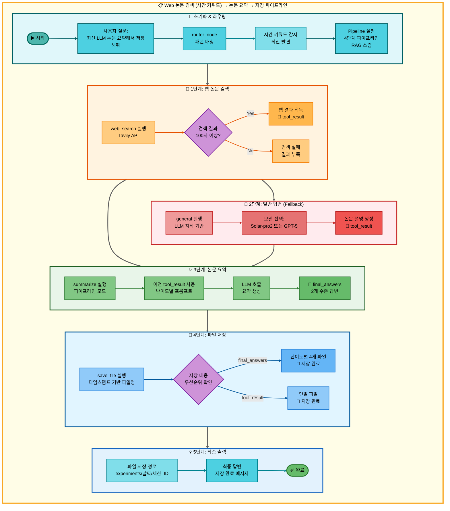

# 삼중 요청: Web 논문 검색 (시간 키워드) → 논문 요약 → 저장 아키텍처

## 📋 문서 정보
- **작성일**: 2025-11-07
- **작성자**: 최현화[팀장]
- **프로젝트명**: 논문 리뷰 챗봇 (AI Agent + RAG)
- **팀명**: 연결의 민족
- **문서 버전**: 1.0

---

## 📑 목차
1. [시나리오 개요](#시나리오-개요)
2. [사용자 요청 분석](#사용자-요청-분석)
3. [도구 자동 전환 및 Fallback](#도구-자동-전환-및-fallback)
4. [단순 흐름 아키텍처](#단순-흐름-아키텍처)
5. [상세 기능 동작 흐름도](#상세-기능-동작-흐름도)
6. [전체 흐름 요약 표](#전체-흐름-요약-표)
7. [동작 설명 (초보 개발자용)](#동작-설명-초보-개발자용)
8. [실행 예시](#실행-예시)
9. [핵심 포인트](#핵심-포인트)

---

## 📌 시나리오 개요

### 다중 요청의 목적

사용자가 **최신 논문**을 검색하고, 요약한 후, 결과를 파일로 저장하고 싶을 때, 시간 키워드를 감지하여 RAG 검색을 건너뛰고 웹 검색부터 시작합니다.

**실행되는 도구 순서:**
```
[시간 키워드 감지] 최신, 최근, 2024년, 2023년, 올해, 작년, latest, recent
↓
1단계: web_search (웹 논문 검색) - RAG 스킵
  ↓ 실패 시
2단계: general (일반 답변 - LLM 지식 기반)
  ↓ 성공 시
3단계: summarize (논문 요약)
  ↓ 성공 시
4단계: save_file (파일 저장)
```

**사용자 요청 예시:**
- "최신 LLM 논문 요약해서 저장해줘"
- "2024년 Transformer 논문 정리하고 저장해줘"
- "최근 AI 논문 찾아서 요약하고 저장해줘"
- "latest deep learning paper summarize and save"

---

## 📋 사용자 요청 분석

### 정확한 사용자 질문 예시

**예시 1: "최신 LLM 논문 요약해서 저장해줘"**
- **키워드 분석**:
  - `최신`: **시간 키워드** (RAG DB는 최신성 제한적 → 웹 검색 우선)
  - `논문`: 논문 검색 필요
  - `요약`: 요약 작업 필요
  - `저장`: 파일 저장 필요

**예시 2: "2024년 Transformer 논문 정리하고 저장해줘"**
- **키워드 분석**:
  - `2024년`: **시간 키워드** (특정 연도)
  - `논문`: 논문 검색 필요
  - `정리`: 요약 작업 필요
  - `저장`: 파일 저장 필요

**예시 3: "latest deep learning paper summarize and save"**
- **키워드 분석**:
  - `latest`: **시간 키워드** (영문)
  - `paper`: 논문 검색 필요
  - `summarize`: 요약 작업 필요
  - `save`: 파일 저장 필요

### 시간 키워드 감지 로직 (src/agent/nodes.py:180-195)

**시간 관련 키워드 목록:**
```python
TEMPORAL_KEYWORDS = [
    "최신", "최근", "최신의", "최근의",
    "2024년", "2023년", "올해", "작년",
    "latest", "recent", "new", "newest"
]

def has_temporal_keywords(question: str) -> bool:
    """질문에 시간 키워드가 포함되어 있는지 확인"""
    question_lower = question.lower()
    return any(keyword in question_lower for keyword in TEMPORAL_KEYWORDS)
```

**시간 키워드 감지 시 동작:**
```python
if has_temporal_keywords(question):
    # RAG 검색 건너뛰고 웹 검색부터 시작
    if "search_paper" in tool_pipeline:
        tool_pipeline.remove("search_paper")

    # 첫 번째 도구를 web_search로 설정
    if tool_pipeline and tool_pipeline[0] != "web_search":
        tool_pipeline.insert(0, "web_search")

    state["routing_reason"] = "시간 키워드 감지: 웹 검색 우선"
```

### 도구 선택 근거

**패턴 매칭 방식 (src/agent/nodes.py:75-130)**

`configs/multi_request_patterns.yaml` 파일의 패턴을 기반으로 자동 감지:

```yaml
- keywords:
  - 논문
  - 요약
  - 저장
  tools:
  - search_paper
  - web_search
  - general
  - summarize
  - save_file
  description: 논문 검색, 요약 후 저장 (5단계 파이프라인)
  priority: 100
```

**시간 키워드 감지 후 파이프라인 수정:**
```python
# 원본 파이프라인
tool_pipeline = ["search_paper", "web_search", "general", "summarize", "save_file"]

# 시간 키워드 감지 후
if has_temporal_keywords(question):
    tool_pipeline = ["web_search", "general", "summarize", "save_file"]
    # search_paper 제거됨
```

**AgentState 설정 (src/agent/nodes.py:117-129):**
```python
state["tool_pipeline"] = ["web_search", "general", "summarize", "save_file"]
state["tool_choice"] = "web_search"  # 첫 번째 도구
state["pipeline_index"] = 1           # 실행 후 인덱스
state["routing_method"] = "pattern_based + temporal_detection"
state["routing_reason"] = "시간 키워드 감지: 웹 검색 우선 (RAG 스킵)"
state["pipeline_description"] = "순차 실행: web_search → general → summarize → save_file"
```

---

## 🔄 도구 자동 전환 및 Fallback

### 전체 Fallback 체인

```
사용자: "최신 LLM 논문 요약해서 저장해줘"
↓
[시간 키워드 감지] "최신" 키워드 발견
↓ RAG 검색 건너뛰기
[1단계] 웹 논문 검색 (web_search)
├─ ✅ 성공 (Tavily API로 웹 검색 성공, 100자 이상)
│   └─ 웹 검색 결과 획득 → [3단계] 요약으로 직행 (general 스킵)
│
└─ ❌ 실패 (검색 결과 부족 또는 API 오류)
    ↓
    [2단계] 일반 답변 (general)
    ├─ ✅ 성공 (LLM 지식으로 논문 설명)
    │   └─ LLM 설명 텍스트 획득 → [3단계] 요약으로 진행
    │
    └─ ❌ 실패 (불가능: general은 항상 성공)
        └─ [3단계] 요약으로 진행
↓
[3단계] 논문 요약 (summarize)
├─ ✅ 성공 (이전 단계 결과를 난이도별 프롬프트로 요약)
│   └─ final_answers 생성 → [4단계] 저장으로 진행
│
└─ ❌ 실패 (LLM API 오류 등)
    └─ 일반 답변 (general)으로 Fallback
        └─ "요약을 생성할 수 없습니다" 메시지 → [4단계] 저장으로 진행
↓
[4단계] 파일 저장 (save_file)
├─ ✅ 성공 (항상 성공)
│   ├─ final_answers 있음 → 난이도별 파일 4개 저장
│   │   - elementary: 날짜_시간_response_번호_elementary.md
│   │   - beginner: 날짜_시간_response_번호_beginner.md
│   │   - intermediate: 날짜_시간_response_번호_intermediate.md
│   │   - advanced: 날짜_시간_response_번호_advanced.md
│   │
│   └─ final_answers 없음 → tool_result 저장
│       - 날짜_시간_response_번호.md
│
└─ ❌ 실패 (불가능: save_file은 항상 성공)
    └─ 최악의 경우 "저장할 내용이 없습니다." 저장
```

### 성공 시나리오별 흐름

**시나리오 A: 웹 검색 성공 → 요약 → 저장**
```
[시간 키워드 감지] → web_search (성공) → summarize (요약) → save_file (저장)
                           ↓                    ↓                   ↓
                      tool_result:         final_answers:       파일 저장:
                      웹 검색 결과         난이도별 2개 답변    4개 파일
(RAG 검색 건너뜀)         (general 스킵)
```

**시나리오 B: 웹 검색 실패 → 일반 답변 → 요약 → 저장**
```
[시간 키워드 감지] → web_search (실패) → general (성공) → summarize (요약) → save_file (저장)
                                               ↓                 ↓                   ↓
                                          tool_result:      final_answers:       파일 저장:
                                          LLM 답변         난이도별 2개 답변    4개 파일
```

**시나리오 C: 요약 실패 → 일반 답변 → 저장**
```
[시간 키워드 감지] → web_search/general (성공) → summarize (실패) → general (Fallback) → save_file (저장)
                                                                  ↓                   ↓
                                                             tool_result:         파일 저장:
                                                             "요약 불가"          1개 파일
```

### 스킵 로직 상세 (src/agent/graph.py:333-354)

**웹 검색 성공 시 스킵:**
```python
# web_search 성공 시: general 스킵하고 summarize로 이동
if last_tool == "web_search" and tool_result and len(tool_result) > 100:
    if "summarize" in tool_pipeline[pipeline_index:]:
        summarize_index = tool_pipeline.index("summarize", pipeline_index)
        state["pipeline_index"] = summarize_index
        # pipeline_index: 1 → 2 (general 스킵)
```

### Fallback 전환 메커니즘 (src/agent/nodes.py:469-548)

**도구 실패 감지 (src/agent/tool_wrapper.py):**
```python
# tool_wrapper가 각 도구 실행 후 상태 자동 설정
tool_status = state.get("tool_status", "success")  # "success" | "failed" | "partial" | "error"
```

**Fallback Router 동작 (src/agent/nodes.py:469-548):**
```python
# 파이프라인 모드: 실패한 도구를 Fallback 도구로 교체
TOOL_FALLBACKS = {
    "web_search": "general",
    "summarize": "general"
}

failed_tool = state.get("tool_choice")
fallback_tool = TOOL_FALLBACKS.get(failed_tool)

if fallback_tool:
    # 파이프라인에서 실패한 도구를 Fallback 도구로 교체
    current_index = pipeline_index - 1
    tool_pipeline[current_index] = fallback_tool
    state["tool_pipeline"] = tool_pipeline
    state["tool_choice"] = fallback_tool
```

---

## 📊 단순 흐름 아키텍처



---

## 🔧 상세 기능 동작 흐름도

```mermaid
graph TB
    subgraph MainFlow["📋 Web 논문 검색 (시간 키워드) → 논문 요약 → 저장 상세 흐름"]
        direction TB

        subgraph Init["🔸 초기화"]
            direction LR
            A[main.py] --> B[chat_interface.py]
            B --> C[AgentState 초기화]
            C --> D[router_node 호출]
        end

        subgraph Pattern["🔹 패턴 매칭"]
            direction LR
            E[multi_request_patterns.yaml] --> F{키워드 매칭<br/>논문 + 요약 + 저장?}
            F -->|Yes| G[tool_pipeline 설정<br/>5단계 파이프라인]
            F -->|No| H[LLM 라우팅]
            H --> G
        end

        subgraph Temporal["🔶 시간 키워드 감지"]
            direction LR
            I[has_temporal_keywords] --> J{시간 키워드<br/>포함?}
            J -->|Yes| K[search_paper 제거<br/>RAG 스킵]
            J -->|No| L[파이프라인 유지]
            K --> M[4단계 파이프라인<br/>web_search 우선]
        end

        subgraph Search["🔺 웹 검색 도구"]
            direction LR
            N[web_search_node] --> O[Tavily API<br/>호출]
            O --> P[결과 포매팅]
            P --> Q{결과<br/>> 100자?}
            Q -->|Yes| R[💾 tool_result<br/>웹 결과]
            Q -->|No| S[tool_status: failed]
        end

        subgraph General["✨ 일반 답변 도구 (Fallback)"]
            direction LR
            T[general_answer_node] --> U[난이도 매핑<br/>easy 또는 hard]
            U --> V[LLM 호출 2회<br/>Solar-pro2 또는 GPT-5]
            V --> W[💾 tool_result<br/>LLM 답변]
        end

        subgraph Router["🔷 Pipeline Router"]
            direction LR
            X[check_pipeline] --> Y{tool_status?}
            Y -->|success| Z[pipeline_router]
            Y -->|failed| AA[fallback_router]
            Z --> AB{스킵 로직}
            AB -->|검색 성공| AC[summarize 직행]
            AB -->|검색 실패| AD[다음 도구]
            AA --> AE[TOOL_FALLBACKS<br/>도구 교체 매핑]
        end

        subgraph Summarize["💾 논문 요약 도구"]
            direction LR
            AF[summarize_node] --> AG{파이프라인<br/>모드?}
            AG -->|Yes| AH[이전 tool_result 사용]
            AG -->|No| AI[논문 제목 추출<br/>DB 검색]
            AH --> AJ[난이도별 프롬프트]
            AI --> AJ
            AJ --> AK[LLM 호출]
            AK --> AL[💾 final_answers<br/>2개 수준]
        end

        subgraph Save["🔵 파일 저장 도구"]
            direction LR
            AM[save_file_node] --> AN{저장 우선순위<br/>확인}
            AN -->|1순위| AO[💾 final_answers<br/>4개 파일]
            AN -->|2순위| AP[💾 tool_result<br/>1개 파일]
            AO --> AQ[파일명 생성<br/>timestamp + counter]
            AP --> AQ
            AQ --> AR[파일 쓰기<br/>experiments/outputs/]
        end

        subgraph Output["💡 최종 출력"]
            direction LR
            AS[chat_interface.py] --> AT[파일 경로 표시<br/>저장 완료 메시지]
            AT --> AU([✅ 완료])
        end

        %% 단계 간 연결
        Init --> Pattern
        Pattern --> Temporal
        Temporal --> Search
        Search --> Router
        Router --> General
        Router --> Summarize
        General --> Router
        Summarize --> Save
        Save --> Output
    end

    %% 메인 워크플로우 배경
    style MainFlow fill:#fffde7,stroke:#f9a825,stroke-width:4px,color:#000

    %% Subgraph 스타일
    style Init fill:#e0f7fa,stroke:#006064,stroke-width:3px,color:#000
    style Pattern fill:#e1f5ff,stroke:#01579b,stroke-width:3px,color:#000
    style Temporal fill:#fff9c4,stroke:#f57f17,stroke-width:3px,color:#000
    style Search fill:#fff3e0,stroke:#e65100,stroke-width:3px,color:#000
    style General fill:#ffebee,stroke:#c62828,stroke-width:3px,color:#000
    style Router fill:#fce4ec,stroke:#880e4f,stroke-width:3px,color:#000
    style Summarize fill:#e8f5e9,stroke:#1b5e20,stroke-width:3px,color:#000
    style Save fill:#e3f2fd,stroke:#1565c0,stroke-width:3px,color:#000
    style Output fill:#f1f8e9,stroke:#558b2f,stroke-width:3px,color:#000

    %% 노드 스타일 (초기화 - 청록 계열)
    style A fill:#4dd0e1,stroke:#006064,stroke-width:2px,color:#000
    style B fill:#4dd0e1,stroke:#006064,stroke-width:2px,color:#000
    style C fill:#4dd0e1,stroke:#006064,stroke-width:2px,color:#000
    style D fill:#4dd0e1,stroke:#006064,stroke-width:2px,color:#000

    %% 노드 스타일 (패턴 - 파랑 계열)
    style E fill:#90caf9,stroke:#1976d2,stroke-width:2px,color:#000
    style F fill:#ce93d8,stroke:#7b1fa2,stroke-width:2px,color:#000
    style G fill:#64b5f6,stroke:#1976d2,stroke-width:2px,color:#000
    style H fill:#90caf9,stroke:#1976d2,stroke-width:2px,color:#000

    %% 노드 스타일 (시간 키워드 - 노랑 계열)
    style I fill:#fff59d,stroke:#f57f17,stroke-width:2px,color:#000
    style J fill:#ce93d8,stroke:#7b1fa2,stroke-width:2px,color:#000
    style K fill:#ffee58,stroke:#f57f17,stroke-width:2px,color:#000
    style L fill:#fff59d,stroke:#f57f17,stroke-width:2px,color:#000
    style M fill:#ffee58,stroke:#f57f17,stroke-width:2px,color:#000

    %% 노드 스타일 (웹 검색 - 주황 계열)
    style N fill:#ffcc80,stroke:#f57c00,stroke-width:2px,color:#000
    style O fill:#ffb74d,stroke:#f57c00,stroke-width:2px,color:#000
    style P fill:#ffcc80,stroke:#f57c00,stroke-width:2px,color:#000
    style Q fill:#ce93d8,stroke:#7b1fa2,stroke-width:2px,color:#000
    style R fill:#ffb74d,stroke:#f57c00,stroke-width:2px,color:#000
    style S fill:#ffcc80,stroke:#f57c00,stroke-width:2px,color:#000

    %% 노드 스타일 (일반 답변 - 빨강 계열)
    style T fill:#ef9a9a,stroke:#c62828,stroke-width:2px,color:#000
    style U fill:#e57373,stroke:#c62828,stroke-width:2px,color:#000
    style V fill:#ef9a9a,stroke:#c62828,stroke-width:2px,color:#000
    style W fill:#ef5350,stroke:#b71c1c,stroke-width:2px,color:#000

    %% 노드 스타일 (Router - 핑크 계열)
    style X fill:#f8bbd0,stroke:#880e4f,stroke-width:2px,color:#000
    style Y fill:#ce93d8,stroke:#7b1fa2,stroke-width:2px,color:#000
    style Z fill:#f8bbd0,stroke:#880e4f,stroke-width:2px,color:#000
    style AA fill:#f48fb1,stroke:#880e4f,stroke-width:2px,color:#000
    style AB fill:#ce93d8,stroke:#7b1fa2,stroke-width:2px,color:#000
    style AC fill:#f48fb1,stroke:#880e4f,stroke-width:2px,color:#000
    style AD fill:#f48fb1,stroke:#880e4f,stroke-width:2px,color:#000
    style AE fill:#f8bbd0,stroke:#880e4f,stroke-width:2px,color:#000

    %% 노드 스타일 (요약 - 녹색 계열)
    style AF fill:#81c784,stroke:#2e7d32,stroke-width:2px,color:#000
    style AG fill:#ce93d8,stroke:#7b1fa2,stroke-width:2px,color:#000
    style AH fill:#81c784,stroke:#2e7d32,stroke-width:2px,color:#000
    style AI fill:#81c784,stroke:#2e7d32,stroke-width:2px,color:#000
    style AJ fill:#81c784,stroke:#2e7d32,stroke-width:2px,color:#000
    style AK fill:#81c784,stroke:#2e7d32,stroke-width:2px,color:#000
    style AL fill:#66bb6a,stroke:#1b5e20,stroke-width:2px,color:#000

    %% 노드 스타일 (저장 - 파랑 계열)
    style AM fill:#90caf9,stroke:#1976d2,stroke-width:2px,color:#000
    style AN fill:#ce93d8,stroke:#7b1fa2,stroke-width:2px,color:#000
    style AO fill:#64b5f6,stroke:#1976d2,stroke-width:2px,color:#000
    style AP fill:#90caf9,stroke:#1976d2,stroke-width:2px,color:#000
    style AQ fill:#64b5f6,stroke:#1976d2,stroke-width:2px,color:#000
    style AR fill:#64b5f6,stroke:#1976d2,stroke-width:2px,color:#000

    %% 노드 스타일 (출력 - 연두 계열)
    style AS fill:#aed581,stroke:#558b2f,stroke-width:2px,color:#000
    style AT fill:#9ccc65,stroke:#558b2f,stroke-width:2px,color:#000
    style AU fill:#66bb6a,stroke:#2e7d32,stroke-width:3px,color:#000

    %% 연결선 스타일 (초기화 0~2)
    linkStyle 0 stroke:#006064,stroke-width:2px
    linkStyle 1 stroke:#006064,stroke-width:2px
    linkStyle 2 stroke:#006064,stroke-width:2px

    %% 연결선 스타일 (패턴 3~6)
    linkStyle 3 stroke:#01579b,stroke-width:2px
    linkStyle 4 stroke:#01579b,stroke-width:2px
    linkStyle 5 stroke:#01579b,stroke-width:2px
    linkStyle 6 stroke:#01579b,stroke-width:2px

    %% 연결선 스타일 (시간 키워드 7~11)
    linkStyle 7 stroke:#f57f17,stroke-width:2px
    linkStyle 8 stroke:#f57f17,stroke-width:2px
    linkStyle 9 stroke:#f57f17,stroke-width:2px
    linkStyle 10 stroke:#f57f17,stroke-width:2px
    linkStyle 11 stroke:#f57f17,stroke-width:2px

    %% 연결선 스타일 (웹 검색 12~17)
    linkStyle 12 stroke:#e65100,stroke-width:2px
    linkStyle 13 stroke:#e65100,stroke-width:2px
    linkStyle 14 stroke:#e65100,stroke-width:2px
    linkStyle 15 stroke:#e65100,stroke-width:2px
    linkStyle 16 stroke:#e65100,stroke-width:2px
    linkStyle 17 stroke:#e65100,stroke-width:2px

    %% 연결선 스타일 (일반 답변 18~20)
    linkStyle 18 stroke:#c62828,stroke-width:2px
    linkStyle 19 stroke:#c62828,stroke-width:2px
    linkStyle 20 stroke:#c62828,stroke-width:2px

    %% 연결선 스타일 (Router 21~27)
    linkStyle 21 stroke:#880e4f,stroke-width:2px
    linkStyle 22 stroke:#880e4f,stroke-width:2px
    linkStyle 23 stroke:#880e4f,stroke-width:2px
    linkStyle 24 stroke:#880e4f,stroke-width:2px
    linkStyle 25 stroke:#880e4f,stroke-width:2px
    linkStyle 26 stroke:#880e4f,stroke-width:2px
    linkStyle 27 stroke:#880e4f,stroke-width:2px

    %% 연결선 스타일 (요약 28~34)
    linkStyle 28 stroke:#2e7d32,stroke-width:2px
    linkStyle 29 stroke:#2e7d32,stroke-width:2px
    linkStyle 30 stroke:#2e7d32,stroke-width:2px
    linkStyle 31 stroke:#2e7d32,stroke-width:2px
    linkStyle 32 stroke:#2e7d32,stroke-width:2px
    linkStyle 33 stroke:#2e7d32,stroke-width:2px
    linkStyle 34 stroke:#2e7d32,stroke-width:2px

    %% 연결선 스타일 (저장 35~39)
    linkStyle 35 stroke:#1565c0,stroke-width:2px
    linkStyle 36 stroke:#1565c0,stroke-width:2px
    linkStyle 37 stroke:#1565c0,stroke-width:2px
    linkStyle 38 stroke:#1565c0,stroke-width:2px
    linkStyle 39 stroke:#1565c0,stroke-width:2px

    %% 연결선 스타일 (출력 40~41)
    linkStyle 40 stroke:#558b2f,stroke-width:2px
    linkStyle 41 stroke:#558b2f,stroke-width:2px

    %% 단계 간 연결 (회색 42~49)
    linkStyle 42 stroke:#616161,stroke-width:3px
    linkStyle 43 stroke:#616161,stroke-width:3px
    linkStyle 44 stroke:#616161,stroke-width:3px
    linkStyle 45 stroke:#616161,stroke-width:3px
    linkStyle 46 stroke:#616161,stroke-width:3px
    linkStyle 47 stroke:#616161,stroke-width:3px
    linkStyle 48 stroke:#616161,stroke-width:3px
    linkStyle 49 stroke:#616161,stroke-width:3px
```



---

## 📋 전체 흐름 요약 표

| 단계 | 도구명 | 파일명 | 메서드명 | 동작 설명 | 입력 | 출력 | Fallback | 세션 저장 |
|------|--------|--------|----------|-----------|------|------|----------|----------|
| 0 | 라우팅 | src/agent/nodes.py | router_node() | 패턴 매칭 + 시간 키워드 감지 | question: "최신 LLM 논문 요약해서 저장해줘" | tool_pipeline: [web_search, general, summarize, save_file], tool_choice: web_search | 없음 | tool_pipeline, pipeline_index=1 |
| 0-T | 시간 키워드 감지 | src/agent/nodes.py | has_temporal_keywords() | 시간 키워드 확인 후 search_paper 제거 | question | RAG 스킵, web_search 우선 | 없음 | routing_reason: "시간 키워드 감지" |
| 1 | 웹 논문 검색 | src/tools/web_search.py | web_search_node() | Tavily API로 웹 검색 | question, difficulty | tool_result: 웹 검색 결과 (성공) 또는 빈 결과 (실패) | general | tool_result, tool_status |
| 1-S | 스킵 로직 | src/agent/graph.py | pipeline_router() | web_search 성공 시 general 스킵 | tool_pipeline, pipeline_index=1, tool_result | pipeline_index=2 (summarize 위치) | 없음 | pipeline_index |
| 1-F | 일반 답변 | src/tools/general_answer.py | general_answer_node() | LLM 지식으로 논문 설명 | question, difficulty | tool_result: LLM 답변 (항상 성공) | 없음 | tool_result, final_answers |
| 2 | 논문 요약 | src/tools/summarize.py | summarize_node() | 이전 도구 결과를 난이도별 프롬프트로 요약 | tool_result (from step 1), difficulty | final_answers: {elementary: "...", beginner: "..."} 또는 {intermediate: "...", advanced: "..."} | general | final_answers, tool_result |
| 2-F | 일반 답변 | src/tools/general_answer.py | general_answer_node() | 요약 실패 시 "요약 불가" 메시지 생성 | question, difficulty | final_answers: 요약 불가 메시지 | 없음 | final_answers |
| 3 | 파일 저장 | src/tools/save_file.py | save_file_node() | final_answers를 난이도별 파일로 저장 | final_answers, tool_result, tool_pipeline, pipeline_index | final_answer: "파일이 성공적으로 저장되었습니다.\n파일 경로: ..." | 없음 | save_counter, final_answer |

**Pipeline Index 변화:**
- 초기: `pipeline_index = 1` (첫 도구 실행 후)
- web_search 성공 → `pipeline_index = 2` (summarize 직행)
- web_search 실패 → general 실행 → `pipeline_index = 2`
- summarize 실행 → `pipeline_index = 3`
- save_file 실행 → `pipeline_index = 4` (종료)

**RAG 검색 건너뛰기:**
- 시간 키워드 감지 시 `search_paper`가 파이프라인에서 제거됨
- 4단계 파이프라인으로 축소: `[web_search, general, summarize, save_file]`

---

## 🔍 동작 설명 (초보 개발자용)

### 1단계: 사용자 요청 접수 및 시간 키워드 감지

**파일:** `ui/components/chat_interface.py` → `main.py:run_agent()` → `src/agent/nodes.py:router_node()`

사용자가 "최신 LLM 논문 요약해서 저장해줘"를 입력하면:

1. **AgentState 초기화:**
   ```python
   state = {
       "question": "최신 LLM 논문 요약해서 저장해줘",
       "difficulty": "easy",  # 또는 "hard"
       "messages": [HumanMessage(content="최신 LLM 논문 요약해서 저장해줘")],
       "save_counter": 0  # 저장 카운터 초기화
   }
   ```

2. **패턴 매칭 (src/agent/nodes.py:84-100):**
   ```python
   for pattern in multi_request_patterns:
       keywords = ["논문", "요약", "저장"]
       tools = ["search_paper", "web_search", "general", "summarize", "save_file"]

       # AND 로직: 모든 키워드 포함?
       keywords_match = all(kw in question for kw in keywords)  # True

       if keywords_match:
           # 매칭 성공!
           state["tool_pipeline"] = tools
           state["tool_choice"] = tools[0]  # "search_paper"
           state["pipeline_index"] = 1
           break
   ```

3. **시간 키워드 감지 (src/agent/nodes.py:180-195):**
   ```python
   TEMPORAL_KEYWORDS = ["최신", "최근", "2024년", "2023년", "올해", "작년", "latest", "recent"]

   def has_temporal_keywords(question: str) -> bool:
       question_lower = question.lower()
       return any(keyword in question_lower for keyword in TEMPORAL_KEYWORDS)

   # 시간 키워드 감지
   if has_temporal_keywords(question):  # True ("최신" 발견)
       # RAG 검색 건너뛰기
       if "search_paper" in tool_pipeline:
           tool_pipeline.remove("search_paper")

       # 파이프라인 업데이트
       state["tool_pipeline"] = ["web_search", "general", "summarize", "save_file"]
       state["tool_choice"] = "web_search"  # 첫 번째 도구
       state["routing_reason"] = "시간 키워드 감지: 웹 검색 우선 (RAG 스킵)"
   ```

### 2단계: 웹 논문 검색 실행

**파일:** `src/tools/web_search.py:web_search_node()`

**2-1. Tavily API 호출 (web_search.py:50-80):**
```python
from tavily import TavilyClient

tavily_client = TavilyClient(api_key=os.getenv("TAVILY_API_KEY"))

# 웹 검색 실행
search_results = tavily_client.search(
    query=question,  # "최신 LLM 논문"
    search_depth="advanced",  # 고급 검색
    max_results=5,  # 최대 5개 결과
    include_domains=["arxiv.org", "scholar.google.com", "paperswithcode.com"]
)
```

**2-2. arXiv 논문 자동 저장 (web_search.py:85-110):**
```python
# arXiv URL 감지
arxiv_pattern = r"arxiv\.org/abs/(\d+\.\d+)"

for result in search_results["results"]:
    url = result.get("url", "")
    match = re.search(arxiv_pattern, url)

    if match:
        arxiv_id = match.group(1)  # "2305.12345"

        # arXiv API로 논문 상세 정보 가져오기
        arxiv_url = f"http://export.arxiv.org/api/query?id_list={arxiv_id}"
        response = requests.get(arxiv_url)

        # DB에 저장 (중복 확인 후)
        save_paper_to_db(arxiv_id, title, abstract, authors, published_date, url)
```

**2-3. 결과 포매팅 (web_search.py:115-140):**
```python
formatted_result = ""
for i, result in enumerate(search_results["results"]):
    formatted_result += f"## [{i+1}] {result['title']}\n\n"
    formatted_result += f"**URL:** {result['url']}\n\n"
    formatted_result += f"**내용:** {result['content']}\n\n"
    formatted_result += "---\n\n"

# 결과 길이 확인
if len(formatted_result) > 100:
    state["tool_result"] = formatted_result
    state["tool_status"] = "success"
else:
    state["tool_result"] = "검색 결과가 부족합니다."
    state["tool_status"] = "failed"
```

### 3단계: Pipeline Router - 다음 도구 결정

**파일:** `src/agent/graph.py:291-362`

**3-1. 성공 시: 스킵 로직 적용 (graph.py:325-362):**
```python
def pipeline_router(state: AgentState, exp_manager=None):
    tool_pipeline = state.get("tool_pipeline", [])
    pipeline_index = state.get("pipeline_index", 0)  # 1
    tool_result = state.get("tool_result", "")
    last_tool = tool_pipeline[pipeline_index - 1]  # "web_search"

    # web_search 성공 시: general 스킵
    if last_tool == "web_search" and tool_result and len(tool_result) > 100:
        if "summarize" in tool_pipeline[pipeline_index:]:
            summarize_index = tool_pipeline.index("summarize", pipeline_index)
            state["pipeline_index"] = summarize_index  # 1 → 2

    # 다음 도구 선택
    next_tool = tool_pipeline[state["pipeline_index"]]  # "summarize"
    state["tool_choice"] = next_tool
    state["pipeline_index"] += 1  # 2 → 3

    return state
```

**3-2. 실패 시: Fallback Router (nodes.py:469-548):**
```python
def fallback_router_node(state: AgentState, exp_manager=None):
    failed_tool = state.get("tool_choice")  # "web_search"
    tool_pipeline = state.get("tool_pipeline", [])
    pipeline_index = state.get("pipeline_index", 0)  # 1

    # Fallback 매핑
    TOOL_FALLBACKS = {
        "web_search": "general",
        "summarize": "general"
    }

    fallback_tool = TOOL_FALLBACKS.get(failed_tool)  # "general"

    if fallback_tool:
        # 파이프라인에서 실패한 도구를 교체
        current_index = pipeline_index - 1  # 0
        tool_pipeline[current_index] = fallback_tool
        state["tool_pipeline"] = tool_pipeline
        state["tool_choice"] = fallback_tool

    return state
```

### 4단계: 논문 요약 실행

**파일:** `src/tools/summarize.py:summarize_node()`

**동작은 이전 문서와 동일:**

1. **파이프라인 모드 확인**: `pipeline_index > 1` and `tool_result` 존재
2. **이전 결과 사용**: `tool_result` (웹 검색 결과 또는 일반 답변)
3. **난이도별 프롬프트**: easy (Solar-pro2) 또는 hard (GPT-5)
4. **LLM 호출**: 요약 생성
5. **상태 업데이트**: `final_answers` (2개 수준)

### 5단계: 파일 저장 실행

**파일:** `src/tools/save_file.py:save_file_node()`

**동작은 이전 문서와 동일:**

1. **저장 내용 우선순위**: `final_answers` (난이도별 4개 파일)
2. **파일명 생성**: `timestamp_response_counter_level.md`
3. **파일 저장**: `experiments/날짜/세션_ID/outputs/`
4. **성공 메시지**: "난이도별 답변이 각각 저장되었습니다."

### 6단계: 최종 결과 반환

**파일:** `ui/components/chat_interface.py`

```python
# AgentState에서 최종 답변 추출
final_answer = result.get("final_answer", "")

# UI에 표시
st.success(final_answer)
```

---

## 💡 실행 예시

### 예시 1: 시간 키워드 감지 → 웹 검색 성공 → 요약 → 저장

**사용자 질문:**
```
최신 LLM 논문 요약해서 저장해줘
```

**1단계: 시간 키워드 감지**
```
[router_node] 패턴 매칭 완료
↓
[has_temporal_keywords] "최신" 키워드 발견
↓
RAG 검색 건너뛰기
tool_pipeline: ["search_paper", "web_search", "general", "summarize", "save_file"]
→ ["web_search", "general", "summarize", "save_file"]
↓
tool_choice: "web_search" (첫 번째 도구)
routing_reason: "시간 키워드 감지: 웹 검색 우선 (RAG 스킵)"
```

**2단계: 웹 논문 검색 실행**
```
[web_search] Tavily API 호출
↓
검색 결과:
[
  {
    "title": "LLaMA 3: Open and Efficient Foundation Language Models",
    "url": "https://arxiv.org/abs/2402.08075",
    "content": "We introduce LLaMA 3, a collection of foundation language models..."
  },
  {
    "title": "Gemini 1.5: Unlocking multimodal understanding across millions of tokens",
    "url": "https://arxiv.org/abs/2403.05530",
    "content": "This report introduces Gemini 1.5..."
  }
]
↓
arXiv 논문 자동 저장:
- LLaMA 3 논문 DB에 저장 완료
- Gemini 1.5 논문 DB에 저장 완료
↓
tool_result: "## [1] LLaMA 3: Open and Efficient Foundation Language Models\n\n**URL:** https://arxiv.org/abs/2402.08075..."
tool_status: "success"
```

**3단계: 스킵 로직 적용**
```
[pipeline_router] web_search 성공 확인
↓
pipeline_index: 1 → 2 (summarize 위치로 직행)
general 스킵
```

**4단계: 논문 요약 실행**
```
[summarize] 파이프라인 모드 확인
↓
이전 도구 결과 사용: tool_result (웹 검색 결과)
↓
난이도별 LLM 호출:
- easy: Solar-pro2 모델
- hard: GPT-5 모델
↓
요약 결과:
{
  "elementary": "LLaMA 3는 Meta가 만든 최신 AI 언어 모델입니다...",
  "beginner": "LLaMA 3는 오픈소스 대규모 언어 모델로...",
  "intermediate": "LLaMA 3는 효율성과 성능을 개선한 foundation model로...",
  "advanced": "LLaMA 3는 혁신적인 아키텍처와 학습 기법을 적용하여..."
}
```

**5단계: 파일 저장 실행**
```
[save_file] 저장 내용 확인
↓
final_answers: {...} (있음, 4개 수준)
↓
난이도별 파일 4개 생성:
- 20251107_143022_response_1_elementary.md
- 20251107_143022_response_1_beginner.md
- 20251107_143022_response_1_intermediate.md
- 20251107_143022_response_1_advanced.md
↓
저장 위치: experiments/20251107/20251107_143022_session_003/outputs/
save_counter: 0 → 1
```

**저장된 파일 내용 (elementary.md):**
```markdown
LLaMA 3는 Meta가 만든 최신 AI 언어 모델입니다.
누구나 무료로 사용할 수 있는 오픈소스 모델이에요.

주요 특징:
1. 더 빠르고 정확한 답변 생성
2. 적은 컴퓨터 자원으로 실행 가능
3. 다양한 언어 지원

한 줄 요약:
무료로 쓸 수 있는 똑똑한 AI 언어 모델
```

**최종 출력:**
```
✅ 난이도별 답변이 각각 저장되었습니다.
저장된 파일:
- 초등학생용(8-13세): experiments/.../20251107_143022_response_1_elementary.md
- 초급자용(14-22세): experiments/.../20251107_143022_response_1_beginner.md
- 중급자용(23-30세): experiments/.../20251107_143022_response_1_intermediate.md
- 고급자용(30세 이상): experiments/.../20251107_143022_response_1_advanced.md
```

---

### 예시 2: 시간 키워드 감지 → 웹 검색 실패 → 일반 답변 → 요약 → 저장

**사용자 질문:**
```
2024년 Quantum Computing 논문 정리하고 저장해줘
```

**1단계: 시간 키워드 감지**
```
[router_node] "2024년" 키워드 발견
↓
RAG 검색 건너뛰기
tool_pipeline: ["web_search", "general", "summarize", "save_file"]
```

**2단계: 웹 논문 검색 실행**
```
[web_search] Tavily API 호출
↓
검색 결과: 100자 미만 (신뢰할 수 없는 결과)
↓
tool_status: "failed"
```

**3단계: Fallback Router - 일반 답변으로 전환**
```
[fallback_router] web_search 실패 감지
↓
Fallback 도구 선택: "general"
↓
tool_pipeline 업데이트:
["web_search", "general", "summarize", "save_file"]
→ ["general", "general", "summarize", "save_file"]
↓
tool_choice: "general"
```

**4단계: 일반 답변 실행**
```
[general] LLM 지식 기반 답변
↓
tool_result: "Quantum Computing은 양자역학 원리를 이용한 컴퓨팅 기술로..."
tool_status: "success" (general은 항상 성공)
```

**5단계: 논문 요약 → 저장**
```
[summarize] 이전 도구 결과(general 답변) 요약
↓
[save_file] 난이도별 4개 파일 저장
```

**최종 출력:**
```
✅ 난이도별 답변이 각각 저장되었습니다.
저장된 파일:
- 초등학생용(8-13세): .../20251107_143022_response_2_elementary.md
- 초급자용(14-22세): .../20251107_143022_response_2_beginner.md
- 중급자용(23-30세): .../20251107_143022_response_2_intermediate.md
- 고급자용(30세 이상): .../20251107_143022_response_2_advanced.md
```

---

### 예시 3: 영문 시간 키워드 감지 (latest)

**사용자 질문:**
```
latest deep learning paper summarize and save
```

**1단계: 시간 키워드 감지**
```
[router_node] "latest" 키워드 발견 (영문)
↓
RAG 검색 건너뛰기
tool_pipeline: ["web_search", "general", "summarize", "save_file"]
```

**2단계: 웹 논문 검색 → 요약 → 저장**
```
[web_search] Tavily API 호출 (영문 검색)
↓
[summarize] 웹 검색 결과 요약 (영문 or 한국어)
↓
[save_file] 난이도별 4개 파일 저장
```

**최종 출력:**
```
✅ 난이도별 답변이 각각 저장되었습니다.
저장된 파일:
- 초등학생용(8-13세): .../20251107_143022_response_3_elementary.md
- 초급자용(14-22세): .../20251107_143022_response_3_beginner.md
- 중급자용(23-30세): .../20251107_143022_response_3_intermediate.md
- 고급자용(30세 이상): .../20251107_143022_response_3_advanced.md
```

---

## 🎯 핵심 포인트

### 1. 시간 키워드 감지 메커니즘

**시간 키워드 목록:**
```
한국어: 최신, 최근, 최신의, 최근의, 올해, 작년, 2024년, 2023년
영어: latest, recent, new, newest
```

**RAG DB의 한계:**
- RAG DB는 특정 시점의 데이터만 포함
- 최신 논문은 DB에 없을 가능성이 높음
- 웹 검색이 최신성 보장

### 2. 4단계 파이프라인 (RAG 스킵)

시간 키워드 감지 시 **4단계 파이프라인**으로 축소:
```
web_search → general → summarize → save_file
```

- **1-2단계**: 논문 검색 (웹 검색 → 일반 답변)
- **3단계**: 요약 (검색 결과 요약)
- **4단계**: 저장 (요약 결과 저장)

### 3. arXiv 논문 자동 저장

**웹 검색 중 arXiv 논문 발견 시:**
1. arXiv API로 논문 상세 정보 가져오기
2. DB에 자동 저장 (중복 확인 후)
3. 다음번 RAG 검색에서 활용 가능

이를 통해 **RAG DB를 자동으로 업데이트**합니다.

### 4. Tavily API 고급 검색

**검색 깊이 설정:**
```python
search_depth="advanced"  # 고급 검색 (더 정확한 결과)
```

**도메인 필터링:**
```python
include_domains=["arxiv.org", "scholar.google.com", "paperswithcode.com"]
```

이를 통해 **논문 검색 정확도**를 향상시킵니다.

### 5. 스킵 로직

웹 검색이 성공하면 일반 답변을 건너뜁니다:
- `web_search` 성공 (100자 이상) → `general` 스킵

이를 통해 불필요한 LLM 호출을 줄입니다.

### 6. 난이도별 4개 파일 저장

`summarize` 도구는 난이도에 따라 **2개의 답변**을 생성하지만,
`save_file` 도구는 **4개의 파일**로 저장합니다:

**easy 모드:**
- elementary (초등학생용, 8-13세)
- beginner (초급자용, 14-22세)

**hard 모드:**
- intermediate (중급자용, 23-30세)
- advanced (고급자용, 30세 이상)

### 7. Fallback Chain 완전 보장

각 단계는 **최소 1개의 Fallback** 도구를 가집니다:
- **검색 단계**: `web_search` → `general` (최종 보장)
- **요약 단계**: `summarize` → `general` (최종 보장)
- **저장 단계**: `save_file` (항상 성공, Fallback 불필요)

이를 통해 **어떤 상황에서도 답변 제공**이 보장됩니다.

### 8. 모델 선택 전략

**easy 모드: Solar-pro2 (한국어 특화)**
- 한국어 이해도 높음
- 친근한 설명 톤
- 빠른 응답 속도

**hard 모드: GPT-5 (기술적 정확도)**
- 전문 용어 정확도
- 기술적 세부사항
- 비판적 분석

### 9. 타임스탬프 기반 파일명

파일명은 **자동 생성**되며 중복 없음:
```
형식: 날짜_시간_response_번호_난이도.md
예시: 20251107_143022_response_1_elementary.md
```

### 10. 시간 키워드 감지의 장점

**RAG 검색 건너뛰기:**
- 최신성 보장
- 불필요한 DB 쿼리 제거
- 응답 속도 향상

**웹 검색 우선:**
- 실시간 정보 제공
- arXiv 논문 자동 저장
- RAG DB 자동 업데이트

---

**작성일**: 2025-11-07
**버전**: 1.0
