# 삼중 요청: RAG 용어집 검색 → RAG 논문 검색 → 논문 요약 아키텍처

## 📋 문서 정보
- **작성일**: 2025-11-07
- **작성자**: 최현화[팀장]
- **프로젝트명**: 논문 리뷰 챗봇 (AI Agent + RAG)
- **팀명**: 연결의 민족
- **문서 버전**: 1.0

---

## 📑 목차
1. [시나리오 개요](#시나리오-개요)
2. [사용자 요청 분석](#사용자-요청-분석)
3. [도구 자동 전환 및 Fallback](#도구-자동-전환-및-fallback)
4. [단순 흐름 아키텍처](#단순-흐름-아키텍처)
5. [상세 기능 동작 흐름도](#상세-기능-동작-흐름도)
6. [전체 흐름 요약 표](#전체-흐름-요약-표)
7. [동작 설명 (초보 개발자용)](#동작-설명-초보-개발자용)
8. [실행 예시](#실행-예시)
9. [핵심 포인트](#핵심-포인트)

---

## 📌 시나리오 개요

### 다중 요청의 목적

사용자가 AI 용어의 개념을 먼저 이해한 후, 관련 논문을 검색하고, 그 논문을 요약하고 싶을 때, 세 가지 도구를 순차적으로 실행하여 한 번에 결과를 제공합니다.

**실행되는 도구 순서:**
```
1단계: glossary (RAG 용어집 검색)
  ↓ 실패 시
1-F: general (일반 답변 - LLM 지식 기반)
  ↓ 성공 시
2단계: search_paper (RAG 논문 검색)
  ↓ 실패 시
2-F1: web_search (웹 논문 검색)
  ↓ 실패 시
2-F2: general (일반 답변)
  ↓ 성공 시
3단계: summarize (논문 요약)
  ↓ 실패 시
3-F: general (일반 답변)
```

**사용자 요청 예시:**
- "RAG 개념 설명하고 관련 논문 찾아서 요약해줘"
- "Transformer가 뭔지 설명하고 논문도 요약해줘"
- "BERT가 무엇인지 알려주고 논문도 정리해줘"
- "Attention 어떤건지 설명하고 논문 찾아서 요약해줘"

---

## 📋 사용자 요청 분석

### 정확한 사용자 질문 예시

**예시 1: "RAG 개념 설명하고 관련 논문 찾아서 요약해줘"**
- **키워드 분석**:
  - `RAG`, `개념`, `설명`: 용어 정의 필요
  - `논문`, `찾아서`: 논문 검색 필요
  - `요약`: 요약 작업 필요

**예시 2: "Transformer가 뭔지 설명하고 논문도 요약해줘"**
- **키워드 분석**:
  - `뭔지`: 용어 정의 질문
  - `논문`: 논문 검색 필요
  - `요약`: 요약 작업 필요

### 도구 선택 근거

**패턴 매칭 방식 (src/agent/nodes.py:75-130)**

`configs/multi_request_patterns.yaml` 파일의 패턴을 기반으로 자동 감지:

```yaml
- keywords:
  - 논문
  - 요약
  any_of_keywords:
  - 용어
  - 뭐야
  - 뭔지
  - 뭔de
  - 무엇인지
  - 어떤건지
  - 어떤거야
  - 설명
  - 개념
  tools:
  - glossary
  - search_paper
  - web_search
  - general
  - summarize
  description: 용어 설명, 논문 검색, 요약 (5단계 파이프라인)
  priority: 105
```

**매칭 로직:**
1. 질문에 `논문` AND `요약` 키워드 포함
2. `any_of_keywords` 중 최소 1개 포함 (용어/뭐야/뭔지 등)
3. 자동으로 5단계 파이프라인 설정: `[glossary, search_paper, web_search, general, summarize]`

**AgentState 설정 (src/agent/nodes.py:117-129):**
```python
state["tool_pipeline"] = ["glossary", "search_paper", "web_search", "general", "summarize"]
state["tool_choice"] = "glossary"  # 첫 번째 도구
state["pipeline_index"] = 1        # 실행 후 인덱스
state["routing_method"] = "pattern_based"
state["routing_reason"] = "패턴 매칭: 용어 설명, 논문 검색, 요약 (5단계 파이프라인)"
state["pipeline_description"] = "순차 실행: glossary → search_paper → web_search → general → summarize"
```

---

## 🔄 도구 자동 전환 및 Fallback

### 전체 Fallback 체인

```
사용자: "RAG 개념 설명하고 관련 논문 찾아서 요약해줘"
↓
[1단계] RAG 용어집 검색 (glossary)
├─ ✅ 성공 (용어 정의 발견)
│   └─ 용어 설명 획득 → [2단계] 논문 검색으로
│
└─ ❌ 실패 (용어 결과 없음)
    ↓
    [1-F] 일반 답변 (general)
    ├─ ✅ 성공 (LLM 지식으로 용어 설명)
    │   └─ LLM 설명 텍스트 획득 → [2단계] 논문 검색으로
    │
    └─ ❌ 실패 (불가능: general은 항상 성공)
↓
[2단계] RAG 논문 검색 (search_paper)
├─ ✅ 성공 (유사도 점수 < 0.5)
│   └─ 논문 본문 획득 → [3단계] 요약으로 직행 (web_search, general 스킵)
│
└─ ❌ 실패 (유사도 낮음 또는 결과 없음)
    ↓
    [2-F1] 웹 논문 검색 (web_search)
    ├─ ✅ 성공 (Tavily API로 웹 검색 성공, 100자 이상)
    │   └─ 웹 검색 결과 획득 → [3단계] 요약으로 직행 (general 스킵)
    │
    └─ ❌ 실패 (검색 결과 부족 또는 API 오류)
        ↓
        [2-F2] 일반 답변 (general)
        ├─ ✅ 성공 (LLM 지식으로 논문 설명)
        │   └─ LLM 설명 텍스트 획득 → [3단계] 요약으로 진행
        │
        └─ ❌ 실패 (불가능: general은 항상 성공)
            └─ [3단계] 요약으로 진행
↓
[3단계] 논문 요약 (summarize)
├─ ✅ 성공 (이전 단계 결과를 난이도별 프롬프트로 요약)
│   └─ 최종 요약 결과 반환
│
└─ ❌ 실패 (LLM API 오류 등)
    └─ 일반 답변 (general)으로 Fallback
        └─ "요약을 생성할 수 없습니다" 메시지 반환
```

### 성공 시나리오별 흐름

**시나리오 A: 용어집 성공 → RAG 검색 성공 → 요약**
```
glossary (성공) → search_paper (성공) → summarize (요약)
     ↓                  ↓                     ↓
용어 정의           논문 본문              최종 요약
                (web_search, general 스킵)
```

**시나리오 B: 용어집 실패 → Fallback → RAG 검색 성공 → 요약**
```
glossary (실패) → general (Fallback) → search_paper (성공) → summarize (요약)
                       ↓                        ↓                  ↓
                  LLM 설명                 논문 본문          최종 요약
```

**시나리오 C: 용어집 성공 → RAG 실패 → 웹 검색 성공 → 요약**
```
glossary (성공) → search_paper (실패) → web_search (성공) → summarize (요약)
     ↓                                          ↓                  ↓
용어 정의                                  웹 검색 결과        최종 요약
                                          (general 스킵)
```

**시나리오 D: 용어집 성공 → RAG/웹 모두 실패 → 일반 답변 → 요약**
```
glossary (성공) → search_paper (실패) → web_search (실패) → general (성공) → summarize (요약)
     ↓                                                              ↓               ↓
용어 정의                                                      LLM 답변        최종 요약
```

### 스킵 로직 상세 (src/agent/graph.py:333-354)

**RAG 검색 성공 시 스킵:**
```python
# search_paper 성공 시: web_search, general 스킵하고 summarize로 이동
if last_tool == "search_paper" and tool_result and "찾을 수 없습니다" not in tool_result:
    if "summarize" in tool_pipeline[pipeline_index:]:
        summarize_index = tool_pipeline.index("summarize", pipeline_index)
        state["pipeline_index"] = summarize_index
        # pipeline_index: 2 → 4 (web_search, general 스킵)
```

**웹 검색 성공 시 스킵:**
```python
# web_search 성공 시: general 스킵하고 summarize로 이동
elif last_tool == "web_search" and tool_result and len(tool_result) > 100:
    if "summarize" in tool_pipeline[pipeline_index:]:
        summarize_index = tool_pipeline.index("summarize", pipeline_index)
        state["pipeline_index"] = summarize_index
        # pipeline_index: 3 → 4 (general 스킵)
```

### Fallback 전환 메커니즘 (src/agent/nodes.py:469-548)

**도구 실패 감지 (src/agent/tool_wrapper.py):**
```python
# tool_wrapper가 각 도구 실행 후 상태 자동 설정
tool_status = state.get("tool_status", "success")  # "success" | "failed" | "partial" | "error"
```

**Fallback Router 동작 (src/agent/nodes.py:469-548):**
```python
# 파이프라인 모드: 실패한 도구를 Fallback 도구로 교체
TOOL_FALLBACKS = {
    "glossary": "general",
    "search_paper": "web_search",
    "web_search": "general",
    "summarize": "general"
}

failed_tool = state.get("tool_choice")
fallback_tool = TOOL_FALLBACKS.get(failed_tool)

if fallback_tool:
    # 파이프라인에서 실패한 도구를 Fallback 도구로 교체
    current_index = pipeline_index - 1
    tool_pipeline[current_index] = fallback_tool
    state["tool_pipeline"] = tool_pipeline
    state["tool_choice"] = fallback_tool
```

---

## 📊 단순 흐름 아키텍처

```mermaid
graph TB
    subgraph MainFlow["📋 RAG 용어집 검색 → RAG 논문 검색 → 논문 요약 파이프라인"]
        direction TB

        subgraph Init["🔸 초기화 & 라우팅"]
            direction LR
            Start([▶️ 시작]) --> A[사용자 질문:<br/>RAG 개념 설명하고<br/>관련 논문 찾아서 요약해줘]
            A --> B[router_node<br/>패턴 매칭]
            B --> C[Pipeline 설정<br/>5단계 파이프라인]
        end

        subgraph Step1["🔹 1단계: RAG 용어집 검색"]
            direction LR
            D[glossary 실행<br/>PostgreSQL + pgvector] --> E{검색 성공?<br/>결과 있음?}
            E -->|Yes| F[용어 정의 획득<br/>💾 tool_result]
            E -->|No| G[검색 실패<br/>결과 없음]
        end

        subgraph Step1F["🔺 1-F단계: 일반 답변 (Fallback)"]
            direction LR
            H[general 실행<br/>LLM 지식 기반] --> I[모델 선택:<br/>Solar-pro2 또는 GPT-5]
            I --> J[용어 설명 생성<br/>💾 tool_result]
        end

        subgraph Step2["🔶 2단계: RAG 논문 검색"]
            direction LR
            K[search_paper 실행<br/>PostgreSQL + pgvector] --> L{유사도 검증<br/>score < 0.5?}
            L -->|Yes| M[논문 본문 획득<br/>💾 tool_result]
            L -->|No| N[검색 실패<br/>찾을 수 없습니다]
        end

        subgraph Step2F1["🔷 2-F1단계: 웹 검색 (Fallback)"]
            direction LR
            O[web_search 실행<br/>Tavily API] --> P{검색 결과<br/>100자 이상?}
            P -->|Yes| Q[웹 결과 획득<br/>💾 tool_result]
            P -->|No| R[검색 실패<br/>결과 부족]
        end

        subgraph Step2F2["🔻 2-F2단계: 일반 답변 (Fallback)"]
            direction LR
            S[general 실행<br/>LLM 지식 기반] --> T[모델 선택:<br/>Solar-pro2 또는 GPT-5]
            T --> U[논문 설명 생성<br/>💾 tool_result]
        end

        subgraph Step3["✨ 3단계: 논문 요약"]
            direction LR
            V[summarize 실행<br/>파이프라인 모드] --> W[이전 tool_result 사용<br/>난이도별 프롬프트]
            W --> X[LLM 호출<br/>요약 생성]
            X --> Y[💾 final_answers<br/>2개 수준 답변]
        end

        subgraph Output["💡 4단계: 최종 출력"]
            direction LR
            Z[UI 표시] --> AA[난이도별 답변<br/>렌더링]
            AA --> End([✅ 완료])
        end

        %% 단계 간 연결
        Init --> Step1
        Step1 -->|성공| Step2
        Step1 -->|실패| Step1F
        Step1F --> Step2
        Step2 -->|성공| Step3
        Step2 -->|실패| Step2F1
        Step2F1 -->|성공| Step3
        Step2F1 -->|실패| Step2F2
        Step2F2 --> Step3
        Step3 --> Output
    end

    %% 메인 워크플로우 배경
    style MainFlow fill:#fffde7,stroke:#f9a825,stroke-width:4px,color:#000

    %% Subgraph 스타일
    style Init fill:#e0f7fa,stroke:#006064,stroke-width:3px,color:#000
    style Step1 fill:#f3e5f5,stroke:#4a148c,stroke-width:3px,color:#000
    style Step1F fill:#ffebee,stroke:#c62828,stroke-width:3px,color:#000
    style Step2 fill:#e1f5ff,stroke:#01579b,stroke-width:3px,color:#000
    style Step2F1 fill:#fff3e0,stroke:#e65100,stroke-width:3px,color:#000
    style Step2F2 fill:#fce4ec,stroke:#880e4f,stroke-width:3px,color:#000
    style Step3 fill:#e8f5e9,stroke:#1b5e20,stroke-width:3px,color:#000
    style Output fill:#e3f2fd,stroke:#1565c0,stroke-width:3px,color:#000

    %% 노드 스타일 (초기화 - 청록 계열)
    style Start fill:#4db6ac,stroke:#00695c,stroke-width:3px,color:#000
    style A fill:#4dd0e1,stroke:#006064,stroke-width:2px,color:#000
    style B fill:#4dd0e1,stroke:#006064,stroke-width:2px,color:#000
    style C fill:#4dd0e1,stroke:#006064,stroke-width:2px,color:#000

    %% 노드 스타일 (1단계 - 보라 계열)
    style D fill:#e1bee7,stroke:#7b1fa2,stroke-width:2px,color:#000
    style E fill:#ce93d8,stroke:#7b1fa2,stroke-width:2px,color:#000
    style F fill:#ce93d8,stroke:#6a1b9a,stroke-width:2px,color:#000
    style G fill:#e1bee7,stroke:#7b1fa2,stroke-width:2px,color:#000

    %% 노드 스타일 (1-F단계 - 빨강 계열)
    style H fill:#ef9a9a,stroke:#c62828,stroke-width:2px,color:#000
    style I fill:#e57373,stroke:#c62828,stroke-width:2px,color:#000
    style J fill:#ef5350,stroke:#b71c1c,stroke-width:2px,color:#000

    %% 노드 스타일 (2단계 - 파랑 계열)
    style K fill:#90caf9,stroke:#1976d2,stroke-width:2px,color:#000
    style L fill:#ce93d8,stroke:#7b1fa2,stroke-width:2px,color:#000
    style M fill:#64b5f6,stroke:#1976d2,stroke-width:2px,color:#000
    style N fill:#90caf9,stroke:#1976d2,stroke-width:2px,color:#000

    %% 노드 스타일 (2-F1단계 - 주황 계열)
    style O fill:#ffcc80,stroke:#f57c00,stroke-width:2px,color:#000
    style P fill:#ce93d8,stroke:#7b1fa2,stroke-width:2px,color:#000
    style Q fill:#ffb74d,stroke:#f57c00,stroke-width:2px,color:#000
    style R fill:#ffcc80,stroke:#f57c00,stroke-width:2px,color:#000

    %% 노드 스타일 (2-F2단계 - 핑크 계열)
    style S fill:#f8bbd0,stroke:#ad1457,stroke-width:2px,color:#000
    style T fill:#f48fb1,stroke:#ad1457,stroke-width:2px,color:#000
    style U fill:#f06292,stroke:#880e4f,stroke-width:2px,color:#000

    %% 노드 스타일 (3단계 - 녹색 계열)
    style V fill:#81c784,stroke:#2e7d32,stroke-width:2px,color:#000
    style W fill:#81c784,stroke:#2e7d32,stroke-width:2px,color:#000
    style X fill:#81c784,stroke:#2e7d32,stroke-width:2px,color:#000
    style Y fill:#66bb6a,stroke:#1b5e20,stroke-width:2px,color:#000

    %% 노드 스타일 (출력 - 파랑 계열)
    style Z fill:#90caf9,stroke:#1976d2,stroke-width:2px,color:#000
    style AA fill:#64b5f6,stroke:#1976d2,stroke-width:2px,color:#000
    style End fill:#66bb6a,stroke:#2e7d32,stroke-width:3px,color:#000

    %% 연결선 스타일 (초기화 - 청록 0~2)
    linkStyle 0 stroke:#006064,stroke-width:2px
    linkStyle 1 stroke:#006064,stroke-width:2px
    linkStyle 2 stroke:#006064,stroke-width:2px

    %% 연결선 스타일 (1단계 - 보라 3~5)
    linkStyle 3 stroke:#7b1fa2,stroke-width:2px
    linkStyle 4 stroke:#7b1fa2,stroke-width:2px
    linkStyle 5 stroke:#7b1fa2,stroke-width:2px

    %% 연결선 스타일 (1-F단계 - 빨강 6~7)
    linkStyle 6 stroke:#c62828,stroke-width:2px
    linkStyle 7 stroke:#c62828,stroke-width:2px

    %% 연결선 스타일 (2단계 - 파랑 8~10)
    linkStyle 8 stroke:#1976d2,stroke-width:2px
    linkStyle 9 stroke:#1976d2,stroke-width:2px
    linkStyle 10 stroke:#1976d2,stroke-width:2px

    %% 연결선 스타일 (2-F1단계 - 주황 11~13)
    linkStyle 11 stroke:#e65100,stroke-width:2px
    linkStyle 12 stroke:#e65100,stroke-width:2px
    linkStyle 13 stroke:#e65100,stroke-width:2px

    %% 연결선 스타일 (2-F2단계 - 핑크 14~15)
    linkStyle 14 stroke:#880e4f,stroke-width:2px
    linkStyle 15 stroke:#880e4f,stroke-width:2px

    %% 연결선 스타일 (3단계 - 녹색 16~19)
    linkStyle 16 stroke:#2e7d32,stroke-width:2px
    linkStyle 17 stroke:#2e7d32,stroke-width:2px
    linkStyle 18 stroke:#2e7d32,stroke-width:2px
    linkStyle 19 stroke:#2e7d32,stroke-width:2px

    %% 연결선 스타일 (출력 - 파랑 20~21)
    linkStyle 20 stroke:#1565c0,stroke-width:2px
    linkStyle 21 stroke:#1565c0,stroke-width:2px

    %% 단계 간 연결 (회색 22~30)
    linkStyle 22 stroke:#616161,stroke-width:3px
    linkStyle 23 stroke:#616161,stroke-width:3px
    linkStyle 24 stroke:#616161,stroke-width:3px
    linkStyle 25 stroke:#616161,stroke-width:3px
    linkStyle 26 stroke:#616161,stroke-width:3px
    linkStyle 27 stroke:#616161,stroke-width:3px
    linkStyle 28 stroke:#616161,stroke-width:3px
    linkStyle 29 stroke:#616161,stroke-width:3px
    linkStyle 30 stroke:#616161,stroke-width:3px
```



---

## 🔧 상세 기능 동작 흐름도

```mermaid
graph TB
    subgraph MainFlow["📋 RAG 용어집 검색 → RAG 논문 검색 → 논문 요약 상세 흐름"]
        direction TB

        subgraph Init["🔸 초기화"]
            direction LR
            A[main.py] --> B[chat_interface.py]
            B --> C[AgentState 초기화]
            C --> D[router_node 호출]
        end

        subgraph Pattern["🔹 패턴 매칭"]
            direction LR
            E[multi_request_patterns.yaml] --> F{키워드 매칭<br/>논문 + 요약 +<br/>용어 정의?}
            F -->|Yes| G[tool_pipeline 설정<br/>5단계 파이프라인]
            F -->|No| H[LLM 라우팅]
            H --> G
        end

        subgraph Glossary["🔺 RAG 용어집 검색"]
            direction LR
            I[glossary_node] --> J[용어 추출<br/>extract_term_from_question]
            J --> K[SQL 검색<br/>glossary 테이블 ILIKE]
            K --> L[Vector 검색<br/>glossary_embeddings]
            L --> M[하이브리드 병합<br/>50% + 50%]
            M --> N{검색 결과<br/>있음?}
            N -->|Yes| O[💾 tool_result<br/>용어 정의]
            N -->|No| P[tool_status: failed]
        end

        subgraph Fallback1["🔷 Fallback Router 1"]
            direction LR
            Q[check_pipeline] --> R{tool_status?}
            R -->|success| S[pipeline_router<br/>다음 도구: search_paper]
            R -->|failed| T[fallback_router<br/>도구 교체: general]
        end

        subgraph General1["✨ 일반 답변 (Fallback 1)"]
            direction LR
            U[general_answer_node] --> V[난이도 매핑<br/>easy 또는 hard]
            V --> W[LLM 호출 2회<br/>Solar-pro2 또는 GPT-5]
            W --> X[💾 tool_result<br/>용어 설명]
        end

        subgraph Search["🔶 RAG 논문 검색"]
            direction LR
            Y[search_paper_node] --> Z[RAGRetriever 초기화]
            Z --> AA[벡터 검색<br/>pgvector]
            AA --> AB[키워드 검색<br/>PostgreSQL FTS]
            AB --> AC[하이브리드 병합<br/>70% + 30%]
            AC --> AD{유사도<br/>< 0.5?}
            AD -->|Yes| AE[💾 tool_result<br/>논문 본문]
            AD -->|No| AF[tool_status: failed]
        end

        subgraph Fallback2["🔷 Fallback Router 2"]
            direction LR
            AG[check_pipeline] --> AH{tool_status?}
            AH -->|success| AI[pipeline_router<br/>스킵 로직 적용]
            AI -->|검색 성공| AJ[summarize 직행]
            AH -->|failed| AK[fallback_router<br/>도구 교체: web_search]
        end

        subgraph WebSearch["🔸 웹 검색 (Fallback 2)"]
            direction LR
            AL[web_search_node] --> AM[Tavily API<br/>호출]
            AM --> AN[결과 포매팅]
            AN --> AO{결과<br/>> 100자?}
            AO -->|Yes| AP[💾 tool_result<br/>웹 결과]
            AO -->|No| AQ[tool_status: failed]
        end

        subgraph Fallback3["🔷 Fallback Router 3"]
            direction LR
            AR[check_pipeline] --> AS{tool_status?}
            AS -->|success| AT[pipeline_router<br/>스킵 로직 적용]
            AT -->|웹 검색 성공| AU[summarize 직행]
            AS -->|failed| AV[fallback_router<br/>도구 교체: general]
        end

        subgraph General2["✨ 일반 답변 (Fallback 2)"]
            direction LR
            AW[general_answer_node] --> AX[난이도 매핑<br/>easy 또는 hard]
            AX --> AY[LLM 호출 2회<br/>Solar-pro2 또는 GPT-5]
            AY --> AZ[💾 tool_result<br/>논문 설명]
        end

        subgraph Summarize["💾 논문 요약"]
            direction LR
            BA[summarize_node] --> BB{파이프라인<br/>모드?}
            BB -->|Yes| BC[이전 tool_result 사용]
            BB -->|No| BD[논문 제목 추출<br/>DB 검색]
            BC --> BE[난이도별 프롬프트]
            BD --> BE
            BE --> BF[LLM 호출]
            BF --> BG[💾 final_answers<br/>2개 수준]
        end

        subgraph Output["💡 최종 출력"]
            direction LR
            BH[chat_interface.py] --> BI[난이도별 표시<br/>4가지 수준]
            BI --> BJ([✅ 완료])
        end

        %% 단계 간 연결
        Init --> Pattern
        Pattern --> Glossary
        Glossary --> Fallback1
        Fallback1 --> General1
        Fallback1 --> Search
        General1 --> Search
        Search --> Fallback2
        Fallback2 --> WebSearch
        Fallback2 --> Summarize
        WebSearch --> Fallback3
        Fallback3 --> General2
        Fallback3 --> Summarize
        General2 --> Summarize
        Summarize --> Output
    end

    %% 메인 워크플로우 배경
    style MainFlow fill:#fffde7,stroke:#f9a825,stroke-width:4px,color:#000

    %% Subgraph 스타일
    style Init fill:#e0f7fa,stroke:#006064,stroke-width:3px,color:#000
    style Pattern fill:#e1f5ff,stroke:#01579b,stroke-width:3px,color:#000
    style Glossary fill:#f3e5f5,stroke:#4a148c,stroke-width:3px,color:#000
    style Fallback1 fill:#fce4ec,stroke:#880e4f,stroke-width:3px,color:#000
    style General1 fill:#ffebee,stroke:#c62828,stroke-width:3px,color:#000
    style Search fill:#e3f2fd,stroke:#0d47a1,stroke-width:3px,color:#000
    style Fallback2 fill:#fce4ec,stroke:#880e4f,stroke-width:3px,color:#000
    style WebSearch fill:#fff3e0,stroke:#e65100,stroke-width:3px,color:#000
    style Fallback3 fill:#fce4ec,stroke:#880e4f,stroke-width:3px,color:#000
    style General2 fill:#ffebee,stroke:#c62828,stroke-width:3px,color:#000
    style Summarize fill:#e8f5e9,stroke:#1b5e20,stroke-width:3px,color:#000
    style Output fill:#e3f2fd,stroke:#1565c0,stroke-width:3px,color:#000

    %% 노드 스타일 (초기화 - 청록 계열)
    style A fill:#4dd0e1,stroke:#006064,stroke-width:2px,color:#000
    style B fill:#4dd0e1,stroke:#006064,stroke-width:2px,color:#000
    style C fill:#4dd0e1,stroke:#006064,stroke-width:2px,color:#000
    style D fill:#4dd0e1,stroke:#006064,stroke-width:2px,color:#000

    %% 노드 스타일 (패턴 - 파랑 계열)
    style E fill:#90caf9,stroke:#1976d2,stroke-width:2px,color:#000
    style F fill:#ce93d8,stroke:#7b1fa2,stroke-width:2px,color:#000
    style G fill:#64b5f6,stroke:#1976d2,stroke-width:2px,color:#000
    style H fill:#90caf9,stroke:#1976d2,stroke-width:2px,color:#000

    %% 노드 스타일 (용어집 검색 - 보라 계열)
    style I fill:#e1bee7,stroke:#7b1fa2,stroke-width:2px,color:#000
    style J fill:#e1bee7,stroke:#7b1fa2,stroke-width:2px,color:#000
    style K fill:#e1bee7,stroke:#7b1fa2,stroke-width:2px,color:#000
    style L fill:#e1bee7,stroke:#7b1fa2,stroke-width:2px,color:#000
    style M fill:#ce93d8,stroke:#6a1b9a,stroke-width:2px,color:#000
    style N fill:#ce93d8,stroke:#7b1fa2,stroke-width:2px,color:#000
    style O fill:#ce93d8,stroke:#6a1b9a,stroke-width:2px,color:#000
    style P fill:#e1bee7,stroke:#7b1fa2,stroke-width:2px,color:#000

    %% 노드 스타일 (Fallback Router 1 - 핑크 계열)
    style Q fill:#f8bbd0,stroke:#880e4f,stroke-width:2px,color:#000
    style R fill:#ce93d8,stroke:#7b1fa2,stroke-width:2px,color:#000
    style S fill:#f48fb1,stroke:#880e4f,stroke-width:2px,color:#000
    style T fill:#f8bbd0,stroke:#880e4f,stroke-width:2px,color:#000

    %% 노드 스타일 (일반 답변 1 - 빨강 계열)
    style U fill:#ef9a9a,stroke:#c62828,stroke-width:2px,color:#000
    style V fill:#e57373,stroke:#c62828,stroke-width:2px,color:#000
    style W fill:#ef9a9a,stroke:#c62828,stroke-width:2px,color:#000
    style X fill:#ef5350,stroke:#b71c1c,stroke-width:2px,color:#000

    %% 노드 스타일 (RAG 검색 - 파랑 계열)
    style Y fill:#90caf9,stroke:#1976d2,stroke-width:2px,color:#000
    style Z fill:#90caf9,stroke:#1976d2,stroke-width:2px,color:#000
    style AA fill:#90caf9,stroke:#1976d2,stroke-width:2px,color:#000
    style AB fill:#90caf9,stroke:#1976d2,stroke-width:2px,color:#000
    style AC fill:#64b5f6,stroke:#1976d2,stroke-width:2px,color:#000
    style AD fill:#ce93d8,stroke:#7b1fa2,stroke-width:2px,color:#000
    style AE fill:#64b5f6,stroke:#1976d2,stroke-width:2px,color:#000
    style AF fill:#90caf9,stroke:#1976d2,stroke-width:2px,color:#000

    %% 노드 스타일 (Fallback Router 2 - 핑크 계열)
    style AG fill:#f8bbd0,stroke:#880e4f,stroke-width:2px,color:#000
    style AH fill:#ce93d8,stroke:#7b1fa2,stroke-width:2px,color:#000
    style AI fill:#f48fb1,stroke:#880e4f,stroke-width:2px,color:#000
    style AJ fill:#f48fb1,stroke:#880e4f,stroke-width:2px,color:#000
    style AK fill:#f8bbd0,stroke:#880e4f,stroke-width:2px,color:#000

    %% 노드 스타일 (웹 검색 - 주황 계열)
    style AL fill:#ffcc80,stroke:#f57c00,stroke-width:2px,color:#000
    style AM fill:#ffb74d,stroke:#f57c00,stroke-width:2px,color:#000
    style AN fill:#ffcc80,stroke:#f57c00,stroke-width:2px,color:#000
    style AO fill:#ce93d8,stroke:#7b1fa2,stroke-width:2px,color:#000
    style AP fill:#ffb74d,stroke:#f57c00,stroke-width:2px,color:#000
    style AQ fill:#ffcc80,stroke:#f57c00,stroke-width:2px,color:#000

    %% 노드 스타일 (Fallback Router 3 - 핑크 계열)
    style AR fill:#f8bbd0,stroke:#880e4f,stroke-width:2px,color:#000
    style AS fill:#ce93d8,stroke:#7b1fa2,stroke-width:2px,color:#000
    style AT fill:#f48fb1,stroke:#880e4f,stroke-width:2px,color:#000
    style AU fill:#f48fb1,stroke:#880e4f,stroke-width:2px,color:#000
    style AV fill:#f8bbd0,stroke:#880e4f,stroke-width:2px,color:#000

    %% 노드 스타일 (일반 답변 2 - 빨강 계열)
    style AW fill:#ef9a9a,stroke:#c62828,stroke-width:2px,color:#000
    style AX fill:#e57373,stroke:#c62828,stroke-width:2px,color:#000
    style AY fill:#ef9a9a,stroke:#c62828,stroke-width:2px,color:#000
    style AZ fill:#ef5350,stroke:#b71c1c,stroke-width:2px,color:#000

    %% 노드 스타일 (요약 - 녹색 계열)
    style BA fill:#81c784,stroke:#2e7d32,stroke-width:2px,color:#000
    style BB fill:#ce93d8,stroke:#7b1fa2,stroke-width:2px,color:#000
    style BC fill:#81c784,stroke:#2e7d32,stroke-width:2px,color:#000
    style BD fill:#81c784,stroke:#2e7d32,stroke-width:2px,color:#000
    style BE fill:#81c784,stroke:#2e7d32,stroke-width:2px,color:#000
    style BF fill:#81c784,stroke:#2e7d32,stroke-width:2px,color:#000
    style BG fill:#66bb6a,stroke:#1b5e20,stroke-width:2px,color:#000

    %% 노드 스타일 (출력 - 파랑 계열)
    style BH fill:#90caf9,stroke:#1976d2,stroke-width:2px,color:#000
    style BI fill:#64b5f6,stroke:#1976d2,stroke-width:2px,color:#000
    style BJ fill:#66bb6a,stroke:#2e7d32,stroke-width:3px,color:#000

    %% 연결선 스타일 (초기화 0~2)
    linkStyle 0 stroke:#006064,stroke-width:2px
    linkStyle 1 stroke:#006064,stroke-width:2px
    linkStyle 2 stroke:#006064,stroke-width:2px

    %% 연결선 스타일 (패턴 3~6)
    linkStyle 3 stroke:#01579b,stroke-width:2px
    linkStyle 4 stroke:#01579b,stroke-width:2px
    linkStyle 5 stroke:#01579b,stroke-width:2px
    linkStyle 6 stroke:#01579b,stroke-width:2px

    %% 연결선 스타일 (용어집 검색 7~13)
    linkStyle 7 stroke:#7b1fa2,stroke-width:2px
    linkStyle 8 stroke:#7b1fa2,stroke-width:2px
    linkStyle 9 stroke:#7b1fa2,stroke-width:2px
    linkStyle 10 stroke:#7b1fa2,stroke-width:2px
    linkStyle 11 stroke:#7b1fa2,stroke-width:2px
    linkStyle 12 stroke:#7b1fa2,stroke-width:2px
    linkStyle 13 stroke:#7b1fa2,stroke-width:2px

    %% 연결선 스타일 (Fallback Router 1 14~16)
    linkStyle 14 stroke:#880e4f,stroke-width:2px
    linkStyle 15 stroke:#880e4f,stroke-width:2px
    linkStyle 16 stroke:#880e4f,stroke-width:2px

    %% 연결선 스타일 (일반 답변 1 17~19)
    linkStyle 17 stroke:#c62828,stroke-width:2px
    linkStyle 18 stroke:#c62828,stroke-width:2px
    linkStyle 19 stroke:#c62828,stroke-width:2px

    %% 연결선 스타일 (RAG 검색 20~26)
    linkStyle 20 stroke:#1976d2,stroke-width:2px
    linkStyle 21 stroke:#1976d2,stroke-width:2px
    linkStyle 22 stroke:#1976d2,stroke-width:2px
    linkStyle 23 stroke:#1976d2,stroke-width:2px
    linkStyle 24 stroke:#1976d2,stroke-width:2px
    linkStyle 25 stroke:#1976d2,stroke-width:2px
    linkStyle 26 stroke:#1976d2,stroke-width:2px

    %% 연결선 스타일 (Fallback Router 2 27~30)
    linkStyle 27 stroke:#880e4f,stroke-width:2px
    linkStyle 28 stroke:#880e4f,stroke-width:2px
    linkStyle 29 stroke:#880e4f,stroke-width:2px
    linkStyle 30 stroke:#880e4f,stroke-width:2px

    %% 연결선 스타일 (웹 검색 31~35)
    linkStyle 31 stroke:#e65100,stroke-width:2px
    linkStyle 32 stroke:#e65100,stroke-width:2px
    linkStyle 33 stroke:#e65100,stroke-width:2px
    linkStyle 34 stroke:#e65100,stroke-width:2px
    linkStyle 35 stroke:#e65100,stroke-width:2px

    %% 연결선 스타일 (Fallback Router 3 36~39)
    linkStyle 36 stroke:#880e4f,stroke-width:2px
    linkStyle 37 stroke:#880e4f,stroke-width:2px
    linkStyle 38 stroke:#880e4f,stroke-width:2px
    linkStyle 39 stroke:#880e4f,stroke-width:2px

    %% 연결선 스타일 (일반 답변 2 40~42)
    linkStyle 40 stroke:#c62828,stroke-width:2px
    linkStyle 41 stroke:#c62828,stroke-width:2px
    linkStyle 42 stroke:#c62828,stroke-width:2px

    %% 연결선 스타일 (요약 43~49)
    linkStyle 43 stroke:#2e7d32,stroke-width:2px
    linkStyle 44 stroke:#2e7d32,stroke-width:2px
    linkStyle 45 stroke:#2e7d32,stroke-width:2px
    linkStyle 46 stroke:#2e7d32,stroke-width:2px
    linkStyle 47 stroke:#2e7d32,stroke-width:2px
    linkStyle 48 stroke:#2e7d32,stroke-width:2px
    linkStyle 49 stroke:#2e7d32,stroke-width:2px

    %% 연결선 스타일 (출력 50~51)
    linkStyle 50 stroke:#1565c0,stroke-width:2px
    linkStyle 51 stroke:#1565c0,stroke-width:2px

    %% 단계 간 연결 (회색 52~65)
    linkStyle 52 stroke:#616161,stroke-width:3px
    linkStyle 53 stroke:#616161,stroke-width:3px
    linkStyle 54 stroke:#616161,stroke-width:3px
    linkStyle 55 stroke:#616161,stroke-width:3px
    linkStyle 56 stroke:#616161,stroke-width:3px
    linkStyle 57 stroke:#616161,stroke-width:3px
    linkStyle 58 stroke:#616161,stroke-width:3px
    linkStyle 59 stroke:#616161,stroke-width:3px
    linkStyle 60 stroke:#616161,stroke-width:3px
    linkStyle 61 stroke:#616161,stroke-width:3px
    linkStyle 62 stroke:#616161,stroke-width:3px
    linkStyle 63 stroke:#616161,stroke-width:3px
    linkStyle 64 stroke:#616161,stroke-width:3px
    linkStyle 65 stroke:#616161,stroke-width:3px
```



---

## 📋 전체 흐름 요약 표

| 단계 | 도구명 | 파일명 | 메서드명 | 동작 설명 | 입력 | 출력 | Fallback | 세션 저장 |
|------|--------|--------|----------|-----------|------|------|----------|----------|
| 0 | 라우팅 | src/agent/nodes.py | router_node() | 패턴 매칭으로 다중 요청 감지 | question: "RAG 개념 설명하고 관련 논문 찾아서 요약해줘" | tool_pipeline: [glossary, search_paper, web_search, general, summarize], tool_choice: glossary | 없음 | tool_pipeline, pipeline_index=1 |
| 1 | RAG 용어집 검색 | src/tools/glossary.py | glossary_node() | PostgreSQL + pgvector 하이브리드 검색 (50% + 50%) | question, difficulty | tool_result: 용어 정의 (성공) 또는 "관련 용어를 찾을 수 없습니다" (실패) | general | tool_result, tool_status, final_answers |
| 1-F | 일반 답변 | src/tools/general_answer.py | general_answer_node() | LLM 자체 지식으로 용어 설명 | question, difficulty | tool_result: LLM 생성 설명, final_answers: {elementary, beginner} 또는 {intermediate, advanced} | 없음 | tool_result, final_answers |
| 2 | RAG 논문 검색 | src/tools/search_paper.py | search_paper_node() | PostgreSQL + pgvector 하이브리드 검색 (70% + 30%) | question, difficulty | tool_result: 논문 본문 (성공) 또는 "찾을 수 없습니다" (실패) | web_search | tool_result, tool_status |
| 2-S | 스킵 로직 | src/agent/graph.py | pipeline_router() | search_paper 성공 시 web_search, general 스킵 | tool_pipeline, pipeline_index=2, tool_result | pipeline_index=4 (summarize 위치) | 없음 | pipeline_index |
| 2-F1 | 웹 논문 검색 | src/tools/web_search.py | web_search_node() | Tavily API로 웹 검색 | question, difficulty | tool_result: 웹 검색 결과 (성공) 또는 빈 결과 (실패) | general | tool_result, tool_status |
| 2-F1-S | 스킵 로직 | src/agent/graph.py | pipeline_router() | web_search 성공 시 general 스킵 | tool_pipeline, pipeline_index=3, tool_result | pipeline_index=4 (summarize 위치) | 없음 | pipeline_index |
| 2-F2 | 일반 답변 | src/tools/general_answer.py | general_answer_node() | LLM 지식으로 논문 설명 | question, difficulty | tool_result: LLM 답변 (항상 성공) | 없음 | tool_result, final_answers |
| 3 | 논문 요약 | src/tools/summarize.py | summarize_node() | 이전 도구 결과를 난이도별 프롬프트로 요약 | tool_result (from step 1 or 2), difficulty | final_answers: {elementary: "...", beginner: "..."} 또는 {intermediate: "...", advanced: "..."} | general | final_answers, tool_result |
| 3-F | 일반 답변 | src/tools/general_answer.py | general_answer_node() | 요약 실패 시 "요약 불가" 메시지 생성 | question, difficulty | final_answers: 요약 불가 메시지 | 없음 | final_answers |

**Pipeline Index 변화:**
- 초기: `pipeline_index = 1` (첫 도구 실행 후)
- glossary 실행 → `pipeline_index = 2` (다음 도구 준비)
- search_paper 성공 → `pipeline_index = 4` (summarize 직행)
- search_paper 실패 → web_search 실행 → `pipeline_index = 3`
- web_search 성공 → `pipeline_index = 4` (summarize 직행)
- web_search 실패 → general 실행 → `pipeline_index = 4`
- summarize 실행 → `pipeline_index = 5` (종료)

---

## 🔍 동작 설명 (초보 개발자용)

### 1단계: RAG 용어집 검색 실행

**파일:** `src/tools/glossary.py:glossary_node()`

**동작 과정:**

1. **용어 추출:**
   ```python
   question = "RAG 개념 설명하고 관련 논문 찾아서 요약해줘"
   term = "RAG"  # 조사 및 질문 패턴 제거
   ```

2. **SQL 검색 (PostgreSQL ILIKE):**
   ```sql
   SELECT term_id, term, definition, easy_explanation, hard_explanation,
          category, difficulty_level, related_terms, examples
   FROM glossary
   WHERE (term ILIKE '%RAG%'
       OR definition ILIKE '%RAG%'
       OR easy_explanation ILIKE '%RAG%'
       OR hard_explanation ILIKE '%RAG%')
   ORDER BY term_id ASC
   LIMIT 3;
   ```

3. **Vector 검색 (pgvector 유사도):**
   ```python
   vectorstore = PGVector(
       collection_name="glossary_embeddings",
       embeddings=OpenAIEmbeddings(model="text-embedding-3-small")
   )
   results = vectorstore.similarity_search_with_score(query="RAG", k=3)
   ```

4. **하이브리드 병합 (50% + 50%):**
   ```python
   vector_weight = 0.5   # 50%
   keyword_weight = 0.5  # 50%
   ```

5. **Fallback 조건:**
   - 검색 결과 없음 → `"관련 용어를 찾을 수 없습니다"` 반환
   - `tool_status = "failed"` 설정
   - `fallback_router_node()`가 `general_answer_node()` 호출

### 2단계: RAG 논문 검색 실행

**파일:** `src/tools/search_paper.py:search_paper_node()`

**동작은 이전 문서와 동일 (하이브리드 검색):**

1. **벡터 검색**: OpenAI Embeddings + pgvector similarity/MMR 검색
2. **키워드 검색**: PostgreSQL Full-Text Search
3. **하이브리드 병합**: 70% 벡터 + 30% 키워드
4. **유사도 검증**: score < 0.5 임계값 확인

**성공 시:**
```python
state["tool_result"] = formatted_result  # 논문 본문
state["tool_status"] = "success"
```

**실패 시:**
```python
state["tool_result"] = "관련 논문을 찾을 수 없습니다."
state["tool_status"] = "failed"
```

### 3단계: Pipeline Router - 다음 도구 결정

**파일:** `src/agent/graph.py:291-362`

**3-1. 성공 시: 스킵 로직 적용 (graph.py:325-362):**
```python
def pipeline_router(state: AgentState, exp_manager=None):
    tool_pipeline = state.get("tool_pipeline", [])
    pipeline_index = state.get("pipeline_index", 0)  # 2
    tool_result = state.get("tool_result", "")
    last_tool = tool_pipeline[pipeline_index - 1]  # "search_paper"

    # search_paper 성공 시: web_search, general 스킵
    if last_tool == "search_paper" and tool_result and "찾을 수 없습니다" not in tool_result:
        if "summarize" in tool_pipeline[pipeline_index:]:
            summarize_index = tool_pipeline.index("summarize", pipeline_index)
            state["pipeline_index"] = summarize_index  # 2 → 4

    # 다음 도구 선택
    next_tool = tool_pipeline[state["pipeline_index"]]  # "summarize"
    state["tool_choice"] = next_tool
    state["pipeline_index"] += 1  # 4 → 5

    return state
```

### 4단계: 논문 요약 실행

**파일:** `src/tools/summarize.py:summarize_node()`

**동작은 이전 문서와 동일:**

1. **파이프라인 모드 확인**: `pipeline_index > 1` and `tool_result` 존재
2. **이전 결과 사용**: `tool_result` (용어 설명 + 논문 본문)
3. **난이도별 프롬프트**: easy (Solar-pro2) 또는 hard (GPT-5)
4. **LLM 호출**: 요약 생성
5. **상태 업데이트**: `final_answers` (2개 수준)

### 5단계: 최종 결과 반환

**파일:** `ui/components/chat_interface.py`

```python
# AgentState에서 최종 답변 추출
final_answers = result.get("final_answers", {})

# 난이도별 답변 표시
if difficulty == "easy":
    st.markdown("### 🟢 초급 (Elementary)")
    st.write(final_answers.get("elementary", "답변 없음"))
    st.markdown("### 🟢 초보 (Beginner)")
    st.write(final_answers.get("beginner", "답변 없음"))
else:  # hard
    st.markdown("### 🔴 중급 (Intermediate)")
    st.write(final_answers.get("intermediate", "답변 없음"))
    st.markdown("### 🔴 고급 (Advanced)")
    st.write(final_answers.get("advanced", "답변 없음"))
```

---

## 💡 실행 예시

### 예시 1: 용어집 성공 → RAG 검색 성공 → 요약

**사용자 질문:**
```
RAG 개념 설명하고 관련 논문 찾아서 요약해줘
```

**1단계: RAG 용어집 검색 실행**
```
[glossary] PostgreSQL + pgvector 검색 실행
↓
검색 결과: "RAG (Retrieval-Augmented Generation)" 발견
↓
tool_result: "## RAG (Retrieval-Augmented Generation)\n\n**정의:** 외부 지식을 검색하여 LLM 답변 품질을 향상시키는 기법..."
tool_status: "success"
```

**2단계: RAG 논문 검색 실행**
```
[search_paper] PostgreSQL + pgvector 검색 실행
↓
검색 결과: "Retrieval-Augmented Generation for Knowledge-Intensive NLP Tasks" 논문 발견
유사도 점수: 0.32 (< 0.5 임계값)
↓
tool_result: "## Retrieval-Augmented Generation for Knowledge-Intensive NLP Tasks\n\n**저자:** Patrick Lewis, Ethan Perez..."
tool_status: "success"
```

**3단계: 스킵 로직 적용**
```
[pipeline_router] search_paper 성공 확인
↓
pipeline_index: 2 → 4 (summarize 위치로 직행)
web_search, general 스킵
```

**4단계: 논문 요약 실행**
```
[summarize] 파이프라인 모드 확인
↓
이전 도구 결과 사용: tool_result (용어 설명 + 논문 본문)
↓
난이도별 LLM 호출:
- easy: Solar-pro2 모델
- hard: GPT-5 모델
↓
요약 결과:
{
  "elementary": "RAG는 외부 지식을 찾아서 AI가 더 정확하게 답변하도록 도와주는 방법입니다...",
  "beginner": "RAG는 LLM이 답변하기 전에 관련 문서를 검색하여 정보를 보강하는 기술입니다..."
}
```

**최종 출력:**
```
### 🟢 초급 (Elementary)
RAG는 외부 지식을 찾아서 AI가 더 정확하게 답변하도록 도와주는 방법입니다.
데이터베이스나 문서에서 관련 정보를 먼저 찾고, 그 정보를 바탕으로 답변을 만듭니다.

주요 특징:
1. 외부 지식 베이스 검색 (벡터 DB 활용)
2. 검색된 문서로 프롬프트 보강
3. 더 정확하고 최신의 답변 생성

### 🟢 초보 (Beginner)
RAG는 LLM이 답변하기 전에 관련 문서를 검색하여 정보를 보강하는 기술입니다.
Retrieval-Augmented Generation의 약자로, 검색(Retrieval) + 생성(Generation)을 결합합니다.

핵심 구성 요소:
1. Retriever: 관련 문서 검색 (Dense Passage Retrieval 등)
2. Generator: 검색된 문서 기반 답변 생성 (T5, BART 등)
3. Vector Database: 문서 임베딩 저장 (pgvector, Faiss 등)

논문 소개:
"Retrieval-Augmented Generation for Knowledge-Intensive NLP Tasks"는
RAG 개념을 처음 제안한 논문으로, 지식 집약적 NLP 태스크에서
외부 지식 검색의 효과를 입증했습니다.
```

---

### 예시 2: 용어집 실패 → Fallback → RAG 검색 성공 → 요약

**사용자 질문:**
```
RETRO 개념 설명하고 관련 논문 찾아서 요약해줘
```

**1단계: RAG 용어집 검색 실패**
```
[glossary] PostgreSQL + pgvector 검색 실행
↓
검색 결과: "RETRO" 용어 없음
↓
tool_result: "관련 용어를 찾을 수 없습니다."
tool_status: "failed"
```

**Fallback 트리거:**
```python
# fallback_router_node()
failed_tool = "glossary"
fallback_tool = TOOL_FALLBACKS["glossary"]  # "general"
tool_pipeline[0] = "general"  # 교체
```

**1-F단계: 일반 답변 실행**
```python
# Solar-pro2 모델로 LLM 답변 생성
final_answers = {
    "elementary": "RETRO는 과거 정보를 참고하여 더 나은 답변을 생성하는 AI 모델입니다...",
    "beginner": "RETRO (Retrieval-Enhanced Transformer)는 대규모 텍스트 검색을 활용한 언어 모델입니다..."
}
tool_result = final_answers["beginner"]
tool_status: "success"
```

**2단계: RAG 논문 검색 실행**
```
[search_paper] PostgreSQL + pgvector 검색 실행
↓
검색 결과: "Improving language models by retrieving from trillions of tokens (RETRO)" 논문 발견
tool_status: "success"
```

**3단계: 스킵 로직 → 요약**
```
[pipeline_router] search_paper 성공 확인
↓
[summarize] 용어 설명 + 논문 본문 요약
```

**최종 출력:**
```
### 🟢 초급 (Elementary)
RETRO는 과거 정보를 참고하여 더 나은 답변을 생성하는 AI 모델입니다.
엄청 많은 텍스트(수조 개의 단어)에서 관련 정보를 찾아서 활용합니다.

### 🟢 초보 (Beginner)
RETRO (Retrieval-Enhanced Transformer)는 대규모 텍스트 검색을 활용한 언어 모델입니다.
DeepMind가 개발한 이 모델은 2조 개의 토큰으로부터 정보를 검색하여
GPT-3보다 적은 파라미터로도 더 나은 성능을 달성했습니다.

논문 요약:
"Improving language models by retrieving from trillions of tokens"는
검색 강화 방식으로 언어 모델의 효율성을 크게 향상시킨 연구입니다.
```

---

### 예시 3: 용어집 성공 → RAG 실패 → 웹 검색 성공 → 요약

**사용자 질문:**
```
Constitutional AI가 뭔지 설명하고 논문도 요약해줘
```

**1단계: RAG 용어집 검색 성공**
```
[glossary] "Constitutional AI" 용어 발견
↓
tool_result: "## Constitutional AI\n\n**정의:** AI가 스스로 규칙을 따라 안전한 답변을 학습하는 기술..."
tool_status: "success"
```

**2단계: RAG 논문 검색 실패**
```
[search_paper] PostgreSQL + pgvector 검색 실행
↓
검색 결과: 유사도 점수 모두 > 0.5 (관련 논문 없음)
↓
tool_status: "failed"
```

**2-F1단계: 웹 논문 검색 성공**
```
[web_search] Tavily API 호출
↓
검색 결과:
[{
  "title": "Constitutional AI: Harmlessness from AI Feedback",
  "url": "https://arxiv.org/abs/2212.08073",
  "content": "We propose a method for training AI systems..."
}]
↓
tool_result: "## Constitutional AI: Harmlessness from AI Feedback..."
tool_status: "success"
```

**3단계: 스킵 로직 → 요약**
```
[pipeline_router] web_search 성공 확인
↓
pipeline_index: 3 → 4 (summarize 직행)
general 스킵
```

**최종 출력:**
```
### 🟢 초급 (Elementary)
Constitutional AI는 AI가 스스로 규칙을 따라 안전한 답변을 학습하는 기술입니다.
사람이 일일이 확인하지 않아도 AI가 헌법(규칙)을 지킵니다.

### 🟢 초보 (Beginner)
Constitutional AI는 사람의 피드백 없이 AI가 헌법(규칙)을 따라
스스로 유해한 답변을 수정하는 기술입니다.

논문 요약:
Anthropic의 "Constitutional AI: Harmlessness from AI Feedback"는
AI가 자체적으로 안전성을 학습하는 방법을 제안했습니다.
```

---

## 🎯 핵심 포인트

### 1. 5단계 파이프라인 설계

삼중 요청은 **최대 5단계 파이프라인**으로 설계:
```
glossary → search_paper → web_search → general → summarize
```

- **1단계**: 용어 설명 (glossary 또는 general)
- **2-4단계**: 논문 검색 (3가지 방법 중 하나 성공)
- **5단계**: 요약 (검색 결과를 바탕으로 요약)

### 2. 지능형 스킵 로직

검색 도구가 성공하면 나머지 검색 도구를 건너뜁니다:
- `search_paper` 성공 → `web_search`, `general` 스킵
- `web_search` 성공 → `general` 스킵

이를 통해 불필요한 API 호출을 줄이고 응답 속도를 향상시킵니다.

### 3. 용어 설명 우선

**패턴 우선순위 105 (높음):**
```yaml
priority: 105  # [논문/요약/저장] 패턴(100)보다 높음
```

이를 통해 용어 정의 질문이 포함된 경우 용어집 검색을 우선 실행합니다.

### 4. Fallback Chain 완전 보장

각 단계는 **최소 1개의 Fallback** 도구를 가집니다:
- **용어 단계**: `glossary` → `general` (최종 보장)
- **검색 단계**: `search_paper` → `web_search` → `general` (최종 보장)
- **요약 단계**: `summarize` → `general` (최종 보장)

이를 통해 **어떤 상황에서도 답변 제공**이 보장됩니다.

### 5. 난이도별 이중 답변

모든 도구가 난이도에 따라 **2개의 답변**을 생성합니다:
- **easy**: elementary + beginner
- **hard**: intermediate + advanced

이는 `final_answers` 딕셔너리에 저장되며, UI에서 난이도별로 표시됩니다.

### 6. 데이터 파이프라인

`tool_result` 필드가 도구 간 데이터 전달의 핵심:
```
glossary.tool_result (용어 설명)
    ↓
search_paper.tool_result (논문 본문)
    ↓
summarize.tool_result (입력) → summarize.final_answers (출력)
```

### 7. 하이브리드 검색 가중치 차이

**용어집 검색 (50% + 50%):**
```yaml
glossary:
  vector_weight: 0.5    # 50% (의미 유사도)
  keyword_weight: 0.5   # 50% (정확한 단어 매칭)
```

**논문 검색 (70% + 30%):**
```yaml
search_paper:
  vector_weight: 0.7    # 70% (의미 유사도)
  keyword_weight: 0.3   # 30% (키워드 매칭)
```

### 8. 모델 선택 전략

**easy 모드: Solar-pro2 (한국어 특화)**
- 한국어 이해도 높음
- 친근한 설명 톤
- 빠른 응답 속도

**hard 모드: GPT-5 (기술적 정확도)**
- 전문 용어 정확도
- 기술적 세부사항
- 비판적 분석

### 9. 파이프라인 인덱스 변화 추적

**정상 흐름 (모든 도구 성공):**
```
초기: pipeline_index = 1
glossary 실행 → 2
search_paper 실행 → 4 (스킵 로직)
summarize 실행 → 5 (종료)
```

**Fallback 흐름 (일부 도구 실패):**
```
초기: pipeline_index = 1
glossary 실패 → general (Fallback) → 2
search_paper 실패 → web_search (Fallback) → 3
web_search 실패 → general (Fallback) → 4
summarize 실행 → 5 (종료)
```

### 10. 유사도 검증의 중요성

RAG 검색은 단순히 결과를 반환하는 것이 아니라, **유사도 점수 (< 0.5)**를 검증합니다.
이를 통해 관련 없는 논문/용어를 필터링하고 정확도를 향상시킵니다.

---

**작성일**: 2025-11-07
**버전**: 1.0
