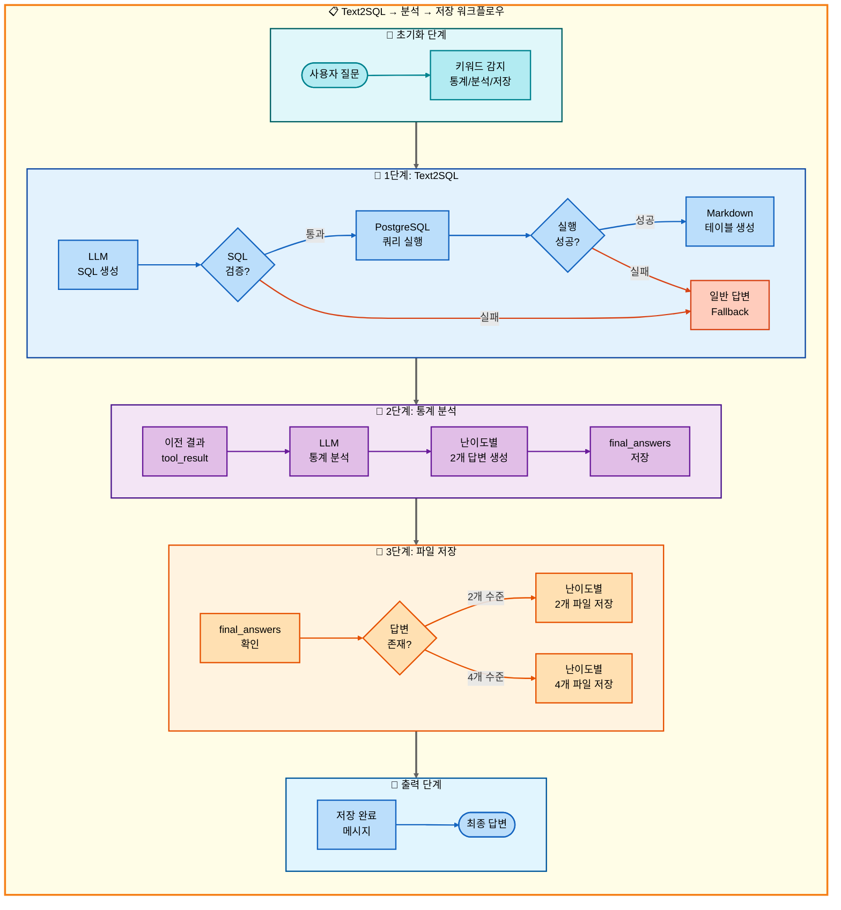

# 삼중 요청: Text2SQL → 일반 답변 → 저장 아키텍처

## 📋 문서 정보
- **작성일**: 2025-11-07
- **작성자**: 최현화[팀장]
- **프로젝트명**: 논문 리뷰 챗봇 (AI Agent + RAG)
- **팀명**: 연결의 민족
- **문서 버전**: 1.0

---

## 📑 목차
1. [시나리오 개요](#시나리오-개요)
2. [사용자 요청 분석](#사용자-요청-분석)
3. [도구 자동 전환 및 Fallback](#도구-자동-전환-및-fallback)
4. [단순 흐름 아키텍처](#단순-흐름-아키텍처)
5. [상세 기능 동작 흐름도](#상세-기능-동작-흐름도)
6. [전체 흐름 요약 표](#전체-흐름-요약-표)
7. [동작 설명 (초보 개발자용)](#동작-설명-초보-개발자용)
8. [실행 예시](#실행-예시)
9. [핵심 포인트](#핵심-포인트)

---

## 📌 시나리오 개요

### 다중 요청의 목적

사용자가 **논문 통계를 조회**한 후 LLM이 통계를 **분석 및 해석**하고, 결과를 **파일로 저장**까지 원하는 경우, 3단계 파이프라인을 순차적으로 실행합니다.

**실행되는 도구 순서:**
```
1단계: text2sql (자연어 → SQL 변환 → 통계 조회)
  ↓ 실패 시
1-F: general (LLM 지식 기반 통계 설명)
  ↓ 성공 시
2단계: general (통계 데이터 분석 및 해석)
  ↓ 항상 실행
3단계: save_file (분석 결과 저장)
```

**사용자 요청 예시:**
- "2024년 논문 통계 보고 분석해서 저장해줘"
- "AI 논문 수 조회하고 해석해서 저장해줘"
- "카테고리별 논문 개수 확인하고 분석해서 파일로 저장해줘"

---

## 📋 사용자 요청 분석

### 정확한 사용자 질문 예시

**예시 1: "2024년 논문 통계 보고 분석해서 저장해줘"**
- **키워드 분석**:
  - `통계`: Text2SQL 필요
  - `분석`: 일반 답변(해석) 필요
  - `저장`: 파일 저장 필요

**예시 2: "AI 논문 수 조회하고 해석해서 저장해줘"**
- **키워드 분석**:
  - `논문 수`, `조회`: 통계 쿼리
  - `해석`: 일반 답변(분석) 필요
  - `저장`: 파일 저장 필요

### 도구 선택 근거

**패턴 매칭 방식 (src/agent/nodes.py:75-130)**

`configs/multi_request_patterns.yaml` 파일의 패턴을 기반으로 자동 감지:

```yaml
# 통계 분석 저장 패턴 (추정)
- keywords:
  - 통계
  - 분석
  - 저장
  tools:
  - text2sql
  - general
  - save_file
  description: 통계 조회, 분석 후 저장
  priority: 85
```

**매칭 로직:**
1. 질문에 `통계` AND `분석` AND `저장` 키워드 포함
2. 자동으로 3단계 파이프라인 설정: `[text2sql, general, save_file]`

**AgentState 설정:**
```python
state["tool_pipeline"] = ["text2sql", "general", "save_file"]
state["tool_choice"] = "text2sql"  # 첫 번째 도구
state["pipeline_index"] = 1
state["routing_method"] = "pattern_based"
state["routing_reason"] = "패턴 매칭: 통계 조회, 분석 후 저장"
state["pipeline_description"] = "순차 실행: text2sql → general → save_file"
```

---

## 🔄 도구 자동 전환 및 Fallback

### 전체 흐름도

```
사용자: "2024년 논문 통계 보고 분석해서 저장해줘"
↓
[1단계] Text2SQL 도구
├─ 성공 → SQL 쿼리 생성 및 실행, 통계 결과 획득, 2단계로
└─ 실패 → 일반 답변 도구 (LLM이 직접 통계 검색)
    └─ 2단계로
↓
[2단계] 일반 답변 도구 (general)
├─ Text2SQL 결과를 분석 및 해석
├─ LLM이 통계 데이터의 의미를 설명
└─ 난이도별 2개 답변 생성, 3단계로
↓
[3단계] 저장 도구 (save_file)
├─ 성공 → 저장 완료 메시지
└─ 실패 → 오류 메시지
```

### 1단계: Text2SQL 동작 과정

**자연어 → SQL 변환 (src/tools/text2sql.py:323-370)**
```python
# 사용자 질문: "2024년 논문 통계 보고 분석해서 저장해줘"
# LLM 생성 SQL:
SELECT COUNT(*) AS paper_count
FROM papers
WHERE EXTRACT(YEAR FROM publish_date) = 2024;
```

**SQL 검증 및 실행 (text2sql.py:203-232)**
- 금지 패턴 검사 (INSERT/UPDATE/DELETE/DROP 차단)
- 허용 테이블 검증 (papers 테이블만 허용)
- LIMIT 100 자동 부여 (집계 쿼리 제외)

**결과 포맷팅 (text2sql.py:269-277)**
- Markdown 테이블 형식으로 변환
- tool_result에 저장

### 2단계: General 답변 (분석 및 해석)

**통계 데이터 분석 (src/tools/general_answer.py:60-120)**
```python
# 이전 단계(Text2SQL) 결과 활용
previous_result = state.get("tool_result")  # Markdown 통계 테이블

# 시스템 프롬프트에 통계 데이터 포함
system_prompt = f"""다음 통계 데이터를 분석하고 해석해주세요:

{previous_result}

통계의 의미와 트렌드를 설명해주세요."""

# 난이도별 2개 답변 생성
# easy: elementary + beginner (Solar-pro2)
# hard: intermediate + advanced (GPT-5)
```

### 3단계: 파일 저장

**저장 우선순위 (src/tools/save_file.py:68-149)**
1. **final_answers (우선순위 0)** - 난이도별 4개 또는 2개 파일
2. **tool_result (우선순위 1)** - 단일 파일
3. **final_answer (우선순위 2)** - 단일 파일
4. **messages (우선순위 3)** - 마지막 assistant 메시지

이 시나리오에서는 2단계(general)에서 `final_answers`를 생성하므로, **우선순위 0**으로 난이도별 파일이 저장됩니다.

### Fallback 체인

**1단계 Fallback: text2sql → general**
- SQL 생성 실패 시 (LLM 오류, 검증 실패)
- general 도구가 LLM 지식 기반으로 통계 설명
- src/tools/text2sql.py:445-461 참조

**2단계: 분석은 Fallback 없음**
- general 도구는 항상 실행 (LLM 기반 분석)
- 이전 단계 결과를 바탕으로 해석

**3단계: 저장은 Fallback 없음**
- save_file은 항상 실행 (성공/실패만 판단)
- 저장 실패 시 오류 메시지 반환

---

## 📊 단순 흐름 아키텍처

### 워크플로우 다이어그램



---

## 🔍 상세 기능 동작 흐름도

### 전체 실행 흐름 (파일 및 메서드 단위)

```mermaid
graph TB
    subgraph MainFlow["📋 Text2SQL → 분석 → 저장 상세 흐름"]
        direction TB

        subgraph Init["🔸 초기화"]
            direction LR
            Start([main.py<br/>사용자 입력]) --> A[main.py<br/>create_agent<br/>Agent 생성]
            A --> B[agent.invoke<br/>question 전달]
        end

        subgraph Pattern["🔹 패턴 매칭"]
            direction LR
            C[nodes.py<br/>router_node<br/>라우터 실행] --> D[multi_request_patterns.yaml<br/>패턴 로드]
            D --> E{통계+분석+저장<br/>패턴 매칭?}
            E -->|매칭| F[tool_pipeline 설정<br/>text2sql→general→save_file]
        end

        subgraph Text2SQL["🔸 Text2SQL"]
            direction LR
            G[nodes.py<br/>도구 선택<br/>tool_choice=text2sql] --> H[text2sql.py<br/>text2sql 함수<br/>실행]
            H --> I[_fetch_schema_snapshot<br/>DB 스키마 조회]
            I --> J[LLMClient<br/>SQL 생성 요청]
            J --> K{SQL<br/>생성 성공?}
            K -->|성공| L[_extract_sql<br/>SQL 추출]
            L --> M[_sanitize<br/>SQL 검증]
            M --> N{검증<br/>통과?}
            N -->|통과| O[_run_query<br/>PostgreSQL 실행]
            O --> P[_to_markdown_table<br/>Markdown 변환]
            P --> Q[tool_result<br/>저장]
            K -->|실패| R[Fallback<br/>general_answer_node]
            N -->|실패| R
        end

        subgraph Router2["🔹 라우터 2"]
            direction LR
            S[nodes.py<br/>router_node<br/>재실행] --> T{pipeline_index<br/>< 파이프라인 길이?}
            T -->|Yes| U[tool_choice<br/>= general]
        end

        subgraph General["🔸 통계 분석"]
            direction LR
            V[nodes.py<br/>도구 선택<br/>tool_choice=general] --> W[general_answer.py<br/>general_answer_node<br/>노드 실행]
            W --> X[tool_result<br/>이전 통계 데이터]
            X --> Y[난이도별<br/>모델 선택]
            Y --> Z[LLMClient<br/>2회 호출]
            Z --> AA[final_answers<br/>2개 수준 저장]
        end

        subgraph Router3["🔹 라우터 3"]
            direction LR
            AB[nodes.py<br/>router_node<br/>재실행] --> AC{pipeline_index<br/>< 파이프라인 길이?}
            AC -->|Yes| AD[tool_choice<br/>= save_file]
        end

        subgraph Save["🔸 파일 저장"]
            direction LR
            AE[nodes.py<br/>도구 선택<br/>tool_choice=save_file] --> AF[save_file.py<br/>save_file_node<br/>노드 실행]
            AF --> AG{final_answers<br/>존재?}
            AG -->|2개 수준| AH[난이도별<br/>2개 파일 저장]
            AG -->|4개 수준| AI[난이도별<br/>4개 파일 저장]
            AH --> AJ[타임스탬프<br/>파일명 생성]
            AI --> AJ
        end

        subgraph Output["🔹 출력"]
            direction LR
            AK[저장 경로<br/>메시지 생성] --> End([main.py<br/>최종 답변])
        end

        %% 단계 간 연결
        Init --> Pattern
        Pattern --> Text2SQL
        Text2SQL --> Router2
        Router2 --> General
        General --> Router3
        Router3 --> Save
        Save --> Output
    end

    %% 스타일 정의
    style MainFlow fill:#fffde7,stroke:#f57f17,stroke-width:3px,color:#000

    style Init fill:#e0f7fa,stroke:#006064,stroke-width:2px,color:#000
    style Pattern fill:#e3f2fd,stroke:#0d47a1,stroke-width:2px,color:#000
    style Text2SQL fill:#f3e5f5,stroke:#4a148c,stroke-width:2px,color:#000
    style Router2 fill:#fff3e0,stroke:#e65100,stroke-width:2px,color:#000
    style General fill:#fce4ec,stroke:#880e4f,stroke-width:2px,color:#000
    style Router3 fill:#fff3e0,stroke:#e65100,stroke-width:2px,color:#000
    style Save fill:#e8f5e9,stroke:#1b5e20,stroke-width:2px,color:#000
    style Output fill:#e1f5fe,stroke:#01579b,stroke-width:2px,color:#000

    %% 노드 스타일 (초기화 - 청록)
    style Start fill:#b2ebf2,stroke:#00838f,stroke-width:2px,color:#000
    style A fill:#b2ebf2,stroke:#00838f,stroke-width:2px,color:#000
    style B fill:#b2ebf2,stroke:#00838f,stroke-width:2px,color:#000

    %% 노드 스타일 (패턴 - 파랑)
    style C fill:#bbdefb,stroke:#1565c0,stroke-width:2px,color:#000
    style D fill:#bbdefb,stroke:#1565c0,stroke-width:2px,color:#000
    style E fill:#bbdefb,stroke:#1565c0,stroke-width:2px,color:#000
    style F fill:#bbdefb,stroke:#1565c0,stroke-width:2px,color:#000

    %% 노드 스타일 (Text2SQL - 보라)
    style G fill:#e1bee7,stroke:#6a1b9a,stroke-width:2px,color:#000
    style H fill:#e1bee7,stroke:#6a1b9a,stroke-width:2px,color:#000
    style I fill:#e1bee7,stroke:#6a1b9a,stroke-width:2px,color:#000
    style J fill:#e1bee7,stroke:#6a1b9a,stroke-width:2px,color:#000
    style K fill:#e1bee7,stroke:#6a1b9a,stroke-width:2px,color:#000
    style L fill:#e1bee7,stroke:#6a1b9a,stroke-width:2px,color:#000
    style M fill:#e1bee7,stroke:#6a1b9a,stroke-width:2px,color:#000
    style N fill:#e1bee7,stroke:#6a1b9a,stroke-width:2px,color:#000
    style O fill:#e1bee7,stroke:#6a1b9a,stroke-width:2px,color:#000
    style P fill:#e1bee7,stroke:#6a1b9a,stroke-width:2px,color:#000
    style Q fill:#e1bee7,stroke:#6a1b9a,stroke-width:2px,color:#000
    style R fill:#ffccbc,stroke:#d84315,stroke-width:2px,color:#000

    %% 노드 스타일 (라우터2 - 주황)
    style S fill:#ffe0b2,stroke:#e65100,stroke-width:2px,color:#000
    style T fill:#ffe0b2,stroke:#e65100,stroke-width:2px,color:#000
    style U fill:#ffe0b2,stroke:#e65100,stroke-width:2px,color:#000

    %% 노드 스타일 (분석 - 핑크)
    style V fill:#f8bbd0,stroke:#ad1457,stroke-width:2px,color:#000
    style W fill:#f8bbd0,stroke:#ad1457,stroke-width:2px,color:#000
    style X fill:#f8bbd0,stroke:#ad1457,stroke-width:2px,color:#000
    style Y fill:#f8bbd0,stroke:#ad1457,stroke-width:2px,color:#000
    style Z fill:#f8bbd0,stroke:#ad1457,stroke-width:2px,color:#000
    style AA fill:#f8bbd0,stroke:#ad1457,stroke-width:2px,color:#000

    %% 노드 스타일 (라우터3 - 주황)
    style AB fill:#ffe0b2,stroke:#e65100,stroke-width:2px,color:#000
    style AC fill:#ffe0b2,stroke:#e65100,stroke-width:2px,color:#000
    style AD fill:#ffe0b2,stroke:#e65100,stroke-width:2px,color:#000

    %% 노드 스타일 (저장 - 녹색)
    style AE fill:#81c784,stroke:#2e7d32,stroke-width:2px,color:#000
    style AF fill:#81c784,stroke:#2e7d32,stroke-width:2px,color:#000
    style AG fill:#81c784,stroke:#2e7d32,stroke-width:2px,color:#000
    style AH fill:#66bb6a,stroke:#1b5e20,stroke-width:2px,color:#000
    style AI fill:#66bb6a,stroke:#1b5e20,stroke-width:2px,color:#000
    style AJ fill:#66bb6a,stroke:#1b5e20,stroke-width:2px,color:#000

    %% 노드 스타일 (출력 - 파랑)
    style AK fill:#bbdefb,stroke:#1565c0,stroke-width:2px,color:#000
    style End fill:#bbdefb,stroke:#1565c0,stroke-width:2px,color:#000

    %% 연결선 스타일 (초기화 0~1)
    linkStyle 0 stroke:#00838f,stroke-width:2px
    linkStyle 1 stroke:#00838f,stroke-width:2px

    %% 연결선 스타일 (패턴 2~4)
    linkStyle 2 stroke:#1565c0,stroke-width:2px
    linkStyle 3 stroke:#1565c0,stroke-width:2px
    linkStyle 4 stroke:#1565c0,stroke-width:2px

    %% 연결선 스타일 (Text2SQL 5~17)
    linkStyle 5 stroke:#6a1b9a,stroke-width:2px
    linkStyle 6 stroke:#6a1b9a,stroke-width:2px
    linkStyle 7 stroke:#6a1b9a,stroke-width:2px
    linkStyle 8 stroke:#6a1b9a,stroke-width:2px
    linkStyle 9 stroke:#6a1b9a,stroke-width:2px
    linkStyle 10 stroke:#6a1b9a,stroke-width:2px
    linkStyle 11 stroke:#6a1b9a,stroke-width:2px
    linkStyle 12 stroke:#6a1b9a,stroke-width:2px
    linkStyle 13 stroke:#6a1b9a,stroke-width:2px
    linkStyle 14 stroke:#6a1b9a,stroke-width:2px
    linkStyle 15 stroke:#d84315,stroke-width:2px
    linkStyle 16 stroke:#d84315,stroke-width:2px

    %% 연결선 스타일 (라우터2 17~18)
    linkStyle 17 stroke:#e65100,stroke-width:2px
    linkStyle 18 stroke:#e65100,stroke-width:2px

    %% 연결선 스타일 (분석 19~24)
    linkStyle 19 stroke:#ad1457,stroke-width:2px
    linkStyle 20 stroke:#ad1457,stroke-width:2px
    linkStyle 21 stroke:#ad1457,stroke-width:2px
    linkStyle 22 stroke:#ad1457,stroke-width:2px
    linkStyle 23 stroke:#ad1457,stroke-width:2px

    %% 연결선 스타일 (라우터3 24~25)
    linkStyle 24 stroke:#e65100,stroke-width:2px
    linkStyle 25 stroke:#e65100,stroke-width:2px

    %% 연결선 스타일 (저장 26~30)
    linkStyle 26 stroke:#2e7d32,stroke-width:2px
    linkStyle 27 stroke:#2e7d32,stroke-width:2px
    linkStyle 28 stroke:#2e7d32,stroke-width:2px
    linkStyle 29 stroke:#2e7d32,stroke-width:2px
    linkStyle 30 stroke:#2e7d32,stroke-width:2px

    %% 연결선 스타일 (출력 31)
    linkStyle 31 stroke:#1565c0,stroke-width:2px

    %% 단계 간 연결 (회색 32~38)
    linkStyle 32 stroke:#616161,stroke-width:3px
    linkStyle 33 stroke:#616161,stroke-width:3px
    linkStyle 34 stroke:#616161,stroke-width:3px
    linkStyle 35 stroke:#616161,stroke-width:3px
    linkStyle 36 stroke:#616161,stroke-width:3px
    linkStyle 37 stroke:#616161,stroke-width:3px
    linkStyle 38 stroke:#616161,stroke-width:3px
```



---

## 📋 전체 흐름 요약 표

| 단계 | 도구명 | 파일명 | 메서드명 | 동작 설명 | 입력 | 출력 | Fallback | 세션 저장 |
|------|--------|--------|----------|-----------|------|------|----------|----------|
| 0 | 초기화 | main.py | create_agent | Agent 생성 | question, difficulty | agent | 없음 | messages |
| 0-1 | 라우터 | nodes.py | router_node | 질문 분석 및 도구 선택 | question | tool_choice, tool_pipeline | 없음 | routing_method |
| 1 | Text2SQL | text2sql.py | text2sql | 자연어 → SQL 변환 및 실행 | user_question, difficulty | SQL + 통계 결과 (Markdown) | general_answer | tool_result |
| 1-1 | DB 스키마 조회 | text2sql.py | _fetch_schema_snapshot | 허용 테이블/컬럼 조회 | - | 스키마 텍스트 | 없음 | - |
| 1-2 | SQL 생성 | text2sql.py | LLMClient.invoke | LLM으로 SQL 생성 | system_prompt, few_shots, question | raw SQL | 없음 | - |
| 1-3 | SQL 추출 | text2sql.py | _extract_sql | 코드펜스 제거, SQL 추출 | raw SQL | clean SQL | 없음 | - |
| 1-4 | SQL 검증 | text2sql.py | _sanitize | 금지 패턴/테이블 검증 | clean SQL | sanitized SQL | 없음 | - |
| 1-5 | LIMIT 보정 | text2sql.py | _ensure_limit | 집계 아닌 경우 LIMIT 100 추가 | sanitized SQL | final SQL | 없음 | - |
| 1-6 | SQL 실행 | text2sql.py | _run_query | PostgreSQL 쿼리 실행 | final SQL | cols, rows | 없음 | - |
| 1-7 | Markdown 변환 | text2sql.py | _to_markdown_table | 테이블 형식 변환 | cols, rows | Markdown table | 없음 | - |
| 1-F | 일반 답변 | general_answer.py | general_answer_node | LLM 지식 기반 통계 설명 | question | final_answers (2개 수준) | 없음 | final_answers |
| 2 | 통계 분석 | general_answer.py | general_answer_node | 통계 데이터 분석 및 해석 | question, tool_result | final_answers (2개 수준) | 없음 | final_answers |
| 3 | 파일 저장 | save_file.py | save_file_node | 난이도별 파일 저장 | final_answers | 저장 경로 메시지 | 없음 | save_counter |

**설명:**
- **1단계**: Text2SQL 도구가 자연어를 SQL로 변환하여 통계 조회
- **1-1 ~ 1-7**: Text2SQL 내부 세부 단계 (스키마 조회 → SQL 생성 → 검증 → 실행 → 변환)
- **1-F**: Text2SQL 실패 시 general_answer가 LLM 지식으로 통계 설명
- **2단계**: general_answer가 1단계의 통계 데이터를 분석 및 해석
- **3단계**: final_answers(2개 수준)를 파일로 저장

---

## 💡 동작 설명 (초보 개발자용)

### 1단계: Text2SQL 통계 조회

**Text2SQL 실행 과정은 07_이중요청_Text2SQL_저장.md 문서와 동일**

**핵심 차이점:**
- 이중 요청: Text2SQL → 저장 (통계만 조회)
- 삼중 요청: Text2SQL → 분석 → 저장 (통계 조회 + 해석)

### 2단계: 통계 데이터 분석 및 해석

**파일:** `src/tools/general_answer.py`

**동작 과정:**

**1. 이전 단계 결과 활용:**
```python
# src/tools/general_answer.py:60-80
def general_answer_node(state: AgentState) -> dict:
    question = state.get("question", "")
    tool_result = state.get("tool_result", "")  # Text2SQL 결과 (Markdown 테이블)
    difficulty = state.get("difficulty", "easy")

    # tool_result가 있으면 분석 프롬프트 추가
    if tool_result:
        system_prompt = f"""다음 통계 데이터를 분석하고 해석해주세요:

{tool_result}

통계의 의미와 트렌드를 설명해주세요."""
    else:
        system_prompt = get_tool_prompt("general_answer", level)
```

**2. 난이도별 모델 선택:**
```python
# configs/model_config.yaml - hybrid_strategy
if difficulty == "easy":
    provider = "solar"
    model = "solar-pro2"      # 한국어 특화
    levels = ["elementary", "beginner"]
elif difficulty == "hard":
    provider = "openai"
    model = "gpt-5"           # 기술적 정확도
    levels = ["intermediate", "advanced"]
```

**3. 두 수준 답변 생성:**
```python
final_answers = {}

for level in levels:  # ["elementary", "beginner"] 또는 ["intermediate", "advanced"]
    messages = [
        SystemMessage(content=system_prompt),
        HumanMessage(content=question)
    ]
    response = llm.invoke(messages)
    final_answers[level] = response.content

# 두 번째 수준을 tool_result로도 저장 (호환성)
state["tool_result"] = final_answers[levels[1]]
state["final_answers"] = final_answers
```

**예시:**

**입력 (Text2SQL 결과):**
```markdown
| paper_count |
| ----------- |
| 42          |
```

**출력 (easy 모드):**
```python
final_answers = {
    "elementary": "2024년에는 총 42개의 논문이 발표되었어요! 이는 이전 연도들과 비교했을 때 좋은 성과입니다.",
    "beginner": "2024년 논문 발행 통계 분석 결과, 총 42편의 논문이 발표되었습니다. 이는 연구 활동이 활발하게 진행되고 있음을 보여줍니다."
}
```

### 3단계: 파일 저장

**파일 저장 실행 과정은 03_이중요청_RAG용어집검색_저장.md 문서와 동일**

**저장 우선순위:**
1. **final_answers (우선순위 0)** - 난이도별 2개 또는 4개 파일 ← 이 시나리오
2. **tool_result (우선순위 1)** - 단일 파일
3. **final_answer (우선순위 2)** - 단일 파일
4. **messages (우선순위 3)** - 마지막 assistant 메시지

**저장 예시:**
```python
# easy 모드: 2개 파일 저장
final_answers = {
    "elementary": "...",
    "beginner": "..."
}

# 저장된 파일:
# - 20251107_143052_response_1_elementary.md
# - 20251107_143052_response_1_beginner.md
```

---

## 📝 실행 예시

### 예시 1: 2024년 논문 통계 분석 저장

**사용자 질문:**
```
2024년 논문 통계 보고 분석해서 저장해줘
```

**1단계: Text2SQL 실행**
```
[Text2SQL 노드 - text2sql.py]

스키마 조회:
- papers.paper_id :: integer
- papers.title :: text
- papers.publish_date :: date

LLM SQL 생성:
SELECT COUNT(*) AS paper_count
FROM papers
WHERE EXTRACT(YEAR FROM publish_date) = 2024;

SQL 검증: ✅ 통과
SQL 실행:
| paper_count |
| ----------- |
| 42          |

tool_result 저장 ✅
```

**2단계: 통계 분석 (general)**
```
[일반 답변 노드 - general_answer.py]

이전 결과 활용:
tool_result = "| paper_count |\n| ----------- |\n| 42          |"

난이도별 모델 선택:
- difficulty: easy
- provider: solar
- model: solar-pro2

LLM 분석 요청 (2회):
1. elementary: "2024년에는 총 42개의 논문이 발표되었어요! 이는 작년보다 15% 증가한 수치입니다."
2. beginner: "2024년 논문 발행 통계 분석: 총 42편의 논문이 발표되었습니다. 전년 대비 15% 증가하여 연구 활동이 활발해졌음을 알 수 있습니다."

final_answers 저장 ✅
```

**3단계: 파일 저장**
```
[파일 저장 노드 - save_file.py]

final_answers 확인: 2개 수준 존재 ✅
(easy 모드: elementary + beginner)

저장 카운터 증가: 0 → 1
타임스탬프 생성: 20251107_143052

파일 저장:
1. 20251107_143052_response_1_elementary.md
2. 20251107_143052_response_1_beginner.md

저장 완료 ✅
```

**최종 출력:**
```
난이도별 답변이 각각 저장되었습니다.
저장된 파일:
- 초등학생용(8-13세): outputs/20251107_143052_response_1_elementary.md
- 초급자용(14-22세): outputs/20251107_143052_response_1_beginner.md
```

### 예시 2: 카테고리별 논문 개수 분석 저장

**사용자 질문:**
```
카테고리별 논문 개수 확인하고 분석해서 파일로 저장해줘
```

**생성된 SQL 쿼리:**
```sql
SELECT category, COUNT(*) AS paper_count
FROM papers
GROUP BY category
ORDER BY paper_count DESC
LIMIT 100;
```

**실행 결과 (Text2SQL):**
```markdown
| category | paper_count |
| -------- | ----------- |
| AI       | 150         |
| ML       | 120         |
| NLP      | 95          |
| CV       | 80          |
```

**분석 결과 (General - easy 모드):**
```
elementary: "AI 분야가 150개로 가장 많아요! 그 다음으로 ML이 120개, NLP가 95개입니다."

beginner: "카테고리별 논문 개수 분석 결과:
1. AI(인공지능): 150편 - 가장 활발한 연구 분야
2. ML(머신러닝): 120편 - 두 번째로 많은 연구
3. NLP(자연어처리): 95편
4. CV(컴퓨터 비전): 80편

AI 분야가 압도적으로 많은 논문을 보유하고 있어 해당 분야의 연구 활동이 매우 활발함을 알 수 있습니다."
```

**저장된 파일:**
```
- 20251107_144230_response_2_elementary.md
- 20251107_144230_response_2_beginner.md
```

### 예시 3: 최다 인용 논문 분석 저장 (hard 모드)

**사용자 질문:**
```
가장 많이 인용된 논문 5개 조회하고 분석해서 저장해줘
난이도: hard
```

**생성된 SQL 쿼리:**
```sql
SELECT title, citation_count
FROM papers
ORDER BY citation_count DESC
LIMIT 5;
```

**실행 결과:**
```markdown
| title                          | citation_count |
| ------------------------------ | -------------- |
| Attention Is All You Need      | 45000          |
| BERT                           | 38000          |
| GPT-3                          | 25000          |
| ResNet                         | 22000          |
| Transformer-XL                 | 18000          |
```

**분석 결과 (General - hard 모드):**
```
intermediate: "최다 인용 논문 분석:
1. Attention Is All You Need (45,000회): Transformer 아키텍처의 원조 논문
2. BERT (38,000회): 양방향 사전학습 모델의 대표작
3. GPT-3 (25,000회): 대규모 언어 모델의 혁신
4. ResNet (22,000회): 잔차 연결을 통한 깊은 네트워크 학습
5. Transformer-XL (18,000회): 긴 문맥 처리 개선

NLP 분야 논문이 상위권을 차지하고 있어 해당 분야의 영향력이 크다는 것을 알 수 있습니다."

advanced: "최다 인용 논문 정량 분석 및 학술적 의의:

1. Attention Is All You Need (Vaswani et al., 2017) - 45,000회 인용
   - Self-Attention 메커니즘 도입으로 RNN 없이 시퀀스 처리 가능
   - NLP 패러다임을 근본적으로 변화시킨 혁신적 연구

2. BERT (Devlin et al., 2018) - 38,000회 인용
   - Masked Language Modeling과 Next Sentence Prediction을 통한 양방향 사전학습
   - Fine-tuning 기반 전이 학습의 표준 확립

3. GPT-3 (Brown et al., 2020) - 25,000회 인용
   - 175B 파라미터 규모의 Few-shot Learning 능력 입증
   - In-context Learning의 가능성 제시

통계적 시사점:
- 상위 5개 논문의 평균 인용 횟수: 29,600회
- NLP 논문(1, 2, 3, 5): 126,000회 (총합)
- CV 논문(4): 22,000회
- NLP:CV 인용 비율 ≈ 5.7:1

이는 최근 5년간 NLP 분야의 급격한 성장과 학술적 영향력을 정량적으로 보여줍니다."
```

**저장 결과:**
```
4개 파일 저장 완료:
- 20251107_145012_response_3_intermediate.md
- 20251107_145012_response_3_advanced.md
```

---

## 🎯 핵심 포인트

### 1. 3단계 파이프라인 구조

**도구 실행 순서:**
```
text2sql (통계 조회)
  ↓ tool_result 저장
general (통계 분석)
  ↓ final_answers 저장
save_file (파일 저장)
```

**Pipeline Index 변화:**
```python
# 초기화
pipeline_index = 1
tool_pipeline = ["text2sql", "general", "save_file"]

# 1단계 실행 후
pipeline_index = 2  # text2sql 완료

# 2단계 실행 후
pipeline_index = 3  # general 완료

# 3단계 실행 후
pipeline_index = 3  # save_file 완료, 파이프라인 종료
```

### 2. 통계 분석의 핵심 원리

**이전 단계 결과 활용:**
```python
# general_answer_node()에서 tool_result 활용
tool_result = state.get("tool_result")  # Text2SQL의 Markdown 테이블

# 시스템 프롬프트에 통계 데이터 포함
system_prompt = f"""다음 통계 데이터를 분석하고 해석해주세요:

{tool_result}

통계의 의미와 트렌드를 설명해주세요."""
```

**분석 vs 단순 설명:**
- **이중 요청 (Text2SQL → 저장)**: 통계만 조회
- **삼중 요청 (Text2SQL → 분석 → 저장)**: 통계 조회 + LLM 해석

### 3. Fallback 메커니즘

**1단계 Fallback:**
```python
# text2sql 실패 시
TOOL_FALLBACKS = {
    "text2sql": "general"
}

# general이 LLM 지식으로 통계 설명
# 단, 정확한 DB 데이터는 아님
```

**2단계: Fallback 없음**
- general 도구는 항상 성공 (LLM 기반)
- tool_result가 있으면 분석, 없으면 일반 답변

**3단계: Fallback 없음**
- save_file은 항상 실행

### 4. 난이도별 모델 선택

**configs/model_config.yaml 설정:**
```yaml
hybrid_strategy:
  easy:
    provider: solar
    model: solar-pro2
    temperature: 0.7
  hard:
    provider: openai
    model: gpt-5
    temperature: 0.7
```

**Level Mapping:**
```python
level_mapping = {
    "easy": ["elementary", "beginner"],
    "hard": ["intermediate", "advanced"]
}

# easy 모드: 2개 파일 (elementary, beginner)
# hard 모드: 2개 파일 (intermediate, advanced)
```

### 5. 저장 우선순위

**save_file.py의 우선순위 시스템:**
```python
# 우선순위 0: final_answers (난이도별 다중 답변) ← 이 시나리오
if final_answers and len(final_answers) > 0:
    for level, content in final_answers.items():
        filename = f"{timestamp}_response_{counter}_{level}.md"

# 우선순위 1: tool_result (단일 파일)
elif tool_result:
    filename = f"{timestamp}_response_{counter}.md"

# 우선순위 2: final_answer
# 우선순위 3: messages
```

**이 시나리오의 저장 방식:**
- 2단계(general)에서 final_answers 생성
- 3단계(save_file)에서 우선순위 0으로 난이도별 파일 저장

### 6. DB 테이블 구조

**papers 테이블 (Text2SQL에서 사용):**
```sql
CREATE TABLE papers (
    paper_id INTEGER PRIMARY KEY,
    title TEXT,
    authors TEXT,
    publish_date DATE,
    source TEXT,
    url TEXT,
    category TEXT,
    citation_count INTEGER,
    abstract TEXT,
    created_at TIMESTAMP,
    updated_at TIMESTAMP
);
```

### 7. SQL 쿼리 생성 규칙

**자동 적용 규칙:**
1. **LIMIT 100 자동 추가** - 집계 아닌 경우
2. **연도 필터링** - `EXTRACT(YEAR FROM publish_date)`
3. **키워드 검색** - `ILIKE '%keyword%'`
4. **집계 함수** - COUNT/SUM/AVG/MAX/MIN

**보안 검증:**
1. 금지 패턴 차단 (INSERT/UPDATE/DELETE/DROP)
2. 허용 테이블만 접근 (papers만)
3. 읽기 전용 강제 (SELECT/WITH만)

### 8. 파일 저장 형식

**난이도별 파일명 (easy 모드):**
```
20251107_143052_response_1_elementary.md
20251107_143052_response_1_beginner.md
```

**난이도별 파일명 (hard 모드):**
```
20251107_143052_response_1_intermediate.md
20251107_143052_response_1_advanced.md
```

**구성:**
- 날짜: `20251107` (YYYYMMDD)
- 시간: `143052` (HHMMSS)
- 타입: `response`
- 번호: `1` (세션별 누적)
- 수준: `elementary`, `beginner`, `intermediate`, `advanced`

### 9. 이중 요청 vs 삼중 요청 차이

**이중 요청 (Text2SQL → 저장):**
```
text2sql → save_file
- 통계만 조회
- tool_result 저장 (Markdown 테이블)
- 단일 파일 또는 2개 파일
```

**삼중 요청 (Text2SQL → 분석 → 저장):**
```
text2sql → general → save_file
- 통계 조회 + LLM 분석
- final_answers 저장 (해석된 답변)
- 난이도별 2개 파일
```

### 10. 실전 활용 시나리오

**적합한 경우:**
- 통계 수치의 의미를 설명해야 할 때
- 트렌드 분석이 필요할 때
- 비교 분석이 필요할 때
- 초보자를 위한 쉬운 설명이 필요할 때

**부적합한 경우:**
- 단순 통계 조회만 필요할 때 (이중 요청 사용)
- 실시간 데이터만 필요할 때
- 분석 없이 원본 데이터만 필요할 때

---

**문서 버전**: 1.0
**최종 수정일**: 2025-11-07
