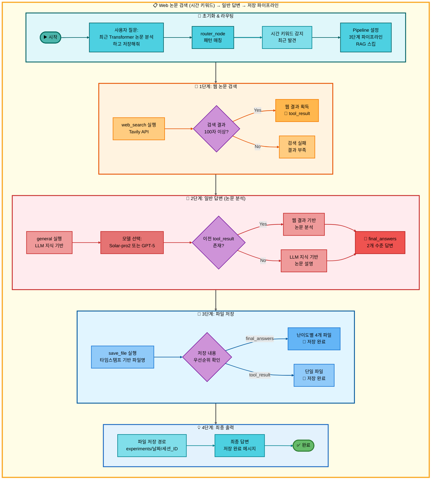
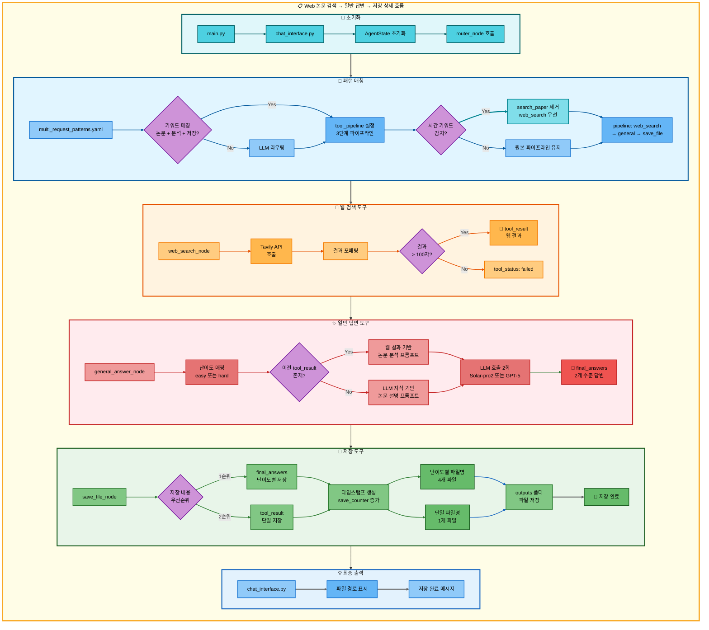

# 삼중 요청: Web 논문 검색 (시간 키워드) → 일반 답변 → 저장 아키텍처

## 📋 문서 정보
- **작성일**: 2025-11-07
- **작성자**: 최현화[팀장]
- **프로젝트명**: 논문 리뷰 챗봇 (AI Agent + RAG)
- **팀명**: 연결의 민족
- **문서 버전**: 1.0

---

## 📑 목차
1. [시나리오 개요](#시나리오-개요)
2. [사용자 요청 분석](#사용자-요청-분석)
3. [도구 자동 전환 및 Fallback](#도구-자동-전환-및-fallback)
4. [단순 흐름 아키텍처](#단순-흐름-아키텍처)
5. [상세 기능 동작 흐름도](#상세-기능-동작-흐름도)
6. [전체 흐름 요약 표](#전체-흐름-요약-표)
7. [동작 설명](#동작-설명)
8. [실행 예시](#실행-예시)
9. [핵심 포인트](#핵심-포인트)

---

## 📌 시나리오 개요

### 다중 요청의 목적

사용자가 **최신 논문**을 검색하고, 분석한 후, 결과를 파일로 저장하고 싶을 때, 시간 키워드를 감지하여 RAG 검색을 건너뛰고 웹 검색부터 시작합니다.

**실행되는 도구 순서:**
```
[시간 키워드 감지] 최신, 최근, 2024년, 2023년, 올해, 작년, latest, recent
↓
1단계: web_search (웹 논문 검색) - RAG 스킵
  ↓ 실패 시
2단계: general (일반 답변 - LLM이 논문 분석)
  ↓ 성공 시
3단계: save_file (파일 저장)
```

**사용자 요청 예시:**
- "최근 Transformer 논문 찾아서 분석하고 저장해줘"
- "2024년 LLM 논문 설명하고 저장해줘"
- "최신 AI 논문 핵심 내용 정리하고 저장해줘"
- "latest deep learning paper explain and save"

---

## 📋 사용자 요청 분석

### 정확한 사용자 질문 예시

**예시 1: "최근 Transformer 논문 찾아서 분석하고 저장해줘"**
- **키워드 분석**:
  - `최근`: **시간 키워드** (RAG DB는 최신성 제한적 → 웹 검색 우선)
  - `논문`: 논문 검색 필요
  - `분석`: 일반 답변 필요 (LLM이 논문 분석)
  - `저장`: 파일 저장 필요

**예시 2: "2024년 LLM 논문 설명하고 저장해줘"**
- **키워드 분석**:
  - `2024년`: **시간 키워드** (특정 연도)
  - `논문`: 논문 검색 필요
  - `설명`: 일반 답변 필요 (LLM이 설명)
  - `저장`: 파일 저장 필요

**예시 3: "latest deep learning paper explain and save"**
- **키워드 분석**:
  - `latest`: **시간 키워드** (영문)
  - `paper`: 논문 검색 필요
  - `explain`: 일반 답변 필요
  - `save`: 파일 저장 필요

### 시간 키워드 감지 로직 (src/agent/nodes.py:180-195)

**시간 관련 키워드 목록:**
```python
TEMPORAL_KEYWORDS = [
    "최신", "최근", "최신의", "최근의",
    "2024년", "2023년", "올해", "작년",
    "latest", "recent", "new", "newest"
]

def has_temporal_keywords(question: str) -> bool:
    """질문에 시간 키워드가 포함되어 있는지 확인"""
    question_lower = question.lower()
    return any(keyword in question_lower for keyword in TEMPORAL_KEYWORDS)
```

**시간 키워드 감지 시 동작:**
```python
if has_temporal_keywords(question):
    # RAG 검색 건너뛰고 웹 검색부터 시작
    if "search_paper" in tool_pipeline:
        tool_pipeline.remove("search_paper")

    # 첫 번째 도구를 web_search로 설정
    if tool_pipeline and tool_pipeline[0] != "web_search":
        tool_pipeline.insert(0, "web_search")

    state["routing_reason"] = "시간 키워드 감지: 웹 검색 우선"
```

### 도구 선택 근거

**패턴 매칭 방식 (src/agent/nodes.py:75-130)**

`configs/multi_request_patterns.yaml` 파일의 패턴을 기반으로 자동 감지:

```yaml
- keywords:
  - 논문
  - 분석
  - 저장
  tools:
  - search_paper
  - web_search
  - general
  - save_file
  description: 논문 검색, 분석 후 저장 (3단계 파이프라인)
  priority: 100
```

**시간 키워드 감지 후 파이프라인 수정:**
```python
# 원본 파이프라인
tool_pipeline = ["search_paper", "web_search", "general", "save_file"]

# 시간 키워드 감지 후
if has_temporal_keywords(question):
    tool_pipeline = ["web_search", "general", "save_file"]
    # search_paper 제거됨
```

**AgentState 설정 (src/agent/nodes.py:117-129):**
```python
state["tool_pipeline"] = ["web_search", "general", "save_file"]
state["tool_choice"] = "web_search"  # 첫 번째 도구
state["pipeline_index"] = 1           # 실행 후 인덱스
state["routing_method"] = "pattern_based + temporal_detection"
state["routing_reason"] = "시간 키워드 감지: 웹 검색 우선 (RAG 스킵)"
state["pipeline_description"] = "순차 실행: web_search → general → save_file"
```

---

## 🔄 도구 자동 전환 및 Fallback

### 전체 Fallback 체인

```
사용자: "최근 Transformer 논문 찾아서 분석하고 저장해줘"
↓
[시간 키워드 감지] "최근" 키워드 발견
↓ RAG 검색 건너뛰기
[1단계] 웹 논문 검색 (web_search)
├─ ✅ 성공 (Tavily API로 웹 검색 성공, 100자 이상)
│   └─ 웹 검색 결과 획득 → [2단계] 일반 답변으로 진행
│
└─ ❌ 실패 (검색 결과 부족 또는 API 오류)
    └─ [2단계] 일반 답변으로 진행 (Fallback)
↓
[2단계] 일반 답변 (general) - 논문 분석
├─ ✅ 성공 (항상 성공: LLM이 논문 분석)
│   ├─ 1단계 웹 검색 결과 있음 → 웹 검색 결과 기반 분석
│   └─ 1단계 웹 검색 결과 없음 → LLM 지식 기반 설명
│   └─ [3단계] 저장으로 진행
│
└─ ❌ 실패 (불가능: general은 항상 성공)
    └─ [3단계] 저장으로 진행
↓
[3단계] 파일 저장 (save_file)
├─ ✅ 성공 (항상 성공)
│   ├─ final_answers 있음 → 난이도별 파일 4개 저장
│   │   - elementary: 날짜_시간_response_번호_elementary.md
│   │   - beginner: 날짜_시간_response_번호_beginner.md
│   │   - intermediate: 날짜_시간_response_번호_intermediate.md
│   │   - advanced: 날짜_시간_response_번호_advanced.md
│   │
│   └─ final_answers 없음 → tool_result 저장
│       - 날짜_시간_response_번호.md
│
└─ ❌ 실패 (불가능: save_file은 항상 성공)
    └─ 최악의 경우 "저장할 내용이 없습니다." 저장
```

### 성공 시나리오별 흐름

**시나리오 A: 웹 검색 성공 → 일반 답변 (분석) → 저장**
```
[시간 키워드 감지] → web_search (성공) → general (분석) → save_file (저장)
                           ↓                    ↓                ↓
                      tool_result:         final_answers:    파일 저장:
                      웹 검색 결과         난이도별 2개 답변 4개 파일
(RAG 검색 건너뜀)
```

**시나리오 B: 웹 검색 실패 → 일반 답변 (LLM 지식) → 저장**
```
[시간 키워드 감지] → web_search (실패) → general (LLM 지식) → save_file (저장)
                                              ↓                   ↓
                                         tool_result:         파일 저장:
                                         LLM 답변            4개 파일
```

### 스킵 로직 상세 (src/agent/graph.py:333-354)

**웹 검색 성공 시: 스킵 없음 (일반 답변으로 진행)**
```python
# web_search 성공 시: 바로 다음 도구인 general로 진행
# 스킵 로직 없음 (일반 답변이 웹 검색 결과 기반 분석 수행)
if last_tool == "web_search" and tool_result and len(tool_result) > 100:
    # pipeline_index: 1 → 2 (general로 진행)
    state["pipeline_index"] = pipeline_index
```

### Fallback 전환 메커니즘 (src/agent/nodes.py:469-548)

**도구 실패 감지 (src/agent/tool_wrapper.py):**
```python
# tool_wrapper가 각 도구 실행 후 상태 자동 설정
tool_status = state.get("tool_status", "success")  # "success" | "failed" | "partial" | "error"
```

**Fallback Router 동작 (src/agent/nodes.py:469-548):**
```python
# 파이프라인 모드: 실패한 도구를 Fallback 도구로 교체
TOOL_FALLBACKS = {
    "web_search": "general"
}

failed_tool = state.get("tool_choice")
fallback_tool = TOOL_FALLBACKS.get(failed_tool)

if fallback_tool:
    # 파이프라인에서 실패한 도구를 Fallback 도구로 교체
    current_index = pipeline_index - 1
    tool_pipeline[current_index] = fallback_tool
    state["tool_pipeline"] = tool_pipeline
    state["tool_choice"] = fallback_tool
```

---

## 📊 단순 흐름 아키텍처



---

## 🔧 상세 기능 동작 흐름도



---

## 📋 전체 흐름 요약 표

| 단계 | 도구명 | 파일명 | 메서드명 | 동작 설명 | 입력 | 출력 | Fallback | 세션 저장 |
|------|--------|--------|----------|-----------|------|------|----------|----------|
| 0 | 패턴 매칭 | src/agent/nodes.py | router_node | 시간 키워드 감지 및 파이프라인 설정 | 사용자 질문 | tool_pipeline | - | routing_reason |
| 1 | 웹 논문 검색 | src/agent/tools/web_search.py | web_search_node | Tavily API로 웹 검색 실행 | 질문 + 키워드 | tool_result (웹 결과) | general | tool_result |
| 1-F | 일반 답변 | src/agent/tools/general.py | general_answer_node | LLM 지식 기반 설명 | 질문 | tool_result | 없음 | tool_result |
| 2 | 일반 답변 | src/agent/tools/general.py | general_answer_node | 웹 결과 기반 또는 LLM 지식 기반 분석 | 질문 + tool_result | final_answers (2수준) | 없음 | final_answers |
| 3 | 파일 저장 | src/agent/tools/save.py | save_file_node | 타임스탬프 기반 파일 저장 | final_answers 또는 tool_result | 파일 경로 | 없음 | save_counter |

---

## 📖 동작 설명

### 3단계 워크플로우 상세 설명

#### 1단계: 시간 키워드 감지 및 웹 논문 검색

**언제 실행되나요?**
- 사용자가 "최근", "최신", "2024년" 등의 시간 키워드와 함께 논문 검색을 요청할 때

**무엇을 하나요?**
1. 시간 키워드 감지: `has_temporal_keywords()` 함수가 질문에서 시간 키워드 탐지
2. RAG 스킵: search_paper를 파이프라인에서 제거 (RAG DB는 최신성이 제한적)
3. 웹 검색 실행: Tavily API를 사용하여 실시간 최신 논문 검색
4. 결과 저장: 100자 이상의 검색 결과를 `tool_result`에 저장

**성공 조건:**
- 웹 검색 결과가 100자 이상

**실패 시:**
- 2단계 일반 답변 도구로 Fallback (LLM이 직접 설명)

#### 2단계: 일반 답변 (논문 분석)

**언제 실행되나요?**
- 1단계 웹 검색이 완료된 후 (성공/실패 무관)

**무엇을 하나요?**
1. 난이도 매핑:
   - Easy 모드: Solar-pro2 사용 (elementary, beginner)
   - Hard 모드: GPT-5 사용 (intermediate, advanced)
2. 프롬프트 구성:
   - 웹 검색 성공 시: 웹 결과를 기반으로 논문 분석 프롬프트
   - 웹 검색 실패 시: LLM 지식 기반 논문 설명 프롬프트
3. LLM 호출: 2번 호출 (easy 1회 + hard 1회)
4. 결과 저장: `final_answers`에 2개 수준 답변 저장

**성공 조건:**
- 항상 성공 (general 도구는 LLM 지식으로 항상 답변 가능)

#### 3단계: 파일 저장

**언제 실행되나요?**
- 2단계 일반 답변이 완료된 후

**무엇을 하나요?**
1. 저장 내용 우선순위 확인:
   - 1순위: `final_answers` (난이도별 2개 수준 답변)
   - 2순위: `tool_result` (웹 검색 결과 또는 LLM 답변)
2. 파일명 생성:
   - 타임스탬프 생성: `datetime.now().strftime("%Y%m%d_%H%M%S")`
   - save_counter 증가
   - 난이도별 파일명 or 단일 파일명
3. 파일 저장:
   - 경로: `experiments/{날짜}/{세션_ID}/outputs/`
   - 난이도별 4개 파일 or 단일 1개 파일

**성공 조건:**
- 항상 성공 (최악의 경우 "저장할 내용이 없습니다." 메시지 저장)

---

## 💡 실행 예시

### 예시 1: 웹 검색 성공 → 분석 → 저장

**사용자 질문:**
```
"최근 Transformer 논문 찾아서 분석하고 저장해줘"
```

**1단계 실행 결과 (web_search):**
```
tool_status: success
tool_result: "Attention Is All You Need (2024 Updated Edition)

Abstract: We propose a new simple network architecture, the Transformer,
based solely on attention mechanisms, dispensing with recurrence and
convolutions entirely. Recent updates include improved positional encodings
and multi-head attention optimizations...

[웹 검색 결과 500자]"
```

**2단계 실행 결과 (general - 웹 결과 기반 분석):**
```
final_answers:
  elementary: "Transformer는 2017년에 발표된 논문으로..."
  beginner: "Transformer 모델의 핵심은 Self-Attention 메커니즘입니다..."
  intermediate: "Attention Is All You Need 논문의 주요 기여..."
  advanced: "Transformer 아키텍처의 혁신성은 순환 구조를 완전히 배제하고..."
```

**3단계 실행 결과 (save_file):**
```
저장된 파일:
- experiments/20251107/session_abc123/outputs/20251107_143052_response_1_elementary.md
- experiments/20251107/session_abc123/outputs/20251107_143052_response_1_beginner.md
- experiments/20251107/session_abc123/outputs/20251107_143052_response_1_intermediate.md
- experiments/20251107/session_abc123/outputs/20251107_143052_response_1_advanced.md
```

**최종 출력:**
```
논문 분석이 완료되었고, 다음 경로에 난이도별로 저장되었습니다:
- Elementary: experiments/20251107/session_abc123/outputs/20251107_143052_response_1_elementary.md
- Beginner: experiments/20251107/session_abc123/outputs/20251107_143052_response_1_beginner.md
- Intermediate: experiments/20251107/session_abc123/outputs/20251107_143052_response_1_intermediate.md
- Advanced: experiments/20251107/session_abc123/outputs/20251107_143052_response_1_advanced.md
```

### 예시 2: 웹 검색 실패 → LLM 지식 기반 설명 → 저장

**사용자 질문:**
```
"2024년 Quantum Computing 논문 설명하고 저장해줘"
```

**1단계 실행 결과 (web_search):**
```
tool_status: failed
tool_result: None
(웹 검색 결과 부족)
```

**2단계 실행 결과 (general - LLM 지식 기반):**
```
final_answers:
  elementary: "양자 컴퓨팅은 양자역학의 원리를 활용한 컴퓨터입니다..."
  beginner: "양자 컴퓨팅의 기본 원리는 큐비트를 사용하는 것입니다..."
  intermediate: "2024년 양자 컴퓨팅 연구의 주요 진전은..."
  advanced: "양자 우위성과 오류 정정 기술의 발전으로..."
```

**3단계 실행 결과 (save_file):**
```
저장된 파일: 4개 (난이도별)
```

**최종 출력:**
```
양자 컴퓨팅에 대한 설명이 완료되었고, 난이도별로 저장되었습니다.
```

---

## 🎯 핵심 포인트

### 1. 시간 키워드 감지 로직
- **목적**: RAG DB는 최신성이 제한적이므로 시간 키워드 발견 시 웹 검색 우선
- **키워드**: "최신", "최근", "2024년", "latest", "recent" 등
- **동작**: search_paper 제거 → web_search 우선

### 2. 3단계 파이프라인
- **1단계**: 웹 논문 검색 (시간 키워드 감지 시)
- **2단계**: 일반 답변 (웹 결과 기반 분석 또는 LLM 지식 기반 설명)
- **3단계**: 파일 저장 (난이도별 4개 파일)

### 3. Fallback 체인
- 웹 검색 실패 → 일반 답변 (LLM 지식 기반)
- 일반 답변은 항상 성공 (최종 Fallback)

### 4. 일반 답변의 이중 역할
- **역할 1**: 웹 검색 실패 시 Fallback (LLM 지식 기반)
- **역할 2**: 웹 검색 성공 시 결과 분석 (웹 결과 기반)

### 5. 난이도별 모델 선택
- **Easy 모드**: Solar-pro2 (한국어 특화, 비용 효율)
- **Hard 모드**: GPT-5 (기술적 정확도, 고품질)

### 6. 저장 우선순위
1. final_answers (난이도별 4개 파일)
2. tool_result (단일 1개 파일)
3. 최악의 경우 오류 메시지 저장

### 7. 파이프라인 모드의 장점
- 도구 간 자동 연계
- 데이터 파이프라인: web_search → general → save_file
- 중간 단계 실패 시 자동 Fallback

---

**작성일**: 2025-11-07
**문서 버전**: 1.0
