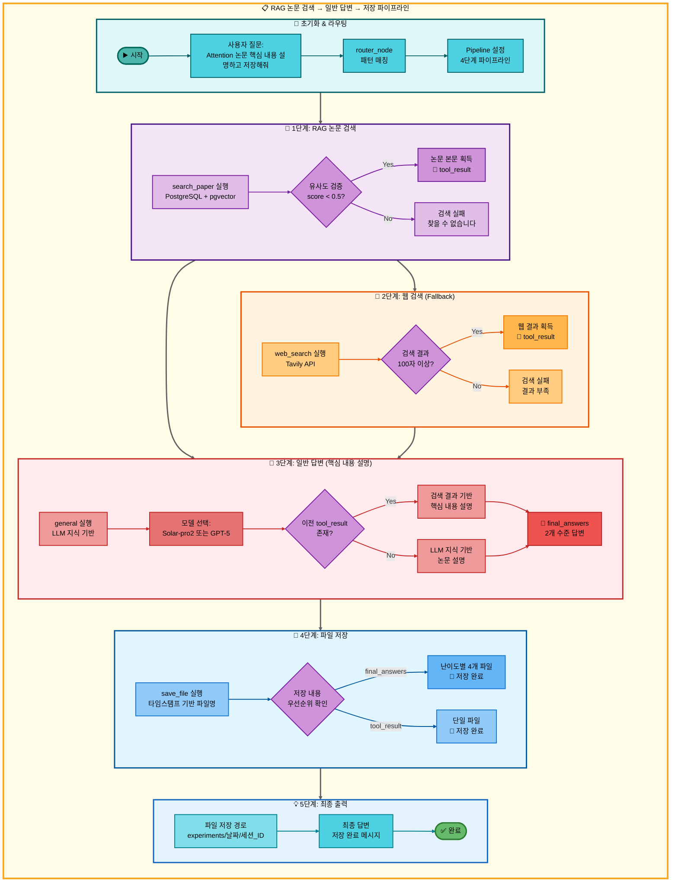
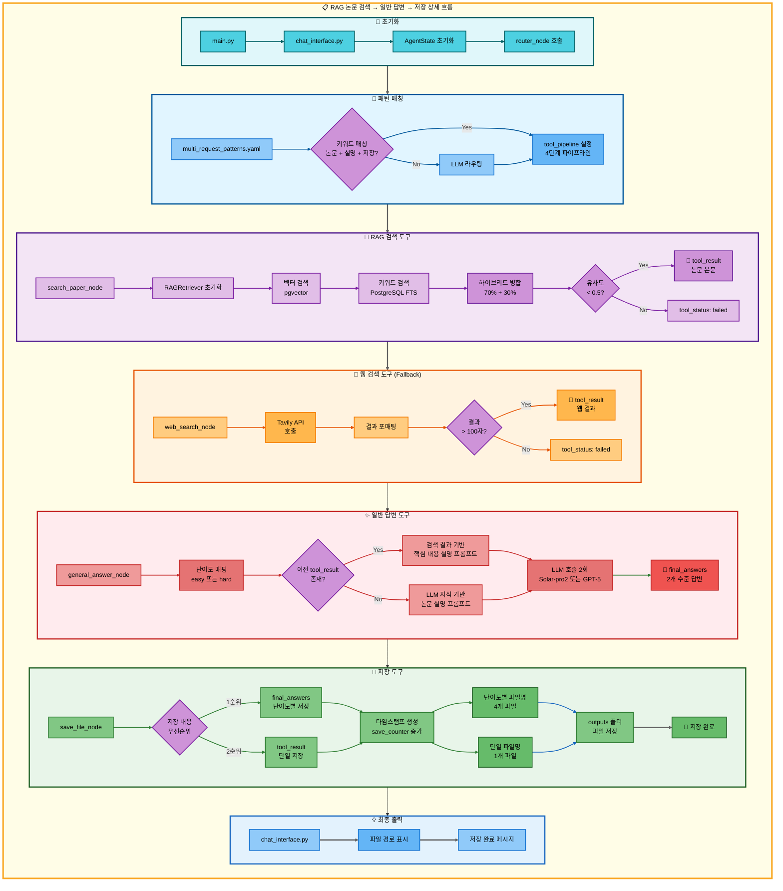

# 삼중 요청: RAG 논문 검색 → 일반 답변 → 저장 아키텍처

## 📋 문서 정보
- **작성일**: 2025-11-07
- **작성자**: 최현화[팀장]
- **프로젝트명**: 논문 리뷰 챗봇 (AI Agent + RAG)
- **팀명**: 연결의 민족
- **문서 버전**: 1.0

---

## 📑 목차
1. [시나리오 개요](#시나리오-개요)
2. [사용자 요청 분석](#사용자-요청-분석)
3. [도구 자동 전환 및 Fallback](#도구-자동-전환-및-fallback)
4. [단순 흐름 아키텍처](#단순-흐름-아키텍처)
5. [상세 기능 동작 흐름도](#상세-기능-동작-흐름도)
6. [전체 흐름 요약 표](#전체-흐름-요약-표)
7. [동작 설명](#동작-설명)
8. [실행 예시](#실행-예시)
9. [핵심 포인트](#핵심-포인트)

---

## 📌 시나리오 개요

### 다중 요청의 목적

사용자가 논문을 검색하고, 핵심 내용을 설명받은 후, 결과를 파일로 저장하고 싶을 때, 세 가지 도구를 순차적으로 실행하여 한 번에 처리합니다.

**실행되는 도구 순서:**
```
1단계: search_paper (RAG 논문 검색)
  ↓ 실패 시
2단계: web_search (웹 논문 검색)
  ↓ 실패 시
3단계: general (일반 답변 - LLM이 논문 검색)
  ↓ 성공 시
4단계: general (일반 답변 - 핵심 내용 설명)
  ↓ 성공 시
5단계: save_file (파일 저장)
```

**사용자 요청 예시:**
- "Attention 논문 찾아서 핵심 내용 설명하고 저장해줘"
- "BERT 논문 주요 내용 정리하고 저장해줘"
- "Transformer 논문 요점 알려주고 저장해줘"

---

## 📋 사용자 요청 분석

### 정확한 사용자 질문 예시

**예시 1: "Attention 논문 찾아서 핵심 내용 설명하고 저장해줘"**
- **키워드 분석**:
  - `논문`: 논문 검색 필요
  - `핵심 내용`: 일반 답변 필요 (LLM이 핵심 내용 설명)
  - `저장`: 파일 저장 필요
  - 시간 키워드 없음 (`최신`, `2024년` 등): RAG 검색 우선

**예시 2: "BERT 논문 주요 내용 정리하고 저장해줘"**
- **키워드 분석**:
  - `논문`: 논문 검색 필요
  - `주요 내용`: 일반 답변 필요 (LLM이 설명)
  - `저장`: 파일 저장 필요

**예시 3: "Transformer 논문 요점 알려주고 저장해줘"**
- **키워드 분석**:
  - `논문`: 논문 검색 필요
  - `요점`: 일반 답변 필요
  - `저장`: 파일 저장 필요

### 도구 선택 근거

**패턴 매칭 방식 (src/agent/nodes.py:75-130)**

`configs/multi_request_patterns.yaml` 파일의 패턴을 기반으로 자동 감지:

```yaml
- keywords:
  - 논문
  - 설명
  - 저장
  tools:
  - search_paper
  - web_search
  - general
  - save_file
  description: 논문 검색, 설명 후 저장 (4단계 파이프라인)
  priority: 100
```

**매칭 로직:**
1. 질문에 `논문` AND `설명` (또는 `핵심`, `요점`, `주요`) AND `저장` 키워드 모두 포함
2. 자동으로 4단계 파이프라인 설정: `[search_paper, web_search, general, save_file]`

**AgentState 설정 (src/agent/nodes.py:117-129):**
```python
state["tool_pipeline"] = ["search_paper", "web_search", "general", "save_file"]
state["tool_choice"] = "search_paper"  # 첫 번째 도구
state["pipeline_index"] = 1             # 실행 후 인덱스
state["routing_method"] = "pattern_based"
state["routing_reason"] = "패턴 매칭: 논문 검색, 설명 후 저장 (4단계 파이프라인)"
state["pipeline_description"] = "순차 실행: search_paper → web_search → general → save_file"
```

---

## 🔄 도구 자동 전환 및 Fallback

### 전체 Fallback 체인

```
사용자: "Attention 논문 찾아서 핵심 내용 설명하고 저장해줘"
↓
[1단계] RAG 논문 검색 (search_paper)
├─ ✅ 성공 (유사도 점수 < 0.5)
│   └─ 논문 본문 획득 → [2단계] 일반 답변으로 직행 (web_search 스킵)
│
└─ ❌ 실패 (유사도 낮음 또는 결과 없음)
    ↓
    [1-F1] 웹 논문 검색 (web_search)
    ├─ ✅ 성공 (Tavily API로 웹 검색 성공, 100자 이상)
    │   └─ 웹 검색 결과 획득 → [2단계] 일반 답변으로 진행
    │
    └─ ❌ 실패 (검색 결과 부족 또는 API 오류)
        ↓
        [1-F2] 일반 답변 (general) - LLM이 논문 검색
        ├─ ✅ 성공 (LLM 지식으로 논문 설명)
        │   └─ LLM 설명 텍스트 획득 → [2단계] 일반 답변으로 진행
        │
        └─ ❌ 실패 (불가능: general은 항상 성공)
            └─ [2단계] 일반 답변으로 진행
↓
[2단계] 일반 답변 (general) - 핵심 내용 설명
├─ ✅ 성공 (항상 성공: LLM이 핵심 내용 설명)
│   ├─ 1단계 검색 결과 있음 → 검색 결과 기반 핵심 내용 설명
│   └─ 1단계 검색 결과 없음 → LLM 지식 기반 설명
│   └─ [3단계] 저장으로 진행
│
└─ ❌ 실패 (불가능: general은 항상 성공)
    └─ [3단계] 저장으로 진행
↓
[3단계] 파일 저장 (save_file)
├─ ✅ 성공 (항상 성공)
│   ├─ final_answers 있음 → 난이도별 파일 4개 저장
│   │   - elementary: 날짜_시간_response_번호_elementary.md
│   │   - beginner: 날짜_시간_response_번호_beginner.md
│   │   - intermediate: 날짜_시간_response_번호_intermediate.md
│   │   - advanced: 날짜_시간_response_번호_advanced.md
│   │
│   └─ final_answers 없음 → tool_result 저장
│       - 날짜_시간_response_번호.md
│
└─ ❌ 실패 (불가능: save_file은 항상 성공)
    └─ 최악의 경우 "저장할 내용이 없습니다." 저장
```

### 성공 시나리오별 흐름

**시나리오 A: RAG 검색 성공 → 일반 답변 (설명) → 저장**
```
search_paper (성공) → general (핵심 내용 설명) → save_file (저장)
     ↓                         ↓                        ↓
tool_result:              final_answers:            파일 저장:
논문 본문 (1500자)       난이도별 2개 답변         4개 파일
(web_search 스킵)
```

**시나리오 B: RAG 실패 → 웹 검색 성공 → 일반 답변 (설명) → 저장**
```
search_paper (실패) → web_search (성공) → general (핵심 내용 설명) → save_file (저장)
                           ↓                      ↓                        ↓
                      tool_result:            final_answers:            파일 저장:
                      웹 검색 결과            난이도별 2개 답변         4개 파일
```

**시나리오 C: RAG/웹 모두 실패 → 일반 답변 (LLM 지식) → 일반 답변 (설명) → 저장**
```
search_paper (실패) → web_search (실패) → general (LLM 지식) → general (설명) → save_file (저장)
                                               ↓                    ↓                ↓
                                          tool_result:         final_answers:    파일 저장:
                                          LLM 답변            난이도별 2개 답변  4개 파일
```

### 스킵 로직 상세 (src/agent/graph.py:333-354)

**RAG 검색 성공 시 스킵:**
```python
# search_paper 성공 시: web_search 스킵하고 general로 이동
if last_tool == "search_paper" and tool_result and "찾을 수 없습니다" not in tool_result:
    if "general" in tool_pipeline[pipeline_index:]:
        general_index = tool_pipeline.index("general", pipeline_index)
        state["pipeline_index"] = general_index
        # pipeline_index: 1 → 2 (web_search 스킵)
```

**웹 검색 성공 시 스킵:**
```python
# web_search 성공 시: 바로 다음 도구인 general로 진행
if last_tool == "web_search" and tool_result and len(tool_result) > 100:
    # pipeline_index: 2 → 3 (general로 진행)
    state["pipeline_index"] = pipeline_index
```

### Fallback 전환 메커니즘 (src/agent/nodes.py:469-548)

**도구 실패 감지 (src/agent/tool_wrapper.py):**
```python
# tool_wrapper가 각 도구 실행 후 상태 자동 설정
tool_status = state.get("tool_status", "success")  # "success" | "failed" | "partial" | "error"
```

**Fallback Router 동작 (src/agent/nodes.py:469-548):**
```python
# 파이프라인 모드: 실패한 도구를 Fallback 도구로 교체
TOOL_FALLBACKS = {
    "search_paper": "web_search",
    "web_search": "general"
}

failed_tool = state.get("tool_choice")
fallback_tool = TOOL_FALLBACKS.get(failed_tool)

if fallback_tool:
    # 파이프라인에서 실패한 도구를 Fallback 도구로 교체
    current_index = pipeline_index - 1
    tool_pipeline[current_index] = fallback_tool
    state["tool_pipeline"] = tool_pipeline
    state["tool_choice"] = fallback_tool
```

---

## 📊 단순 흐름 아키텍처



---

## 🔧 상세 기능 동작 흐름도



---

## 📋 전체 흐름 요약 표

| 단계 | 도구명 | 파일명 | 메서드명 | 동작 설명 | 입력 | 출력 | Fallback | 세션 저장 |
|------|--------|--------|----------|-----------|------|------|----------|----------|
| 0 | 패턴 매칭 | src/agent/nodes.py | router_node | 질문 분석 및 파이프라인 설정 | 사용자 질문 | tool_pipeline | - | routing_reason |
| 1 | RAG 논문 검색 | src/agent/tools/search_paper.py | search_paper_node | PostgreSQL + pgvector 하이브리드 검색 | 질문 + 키워드 | tool_result (논문 본문) | web_search | tool_result |
| 1-F1 | 웹 논문 검색 | src/agent/tools/web_search.py | web_search_node | Tavily API로 웹 검색 | 질문 + 키워드 | tool_result (웹 결과) | general | tool_result |
| 1-F2 | 일반 답변 | src/agent/tools/general.py | general_answer_node | LLM 지식 기반 논문 설명 | 질문 | tool_result | 없음 | tool_result |
| 2 | 일반 답변 | src/agent/tools/general.py | general_answer_node | 검색 결과 기반 또는 LLM 지식 기반 핵심 내용 설명 | 질문 + tool_result | final_answers (2수준) | 없음 | final_answers |
| 3 | 파일 저장 | src/agent/tools/save.py | save_file_node | 타임스탬프 기반 파일 저장 | final_answers 또는 tool_result | 파일 경로 | 없음 | save_counter |

---

## 📖 동작 설명

### 4단계 워크플로우 상세 설명

#### 1단계: RAG 논문 검색 (+ Fallback 체인)

**언제 실행되나요?**
- 사용자가 시간 키워드 없이 논문 검색을 요청할 때 (RAG DB 우선)

**무엇을 하나요?**
1. RAG 검색 실행:
   - PostgreSQL FTS: 키워드 기반 검색 (30%)
   - pgvector: 벡터 유사도 검색 (70%)
   - 하이브리드 병합: 가중치 합산 후 상위 결과 선택
2. 유사도 검증: score < 0.5 이면 성공
3. 결과 저장: 논문 본문을 `tool_result`에 저장

**성공 조건:**
- 유사도 점수 < 0.5 (높을수록 유사)

**실패 시:**
1. 웹 검색 도구로 Fallback (Tavily API 사용)
2. 웹 검색 실패 시: 일반 답변 도구로 Fallback (LLM 지식 사용)

#### 2단계: 일반 답변 (핵심 내용 설명)

**언제 실행되나요?**
- 1단계 검색이 완료된 후 (성공/실패 무관)

**무엇을 하나요?**
1. 난이도 매핑:
   - Easy 모드: Solar-pro2 사용 (elementary, beginner)
   - Hard 모드: GPT-5 사용 (intermediate, advanced)
2. 프롬프트 구성:
   - 검색 성공 시: 검색 결과를 기반으로 핵심 내용 설명 프롬프트
   - 검색 실패 시: LLM 지식 기반 논문 설명 프롬프트
3. LLM 호출: 2번 호출 (easy 1회 + hard 1회)
4. 결과 저장: `final_answers`에 2개 수준 답변 저장

**성공 조건:**
- 항상 성공 (general 도구는 LLM 지식으로 항상 답변 가능)

#### 3단계: 파일 저장

**언제 실행되나요?**
- 2단계 일반 답변이 완료된 후

**무엇을 하나요?**
1. 저장 내용 우선순위 확인:
   - 1순위: `final_answers` (난이도별 2개 수준 답변)
   - 2순위: `tool_result` (검색 결과 또는 LLM 답변)
2. 파일명 생성:
   - 타임스탬프 생성: `datetime.now().strftime("%Y%m%d_%H%M%S")`
   - save_counter 증가
   - 난이도별 파일명 or 단일 파일명
3. 파일 저장:
   - 경로: `experiments/{날짜}/{세션_ID}/outputs/`
   - 난이도별 4개 파일 or 단일 1개 파일

**성공 조건:**
- 항상 성공 (최악의 경우 "저장할 내용이 없습니다." 메시지 저장)

---

## 💡 실행 예시

### 예시 1: RAG 검색 성공 → 설명 → 저장

**사용자 질문:**
```
"Attention 논문 찾아서 핵심 내용 설명하고 저장해줘"
```

**1단계 실행 결과 (search_paper):**
```
tool_status: success
tool_result: "Attention Is All You Need

Abstract: We propose a new simple network architecture, the Transformer,
based solely on attention mechanisms, dispensing with recurrence and
convolutions entirely. Experiments on two machine translation tasks show
these models to be superior in quality while being more parallelizable...

[논문 본문 1500자]"
```

**2단계 실행 결과 (general - 검색 결과 기반 설명):**
```
final_answers:
  elementary: "Attention Is All You Need 논문의 핵심은 Self-Attention입니다..."
  beginner: "이 논문은 Transformer라는 새로운 모델을 제안합니다. 핵심 개념은..."
  intermediate: "Transformer 아키텍처의 주요 기여는 순환 구조 제거와..."
  advanced: "Self-Attention 메커니즘의 이론적 기반과 시간 복잡도 O(n^2)..."
```

**3단계 실행 결과 (save_file):**
```
저장된 파일:
- experiments/20251107/session_abc123/outputs/20251107_143052_response_1_elementary.md
- experiments/20251107/session_abc123/outputs/20251107_143052_response_1_beginner.md
- experiments/20251107/session_abc123/outputs/20251107_143052_response_1_intermediate.md
- experiments/20251107/session_abc123/outputs/20251107_143052_response_1_advanced.md
```

**최종 출력:**
```
논문의 핵심 내용이 다음 경로에 난이도별로 저장되었습니다:
- Elementary: experiments/20251107/session_abc123/outputs/20251107_143052_response_1_elementary.md
- Beginner: experiments/20251107/session_abc123/outputs/20251107_143052_response_1_beginner.md
- Intermediate: experiments/20251107/session_abc123/outputs/20251107_143052_response_1_intermediate.md
- Advanced: experiments/20251107/session_abc123/outputs/20251107_143052_response_1_advanced.md
```

### 예시 2: RAG/웹 모두 실패 → LLM 지식 기반 설명 → 저장

**사용자 질문:**
```
"AlphaGo 논문 주요 내용 정리하고 저장해줘"
```

**1단계 실행 결과 (search_paper):**
```
tool_status: failed
tool_result: None
(DB에 해당 논문 없음)
```

**1-F1 실행 결과 (web_search):**
```
tool_status: failed
tool_result: None
(웹 검색 결과 부족)
```

**1-F2 실행 결과 (general - LLM 지식 기반 논문 설명):**
```
tool_status: success
tool_result: "AlphaGo는 2016년 DeepMind가 발표한 바둑 AI입니다..."
```

**2단계 실행 결과 (general - LLM 지식 기반 핵심 내용 설명):**
```
final_answers:
  elementary: "AlphaGo의 핵심은 강화학습과 몬테카를로 트리 탐색입니다..."
  beginner: "AlphaGo는 두 가지 신경망을 사용합니다: 정책 네트워크와 가치 네트워크..."
  intermediate: "AlphaGo의 학습 과정은 지도 학습, 강화 학습, 정책 개선 단계로..."
  advanced: "가치 네트워크의 학습에서 자기 대국 데이터를 활용하여 과적합을 방지..."
```

**3단계 실행 결과 (save_file):**
```
저장된 파일: 4개 (난이도별)
```

**최종 출력:**
```
AlphaGo 논문의 핵심 내용이 난이도별로 저장되었습니다.
```

---

## 🎯 핵심 포인트

### 1. 3단계 Fallback 체인
- **1순위**: RAG 검색 (PostgreSQL + pgvector)
- **2순위**: 웹 검색 (Tavily API)
- **3순위**: 일반 답변 (LLM 지식)

### 2. 일반 답변의 이중 역할
- **역할 1**: 검색 실패 시 Fallback (LLM 지식 기반 논문 설명)
- **역할 2**: 검색 성공 시 핵심 내용 설명 (검색 결과 기반)

### 3. 하이브리드 검색
- **벡터 검색**: 70% 가중치 (의미적 유사도)
- **키워드 검색**: 30% 가중치 (용어 정확도)
- **병합 방식**: 가중치 합산 후 정규화

### 4. 난이도별 모델 선택
- **Easy 모드**: Solar-pro2 (한국어 특화, 비용 효율)
- **Hard 모드**: GPT-5 (기술적 정확도, 고품질)

### 5. 저장 우선순위
1. final_answers (난이도별 4개 파일)
2. tool_result (단일 1개 파일)
3. 최악의 경우 오류 메시지 저장

### 6. 스킵 로직
- RAG 검색 성공 시: web_search 스킵 → general 직행
- 웹 검색 성공 시: 바로 general 진행

### 7. 파이프라인 모드의 장점
- 도구 간 자동 연계
- 데이터 파이프라인: search_paper → web_search → general → save_file
- 중간 단계 실패 시 자동 Fallback
- 검색 성공 시 불필요한 도구 스킵

---

**작성일**: 2025-11-07
**문서 버전**: 1.0
