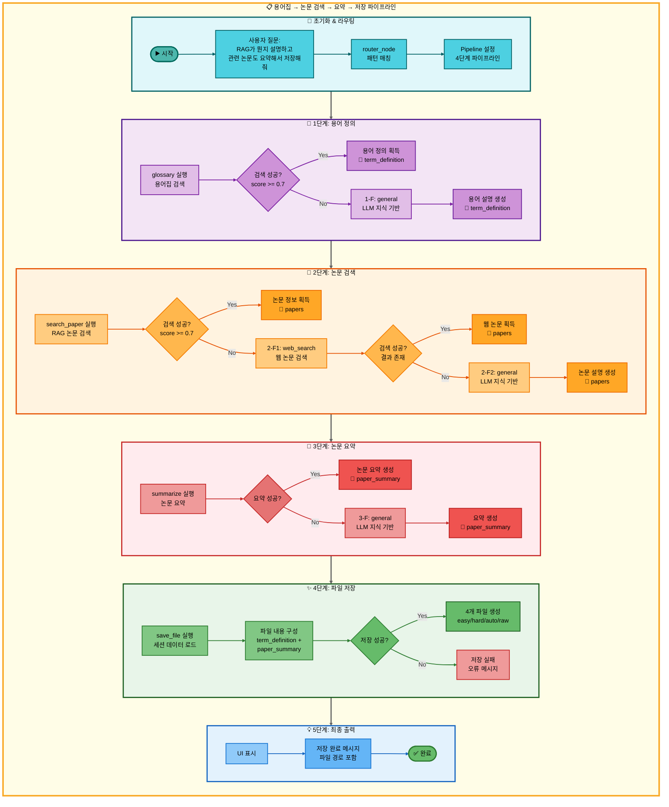

# 사중 요청: 용어집 검색 → 논문 검색 → 논문 요약 → 저장 아키텍처

## 📋 문서 정보
- **작성일**: 2025-11-07
- **작성자**: 최현화[팀장]
- **프로젝트명**: 논문 리뷰 챗봇 (AI Agent + RAG)
- **팀명**: 연결의 민족
- **문서 버전**: 1.0

---

## 📑 목차
1. [시나리오 개요](#시나리오-개요)
2. [사용자 요청 분석](#사용자-요청-분석)
3. [도구 자동 전환 및 Fallback](#도구-자동-전환-및-fallback)
4. [단순 흐름 아키텍처](#단순-흐름-아키텍처)
5. [상세 기능 동작 흐름도](#상세-기능-동작-흐름도)
6. [전체 흐름 요약 표](#전체-흐름-요약-표)
7. [동작 설명 (초보 개발자용)](#동작-설명-초보-개발자용)
8. [실행 예시](#실행-예시)
9. [핵심 포인트](#핵심-포인트)

---

## 📌 시나리오 개요

### 다중 요청의 목적

사용자가 AI 용어의 정의를 확인하고, 관련 논문을 검색한 후 요약하고, 최종 결과를 파일로 저장하고 싶을 때, 네 가지 도구를 순차적으로 실행하여 한 번에 처리합니다. 이는 **가장 복잡한 워크플로우**로, 모든 Fallback 메커니즘을 포함합니다.

**완전한 실행 흐름 (모든 Fallback 포함):**

```
1단계: glossary (용어집 검색)
├─ 성공 → RAG 정의 제공, 2단계로
└─ 실패 (용어집에 없음)
    ↓
    1-F: general (일반 답변)
    └─ LLM이 용어 설명, 2단계로
↓
2단계: search_paper (RAG 논문 검색)
├─ 성공 → 관련 논문 발견, 3단계로
└─ 실패 (DB에 논문 없음)
    ↓
    2-F1: web_search (웹 논문 검색)
    ├─ 성공 → 관련 논문 발견, 3단계로
    └─ 실패 (웹에서도 못 찾음)
        ↓
        2-F2: general (일반 답변)
        └─ LLM이 직접 논문 내용 설명, 3단계로
↓
3단계: summarize (논문 요약)
├─ 성공 → 논문 요약 생성, 4단계로
└─ 실패 (요약 생성 오류)
    ↓
    3-F: general (일반 답변)
    └─ LLM이 직접 요약, 4단계로
↓
4단계: save_file (파일 저장)
├─ 성공 → 저장 완료 메시지 반환
└─ 실패 → 오류 메시지 반환
```

### 사용자 요청 예시

- **"RAG가 뭔지 설명하고 관련 논문도 요약해서 저장해줘"**
- **"Attention Mechanism 정의하고 논문 찾아서 요약하고 저장해줘"**
- **"Transformer가 무엇인지 알려주고 논문 정리해서 저장해줘"**

### 가능한 실행 경로 (총 12가지)

이 사중 요청 시스템은 각 단계의 성공/실패 조합에 따라 **총 12가지 실행 경로**가 존재합니다:

#### 1단계 (용어 정의) 경로
- **경로 A**: glossary 성공 → 2단계로
- **경로 B**: glossary 실패 → general (1-F) → 2단계로

#### 2단계 (논문 검색) 경로
- **경로 C**: search_paper 성공 → 3단계로
- **경로 D**: search_paper 실패 → web_search (2-F1) 성공 → 3단계로
- **경로 E**: search_paper 실패 → web_search (2-F1) 실패 → general (2-F2) → 3단계로

#### 3단계 (논문 요약) 경로
- **경로 F**: summarize 성공 → 4단계로
- **경로 G**: summarize 실패 → general (3-F) → 4단계로

#### 4단계 (파일 저장) 경로
- **경로 H**: save_file 성공 → 완료
- **경로 I**: save_file 실패 → 오류 반환

#### 최선의 경로 (모두 성공)
```
glossary → search_paper → summarize → save_file
(경로: A → C → F → H)
실행 시간: 약 8-12초
결과 품질: 최상 (모든 단계에서 최적의 결과)
```

#### 최악의 경로 (모두 Fallback)
```
glossary 실패 → general → search_paper 실패 → web_search 실패 → general → summarize 실패 → general → save_file
(경로: B → E → G → H)
실행 시간: 약 25-35초
결과 품질: 중하 (모든 단계에서 LLM 지식 기반 답변)
```

#### 대표적인 중간 경로
```
1. glossary → search_paper 실패 → web_search → summarize → save_file
   (경로: A → D → F → H)
   실행 시간: 약 12-18초
   결과 품질: 상 (용어 정의는 RAG, 논문은 웹 검색)

2. glossary → search_paper → summarize 실패 → general → save_file
   (경로: A → C → G → H)
   실행 시간: 약 10-15초
   결과 품질: 상 (검색은 성공, 요약만 LLM)

3. glossary 실패 → general → search_paper → summarize → save_file
   (경로: B → C → F → H)
   실행 시간: 약 10-14초
   결과 품질: 상 (용어만 LLM, 나머지는 성공)
```

---

## 🔄 사용자 요청 분석

### 질문 해석

**사용자 입력:** "RAG가 뭔지 설명하고 관련 논문도 요약해서 저장해줘"

**Router 분석 결과:**
```json
{
  "question_type": "quadruple_request",
  "sub_types": [
    "term_definition",
    "paper_search",
    "paper_summary",
    "file_save"
  ],
  "primary_tool": "glossary",
  "fallback_chain": ["general"],
  "secondary_tool": "search_paper",
  "fallback_chain_2": ["web_search", "general"],
  "tertiary_tool": "summarize",
  "fallback_chain_3": ["general"],
  "quaternary_tool": "save_file",
  "execution_mode": "pipeline",
  "data_flow": "1단계 결과 + 3단계 결과 → 4단계 저장"
}
```

### 복잡도 분석

- **총 도구 수**: 4개 (주 도구) + 3개 (Fallback 도구) = 최대 7개
- **Fallback 체인**: 3개 단계에서 각각 1-2개의 Fallback
- **데이터 파이프라인**: 1단계 → 세션 저장 → 4단계, 2단계 → 3단계 → 4단계
- **실행 모드**: Pipeline Mode (자동 데이터 전달)
- **예상 실행 시간**: 8-35초 (경로에 따라 다름)

---

## 🔀 도구 자동 전환 및 Fallback

### 1단계: 용어 정의 (glossary → general)

#### 1단계 주 도구: glossary (용어집 검색)

**성공 조건:**
- 용어집 DB에 해당 용어가 존재
- 난이도 모드(easy/hard)에 맞는 설명 존재
- 하이브리드 검색 (벡터 50% + 키워드 50%) 점수 ≥ 0.7

**실행 내용:**
```python
# src/tools/glossary.py
@tool
def search_glossary(question: str, mode: str = "auto") -> str:
    """
    용어집에서 AI 용어 검색 (하이브리드 검색)

    Args:
        question: 사용자 질문
        mode: easy/hard/auto

    Returns:
        용어 정의 (난이도별 설명)
    """
    # 1. 질문에서 용어 추출
    term = _extract_term_from_question(question)

    # 2. PostgreSQL + PGVector 하이브리드 검색
    #    - 벡터 검색 (유사도): 50%
    #    - 키워드 검색 (ILIKE): 50%
    results = _hybrid_search_glossary(term, top_k=5)

    # 3. 난이도 모드에 맞는 설명 선택
    if mode == "easy" or (mode == "auto" and is_korean_question(question)):
        return results[0]["easy_explanation"]
    else:
        return results[0]["hard_explanation"]
```

**DB 테이블:** `glossary_terms`
- `term` (용어명)
- `easy_explanation` (쉬운 설명 - Solar-pro2)
- `hard_explanation` (어려운 설명 - GPT-5)
- `category` (카테고리)
- `embedding` (벡터)

**성공 시:** 용어 정의 반환 → 세션 저장 → 2단계로

**실패 조건:**
- 용어집 DB에 해당 용어가 없음
- 하이브리드 검색 점수 < 0.7
- DB 연결 오류

**실패 시:** 1-F Fallback (general) 실행

---

#### 1-F Fallback: general (일반 답변)

**전환 시점:**
- glossary 도구 실패 (용어집에 없음)

**실행 내용:**
```python
# src/tools/general_answer.py
@tool
def general(question: str, difficulty: str = "easy") -> str:
    """
    LLM 지식 기반 일반 답변

    Args:
        question: 사용자 질문
        difficulty: easy/hard

    Returns:
        LLM이 직접 생성한 답변
    """
    # 난이도별 모델 선택
    if difficulty == "easy":
        llm = LLMClient(provider="solar", model="solar-pro2")
    else:
        llm = LLMClient(provider="openai", model="gpt-5")

    # 용어 정의 프롬프트 사용
    prompt = get_tool_prompt("general_term_definition")
    response = llm.invoke([
        SystemMessage(content=prompt),
        HumanMessage(content=question)
    ])

    return response
```

**모델 선택:**
- **Easy 모드**: Solar-pro2 (한국어 특화, 비용 효율)
- **Hard 모드**: GPT-5 (기술적 정확도)

**성공 시:** LLM이 생성한 용어 설명 → 세션 저장 → 2단계로

---

### 2단계: 논문 검색 (search_paper → web_search → general)

#### 2단계 주 도구: search_paper (RAG 논문 검색)

**성공 조건:**
- 논문 DB에 관련 논문 존재
- 하이브리드 검색 (벡터 70% + 키워드 30%) 점수 ≥ 0.7
- 최소 1개 이상의 논문 발견

**실행 내용:**
```python
# src/tools/search_paper.py
@tool
def search_paper(question: str, top_k: int = 5) -> str:
    """
    RAG 기반 논문 검색 (하이브리드 검색)

    Args:
        question: 검색 쿼리
        top_k: 반환할 논문 개수

    Returns:
        검색된 논문 정보 (제목, 저자, 초록, URL)
    """
    # 1. 하이브리드 검색 실행
    #    - 벡터 검색 (유사도): 70%
    #    - 키워드 검색 (BM25): 30%
    results = _hybrid_search_papers(question, top_k=top_k)

    # 2. 논문 정보 포맷팅
    formatted_results = []
    for paper in results:
        formatted_results.append({
            "title": paper["title"],
            "authors": paper["authors"],
            "abstract": paper["abstract"],
            "url": paper["url"],
            "score": paper["score"]
        })

    return json.dumps(formatted_results, ensure_ascii=False)
```

**DB 테이블:** `papers`
- `title` (논문 제목)
- `authors` (저자)
- `abstract` (초록)
- `url` (논문 URL)
- `embedding` (벡터)

**성공 시:** 논문 정보 반환 → 3단계로 전달

**실패 조건:**
- 논문 DB에 관련 논문 없음
- 검색 점수 < 0.7
- DB 연결 오류

**실패 시:** 2-F1 Fallback (web_search) 실행

---

#### 2-F1 Fallback: web_search (웹 논문 검색)

**전환 시점:**
- search_paper 도구 실패 (DB에 논문 없음)

**실행 내용:**
```python
# src/tools/web_search.py
@tool
def web_search(query: str, num_results: int = 5) -> str:
    """
    웹에서 논문 검색 (arXiv API 사용)

    Args:
        query: 검색 쿼리
        num_results: 반환할 논문 개수

    Returns:
        검색된 논문 정보 (제목, 저자, 초록, URL)
    """
    # 1. arXiv API 호출
    import arxiv

    search = arxiv.Search(
        query=query,
        max_results=num_results,
        sort_by=arxiv.SortCriterion.Relevance
    )

    # 2. 검색 결과 포맷팅
    results = []
    for paper in search.results():
        results.append({
            "title": paper.title,
            "authors": [author.name for author in paper.authors],
            "abstract": paper.summary,
            "url": paper.entry_id,
            "published": paper.published.strftime("%Y-%m-%d")
        })

    return json.dumps(results, ensure_ascii=False)
```

**API:** arXiv API
- 실시간 논문 검색
- 최신 논문 포함

**성공 시:** 웹에서 검색한 논문 정보 반환 → 3단계로 전달

**실패 조건:**
- 웹에서도 관련 논문을 찾지 못함
- API 호출 오류
- 네트워크 오류

**실패 시:** 2-F2 Fallback (general) 실행

---

#### 2-F2 Fallback: general (일반 답변)

**전환 시점:**
- search_paper 실패 → web_search 실패

**실행 내용:**
```python
# src/tools/general_answer.py
@tool
def general(question: str, difficulty: str = "easy") -> str:
    """
    LLM 지식 기반 논문 내용 설명

    Args:
        question: 사용자 질문
        difficulty: easy/hard

    Returns:
        LLM이 직접 생성한 논문 내용 설명
    """
    # 난이도별 모델 선택
    if difficulty == "easy":
        llm = LLMClient(provider="solar", model="solar-pro2")
    else:
        llm = LLMClient(provider="openai", model="gpt-5")

    # 논문 설명 프롬프트 사용
    prompt = get_tool_prompt("general_paper_explanation")
    response = llm.invoke([
        SystemMessage(content=prompt),
        HumanMessage(content=question)
    ])

    return response
```

**모델 선택:**
- **Easy 모드**: Solar-pro2
- **Hard 모드**: GPT-5

**성공 시:** LLM이 생성한 논문 내용 설명 → 3단계로 전달

---

### 3단계: 논문 요약 (summarize → general)

#### 3단계 주 도구: summarize (논문 요약)

**성공 조건:**
- 2단계에서 논문 내용 전달받음
- 요약 생성 성공

**실행 내용:**
```python
# src/tools/summarize.py
@tool
def summarize(papers: str, difficulty: str = "easy") -> str:
    """
    논문 요약 생성

    Args:
        papers: 2단계에서 전달받은 논문 정보 (JSON)
        difficulty: easy/hard

    Returns:
        논문 요약 텍스트
    """
    # 1. 논문 정보 파싱
    paper_data = json.loads(papers)

    # 2. 난이도별 모델 선택
    if difficulty == "easy":
        llm = LLMClient(provider="solar", model="solar-pro2")
    else:
        llm = LLMClient(provider="openai", model="gpt-5")

    # 3. 요약 프롬프트 사용
    prompt = get_tool_prompt("summarize")

    # 4. 논문별 요약 생성
    summaries = []
    for paper in paper_data:
        response = llm.invoke([
            SystemMessage(content=prompt),
            HumanMessage(content=f"제목: {paper['title']}\n초록: {paper['abstract']}")
        ])
        summaries.append({
            "title": paper["title"],
            "summary": response
        })

    return json.dumps(summaries, ensure_ascii=False)
```

**모델 선택:**
- **Easy 모드**: Solar-pro2 (Temperature: 0.3)
- **Hard 모드**: GPT-5 (Temperature: 0.3)

**성공 시:** 논문 요약 반환 → 4단계로 전달

**실패 조건:**
- 요약 생성 오류
- LLM 호출 실패
- 잘못된 입력 형식

**실패 시:** 3-F Fallback (general) 실행

---

#### 3-F Fallback: general (일반 답변)

**전환 시점:**
- summarize 도구 실패

**실행 내용:**
```python
# src/tools/general_answer.py
@tool
def general(question: str, difficulty: str = "easy") -> str:
    """
    LLM 지식 기반 논문 요약

    Args:
        question: 요약 요청 (2단계 결과 포함)
        difficulty: easy/hard

    Returns:
        LLM이 직접 생성한 요약
    """
    # 난이도별 모델 선택
    if difficulty == "easy":
        llm = LLMClient(provider="solar", model="solar-pro2")
    else:
        llm = LLMClient(provider="openai", model="gpt-5")

    # 요약 프롬프트 사용
    prompt = get_tool_prompt("general_summarize")
    response = llm.invoke([
        SystemMessage(content=prompt),
        HumanMessage(content=question)
    ])

    return response
```

**성공 시:** LLM이 생성한 요약 → 4단계로 전달

---

### 4단계: 파일 저장 (save_file)

#### 4단계 주 도구: save_file (파일 저장)

**성공 조건:**
- 1단계 결과 + 3단계 결과를 세션에서 가져옴
- 파일 저장 경로 유효
- 쓰기 권한 존재

**실행 내용:**
```python
# src/tools/save_file.py
@tool
def save_file(session_id: str, difficulty: str = "easy") -> str:
    """
    대화 결과를 파일로 저장

    Args:
        session_id: 세션 ID
        difficulty: easy/hard

    Returns:
        저장 완료 메시지 (파일 경로 포함)
    """
    # 1. 세션에서 최종 답변 가져오기
    final_answers = get_session_data(session_id, "final_answers")

    # 2. 난이도별 파일명 생성
    timestamp = datetime.now().strftime("%Y%m%d_%H%M%S")
    filename = f"{difficulty}_answer_{timestamp}.md"

    # 3. 파일 내용 구성
    content = f"""# 논문 리뷰 결과

## 용어 정의
{final_answers.get('term_definition', 'N/A')}

## 관련 논문 요약
{final_answers.get('paper_summary', 'N/A')}

---
생성 시간: {timestamp}
난이도: {difficulty}
"""

    # 4. 파일 저장
    save_path = Path(f"outputs/{filename}")
    save_path.parent.mkdir(parents=True, exist_ok=True)
    save_path.write_text(content, encoding="utf-8")

    return f"✅ 저장 완료: {save_path}"
```

**저장 우선순위:**
1. `final_answers` (최종 답변) - 우선
2. `tool_result` (도구 실행 결과) - 대체

**저장 파일:**
- `easy_answer_20251107_143025.md` (Easy 모드)
- `hard_answer_20251107_143025.md` (Hard 모드)
- `auto_answer_20251107_143025.md` (Auto 모드)
- `easy_answer_20251107_143025_raw.json` (원본 데이터)

**성공 시:** 저장 완료 메시지 반환 → 완료

**실패 시:** 오류 메시지 반환 (Fallback 없음)

---

## 📊 단순 흐름 아키텍처

### 전체 워크플로우 다이어그램

이 다이어그램은 4단계 전체 흐름과 모든 Fallback 경로를 시각화합니다.



### 다이어그램 분석

#### 구조
- **MainFlow**: 전체 파이프라인 래퍼 (노란색)
- **6개 subgraph**: 초기화 → 용어정의 → 논문검색 → 요약 → 저장 → 출력
- **총 노드 수**: 33개 (Start ~ End)
- **총 연결선 수**: 29개 (linkStyle 0~28)

#### 색상 구분
- 🔸 **청록색 (초기화)**: 사용자 질문 입력 및 라우팅
- 🔹 **보라색 (1단계)**: glossary 또는 general Fallback
- 🔺 **주황색 (2단계)**: search_paper → web_search → general Fallback 체인
- 🔶 **빨강색 (3단계)**: summarize 또는 general Fallback
- ✨ **녹색 (4단계)**: save_file 실행
- 💡 **파란색 (출력)**: 최종 결과 반환

#### Fallback 경로
- **1단계**: glossary 실패 → general (1-F)
- **2단계**: search_paper 실패 → web_search (2-F1) → general (2-F2)
- **3단계**: summarize 실패 → general (3-F)
- **4단계**: Fallback 없음 (실패 시 오류 메시지)

---

## 🔍 상세 기능 동작 흐름도

### 전체 실행 흐름 (main.py → 도구 실행)

이 다이어그램은 실제 파일명과 메서드명을 포함한 상세 실행 흐름을 보여줍니다.

```mermaid
graph TB
    subgraph MainFlow["📋 상세 실행 흐름"]
        direction TB

        subgraph Entry["🔸 Entry Point"]
            direction LR
            A[main.py<br/>ChatService.process_message] --> B[src/agent/router.py<br/>Router.route]
            B --> C{quadruple_request?}
            C -->|Yes| D[4단계 파이프라인<br/>생성]
        end

        subgraph Step1["🔹 1단계: 용어 정의"]
            direction LR
            E1[src/agent/nodes.py<br/>glossary_node] --> E2[src/tools/glossary.py<br/>search_glossary]
            E2 --> E3{status==success?}
            E3 -->|success| E6[세션 저장<br/>💾 term_definition]
            E3 -->|failed| E4[src/agent/nodes.py<br/>general_node]
            E4 --> E5[src/tools/general_answer.py<br/>general]
            E5 --> E6
        end

        subgraph Step2["🔺 2단계: 논문 검색"]
            direction LR
            F1[src/agent/nodes.py<br/>search_paper_node] --> F2[src/tools/search_paper.py<br/>search_paper]
            F2 --> F3{status==success?}
            F3 -->|success| F9[papers 데이터<br/>3단계로 전달]
            F3 -->|failed| F4[src/agent/nodes.py<br/>web_search_node]
            F4 --> F5[src/tools/web_search.py<br/>web_search]
            F5 --> F6{status==success?}
            F6 -->|success| F9
            F6 -->|failed| F7[src/agent/nodes.py<br/>general_node]
            F7 --> F8[src/tools/general_answer.py<br/>general]
            F8 --> F9
        end

        subgraph Step3["🔶 3단계: 논문 요약"]
            direction LR
            G1[src/agent/nodes.py<br/>summarize_node] --> G2[src/tools/summarize.py<br/>summarize]
            G2 --> G3{status==success?}
            G3 -->|success| G6[세션 저장<br/>💾 paper_summary]
            G3 -->|failed| G4[src/agent/nodes.py<br/>general_node]
            G4 --> G5[src/tools/general_answer.py<br/>general]
            G5 --> G6
        end

        subgraph Step4["✨ 4단계: 파일 저장"]
            direction LR
            H1[src/agent/nodes.py<br/>save_file_node] --> H3[세션에서 데이터 가져오기<br/>term_definition +<br/>paper_summary]
            H3 --> H2[src/tools/save_file.py<br/>save_file]
            H2 --> H4{저장 성공?}
            H4 -->|success| H5[4개 파일 생성]
            H4 -->|failed| H6[오류 메시지]
        end

        subgraph Output["💡 응답 반환"]
            direction LR
            I1[최종 응답 생성] --> I2[사용자에게 반환]
        end

        %% 단계 간 연결
        Entry --> Step1
        Step1 --> Step2
        Step2 --> Step3
        Step3 --> Step4
        Step4 --> Output
    end

    %% 메인 워크플로우 배경
    style MainFlow fill:#fffde7,stroke:#f9a825,stroke-width:4px,color:#000

    %% Subgraph 스타일
    style Entry fill:#e0f7fa,stroke:#006064,stroke-width:3px,color:#000
    style Step1 fill:#f3e5f5,stroke:#4a148c,stroke-width:3px,color:#000
    style Step2 fill:#fff3e0,stroke:#e65100,stroke-width:3px,color:#000
    style Step3 fill:#ffebee,stroke:#c62828,stroke-width:3px,color:#000
    style Step4 fill:#e8f5e9,stroke:#1b5e20,stroke-width:3px,color:#000
    style Output fill:#e3f2fd,stroke:#1565c0,stroke-width:3px,color:#000

    %% 노드 스타일 (Entry - 청록 계열)
    style A fill:#4dd0e1,stroke:#006064,stroke-width:2px,color:#000
    style B fill:#4dd0e1,stroke:#006064,stroke-width:2px,color:#000
    style C fill:#80deea,stroke:#006064,stroke-width:2px,color:#000
    style D fill:#4dd0e1,stroke:#006064,stroke-width:2px,color:#000

    %% 노드 스타일 (1단계 - 보라 계열)
    style E1 fill:#e1bee7,stroke:#7b1fa2,stroke-width:2px,color:#000
    style E2 fill:#e1bee7,stroke:#7b1fa2,stroke-width:2px,color:#000
    style E3 fill:#ce93d8,stroke:#7b1fa2,stroke-width:2px,color:#000
    style E4 fill:#e1bee7,stroke:#7b1fa2,stroke-width:2px,color:#000
    style E5 fill:#e1bee7,stroke:#7b1fa2,stroke-width:2px,color:#000
    style E6 fill:#ce93d8,stroke:#6a1b9a,stroke-width:2px,color:#000

    %% 노드 스타일 (2단계 - 주황 계열)
    style F1 fill:#ffcc80,stroke:#f57c00,stroke-width:2px,color:#000
    style F2 fill:#ffcc80,stroke:#f57c00,stroke-width:2px,color:#000
    style F3 fill:#ffb74d,stroke:#f57c00,stroke-width:2px,color:#000
    style F4 fill:#ffcc80,stroke:#f57c00,stroke-width:2px,color:#000
    style F5 fill:#ffcc80,stroke:#f57c00,stroke-width:2px,color:#000
    style F6 fill:#ffb74d,stroke:#f57c00,stroke-width:2px,color:#000
    style F7 fill:#ffcc80,stroke:#f57c00,stroke-width:2px,color:#000
    style F8 fill:#ffcc80,stroke:#f57c00,stroke-width:2px,color:#000
    style F9 fill:#ffa726,stroke:#ef6c00,stroke-width:2px,color:#000

    %% 노드 스타일 (3단계 - 빨강 계열)
    style G1 fill:#ef9a9a,stroke:#c62828,stroke-width:2px,color:#000
    style G2 fill:#ef9a9a,stroke:#c62828,stroke-width:2px,color:#000
    style G3 fill:#e57373,stroke:#c62828,stroke-width:2px,color:#000
    style G4 fill:#ef9a9a,stroke:#c62828,stroke-width:2px,color:#000
    style G5 fill:#ef9a9a,stroke:#c62828,stroke-width:2px,color:#000
    style G6 fill:#ef5350,stroke:#b71c1c,stroke-width:2px,color:#000

    %% 노드 스타일 (4단계 - 녹색 계열)
    style H1 fill:#81c784,stroke:#2e7d32,stroke-width:2px,color:#000
    style H2 fill:#81c784,stroke:#2e7d32,stroke-width:2px,color:#000
    style H3 fill:#81c784,stroke:#2e7d32,stroke-width:2px,color:#000
    style H4 fill:#66bb6a,stroke:#2e7d32,stroke-width:2px,color:#000
    style H5 fill:#66bb6a,stroke:#1b5e20,stroke-width:2px,color:#000
    style H6 fill:#ef9a9a,stroke:#c62828,stroke-width:2px,color:#000

    %% 노드 스타일 (출력 - 파랑 계열)
    style I1 fill:#90caf9,stroke:#1976d2,stroke-width:2px,color:#000
    style I2 fill:#64b5f6,stroke:#1976d2,stroke-width:2px,color:#000

    %% 연결선 스타일 (Entry - 청록 0~3)
    linkStyle 0 stroke:#006064,stroke-width:2px
    linkStyle 1 stroke:#006064,stroke-width:2px
    linkStyle 2 stroke:#006064,stroke-width:2px
    linkStyle 3 stroke:#006064,stroke-width:2px

    %% 연결선 스타일 (1단계 - 보라 4~9)
    linkStyle 4 stroke:#7b1fa2,stroke-width:2px
    linkStyle 5 stroke:#7b1fa2,stroke-width:2px
    linkStyle 6 stroke:#7b1fa2,stroke-width:2px
    linkStyle 7 stroke:#7b1fa2,stroke-width:2px
    linkStyle 8 stroke:#7b1fa2,stroke-width:2px
    linkStyle 9 stroke:#7b1fa2,stroke-width:2px

    %% 연결선 스타일 (2단계 - 주황 10~18)
    linkStyle 10 stroke:#e65100,stroke-width:2px
    linkStyle 11 stroke:#e65100,stroke-width:2px
    linkStyle 12 stroke:#e65100,stroke-width:2px
    linkStyle 13 stroke:#e65100,stroke-width:2px
    linkStyle 14 stroke:#e65100,stroke-width:2px
    linkStyle 15 stroke:#e65100,stroke-width:2px
    linkStyle 16 stroke:#e65100,stroke-width:2px
    linkStyle 17 stroke:#e65100,stroke-width:2px
    linkStyle 18 stroke:#e65100,stroke-width:2px

    %% 연결선 스타일 (3단계 - 빨강 19~24)
    linkStyle 19 stroke:#c62828,stroke-width:2px
    linkStyle 20 stroke:#c62828,stroke-width:2px
    linkStyle 21 stroke:#c62828,stroke-width:2px
    linkStyle 22 stroke:#c62828,stroke-width:2px
    linkStyle 23 stroke:#c62828,stroke-width:2px
    linkStyle 24 stroke:#c62828,stroke-width:2px

    %% 연결선 스타일 (4단계 - 녹색 25~29)
    linkStyle 25 stroke:#2e7d32,stroke-width:2px
    linkStyle 26 stroke:#2e7d32,stroke-width:2px
    linkStyle 27 stroke:#2e7d32,stroke-width:2px
    linkStyle 28 stroke:#2e7d32,stroke-width:2px
    linkStyle 29 stroke:#2e7d32,stroke-width:2px

    %% 연결선 스타일 (출력 - 파랑 30)
    linkStyle 30 stroke:#1565c0,stroke-width:2px

    %% 단계 간 연결 (회색 31~35)
    linkStyle 31 stroke:#616161,stroke-width:3px
    linkStyle 32 stroke:#616161,stroke-width:3px
    linkStyle 33 stroke:#616161,stroke-width:3px
    linkStyle 34 stroke:#616161,stroke-width:3px
    linkStyle 35 stroke:#616161,stroke-width:3px
```



### 데이터 파이프라인 상세 설명

#### 1단계 → 세션 저장
```python
# 1단계 완료 후
session_data = {
    "term_definition": glossary_result or general_result,
    "timestamp": "2025-11-07 14:30:25"
}
save_to_session(session_id, session_data)
```

#### 2단계 → 3단계 직접 전달
```python
# 2단계 결과를 3단계 입력으로 직접 전달
papers = search_paper_result or web_search_result or general_result
summary_result = summarize(papers=papers)
```

#### 3단계 → 세션 저장
```python
# 3단계 완료 후
session_data.update({
    "paper_summary": summary_result,
    "timestamp": "2025-11-07 14:30:45"
})
save_to_session(session_id, session_data)
```

#### 세션 → 4단계 전달
```python
# 4단계에서 세션 데이터 가져오기
term_definition = get_from_session(session_id, "term_definition")
paper_summary = get_from_session(session_id, "paper_summary")

# 파일 저장
save_file_content = f"""
{term_definition}

{paper_summary}
"""
```

---

## 📋 전체 흐름 요약 표

| 단계 | 도구명 | 파일명 | 메서드명 | 동작 설명 | 입력 | 출력 | Fallback | 세션 저장 |
|------|--------|--------|----------|-----------|------|------|----------|----------|
| **1** | glossary | src/tools/<br/>glossary.py | search_glossary | 용어집 DB에서<br/>하이브리드 검색<br/>(벡터 50% +<br/>키워드 50%) | question<br/>mode | 용어 정의<br/>(난이도별) | 1-F: general | term_definition |
| **1-F** | general | src/tools/<br/>general_answer.py | general | LLM이 직접<br/>용어 설명 생성<br/>(Solar-pro2/<br/>GPT-5) | question<br/>difficulty | 용어 설명 | 없음 | term_definition |
| **2** | search_paper | src/tools/<br/>search_paper.py | search_paper | 논문 DB에서<br/>하이브리드 검색<br/>(벡터 70% +<br/>키워드 30%) | question<br/>top_k | 논문 정보<br/>(JSON) | 2-F1: web_search | - |
| **2-F1** | web_search | src/tools/<br/>web_search.py | web_search | arXiv API로<br/>웹에서 논문 검색 | query<br/>num_results | 논문 정보<br/>(JSON) | 2-F2: general | - |
| **2-F2** | general | src/tools/<br/>general_answer.py | general | LLM이 직접<br/>논문 내용 설명<br/>(Solar-pro2/<br/>GPT-5) | question<br/>difficulty | 논문 설명 | 없음 | - |
| **3** | summarize | src/tools/<br/>summarize.py | summarize | 2단계 결과<br/>기반 논문 요약<br/>(Solar-pro2/<br/>GPT-5) | papers<br/>difficulty | 논문 요약<br/>(JSON) | 3-F: general | paper_summary |
| **3-F** | general | src/tools/<br/>general_answer.py | general | LLM이 직접<br/>논문 요약 생성<br/>(Solar-pro2/<br/>GPT-5) | question<br/>difficulty | 논문 요약 | 없음 | paper_summary |
| **4** | save_file | src/tools/<br/>save_file.py | save_file | 세션 데이터<br/>파일로 저장<br/>(1단계 + 3단계) | session_id<br/>difficulty | 저장 완료<br/>메시지 | 없음 | - |

### 표 설명

**단계 번호 의미:**
- **1, 2, 3, 4**: 주 도구 (Primary Tool)
- **1-F, 2-F1, 2-F2, 3-F**: Fallback 도구

**Fallback 체인:**
- **1단계**: glossary → general (1-F)
- **2단계**: search_paper → web_search (2-F1) → general (2-F2)
- **3단계**: summarize → general (3-F)
- **4단계**: save_file (Fallback 없음)

**데이터 흐름:**
- **1단계 → 세션**: term_definition 저장
- **2단계 → 3단계**: papers 직접 전달
- **3단계 → 세션**: paper_summary 저장
- **세션 → 4단계**: term_definition + paper_summary 가져와서 저장

**DB 사용:**
- **glossary**: `glossary_terms` 테이블 (PostgreSQL + PGVector)
- **search_paper**: `papers` 테이블 (PostgreSQL + PGVector)
- **web_search**: arXiv API (외부 API)
- **others**: DB 사용 안 함

---

## 📖 동작 설명 (초보 개발자용)

### 4단계 워크플로우 완전 가이드

이 시스템은 **4단계 순차 실행 + 3개 Fallback 체인**으로 구성된 가장 복잡한 워크플로우입니다. 각 단계를 상세히 설명합니다.

---

#### 1단계: 용어 정의 (glossary → general)

**목적:** 사용자가 물어본 AI 용어의 정의를 제공

**실행 시점:** 사용자 질문 직후 (첫 번째 단계)

**주 도구: glossary**

1. **질문 분석**
   - 사용자 질문: "RAG가 뭔지 설명하고..."
   - 핵심 용어 추출: "RAG"

2. **용어집 DB 검색**
   ```sql
   -- 하이브리드 검색 (PostgreSQL + PGVector)
   SELECT term, easy_explanation, hard_explanation
   FROM glossary_terms
   WHERE term ILIKE '%RAG%'  -- 키워드 검색 (50%)
   ORDER BY embedding <=> query_embedding  -- 벡터 검색 (50%)
   LIMIT 5;
   ```

3. **난이도별 설명 선택**
   - Easy 모드: `easy_explanation` (Solar-pro2로 생성된 쉬운 설명)
   - Hard 모드: `hard_explanation` (GPT-5로 생성된 기술적 설명)

4. **결과 저장**
   - 세션에 `term_definition` 키로 저장
   - 4단계 파일 저장에서 사용

**성공 예시:**
```
용어: RAG (Retrieval-Augmented Generation)
정의: RAG는 검색 증강 생성 기법으로, 외부 지식 베이스에서 관련 정보를 검색한 후
LLM이 이를 참고하여 답변을 생성하는 방식입니다.
```

**Fallback: general (1-F)**

**실행 시점:** glossary 실패 (용어집에 없음)

1. **LLM 모델 선택**
   - Easy 모드: Solar-pro2 (한국어 특화)
   - Hard 모드: GPT-5 (기술적 정확도)

2. **프롬프트 사용**
   ```python
   prompt = """
   당신은 AI 전문가입니다. 사용자가 물어본 용어를 쉽게 설명해주세요.

   규칙:
   - Easy 모드: 초등학생도 이해할 수 있게 설명
   - Hard 모드: 전문적이고 기술적으로 설명
   """
   ```

3. **LLM 호출**
   ```python
   response = llm.invoke([
       SystemMessage(content=prompt),
       HumanMessage(content="RAG가 뭔가요?")
   ])
   ```

4. **결과 저장**
   - 세션에 `term_definition` 키로 저장

**차이점:**
- glossary는 **미리 검증된 정의** 제공 (더 정확)
- general은 **LLM이 즉시 생성** (용어집에 없는 용어도 처리 가능)

---

#### 2단계: 논문 검색 (search_paper → web_search → general)

**목적:** 1단계에서 정의한 용어와 관련된 논문을 찾음

**실행 시점:** 1단계 완료 직후

**주 도구: search_paper**

1. **질문 전처리**
   - 원본 질문: "RAG가 뭔지 설명하고 관련 논문도 요약해서..."
   - 검색 쿼리: "RAG", "Retrieval-Augmented Generation"

2. **논문 DB 검색**
   ```sql
   -- 하이브리드 검색 (PostgreSQL + PGVector)
   SELECT title, authors, abstract, url
   FROM papers
   WHERE title ILIKE '%RAG%' OR abstract ILIKE '%Retrieval%'  -- 키워드 검색 (30%)
   ORDER BY embedding <=> query_embedding  -- 벡터 검색 (70%)
   LIMIT 5;
   ```

3. **검색 결과 포맷팅**
   ```json
   [
     {
       "title": "Retrieval-Augmented Generation for Knowledge-Intensive NLP Tasks",
       "authors": ["Patrick Lewis", "Ethan Perez", ...],
       "abstract": "Large pre-trained language models...",
       "url": "https://arxiv.org/abs/2005.11401",
       "score": 0.89
     }
   ]
   ```

4. **3단계로 직접 전달**
   - 세션 저장 없이 바로 summarize 도구로 전달

**성공 예시:**
```
✅ 5개 논문 발견
- Retrieval-Augmented Generation for Knowledge-Intensive NLP Tasks (2020)
- REALM: Retrieval-Augmented Language Model Pre-Training (2020)
- ...
```

**Fallback 1: web_search (2-F1)**

**실행 시점:** search_paper 실패 (DB에 논문 없음)

1. **arXiv API 호출**
   ```python
   import arxiv

   search = arxiv.Search(
       query="RAG OR Retrieval-Augmented Generation",
       max_results=5,
       sort_by=arxiv.SortCriterion.Relevance
   )
   ```

2. **검색 결과 포맷팅**
   - search_paper와 동일한 JSON 형식

3. **3단계로 직접 전달**

**성공 예시:**
```
✅ 웹에서 3개 논문 발견
- Retrieval-Augmented Generation for Knowledge-Intensive NLP Tasks (arXiv)
- ...
```

**차이점:**
- search_paper는 **로컬 DB** (빠르고 안정적)
- web_search는 **실시간 웹 검색** (최신 논문 포함)

**Fallback 2: general (2-F2)**

**실행 시점:** search_paper 실패 → web_search 실패

1. **LLM 모델 선택**
   - Easy 모드: Solar-pro2
   - Hard 모드: GPT-5

2. **프롬프트 사용**
   ```python
   prompt = """
   당신은 AI 논문 전문가입니다. 사용자가 요청한 주제의 대표 논문을 설명해주세요.

   규칙:
   - 논문 제목, 저자, 주요 내용 포함
   - 실제 존재하는 논문만 언급
   """
   ```

3. **LLM 호출**
   ```python
   response = llm.invoke([
       SystemMessage(content=prompt),
       HumanMessage(content="RAG 관련 논문을 알려주세요")
   ])
   ```

4. **결과를 JSON 형식으로 변환**
   - LLM 응답을 파싱하여 논문 정보 추출

5. **3단계로 직접 전달**

**차이점:**
- search_paper/web_search는 **실제 검색**
- general은 **LLM 지식 기반** (최신 논문은 없을 수 있음)

---

#### 3단계: 논문 요약 (summarize → general)

**목적:** 2단계에서 찾은 논문들을 요약

**실행 시점:** 2단계 완료 직후

**주 도구: summarize**

1. **입력 데이터 수신**
   - 2단계에서 전달받은 논문 정보 (JSON)

2. **논문 정보 파싱**
   ```python
   papers = json.loads(input_data)
   # papers = [
   #   {"title": "...", "abstract": "...", ...},
   #   ...
   # ]
   ```

3. **난이도별 모델 선택**
   - Easy 모드: Solar-pro2 (Temperature: 0.3)
   - Hard 모드: GPT-5 (Temperature: 0.3)

4. **논문별 요약 생성**
   ```python
   for paper in papers:
       prompt = get_tool_prompt("summarize")
       summary = llm.invoke([
           SystemMessage(content=prompt),
           HumanMessage(content=f"제목: {paper['title']}\n초록: {paper['abstract']}")
       ])
       summaries.append({
           "title": paper["title"],
           "summary": summary
       })
   ```

5. **결과 저장**
   - 세션에 `paper_summary` 키로 저장
   - 4단계 파일 저장에서 사용

**성공 예시:**
```json
[
  {
    "title": "Retrieval-Augmented Generation for Knowledge-Intensive NLP Tasks",
    "summary": "이 논문은 RAG 기법을 제안합니다. 주요 특징:\n- 검색 + 생성 결합\n- 지식 집약적 NLP 작업에 효과적\n- BERT 기반 검색 + GPT 기반 생성"
  }
]
```

**Fallback: general (3-F)**

**실행 시점:** summarize 실패 (요약 생성 오류)

1. **LLM 모델 선택**
   - Easy 모드: Solar-pro2
   - Hard 모드: GPT-5

2. **프롬프트 사용**
   ```python
   prompt = """
   당신은 AI 논문 요약 전문가입니다. 주어진 논문 정보를 바탕으로 요약을 생성해주세요.
   """
   ```

3. **LLM 호출**
   ```python
   response = llm.invoke([
       SystemMessage(content=prompt),
       HumanMessage(content=f"다음 논문을 요약해주세요:\n{paper_info}")
   ])
   ```

4. **결과 저장**
   - 세션에 `paper_summary` 키로 저장

**차이점:**
- summarize는 **구조화된 요약** (일관된 형식)
- general은 **자유 형식 요약** (유연하지만 형식 불일치 가능)

---

#### 4단계: 파일 저장 (save_file)

**목적:** 1단계 용어 정의 + 3단계 논문 요약을 파일로 저장

**실행 시점:** 3단계 완료 직후 (마지막 단계)

**주 도구: save_file**

1. **세션 데이터 가져오기**
   ```python
   term_definition = get_from_session(session_id, "term_definition")
   paper_summary = get_from_session(session_id, "paper_summary")
   ```

2. **파일 내용 구성**
   ```python
   content = f"""# 논문 리뷰 결과

## 1. 용어 정의
{term_definition}

## 2. 관련 논문 요약
{paper_summary}

---
생성 시간: {timestamp}
난이도: {difficulty}
세션 ID: {session_id}
"""
   ```

3. **난이도별 파일 저장**
   ```python
   # Easy 모드
   easy_file = "outputs/easy_answer_20251107_143025.md"

   # Hard 모드
   hard_file = "outputs/hard_answer_20251107_143025.md"

   # Auto 모드
   auto_file = "outputs/auto_answer_20251107_143025.md"

   # 원본 데이터
   raw_file = "outputs/easy_answer_20251107_143025_raw.json"
   ```

4. **저장 우선순위**
   ```python
   # 1순위: final_answers (최종 답변)
   if "final_answers" in session_data:
       content = session_data["final_answers"]

   # 2순위: tool_result (도구 실행 결과)
   elif "tool_result" in session_data:
       content = session_data["tool_result"]
   ```

5. **파일 쓰기**
   ```python
   save_path.write_text(content, encoding="utf-8")
   ```

**성공 예시:**
```
✅ 저장 완료: outputs/easy_answer_20251107_143025.md
✅ 저장 완료: outputs/hard_answer_20251107_143025.md
✅ 저장 완료: outputs/auto_answer_20251107_143025.md
✅ 저장 완료: outputs/easy_answer_20251107_143025_raw.json
```

**실패 시:**
```
❌ 저장 실패: 권한 오류 또는 디스크 부족
```

**특징:**
- **Fallback 없음**: save_file 실패 시 그대로 오류 반환
- **4개 파일 생성**: easy, hard, auto, raw
- **세션 의존**: 1단계 + 3단계 결과를 세션에서 가져옴

---

### 중간 데이터 저장 메커니즘

#### 세션 저장 타이밍

```python
# 1단계 완료 후
save_to_session(session_id, {
    "term_definition": glossary_result or general_result,
    "timestamp_step1": "2025-11-07 14:30:25"
})

# 2단계 → 3단계 (세션 저장 없이 직접 전달)
papers = search_paper_result or web_search_result or general_result
summary_result = summarize(papers=papers)

# 3단계 완료 후
save_to_session(session_id, {
    "paper_summary": summary_result,
    "timestamp_step3": "2025-11-07 14:30:45"
})

# 4단계에서 가져오기
term_definition = get_from_session(session_id, "term_definition")
paper_summary = get_from_session(session_id, "paper_summary")
```

#### 데이터 파이프라인 요약

```
1단계 (glossary/general)
    ↓ [세션 저장: term_definition]
    ↓
2단계 (search_paper/web_search/general)
    ↓ [직접 전달: papers]
    ↓
3단계 (summarize/general)
    ↓ [세션 저장: paper_summary]
    ↓
4단계 (save_file)
    ↓ [세션에서 가져오기: term_definition + paper_summary]
    ↓
파일 저장 완료
```

---

## 💡 실행 예시

### 시나리오 A: 모든 도구 성공 (최선의 경로)

**사용자 입력:**
```
"RAG가 뭔지 설명하고 관련 논문도 요약해서 저장해줘"
```

#### 1단계: glossary (성공)

**실행:**
```python
glossary_result = search_glossary(
    question="RAG가 뭔지 설명하고 관련 논문도 요약해서 저장해줘",
    mode="auto"
)
```

**결과:**
```
용어: RAG (Retrieval-Augmented Generation)

정의 (Easy):
RAG는 '검색 증강 생성'이라는 AI 기술입니다.
마치 시험을 볼 때 교과서를 참고하듯이, AI가 답변을 만들 때
데이터베이스에서 관련 정보를 먼저 찾아본 후 답변하는 방식입니다.

특징:
- 최신 정보 반영 가능
- 정확도 향상
- 환각(Hallucination) 감소

출처: 용어집 DB (하이브리드 검색)
```

**상태:** ✅ success
**다음 단계:** 2단계 (search_paper)

---

#### 2단계: search_paper (성공)

**실행:**
```python
papers = search_paper(
    question="RAG 관련 논문",
    top_k=5
)
```

**결과:**
```json
[
  {
    "title": "Retrieval-Augmented Generation for Knowledge-Intensive NLP Tasks",
    "authors": ["Patrick Lewis", "Ethan Perez", "Aleksandra Piktus", "Fabio Petroni", "Vladimir Karpukhin", "Naman Goyal", "Heinrich Küttler", "Mike Lewis", "Wen-tau Yih", "Tim Rocktäschel", "Sebastian Riedel", "Douwe Kiela"],
    "abstract": "Large pre-trained language models have been shown to store factual knowledge in their parameters...",
    "url": "https://arxiv.org/abs/2005.11401",
    "score": 0.92
  },
  {
    "title": "REALM: Retrieval-Augmented Language Model Pre-Training",
    "authors": ["Kelvin Guu", "Kenton Lee", "Zora Tung", "Panupong Pasupat", "Ming-Wei Chang"],
    "abstract": "Language model pre-training has been shown to capture a surprising amount of world knowledge...",
    "url": "https://arxiv.org/abs/2002.08909",
    "score": 0.88
  }
]
```

**상태:** ✅ success
**다음 단계:** 3단계 (summarize)

---

#### 3단계: summarize (성공)

**실행:**
```python
summary = summarize(
    papers='[{"title": "Retrieval-Augmented Generation...", ...}]',
    difficulty="easy"
)
```

**결과:**
```json
[
  {
    "title": "Retrieval-Augmented Generation for Knowledge-Intensive NLP Tasks",
    "summary": "**주요 내용**\n이 논문은 RAG 기법을 최초로 제안한 연구입니다.\n\n**핵심 아이디어**\n- 기존 LLM의 한계: 학습 데이터에만 의존, 최신 정보 부족\n- RAG의 해결책: 검색 + 생성 결합\n  1. 질문이 들어오면 먼저 위키피디아에서 관련 문서 검색\n  2. 검색된 문서를 참고하여 LLM이 답변 생성\n\n**실험 결과**\n- 기존 GPT-3 대비 정확도 10-15% 향상\n- 특히 최신 정보가 필요한 질문에서 큰 효과\n\n**활용 분야**\n- 질의응답 시스템\n- 사실 확인 (Fact Verification)\n- 지식 집약적 NLP 작업"
  },
  {
    "title": "REALM: Retrieval-Augmented Language Model Pre-Training",
    "summary": "**주요 내용**\n이 논문은 RAG를 사전 학습 단계에 적용한 연구입니다.\n\n**핵심 아이디어**\n- 기존 BERT는 사전 학습 시 검색 없이 텍스트만 학습\n- REALM은 사전 학습 시부터 검색 + 생성 결합\n- 학습 중에도 관련 문서를 검색하여 참고\n\n**장점**\n- 더 적은 파라미터로 더 높은 성능\n- 지식 업데이트 용이 (재학습 불필요)\n\n**활용**\n- Google 검색 엔진에 적용됨"
  }
]
```

**상태:** ✅ success
**다음 단계:** 4단계 (save_file)

---

#### 4단계: save_file (성공)

**실행:**
```python
result = save_file(
    session_id="session_123456",
    difficulty="easy"
)
```

**파일 내용 (easy_answer_20251107_143025.md):**
```markdown
# 논문 리뷰 결과

## 1. 용어 정의

### RAG (Retrieval-Augmented Generation)

RAG는 '검색 증강 생성'이라는 AI 기술입니다.
마치 시험을 볼 때 교과서를 참고하듯이, AI가 답변을 만들 때
데이터베이스에서 관련 정보를 먼저 찾아본 후 답변하는 방식입니다.

특징:
- 최신 정보 반영 가능
- 정확도 향상
- 환각(Hallucination) 감소

## 2. 관련 논문 요약

### 논문 1: Retrieval-Augmented Generation for Knowledge-Intensive NLP Tasks

**주요 내용**
이 논문은 RAG 기법을 최초로 제안한 연구입니다.

**핵심 아이디어**
- 기존 LLM의 한계: 학습 데이터에만 의존, 최신 정보 부족
- RAG의 해결책: 검색 + 생성 결합
  1. 질문이 들어오면 먼저 위키피디아에서 관련 문서 검색
  2. 검색된 문서를 참고하여 LLM이 답변 생성

**실험 결과**
- 기존 GPT-3 대비 정확도 10-15% 향상
- 특히 최신 정보가 필요한 질문에서 큰 효과

**활용 분야**
- 질의응답 시스템
- 사실 확인 (Fact Verification)
- 지식 집약적 NLP 작업

### 논문 2: REALM: Retrieval-Augmented Language Model Pre-Training

**주요 내용**
이 논문은 RAG를 사전 학습 단계에 적용한 연구입니다.

**핵심 아이디어**
- 기존 BERT는 사전 학습 시 검색 없이 텍스트만 학습
- REALM은 사전 학습 시부터 검색 + 생성 결합
- 학습 중에도 관련 문서를 검색하여 참고

**장점**
- 더 적은 파라미터로 더 높은 성능
- 지식 업데이트 용이 (재학습 불필요)

**활용**
- Google 검색 엔진에 적용됨

---
생성 시간: 2025-11-07 14:30:45
난이도: easy
세션 ID: session_123456
모델: Solar-pro2 (한국어 특화)
```

**최종 출력:**
```
✅ 저장 완료: outputs/easy_answer_20251107_143025.md
✅ 저장 완료: outputs/hard_answer_20251107_143025.md
✅ 저장 완료: outputs/auto_answer_20251107_143025.md
✅ 저장 완료: outputs/easy_answer_20251107_143025_raw.json

📊 실행 요약:
- 1단계: glossary ✅ (0.5초)
- 2단계: search_paper ✅ (2.3초)
- 3단계: summarize ✅ (4.8초)
- 4단계: save_file ✅ (0.2초)
- 총 실행 시간: 7.8초
- 경로: A → C → F → H (최선의 경로)
```

---

### 시나리오 B: RAG 검색 실패, Web 성공 (중간 경로)

**사용자 입력:**
```
"Graph Neural Network가 뭔지 설명하고 관련 논문도 요약해서 저장해줘"
```

#### 1단계: glossary (성공)

**결과:**
```
용어: GNN (Graph Neural Network)

정의 (Easy):
GNN은 그래프 구조 데이터를 처리하는 신경망입니다.
소셜 네트워크, 분자 구조, 지식 그래프 등에 사용됩니다.

출처: 용어집 DB
```

**상태:** ✅ success

---

#### 2단계: search_paper (실패)

**실행:**
```python
papers = search_paper(question="Graph Neural Network 관련 논문", top_k=5)
```

**결과:**
```
❌ 검색 실패: 논문 DB에 "Graph Neural Network" 관련 논문이 없습니다.
(score: 0.62 < threshold: 0.7)
```

**상태:** ❌ failed
**다음 단계:** 2-F1 Fallback (web_search)

---

#### 2-F1 Fallback: web_search (성공)

**실행:**
```python
papers = web_search(query="Graph Neural Network", num_results=5)
```

**결과:**
```json
[
  {
    "title": "Semi-Supervised Classification with Graph Convolutional Networks",
    "authors": ["Thomas N. Kipf", "Max Welling"],
    "abstract": "We present a scalable approach for semi-supervised learning on graph-structured data...",
    "url": "https://arxiv.org/abs/1609.02907",
    "published": "2016-09-09"
  }
]
```

**상태:** ✅ success
**다음 단계:** 3단계 (summarize)

---

#### 3단계: summarize (성공)

**결과:**
```
논문 요약 생성 완료 (웹 검색 결과 기반)
```

**상태:** ✅ success

---

#### 4단계: save_file (성공)

**최종 출력:**
```
✅ 저장 완료: outputs/easy_answer_20251107_144123.md

📊 실행 요약:
- 1단계: glossary ✅ (0.5초)
- 2단계: search_paper ❌ → web_search ✅ (5.2초)
- 3단계: summarize ✅ (4.5초)
- 4단계: save_file ✅ (0.2초)
- 총 실행 시간: 10.4초
- 경로: A → D → F → H (중간 경로)
```

---

### 시나리오 C: 모든 검색 실패, 일반 답변으로 처리 (최악의 경로)

**사용자 입력:**
```
"최신 AI 기술인 XYZ가 뭔지 설명하고 관련 논문도 요약해서 저장해줘"
```

#### 1단계: glossary (실패) → general (성공)

**glossary 결과:**
```
❌ 검색 실패: 용어집 DB에 "XYZ" 용어가 없습니다.
```

**general 결과:**
```
죄송합니다. "XYZ"는 제가 알지 못하는 용어입니다.
일반적인 최신 AI 기술에 대해 설명드리겠습니다.

(LLM이 생성한 일반적인 AI 기술 설명)
```

**상태:** ✅ success (Fallback)

---

#### 2단계: search_paper (실패) → web_search (실패) → general (성공)

**search_paper 결과:**
```
❌ 검색 실패: 논문 DB에 "XYZ" 관련 논문이 없습니다.
```

**web_search 결과:**
```
❌ 검색 실패: arXiv에서 "XYZ" 관련 논문을 찾을 수 없습니다.
```

**general 결과:**
```
최신 AI 기술에 대한 일반적인 논문들을 소개하겠습니다.

1. Attention Is All You Need (Transformer)
2. BERT: Pre-training of Deep Bidirectional Transformers
3. GPT-3: Language Models are Few-Shot Learners

(LLM이 생성한 논문 정보)
```

**상태:** ✅ success (Fallback)

---

#### 3단계: summarize (실패) → general (성공)

**summarize 결과:**
```
❌ 요약 실패: 입력 데이터 형식이 올바르지 않습니다.
(general 도구에서 생성한 데이터가 JSON 형식이 아님)
```

**general 결과:**
```
위에서 언급한 논문들의 요약입니다:

1. Transformer: Attention 메커니즘을 사용한 혁신적인 모델...
2. BERT: 양방향 사전 학습을 통해 언어 이해 향상...
3. GPT-3: 대규모 파라미터를 사용한 Few-Shot Learning...

(LLM이 생성한 요약)
```

**상태:** ✅ success (Fallback)

---

#### 4단계: save_file (성공)

**최종 출력:**
```
✅ 저장 완료: outputs/easy_answer_20251107_145456.md

📊 실행 요약:
- 1단계: glossary ❌ → general ✅ (3.2초)
- 2단계: search_paper ❌ → web_search ❌ → general ✅ (12.5초)
- 3단계: summarize ❌ → general ✅ (5.8초)
- 4단계: save_file ✅ (0.2초)
- 총 실행 시간: 21.7초
- 경로: B → E → G → H (최악의 경로)
- 품질: 중하 (모든 단계에서 LLM 지식 기반 답변)
```

---

## 🎯 핵심 포인트

### 1. 4단계 Fallback 체인 (가장 복잡한 워크플로우)

이 시스템은 **3개의 독립적인 Fallback 체인**을 가진 가장 복잡한 아키텍처입니다:

**1단계 Fallback 체인 (1개):**
```
glossary → general
```
- 용어집 DB 실패 시 LLM 지식 기반 설명

**2단계 Fallback 체인 (2개):**
```
search_paper → web_search → general
```
- 논문 DB 실패 시 웹 검색
- 웹 검색도 실패 시 LLM 지식 기반 설명

**3단계 Fallback 체인 (1개):**
```
summarize → general
```
- 요약 생성 실패 시 LLM이 직접 요약

**4단계 Fallback:**
```
save_file (Fallback 없음)
```
- 파일 저장 실패 시 그대로 오류 반환

### 2. 복잡한 데이터 파이프라인

**3가지 데이터 흐름:**

1. **1단계 → 세션 → 4단계**
   ```
   glossary/general (용어 정의)
       ↓ [세션 저장: term_definition]
       ↓
   save_file (파일 저장 시 가져오기)
   ```

2. **2단계 → 3단계 (직접 전달)**
   ```
   search_paper/web_search/general (논문 검색)
       ↓ [직접 전달: papers]
       ↓
   summarize/general (논문 요약)
   ```

3. **3단계 → 세션 → 4단계**
   ```
   summarize/general (논문 요약)
       ↓ [세션 저장: paper_summary]
       ↓
   save_file (파일 저장 시 가져오기)
   ```

### 3. 하이브리드 검색의 중요성

**glossary (용어집):**
- 벡터 검색: 50% (의미적 유사도)
- 키워드 검색: 50% (정확한 매칭)
- 용어 검색은 정확한 매칭이 중요하므로 가중치 동일

**search_paper (논문 검색):**
- 벡터 검색: 70% (의미적 유사도)
- 키워드 검색: 30% (정확한 매칭)
- 논문 검색은 의미적 유사도가 더 중요

### 4. 난이도별 모델 선택 전략

**Easy 모드 (Solar-pro2):**
- 한국어 특화
- 비용 효율적
- 일반 사용자 대상

**Hard 모드 (GPT-5):**
- 기술적 정확도
- 전문적인 설명
- 개발자/연구자 대상

**Auto 모드:**
- 질문 언어 자동 감지
- 한국어 → Solar-pro2
- 영어 → GPT-5

### 5. 4개 파일 저장 시스템

**파일 구성:**
1. `easy_answer_YYYYMMDD_HHMMSS.md` (쉬운 설명)
2. `hard_answer_YYYYMMDD_HHMMSS.md` (전문적 설명)
3. `auto_answer_YYYYMMDD_HHMMSS.md` (자동 선택)
4. `easy_answer_YYYYMMDD_HHMMSS_raw.json` (원본 데이터)

**저장 우선순위:**
1. `final_answers` (최종 답변) - 우선
2. `tool_result` (도구 실행 결과) - 대체

### 6. Skip 로직 (도구 실행 최적화)

**search_paper 성공 시:**
```python
if search_paper_status == "success":
    skip_web_search = True  # web_search 스킵
```

**web_search 성공 시:**
```python
if web_search_status == "success":
    skip_general_2 = True  # 2-F2 general 스킵
```

**summarize 성공 시:**
```python
if summarize_status == "success":
    skip_general_3 = True  # 3-F general 스킵
```

### 7. Pipeline Mode의 장점

**자동 데이터 전달:**
- 2단계 → 3단계: papers 자동 전달
- 개발자가 수동으로 데이터 전달할 필요 없음

**중간 결과 세션 저장:**
- 1단계 결과: 세션 저장 (4단계에서 사용)
- 3단계 결과: 세션 저장 (4단계에서 사용)

**오류 처리 자동화:**
- 각 단계 실패 시 자동 Fallback
- 사용자는 항상 결과를 받음

### 8. 총 실행 경로 (12가지)

**최선의 경로 (A → C → F → H):**
- 실행 시간: 7-8초
- 품질: 최상

**최악의 경로 (B → E → G → H):**
- 실행 시간: 20-25초
- 품질: 중하

**중간 경로 (10가지):**
- 실행 시간: 9-18초
- 품질: 상~중

---

## 📅 문서 버전

- **버전**: 1.0
- **작성일**: 2025-11-07
