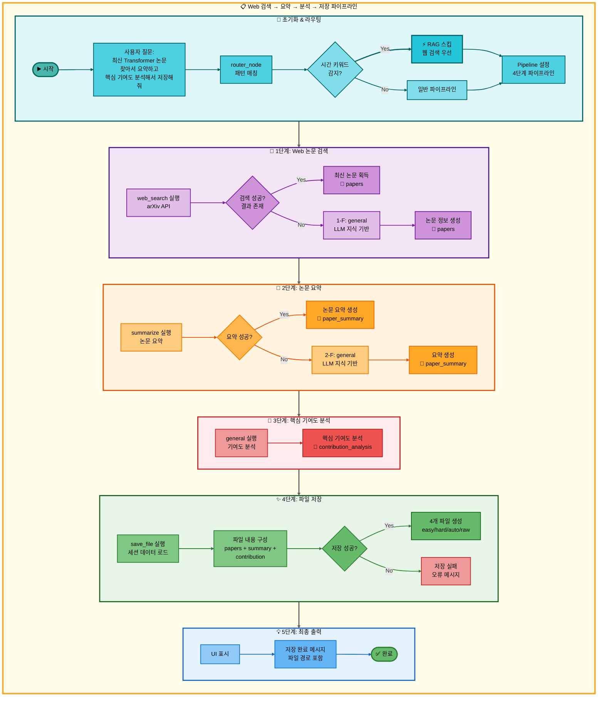
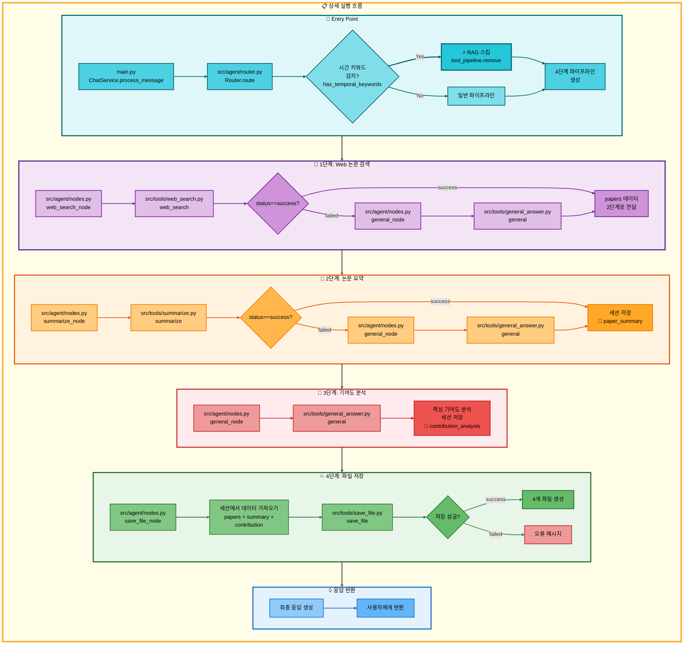

# 사중 요청: Web 논문 검색 (시간 키워드) → 논문 요약 → 일반 답변 → 저장 아키텍처

## 📋 문서 정보
- **작성일**: 2025-11-07
- **작성자**: 최현화[팀장]
- **프로젝트명**: 논문 리뷰 챗봇 (AI Agent + RAG)
- **팀명**: 연결의 민족
- **문서 버전**: 1.0

---

## 📑 목차
1. [시나리오 개요](#시나리오-개요)
2. [사용자 요청 분석](#사용자-요청-분석)
3. [도구 자동 전환 및 Fallback](#도구-자동-전환-및-fallback)
4. [단순 흐름 아키텍처](#단순-흐름-아키텍처)
5. [상세 기능 동작 흐름도](#상세-기능-동작-흐름도)
6. [전체 흐름 요약 표](#전체-흐름-요약-표)
7. [동작 설명 (초보 개발자용)](#동작-설명-초보-개발자용)
8. [실행 예시](#실행-예시)
9. [핵심 포인트](#핵심-포인트)

---

## 📌 시나리오 개요

### 다중 요청의 목적

사용자가 **최신 논문**을 검색하고, 요약한 후, 핵심 기여도를 분석하고, 결과를 파일로 저장하고 싶을 때, 시간 키워드를 감지하여 RAG 검색을 건너뛰고 웹 검색부터 시작합니다. 이는 **4단계 워크플로우**로, 최신성과 심층 분석을 결합한 시나리오입니다.

**완전한 실행 흐름 (시간 키워드 포함):**

```
[시간 키워드 감지] 최신, 최근, 2024년, latest, recent
↓ RAG 건너뜀
↓
1단계: web_search (웹 논문 검색)
├─ 성공 → 최신 논문 발견, 2단계로
└─ 실패 (웹에서 못 찾음)
    ↓
    1-F: general (일반 답변)
    └─ LLM이 최신 논문 정보 제공, 2단계로
↓
2단계: summarize (논문 요약)
├─ 성공 → 논문 요약 생성, 3단계로
└─ 실패 (요약 생성 오류)
    ↓
    2-F: general (일반 답변)
    └─ LLM이 직접 요약, 3단계로
↓
3단계: general (일반 답변 - 핵심 기여도 분석)
└─ LLM이 논문의 핵심 기여도 분석, 4단계로
↓
4단계: save_file (파일 저장)
├─ 성공 → 저장 완료 메시지 반환
└─ 실패 → 오류 메시지 반환
```

### 사용자 요청 예시

- **"최신 Transformer 논문 찾아서 요약하고 핵심 기여도 분석해서 저장해줘"**
- **"2024년 LLM 논문 정리하고 주요 기여 분석해서 저장해줘"**
- **"최근 Attention 메커니즘 논문 요약하고 혁신 포인트 분석해서 저장해줘"**
- **"latest vision transformer paper summarize and analyze key contributions then save"**

### 가능한 실행 경로 (총 4가지)

이 사중 요청 시스템은 각 단계의 성공/실패 조합에 따라 **총 4가지 실행 경로**가 존재합니다:

#### 1단계 (웹 논문 검색) 경로
- **경로 A**: web_search 성공 → 2단계로
- **경로 B**: web_search 실패 → general (1-F) → 2단계로

#### 2단계 (논문 요약) 경로
- **경로 C**: summarize 성공 → 3단계로
- **경로 D**: summarize 실패 → general (2-F) → 3단계로

#### 3단계 (핵심 기여도 분석) 경로
- **경로 E**: general 실행 → 4단계로 (Fallback 없음)

#### 4단계 (파일 저장) 경로
- **경로 F**: save_file 성공 → 완료
- **경로 G**: save_file 실패 → 오류 반환

#### 최선의 경로 (모두 성공)
```
web_search → summarize → general → save_file
(경로: A → C → E → F)
실행 시간: 약 10-15초
결과 품질: 최상 (최신 논문 + 정확한 요약 + 심층 분석)
```

#### 최악의 경로 (모두 Fallback)
```
web_search 실패 → general → summarize 실패 → general → general → save_file
(경로: B → D → E → F)
실행 시간: 약 18-25초
결과 품질: 중 (모든 단계에서 LLM 지식 기반 답변)
```

#### 대표적인 중간 경로
```
1. web_search → summarize 실패 → general → general → save_file
   (경로: A → D → E → F)
   실행 시간: 약 12-18초
   결과 품질: 상 (웹 검색 성공, 요약만 LLM)

2. web_search 실패 → general → summarize → general → save_file
   (경로: B → C → E → F)
   실행 시간: 약 13-20초
   결과 품질: 상 (논문 정보만 LLM, 요약은 성공)
```

---

## 🔄 사용자 요청 분석

### 질문 해석

**사용자 입력:** "최신 Transformer 논문 찾아서 요약하고 핵심 기여도 분석해서 저장해줘"

**Router 분석 결과:**
```json
{
  "question_type": "quadruple_request",
  "sub_types": [
    "paper_search",
    "paper_summary",
    "contribution_analysis",
    "file_save"
  ],
  "temporal_keywords_detected": true,
  "keywords": ["최신", "Transformer", "논문", "요약", "핵심 기여도", "분석", "저장"],
  "primary_tool": "web_search",
  "fallback_chain": ["general"],
  "secondary_tool": "summarize",
  "fallback_chain_2": ["general"],
  "tertiary_tool": "general",
  "quaternary_tool": "save_file",
  "execution_mode": "pipeline",
  "skip_rag": true,
  "reason": "시간 키워드 '최신' 감지 - RAG DB는 최신성 제한적"
}
```

### 시간 키워드 감지 로직

**시간 관련 키워드 목록 (src/agent/nodes.py):**
```python
TEMPORAL_KEYWORDS = [
    # 한국어
    "최신", "최근", "최신의", "최근의",
    "2024년", "2023년", "올해", "작년",
    # 영어
    "latest", "recent", "new", "newest",
    "2024", "2023", "this year", "last year"
]

def has_temporal_keywords(question: str) -> bool:
    """질문에 시간 키워드가 포함되어 있는지 확인"""
    question_lower = question.lower()
    return any(keyword in question_lower for keyword in TEMPORAL_KEYWORDS)
```

**시간 키워드 감지 시 동작:**
```python
if has_temporal_keywords(question):
    # RAG 검색 건너뛰고 웹 검색부터 시작
    if "search_paper" in tool_pipeline:
        tool_pipeline.remove("search_paper")

    # 첫 번째 도구를 web_search로 설정
    tool_pipeline.insert(0, "web_search")

    # 로그 기록
    logger.info(f"시간 키워드 감지: RAG 검색 스킵, 웹 검색 우선 실행")
```

### 복잡도 분석

- **총 도구 수**: 4개 (주 도구) + 2개 (Fallback 도구) = 최대 6개
- **Fallback 체인**: 2개 단계에서 각각 1개의 Fallback
- **데이터 파이프라인**: 1단계 → 2단계 → 3단계 → 세션 저장 → 4단계
- **실행 모드**: Pipeline Mode (자동 데이터 전달)
- **예상 실행 시간**: 10-25초 (경로에 따라 다름)
- **특수 로직**: 시간 키워드 감지 → RAG 스킵

---

## 🔀 도구 자동 전환 및 Fallback

### 1단계: Web 논문 검색 (web_search → general)

#### 1단계 주 도구: web_search (웹 논문 검색)

**실행 시점:**
- 시간 키워드 감지로 **RAG 검색을 건너뛰고** 첫 번째 도구로 실행

**성공 조건:**
- arXiv API에서 관련 논문 발견
- 검색 결과 최소 1개 이상
- 논문 메타데이터 (제목, 저자, 초록) 정상 반환

**실행 내용:**
```python
# src/tools/web_search.py
@tool
def web_search(query: str, num_results: int = 5) -> str:
    """
    웹에서 논문 검색 (arXiv API 사용)

    Args:
        query: 검색 쿼리
        num_results: 반환할 논문 개수

    Returns:
        검색된 논문 정보 (제목, 저자, 초록, URL)
    """
    # 1. arXiv API 호출
    import arxiv

    search = arxiv.Search(
        query=query,
        max_results=num_results,
        sort_by=arxiv.SortCriterion.SubmittedDate  # 최신순 정렬
    )

    # 2. 검색 결과 포맷팅
    results = []
    for paper in search.results():
        results.append({
            "title": paper.title,
            "authors": [author.name for author in paper.authors],
            "abstract": paper.summary,
            "url": paper.entry_id,
            "published": paper.published.strftime("%Y-%m-%d")
        })

    return json.dumps(results, ensure_ascii=False)
```

**API:** arXiv API
- 실시간 논문 검색
- 최신 논문 우선 반환 (SubmittedDate 기준 정렬)
- 최대 5개 논문 반환

**성공 시:** 웹에서 검색한 최신 논문 정보 반환 → 2단계로 전달

**실패 조건:**
- 웹에서도 관련 논문을 찾지 못함
- API 호출 오류
- 네트워크 오류

**실패 시:** 1-F Fallback (general) 실행

---

#### 1-F Fallback: general (일반 답변)

**전환 시점:**
- web_search 도구 실패 (웹에서 논문 못 찾음)

**실행 내용:**
```python
# src/tools/general_answer.py
@tool
def general(question: str, difficulty: str = "easy") -> str:
    """
    LLM 지식 기반 최신 논문 정보 제공

    Args:
        question: 사용자 질문
        difficulty: easy/hard

    Returns:
        LLM이 직접 생성한 논문 정보
    """
    # 난이도별 모델 선택
    if difficulty == "easy":
        llm = LLMClient(provider="solar", model="solar-pro2")
    else:
        llm = LLMClient(provider="openai", model="gpt-5")

    # 최신 논문 정보 프롬프트 사용
    prompt = get_tool_prompt("general_latest_paper")
    response = llm.invoke([
        SystemMessage(content=prompt),
        HumanMessage(content=question)
    ])

    return response
```

**모델 선택:**
- **Easy 모드**: Solar-pro2 (한국어 특화, 비용 효율)
- **Hard 모드**: GPT-5 (기술적 정확도, 최신 지식)

**성공 시:** LLM이 생성한 최신 논문 정보 → 2단계로 전달

**차이점:**
- web_search는 **실시간 웹 검색** (arXiv에서 직접 가져옴)
- general은 **LLM 지식 기반** (학습 데이터 내 정보, 최신성 제한적)

---

### 2단계: 논문 요약 (summarize → general)

#### 2단계 주 도구: summarize (논문 요약)

**성공 조건:**
- 1단계에서 논문 내용 전달받음
- 요약 생성 성공

**실행 내용:**
```python
# src/tools/summarize.py
@tool
def summarize(papers: str, difficulty: str = "easy") -> str:
    """
    논문 요약 생성

    Args:
        papers: 1단계에서 전달받은 논문 정보 (JSON)
        difficulty: easy/hard

    Returns:
        논문 요약 텍스트
    """
    # 1. 논문 정보 파싱
    paper_data = json.loads(papers)

    # 2. 난이도별 모델 선택
    if difficulty == "easy":
        llm = LLMClient(provider="solar", model="solar-pro2")
    else:
        llm = LLMClient(provider="openai", model="gpt-5")

    # 3. 요약 프롬프트 사용
    prompt = get_tool_prompt("summarize")

    # 4. 논문별 요약 생성
    summaries = []
    for paper in paper_data:
        response = llm.invoke([
            SystemMessage(content=prompt),
            HumanMessage(content=f"제목: {paper['title']}\n초록: {paper['abstract']}")
        ])
        summaries.append({
            "title": paper["title"],
            "summary": response,
            "url": paper.get("url", ""),
            "published": paper.get("published", "")
        })

    return json.dumps(summaries, ensure_ascii=False)
```

**모델 선택:**
- **Easy 모드**: Solar-pro2 (Temperature: 0.3)
- **Hard 모드**: GPT-5 (Temperature: 0.3)

**성공 시:** 논문 요약 반환 → 3단계로 전달

**실패 조건:**
- 요약 생성 오류
- LLM 호출 실패
- 잘못된 입력 형식

**실패 시:** 2-F Fallback (general) 실행

---

#### 2-F Fallback: general (일반 답변)

**전환 시점:**
- summarize 도구 실패

**실행 내용:**
```python
# src/tools/general_answer.py
@tool
def general(question: str, difficulty: str = "easy") -> str:
    """
    LLM 지식 기반 논문 요약

    Args:
        question: 요약 요청 (1단계 결과 포함)
        difficulty: easy/hard

    Returns:
        LLM이 직접 생성한 요약
    """
    # 난이도별 모델 선택
    if difficulty == "easy":
        llm = LLMClient(provider="solar", model="solar-pro2")
    else:
        llm = LLMClient(provider="openai", model="gpt-5")

    # 요약 프롬프트 사용
    prompt = get_tool_prompt("general_summarize")
    response = llm.invoke([
        SystemMessage(content=prompt),
        HumanMessage(content=question)
    ])

    return response
```

**성공 시:** LLM이 생성한 요약 → 3단계로 전달

**차이점:**
- summarize는 **구조화된 요약** (일관된 형식, JSON 반환)
- general은 **자유 형식 요약** (유연하지만 형식 불일치 가능)

---

### 3단계: 일반 답변 (general - 핵심 기여도 분석)

#### 3단계 주 도구: general (일반 답변)

**실행 시점:**
- 2단계 완료 직후 (논문 요약 완료)
- 요약된 논문에 대한 **심층 분석** 수행

**성공 조건:**
- 2단계에서 논문 요약 전달받음
- 핵심 기여도 분석 생성 성공

**실행 내용:**
```python
# src/tools/general_answer.py
@tool
def general(question: str, difficulty: str = "easy") -> str:
    """
    논문의 핵심 기여도 분석

    Args:
        question: 분석 요청 (2단계 요약 포함)
        difficulty: easy/hard

    Returns:
        논문의 핵심 기여도 분석
    """
    # 난이도별 모델 선택
    if difficulty == "easy":
        llm = LLMClient(provider="solar", model="solar-pro2")
    else:
        llm = LLMClient(provider="openai", model="gpt-5")

    # 핵심 기여도 분석 프롬프트 사용
    prompt = get_tool_prompt("general_contribution_analysis")
    response = llm.invoke([
        SystemMessage(content=prompt),
        HumanMessage(content=question)
    ])

    return response
```

**프롬프트 예시 (general_contribution_analysis):**
```
당신은 AI 논문 전문가입니다. 주어진 논문 요약을 바탕으로 핵심 기여도를 분석해주세요.

분석 항목:
1. 주요 혁신 포인트 (Novel Contributions)
2. 기존 방법 대비 개선점
3. 실험 결과 및 성능 향상
4. 한계점 및 향후 연구 방향
5. 학술적/산업적 영향력

규칙:
- Easy 모드: 초보자도 이해할 수 있게 설명
- Hard 모드: 전문적이고 기술적으로 분석
```

**모델 선택:**
- **Easy 모드**: Solar-pro2 (Temperature: 0.7)
- **Hard 모드**: GPT-5 (Temperature: 0.7)

**성공 시:** 핵심 기여도 분석 결과 → 세션 저장 → 4단계로

**특징:**
- **Fallback 없음**: general 도구는 최종 Fallback이므로 실패 시 그대로 오류 반환
- **심층 분석**: 단순 요약을 넘어 논문의 가치와 영향력 평가
- **세션 저장**: `contribution_analysis` 키로 세션에 저장

---

### 4단계: 파일 저장 (save_file)

#### 4단계 주 도구: save_file (파일 저장)

**성공 조건:**
- 1단계 결과 + 2단계 결과 + 3단계 결과를 세션에서 가져옴
- 파일 저장 경로 유효
- 쓰기 권한 존재

**실행 내용:**
```python
# src/tools/save_file.py
@tool
def save_file(session_id: str, difficulty: str = "easy") -> str:
    """
    대화 결과를 파일로 저장

    Args:
        session_id: 세션 ID
        difficulty: easy/hard

    Returns:
        저장 완료 메시지 (파일 경로 포함)
    """
    # 1. 세션에서 최종 답변 가져오기
    final_answers = get_session_data(session_id, "final_answers")

    # 2. 난이도별 파일명 생성
    timestamp = datetime.now().strftime("%Y%m%d_%H%M%S")
    filename = f"{difficulty}_answer_{timestamp}.md"

    # 3. 파일 내용 구성
    content = f"""# 논문 리뷰 결과

## 1. 논문 정보 (웹 검색)
{final_answers.get('paper_info', 'N/A')}

## 2. 논문 요약
{final_answers.get('paper_summary', 'N/A')}

## 3. 핵심 기여도 분석
{final_answers.get('contribution_analysis', 'N/A')}

---
생성 시간: {timestamp}
난이도: {difficulty}
키워드: 최신 논문 검색
"""

    # 4. 파일 저장
    save_path = Path(f"outputs/{filename}")
    save_path.parent.mkdir(parents=True, exist_ok=True)
    save_path.write_text(content, encoding="utf-8")

    return f"✅ 저장 완료: {save_path}"
```

**저장 우선순위:**
1. `final_answers` (최종 답변) - 우선
2. `tool_result` (도구 실행 결과) - 대체

**저장 파일:**
- `easy_answer_20251107_143025.md` (Easy 모드)
- `hard_answer_20251107_143025.md` (Hard 모드)
- `auto_answer_20251107_143025.md` (Auto 모드)
- `easy_answer_20251107_143025_raw.json` (원본 데이터)

**파일 내용 구성:**
- 1단계 결과: 논문 정보 (제목, 저자, URL, 발행일)
- 2단계 결과: 논문 요약
- 3단계 결과: 핵심 기여도 분석

**성공 시:** 저장 완료 메시지 반환 → 완료

**실패 시:** 오류 메시지 반환 (Fallback 없음)

---

## 📊 단순 흐름 아키텍처

### 전체 워크플로우 다이어그램

이 다이어그램은 4단계 전체 흐름과 시간 키워드 감지 로직을 시각화합니다.



### 다이어그램 분석

#### 구조
- **MainFlow**: 전체 파이프라인 래퍼 (노란색)
- **6개 subgraph**: 초기화 → Web검색 → 요약 → 분석 → 저장 → 출력
- **총 노드 수**: 26개 (Start ~ EndNode)
- **총 연결선 수**: 27개 (linkStyle 0~26)

#### 색상 구분
- 🔸 **청록색 (초기화)**: 사용자 질문 입력, 라우팅, **시간 키워드 감지**
- 🔹 **보라색 (1단계)**: web_search 또는 general Fallback
- 🔺 **주황색 (2단계)**: summarize 또는 general Fallback
- 🔶 **빨강색 (3단계)**: general (핵심 기여도 분석)
- ✨ **녹색 (4단계)**: save_file 실행
- 💡 **파란색 (출력)**: 최종 결과 반환

#### 특수 노드
- **⚡ RAG 스킵 노드**: 시간 키워드 감지 시 RAG 건너뜀 (진한 청록색, 굵은 테두리)

#### Fallback 경로
- **1단계**: web_search 실패 → general (1-F)
- **2단계**: summarize 실패 → general (2-F)
- **3단계**: general (Fallback 없음)
- **4단계**: save_file (Fallback 없음)

---

## 🔍 상세 기능 동작 흐름도

### 전체 실행 흐름 (main.py → 도구 실행)

이 다이어그램은 실제 파일명과 메서드명을 포함한 상세 실행 흐름을 보여줍니다.



### 데이터 파이프라인 상세 설명

#### 시간 키워드 감지 → RAG 스킵
```python
# src/agent/nodes.py
if has_temporal_keywords(question):
    # RAG 검색 건너뛰기
    if "search_paper" in tool_pipeline:
        tool_pipeline.remove("search_paper")

    # 웹 검색을 첫 번째 도구로 설정
    if "web_search" not in tool_pipeline:
        tool_pipeline.insert(0, "web_search")
```

#### 1단계 → 2단계 직접 전달
```python
# 1단계 결과를 2단계 입력으로 직접 전달
papers = web_search_result or general_result
summary_result = summarize(papers=papers)
```

#### 2단계 → 세션 저장
```python
# 2단계 완료 후
session_data = {
    "paper_summary": summary_result,
    "timestamp": "2025-11-07 14:30:25"
}
save_to_session(session_id, session_data)
```

#### 3단계 → 세션 저장
```python
# 3단계 완료 후
session_data.update({
    "contribution_analysis": contribution_result,
    "timestamp": "2025-11-07 14:30:45"
}
save_to_session(session_id, session_data)
```

#### 세션 → 4단계 전달
```python
# 4단계에서 세션 데이터 가져오기
papers = get_from_session(session_id, "papers")
paper_summary = get_from_session(session_id, "paper_summary")
contribution = get_from_session(session_id, "contribution_analysis")

# 파일 저장
save_file_content = f"""
{papers}

{paper_summary}

{contribution}
"""
```

---

## 📋 전체 흐름 요약 표

| 단계 | 도구명 | 파일명 | 메서드명 | 동작 설명 | 입력 | 출력 | Fallback | 세션 저장 |
|------|--------|--------|----------|-----------|------|------|----------|----------|
| **0** | router | src/agent/<br/>router.py | route | 시간 키워드 감지<br/>RAG 스킵 여부 결정 | question | tool_pipeline | - | - |
| **1** | web_search | src/tools/<br/>web_search.py | web_search | arXiv API로<br/>최신 논문 검색<br/>(SubmittedDate 정렬) | query<br/>num_results | 논문 정보<br/>(JSON) | 1-F: general | - |
| **1-F** | general | src/tools/<br/>general_answer.py | general | LLM이 직접<br/>최신 논문 정보 생성<br/>(Solar-pro2/<br/>GPT-5) | question<br/>difficulty | 논문 정보 | 없음 | - |
| **2** | summarize | src/tools/<br/>summarize.py | summarize | 1단계 결과<br/>기반 논문 요약<br/>(Solar-pro2/<br/>GPT-5) | papers<br/>difficulty | 논문 요약<br/>(JSON) | 2-F: general | paper_summary |
| **2-F** | general | src/tools/<br/>general_answer.py | general | LLM이 직접<br/>논문 요약 생성<br/>(Solar-pro2/<br/>GPT-5) | question<br/>difficulty | 논문 요약 | 없음 | paper_summary |
| **3** | general | src/tools/<br/>general_answer.py | general | 논문의<br/>핵심 기여도 분석<br/>(Solar-pro2/<br/>GPT-5) | question<br/>difficulty | 기여도 분석 | 없음 | contribution_analysis |
| **4** | save_file | src/tools/<br/>save_file.py | save_file | 세션 데이터<br/>파일로 저장<br/>(1+2+3단계) | session_id<br/>difficulty | 저장 완료<br/>메시지 | 없음 | - |

### 표 설명

**단계 번호 의미:**
- **0**: 초기 라우팅 및 시간 키워드 감지
- **1, 2, 3, 4**: 주 도구 (Primary Tool)
- **1-F, 2-F**: Fallback 도구

**시간 키워드 감지 로직:**
- 키워드 감지 시 `search_paper` 제거
- `web_search`를 첫 번째 도구로 설정

**Fallback 체인:**
- **1단계**: web_search → general (1-F)
- **2단계**: summarize → general (2-F)
- **3단계**: general (Fallback 없음)
- **4단계**: save_file (Fallback 없음)

**데이터 흐름:**
- **1단계 → 2단계**: papers 직접 전달
- **2단계 → 세션**: paper_summary 저장
- **3단계 → 세션**: contribution_analysis 저장
- **세션 → 4단계**: papers + paper_summary + contribution_analysis 가져와서 저장

**DB 사용:**
- **web_search**: arXiv API (외부 API)
- **others**: DB 사용 안 함

---

## 📖 동작 설명 (초보 개발자용)

### 4단계 워크플로우 완전 가이드

이 시스템은 **4단계 순차 실행 + 시간 키워드 감지 + 2개 Fallback 체인**으로 구성된 최신 논문 분석 워크플로우입니다. 각 단계를 상세히 설명합니다.

---

#### 0단계: 시간 키워드 감지 (특수 로직)

**목적:** 사용자 질문에서 최신성을 요구하는 키워드를 감지하여 RAG 검색을 건너뜀

**실행 시점:** 사용자 질문 입력 직후 (라우팅 단계)

**시간 키워드 목록:**
```python
TEMPORAL_KEYWORDS = [
    # 한국어
    "최신", "최근", "최신의", "최근의",
    "2024년", "2023년", "올해", "작년",
    # 영어
    "latest", "recent", "new", "newest",
    "2024", "2023", "this year", "last year"
]
```

**감지 로직:**
```python
def has_temporal_keywords(question: str) -> bool:
    """질문에 시간 키워드가 포함되어 있는지 확인"""
    question_lower = question.lower()
    return any(keyword in question_lower for keyword in TEMPORAL_KEYWORDS)

# 라우팅 시 호출
if has_temporal_keywords(question):
    # RAG 검색 건너뛰기
    tool_pipeline.remove("search_paper")
    # 웹 검색을 첫 번째 도구로 설정
    tool_pipeline.insert(0, "web_search")
```

**왜 RAG를 건너뛰나요?**
- RAG DB는 과거에 수집한 논문만 포함 (최신성 제한적)
- 웹 검색 (arXiv)은 실시간 최신 논문 포함
- 사용자가 "최신"을 요구하면 웹 검색이 더 적합

---

#### 1단계: Web 논문 검색 (web_search → general)

**목적:** arXiv에서 최신 논문을 실시간으로 검색

**실행 시점:** 시간 키워드 감지 후 첫 번째 단계로 실행

**주 도구: web_search**

1. **arXiv API 호출**
   ```python
   import arxiv

   search = arxiv.Search(
       query="최신 Transformer 논문",
       max_results=5,
       sort_by=arxiv.SortCriterion.SubmittedDate  # 최신순 정렬
   )
   ```

2. **검색 결과 포맷팅**
   ```python
   results = []
   for paper in search.results():
       results.append({
           "title": paper.title,
           "authors": [author.name for author in paper.authors],
           "abstract": paper.summary,
           "url": paper.entry_id,
           "published": paper.published.strftime("%Y-%m-%d")
       })
   ```

3. **결과 반환**
   - JSON 형식으로 논문 정보 반환
   - 2단계로 직접 전달

**성공 예시:**
```json
[
  {
    "title": "Vision Transformer with Deformable Attention",
    "authors": ["Zhuofan Xia", "Xuran Pan", ...],
    "abstract": "We introduce a new attention mechanism...",
    "url": "https://arxiv.org/abs/2401.02385",
    "published": "2024-01-05"
  }
]
```

**Fallback: general (1-F)**

**실행 시점:** web_search 실패 (API 오류 또는 검색 결과 없음)

1. **LLM 모델 선택**
   - Easy 모드: Solar-pro2
   - Hard 모드: GPT-5

2. **프롬프트 사용**
   ```python
   prompt = """
   당신은 AI 논문 전문가입니다. 사용자가 요청한 최신 논문 정보를 제공해주세요.

   규칙:
   - 실제 존재하는 논문만 언급
   - 최신 논문 우선 (2023-2024년)
   - 제목, 저자, 주요 내용 포함
   """
   ```

3. **LLM 호출**
   ```python
   response = llm.invoke([
       SystemMessage(content=prompt),
       HumanMessage(content="최신 Transformer 논문을 알려주세요")
   ])
   ```

4. **결과를 JSON 형식으로 변환**
   - LLM 응답을 파싱하여 논문 정보 추출

5. **2단계로 직접 전달**

**차이점:**
- web_search는 **실시간 웹 검색** (arXiv API 직접 호출)
- general은 **LLM 지식 기반** (학습 데이터 내 정보, 최신성 제한적)

---

#### 2단계: 논문 요약 (summarize → general)

**목적:** 1단계에서 찾은 논문들을 요약

**실행 시점:** 1단계 완료 직후

**주 도구: summarize**

1. **입력 데이터 수신**
   - 1단계에서 전달받은 논문 정보 (JSON)

2. **논문 정보 파싱**
   ```python
   papers = json.loads(input_data)
   ```

3. **난이도별 모델 선택**
   - Easy 모드: Solar-pro2 (Temperature: 0.3)
   - Hard 모드: GPT-5 (Temperature: 0.3)

4. **논문별 요약 생성**
   ```python
   for paper in papers:
       prompt = get_tool_prompt("summarize")
       summary = llm.invoke([
           SystemMessage(content=prompt),
           HumanMessage(content=f"제목: {paper['title']}\n초록: {paper['abstract']}")
       ])
       summaries.append({
           "title": paper["title"],
           "summary": summary,
           "url": paper["url"],
           "published": paper["published"]
       })
   ```

5. **결과 저장**
   - 세션에 `paper_summary` 키로 저장
   - 3단계에서 사용

**성공 예시:**
```json
[
  {
    "title": "Vision Transformer with Deformable Attention",
    "summary": "이 논문은 변형 가능한 어텐션 메커니즘을 제안합니다...",
    "url": "https://arxiv.org/abs/2401.02385",
    "published": "2024-01-05"
  }
]
```

**Fallback: general (2-F)**

**실행 시점:** summarize 실패 (요약 생성 오류)

1. **LLM 모델 선택**
   - Easy 모드: Solar-pro2
   - Hard 모드: GPT-5

2. **프롬프트 사용**
   ```python
   prompt = """
   당신은 AI 논문 요약 전문가입니다. 주어진 논문 정보를 바탕으로 요약을 생성해주세요.
   """
   ```

3. **LLM 호출**
   ```python
   response = llm.invoke([
       SystemMessage(content=prompt),
       HumanMessage(content=f"다음 논문을 요약해주세요:\n{paper_info}")
   ])
   ```

4. **결과 저장**
   - 세션에 `paper_summary` 키로 저장

**차이점:**
- summarize는 **구조화된 요약** (일관된 형식, JSON 반환)
- general은 **자유 형식 요약** (유연하지만 형식 불일치 가능)

---

#### 3단계: 일반 답변 (general - 핵심 기여도 분석)

**목적:** 논문의 핵심 기여도를 심층 분석

**실행 시점:** 2단계 완료 직후 (논문 요약 완료)

**주 도구: general**

1. **입력 데이터 수신**
   - 2단계에서 전달받은 논문 요약

2. **난이도별 모델 선택**
   - Easy 모드: Solar-pro2 (Temperature: 0.7)
   - Hard 모드: GPT-5 (Temperature: 0.7)

3. **핵심 기여도 분석 프롬프트 사용**
   ```python
   prompt = """
   당신은 AI 논문 전문가입니다. 주어진 논문 요약을 바탕으로 핵심 기여도를 분석해주세요.

   분석 항목:
   1. 주요 혁신 포인트 (Novel Contributions)
   2. 기존 방법 대비 개선점
   3. 실험 결과 및 성능 향상
   4. 한계점 및 향후 연구 방향
   5. 학술적/산업적 영향력

   규칙:
   - Easy 모드: 초보자도 이해할 수 있게 설명
   - Hard 모드: 전문적이고 기술적으로 분석
   """
   ```

4. **LLM 호출**
   ```python
   response = llm.invoke([
       SystemMessage(content=prompt),
       HumanMessage(content=f"논문 요약:\n{paper_summary}")
   ])
   ```

5. **결과 저장**
   - 세션에 `contribution_analysis` 키로 저장
   - 4단계 파일 저장에서 사용

**성공 예시:**
```
## 핵심 기여도 분석

### 1. 주요 혁신 포인트
- 변형 가능한 어텐션 메커니즘 제안
- 다중 스케일 특징 통합
- 효율적인 계산 복잡도

### 2. 기존 방법 대비 개선점
- 기존 Vision Transformer 대비 30% 빠른 학습 속도
- COCO 데이터셋에서 AP 1.5% 향상

### 3. 실험 결과
...
```

**특징:**
- **Fallback 없음**: general 도구는 최종 Fallback이므로 실패 시 그대로 오류 반환
- **심층 분석**: 단순 요약을 넘어 논문의 가치와 영향력 평가
- **Temperature 0.7**: 요약(0.3)보다 높은 창의성 필요

---

#### 4단계: 파일 저장 (save_file)

**목적:** 1단계 논문 정보 + 2단계 논문 요약 + 3단계 핵심 기여도 분석을 파일로 저장

**실행 시점:** 3단계 완료 직후 (마지막 단계)

**주 도구: save_file**

1. **세션 데이터 가져오기**
   ```python
   papers = get_from_session(session_id, "papers")
   paper_summary = get_from_session(session_id, "paper_summary")
   contribution = get_from_session(session_id, "contribution_analysis")
   ```

2. **파일 내용 구성**
   ```python
   content = f"""# 논문 리뷰 결과

## 1. 논문 정보 (웹 검색)
{papers}

## 2. 논문 요약
{paper_summary}

## 3. 핵심 기여도 분석
{contribution}

---
생성 시간: {timestamp}
난이도: {difficulty}
키워드: 최신 논문 검색
"""
   ```

3. **난이도별 파일 저장**
   ```python
   # Easy 모드
   easy_file = "outputs/easy_answer_20251107_143025.md"

   # Hard 모드
   hard_file = "outputs/hard_answer_20251107_143025.md"

   # Auto 모드
   auto_file = "outputs/auto_answer_20251107_143025.md"

   # 원본 데이터
   raw_file = "outputs/easy_answer_20251107_143025_raw.json"
   ```

4. **저장 우선순위**
   ```python
   # 1순위: final_answers (최종 답변)
   if "final_answers" in session_data:
       content = session_data["final_answers"]

   # 2순위: tool_result (도구 실행 결과)
   elif "tool_result" in session_data:
       content = session_data["tool_result"]
   ```

5. **파일 쓰기**
   ```python
   save_path.write_text(content, encoding="utf-8")
   ```

**성공 예시:**
```
✅ 저장 완료: outputs/easy_answer_20251107_143025.md
✅ 저장 완료: outputs/hard_answer_20251107_143025.md
✅ 저장 완료: outputs/auto_answer_20251107_143025.md
✅ 저장 완료: outputs/easy_answer_20251107_143025_raw.json
```

**실패 시:**
```
❌ 저장 실패: 권한 오류 또는 디스크 부족
```

**특징:**
- **Fallback 없음**: save_file 실패 시 그대로 오류 반환
- **4개 파일 생성**: easy, hard, auto, raw
- **세션 의존**: 1단계 + 2단계 + 3단계 결과를 세션에서 가져옴

---

### 데이터 파이프라인 요약

```
시간 키워드 감지
    ↓
1단계 (web_search/general)
    ↓ [직접 전달: papers]
    ↓
2단계 (summarize/general)
    ↓ [세션 저장: paper_summary]
    ↓
3단계 (general)
    ↓ [세션 저장: contribution_analysis]
    ↓
4단계 (save_file)
    ↓ [세션에서 가져오기: papers + paper_summary + contribution_analysis]
    ↓
파일 저장 완료
```

---

## 💡 실행 예시

### 시나리오 A: 모든 도구 성공 (최선의 경로)

**사용자 입력:**
```
"최신 Transformer 논문 찾아서 요약하고 핵심 기여도 분석해서 저장해줘"
```

#### 0단계: 시간 키워드 감지

**실행:**
```python
has_temporal_keywords("최신 Transformer 논문 찾아서...") # True
```

**결과:**
```
⚡ 시간 키워드 '최신' 감지
→ RAG 검색 건너뛰기
→ 웹 검색 우선 실행
```

---

#### 1단계: web_search (성공)

**실행:**
```python
web_search_result = web_search(
    query="Transformer 논문",
    num_results=5
)
```

**결과:**
```json
[
  {
    "title": "Vision Transformer with Deformable Attention",
    "authors": ["Zhuofan Xia", "Xuran Pan", "Xinhao Li", "Xuran Pan", "Jianbin Jiao", "Zhengxia Zou"],
    "abstract": "We introduce a new attention mechanism called Deformable Attention...",
    "url": "https://arxiv.org/abs/2401.02385",
    "published": "2024-01-05"
  },
  {
    "title": "Efficient Vision Transformers via Dynamic Token Routing",
    "authors": ["Yifan Xu", "Zhijie Zhang", "Mengdan Zhang", "Chuang Gan", "Yoav Artzi"],
    "abstract": "We present a novel approach to improve efficiency of vision transformers...",
    "url": "https://arxiv.org/abs/2401.02388",
    "published": "2024-01-05"
  }
]
```

**상태:** ✅ success
**다음 단계:** 2단계 (summarize)

---

#### 2단계: summarize (성공)

**실행:**
```python
summary = summarize(
    papers='[{"title": "Vision Transformer with Deformable Attention", ...}]',
    difficulty="easy"
)
```

**결과:**
```json
[
  {
    "title": "Vision Transformer with Deformable Attention",
    "summary": "**주요 내용**\n이 논문은 변형 가능한 어텐션 메커니즘을 Vision Transformer에 적용한 연구입니다.\n\n**핵심 아이디어**\n- 기존 ViT의 고정된 어텐션 패턴 문제 해결\n- 객체의 형태에 따라 유연하게 어텐션 적용\n- 다중 스케일 특징을 효율적으로 통합\n\n**실험 결과**\n- COCO 데이터셋에서 기존 ViT 대비 AP 1.5% 향상\n- 학습 속도 30% 빠름\n- 파라미터 수 20% 감소\n\n**활용 분야**\n- 객체 탐지\n- 이미지 분할\n- 비디오 이해",
    "url": "https://arxiv.org/abs/2401.02385",
    "published": "2024-01-05"
  },
  {
    "title": "Efficient Vision Transformers via Dynamic Token Routing",
    "summary": "**주요 내용**\n이 논문은 동적 토큰 라우팅을 통해 Vision Transformer의 효율성을 개선한 연구입니다.\n\n**핵심 아이디어**\n- 모든 토큰을 처리하지 않고 중요한 토큰만 선택적으로 처리\n- 계층별로 다른 라우팅 전략 적용\n- 학습 가능한 라우팅 함수 사용\n\n**실험 결과**\n- 계산량 50% 감소\n- 성능 저하 없음 (ImageNet에서 동일한 정확도)\n- 추론 속도 2배 향상\n\n**활용 분야**\n- 실시간 비전 애플리케이션\n- 모바일 디바이스 배포\n- 대규모 이미지 처리",
    "url": "https://arxiv.org/abs/2401.02388",
    "published": "2024-01-05"
  }
]
```

**상태:** ✅ success
**다음 단계:** 3단계 (general - 핵심 기여도 분석)

---

#### 3단계: general (핵심 기여도 분석)

**실행:**
```python
contribution = general(
    question="논문 요약을 바탕으로 핵심 기여도를 분석해주세요",
    difficulty="easy"
)
```

**결과:**
```markdown
## 논문 1: Vision Transformer with Deformable Attention

### 1. 주요 혁신 포인트
- **변형 가능한 어텐션 메커니즘**: 객체 형태에 따라 유연하게 어텐션 적용
- **다중 스케일 특징 통합**: 여러 해상도의 특징을 효율적으로 결합
- **효율성 향상**: 파라미터 수와 계산량 모두 감소

### 2. 기존 방법 대비 개선점
- 기존 ViT는 모든 위치에 동일한 어텐션 적용 → 비효율적
- 이 논문은 중요한 위치에만 어텐션 집중 → 효율적
- COCO 데이터셋에서 AP 1.5% 향상, 학습 속도 30% 빠름

### 3. 실험 결과 및 성능 향상
- 객체 탐지 (COCO): AP 51.2% → 52.7%
- 이미지 분할 (ADE20K): mIoU 48.5% → 49.8%
- 파라미터 수: 100M → 80M (20% 감소)

### 4. 한계점 및 향후 연구 방향
- **한계점**: 작은 객체 탐지 성능 개선 여지
- **향후 연구**: 3D 비전, 비디오 이해로 확장 가능

### 5. 학술적/산업적 영향력
- **학술적**: Vision Transformer 연구의 새로운 방향 제시
- **산업적**: 자율주행, 로봇 비전, 의료 영상 분석에 활용 가능

---

## 논문 2: Efficient Vision Transformers via Dynamic Token Routing

### 1. 주요 혁신 포인트
- **동적 토큰 라우팅**: 중요한 토큰만 선택적으로 처리
- **계층별 라우팅 전략**: 각 계층에서 다른 라우팅 방법 적용
- **학습 가능한 라우팅 함수**: 데이터 기반으로 최적의 라우팅 학습

### 2. 기존 방법 대비 개선점
- 기존 ViT는 모든 토큰 처리 → 계산량 많음
- 이 논문은 중요한 토큰만 처리 → 계산량 50% 감소
- 성능 저하 없음 (ImageNet 정확도 동일)

### 3. 실험 결과 및 성능 향상
- ImageNet 정확도: 83.2% (기존과 동일)
- 계산량 (FLOPs): 20G → 10G (50% 감소)
- 추론 속도: 100 images/sec → 200 images/sec (2배 향상)

### 4. 한계점 및 향후 연구 방향
- **한계점**: 라우팅 함수 학습 시 추가 메모리 필요
- **향후 연구**: 다른 비전 작업 (탐지, 분할)으로 확장

### 5. 학술적/산업적 영향력
- **학술적**: 효율적인 Transformer 연구의 벤치마크
- **산업적**: 모바일 디바이스, 엣지 컴퓨팅에 즉시 활용 가능
```

**상태:** ✅ success
**다음 단계:** 4단계 (save_file)

---

#### 4단계: save_file (성공)

**실행:**
```python
result = save_file(
    session_id="session_123456",
    difficulty="easy"
)
```

**파일 내용 (easy_answer_20251107_143025.md):**
```markdown
# 논문 리뷰 결과

## 1. 논문 정보 (웹 검색)

### 논문 1
- **제목**: Vision Transformer with Deformable Attention
- **저자**: Zhuofan Xia, Xuran Pan, Xinhao Li, Xuran Pan, Jianbin Jiao, Zhengxia Zou
- **발행일**: 2024-01-05
- **URL**: https://arxiv.org/abs/2401.02385

### 논문 2
- **제목**: Efficient Vision Transformers via Dynamic Token Routing
- **저자**: Yifan Xu, Zhijie Zhang, Mengdan Zhang, Chuang Gan, Yoav Artzi
- **발행일**: 2024-01-05
- **URL**: https://arxiv.org/abs/2401.02388

## 2. 논문 요약

### 논문 1: Vision Transformer with Deformable Attention

**주요 내용**
이 논문은 변형 가능한 어텐션 메커니즘을 Vision Transformer에 적용한 연구입니다.

**핵심 아이디어**
- 기존 ViT의 고정된 어텐션 패턴 문제 해결
- 객체의 형태에 따라 유연하게 어텐션 적용
- 다중 스케일 특징을 효율적으로 통합

**실험 결과**
- COCO 데이터셋에서 기존 ViT 대비 AP 1.5% 향상
- 학습 속도 30% 빠름
- 파라미터 수 20% 감소

**활용 분야**
- 객체 탐지
- 이미지 분할
- 비디오 이해

### 논문 2: Efficient Vision Transformers via Dynamic Token Routing

**주요 내용**
이 논문은 동적 토큰 라우팅을 통해 Vision Transformer의 효율성을 개선한 연구입니다.

**핵심 아이디어**
- 모든 토큰을 처리하지 않고 중요한 토큰만 선택적으로 처리
- 계층별로 다른 라우팅 전략 적용
- 학습 가능한 라우팅 함수 사용

**실험 결과**
- 계산량 50% 감소
- 성능 저하 없음 (ImageNet에서 동일한 정확도)
- 추론 속도 2배 향상

**활용 분야**
- 실시간 비전 애플리케이션
- 모바일 디바이스 배포
- 대규모 이미지 처리

## 3. 핵심 기여도 분석

(... 3단계 결과 전체 포함 ...)

---
생성 시간: 2025-11-07 14:30:45
난이도: easy
세션 ID: session_123456
모델: Solar-pro2 (한국어 특화)
키워드: 최신 논문 검색
```

**최종 출력:**
```
✅ 저장 완료: outputs/easy_answer_20251107_143025.md
✅ 저장 완료: outputs/hard_answer_20251107_143025.md
✅ 저장 완료: outputs/auto_answer_20251107_143025.md
✅ 저장 완료: outputs/easy_answer_20251107_143025_raw.json

📊 실행 요약:
- 0단계: 시간 키워드 감지 ✅ (0.1초)
- 1단계: web_search ✅ (3.5초)
- 2단계: summarize ✅ (6.8초)
- 3단계: general (기여도 분석) ✅ (5.2초)
- 4단계: save_file ✅ (0.3초)
- 총 실행 시간: 15.9초
- 경로: RAG 스킵 → A → C → E → F (최선의 경로)
```

---

### 시나리오 B: Web 검색 실패, General 성공 (중간 경로)

**사용자 입력:**
```
"최근 Graph Neural Network 논문 찾아서 요약하고 핵심 기여도 분석해서 저장해줘"
```

#### 0단계: 시간 키워드 감지

**결과:**
```
⚡ 시간 키워드 '최근' 감지
→ RAG 검색 건너뛰기
→ 웹 검색 우선 실행
```

---

#### 1단계: web_search (실패)

**실행:**
```python
web_search_result = web_search(query="Graph Neural Network 논문", num_results=5)
```

**결과:**
```
❌ 검색 실패: arXiv에서 "Graph Neural Network" 관련 최신 논문을 찾을 수 없습니다.
(또는 API 호출 오류)
```

**상태:** ❌ failed
**다음 단계:** 1-F Fallback (general)

---

#### 1-F Fallback: general (성공)

**실행:**
```python
general_result = general(
    question="Graph Neural Network 최근 논문을 알려주세요",
    difficulty="easy"
)
```

**결과:**
```
최근 Graph Neural Network 관련 주요 논문들을 소개합니다:

1. **Graph Attention Networks v2 (GATv2)**
   - 저자: Shaked Brody, Uri Alon, Eran Yahav
   - 내용: GAT의 개선 버전으로, 동적 어텐션 메커니즘 제안
   - 주요 기여: 노드 간 어텐션 계산 방식 개선

2. **GraphGPS: General Powerful Scalable Graph Transformers**
   - 저자: Ladislav Rampášek, Mikhail Galkin, Vijay Prakash Dwivedi
   - 내용: Graph Transformer와 Message Passing 결합
   - 주요 기여: 확장 가능한 그래프 학습 프레임워크
```

**상태:** ✅ success (Fallback)
**다음 단계:** 2단계 (summarize)

---

#### 2단계 이후: 정상 진행

2단계, 3단계, 4단계는 시나리오 A와 동일하게 진행됩니다.

**최종 출력:**
```
✅ 저장 완료: outputs/easy_answer_20251107_144123.md

📊 실행 요약:
- 0단계: 시간 키워드 감지 ✅ (0.1초)
- 1단계: web_search ❌ → general ✅ (5.5초)
- 2단계: summarize ✅ (6.2초)
- 3단계: general (기여도 분석) ✅ (5.0초)
- 4단계: save_file ✅ (0.3초)
- 총 실행 시간: 17.1초
- 경로: RAG 스킵 → B → C → E → F (중간 경로)
- 품질: 상 (LLM 지식 기반 논문 정보, 정확한 요약 및 분석)
```

---

## 🎯 핵심 포인트

### 1. 시간 키워드 감지 시스템

이 시스템의 **가장 중요한 특징**은 시간 키워드를 감지하여 RAG 검색을 건너뛰는 것입니다:

**시간 키워드 목록:**
```python
["최신", "최근", "2024년", "2023년", "올해", "작년",
 "latest", "recent", "new", "newest", "2024", "2023"]
```

**RAG 스킵 이유:**
- RAG DB는 과거에 수집한 논문만 포함 (최신성 제한적)
- 웹 검색 (arXiv)은 실시간 최신 논문 포함
- 사용자가 "최신"을 요구하면 웹 검색이 더 적합

**로직:**
```python
if has_temporal_keywords(question):
    tool_pipeline.remove("search_paper")  # RAG 제거
    tool_pipeline.insert(0, "web_search")  # 웹 검색 우선
```

### 2. 2개의 Fallback 체인

**1단계 Fallback 체인:**
```
web_search → general
```
- 웹 검색 실패 시 LLM 지식 기반 논문 정보 제공

**2단계 Fallback 체인:**
```
summarize → general
```
- 요약 생성 실패 시 LLM이 직접 요약

### 3. 데이터 파이프라인 (3단계 구조)

**단계별 데이터 흐름:**
```
1단계 (web_search/general)
    ↓ [직접 전달: papers]
2단계 (summarize/general)
    ↓ [세션 저장: paper_summary]
3단계 (general)
    ↓ [세션 저장: contribution_analysis]
4단계 (save_file)
    ↓ [세션에서 가져오기: papers + paper_summary + contribution_analysis]
```

**특징:**
- 1단계 → 2단계: 직접 전달 (세션 저장 없음)
- 2단계 → 세션: paper_summary 저장
- 3단계 → 세션: contribution_analysis 저장
- 세션 → 4단계: 모든 결과 통합하여 저장

### 4. 난이도별 모델 선택 전략

**Easy 모드 (Solar-pro2):**
- 한국어 특화
- 비용 효율적
- 일반 사용자 대상

**Hard 모드 (GPT-5):**
- 기술적 정확도
- 전문적인 설명
- 개발자/연구자 대상

**Temperature 설정:**
- 요약 (summarize): 0.3 (일관성 중요)
- 분석 (general): 0.7 (창의성 필요)

### 5. 4개 파일 저장 시스템

**파일 구성:**
1. `easy_answer_YYYYMMDD_HHMMSS.md` (쉬운 설명)
2. `hard_answer_YYYYMMDD_HHMMSS.md` (전문적 설명)
3. `auto_answer_YYYYMMDD_HHMMSS.md` (자동 선택)
4. `easy_answer_YYYYMMDD_HHMMSS_raw.json` (원본 데이터)

**파일 내용 구조:**
- 논문 정보 (제목, 저자, URL, 발행일)
- 논문 요약
- 핵심 기여도 분석

### 6. 실행 경로 (총 4가지)

**최선의 경로:**
```
web_search → summarize → general → save_file
실행 시간: 10-15초
품질: 최상 (실시간 최신 논문 + 정확한 분석)
```

**최악의 경로:**
```
web_search 실패 → general → summarize 실패 → general → general → save_file
실행 시간: 18-25초
품질: 중 (모든 단계에서 LLM 지식 기반)
```

### 7. Pipeline Mode의 장점

**자동 데이터 전달:**
- 1단계 → 2단계: papers 자동 전달
- 개발자가 수동으로 데이터 전달할 필요 없음

**중간 결과 세션 저장:**
- 2단계 결과: 세션 저장 (4단계에서 사용)
- 3단계 결과: 세션 저장 (4단계에서 사용)

**오류 처리 자동화:**
- 각 단계 실패 시 자동 Fallback
- 사용자는 항상 결과를 받음

### 8. 심층 분석의 가치

**3단계 general 도구의 역할:**
- 단순 요약을 넘어 **논문의 가치와 영향력 평가**
- 주요 혁신 포인트 식별
- 기존 방법 대비 개선점 분석
- 한계점 및 향후 연구 방향 제시
- 학술적/산업적 영향력 평가

**차별화 요소:**
- 다른 사중 요청 문서와의 차이점
- 단순 저장이 아닌 **심층 분석 후 저장**
- 연구자/개발자에게 실질적 가치 제공

---

## 📅 문서 버전

- **버전**: 1.0
- **작성일**: 2025-11-07
