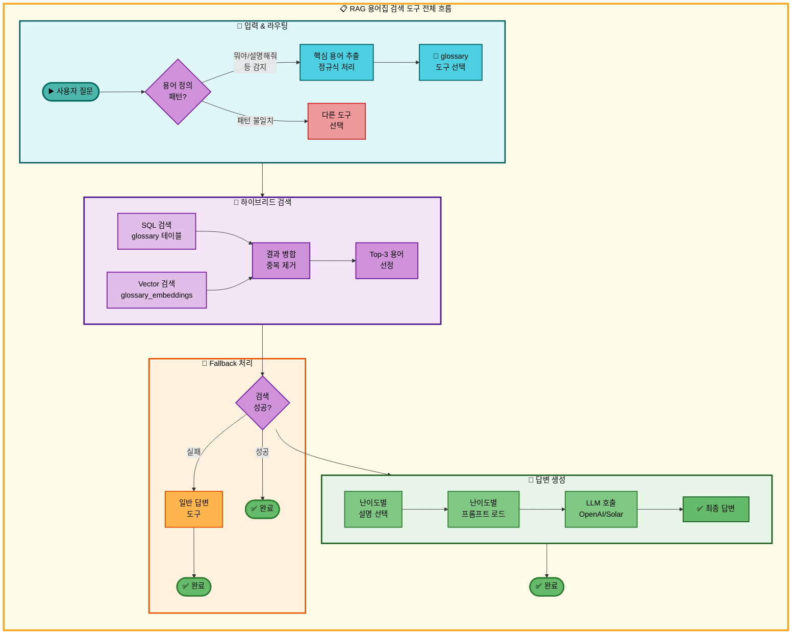

# RAG 용어집 검색 도구 아키텍처

## 📋 문서 정보
- **작성일**: 2025-11-07
- **작성자**: 최현화[팀장]
- **프로젝트명**: 논문 리뷰 챗봇 (AI Agent + RAG)
- **팀명**: 연결의 민족
- **문서 버전**: 1.0

---

## 📑 목차
1. [도구 개요](#도구-개요)
2. [도구 실행 조건](#도구-실행-조건)
3. [도구 자동 전환 및 Fallback](#도구-자동-전환-및-fallback)
4. [단순 흐름 아키텍처](#단순-흐름-아키텍처)
5. [상세 기능 동작 흐름도](#상세-기능-동작-흐름도)
6. [동작 설명](#동작-설명)
7. [사용 예시](#사용-예시)
8. [핵심 포인트](#핵심-포인트)
9. [참고 정보](#참고-정보)

---

## 📌 도구 개요

### 목적과 역할

RAG 용어집 검색 도구는 PostgreSQL + pgvector 기반의 용어집 데이터베이스에서 AI/머신러닝 관련 용어의 정의와 설명을 검색하는 도구입니다.

**핵심 역할:**
- 사용자 질문에서 핵심 용어를 자동 추출 ("RAG가 뭐야?" → "RAG")
- PostgreSQL ILIKE 검색과 pgvector 유사도 검색을 결합한 하이브리드 검색
- 난이도별 설명 제공 (easy/hard/auto 모드)
- 검색 결과를 난이도별 프롬프트로 LLM에 전달하여 자연스러운 답변 생성

**사용 데이터:**
- **PostgreSQL 테이블**: `glossary` (용어명, 정의, 쉬운 설명, 어려운 설명, 카테고리, 난이도, 연관 용어, 예시 등)
- **pgvector 컬렉션**: `glossary_embeddings` (용어 정의의 1536차원 임베딩)
- **임베딩 모델**: OpenAI `text-embedding-3-small`

**검색 메커니즘:**
- SQL 검색 (50% 가중치): PostgreSQL ILIKE로 term, definition, explanation 검색
- Vector 검색 (50% 가중치): pgvector 유사도 검색
- 하이브리드 병합: 중복 제거 후 Top-K 용어 선정

---

## 📋 도구 실행 조건

### 언제 실행되는가?

**1. 사용자가 IT 용어나 논문 관련 용어에 대해 물어볼 때**
- "RAG가 뭐야?"
- "Transformer를 설명해줘"
- "BLEU Score란?"

**2. 용어 정의 질문 패턴**

다양한 질문 형식을 인식합니다:
- "~가 뭐야?", "~이 뭐야?", "~는 뭐야?"
- "~을 설명해줘", "~를 설명해줘"
- "~에 대해 알려줘", "~에 대해서 설명해줘"
- "~란?", "~의 정의", "~의 의미"

**3. 패턴 매칭 우선순위**

`configs/multi_request_patterns.yaml`에서 정의된 패턴:

```yaml
- keywords: []
  any_of_keywords: [뭐야, 뭔데, 뭔지, 무엇인지, 어떤건지, 어떤거야]
  exclude_keywords: [논문, 검색, 찾아, 저장]
  tools: [glossary]
  priority: 200
```

**실행 조건 검증:**
1. `any_of_keywords`에 하나라도 포함 → OR 조건
2. `exclude_keywords`에 해당 키워드 없음 → 제외 조건
3. 우선순위 200 (최고 우선순위)로 다른 패턴보다 우선 매칭

---

## 🔄 도구 자동 전환 및 Fallback

### Fallback Chain 흐름

```
사용자 용어 질문
  ↓
[1] RAG 용어집 검색 도구 실행
  ├─ 성공 → 용어 정의 반환 → END
  └─ 실패 (용어집에 없음)
      ↓
[2] 일반 답변 도구로 자동 전환
  └─ LLM이 직접 용어 설명 → END
```

### Fallback 트리거 조건

**실패 감지 패턴** (`src/agent/failure_detector.py`):

```python
FAILURE_PATTERNS = [
    "관련 용어를 찾을 수 없습니다",  # ← glossary 검색 실패 메시지
    "용어집 검색 오류",              # ← Exception 발생 시
]
```

**빈 결과 처리** (`src/tools/glossary.py:277-278`):

```python
if not items:
    return "관련 용어를 찾을 수 없습니다."
```

### Fallback Chain 설정

**`configs/model_config.yaml` 설정:**

```yaml
fallback_chain:
  enabled: true
  max_retries: 3
  priorities:
    term_definition:
      - glossary   # 1순위: 용어집 검색
      - general    # 2순위: 일반 답변
```

---

## 🎨 단순 흐름 아키텍처



---

## 🔍 상세 기능 동작 흐름도

```mermaid
graph TB
    subgraph MainFlow["📋 RAG 용어집 검색 도구 상세 실행 흐름"]
        direction TB

        subgraph Init["🔸 초기화 & 라우팅"]
            direction LR
            A[main.py] --> B[ui/app.py<br/>initialize_agent]
            B --> C[src/agent/graph.py<br/>create_agent_graph]
            C --> D[src/agent/nodes.py<br/>router_node]
            D --> E{패턴 매칭}
            E -->|매칭 성공| F[multi_request_patterns.yaml<br/>priority: 200]
            E -->|매칭 실패| G[LLM 라우팅]
            F --> H[tool_choice =<br/>'glossary']
            G --> H
        end

        subgraph ToolExec["🔹 도구 실행"]
            direction LR
            I[src/agent/nodes.py<br/>glossary_node] --> J[refined_query 또는<br/>question 추출]
            J --> K[src/tools/glossary.py<br/>search_glossary]
            K --> L[_extract_term_from_question<br/>용어 추출]
        end

        subgraph TermExtract["🔺 용어 추출"]
            direction LR
            M[정규식 패턴 적용] --> N["가 뭐야, 를 설명해줘<br/>등 조사 제거"]
            N --> O[물음표 제거]
            O --> P[공백 제거]
            P --> Q[핵심 용어<br/>추출 완료]
        end

        subgraph SQLSearch["🔶 SQL 검색"]
            direction LR
            R[_fetch_glossary_sql<br/>함수 호출] --> S[WHERE 절 구성<br/>ILIKE 조건]
            S --> T[PostgreSQL<br/>glossary 테이블]
            T --> U[term, definition,<br/>easy_explanation,<br/>hard_explanation<br/>컬럼 검색]
            U --> V[결과 반환<br/>List Dict]
        end

        subgraph VectorSearch["🔷 Vector 검색"]
            direction LR
            W[_vector_search_glossary<br/>함수 호출] --> X[_get_glossary_vectorstore<br/>VectorStore 초기화]
            X --> Y[PGVector 연결<br/>glossary_embeddings]
            Y --> Z[similarity_search_with_score<br/>유사도 검색]
            Z --> AA[결과 + 점수<br/>반환]
        end

        subgraph Merge["💾 결과 병합"]
            direction LR
            AB[SQL 결과] --> AD[중복 제거<br/>term + definition<br/>기준]
            AC[Vector 결과] --> AD
            AD --> AE[Top-3 선정]
            AE --> AF[_format_glossary_md<br/>Markdown 포맷팅]
        end

        subgraph DifficultySelect["✨ 난이도 선택"]
            direction LR
            AG[_pick_explanation<br/>함수 호출] --> AH{difficulty<br/>모드?}
            AH -->|easy| AI[easy_explanation<br/>우선 선택]
            AH -->|hard| AJ[hard_explanation<br/>우선 선택]
            AH -->|auto| AK[difficulty_level<br/>기준 자동 선택]
        end

        subgraph AnswerGen["🎨 답변 생성"]
            direction LR
            AL[난이도 확인<br/>easy/hard] --> AM[prompts/tool_prompts.json<br/>프롬프트 로드]
            AM --> AN[2개 수준 답변 생성<br/>elementary+beginner<br/>또는<br/>intermediate+advanced]
            AN --> AO[src/llm/client.py<br/>LLMClient.invoke]
            AO --> AP[최종 답변<br/>final_answer]
        end

        subgraph FailureCheck["⚠️ 실패 감지"]
            direction LR
            AQ{결과 확인} -->|빈 결과| AR[실패 메시지<br/>'관련 용어를<br/>찾을 수 없습니다']
            AQ -->|결과 있음| AS[성공]
            AR --> AT[src/agent/failure_detector.py<br/>is_failed 검증]
            AT --> AU[tool_status =<br/>'failed']
            AU --> AV[src/agent/nodes.py<br/>fallback_router_node]
        end

        %% 단계 간 연결
        Init --> ToolExec
        ToolExec --> TermExtract
        TermExtract --> SQLSearch
        TermExtract --> VectorSearch
        SQLSearch --> Merge
        VectorSearch --> Merge
        Merge --> DifficultySelect
        DifficultySelect --> FailureCheck
        FailureCheck --> AnswerGen
    end

    %% 메인 워크플로우 배경
    style MainFlow fill:#fffde7,stroke:#f9a825,stroke-width:4px,color:#000

    %% Subgraph 스타일
    style Init fill:#e0f7fa,stroke:#006064,stroke-width:3px,color:#000
    style ToolExec fill:#e1f5ff,stroke:#01579b,stroke-width:3px,color:#000
    style TermExtract fill:#f3e5f5,stroke:#4a148c,stroke-width:3px,color:#000
    style SQLSearch fill:#fff3e0,stroke:#e65100,stroke-width:3px,color:#000
    style VectorSearch fill:#e8f5e9,stroke:#1b5e20,stroke-width:3px,color:#000
    style Merge fill:#e3f2fd,stroke:#1565c0,stroke-width:3px,color:#000
    style DifficultySelect fill:#fce4ec,stroke:#880e4f,stroke-width:3px,color:#000
    style AnswerGen fill:#ffebee,stroke:#c62828,stroke-width:3px,color:#000
    style FailureCheck fill:#f1f8e9,stroke:#558b2f,stroke-width:3px,color:#000

    %% 노드 스타일 (초기화 - 청록 계열)
    style A fill:#4dd0e1,stroke:#006064,stroke-width:2px,color:#000
    style B fill:#4dd0e1,stroke:#006064,stroke-width:2px,color:#000
    style C fill:#4dd0e1,stroke:#006064,stroke-width:2px,color:#000
    style D fill:#4dd0e1,stroke:#006064,stroke-width:2px,color:#000
    style E fill:#ce93d8,stroke:#7b1fa2,stroke-width:2px,color:#000
    style F fill:#4dd0e1,stroke:#006064,stroke-width:2px,color:#000
    style G fill:#4dd0e1,stroke:#006064,stroke-width:2px,color:#000
    style H fill:#4dd0e1,stroke:#006064,stroke-width:2px,color:#000

    %% 노드 스타일 (도구 실행 - 파랑 계열)
    style I fill:#90caf9,stroke:#1976d2,stroke-width:2px,color:#000
    style J fill:#81d4fa,stroke:#0288d1,stroke-width:2px,color:#000
    style K fill:#64b5f6,stroke:#1976d2,stroke-width:2px,color:#000
    style L fill:#90caf9,stroke:#1976d2,stroke-width:2px,color:#000

    %% 노드 스타일 (용어 추출 - 보라 계열)
    style M fill:#e1bee7,stroke:#7b1fa2,stroke-width:2px,color:#000
    style N fill:#ce93d8,stroke:#6a1b9a,stroke-width:2px,color:#000
    style O fill:#e1bee7,stroke:#7b1fa2,stroke-width:2px,color:#000
    style P fill:#ce93d8,stroke:#6a1b9a,stroke-width:2px,color:#000
    style Q fill:#e1bee7,stroke:#7b1fa2,stroke-width:2px,color:#000

    %% 노드 스타일 (SQL 검색 - 주황 계열)
    style R fill:#ffcc80,stroke:#f57c00,stroke-width:2px,color:#000
    style S fill:#ffb74d,stroke:#f57c00,stroke-width:2px,color:#000
    style T fill:#ffa726,stroke:#ef6c00,stroke-width:2px,color:#000
    style U fill:#ffcc80,stroke:#f57c00,stroke-width:2px,color:#000
    style V fill:#ffb74d,stroke:#f57c00,stroke-width:2px,color:#000

    %% 노드 스타일 (Vector 검색 - 녹색 계열)
    style W fill:#a5d6a7,stroke:#388e3c,stroke-width:2px,color:#000
    style X fill:#81c784,stroke:#2e7d32,stroke-width:2px,color:#000
    style Y fill:#66bb6a,stroke:#1b5e20,stroke-width:2px,color:#000
    style Z fill:#a5d6a7,stroke:#388e3c,stroke-width:2px,color:#000
    style AA fill:#81c784,stroke:#2e7d32,stroke-width:2px,color:#000

    %% 노드 스타일 (병합 - 파랑 계열)
    style AB fill:#90caf9,stroke:#0d47a1,stroke-width:2px,color:#000
    style AC fill:#90caf9,stroke:#0d47a1,stroke-width:2px,color:#000
    style AD fill:#64b5f6,stroke:#1565c0,stroke-width:2px,color:#000
    style AE fill:#42a5f5,stroke:#0d47a1,stroke-width:2px,color:#000
    style AF fill:#2196f3,stroke:#01579b,stroke-width:2px,color:#000

    %% 노드 스타일 (난이도 선택 - 핑크 계열)
    style AG fill:#f48fb1,stroke:#880e4f,stroke-width:2px,color:#000
    style AH fill:#ce93d8,stroke:#7b1fa2,stroke-width:2px,color:#000
    style AI fill:#f8bbd0,stroke:#880e4f,stroke-width:2px,color:#000
    style AJ fill:#f8bbd0,stroke:#880e4f,stroke-width:2px,color:#000
    style AK fill:#f8bbd0,stroke:#880e4f,stroke-width:2px,color:#000

    %% 노드 스타일 (답변 생성 - 빨강 계열)
    style AL fill:#ef9a9a,stroke:#c62828,stroke-width:2px,color:#000
    style AM fill:#e57373,stroke:#c62828,stroke-width:2px,color:#000
    style AN fill:#ef5350,stroke:#b71c1c,stroke-width:2px,color:#000
    style AO fill:#e57373,stroke:#c62828,stroke-width:2px,color:#000
    style AP fill:#ef9a9a,stroke:#c62828,stroke-width:2px,color:#000

    %% 노드 스타일 (실패 감지 - 연두 계열)
    style AQ fill:#ce93d8,stroke:#7b1fa2,stroke-width:2px,color:#000
    style AR fill:#ffcc80,stroke:#f57c00,stroke-width:2px,color:#000
    style AS fill:#a5d6a7,stroke:#388e3c,stroke-width:2px,color:#000
    style AT fill:#ffcc80,stroke:#f57c00,stroke-width:2px,color:#000
    style AU fill:#ffcc80,stroke:#f57c00,stroke-width:2px,color:#000
    style AV fill:#ffcc80,stroke:#f57c00,stroke-width:2px,color:#000
```



---

### 전체 흐름 요약 표

| 단계 | 파일명 | 메서드명 | 동작 설명 | 입력 | 출력 | DB 사용 |
|------|--------|----------|-----------|------|------|---------|
| 1 | `src/agent/nodes.py` | `router_node()` | 질문 분석 및 도구 선택 | question | tool_choice | 없음 |
| 2 | `src/agent/nodes.py` | `glossary_node()` | 용어집 노드 실행 | state | state | 없음 |
| 3 | `src/tools/glossary.py` | `search_glossary()` | @tool 함수 호출 | query, difficulty, mode | Markdown 문자열 | glossary, glossary_embeddings |
| 4 | `src/tools/glossary.py` | `_extract_term_from_question()` | 용어 추출 | "RAG가 뭐야?" | "RAG" | 없음 |
| 5 | `src/tools/glossary.py` | `_fetch_glossary_sql()` | SQL 검색 | query, limit | List[Dict] | glossary (term, definition, explanation) |
| 6 | `src/tools/glossary.py` | `_get_glossary_vectorstore()` | VectorStore 초기화 | collection_name | PGVector 객체 | glossary_embeddings |
| 7 | `src/tools/glossary.py` | `_vector_search_glossary()` | Vector 검색 | query, k | List[Tuple[Document, score]] | glossary_embeddings |
| 8 | `src/tools/glossary.py` | `search_glossary()` (병합) | 하이브리드 병합 | SQL 결과, Vector 결과 | List[Dict] | 없음 |
| 9 | `src/tools/glossary.py` | `_pick_explanation()` | 난이도별 설명 선택 | row, difficulty_mode | explanation 문자열 | 없음 |
| 10 | `src/tools/glossary.py` | `_format_glossary_md()` | Markdown 포맷팅 | items | Markdown 문자열 | 없음 |
| 11 | `src/agent/nodes.py` | `glossary_node()` (답변 생성) | 난이도별 프롬프트 로드 | difficulty | system_prompt | 없음 |
| 12 | `prompts/tool_prompts.json` | - | JSON 프롬프트 로드 | tool, level | prompt 문자열 | 없음 |
| 13 | `src/llm/client.py` | `LLMClient.invoke()` | LLM 답변 생성 | messages | response.content | 없음 |
| 14 | `src/agent/failure_detector.py` | `is_failed()` | 실패 패턴 감지 | final_answer | (is_failed, reason) | 없음 |
| 15 | `src/agent/nodes.py` | `fallback_router_node()` | Fallback 다음 도구 선택 | state | state (tool_choice) | 없음 |

---

## 📖 동작 설명

### 단계별 상세 설명

#### 1단계: 초기화 & 라우팅

**파일**: `main.py` → `ui/app.py` → `src/agent/graph.py` → `src/agent/nodes.py`

**동작 설명:**
1. 사용자가 Streamlit UI에 질문 입력
2. `router_node()`가 질문 분석하여 도구 선택
3. 패턴 매칭: `any_of_keywords`에 "뭐야", "뭔지", "설명해줘" 등 포함 확인
4. 우선순위 200 (최고)로 `glossary` 도구 선택

**입력**: "RAG가 뭐야?"
**출력**: `tool_choice = "glossary"`

**DB 사용**: 없음

---

#### 2단계: 용어 추출

**파일**: `src/tools/glossary.py`
**메서드**: `_extract_term_from_question(question)` (라인 32-76)

**동작 설명:**
1. 정규식 패턴으로 질문 부분 제거
2. 조사 제거: "가 뭐야", "를 설명해줘", "에 대해 알려줘" 등
3. 물음표 제거
4. 공백 제거

**처리 예시:**
```python
# 입력: "BLEU Score가 뭐야?"
term = "BLEU Score가 뭐야?"
term = re.sub(r'[이가]\s*뭐야\??', '', term)  # "BLEU Score"
term = term.replace('?', '')                   # "BLEU Score"
term = term.strip()                            # "BLEU Score"
# 출력: "BLEU Score"
```

**입력**: "RAG가 뭐야?"
**출력**: "RAG"

**DB 사용**: 없음

**왜 용어 추출이 필요한가?**
- 질문 전체를 검색하면 정확도가 낮아집니다.
- "뭐야?", "설명해줘" 같은 불필요한 부분을 제거하여 핵심 용어만 추출합니다.

---

#### 3단계: SQL 검색

**파일**: `src/tools/glossary.py`
**메서드**: `_fetch_glossary_sql(query, category, difficulty, limit)` (라인 148-209)

**동작 설명:**
1. WHERE 절 조건 구성
2. PostgreSQL ILIKE로 부분 일치 검색
3. 4개 컬럼에서 검색: `term`, `definition`, `easy_explanation`, `hard_explanation`

**SQL 쿼리:**
```sql
SELECT term_id, term, definition, easy_explanation, hard_explanation,
       category, difficulty_level, related_terms, examples, created_at, updated_at
FROM glossary
WHERE (term ILIKE '%RAG%' OR definition ILIKE '%RAG%'
       OR easy_explanation ILIKE '%RAG%' OR hard_explanation ILIKE '%RAG%')
ORDER BY term_id ASC
LIMIT 5
```

**입력**: query="RAG", limit=3
**출력**: List[Dict] (term_id, term, definition, ...)

**DB 사용**:
- **테이블**: `glossary`
- **컬럼**: `term`, `definition`, `easy_explanation`, `hard_explanation`, `category`, `difficulty_level`, `related_terms`, `examples`

**왜 ILIKE를 사용하는가?**
- `ILIKE`는 대소문자 구분 없이 부분 일치 검색을 지원합니다.
- 예: "rag", "RAG", "Rag" 모두 매칭됩니다.

---

#### 4단계: Vector 검색

**파일**: `src/tools/glossary.py`
**메서드**: `_vector_search_glossary(query, k)` (라인 214-231)

**동작 설명:**
1. `_get_glossary_vectorstore()` 호출하여 PGVector 연결
2. `similarity_search_with_score()` 메서드로 유사도 검색
3. 유사도 점수와 함께 결과 반환

**PGVector 초기화:**
```python
embeddings = OpenAIEmbeddings(model="text-embedding-3-small")
vectorstore = PGVector(
    collection_name="glossary_embeddings",
    embeddings=embeddings,
    connection=conn_str,
    use_jsonb=True,
)
```

**입력**: query="RAG", k=3
**출력**: List[Tuple[Document, float]] (문서, 유사도 점수)

**DB 사용**:
- **pgvector 컬렉션**: `glossary_embeddings`
- **검색 방식**: Cosine similarity (L2 distance)
- **메타데이터**: term, definition, category, difficulty_level, related_terms, examples

**점수 의미:**
- 낮을수록 유사 (cosine distance)
- 예: 0.15 → 매우 유사, 0.5 → 보통, 0.8 → 다름

---

#### 5단계: 하이브리드 결과 병합

**파일**: `src/tools/glossary.py`
**메서드**: `search_glossary()` (라인 322-423)

**동작 설명:**
1. SQL 검색 결과와 Vector 검색 결과를 하나의 리스트로 병합
2. 중복 제거: `(term, definition)` 조합을 키로 사용
3. Top-K 제한 (기본값: 3개)

**중복 제거 로직:**
```python
seen = set()
uniq = []
for item in items:
    key = (item.get("term"), item.get("definition"))
    if key not in seen:
        seen.add(key)
        uniq.append(item)
```

**입력**: SQL 결과 5개 + Vector 결과 3개
**출력**: 중복 제거 후 Top-3

**DB 사용**: 없음 (이미 조회한 데이터 병합)

**왜 중복 제거가 필요한가?**
- SQL과 Vector 검색이 같은 용어를 반환할 수 있습니다.
- 중복을 제거하여 다양한 용어를 제공합니다.

---

#### 6단계: 난이도별 설명 선택

**파일**: `src/tools/glossary.py`
**메서드**: `_pick_explanation(row, difficulty_mode)` (라인 236-263)

**동작 설명:**
1. 난이도 모드 확인: `easy`, `hard`, `auto`
2. 모드에 따라 적절한 설명 컬럼 선택
3. Fallback: easy → hard → definition 순서

**선택 로직:**
```python
if difficulty_mode == "easy":
    return row.get("easy_explanation") or row.get("definition")

if difficulty_mode == "hard":
    return row.get("hard_explanation") or row.get("definition")

# auto 모드
if difficulty_level in ("beginner", "intermediate"):
    return row.get("easy_explanation")
if difficulty_level == "advanced":
    return row.get("hard_explanation")
```

**입력**: row (DB 행), difficulty_mode="easy"
**출력**: "쉬운 설명 텍스트"

**DB 사용**: 없음 (이미 조회한 데이터에서 선택)

**왜 난이도별 설명이 필요한가?**
- 초보자에게는 쉬운 설명, 전문가에게는 기술적 설명을 제공하기 위함입니다.
- 같은 용어도 대상에 따라 다른 수준으로 설명할 수 있습니다.

---

#### 7단계: Markdown 포맷팅

**파일**: `src/tools/glossary.py`
**메서드**: `_format_glossary_md(items)` (라인 266-317)

**동작 설명:**
1. 빈 결과 체크: 없으면 "관련 용어를 찾을 수 없습니다." 반환
2. 각 용어를 Markdown 형식으로 변환
3. 카테고리, 난이도, 유사도 점수, 연관 용어, 예시, 정의, 설명 포함

**Markdown 형식:**
```markdown
## 용어집 검색 결과

### 1. RAG
- **카테고리**: Natural Language Processing
- **난이도**: intermediate
- **유사도 점수(낮을수록 유사)**: 0.1234
- **연관 용어**: Retrieval, Generation, LLM
- **예시**: 질의응답 시스템에서 외부 지식 베이스 활용
- **정의**: Retrieval-Augmented Generation

RAG는 사전 학습된 언어 모델과 외부 정보 검색을 결합한 방법입니다...

---
```

**입력**: items (검색 결과 리스트)
**출력**: Markdown 문자열

**DB 사용**: 없음

---

#### 8단계: LLM 답변 생성

**파일**: `src/agent/nodes.py`
**메서드**: `glossary_node()` (라인 428-565)

**동작 설명:**
1. 난이도에 따라 2개 수준 선택
   - easy: ["elementary", "beginner"]
   - hard: ["intermediate", "advanced"]
2. 각 수준별로 `prompts/tool_prompts.json`에서 프롬프트 로드
3. LLM 호출하여 답변 생성 (2번)
4. 두 번째 수준의 답변을 `final_answer`로 설정

**프롬프트 구성:**
```python
system_prompt = get_tool_prompt("glossary", level)
user_content = f"""[용어집 검색 결과]
{raw_results}

[질문]
{question}

위 검색 결과를 바탕으로 질문에 답변해주세요."""

messages = [
    SystemMessage(content=system_prompt),
    HumanMessage(content=user_content)
]

response = llm_client.llm.invoke(messages)
```

**입력**: raw_results (Markdown), question, difficulty
**출력**: final_answers (Dict), final_answer (str)

**DB 사용**: 없음

---

#### 9단계: 실패 감지 및 Fallback

**파일**: `src/agent/failure_detector.py`, `src/agent/nodes.py`
**메서드**: `is_failed()`, `fallback_router_node()`

**동작 설명:**
1. `_format_glossary_md()`가 빈 결과 시 "관련 용어를 찾을 수 없습니다." 반환
2. `failure_detector.is_failed()`가 이 메시지를 감지
3. `tool_status = "failed"` 설정
4. `fallback_router_node()`가 Fallback Chain에서 다음 도구 선택

**Fallback Chain 순회:**
```python
# model_config.yaml에서 로드
fallback_chain = ["glossary", "general"]
failed_tools = ["glossary"]

# 다음 도구 선택
for tool in fallback_chain:
    if tool not in failed_tools:
        next_tool = tool  # "general"
        break
```

**입력**: state (tool_status, failed_tools, fallback_chain)
**출력**: state (tool_choice = "general")

**DB 사용**: 없음

**실패 시 처리:**
- `general` 도구 실행 → LLM이 직접 용어 설명 생성

---

## 💡 사용 예시

### 예시 1: 성공적인 용어 검색

**사용자 질문:**
```
RAG가 뭐야?
```

**실행 흐름:**
1. 패턴 매칭: `any_of_keywords: [뭐야]` → `glossary` 도구 선택
2. 용어 추출: "RAG가 뭐야?" → "RAG"
3. SQL 검색: `term ILIKE '%RAG%'` → 1개 결과
4. Vector 검색: pgvector similarity search → 2개 결과
5. 하이브리드 병합: 중복 제거 후 Top-3
6. 난이도 선택: easy 모드 → `easy_explanation` 선택
7. LLM 답변 생성 (elementary + beginner)

**출력 예시:**
```markdown
## 용어집 검색 결과

### 1. RAG
- **카테고리**: Natural Language Processing
- **난이도**: intermediate
- **유사도 점수(낮을수록 유사)**: 0.1234
- **연관 용어**: Retrieval, Generation, LLM, Vector Database
- **예시**: 질의응답 시스템에서 외부 지식 베이스를 검색하여 답변 생성
- **정의**: Retrieval-Augmented Generation

RAG는 대규모 언어 모델의 지식 한계를 극복하기 위해, 외부 지식 베이스에서 관련 정보를 검색하여 답변을 생성하는 방법입니다. 사전 학습된 모델만으로는 최신 정보나 특정 도메인 지식이 부족할 수 있는데, RAG는 이를 보완합니다.

---
```

**LLM 최종 답변 (beginner 수준):**
```
RAG는 "Retrieval-Augmented Generation"의 약자로, 인공지능이 답변을 만들 때 외부 자료를 찾아서 활용하는 방법이에요.

쉽게 말해서, AI가 모르는 것이 있으면 책이나 문서를 찾아보고 그걸 바탕으로 답변하는 거죠. 이렇게 하면 AI가 더 정확하고 최신 정보를 제공할 수 있어요!
```

---

### 예시 2: 검색 실패 → Fallback 작동

**사용자 질문:**
```
XYZ123 알고리즘이 뭐야?
```

**실행 흐름:**
1. 패턴 매칭: `any_of_keywords: [뭐야]` → `glossary` 도구 선택
2. 용어 추출: "XYZ123 알고리즘이 뭐야?" → "XYZ123 알고리즘"
3. SQL 검색: `term ILIKE '%XYZ123 알고리즘%'` → 결과 없음
4. Vector 검색: pgvector similarity search → 결과 없음 (또는 낮은 유사도)
5. 빈 결과 반환: `"관련 용어를 찾을 수 없습니다."`
6. 실패 감지: `failure_detector.is_failed()` → True
7. Fallback 실행: `general` 도구로 전환
8. LLM 직접 답변 생성

**Fallback 타임라인:**
```python
[
    {
        "timestamp": "2025-11-07T15:30:20",
        "event": "fallback",
        "from_tool": "glossary",
        "to_tool": "general",
        "failure_reason": "패턴 감지: 관련 용어를 찾을 수 없습니다",
        "retry_count": 1
    }
]
```

---

### 예시 3: 다양한 질문 형식

**질문 1**: "Retrieval-Augmented Generation을 설명해줘"
- 용어 추출: "Retrieval-Augmented Generation"
- 검색: SQL + Vector 병합
- 성공

**질문 2**: "BLEU Score란?"
- 용어 추출: "BLEU Score"
- 검색: SQL + Vector 병합
- 성공

**질문 3**: "Transformer에 대해 알려줘"
- 용어 추출: "Transformer"
- 검색: SQL + Vector 병합
- 성공

**질문 4**: "Attention Mechanism이 무엇인가요?"
- 용어 추출: "Attention Mechanism"
- 검색: SQL + Vector 병합
- 성공

---

## 🔍 핵심 포인트

### 하이브리드 검색의 장점

**1. SQL 검색 (50% 가중치)**
- 정확한 용어명 매칭
- 4개 컬럼 검색: term, definition, easy_explanation, hard_explanation
- ILIKE로 대소문자 무관 부분 일치

**2. Vector 검색 (50% 가중치)**
- 의미적 유사도 기반
- 동의어, 유사 표현 감지
- 예: "RAG" = "Retrieval-Augmented Generation"

**3. 균등 가중치 적용**
- glossary는 용어집이므로 정확한 매칭과 의미적 유사도가 모두 중요
- 50:50 균형으로 최적의 결과 도출

### 난이도별 설명의 중요성

**왜 난이도별 설명이 필요한가?**
- 초보자: 쉬운 비유와 간단한 설명
- 전문가: 기술적 상세 설명과 수학적 배경

**Auto 모드:**
- 용어의 `difficulty_level` 컬럼을 기준으로 자동 선택
- beginner/intermediate → easy_explanation
- advanced → hard_explanation

### 용어 추출의 효과

**왜 정규식으로 용어를 추출하는가?**
- 질문 전체를 검색하면 불필요한 조사와 어미 포함
- 핵심 용어만 추출하여 검색 정확도 향상
- 예: "BLEU Score가 뭐야?" → "BLEU Score"

**처리하는 패턴:**
- 조사: "가", "이", "는", "을", "를"
- 어미: "뭐야", "설명해줘", "알려줘", "무엇인가요"
- 기타: 물음표, 공백

### Fallback의 중요성

**왜 Fallback이 필요한가?**
- 용어집 DB는 제한된 용어만 포함 (100-200개)
- 사용자가 DB에 없는 용어를 질문할 수 있음
- 실패 시 LLM 지식으로 답변 제공

**Fallback 우선순위:**
1. glossary (가장 빠르고 정확한 용어 정의)
2. general (LLM 지식 기반, 항상 성공)

---

## 📚 참고 정보

### 관련 파일 목록

**핵심 파일:**
- `src/tools/glossary.py`: RAG 용어집 검색 도구 구현
- `src/agent/nodes.py`: glossary_node 구현
- `configs/multi_request_patterns.yaml`: 패턴 매칭 규칙

**설정 파일:**
- `configs/model_config.yaml`: LLM, Fallback 설정
- `configs/db_config.yaml`: PostgreSQL 연결 정보
- `prompts/tool_prompts.json`: 난이도별 프롬프트

**데이터베이스:**
- PostgreSQL 테이블: `glossary`
- pgvector 컬렉션: `glossary_embeddings`

### DB 스키마

**glossary 테이블:**
```sql
CREATE TABLE glossary (
    term_id SERIAL PRIMARY KEY,
    term TEXT UNIQUE,
    definition TEXT,
    easy_explanation TEXT,
    hard_explanation TEXT,
    category TEXT,
    difficulty_level INT,
    related_terms TEXT,
    examples TEXT,
    created_at TIMESTAMP DEFAULT NOW(),
    updated_at TIMESTAMP DEFAULT CURRENT_TIMESTAMP
);

CREATE INDEX idx_glossary_term ON glossary (term);
```

**glossary_embeddings 컬렉션 (pgvector):**
- 벡터 차원: 1536 (OpenAI text-embedding-3-small)
- 메타데이터: term, definition, category, difficulty_level, related_terms, examples
- 검색 방식: cosine distance (L2 norm)

### 주요 차이점: 논문 검색 vs 용어집 검색

| 항목 | 논문 검색 (search_paper) | 용어집 검색 (glossary) |
|------|-------------------------|----------------------|
| **가중치** | 벡터 70% + 키워드 30% | 벡터 50% + 키워드 50% |
| **검색 컬럼** | title, abstract | term, definition, explanation |
| **Top-K** | 5개 | 3개 |
| **용어 추출** | 없음 | 정규식으로 추출 |
| **난이도 설명** | 없음 | easy/hard/auto 모드 |
| **Fallback** | web_search → general | general만 |

---

**작성일**: 2025-11-07
**버전**: 1.0
