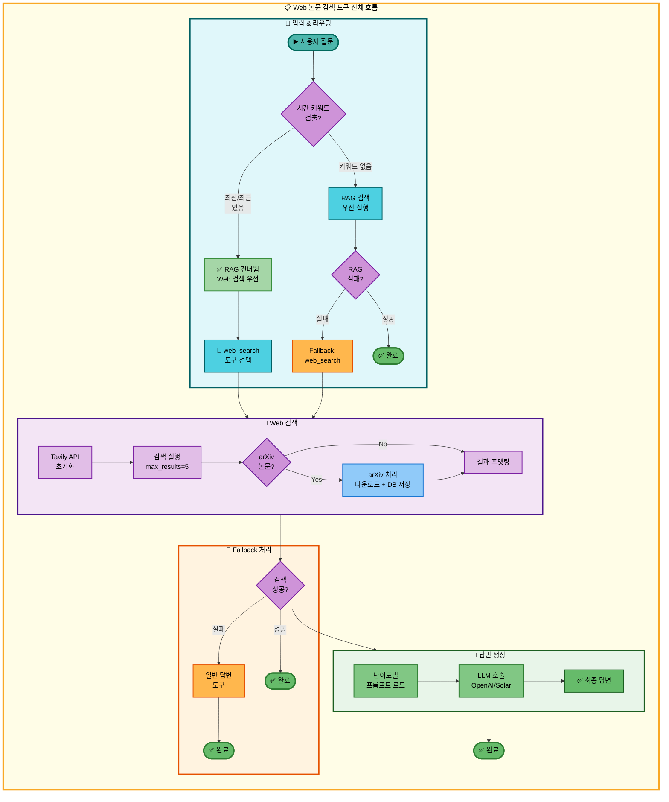
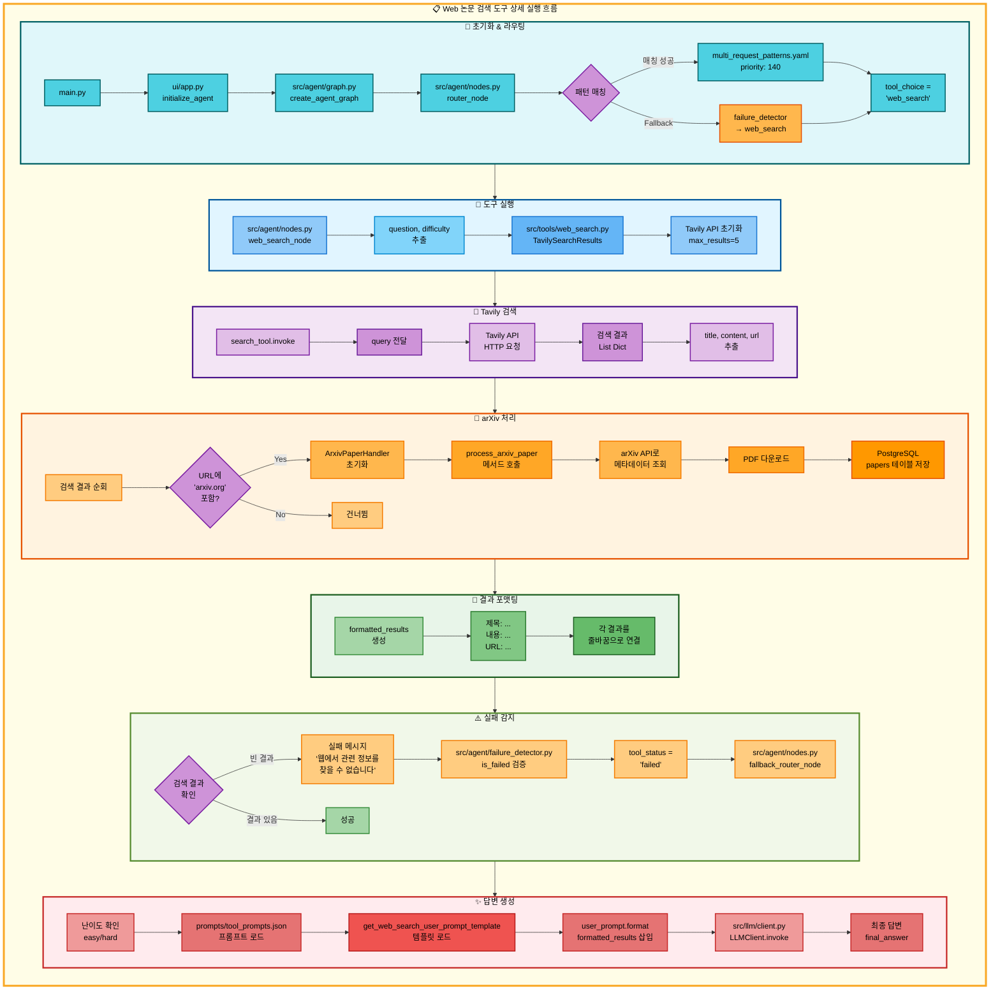

# Web 논문 검색 도구 아키텍처

## 📌 도구 개요

### 목적과 역할

Web 논문 검색 도구는 Tavily Search API를 사용하여 웹에서 최신 논문 정보를 검색하는 도구입니다.

**핵심 역할:**
- 최신 논문 정보 검색 (RAG DB에 없는 최신 논문)
- arXiv 논문 자동 다운로드 및 DB 저장
- Tavily API로 검색한 결과를 난이도별 프롬프트로 LLM에 전달하여 자연스러운 답변 생성

**사용 API:**
- **Tavily Search API**: 웹 검색 엔진 (최대 5개 결과 반환)
- **arXiv API**: arXiv 논문 메타데이터 및 PDF 다운로드

**검색 대상:**
- arXiv 논문 (자동 저장 기능 포함)
- 학회/컨퍼런스 웹사이트
- 연구 기관 블로그
- AI 뉴스 사이트

**RAG 논문 검색과의 차이:**
- RAG: 정적 DB 검색 (최대 1000편, 오래된 논문 포함)
- Web: 동적 웹 검색 (최신 논문, 실시간 정보)

---

## 📋 도구 실행 조건

Web 논문 검색 도구는 **두 가지 경로**로 실행됩니다.

### 경로 1: 최우선 실행 (시간 키워드 감지)

**언제 실행되는가?**
- 사용자 질문에 **시간 관련 키워드**가 포함될 때
- 이 경우 RAG 논문 검색을 **건너뛰고** Web 검색이 **첫 번째**로 실행됨

**시간 키워드 목록:**
- "최신", "최근", "latest", "recent"
- "트렌드", "동향", "trend"
- "2024년", "2025년" 등 연도 표현

**패턴 매칭 규칙:**

`configs/multi_request_patterns.yaml`:

```yaml
- keywords: [최신]
  exclude_keywords: [정보, 정리, 저장, 분석, 논문, 찾]
  tools: [web_search, general]
  priority: 140
```

**실행 조건:**
1. `keywords`에 "최신" 포함
2. `exclude_keywords`에 해당 키워드 없음
3. 우선순위 140으로 일반 논문 검색(priority: 140)보다 먼저 매칭

**예시 질문:**
- "최신 AI 뉴스 알려줘"
- "최근 Transformer 연구 검색해줘"
- "2024년 RAG 논문 찾아줘"

---

### 경로 2: Fallback 실행

**언제 실행되는가?**
- 시간 키워드가 **없어서** RAG 논문 검색이 먼저 실행되었지만 실패한 경우
- RAG 논문 검색의 Fallback으로 Web 검색 실행

**Fallback Chain:**

`configs/model_config.yaml`:

```yaml
fallback_chain:
  priorities:
    paper_search:
      - search_paper   # 1순위: RAG DB 검색
      - web_search     # 2순위: Web 검색 (Fallback)
      - general        # 3순위: 일반 답변
```

**실행 조건:**
1. `search_paper` 도구 실패 (유사도 임계값 초과 또는 빈 결과)
2. `failure_detector.is_failed()` → True
3. `fallback_router_node()`가 `web_search` 선택

**예시 시나리오:**
- 질문: "XYZ123 논문 찾아줘" (시간 키워드 없음)
- RAG 검색 실행 → 결과 없음
- Web 검색으로 전환 → Tavily API로 검색

---

## 🔄 도구 자동 전환 및 Fallback

### 경로 1: 시간 키워드 포함

```
사용자 논문 검색 요청 ('최신', '최근' 등 키워드 포함)
  ↓
[Router] 패턴 매칭: keywords=[최신] → priority 140
  ↓
[Decision] RAG 논문 검색 건너뜀 (시간 키워드 감지)
  ↓
[1] Web 논문 검색 도구 실행 (첫 번째 도구로)
  ├─ 성공 → 최신 논문 검색 결과 반환 → END
  └─ 실패 (Tavily API 오류 또는 빈 결과)
      ↓
[2] 일반 답변 도구로 자동 전환
  └─ LLM이 직접 최신 논문 지식 기반 답변 → END
```

### 경로 2: Fallback 실행

```
사용자 논문 검색 요청 (시간 키워드 없음)
  ↓
[1] RAG 논문 검색 실행
  └─ 실패 (데이터베이스에서 찾지 못함)
      ↓
[Fallback] failure_detector.is_failed() → True
  ↓
[2] Web 논문 검색 도구로 자동 전환
  ├─ 성공 → 논문 검색 결과 반환 → END
  └─ 실패 (Tavily API 오류 또는 빈 결과)
      ↓
[3] 일반 답변 도구로 최종 전환
  └─ LLM이 직접 논문 지식 기반 답변 → END
```

### Fallback 트리거 조건

**실패 감지 패턴** (`src/agent/failure_detector.py`):

```python
FAILURE_PATTERNS = [
    "웹에서 관련 정보를 찾을 수 없습니다",  # ← Web 검색 실패 메시지
    "웹 검색 오류",                         # ← Tavily API 오류
    "웹 검색 API 초기화 오류",              # ← API 키 오류
]
```

---

## 🎨 단순 흐름 아키텍처



---

## 🔍 상세 기능 동작 흐름도



---

### 전체 흐름 요약 표

| 단계 | 파일명 | 메서드명 | 동작 설명 | 입력 | 출력 | API 사용 |
|------|--------|----------|-----------|------|------|---------|
| 1 | `src/agent/nodes.py` | `router_node()` | 질문 분석 및 도구 선택 | question | tool_choice | 없음 |
| 2 | `configs/multi_request_patterns.yaml` | - | 시간 키워드 패턴 매칭 | question | tool_pipeline | 없음 |
| 3 | `src/agent/nodes.py` | `web_search_node()` | Web 검색 노드 실행 | state | state | 없음 |
| 4 | `src/tools/web_search.py` | `TavilySearchResults()` | Tavily API 초기화 | API_KEY | search_tool | Tavily |
| 5 | `src/tools/web_search.py` | `search_tool.invoke()` | 웹 검색 실행 | query | List[Dict] | Tavily API |
| 6 | `src/tools/arxiv_handler.py` | `process_arxiv_paper()` | arXiv 논문 처리 | url | success (bool) | arXiv API |
| 7 | `src/tools/arxiv_handler.py` | `save_to_database()` | PostgreSQL 저장 | metadata | success | papers 테이블 |
| 8 | `src/tools/web_search.py` | `web_search_node()` (포맷팅) | 검색 결과 포맷팅 | search_results | formatted_results | 없음 |
| 9 | `prompts/tool_prompts.json` | - | 프롬프트 로드 | tool, level | system_prompt | 없음 |
| 10 | `src/prompts/__init__.py` | `get_web_search_user_prompt_template()` | 템플릿 로드 | level | template | 없음 |
| 11 | `src/llm/client.py` | `LLMClient.invoke()` | LLM 답변 생성 | messages | response.content | OpenAI/Solar |
| 12 | `src/agent/failure_detector.py` | `is_failed()` | 실패 패턴 감지 | final_answer | (is_failed, reason) | 없음 |
| 13 | `src/agent/nodes.py` | `fallback_router_node()` | Fallback 다음 도구 선택 | state | state (tool_choice) | 없음 |

---

## 📖 동작 설명 (초보 개발자용)

### 두 가지 실행 경로

#### 경로 1: 시간 키워드 감지 (최우선 실행)

**1단계: 패턴 매칭**

**파일**: `configs/multi_request_patterns.yaml`
**우선순위**: 140

**동작 설명:**
1. 사용자 질문에서 "최신", "최근", "latest" 등 키워드 검색
2. `any_of_keywords`에 하나라도 포함되면 매칭 성공
3. `exclude_keywords` 체크: "논문", "찾" 등이 있으면 다른 패턴으로 이동

**예시:**
```python
# 질문: "최신 AI 뉴스 알려줘"
keywords_match = "최신" in question  # True
exclude_match = any(kw in question for kw in ["논문", "찾", "저장", ...])  # False

if keywords_match and not exclude_match:
    state["tool_choice"] = "web_search"  # 직접 web_search 실행
```

**입력**: "최신 AI 뉴스 알려줘"
**출력**: `tool_choice = "web_search"`

**RAG 검색과의 차이:**
- RAG 검색은 **건너뜀** (시간 키워드 감지)
- Web 검색이 **첫 번째** 도구로 실행

---

#### 경로 2: Fallback 실행

**1단계: RAG 검색 실패**

**파일**: `src/tools/search_paper.py`
**메서드**: `_format_markdown()` (라인 75-122)

**동작 설명:**
1. RAG 검색 실행 → 유사도 점수 모두 0.5 초과
2. 실패 메시지 반환: `"관련 논문을 찾을 수 없습니다."`
3. `failure_detector.is_failed()` → True

**2단계: Fallback Chain 순회**

**파일**: `src/agent/nodes.py`
**메서드**: `fallback_router_node()` (라인 439-610)

**동작 설명:**
```python
# Fallback Chain 로드
fallback_chain = ["search_paper", "web_search", "general"]
failed_tools = ["search_paper"]  # RAG 실패 기록

# 다음 도구 선택
for tool in fallback_chain:
    if tool not in failed_tools:
        next_tool = tool  # "web_search"
        break
```

**입력**: state (failed_tools, fallback_chain)
**출력**: state (tool_choice = "web_search")

---

### 단계별 상세 설명

#### 1단계: Tavily API 초기화

**파일**: `src/tools/web_search.py`
**메서드**: `web_search_node()` (라인 21-199)

**동작 설명:**
1. 환경변수에서 Tavily API 키 로드
2. `TavilySearchResults` 객체 생성
3. `max_results=5` 설정 (최대 5개 검색 결과)

**초기화 코드:**
```python
from langchain_community.tools.tavily_search import TavilySearchResults

search_tool = TavilySearchResults(
    max_results=5,
    api_key=os.getenv("TAVILY_API_KEY")
)
```

**입력**: TAVILY_API_KEY (환경변수)
**출력**: search_tool (TavilySearchResults 객체)

**API 사용**: Tavily Search API

**왜 Tavily를 사용하는가?**
- 실시간 웹 검색 지원
- 학술 논문, 뉴스 기사 등 다양한 소스 커버
- LangChain 통합으로 쉽게 사용 가능

---

#### 2단계: 웹 검색 실행

**파일**: `src/tools/web_search.py`
**메서드**: `web_search_node()` (라인 60-73)

**동작 설명:**
1. `search_tool.invoke({"query": question})` 호출
2. Tavily API로 HTTP 요청 전송
3. 검색 결과 수신 (최대 5개)

**검색 결과 구조:**
```python
[
    {
        "title": "논문 제목 또는 기사 제목",
        "content": "요약된 내용 (500자 이내)",
        "url": "https://arxiv.org/abs/..."
    },
    # ... 최대 5개
]
```

**입력**: query="최신 RAG 논문 찾아줘"
**출력**: List[Dict] (검색 결과)

**API 사용**: Tavily Search API (HTTP 요청)

**빈 결과 처리:**
```python
if not search_results:
    state["final_answer"] = "웹에서 관련 정보를 찾을 수 없습니다."
    return state
```

---

#### 3단계: arXiv 논문 자동 저장

**파일**: `src/tools/web_search.py`
**메서드**: `web_search_node()` (라인 83-111)

**동작 설명:**
1. 검색 결과 순회
2. URL에 `'arxiv.org'` 포함 여부 확인
3. arXiv 논문이면 `ArxivPaperHandler.process_arxiv_paper()` 호출

**arXiv 처리 과정:**
```python
from src.tools.arxiv_handler import ArxivPaperHandler

arxiv_handler = ArxivPaperHandler(logger=tool_logger)

for result in search_results:
    url = result.get('url', '')
    if 'arxiv.org' in url:
        success = arxiv_handler.process_arxiv_paper(url)
        # 성공 시 arxiv_count 증가
```

**ArxivPaperHandler 동작:**
1. arXiv API로 메타데이터 조회
2. PDF 다운로드 (선택 사항)
3. PostgreSQL `papers` 테이블에 저장

**입력**: arXiv URL
**출력**: success (True/False)

**DB 사용**:
- **테이블**: `papers`
- **컬럼**: `arxiv_id`, `title`, `authors`, `publish_date`, `url`, `category`, `abstract`

**왜 자동 저장하는가?**
- 다음번 검색 시 RAG DB에서 찾을 수 있음
- PDF 다운로드로 논문 요약 기능 지원
- DB 자동 확장

---

#### 4단계: 검색 결과 포맷팅

**파일**: `src/tools/web_search.py`
**메서드**: `web_search_node()` (라인 113-117)

**동작 설명:**
1. 검색 결과를 Markdown 스타일로 포맷팅
2. 각 결과를 번호와 함께 표시
3. 제목, 내용, URL 포함

**포맷팅 코드:**
```python
formatted_results = "\n\n".join([
    f"[결과 {i+1}]\n제목: {result.get('title', 'N/A')}\n내용: {result.get('content', 'N/A')}\nURL: {result.get('url', 'N/A')}"
    for i, result in enumerate(search_results)
])
```

**입력**: search_results (List[Dict])
**출력**: formatted_results (Markdown 문자열)

**API 사용**: 없음

---

#### 5단계: LLM 답변 생성

**파일**: `src/tools/web_search.py`
**메서드**: `web_search_node()` (라인 134-197)

**동작 설명:**
1. 난이도에 따라 2개 수준 선택
   - easy: ["elementary", "beginner"]
   - hard: ["intermediate", "advanced"]
2. 각 수준별로 프롬프트 로드 (JSON + 템플릿)
3. LLM 호출하여 답변 생성 (2번)

**프롬프트 구성:**
```python
# System 프롬프트
system_prompt = get_tool_prompt("web_search", level)

# User 프롬프트 템플릿
user_prompt_template = get_web_search_user_prompt_template(level)
user_prompt = user_prompt_template.format(
    formatted_results=formatted_results,
    question=question
)

messages = [
    SystemMessage(content=system_prompt),
    HumanMessage(content=user_prompt)
]

response = llm_client.llm.invoke(messages)
```

**입력**: formatted_results, question, difficulty
**출력**: final_answers (Dict), final_answer (str)

**API 사용**: OpenAI/Solar LLM API

---

#### 6단계: 실패 감지 및 Fallback

**파일**: `src/agent/failure_detector.py`, `src/agent/nodes.py`
**메서드**: `is_failed()`, `fallback_router_node()`

**동작 설명:**
1. 빈 결과 체크: `if not search_results:` → 실패 메시지 반환
2. `failure_detector.is_failed()`가 메시지 감지
3. `tool_status = "failed"` 설정
4. `fallback_router_node()`가 `general` 도구 선택

**Fallback Chain 순회:**
```python
# Web 검색의 Fallback Chain
fallback_chain = ["web_search", "general"]
failed_tools = ["web_search"]

# 다음 도구 선택
for tool in fallback_chain:
    if tool not in failed_tools:
        next_tool = tool  # "general"
        break
```

**입력**: state (tool_status, failed_tools)
**출력**: state (tool_choice = "general")

**API 사용**: 없음

**실패 시 처리:**
- `general` 도구 실행 → LLM이 직접 최신 논문 지식 기반 답변

---

## 💡 사용 예시

### 예시 1: 경로 1 - 시간 키워드 감지

**사용자 질문:**
```
최신 RAG 논문 찾아줘
```

**실행 흐름:**
1. 패턴 매칭: `keywords: [최신]` → `web_search` 도구 선택 (RAG 건너뜀)
2. Tavily API 초기화
3. 웹 검색 실행: "최신 RAG 논문 찾아줘"
4. 검색 결과 5개 수신
5. arXiv 논문 2개 발견 → 자동 저장
6. 결과 포맷팅
7. LLM 답변 생성 (easy 난이도: elementary + beginner)

**출력 예시:**
```
[결과 1]
제목: Retrieval-Augmented Generation for Large Language Models: A Survey
내용: This paper provides a comprehensive survey of RAG methods, including recent advancements in 2024...
URL: https://arxiv.org/abs/2312.10997

[결과 2]
제목: Self-RAG: Learning to Retrieve, Generate, and Critique through Self-Reflection
내용: Self-RAG is a new framework that enhances the quality and factuality of LLMs by retrieving...
URL: https://arxiv.org/abs/2310.11511

(계속...)
```

**LLM 최종 답변 (beginner 수준):**
```
최신 RAG 논문 중 주목할 만한 연구들을 소개해드릴게요!

1. "Retrieval-Augmented Generation for Large Language Models: A Survey"
이 논문은 RAG 방법론의 최신 동향을 종합적으로 정리한 서베이 논문입니다.
2024년 기준 RAG 기술의 발전 방향과 주요 연구 성과를 다루고 있어요.

2. "Self-RAG: Learning to Retrieve, Generate, and Critique through Self-Reflection"
Self-RAG는 검색, 생성, 비평을 통합한 새로운 프레임워크로, LLM의 사실성과
품질을 향상시킵니다. 특히 자가 반성(Self-Reflection) 메커니즘이 특징입니다.

이 논문들은 arXiv에서 최근 공개된 최신 연구로, RAG 기술의 발전 방향을
이해하는 데 큰 도움이 될 것입니다!
```

---

### 예시 2: 경로 2 - Fallback 실행

**사용자 질문:**
```
Attention Is All You Need 논문 검색해줘
```

**실행 흐름:**
1. 패턴 매칭: `keywords: [논문, 찾]` → `search_paper` 도구 선택 (시간 키워드 없음)
2. RAG 검색 실행 → 유사도 0.05 (매우 유사) → 성공
3. RAG 검색 결과 반환 → END

**만약 RAG 검색 실패 시:**
1. RAG 검색 실행 → 결과 없음
2. 실패 메시지: "관련 논문을 찾을 수 없습니다."
3. Fallback: `web_search` 도구로 전환
4. Tavily API 웹 검색 실행
5. 검색 결과 반환

---

### 예시 3: Tavily API 오류

**사용자 질문:**
```
최신 Transformer 연구 알려줘
```

**실행 흐름:**
1. 패턴 매칭: `keywords: [최신]` → `web_search` 도구 선택
2. Tavily API 초기화 → 오류 (API 키 없음)
3. 실패 메시지: "웹 검색 API 초기화 오류: ..."
4. `failure_detector.is_failed()` → True
5. Fallback: `general` 도구로 전환
6. LLM이 직접 최신 Transformer 지식 기반 답변

**Fallback 타임라인:**
```python
[
    {
        "timestamp": "2025-11-07T16:15:30",
        "event": "fallback",
        "from_tool": "web_search",
        "to_tool": "general",
        "failure_reason": "패턴 감지: 웹 검색 API 초기화 오류",
        "retry_count": 1
    }
]
```

---

## 🔍 핵심 포인트

### 시간 키워드 감지의 중요성

**왜 시간 키워드를 감지하는가?**
- RAG DB는 정적 데이터 (최대 1000편, 오래된 논문 포함)
- 사용자가 "최신" 정보를 요청하면 RAG DB로는 답변 불가능
- Web 검색으로 실시간 최신 논문 정보 제공

**시간 키워드 목록:**
- "최신", "최근", "latest", "recent"
- "트렌드", "동향", "trend"
- "2024년", "2025년" 등 연도

**우선순위:**
- 시간 키워드 패턴: priority 140
- 일반 논문 검색 패턴: priority 140
- 시간 키워드가 있으면 Web 검색 패턴이 먼저 매칭됨

### arXiv 자동 저장의 효과

**왜 arXiv 논문을 자동 저장하는가?**
- 다음번 검색 시 RAG DB에서 찾을 수 있음
- 검색 속도 향상 (Web → RAG)
- PDF 다운로드로 논문 요약 기능 지원

**저장 프로세스:**
1. Tavily 검색 결과에서 arXiv URL 감지
2. arXiv API로 메타데이터 조회
3. PostgreSQL `papers` 테이블에 저장
4. (선택) PDF 다운로드 및 파싱

### RAG vs Web 검색 비교

| 항목 | RAG 논문 검색 | Web 논문 검색 |
|------|-------------|-------------|
| **데이터 소스** | PostgreSQL + pgvector (정적 DB) | Tavily API (실시간 웹) |
| **논문 수** | ~1000편 (제한) | 무제한 |
| **최신성** | 낮음 (DB 업데이트 주기) | 높음 (실시간) |
| **정확도** | 높음 (임베딩 유사도) | 중간 (키워드 매칭) |
| **속도** | 빠름 (로컬 DB) | 느림 (API 호출) |
| **비용** | 무료 | 유료 (Tavily API) |
| **우선순위** | 140 | 140 (시간 키워드 시 우선) |
| **Fallback** | web_search → general | general만 |

### Fallback Chain의 차이

**RAG 논문 검색:**
- search_paper → web_search → general

**Web 논문 검색:**
- web_search → general

**이유:**
- Web 검색은 이미 외부 API를 사용하므로 다른 검색 도구로 Fallback 불필요
- 실패 시 LLM 지식으로 직접 답변 (general)

---

## 📚 참고 정보

### 관련 파일 목록

**핵심 파일:**
- `src/tools/web_search.py`: Web 논문 검색 도구 구현
- `src/tools/arxiv_handler.py`: arXiv 논문 처리
- `src/agent/nodes.py`: web_search_node 구현
- `configs/multi_request_patterns.yaml`: 패턴 매칭 규칙

**설정 파일:**
- `configs/model_config.yaml`: LLM, Fallback 설정
- `prompts/tool_prompts.json`: 난이도별 프롬프트

**API:**
- Tavily Search API (웹 검색)
- arXiv API (논문 메타데이터)
- OpenAI/Solar API (LLM)

### 환경변수

```bash
# Tavily API 키 (필수)
TAVILY_API_KEY=tvly-xxxxxxxxxxxxxxxxxxxxx

# OpenAI API 키 (LLM용)
OPENAI_API_KEY=sk-xxxxxxxxxxxxxxxxxxxxx

# Solar API 키 (대체 LLM)
SOLAR_API_KEY=xxxxxxxxxxxxxxxxxxxxx
```

### Tavily API 특징

**장점:**
- 실시간 웹 검색
- 학술 논문, 뉴스 기사, 블로그 등 다양한 소스
- LangChain 통합

**제한:**
- 유료 서비스 (무료 티어: 1000 requests/month)
- 최대 5개 검색 결과
- API 호출 속도 제한

**대체 API:**
- Google Custom Search
- Bing Search API
- DuckDuckGo Search

---

**작성일**: 2025-11-07
**버전**: 1.0
