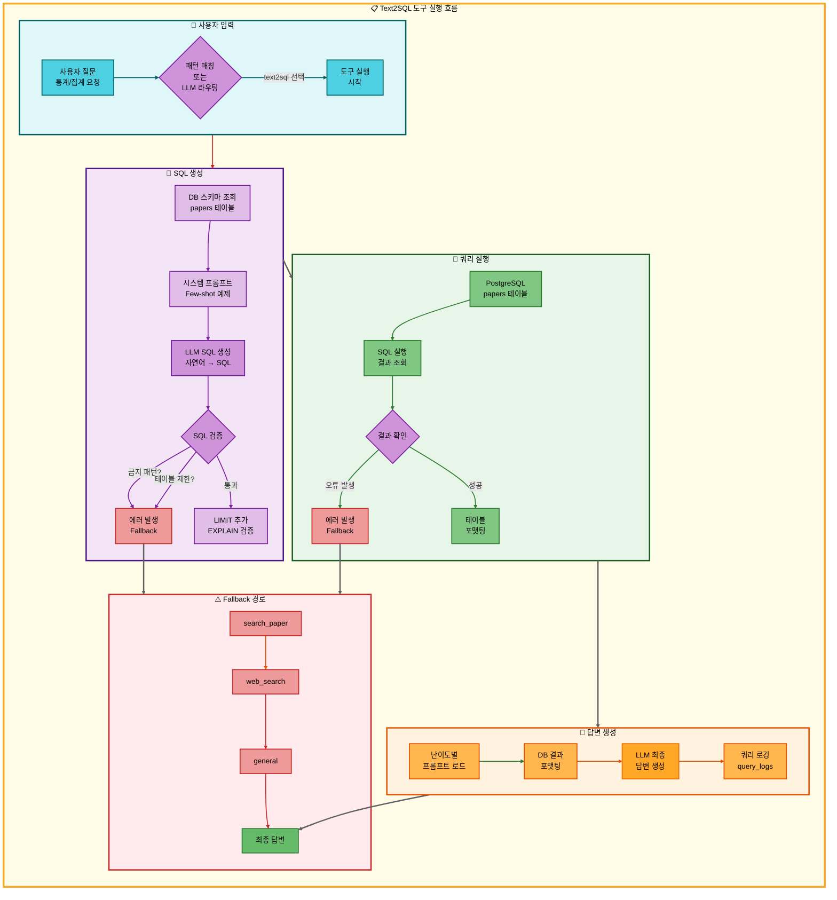

# Text2SQL 도구 아키텍처 문서

## 📋 목차
1. [도구 개요](#도구-개요)
2. [도구 실행 조건](#도구-실행-조건)
3. [도구 자동 전환 및 Fallback](#도구-자동-전환-및-fallback)
4. [단순 흐름 아키텍처](#단순-흐름-아키텍처)
5. [상세 기능 동작 흐름도](#상세-기능-동작-흐름도)
6. [동작 설명](#동작-설명)
7. [사용 예시](#사용-예시)

---

## 🎯 도구 개요

### Text2SQL 도구의 목적과 역할

**Text2SQL 도구**는 사용자의 자연어 질문을 SQL 쿼리로 자동 변환하여 PostgreSQL 데이터베이스에서 논문 통계 정보를 조회하는 도구입니다.

**주요 기능:**
- 자연어 → SQL 자동 변환 (LLM 기반)
- 논문 통계 조회 (개수, 인용 순위, 카테고리별 집계 등)
- 보안 강화 (화이트리스트 기반 테이블/컬럼 제한)
- 난이도별 답변 생성 (elementary/beginner/intermediate/advanced)
- 쿼리 로깅 (모든 실행 기록을 `query_logs` 테이블에 저장)

### 언제 이 도구가 실행되는지

1. **통계 질문**: "논문 몇 편?", "개수 알려줘"
2. **집계 질문**: "인용 많은 논문", "상위 논문"
3. **데이터 조회**: "카테고리별 논문 수", "저자별 통계"
4. **특정 기간**: "2024년 논문", "2023년 이후"

### 어떤 DB를 사용하는지

- **DBMS**: PostgreSQL (pgvector 확장 포함)
- **주 테이블**: `papers` (논문 메타데이터)
- **로그 테이블**: `query_logs` (쿼리 실행 이력)
- **접근 방식**: 읽기 전용 (SELECT/WITH만 허용)
- **제한 사항**: `papers` 테이블만 접근 가능 (화이트리스트)

---

## 🔧 도구 실행 조건

### 패턴 매칭 (우선순위 135)

**파일**: `configs/multi_request_patterns.yaml`

```yaml
- keywords:
  - 논문
  any_of_keywords:
  - 통계
  - 인용
  - 많은
  - 상위
  - 몇
  exclude_keywords:
  - 저장
  - 요약
  tools:
  - text2sql
  - search_paper
  - web_search
  - general
  priority: 135
  description: 논문 통계 조회 후 상세 검색 (4단계 파이프라인)
```

**동작 원리:**
- `논문` 키워드 필수 (AND)
- `통계`, `인용`, `많은`, `상위`, `몇` 중 하나 이상 (OR)
- `저장`, `요약` 키워드는 제외
- 매칭 성공 시 `text2sql` 도구 우선 실행

### LLM 라우팅

패턴 매칭 실패 시 `prompts/routing_prompts.json`의 Few-shot 예제를 참고하여 LLM이 직접 도구 선택:

```json
{
  "question": "2024년 논문 몇 편?",
  "tool": "text2sql",
  "reason": "년도별 논문 개수 통계"
}
```

### 실행 조건 예시

| 질문 유형 | 예시 질문 | 선택 도구 | 이유 |
|-----------|-----------|-----------|------|
| 통계 질문 | "논문 개수 알려줘" | text2sql | "몇" 키워드 매칭 |
| 집계 질문 | "인용 많은 논문 보여줘" | text2sql | "많은" 키워드 매칭 |
| 그룹핑 | "카테고리별 논문 수는?" | text2sql | "통계" 키워드 매칭 |
| 특정 기간 | "2024년 논문 몇 편?" | text2sql | "몇" 키워드 매칭 |

---

## 🔄 도구 자동 전환 및 Fallback

### Fallback Chain

```
text2sql (1차) → search_paper (2차) → web_search (3차) → general (4차)
```

### 상세 흐름

```
사용자 통계/데이터 조회 요청
↓
[1단계] Text2SQL 도구 실행
├─ 성공 → SQL 쿼리 생성 및 실행 → 결과 반환
└─ 실패 (쿼리 생성 실패 또는 실행 오류)
    ↓
    [2단계] RAG 논문 검색 도구로 자동 전환
    ├─ 성공 → 논문 검색 결과 반환
    └─ 실패 (검색 결과 없음 또는 유사도 낮음)
        ↓
        [3단계] Web 검색 도구로 자동 전환
        ├─ 성공 → 웹 검색 결과 반환
        └─ 실패 (검색 결과 없음)
            ↓
            [4단계] 일반 답변 도구로 자동 전환
            └─ LLM이 직접 답변 생성
```

### Fallback 트리거 조건

| 조건 | 설명 | 처리 방식 |
|------|------|-----------|
| SQL 생성 실패 | LLM이 유효한 SQL을 생성하지 못함 | 에러 메시지 + Fallback |
| 금지 패턴 감지 | INSERT/UPDATE/DELETE 등 차단 | ValueError + Fallback |
| 테이블 접근 거부 | `papers` 외 테이블 참조 시도 | ValueError + Fallback |
| 쿼리 실행 오류 | 구문 오류, 컬럼 없음 등 | psycopg2.Error + Fallback |
| 결과 없음 | 쿼리는 성공했지만 결과 0건 | "결과가 없습니다" (Fallback X) |

### 도구 전환 결정 로직 구현 위치

**파일**: `src/agent/graph.py`
**함수**: `continue_to_next_tool(state: AgentState)`

```python
def continue_to_next_tool(state: AgentState):
    """
    현재 도구 실행 후 파이프라인의 다음 도구로 이동 여부 결정
    """
    tool_pipeline = state.get("tool_pipeline", [])
    pipeline_index = state.get("pipeline_index", 0)

    # 파이프라인에 다음 도구가 있으면 계속 실행
    if pipeline_index < len(tool_pipeline):
        return "continue_pipeline"
    else:
        return "end"
```

**동작:**
- `tool_pipeline = ["text2sql", "search_paper", "web_search", "general"]`
- `pipeline_index = 0` (text2sql 실행 중)
- text2sql 실패 시 `pipeline_index = 1` → search_paper 실행
- search_paper 실패 시 `pipeline_index = 2` → web_search 실행
- web_search 실패 시 `pipeline_index = 3` → general 실행

---

## 🔍 단순 흐름 아키텍처



---

## 🔍 상세 기능 동작 흐름도

```mermaid
graph TB
    subgraph MainFlow["📋 Text2SQL 도구 상세 실행 흐름"]
        direction TB

        subgraph Init["🔸 초기화 & 라우팅"]
            direction LR
            A[main.py] --> B[ui/app.py<br/>initialize_agent]
            B --> C[src/agent/graph.py<br/>create_agent_graph]
            C --> D[src/agent/nodes.py<br/>router_node]
            D --> E{패턴 매칭}
            E -->|매칭 성공| F[multi_request_patterns.yaml<br/>priority: 135]
            E -->|매칭 실패| G[LLM 라우팅<br/>routing_prompts.json]
            F --> H[tool_choice =<br/>'text2sql']
            G --> H
        end

        subgraph NodeExec["🔹 노드 실행"]
            direction LR
            I[src/agent/nodes.py<br/>text2sql_node] --> J[question 및<br/>difficulty 추출]
            J --> K[text2sql.run<br/>호출]
            K --> L{오류 발생?}
            L -->|예| M[에러 메시지<br/>저장]
            L -->|아니오| N[final_answer<br/>저장]
        end

        subgraph ConfigLoad["🔺 설정 로드"]
            direction LR
            O[configs/model_config.yaml<br/>text2sql 섹션] --> P[provider:<br/>solar]
            P --> Q[model:<br/>solar-pro2]
            Q --> R[temperature:<br/>0.0]
            R --> S[src/llm/client.py<br/>LLMClient 생성]
        end

        subgraph SchemaFetch["🔶 스키마 조회"]
            direction LR
            T[_fetch_schema_snapshot<br/>함수 호출] --> U[information_schema.columns<br/>테이블 조회]
            U --> V[ALLOWED_TABLES<br/>papers만 허용]
            V --> W[ALLOWED_COLUMNS<br/>11개 컬럼 허용]
            W --> X[스키마 텍스트<br/>생성]
        end

        subgraph LLMGenerate["💾 LLM SQL 생성"]
            direction LR
            Y[시스템 프롬프트<br/>규칙 및 스키마] --> Z[Few-shot 예제<br/>5개 쿼리]
            Z --> AA[user_block<br/>질문 포함]
            AA --> AB[LLMClient.invoke<br/>SQL 생성]
            AB --> AC[raw SQL<br/>응답]
        end

        subgraph SQLValidate["✨ SQL 검증"]
            direction LR
            AD[_extract_sql<br/>코드펜스 제거] --> AE[_sanitize<br/>금지 패턴 검증]
            AE --> AF{금지 패턴?}
            AF -->|예| AG[ValueError<br/>발생]
            AF -->|아니오| AH{테이블 제한?}
            AH -->|위반| AG
            AH -->|통과| AI[_ensure_limit<br/>LIMIT 100 추가]
            AI --> AJ[_explain_safe<br/>실행 계획 검증]
        end

        subgraph QueryExec["🔷 쿼리 실행"]
            direction LR
            AK[_run_query<br/>함수 호출] --> AL[psycopg2.connect<br/>DB 연결]
            AL --> AM[cur.execute<br/>SQL 실행]
            AM --> AN[PostgreSQL<br/>papers 테이블]
            AN --> AO[결과 조회<br/>cols, rows]
        end

        subgraph ResultFormat["💡 결과 포맷팅"]
            direction LR
            AP[_to_markdown_table<br/>함수 호출] --> AQ{결과 있음?}
            AQ -->|없음| AR[결과가 없습니다]
            AQ -->|있음| AS[Markdown 테이블<br/>생성]
        end

        subgraph FinalAnswer["✅ 최종 답변"]
            direction LR
            AT[prompts/tool_prompts.json<br/>난이도별 프롬프트] --> AU[user_prompt_template<br/>로드]
            AU --> AV[db_results<br/>SQL + 테이블]
            AV --> AW[LLMClient.invoke<br/>최종 답변 생성]
            AW --> AX[최종 응답<br/>구성]
        end

        subgraph Logging["📊 로깅"]
            direction LR
            AY[_log_query<br/>함수 호출] --> AZ[query_logs<br/>테이블 INSERT]
            AZ --> BA[user_query,<br/>generated_sql,<br/>response_text,<br/>success,<br/>response_time_ms]
        end

        subgraph FallbackCheck["⚠️ Fallback 체크"]
            direction LR
            BB{오류 발생?} -->|예| BC[src/agent/graph.py<br/>continue_to_next_tool]
            BC --> BD[pipeline_index<br/>증가]
            BD --> BE[다음 도구<br/>search_paper]
            BE --> BF[실패 시<br/>web_search]
            BF --> BG[최종<br/>general]
        end

        %% 단계 간 연결
        Init --> NodeExec
        NodeExec --> ConfigLoad
        ConfigLoad --> SchemaFetch
        SchemaFetch --> LLMGenerate
        LLMGenerate --> SQLValidate
        SQLValidate --> QueryExec
        QueryExec --> ResultFormat
        ResultFormat --> FinalAnswer
        FinalAnswer --> Logging
        AG --> FallbackCheck
        M --> FallbackCheck
    end

    %% 메인 워크플로우 배경
    style MainFlow fill:#fffde7,stroke:#f9a825,stroke-width:4px,color:#000

    %% Subgraph 스타일
    style Init fill:#e0f7fa,stroke:#006064,stroke-width:3px,color:#000
    style NodeExec fill:#e1f5ff,stroke:#01579b,stroke-width:3px,color:#000
    style ConfigLoad fill:#f3e5f5,stroke:#4a148c,stroke-width:3px,color:#000
    style SchemaFetch fill:#fff3e0,stroke:#e65100,stroke-width:3px,color:#000
    style LLMGenerate fill:#e8f5e9,stroke:#1b5e20,stroke-width:3px,color:#000
    style SQLValidate fill:#e3f2fd,stroke:#1565c0,stroke-width:3px,color:#000
    style QueryExec fill:#f3e5f5,stroke:#4a148c,stroke-width:3px,color:#000
    style ResultFormat fill:#fff3e0,stroke:#e65100,stroke-width:3px,color:#000
    style FinalAnswer fill:#e8f5e9,stroke:#1b5e20,stroke-width:3px,color:#000
    style Logging fill:#e3f2fd,stroke:#1565c0,stroke-width:3px,color:#000
    style FallbackCheck fill:#ffebee,stroke:#c62828,stroke-width:3px,color:#000

    %% 노드 스타일 (초기화 - 청록 계열)
    style A fill:#4dd0e1,stroke:#006064,stroke-width:2px,color:#000
    style B fill:#4dd0e1,stroke:#006064,stroke-width:2px,color:#000
    style C fill:#4dd0e1,stroke:#006064,stroke-width:2px,color:#000
    style D fill:#4dd0e1,stroke:#006064,stroke-width:2px,color:#000
    style E fill:#ce93d8,stroke:#7b1fa2,stroke-width:2px,color:#000
    style F fill:#4dd0e1,stroke:#006064,stroke-width:2px,color:#000
    style G fill:#4dd0e1,stroke:#006064,stroke-width:2px,color:#000
    style H fill:#4dd0e1,stroke:#006064,stroke-width:2px,color:#000

    %% 노드 스타일 (노드 실행 - 파랑 계열)
    style I fill:#90caf9,stroke:#1976d2,stroke-width:2px,color:#000
    style J fill:#90caf9,stroke:#1976d2,stroke-width:2px,color:#000
    style K fill:#90caf9,stroke:#1976d2,stroke-width:2px,color:#000
    style L fill:#ce93d8,stroke:#7b1fa2,stroke-width:2px,color:#000
    style M fill:#ef9a9a,stroke:#c62828,stroke-width:2px,color:#000
    style N fill:#90caf9,stroke:#1976d2,stroke-width:2px,color:#000

    %% 노드 스타일 (설정 로드 - 보라 계열)
    style O fill:#e1bee7,stroke:#7b1fa2,stroke-width:2px,color:#000
    style P fill:#e1bee7,stroke:#7b1fa2,stroke-width:2px,color:#000
    style Q fill:#e1bee7,stroke:#7b1fa2,stroke-width:2px,color:#000
    style R fill:#e1bee7,stroke:#7b1fa2,stroke-width:2px,color:#000
    style S fill:#ce93d8,stroke:#6a1b9a,stroke-width:2px,color:#000

    %% 노드 스타일 (스키마 조회 - 주황 계열)
    style T fill:#ffb74d,stroke:#e65100,stroke-width:2px,color:#000
    style U fill:#ffb74d,stroke:#e65100,stroke-width:2px,color:#000
    style V fill:#ffb74d,stroke:#e65100,stroke-width:2px,color:#000
    style W fill:#ffb74d,stroke:#e65100,stroke-width:2px,color:#000
    style X fill:#ffa726,stroke:#ef6c00,stroke-width:2px,color:#000

    %% 노드 스타일 (LLM 생성 - 녹색 계열)
    style Y fill:#81c784,stroke:#2e7d32,stroke-width:2px,color:#000
    style Z fill:#81c784,stroke:#2e7d32,stroke-width:2px,color:#000
    style AA fill:#81c784,stroke:#2e7d32,stroke-width:2px,color:#000
    style AB fill:#66bb6a,stroke:#1b5e20,stroke-width:2px,color:#000
    style AC fill:#81c784,stroke:#2e7d32,stroke-width:2px,color:#000

    %% 노드 스타일 (SQL 검증 - 파랑 계열)
    style AD fill:#90caf9,stroke:#1976d2,stroke-width:2px,color:#000
    style AE fill:#90caf9,stroke:#1976d2,stroke-width:2px,color:#000
    style AF fill:#ce93d8,stroke:#7b1fa2,stroke-width:2px,color:#000
    style AG fill:#ef9a9a,stroke:#c62828,stroke-width:2px,color:#000
    style AH fill:#ce93d8,stroke:#7b1fa2,stroke-width:2px,color:#000
    style AI fill:#90caf9,stroke:#1976d2,stroke-width:2px,color:#000
    style AJ fill:#90caf9,stroke:#1976d2,stroke-width:2px,color:#000

    %% 노드 스타일 (쿼리 실행 - 보라 계열)
    style AK fill:#e1bee7,stroke:#7b1fa2,stroke-width:2px,color:#000
    style AL fill:#e1bee7,stroke:#7b1fa2,stroke-width:2px,color:#000
    style AM fill:#ce93d8,stroke:#6a1b9a,stroke-width:2px,color:#000
    style AN fill:#e1bee7,stroke:#7b1fa2,stroke-width:2px,color:#000
    style AO fill:#e1bee7,stroke:#7b1fa2,stroke-width:2px,color:#000

    %% 노드 스타일 (결과 포맷팅 - 주황 계열)
    style AP fill:#ffb74d,stroke:#e65100,stroke-width:2px,color:#000
    style AQ fill:#ce93d8,stroke:#7b1fa2,stroke-width:2px,color:#000
    style AR fill:#ffb74d,stroke:#e65100,stroke-width:2px,color:#000
    style AS fill:#ffa726,stroke:#ef6c00,stroke-width:2px,color:#000

    %% 노드 스타일 (최종 답변 - 녹색 계열)
    style AT fill:#81c784,stroke:#2e7d32,stroke-width:2px,color:#000
    style AU fill:#81c784,stroke:#2e7d32,stroke-width:2px,color:#000
    style AV fill:#81c784,stroke:#2e7d32,stroke-width:2px,color:#000
    style AW fill:#66bb6a,stroke:#1b5e20,stroke-width:2px,color:#000
    style AX fill:#66bb6a,stroke:#1b5e20,stroke-width:2px,color:#000

    %% 노드 스타일 (로깅 - 파랑 계열)
    style AY fill:#90caf9,stroke:#1976d2,stroke-width:2px,color:#000
    style AZ fill:#64b5f6,stroke:#1565c0,stroke-width:2px,color:#000
    style BA fill:#90caf9,stroke:#1976d2,stroke-width:2px,color:#000

    %% 노드 스타일 (Fallback - 빨강 계열)
    style BB fill:#ce93d8,stroke:#7b1fa2,stroke-width:2px,color:#000
    style BC fill:#ef9a9a,stroke:#c62828,stroke-width:2px,color:#000
    style BD fill:#ef9a9a,stroke:#c62828,stroke-width:2px,color:#000
    style BE fill:#ef9a9a,stroke:#c62828,stroke-width:2px,color:#000
    style BF fill:#ef9a9a,stroke:#c62828,stroke-width:2px,color:#000
    style BG fill:#ef9a9a,stroke:#c62828,stroke-width:2px,color:#000

    %% 연결선 스타일 (초기화 - 청록 0~7)
    linkStyle 0 stroke:#006064,stroke-width:2px
    linkStyle 1 stroke:#006064,stroke-width:2px
    linkStyle 2 stroke:#006064,stroke-width:2px
    linkStyle 3 stroke:#006064,stroke-width:2px
    linkStyle 4 stroke:#006064,stroke-width:2px
    linkStyle 5 stroke:#006064,stroke-width:2px
    linkStyle 6 stroke:#006064,stroke-width:2px

    %% 연결선 스타일 (노드 실행 - 파랑 8~12)
    linkStyle 7 stroke:#1976d2,stroke-width:2px
    linkStyle 8 stroke:#1976d2,stroke-width:2px
    linkStyle 9 stroke:#1976d2,stroke-width:2px
    linkStyle 10 stroke:#1976d2,stroke-width:2px
    linkStyle 11 stroke:#1976d2,stroke-width:2px

    %% 연결선 스타일 (설정 로드 - 보라 13~16)
    linkStyle 12 stroke:#7b1fa2,stroke-width:2px
    linkStyle 13 stroke:#7b1fa2,stroke-width:2px
    linkStyle 14 stroke:#7b1fa2,stroke-width:2px
    linkStyle 15 stroke:#7b1fa2,stroke-width:2px

    %% 연결선 스타일 (스키마 조회 - 주황 17~20)
    linkStyle 16 stroke:#e65100,stroke-width:2px
    linkStyle 17 stroke:#e65100,stroke-width:2px
    linkStyle 18 stroke:#e65100,stroke-width:2px
    linkStyle 19 stroke:#e65100,stroke-width:2px

    %% 연결선 스타일 (LLM 생성 - 녹색 21~24)
    linkStyle 20 stroke:#2e7d32,stroke-width:2px
    linkStyle 21 stroke:#2e7d32,stroke-width:2px
    linkStyle 22 stroke:#2e7d32,stroke-width:2px
    linkStyle 23 stroke:#2e7d32,stroke-width:2px

    %% 연결선 스타일 (SQL 검증 - 파랑 25~31)
    linkStyle 24 stroke:#1976d2,stroke-width:2px
    linkStyle 25 stroke:#1976d2,stroke-width:2px
    linkStyle 26 stroke:#1976d2,stroke-width:2px
    linkStyle 27 stroke:#1976d2,stroke-width:2px
    linkStyle 28 stroke:#1976d2,stroke-width:2px
    linkStyle 29 stroke:#1976d2,stroke-width:2px
    linkStyle 30 stroke:#1976d2,stroke-width:2px

    %% 연결선 스타일 (쿼리 실행 - 보라 32~35)
    linkStyle 31 stroke:#7b1fa2,stroke-width:2px
    linkStyle 32 stroke:#7b1fa2,stroke-width:2px
    linkStyle 33 stroke:#7b1fa2,stroke-width:2px
    linkStyle 34 stroke:#7b1fa2,stroke-width:2px

    %% 연결선 스타일 (결과 포맷팅 - 주황 36~38)
    linkStyle 35 stroke:#e65100,stroke-width:2px
    linkStyle 36 stroke:#e65100,stroke-width:2px
    linkStyle 37 stroke:#e65100,stroke-width:2px

    %% 연결선 스타일 (최종 답변 - 녹색 39~42)
    linkStyle 38 stroke:#2e7d32,stroke-width:2px
    linkStyle 39 stroke:#2e7d32,stroke-width:2px
    linkStyle 40 stroke:#2e7d32,stroke-width:2px
    linkStyle 41 stroke:#2e7d32,stroke-width:2px

    %% 연결선 스타일 (로깅 - 파랑 43~44)
    linkStyle 42 stroke:#1976d2,stroke-width:2px
    linkStyle 43 stroke:#1976d2,stroke-width:2px

    %% 연결선 스타일 (Fallback - 빨강 45~49)
    linkStyle 44 stroke:#c62828,stroke-width:2px
    linkStyle 45 stroke:#c62828,stroke-width:2px
    linkStyle 46 stroke:#c62828,stroke-width:2px
    linkStyle 47 stroke:#c62828,stroke-width:2px
    linkStyle 48 stroke:#c62828,stroke-width:2px

    %% 단계 간 연결 (회색 50~59)
    linkStyle 49 stroke:#616161,stroke-width:3px
    linkStyle 50 stroke:#616161,stroke-width:3px
    linkStyle 51 stroke:#616161,stroke-width:3px
    linkStyle 52 stroke:#616161,stroke-width:3px
    linkStyle 53 stroke:#616161,stroke-width:3px
    linkStyle 54 stroke:#616161,stroke-width:3px
    linkStyle 55 stroke:#616161,stroke-width:3px
    linkStyle 56 stroke:#616161,stroke-width:3px
    linkStyle 57 stroke:#616161,stroke-width:3px
    linkStyle 58 stroke:#616161,stroke-width:3px
```



---

## 📝 동작 설명

### Text2SQL 변환 과정 상세 설명

| 단계 | 파일명 | 메서드명 | 동작 설명 | 입력 | 출력 | DB 사용 |
|------|--------|----------|-----------|------|------|---------|
| 1 | `main.py` | - | Streamlit 서버 시작 | - | - | 없음 |
| 2 | `ui/app.py` | `initialize_agent()` | Agent 그래프 초기화 | - | agent_executor | 없음 |
| 3 | `src/agent/graph.py` | `create_agent_graph()` | LangGraph 상태 머신 생성 | exp_manager | CompiledGraph | 없음 |
| 4 | `src/agent/nodes.py` | `router_node()` | 질문 분석 및 도구 선택 | state (question) | state (tool_choice) | 없음 |
| 5 | `configs/multi_request_patterns.yaml` | - | 패턴 매칭 (우선순위 135) | question | tool_pipeline | 없음 |
| 6 | `src/agent/nodes.py` | `text2sql_node()` | 도구 노드 실행 | state (question, difficulty) | state (final_answer) | 없음 |
| 7 | `src/tools/text2sql.py` | `text2sql()` | @tool 함수 호출 | user_question, difficulty | Markdown 문자열 | papers, query_logs |
| 8 | `src/utils/config_loader.py` | `get_model_config()` | 모델 설정 로드 | - | model_config dict | 없음 |
| 9 | `src/llm/client.py` | `LLMClient.__init__()` | LLM 클라이언트 생성 | provider, model, temperature | LLMClient 객체 | 없음 |
| 10 | `src/tools/text2sql.py` | `_fetch_schema_snapshot()` | DB 스키마 조회 | ALLOWED_TABLES | schema 텍스트 | information_schema |
| 11 | `src/tools/text2sql.py` | `_fewshot_block()` | Few-shot 예제 생성 | _FEW_SHOTS | 예제 문자열 | 없음 |
| 12 | `src/llm/client.py` | `LLMClient.invoke()` | LLM SQL 생성 | messages | SQL 쿼리 | 없음 |
| 13 | `src/tools/text2sql.py` | `_extract_sql()` | 코드펜스 제거 | LLM 응답 | SQL 문자열 | 없음 |
| 14 | `src/tools/text2sql.py` | `_sanitize()` | 금지 패턴 검증 | SQL | 정제된 SQL | 없음 |
| 15 | `src/tools/text2sql.py` | `_ensure_limit()` | LIMIT 자동 추가 | SQL | LIMIT 포함 SQL | 없음 |
| 16 | `src/tools/text2sql.py` | `_explain_safe()` | 실행 계획 검증 | SQL | boolean | papers (EXPLAIN) |
| 17 | `src/tools/text2sql.py` | `_run_query()` | SQL 실행 | SQL | (cols, rows) | papers (SELECT) |
| 18 | `src/tools/text2sql.py` | `_to_markdown_table()` | 결과 테이블 포맷팅 | cols, rows | Markdown 문자열 | 없음 |
| 19 | `src/prompts/loader.py` | `get_tool_prompt()` | 난이도별 프롬프트 로드 | tool, difficulty | system_prompt | 없음 |
| 20 | `src/prompts/loader.py` | `load_tool_prompts()` | JSON 프롬프트 로드 | - | tool_prompts dict | 없음 |
| 21 | `src/llm/client.py` | `LLMClient.invoke()` | LLM 최종 답변 생성 | messages | response.content | 없음 |
| 22 | `src/tools/text2sql.py` | `_log_query()` | 쿼리 로깅 | user_query, generated_sql, ... | - | query_logs (INSERT) |

### DB 스키마 정보

#### papers 테이블

```sql
CREATE TABLE IF NOT EXISTS papers (
    paper_id SERIAL PRIMARY KEY,         -- 논문 고유 ID (자동 증가)
    arxiv_id VARCHAR(64),                -- arXiv ID (예: 2301.12345)
    title TEXT NOT NULL,                 -- 논문 제목 (필수)
    authors TEXT,                        -- 저자 목록 (쉼표 구분)
    publish_date DATE,                   -- 발행일
    source VARCHAR(100),                 -- 출처 (예: arXiv, PubMed)
    url TEXT,                            -- 논문 URL
    category VARCHAR(100),               -- 카테고리 (예: cs.AI, cs.LG)
    citation_count INT,                  -- 인용 횟수
    abstract TEXT,                       -- 초록
    created_at TIMESTAMP DEFAULT NOW()   -- 레코드 생성 시각
);
```

**화이트리스트 컬럼 (ALLOWED_COLUMNS):**
```python
ALLOWED_COLUMNS = {
    "paper_id", "title", "authors", "publish_date",
    "source", "url", "category", "citation_count",
    "abstract", "created_at", "updated_at",
}
```

#### query_logs 테이블

```sql
CREATE TABLE query_logs (
    log_id SERIAL PRIMARY KEY,           -- 로그 고유 ID
    user_query TEXT NOT NULL,            -- 사용자 질문
    difficulty_mode VARCHAR(20),         -- 난이도 (현재 미사용)
    tool_used VARCHAR(50),               -- 도구명 (text2sql)
    response TEXT,                       -- 응답 내용 (첫 2000자)
    response_time_ms INTEGER,            -- 응답 시간 (밀리초)
    success BOOLEAN,                     -- 성공 여부
    error_message TEXT,                  -- 에러 메시지 (실패 시)
    created_at TIMESTAMP DEFAULT NOW()   -- 로그 생성 시각
);
```

### SQL 쿼리 생성 예시

#### 예시 1: 단순 집계

**질문**: "2024년 논문 몇 편?"

**생성 SQL**:
```sql
SELECT COUNT(*) AS paper_count FROM papers WHERE EXTRACT(YEAR FROM publish_date)=2024;
```

**동작 설명**:
1. `EXTRACT(YEAR FROM publish_date)`: 발행일에서 연도 추출
2. `= 2024`: 2024년 조건
3. `COUNT(*)`: 전체 행 개수 집계
4. `AS paper_count`: 결과 컬럼명 지정

**실행 결과**:
| paper_count |
|-------------|
| 42 |

#### 예시 2: 그룹별 집계

**질문**: "카테고리별 논문 수를 보여줘"

**생성 SQL**:
```sql
SELECT category, COUNT(*) AS paper_count
FROM papers
GROUP BY category
ORDER BY paper_count DESC
LIMIT 100;
```

**동작 설명**:
1. `SELECT category, COUNT(*)`: 카테고리와 개수 선택
2. `GROUP BY category`: 카테고리별 그룹핑
3. `ORDER BY paper_count DESC`: 개수 기준 내림차순 정렬
4. `LIMIT 100`: 상위 100개만 (자동 추가)

**실행 결과**:
| category | paper_count |
|----------|-------------|
| cs.AI | 456 |
| cs.LG | 389 |
| cs.CV | 234 |

#### 예시 3: 복합 조건

**질문**: "2023년 이후 AI 논문 중 인용 많은 상위 3개"

**생성 SQL**:
```sql
SELECT title, authors, citation_count
FROM papers
WHERE publish_date >= DATE '2023-01-01'
  AND category ILIKE '%AI%'
ORDER BY citation_count DESC
LIMIT 3;
```

**동작 설명**:
1. `publish_date >= DATE '2023-01-01'`: 2023년 1월 1일 이후
2. `category ILIKE '%AI%'`: AI 포함 (대소문자 무시)
3. `ORDER BY citation_count DESC`: 인용 횟수 내림차순
4. `LIMIT 3`: 상위 3개

**실행 결과**:
| title | authors | citation_count |
|-------|---------|----------------|
| GPT-4 Technical Report | OpenAI | 5234 |
| LLaMA: Open... | Touvron, H. | 3892 |
| Gemini: A Family... | Google | 2456 |

### 오류 처리 방법

#### 오류 유형 및 처리 표

| 오류 유형 | 원인 | 처리 방식 | Fallback |
|-----------|------|-----------|----------|
| SQL 생성 실패 | LLM이 유효한 SQL 생성 못함 | 에러 메시지 + Fallback | search_paper |
| 금지 패턴 감지 | INSERT/UPDATE/DELETE 시도 | ValueError + Fallback | search_paper |
| 테이블 접근 거부 | papers 외 테이블 참조 | ValueError + Fallback | search_paper |
| 구문 오류 | SQL 문법 오류 | psycopg2.Error + Fallback | search_paper |
| 컬럼 없음 | 존재하지 않는 컬럼 참조 | psycopg2.Error + Fallback | search_paper |
| 결과 없음 | 조건에 맞는 데이터 없음 | "결과가 없습니다" 반환 | Fallback X |
| DB 연결 실패 | PostgreSQL 접속 불가 | 에러 메시지 + Fallback | search_paper |

#### 오류 예시 1: 금지 패턴 감지

```python
# 사용자 질문: "papers 테이블 삭제해줘"
# LLM 생성 SQL:
DROP TABLE papers;

# _sanitize() 검증:
for pat in _FORBIDDEN_PATTERNS:
    if re.search(pat, low):  # "\bdrop\b" 매칭
        raise ValueError("금지된 SQL 패턴이 감지되었습니다.")

# 출력:
**질문**: papers 테이블 삭제해줘

**생성된 SQL(검증 전)**:
```sql
DROP TABLE papers;
```

요청을 처리하는 중 오류가 발생했습니다:
```
ValueError: 금지된 SQL 패턴이 감지되었습니다.
```

[Fallback: search_paper 도구로 자동 전환됨]
```

#### 오류 예시 2: 테이블 접근 거부

```python
# 사용자 질문: "users 테이블에서 데이터 조회해줘"
# LLM 생성 SQL:
SELECT * FROM users LIMIT 100;

# _sanitize() 검증:
flat_tbls = _find_tables_outside_parens(low)  # {"users"}
for t in flat_tbls:
    tname = t.split(".")[-1]
    if tname not in ALLOWED_TABLES:  # "users" not in {"papers"}
        raise ValueError(f"허용되지 않은 테이블 참조: {tname}")

# 출력:
**질문**: users 테이블에서 데이터 조회해줘

**생성된 SQL(검증 전)**:
```sql
SELECT * FROM users LIMIT 100;
```

요청을 처리하는 중 오류가 발생했습니다:
```
ValueError: 허용되지 않은 테이블 참조: users
```

[Fallback: search_paper 도구로 자동 전환됨]
```

---

## 💡 사용 예시

### 예시 1: 단순 통계 조회

**사용자 질문:**
```
저장된 논문 개수 알려줘
```

**실행 흐름:**

1. **패턴 매칭**: `keywords: [논문]`, `any_of_keywords: [개수]` → text2sql 선택
2. **SQL 생성**:
   ```sql
   SELECT COUNT(*) AS paper_count FROM papers;
   ```
3. **실행 결과**: `paper_count: 1234`
4. **LLM 답변 생성** (easy 난이도: beginner):
   ```
   **질문**: 저장된 논문 개수 알려줘

   **생성된 SQL**:
   ```sql
   SELECT COUNT(*) AS paper_count FROM papers;
   ```

   **분석 결과**:

   데이터베이스에 저장된 논문은 총 1,234편입니다.
   SQL의 COUNT 함수를 사용하여 papers 테이블의 전체 행 개수를 집계했습니다.
   ```

### 예시 2: 그룹별 집계 조회

**사용자 질문:**
```
가장 많이 검색된 키워드는?
```

**실행 흐름:**

1. **패턴 매칭**: `keywords: [논문]`, `any_of_keywords: [많은]` → text2sql 선택
2. **SQL 생성** (키워드 대신 카테고리로 해석):
   ```sql
   SELECT category, COUNT(*) AS paper_count
   FROM papers
   GROUP BY category
   ORDER BY paper_count DESC
   LIMIT 5;
   ```
3. **실행 결과**:
   | category | paper_count |
   |----------|-------------|
   | cs.AI | 456 |
   | cs.LG | 389 |
   | cs.CV | 234 |
   | cs.CL | 198 |
   | cs.NE | 145 |

4. **LLM 답변 생성** (hard 난이도: intermediate):
   ```
   **질문**: 가장 많이 검색된 키워드는?

   **생성된 SQL**:
   ```sql
   SELECT category, COUNT(*) AS paper_count
   FROM papers
   GROUP BY category
   ORDER BY paper_count DESC
   LIMIT 5;
   ```

   **분석 결과**:

   카테고리별 논문 수를 조회한 결과, 가장 많은 논문이 속한 상위 5개 카테고리는 다음과 같습니다:

   1. **cs.AI (인공지능)**: 456편
   2. **cs.LG (머신러닝)**: 389편
   3. **cs.CV (컴퓨터 비전)**: 234편
   4. **cs.CL (자연어 처리)**: 198편
   5. **cs.NE (신경망 및 진화 계산)**: 145편

   SQL의 GROUP BY로 카테고리별로 그룹핑하고, COUNT(*)로 각 그룹의 논문 개수를 집계한 후,
   ORDER BY와 LIMIT으로 상위 5개 카테고리를 조회했습니다.
   ```

### 예시 3: 에러 시나리오 (Fallback 발생)

**사용자 질문:**
```
논문 테이블 구조 알려줘
```

**실행 흐름:**

1. **패턴 매칭**: `keywords: [논문]` → text2sql 선택 시도
2. **SQL 생성 실패**: LLM이 DESCRIBE/SHOW 같은 메타 쿼리 생성 시도
   ```sql
   SHOW COLUMNS FROM papers;
   ```
3. **검증 실패**: `_sanitize()`에서 `SHOW`는 SELECT/WITH가 아니므로 거부
   ```
   ValueError: SELECT/WITH 쿼리만 허용됩니다.
   ```
4. **Fallback 트리거**: search_paper → web_search → general
5. **최종 답변** (general 도구):
   ```
   papers 테이블은 논문 메타데이터를 저장하는 테이블입니다. 주요 컬럼은 다음과 같습니다:

   - paper_id: 논문 고유 ID
   - title: 논문 제목
   - authors: 저자 목록
   - publish_date: 발행일
   - category: 카테고리
   - citation_count: 인용 횟수
   - abstract: 초록
   - url: 논문 URL

   더 자세한 스키마 정보는 데이터베이스 관리자에게 문의하시기 바랍니다.
   ```

**Fallback 타임라인:**
```python
[
    {
        "timestamp": "2025-11-07T15:30:00",
        "event": "fallback",
        "from_tool": "text2sql",
        "to_tool": "search_paper",
        "failure_reason": "SQL 검증 실패: SELECT/WITH 쿼리만 허용됩니다",
        "generated_sql": "SHOW COLUMNS FROM papers;",
        "pipeline_index": 1
    },
    {
        "timestamp": "2025-11-07T15:30:02",
        "event": "fallback",
        "from_tool": "search_paper",
        "to_tool": "web_search",
        "failure_reason": "관련 논문을 찾을 수 없습니다",
        "pipeline_index": 2
    },
    {
        "timestamp": "2025-11-07T15:30:05",
        "event": "fallback",
        "from_tool": "web_search",
        "to_tool": "general",
        "failure_reason": "웹 검색 결과 없음",
        "pipeline_index": 3
    },
    {
        "timestamp": "2025-11-07T15:30:07",
        "event": "success",
        "tool": "general",
        "final_answer": "papers 테이블은 논문 메타데이터를...",
        "pipeline_index": 3
    }
]
```

---

## 🔒 보안 및 제약 사항

### 보안 기능

| 기능 | 설명 | 구현 위치 |
|------|------|-----------|
| 화이트리스트 테이블 | papers 테이블만 접근 허용 | `ALLOWED_TABLES = {"papers"}` |
| 화이트리스트 컬럼 | 11개 컬럼만 사용 가능 | `ALLOWED_COLUMNS = {...}` |
| 읽기 전용 강제 | SELECT/WITH만 허용 | `_sanitize()` 함수 |
| 금지 패턴 차단 | INSERT/UPDATE/DELETE 등 차단 | `_FORBIDDEN_PATTERNS` |
| 자동 LIMIT | 집계 아닌 경우 LIMIT 100 자동 추가 | `_ensure_limit()` 함수 |
| 실행 계획 검증 | EXPLAIN으로 사전 점검 | `_explain_safe()` 함수 |

### 제약 사항

1. **단일 테이블 제한**: 현재 버전은 `papers` 테이블만 지원
2. **읽기 전용**: 데이터 수정/삭제 불가능
3. **성능 제한**: 비집계 쿼리는 최대 100건만 반환
4. **복잡한 쿼리 제한**: JOIN, Subquery, Window Function 등 고급 기능은 LLM 성능에 의존

---

## 📚 관련 문서

- [Text2SQL 구현 검증 보고서](../../issues/05-1_text2sql_구현_검증_보고서.md)
- [Text2SQL 난이도별 프롬프트 강화](../../issues/05-4_Text2SQL_난이도별_프롬프트_강화.md)
- [Text2SQL QnA](../../QnA/text2sql_qna.md)
- [데이터베이스 시스템](../../modularization/05_데이터베이스_시스템.md)
- [AI Agent 시스템](../../modularization/06_AI_Agent_시스템.md)
- [패턴 기반 도구 라우팅](../../modularization/06-2_패턴_기반_도구_라우팅.md)

---

**문서 버전**: 1.0
**작성일**: 2025-11-07
**담당자**: AI Architecture Team
