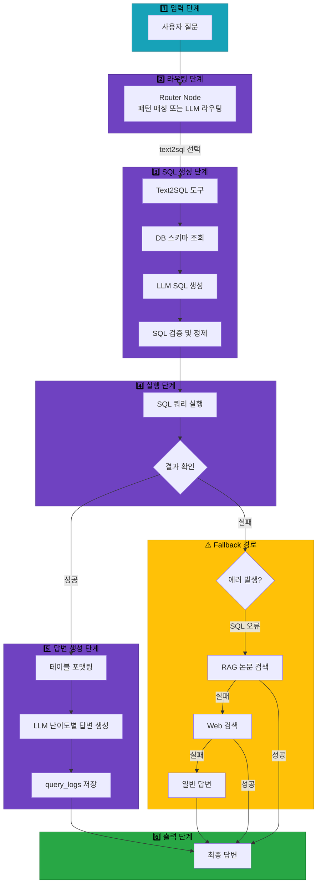
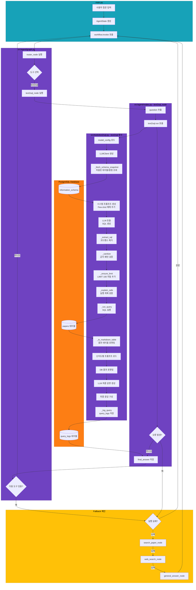

# Text2SQL 도구 아키텍처 문서

## 📋 목차
1. [도구 개요](#도구-개요)
2. [도구 실행 조건](#도구-실행-조건)
3. [도구 자동 전환 및 Fallback](#도구-자동-전환-및-fallback)
4. [단순 흐름 아키텍처](#단순-흐름-아키텍처)
5. [상세 기능 동작 흐름도](#상세-기능-동작-흐름도)
6. [동작 설명](#동작-설명)
7. [사용 예시](#사용-예시)

---

## 도구 개요

### 목적 및 역할

**Text2SQL 도구**는 사용자의 자연어 질문을 SQL 쿼리로 자동 변환하여 PostgreSQL 데이터베이스에서 논문 통계 정보를 조회하는 도구입니다.

### 주요 기능

1. **자연어 → SQL 변환**: LLM을 활용하여 사용자 질문을 안전한 SQL 쿼리로 변환
2. **통계 정보 조회**: 논문 개수, 인용 순위, 카테고리별 통계 등 집계 정보 제공
3. **보안 강화**: 화이트리스트 기반 테이블/컬럼 접근 제한 (읽기 전용)
4. **난이도별 답변**: elementary/beginner/intermediate/advanced 4가지 수준의 설명 제공
5. **쿼리 로깅**: 모든 쿼리 실행 기록을 `query_logs` 테이블에 저장

### 사용 데이터베이스

- **DB**: PostgreSQL
- **주 테이블**: `papers` (논문 메타데이터)
- **로그 테이블**: `query_logs` (쿼리 실행 이력)
- **접근 방식**: 읽기 전용 (SELECT/WITH만 허용)

---

## 도구 실행 조건

### 패턴 기반 라우팅 (우선순위 135)

**multi_request_patterns.yaml**에서 정의된 패턴:

```yaml
- keywords:
  - 논문
  any_of_keywords:
  - 통계
  - 인용
  - 많은
  - 상위
  - 몇
  exclude_keywords:
  - 저장
  - 요약
  tools:
  - text2sql
  - search_paper
  - web_search
  - general
  priority: 135
```

### 실행 조건 요약

| 조건 | 설명 | 예시 |
|------|------|------|
| 통계 질문 | "몇", "개수", "통계" 키워드 포함 | "2024년 논문 몇 편?" |
| 집계 질문 | "많은", "상위", "순위" 키워드 포함 | "인용 많은 논문 알려줘" |
| 데이터 조회 | "카테고리별", "저자별" 등 그룹핑 | "카테고리별 논문 수는?" |
| 특정 기간 | 연도, 날짜 조건 포함 | "2023년 이후 논문 통계" |

### LLM 기반 라우팅

패턴 매칭이 실패하면 **routing_prompts.json**의 Few-shot 예제를 참고하여 LLM이 직접 도구 선택:

```json
{
  "question": "2024년 논문 몇 편?",
  "tool": "text2sql",
  "reason": "년도별 논문 개수 통계"
}
```

---

## 도구 자동 전환 및 Fallback

### Fallback 체인

Text2SQL 도구는 4단계 Fallback 체인을 지원합니다:

```
text2sql (1차) → search_paper (2차) → web_search (3차) → general (4차)
```

### 실행 흐름

```
사용자 통계/데이터 조회 요청
↓
[1단계] Text2SQL 도구 실행
├─ 성공 → SQL 쿼리 생성 및 실행 → 결과 반환
└─ 실패 (쿼리 생성 실패 또는 실행 오류)
    ↓
    [2단계] RAG 논문 검색 도구로 자동 전환
    ├─ 성공 → 논문 검색 결과 반환
    └─ 실패 (검색 결과 없음 또는 유사도 낮음)
        ↓
        [3단계] Web 검색 도구로 자동 전환
        ├─ 성공 → 웹 검색 결과 반환
        └─ 실패 (검색 결과 없음)
            ↓
            [4단계] 일반 답변 도구로 자동 전환
            └─ LLM이 직접 답변 생성
```

### Fallback 트리거 조건

| 조건 | 설명 | 처리 방식 |
|------|------|-----------|
| SQL 생성 실패 | LLM이 유효한 SQL을 생성하지 못함 | 에러 메시지 + Fallback |
| 금지 패턴 감지 | INSERT/UPDATE/DELETE 등 차단 | 에러 메시지 + Fallback |
| 테이블 접근 거부 | `papers` 외 테이블 참조 시도 | 에러 메시지 + Fallback |
| 쿼리 실행 오류 | 구문 오류, 컬럼 없음 등 | 에러 메시지 + Fallback |
| 결과 없음 | 쿼리는 성공했지만 결과 0건 | 정상 반환 (Fallback X) |

### 도구 전환 결정 로직 위치

**src/agent/graph.py**의 `continue_to_next_tool()` 함수:

```python
def continue_to_next_tool(state: AgentState):
    """
    현재 도구 실행 후 파이프라인의 다음 도구로 이동 여부 결정
    """
    tool_pipeline = state.get("tool_pipeline", [])
    pipeline_index = state.get("pipeline_index", 0)

    # 파이프라인에 다음 도구가 있으면 계속 실행
    if pipeline_index < len(tool_pipeline):
        return "continue_pipeline"
    else:
        return "end"
```

---

## 단순 흐름 아키텍처



---

## 상세 기능 동작 흐름도



---

## 동작 설명

### 1단계: 사용자 질문 입력 및 라우팅

#### main.py (실행 진입점)

```python
# main.py
question = "2024년 논문 몇 편?"
initial_state = {
    "question": question,
    "difficulty": "easy",
    "messages": []
}

workflow = create_agent_graph(exp_manager)
result = workflow.invoke(initial_state)
```

#### src/agent/graph.py (워크플로우 정의)

```python
# 노드 정의
workflow.add_node("router", router_with_exp)
workflow.add_node("text2sql", text2sql_with_exp)

# 조건부 라우팅
workflow.add_conditional_edges(
    "router",
    route_to_tool,
    {
        "text2sql": "text2sql",
        "search_paper": "search_paper",
        # ... 기타 도구들
    }
)

# 다음 도구 실행 또는 종료 결정
for node_name in ["text2sql", "search_paper", ...]:
    workflow.add_conditional_edges(
        node_name,
        continue_to_next_tool,
        {
            "continue_pipeline": "router",
            "end": END
        }
    )
```

#### src/agent/nodes.py (라우터 노드)

```python
def router_node(state: AgentState, exp_manager=None):
    question = state["question"]

    # 패턴 매칭 우선 시도
    multi_request_patterns = get_multi_request_patterns()

    for pattern in multi_request_patterns:
        keywords = pattern.get("keywords", [])
        any_of_keywords = pattern.get("any_of_keywords", [])
        tools = pattern.get("tools", [])

        # AND + OR 로직
        keywords_match = all(kw in question for kw in keywords)
        any_keywords_match = any(kw in question for kw in any_of_keywords) if any_of_keywords else True

        if keywords_match and any_keywords_match:
            # 패턴 매칭 성공
            state["tool_pipeline"] = tools  # [text2sql, search_paper, web_search, general]
            state["tool_choice"] = tools[0]  # text2sql
            return state

    # 패턴 매칭 실패 시 LLM 라우팅
    # (생략)
```

### 2단계: Text2SQL 노드 실행

#### src/agent/nodes.py (text2sql_node)

```python
def text2sql_node(state: AgentState, exp_manager=None):
    question = state["question"]

    if exp_manager:
        exp_manager.logger.write(f"Text-to-SQL 노드 실행: {question}")

    try:
        # Text2SQL 도구 호출
        result = text2sql.run(question)
        state["final_answer"] = result
    except Exception as e:
        # 오류 발생 시 에러 메시지 저장
        if exp_manager:
            exp_manager.logger.write(f"SQL 실행 실패: {e}", print_error=True)
        state["final_answer"] = f"SQL 실행 오류: {str(e)}"

    return state
```

### 3단계: SQL 생성 및 실행

#### src/tools/text2sql.py (text2sql 함수)

**3-1. 설정 로드 및 LLM 클라이언트 생성**

```python
@tool("text2sql", return_direct=False)
def text2sql(user_question: str, difficulty: str = "easy") -> str:
    # config에서 text2sql 모델 설정 읽기
    model_config = get_model_config()
    text2sql_config = model_config.get("text2sql", {})
    provider = text2sql_config.get("provider", "solar")
    model = text2sql_config.get("model", "solar-pro2")
    temperature = text2sql_config.get("temperature", 0.0)

    # LLMClient 생성
    llm_client = LLMClient(provider=provider, model=model, temperature=temperature)
```

**3-2. DB 스키마 조회**

```python
def _fetch_schema_snapshot() -> str:
    """허용된 테이블/컬럼만 스냅샷 생성"""
    q = """
    SELECT table_name, column_name, data_type
    FROM information_schema.columns
    WHERE table_schema='public'
      AND table_name = ANY(%s)
    ORDER BY table_name, ordinal_position;
    """
    with _get_conn() as conn, conn.cursor() as cur:
        cur.execute(q, (list(ALLOWED_TABLES),))  # ALLOWED_TABLES = {"papers"}
        rows = cur.fetchall()

    lines = []
    for t, c, dt in rows:
        if c in ALLOWED_COLUMNS:  # 화이트리스트 검증
            lines.append(f"- {t}.{c} :: {dt}")
    return "\n".join(lines)
```

**ALLOWED_TABLES 및 ALLOWED_COLUMNS:**

```python
ALLOWED_TABLES = {"papers"}  # 현재 버전은 papers만 허용

ALLOWED_COLUMNS = {
    "paper_id", "title", "authors", "publish_date",
    "source", "url", "category", "citation_count",
    "abstract", "created_at", "updated_at",
}
```

**3-3. 시스템 프롬프트 및 Few-shot 예제**

```python
_SYS_PROMPT = """You are a careful Text-to-SQL generator for PostgreSQL.

Rules:
- Output ONLY a single SQL query with no extra prose or comments.
- SELECT / WITH (CTE) only. No writes (INSERT/UPDATE/DELETE), no DDL (ALTER/DROP/CREATE).
- Use only the whitelisted table and columns below.
- Prefer COUNT/SUM/AVG/MAX/MIN for numeric answers.
- For year filters, use EXTRACT(YEAR FROM publish_date).
- Add LIMIT 100 when returning rows (non-aggregate).

Whitelisted schema (public):
{schema}
"""

_FEW_SHOTS = [
    ("2024년에 발표된 논문 개수는?",
     "SELECT COUNT(*) AS paper_count FROM papers WHERE EXTRACT(YEAR FROM publish_date)=2024;"),

    ("카테고리별 논문 수를 보여줘",
     "SELECT category, COUNT(*) AS paper_count FROM papers GROUP BY category ORDER BY paper_count DESC LIMIT 100;"),

    ("AI 관련 논문 중 가장 인용이 많은 건?",
     "SELECT title, citation_count FROM papers WHERE category ILIKE '%AI%' ORDER BY citation_count DESC LIMIT 1;"),
]
```

**3-4. LLM 호출하여 SQL 생성**

```python
schema = _fetch_schema_snapshot()
sys_prompt = _SYS_PROMPT.format(schema=schema)
few_shot = _fewshot_block()
user_block = f"-- Q: {user_question}\n-- Generate ONE SQL ONLY."

# LLM 호출
raw = llm_client.llm.invoke([
    SystemMessage(content=sys_prompt),
    HumanMessage(content=few_shot + "\n\n" + user_block),
]).content

# 출력 예시:
# "SELECT COUNT(*) AS paper_count FROM papers WHERE EXTRACT(YEAR FROM publish_date)=2024;"
```

**3-5. SQL 추출 및 검증**

```python
def _extract_sql(text: str) -> str:
    """LLM이 코드펜스 등을 포함해도 SQL만 추출"""
    s = text.strip()
    # ```sql ... ``` 제거
    m = re.search(r"```sql(.*?)```", s, flags=re.I | re.S)
    if m:
        s = m.group(1).strip()
    return s

sql_generated = _extract_sql(raw)
# "SELECT COUNT(*) AS paper_count FROM papers WHERE EXTRACT(YEAR FROM publish_date)=2024;"
```

**3-6. SQL 정제 (금지 패턴 검증)**

```python
_FORBIDDEN_PATTERNS = [
    r"\bdrop\b", r"\balter\b", r"\btruncate\b", r"\binsert\b",
    r"\bupdate\b", r"\bdelete\b", r"\bgrant\b", r"\brevoke\b",
]

def _sanitize(sql: str) -> str:
    low = sql.lower()

    # 금지 패턴 검사
    for pat in _FORBIDDEN_PATTERNS:
        if re.search(pat, low):
            raise ValueError("금지된 SQL 패턴이 감지되었습니다.")

    # 읽기 전용 검증
    first = re.split(r"\s+", low, maxsplit=1)[0]
    if first not in {"select", "with"}:
        raise ValueError("SELECT/WITH 쿼리만 허용됩니다.")

    # 테이블 화이트리스트 검증
    flat_tbls = _find_tables_outside_parens(low)
    for t in flat_tbls:
        tname = t.split(".")[-1]
        if tname not in ALLOWED_TABLES:
            raise ValueError(f"허용되지 않은 테이블 참조: {tname}")

    return sql + ";"
```

**3-7. LIMIT 자동 추가**

```python
def _ensure_limit(sql: str) -> str:
    """집계가 아닌 경우 LIMIT 100 자동 부여"""
    low = sql.lower()

    # 집계 함수 있으면 LIMIT 불필요
    if any(k in low for k in ["count(", "avg(", "sum(", "max(", "min("]):
        return sql

    # 이미 LIMIT 있으면 추가 안 함
    if " limit " in low:
        return sql

    # LIMIT 추가
    return sql.rstrip(";") + " LIMIT 100;"
```

**3-8. 실행 계획 검증**

```python
def _explain_safe(sql: str) -> bool:
    """EXPLAIN으로 사전 점검 (프로덕션에서는 임계값 설정 권장)"""
    try:
        with _get_conn() as conn, conn.cursor() as cur:
            cur.execute("EXPLAIN " + sql)
            # 현재는 무조건 통과 (데모용)
            return True
    except Exception:
        return False
```

**3-9. SQL 실행**

```python
def _run_query(sql: str) -> Tuple[List[str], List[Tuple[Any, ...]]]:
    with _get_conn() as conn, conn.cursor(cursor_factory=psycopg2.extras.DictCursor) as cur:
        cur.execute(sql)
        cols = [d.name for d in cur.description]
        rows = cur.fetchall()
        return cols, rows

# 실행
cols, rows = _run_query(sql_ready)
# cols = ["paper_count"]
# rows = [(42,)]
```

### 4단계: 결과 포맷팅 및 답변 생성

**4-1. Markdown 테이블 생성**

```python
def _to_markdown_table(cols: List[str], rows: List[Tuple[Any, ...]]) -> str:
    if not rows:
        return "_결과가 없습니다._"

    header = " | ".join(cols)
    sep = " | ".join(["---"] * len(cols))
    body_lines = []
    for r in rows:
        body_lines.append(" | ".join("" if v is None else str(v) for v in r))
    return f"{header}\n{sep}\n" + "\n".join(body_lines)

table_md = _to_markdown_table(cols, rows)
# paper_count
# ---
# 42
```

**4-2. 난이도별 프롬프트 로드**

```python
# 1. text2sql 프롬프트 로드
system_prompt = get_tool_prompt("text2sql", difficulty)
# difficulty = "easy" → "beginner" 또는 "elementary"

# 2. DB 결과 포맷팅
db_results = (
    f"**생성된 SQL**:\n```sql\n{sql_ready}\n```\n\n"
    f"**결과 테이블**:\n{table_md}"
)

# 3. user_prompt_template 로드
from src.prompts.loader import load_tool_prompts, map_difficulty
tool_prompts_data = load_tool_prompts()
mapped_diff = map_difficulty(difficulty)  # "easy" → "beginner"
complexity_level = "easy"  # beginner/elementary → easy
user_template = tool_prompts_data["text2sql_prompts"][complexity_level][mapped_diff]["user_prompt_template"]

# 4. 템플릿에 데이터 삽입
user_content = user_template.format(
    db_results=db_results,
    question=user_question
)
```

**4-3. LLM 최종 답변 생성**

```python
# 5. LLM 호출하여 최종 답변 생성
final_answer_raw = llm_client.llm.invoke([
    SystemMessage(content=system_prompt),
    HumanMessage(content=user_content),
]).content

# 6. 최종 응답 구성
out = (
    f"**질문**: {user_question}\n\n"
    f"**생성된 SQL**:\n```sql\n{sql_ready}\n```\n\n"
    f"**분석 결과**:\n\n{final_answer_raw}"
)
```

**난이도별 답변 예시:**

| 난이도 | 답변 스타일 |
|--------|-------------|
| elementary | "2024년에 발표된 논문은 총 42편입니다." |
| beginner | "데이터베이스를 조회한 결과, 2024년에 발표된 논문은 42편입니다. 이는 SQL의 COUNT 함수를 사용하여 집계한 결과입니다." |
| intermediate | "SQL 쿼리를 실행한 결과, 2024년도에 발표된 논문은 총 42편입니다. EXTRACT 함수로 발행일에서 연도를 추출하여 필터링했습니다." |
| advanced | "PostgreSQL에서 EXTRACT(YEAR FROM publish_date)=2024 조건으로 필터링하여 COUNT(*)를 실행한 결과, 42건의 레코드가 조회되었습니다. 이는 papers 테이블의 전체 데이터 중 해당 연도 조건을 만족하는 행의 개수입니다." |

### 5단계: 쿼리 로깅

**5-1. query_logs 테이블 저장**

```python
def _log_query(user_query: str,
               generated_sql: str,
               response_text: str,
               success: bool,
               response_time_ms: int,
               error_message: Optional[str] = None) -> None:
    try:
        with _get_conn() as conn, conn.cursor() as cur:
            cur.execute(
                """
                INSERT INTO query_logs (user_query, difficulty_mode, tool_used, response,
                                        response_time_ms, success, error_message)
                VALUES (%s, %s, %s, %s, %s, %s, %s);
                """,
                (
                    user_query,
                    None,  # difficulty_mode는 현재 미사용
                    "text2sql",
                    response_text[:2000],  # 첫 2000자만 저장
                    response_time_ms,
                    success,
                    error_message,
                ),
            )
            conn.commit()
    except Exception:
        # 로깅 실패는 무시 (서비스 흐름 방해 X)
        pass
```

### 6단계: Fallback 실행 (오류 발생 시)

**6-1. 오류 감지 및 Fallback 시작**

```python
# src/agent/graph.py
def continue_to_next_tool(state: AgentState):
    tool_pipeline = state.get("tool_pipeline", [])
    pipeline_index = state.get("pipeline_index", 0)

    # text2sql 실패 시 pipeline_index = 1 (다음 도구: search_paper)
    if pipeline_index < len(tool_pipeline):
        # 다음 도구로 이동
        next_tool = tool_pipeline[pipeline_index]
        state["tool_choice"] = next_tool
        state["pipeline_index"] += 1
        return "continue_pipeline"
    else:
        return "end"
```

**6-2. Fallback 체인 순차 실행**

```
text2sql (실패)
  ↓
search_paper_node 실행 (RAG 검색)
  ↓ (실패)
web_search_node 실행 (Tavily 검색)
  ↓ (실패)
general_answer_node 실행 (LLM 직접 답변)
  ↓
최종 답변 반환
```

---

## DB 스키마 상세

### papers 테이블

```sql
CREATE TABLE IF NOT EXISTS papers (
    paper_id SERIAL PRIMARY KEY,         -- 논문 고유 ID (자동 증가)
    arxiv_id VARCHAR(64),                -- arXiv ID (예: 2301.12345)
    title TEXT NOT NULL,                 -- 논문 제목 (필수)
    authors TEXT,                        -- 저자 목록 (쉼표 구분)
    publish_date DATE,                   -- 발행일
    source VARCHAR(100),                 -- 출처 (예: arXiv, PubMed)
    url TEXT,                            -- 논문 URL
    category VARCHAR(100),               -- 카테고리 (예: cs.AI, cs.LG)
    citation_count INT,                  -- 인용 횟수
    abstract TEXT,                       -- 초록
    created_at TIMESTAMP DEFAULT NOW()   -- 레코드 생성 시각
);
```

**주요 컬럼 설명:**

| 컬럼명 | 타입 | 설명 | 예시 |
|--------|------|------|------|
| paper_id | SERIAL | 논문 고유 ID | 1, 2, 3, ... |
| title | TEXT | 논문 제목 | "Attention Is All You Need" |
| authors | TEXT | 저자 목록 | "Vaswani, Ashish; Shazeer, Noam" |
| publish_date | DATE | 발행일 | 2017-06-12 |
| category | VARCHAR(100) | 카테고리 | cs.AI, cs.LG |
| citation_count | INT | 인용 횟수 | 15234 |

### query_logs 테이블

```sql
CREATE TABLE query_logs (
    log_id SERIAL PRIMARY KEY,           -- 로그 고유 ID
    user_query TEXT NOT NULL,            -- 사용자 질문
    difficulty_mode VARCHAR(20),         -- 난이도 (현재 미사용)
    tool_used VARCHAR(50),               -- 도구명 (text2sql)
    response TEXT,                       -- 응답 내용 (첫 2000자)
    response_time_ms INTEGER,            -- 응답 시간 (밀리초)
    success BOOLEAN,                     -- 성공 여부
    error_message TEXT,                  -- 에러 메시지 (실패 시)
    created_at TIMESTAMP DEFAULT NOW()   -- 로그 생성 시각
);
```

**로깅 용도:**

- 모든 Text2SQL 요청 기록
- 성공/실패 통계 수집
- 응답 시간 모니터링
- 에러 패턴 분석

---

## Text2SQL 변환 과정 상세

### 단계별 변환 예시

**질문**: "2024년 AI 논문 중 인용 많은 상위 3개 알려줘"

#### 1단계: 질문 분석

LLM이 질문에서 다음 정보 추출:
- **연도 조건**: 2024년
- **카테고리 조건**: AI
- **정렬 기준**: 인용 횟수 (내림차순)
- **결과 개수**: 상위 3개

#### 2단계: SQL 쿼리 생성

```sql
SELECT title, authors, citation_count
FROM papers
WHERE EXTRACT(YEAR FROM publish_date) = 2024
  AND category ILIKE '%AI%'
ORDER BY citation_count DESC
LIMIT 3;
```

**쿼리 구성 요소:**

| 부분 | 설명 | 근거 |
|------|------|------|
| `EXTRACT(YEAR FROM publish_date) = 2024` | 연도 필터링 | 시스템 프롬프트 규칙 |
| `category ILIKE '%AI%'` | 대소문자 무시 키워드 검색 | 시스템 프롬프트 규칙 |
| `ORDER BY citation_count DESC` | 인용 횟수 내림차순 정렬 | 질문의 "많은" 키워드 |
| `LIMIT 3` | 상위 3개만 반환 | 질문의 "상위 3개" |

#### 3단계: 실행 결과

| title | authors | citation_count |
|-------|---------|----------------|
| "GPT-4 Technical Report" | "OpenAI" | 5234 |
| "LLaMA: Open and Efficient..." | "Touvron, H.; et al" | 3892 |
| "Gemini: A Family of..." | "Google DeepMind" | 2456 |

#### 4단계: LLM 최종 답변 (beginner 수준)

```
**질문**: 2024년 AI 논문 중 인용 많은 상위 3개 알려줘

**생성된 SQL**:
```sql
SELECT title, authors, citation_count
FROM papers
WHERE EXTRACT(YEAR FROM publish_date) = 2024
  AND category ILIKE '%AI%'
ORDER BY citation_count DESC
LIMIT 3;
```

**분석 결과**:

2024년 발표된 AI 논문 중 인용이 가장 많은 상위 3개 논문은 다음과 같습니다:

1. **GPT-4 Technical Report** (OpenAI) - 5,234회 인용
2. **LLaMA: Open and Efficient...** (Touvron, H.; et al) - 3,892회 인용
3. **Gemini: A Family of...** (Google DeepMind) - 2,456회 인용

데이터베이스에서 2024년도 논문을 연도별로 필터링하고, AI 카테고리에 해당하는 논문만 선택한 후,
인용 횟수를 기준으로 내림차순 정렬하여 상위 3개를 조회했습니다.
```

---

## SQL 쿼리 생성 예시

### 예시 1: 단순 집계

**질문**: "저장된 논문 개수 알려줘"

**생성 SQL**:
```sql
SELECT COUNT(*) AS paper_count FROM papers;
```

**결과**:
| paper_count |
|-------------|
| 1,234 |

**최종 답변** (elementary):
"데이터베이스에 저장된 논문은 총 1,234편입니다."

---

### 예시 2: 그룹별 집계

**질문**: "카테고리별 논문 수를 보여줘"

**생성 SQL**:
```sql
SELECT category, COUNT(*) AS paper_count
FROM papers
GROUP BY category
ORDER BY paper_count DESC
LIMIT 100;
```

**결과**:
| category | paper_count |
|----------|-------------|
| cs.AI | 456 |
| cs.LG | 389 |
| cs.CV | 234 |

**최종 답변** (beginner):
```
**카테고리별 논문 통계**

데이터베이스를 조회한 결과, 카테고리별 논문 수는 다음과 같습니다:

- cs.AI (인공지능): 456편
- cs.LG (머신러닝): 389편
- cs.CV (컴퓨터 비전): 234편

SQL의 GROUP BY를 사용하여 카테고리별로 그룹핑한 후, COUNT 함수로 각 그룹의 논문 개수를 집계했습니다.
```

---

### 예시 3: 조건부 필터링 및 정렬

**질문**: "2023년 이후 인용 많은 논문 상위 5개"

**생성 SQL**:
```sql
SELECT title, citation_count, publish_date
FROM papers
WHERE publish_date >= DATE '2023-01-01'
ORDER BY citation_count DESC
LIMIT 5;
```

**결과**:
| title | citation_count | publish_date |
|-------|----------------|--------------|
| "GPT-4 Technical Report" | 5234 | 2023-03-15 |
| "LLaMA: Open..." | 3892 | 2023-02-27 |

**최종 답변** (intermediate):
```
**2023년 이후 인용 많은 논문 상위 5개**

SQL 쿼리를 실행한 결과, 2023년 1월 1일 이후 발표된 논문 중 인용 횟수가 많은 상위 5개 논문은 다음과 같습니다:

1. **GPT-4 Technical Report** (5,234회 인용, 2023-03-15)
2. **LLaMA: Open and Efficient...** (3,892회 인용, 2023-02-27)
...

WHERE 절로 발행일 조건을 필터링하고, ORDER BY와 LIMIT으로 상위 결과를 조회했습니다.
```

---

### 예시 4: 복잡한 문자열 검색

**질문**: "제목에 'Transformer' 포함된 논문 개수는?"

**생성 SQL**:
```sql
SELECT COUNT(*) AS paper_count
FROM papers
WHERE title ILIKE '%Transformer%';
```

**결과**:
| paper_count |
|-------------|
| 87 |

**최종 답변** (advanced):
```
**질문**: 제목에 'Transformer' 포함된 논문 개수는?

**생성된 SQL**:
```sql
SELECT COUNT(*) AS paper_count
FROM papers
WHERE title ILIKE '%Transformer%';
```

**분석 결과**:

PostgreSQL의 ILIKE 연산자를 사용하여 대소문자를 구분하지 않고 'Transformer' 문자열을 포함하는
논문 제목을 검색한 결과, 총 87건의 논문이 조회되었습니다.

ILIKE는 case-insensitive pattern matching을 제공하므로 'transformer', 'TRANSFORMER', 'Transformer'
모두 매칭됩니다. % 와일드카드는 앞뒤로 임의의 문자열을 허용합니다.
```

---

## 오류 처리 방법

### 오류 유형 및 처리

| 오류 유형 | 원인 | 처리 방식 | Fallback |
|-----------|------|-----------|----------|
| SQL 생성 실패 | LLM이 유효한 SQL 생성 못함 | 에러 메시지 + Fallback | search_paper |
| 금지 패턴 감지 | INSERT/UPDATE/DELETE 시도 | ValueError 발생 + Fallback | search_paper |
| 테이블 접근 거부 | papers 외 테이블 참조 | ValueError 발생 + Fallback | search_paper |
| 구문 오류 | SQL 문법 오류 | psycopg2.Error + Fallback | search_paper |
| 컬럼 없음 | 존재하지 않는 컬럼 참조 | psycopg2.Error + Fallback | search_paper |
| 결과 없음 | 조건에 맞는 데이터 없음 | "결과가 없습니다" 반환 | Fallback X |
| DB 연결 실패 | PostgreSQL 접속 불가 | 에러 메시지 + Fallback | search_paper |

### 오류 메시지 예시

**금지 패턴 감지:**
```
**질문**: papers 테이블 삭제해줘

**생성된 SQL(검증 전)**:
```sql
DROP TABLE papers;
```

요청을 처리하는 중 오류가 발생했습니다:
```
ValueError: 금지된 SQL 패턴이 감지되었습니다.
```

[Fallback: search_paper 도구로 자동 전환됨]
```

**테이블 접근 거부:**
```
**질문**: users 테이블에서 데이터 조회해줘

**생성된 SQL(검증 전)**:
```sql
SELECT * FROM users LIMIT 100;
```

요청을 처리하는 중 오류가 발생했습니다:
```
ValueError: 허용되지 않은 테이블 참조: users
```

[Fallback: search_paper 도구로 자동 전환됨]
```

---

## 사용 예시

### 예시 1: 단순 통계 조회

**사용자 질문**:
```
2024년 논문 몇 편?
```

**실행 과정**:

1. **패턴 매칭**: `[논문, 몇]` → text2sql 선택
2. **SQL 생성**:
   ```sql
   SELECT COUNT(*) AS paper_count FROM papers WHERE EXTRACT(YEAR FROM publish_date)=2024;
   ```
3. **실행 결과**: `paper_count: 42`
4. **최종 답변** (easy/beginner):
   ```
   **질문**: 2024년 논문 몇 편?

   **생성된 SQL**:
   ```sql
   SELECT COUNT(*) AS paper_count FROM papers WHERE EXTRACT(YEAR FROM publish_date)=2024;
   ```

   **분석 결과**:

   2024년에 발표된 논문은 총 42편입니다.
   데이터베이스를 조회한 결과, 해당 연도 조건을 만족하는 논문이 42건 확인되었습니다.
   ```

---

### 예시 2: 복합 조건 조회

**사용자 질문**:
```
2023년 이후 AI 논문 중 인용 많은 상위 3개 알려줘
```

**실행 과정**:

1. **패턴 매칭**: `[논문, 많은]` → text2sql 선택
2. **SQL 생성**:
   ```sql
   SELECT title, authors, citation_count
   FROM papers
   WHERE publish_date >= DATE '2023-01-01'
     AND category ILIKE '%AI%'
   ORDER BY citation_count DESC
   LIMIT 3;
   ```
3. **실행 결과**:
   | title | authors | citation_count |
   |-------|---------|----------------|
   | GPT-4 Technical Report | OpenAI | 5234 |
   | LLaMA: Open... | Touvron, H. | 3892 |
   | Gemini: A Family... | Google | 2456 |

4. **최종 답변** (hard/intermediate):
   ```
   **질문**: 2023년 이후 AI 논문 중 인용 많은 상위 3개 알려줘

   **생성된 SQL**:
   ```sql
   SELECT title, authors, citation_count
   FROM papers
   WHERE publish_date >= DATE '2023-01-01'
     AND category ILIKE '%AI%'
   ORDER BY citation_count DESC
   LIMIT 3;
   ```

   **분석 결과**:

   2023년 1월 1일 이후 발표된 AI 관련 논문 중 인용 횟수가 가장 많은 상위 3개 논문은 다음과 같습니다:

   1. **GPT-4 Technical Report** (OpenAI)
      - 인용 횟수: 5,234회

   2. **LLaMA: Open and Efficient Foundation Language Models** (Touvron, H.; et al)
      - 인용 횟수: 3,892회

   3. **Gemini: A Family of Highly Capable Multimodal Models** (Google DeepMind)
      - 인용 횟수: 2,456회

   SQL 쿼리에서 WHERE 절로 발행일과 카테고리 조건을 동시에 필터링하고,
   ORDER BY로 인용 횟수 기준 내림차순 정렬 후 LIMIT 3으로 상위 결과만 조회했습니다.
   ```

---

### 예시 3: 에러 시나리오 (Fallback 발생)

**사용자 질문**:
```
논문 테이블 구조 알려줘
```

**실행 과정**:

1. **패턴 매칭**: `[논문]` → text2sql 선택 시도
2. **SQL 생성 실패**: LLM이 DESCRIBE/SHOW 같은 메타 쿼리 생성 시도
   ```sql
   SHOW COLUMNS FROM papers;
   ```
3. **검증 실패**: `SHOW`는 SELECT/WITH가 아니므로 거부
   ```
   ValueError: SELECT/WITH 쿼리만 허용됩니다.
   ```
4. **Fallback 트리거**: search_paper → web_search → general
5. **최종 답변** (general 도구):
   ```
   papers 테이블은 논문 메타데이터를 저장하는 테이블입니다. 주요 컬럼은 다음과 같습니다:

   - paper_id: 논문 고유 ID
   - title: 논문 제목
   - authors: 저자 목록
   - publish_date: 발행일
   - category: 카테고리
   - citation_count: 인용 횟수
   - abstract: 초록

   더 자세한 스키마 정보는 데이터베이스 관리자에게 문의하시기 바랍니다.
   ```

---

### 예시 4: 결과 없음 (Fallback 없음)

**사용자 질문**:
```
2025년 논문 몇 편?
```

**실행 과정**:

1. **SQL 생성**:
   ```sql
   SELECT COUNT(*) AS paper_count FROM papers WHERE EXTRACT(YEAR FROM publish_date)=2025;
   ```
2. **실행 결과**: `paper_count: 0`
3. **최종 답변**:
   ```
   **질문**: 2025년 논문 몇 편?

   **생성된 SQL**:
   ```sql
   SELECT COUNT(*) AS paper_count FROM papers WHERE EXTRACT(YEAR FROM publish_date)=2025;
   ```

   **분석 결과**:

   2025년에 발표된 논문은 0편입니다.
   아직 해당 연도의 논문이 데이터베이스에 저장되지 않았습니다.
   ```

**참고**: 결과가 0건이어도 쿼리 실행은 성공이므로 Fallback이 트리거되지 않습니다.

---

## 보안 및 제약 사항

### 보안 기능

| 기능 | 설명 | 구현 위치 |
|------|------|-----------|
| 화이트리스트 테이블 | papers 테이블만 접근 허용 | `ALLOWED_TABLES = {"papers"}` |
| 화이트리스트 컬럼 | 11개 컬럼만 사용 가능 | `ALLOWED_COLUMNS = {...}` |
| 읽기 전용 강제 | SELECT/WITH만 허용 | `_sanitize()` 함수 |
| 금지 패턴 차단 | INSERT/UPDATE/DELETE 등 차단 | `_FORBIDDEN_PATTERNS` |
| 자동 LIMIT | 집계 아닌 경우 LIMIT 100 자동 추가 | `_ensure_limit()` 함수 |
| 실행 계획 검증 | EXPLAIN으로 사전 점검 | `_explain_safe()` 함수 |

### 제약 사항

1. **단일 테이블 제한**: 현재 버전은 `papers` 테이블만 지원
2. **읽기 전용**: 데이터 수정/삭제 불가능
3. **성능 제한**: 비집계 쿼리는 최대 100건만 반환
4. **복잡한 쿼리 제한**: JOIN, Subquery, Window Function 등 고급 기능은 LLM 성능에 의존

### 향후 확장 가능성

- `glossary` 테이블 추가 지원
- JOIN을 통한 다중 테이블 쿼리
- 동적 화이트리스트 관리
- 사용자별 권한 관리

---

## 파일 구조 요약

### 관련 파일 목록

| 파일 경로 | 역할 | 주요 함수/클래스 |
|-----------|------|------------------|
| `src/tools/text2sql.py` | Text2SQL 도구 구현 | `text2sql()`, `_sanitize()`, `_run_query()` |
| `src/agent/nodes.py` | Text2SQL 노드 래퍼 | `text2sql_node()` |
| `src/agent/graph.py` | 워크플로우 정의 | `create_agent_graph()`, `continue_to_next_tool()` |
| `configs/multi_request_patterns.yaml` | 패턴 매칭 규칙 | 우선순위 135 패턴 |
| `prompts/routing_prompts.json` | LLM 라우팅 프롬프트 | text2sql Few-shot 예제 |
| `prompts/tool_prompts.json` | 난이도별 프롬프트 | text2sql 4단계 프롬프트 |
| `configs/model_config.yaml` | 모델 설정 | text2sql 섹션 (provider, model, temperature) |

---

## 참고 자료

### 관련 문서

- [Text2SQL 구현 검증 보고서](../../issues/05-1_text2sql_구현_검증_보고서.md)
- [Text2SQL 난이도별 프롬프트 강화](../../issues/05-4_Text2SQL_난이도별_프롬프트_강화.md)
- [Text2SQL QnA](../../QnA/text2sql_qna.md)
- [프롬프트 엔지니어링 통합 보고서](../../issues/04-1_프롬프트_엔지니어링_통합_보고서.md)

### 데이터베이스 관련

- [데이터베이스 시스템](../../modularization/05_데이터베이스_시스템.md)
- [setup_database.py](../../../scripts/data/setup_database.py)

### AI Agent 시스템

- [AI Agent 시스템](../../modularization/06_AI_Agent_시스템.md)
- [패턴 기반 도구 라우팅](../../modularization/06-2_패턴_기반_도구_라우팅.md)
- [도구 자동전환 기능](../../modularization/09-1_도구_자동전환_기능.md)

---

**문서 버전**: 1.0
**작성일**: 2025-11-07
**담당자**: AI Architecture Team
