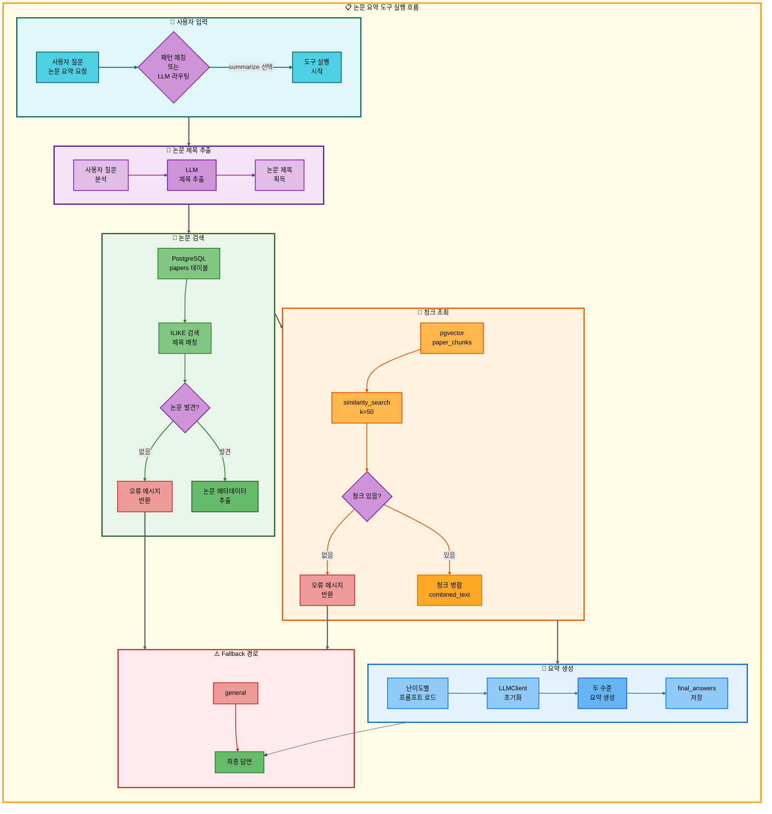

# 논문 요약 도구 아키텍처

## 📋 문서 정보
- **작성일**: 2025-11-07
- **작성자**: 최현화[팀장]
- **프로젝트명**: 논문 리뷰 챗봇 (AI Agent + RAG)
- **팀명**: 연결의 민족
- **문서 버전**: 1.0

---

## 📑 목차
1. [도구 개요](#도구-개요)
2. [도구 실행 조건](#도구-실행-조건)
3. [도구 자동 전환 및 Fallback](#도구-자동-전환-및-fallback)
4. [단순 흐름 아키텍처](#단순-흐름-아키텍처)
5. [상세 기능 동작 흐름도](#상세-기능-동작-흐름도)
6. [동작 설명](#동작-설명)
7. [사용 예시](#사용-예시)
8. [핵심 포인트](#핵심-포인트)
9. [참고 정보](#참고-정보)

---

## 📌 도구 개요

### 목적과 역할

논문 요약 도구는 PostgreSQL + pgvector에서 논문 청크를 조회하여 LangChain의 요약 체인으로 논문 전문을 요약하는 도구입니다.

**핵심 역할:**
- 사용자 질문에서 논문 제목 자동 추출 (LLM 사용)
- PostgreSQL papers 테이블에서 논문 메타데이터 검색
- pgvector에서 해당 논문의 모든 청크 조회 (최대 50개)
- 난이도별 요약 생성 (elementary/beginner/intermediate/advanced)
- 두 수준의 요약 제공 (easy → elementary+beginner, hard → intermediate+advanced)

**사용 데이터:**
- **PostgreSQL 테이블**: `papers` (논문 메타데이터: 제목, 저자, 발행일, 초록 등)
- **pgvector 컬렉션**: `paper_chunks` (논문 본문 청크의 1536차원 임베딩)
- **임베딩 모델**: OpenAI `text-embedding-3-small`

**요약 메커니즘:**
- 논문 제목 추출 (LLM)
- PostgreSQL ILIKE 검색으로 논문 조회
- pgvector similarity_search로 논문 청크 조회 (k=50)
- 난이도별 프롬프트 적용 (`prompts/tool_prompts.json`)
- LLM 요약 생성 (LLMClient.from_difficulty)

---

## 📋 도구 실행 조건

### 언제 실행되는가?

**1. 사용자가 논문 요약을 명시적으로 요청할 때**
- "Attention Is All You Need 논문 요약해줘"
- "Transformer 논문 정리해줘"
- "BERT 논문 설명해줘"

**2. 다중 요청의 일부로 실행될 때**
- "GPT 논문 찾아서 요약해줘" → search_paper → summarize
- "최신 AI 논문 검색해서 정리해줘" → web_search → summarize

**3. 패턴 매칭 우선순위**

`configs/multi_request_patterns.yaml`에서 정의된 패턴:

```yaml
- keywords:
  - 논문
  - 요약
  exclude_keywords:
  - 저장
  tools:
  - search_paper
  - web_search
  - general
  - summarize
  priority: 120
  description: 논문 검색 후 요약 (4단계 파이프라인)
```

**실행 조건 검증:**
1. `keywords`에 모든 키워드 포함 (`논문`, `요약`) → AND 조건
2. `exclude_keywords`에 해당 키워드 없음 (`저장` 제외)
3. 우선순위 120으로 매칭
4. 파이프라인: search_paper → web_search → general → **summarize**

### 파이프라인 모드 vs 단일 모드

**파이프라인 모드** (tool_pipeline이 있고 pipeline_index > 1):
- 이전 도구(search_paper 또는 web_search)의 결과(`tool_result`)를 받아서 바로 요약
- 간단한 시스템 프롬프트 사용
- 논문 제목 추출 및 DB 검색 단계 생략

**단일 모드** (직접 논문 제목 전달):
- 사용자 질문에서 논문 제목 LLM 추출
- PostgreSQL papers 테이블에서 논문 검색
- pgvector에서 논문 청크 조회
- 두 수준의 요약 생성 (예: beginner + intermediate)

---

## 🔄 도구 자동 전환 및 Fallback

### Fallback Chain 흐름

```
사용자 논문 요약 요청
  ↓
[1] RAG 논문 검색 도구 실행 (search_paper)
  ├─ 성공 → 논문 내용 전달 → [2]
  └─ 실패 (논문 없음)
      ↓
      Web 논문 검색 도구 실행 (web_search)
      ├─ 성공 → 검색 결과 전달 → [2]
      └─ 실패 (웹 검색 실패)
          ↓
          일반 답변 도구 실행 (general)
          └─ LLM 직접 답변 생성 → [2]

[2] 논문 요약 도구 실행 (summarize)
  ├─ 성공 → 요약 결과 반환 → END
  └─ 실패 (요약 생성 오류)
      ↓
      일반 답변 도구로 최종 전환
      └─ LLM이 직접 논문 요약 → END
```

### Fallback 트리거 조건

| 조건 | 설명 | 처리 방식 |
|------|------|-----------|
| 논문 제목 추출 실패 | LLM이 제목을 추출하지 못함 | 에러 메시지 반환 (Fallback X) |
| PostgreSQL 검색 실패 | papers 테이블에 논문 없음 | "논문을 찾지 못했습니다" (Fallback X) |
| pgvector 청크 없음 | 논문 ID는 있지만 청크 없음 | "논문 내용을 찾지 못했습니다" (Fallback X) |
| LLM 요약 오류 | 요약 생성 중 예외 발생 | Exception 처리 + Fallback |
| 파이프라인 모드 오류 | tool_result가 비어있음 | 단일 모드로 재시도 |

### 도구 전환 결정 로직 구현 위치

**파일**: `src/agent/graph.py`
**함수**: `should_continue_pipeline(state: AgentState)`

```python
def should_continue_pipeline(state: AgentState) -> str:
    """
    tool_pipeline에 남은 도구가 있는지 확인
    """
    tool_pipeline = state.get("tool_pipeline", [])
    pipeline_index = state.get("pipeline_index", 0)

    if not tool_pipeline:
        return "end"

    if pipeline_index < len(tool_pipeline):
        return "continue"

    return "end"
```

**동작:**
- `tool_pipeline = ["search_paper", "web_search", "general", "summarize"]`
- `pipeline_index = 3` (summarize 실행 중)
- summarize 성공 시 → `pipeline_index = 4` → "end"
- summarize 실패 시 → Fallback 체인으로 전환 (fallback_router_node)

---

## 🎨 단순 흐름 아키텍처



---

## 🔍 상세 기능 동작 흐름도

```mermaid
graph TB
    subgraph MainFlow["📋 논문 요약 도구 상세 실행 흐름"]
        direction TB

        subgraph Init["🔸 초기화 & 라우팅"]
            direction LR
            A[main.py] --> B[ui/app.py<br/>initialize_agent]
            B --> C[src/agent/graph.py<br/>create_agent_graph]
            C --> D[src/agent/nodes.py<br/>router_node]
            D --> E{패턴 매칭}
            E -->|매칭 성공| F[multi_request_patterns.yaml<br/>priority: 120]
            E -->|매칭 실패| G[LLM 라우팅<br/>routing_prompts.json]
            F --> H[tool_choice =<br/>'summarize']
            G --> H
        end

        subgraph NodeExec["🔹 노드 실행"]
            direction LR
            I[src/tools/summarize.py<br/>summarize_node] --> J{파이프라인<br/>모드?}
            J -->|Yes| K[tool_result<br/>사용]
            J -->|No| L[단일 모드<br/>실행]
        end

        subgraph PipelineMode["🔺 파이프라인 모드"]
            direction LR
            M[tool_result<br/>이전 도구 결과] --> N[LLMClient<br/>from_difficulty]
            N --> O[난이도별<br/>시스템 프롬프트]
            O --> P[LLM invoke<br/>간단한 요약]
            P --> Q[summary 저장<br/>final_answer]
        end

        subgraph SingleMode["🔶 단일 모드"]
            direction LR
            R[question 추출<br/>사용자 질문] --> S[get_summarize_title<br/>_extraction_prompt]
            S --> T[LLM invoke<br/>제목 추출]
            T --> U[paper_title<br/>획득]
        end

        subgraph DBSearch["💾 PostgreSQL 검색"]
            direction LR
            V[psycopg2.connect<br/>DATABASE_URL] --> W[papers 테이블<br/>ILIKE 검색]
            W --> X{논문 발견?}
            X -->|No| Y[오류 메시지<br/>final_answer]
            X -->|Yes| Z[paper_id, title,<br/>authors, abstract]
        end

        subgraph VectorSearch["✨ pgvector 검색"]
            direction LR
            AA[OpenAIEmbeddings<br/>text-embedding-3-small] --> AB[PGVector<br/>paper_chunks]
            AB --> AC[similarity_search<br/>query=title, k=50]
            AC --> AD{청크 있음?}
            AD -->|No| AE[오류 메시지<br/>final_answer]
            AD -->|Yes| AF[docs 획득<br/>50개 청크]
        end

        subgraph SummaryGeneration["🔷 요약 생성"]
            direction LR
            AG[level_mapping<br/>easy/hard → 2 levels] --> AH[combined_text<br/>청크 병합]
            AH --> AI[get_summarize_template<br/>level별 프롬프트]
            AI --> AJ[LLMClient<br/>from_difficulty]
            AJ --> AK[LLM invoke<br/>각 level 요약]
            AK --> AL[final_answers<br/>dict 저장]
        end

        subgraph FileOutput["💡 파일 저장"]
            direction LR
            AM[summary_md<br/>Markdown 생성] --> AN[summary 폴더<br/>생성]
            AN --> AO[safe_title<br/>파일명 생성]
            AO --> AP[summary.md<br/>저장]
        end

        subgraph ErrorHandling["⚠️ 오류 처리"]
            direction LR
            AQ[Exception<br/>catch] --> AR[error_msg<br/>생성]
            AR --> AS[final_answer<br/>저장]
            AS --> AT[Fallback<br/>트리거]
        end

        %% 단계 간 연결
        Init --> NodeExec
        NodeExec --> PipelineMode
        NodeExec --> SingleMode
        SingleMode --> DBSearch
        DBSearch --> VectorSearch
        VectorSearch --> SummaryGeneration
        SummaryGeneration --> FileOutput
        Y --> ErrorHandling
        AE --> ErrorHandling
    end

    %% 메인 워크플로우 배경
    style MainFlow fill:#fffde7,stroke:#f9a825,stroke-width:4px,color:#000

    %% Subgraph 스타일
    style Init fill:#e0f7fa,stroke:#006064,stroke-width:3px,color:#000
    style NodeExec fill:#e1f5ff,stroke:#01579b,stroke-width:3px,color:#000
    style PipelineMode fill:#f3e5f5,stroke:#4a148c,stroke-width:3px,color:#000
    style SingleMode fill:#fff3e0,stroke:#e65100,stroke-width:3px,color:#000
    style DBSearch fill:#e8f5e9,stroke:#1b5e20,stroke-width:3px,color:#000
    style VectorSearch fill:#e3f2fd,stroke:#1565c0,stroke-width:3px,color:#000
    style SummaryGeneration fill:#f3e5f5,stroke:#4a148c,stroke-width:3px,color:#000
    style FileOutput fill:#fff3e0,stroke:#e65100,stroke-width:3px,color:#000
    style ErrorHandling fill:#ffebee,stroke:#c62828,stroke-width:3px,color:#000

    %% 노드 스타일 (초기화 - 청록 계열)
    style A fill:#4dd0e1,stroke:#006064,stroke-width:2px,color:#000
    style B fill:#4dd0e1,stroke:#006064,stroke-width:2px,color:#000
    style C fill:#4dd0e1,stroke:#006064,stroke-width:2px,color:#000
    style D fill:#4dd0e1,stroke:#006064,stroke-width:2px,color:#000
    style E fill:#ce93d8,stroke:#7b1fa2,stroke-width:2px,color:#000
    style F fill:#4dd0e1,stroke:#006064,stroke-width:2px,color:#000
    style G fill:#4dd0e1,stroke:#006064,stroke-width:2px,color:#000
    style H fill:#4dd0e1,stroke:#006064,stroke-width:2px,color:#000

    %% 노드 스타일 (노드 실행 - 파랑 계열)
    style I fill:#90caf9,stroke:#1976d2,stroke-width:2px,color:#000
    style J fill:#ce93d8,stroke:#7b1fa2,stroke-width:2px,color:#000
    style K fill:#90caf9,stroke:#1976d2,stroke-width:2px,color:#000
    style L fill:#90caf9,stroke:#1976d2,stroke-width:2px,color:#000

    %% 노드 스타일 (파이프라인 모드 - 보라 계열)
    style M fill:#e1bee7,stroke:#7b1fa2,stroke-width:2px,color:#000
    style N fill:#ce93d8,stroke:#6a1b9a,stroke-width:2px,color:#000
    style O fill:#e1bee7,stroke:#7b1fa2,stroke-width:2px,color:#000
    style P fill:#ce93d8,stroke:#6a1b9a,stroke-width:2px,color:#000
    style Q fill:#e1bee7,stroke:#7b1fa2,stroke-width:2px,color:#000

    %% 노드 스타일 (단일 모드 - 주황 계열)
    style R fill:#ffb74d,stroke:#e65100,stroke-width:2px,color:#000
    style S fill:#ffb74d,stroke:#e65100,stroke-width:2px,color:#000
    style T fill:#ffa726,stroke:#ef6c00,stroke-width:2px,color:#000
    style U fill:#ffb74d,stroke:#e65100,stroke-width:2px,color:#000

    %% 노드 스타일 (DB 검색 - 녹색 계열)
    style V fill:#81c784,stroke:#2e7d32,stroke-width:2px,color:#000
    style W fill:#81c784,stroke:#2e7d32,stroke-width:2px,color:#000
    style X fill:#ce93d8,stroke:#7b1fa2,stroke-width:2px,color:#000
    style Y fill:#ef9a9a,stroke:#c62828,stroke-width:2px,color:#000
    style Z fill:#66bb6a,stroke:#1b5e20,stroke-width:2px,color:#000

    %% 노드 스타일 (벡터 검색 - 파랑 계열)
    style AA fill:#90caf9,stroke:#1976d2,stroke-width:2px,color:#000
    style AB fill:#90caf9,stroke:#1976d2,stroke-width:2px,color:#000
    style AC fill:#64b5f6,stroke:#1565c0,stroke-width:2px,color:#000
    style AD fill:#ce93d8,stroke:#7b1fa2,stroke-width:2px,color:#000
    style AE fill:#ef9a9a,stroke:#c62828,stroke-width:2px,color:#000
    style AF fill:#90caf9,stroke:#1976d2,stroke-width:2px,color:#000

    %% 노드 스타일 (요약 생성 - 보라 계열)
    style AG fill:#e1bee7,stroke:#7b1fa2,stroke-width:2px,color:#000
    style AH fill:#e1bee7,stroke:#7b1fa2,stroke-width:2px,color:#000
    style AI fill:#ce93d8,stroke:#6a1b9a,stroke-width:2px,color:#000
    style AJ fill:#ce93d8,stroke:#6a1b9a,stroke-width:2px,color:#000
    style AK fill:#ce93d8,stroke:#6a1b9a,stroke-width:2px,color:#000
    style AL fill:#e1bee7,stroke:#7b1fa2,stroke-width:2px,color:#000

    %% 노드 스타일 (파일 저장 - 주황 계열)
    style AM fill:#ffb74d,stroke:#e65100,stroke-width:2px,color:#000
    style AN fill:#ffb74d,stroke:#e65100,stroke-width:2px,color:#000
    style AO fill:#ffb74d,stroke:#e65100,stroke-width:2px,color:#000
    style AP fill:#ffa726,stroke:#ef6c00,stroke-width:2px,color:#000

    %% 노드 스타일 (오류 처리 - 빨강 계열)
    style AQ fill:#ef9a9a,stroke:#c62828,stroke-width:2px,color:#000
    style AR fill:#ef9a9a,stroke:#c62828,stroke-width:2px,color:#000
    style AS fill:#ef9a9a,stroke:#c62828,stroke-width:2px,color:#000
    style AT fill:#ef9a9a,stroke:#c62828,stroke-width:2px,color:#000

    %% 연결선 스타일 (초기화 - 청록 0~7)
    linkStyle 0 stroke:#006064,stroke-width:2px
    linkStyle 1 stroke:#006064,stroke-width:2px
    linkStyle 2 stroke:#006064,stroke-width:2px
    linkStyle 3 stroke:#006064,stroke-width:2px
    linkStyle 4 stroke:#006064,stroke-width:2px
    linkStyle 5 stroke:#006064,stroke-width:2px
    linkStyle 6 stroke:#006064,stroke-width:2px

    %% 연결선 스타일 (노드 실행 - 파랑 8~10)
    linkStyle 7 stroke:#1976d2,stroke-width:2px
    linkStyle 8 stroke:#1976d2,stroke-width:2px
    linkStyle 9 stroke:#1976d2,stroke-width:2px

    %% 연결선 스타일 (파이프라인 모드 - 보라 11~14)
    linkStyle 10 stroke:#7b1fa2,stroke-width:2px
    linkStyle 11 stroke:#7b1fa2,stroke-width:2px
    linkStyle 12 stroke:#7b1fa2,stroke-width:2px
    linkStyle 13 stroke:#7b1fa2,stroke-width:2px

    %% 연결선 스타일 (단일 모드 - 주황 15~17)
    linkStyle 14 stroke:#e65100,stroke-width:2px
    linkStyle 15 stroke:#e65100,stroke-width:2px
    linkStyle 16 stroke:#e65100,stroke-width:2px

    %% 연결선 스타일 (DB 검색 - 녹색 18~21)
    linkStyle 17 stroke:#2e7d32,stroke-width:2px
    linkStyle 18 stroke:#2e7d32,stroke-width:2px
    linkStyle 19 stroke:#2e7d32,stroke-width:2px
    linkStyle 20 stroke:#2e7d32,stroke-width:2px

    %% 연결선 스타일 (벡터 검색 - 파랑 22~26)
    linkStyle 21 stroke:#1976d2,stroke-width:2px
    linkStyle 22 stroke:#1976d2,stroke-width:2px
    linkStyle 23 stroke:#1976d2,stroke-width:2px
    linkStyle 24 stroke:#1976d2,stroke-width:2px
    linkStyle 25 stroke:#1976d2,stroke-width:2px

    %% 연결선 스타일 (요약 생성 - 보라 27~31)
    linkStyle 26 stroke:#7b1fa2,stroke-width:2px
    linkStyle 27 stroke:#7b1fa2,stroke-width:2px
    linkStyle 28 stroke:#7b1fa2,stroke-width:2px
    linkStyle 29 stroke:#7b1fa2,stroke-width:2px
    linkStyle 30 stroke:#7b1fa2,stroke-width:2px

    %% 연결선 스타일 (파일 저장 - 주황 32~34)
    linkStyle 31 stroke:#e65100,stroke-width:2px
    linkStyle 32 stroke:#e65100,stroke-width:2px
    linkStyle 33 stroke:#e65100,stroke-width:2px

    %% 연결선 스타일 (오류 처리 - 빨강 35~37)
    linkStyle 34 stroke:#c62828,stroke-width:2px
    linkStyle 35 stroke:#c62828,stroke-width:2px
    linkStyle 36 stroke:#c62828,stroke-width:2px

    %% 단계 간 연결 (회색 38~44)
    linkStyle 37 stroke:#616161,stroke-width:3px
    linkStyle 38 stroke:#616161,stroke-width:3px
    linkStyle 39 stroke:#616161,stroke-width:3px
    linkStyle 40 stroke:#616161,stroke-width:3px
    linkStyle 41 stroke:#616161,stroke-width:3px
    linkStyle 42 stroke:#616161,stroke-width:3px
    linkStyle 43 stroke:#616161,stroke-width:3px
    linkStyle 44 stroke:#616161,stroke-width:3px
```



---

### 전체 흐름 요약 표

| 단계 | 파일명 | 메서드명 | 동작 설명 | 입력 | 출력 | DB 사용 |
|------|--------|----------|-----------|------|------|---------|
| 1 | `main.py` | - | Streamlit 서버 시작 | - | - | 없음 |
| 2 | `ui/app.py` | `initialize_agent()` | Agent 그래프 초기화 | - | agent_executor | 없음 |
| 3 | `src/agent/graph.py` | `create_agent_graph()` | LangGraph 상태 머신 생성 | exp_manager | CompiledGraph | 없음 |
| 4 | `src/agent/nodes.py` | `router_node()` | 질문 분석 및 도구 선택 | state (question) | state (tool_choice) | 없음 |
| 5 | `configs/multi_request_patterns.yaml` | - | 패턴 매칭 (우선순위 120) | question | tool_pipeline | 없음 |
| 6 | `src/tools/summarize.py` | `summarize_node()` | 논문 요약 노드 실행 | state (question, difficulty) | state (final_answer) | papers, paper_chunks |
| 7 | `src/tools/summarize.py` | - | 파이프라인 모드 체크 | tool_pipeline, pipeline_index | mode (pipeline/single) | 없음 |
| 8 | `src/llm/client.py` | `LLMClient.from_difficulty()` | LLM 클라이언트 생성 | difficulty | LLMClient 객체 | 없음 |
| 9 | `src/prompts/loader.py` | `get_summarize_title_extraction_prompt()` | 제목 추출 프롬프트 로드 | - | prompt_template | 없음 |
| 10 | `src/llm/client.py` | `LLMClient.invoke()` | LLM으로 논문 제목 추출 | question | paper_title | 없음 |
| 11 | `psycopg2` | `connect()` | PostgreSQL 연결 | DATABASE_URL | connection | papers |
| 12 | `psycopg2` | `cursor.execute()` | papers 테이블 ILIKE 검색 | paper_title | paper_id, title, authors, abstract | papers (SELECT) |
| 13 | `langchain_openai` | `OpenAIEmbeddings()` | 임베딩 모델 초기화 | model="text-embedding-3-small" | embeddings | 없음 |
| 14 | `langchain_postgres` | `PGVector()` | pgvector 컬렉션 연결 | collection_name, embeddings | vectorstore | paper_chunks |
| 15 | `langchain_postgres` | `similarity_search()` | 논문 청크 조회 | query=title, k=50 | docs (List[Document]) | paper_chunks (SELECT) |
| 16 | `src/tools/summarize.py` | - | 청크 병합 | docs | combined_text | 없음 |
| 17 | `src/tools/summarize.py` | - | 난이도별 level 매핑 | difficulty | levels (List[str]) | 없음 |
| 18 | `src/prompts/loader.py` | `get_summarize_template()` | 난이도별 요약 프롬프트 로드 | level | summary_template | 없음 |
| 19 | `src/llm/client.py` | `LLMClient.invoke()` | LLM으로 요약 생성 (각 level) | combined_text, title, authors, abstract | summary | 없음 |
| 20 | `src/tools/summarize.py` | - | final_answers 저장 | summaries | final_answers (dict) | 없음 |
| 21 | `src/tools/summarize.py` | - | summary.md 파일 생성 | final_answers, title, authors | summary_md | 없음 |
| 22 | `src/tools/summarize.py` | - | summary 폴더에 저장 | summary_md | summary_file | 없음 |

---

## 📝 동작 설명

### 논문 요약 프로세스 상세 설명

#### 1단계: 논문 제목 추출 (LLM 사용)

**목적**: 사용자 질문에서 요약하려는 논문의 제목을 자동으로 추출

**파일**: `src/tools/summarize.py:119-137`

**프롬프트**: `prompts/tool_prompts.json` > `summarize_prompts.title_extraction.template`

```
다음 질문에서 요약하려는 논문의 제목을 추출하세요.
논문 제목만 정확히 반환하세요. 다른 설명은 불필요합니다.

질문: {question}

논문 제목:
```

**동작 과정**:
1. `get_summarize_title_extraction_prompt()` 호출
2. 사용자 질문을 `{question}`에 포맷팅
3. LLM에 프롬프트 전달
4. LLM이 논문 제목만 반환 (예: "Attention Is All You Need")

**예시**:
- 입력: "Attention Is All You Need 논문 요약해줘"
- 출력: "Attention Is All You Need"

#### 2단계: PostgreSQL papers 테이블에서 논문 검색

**목적**: 추출된 논문 제목로 DB에서 논문 메타데이터 조회

**파일**: `src/tools/summarize.py:140-182`

**SQL 쿼리**:
```sql
SELECT paper_id, title, authors, abstract, publish_date
FROM papers
WHERE title ILIKE %s
LIMIT 1
```

**ILIKE 사용 이유**:
- 대소문자 구분 없이 검색
- 부분 일치 허용 (`%{paper_title}%`)
- 제목이 정확하지 않아도 검색 가능

**검색 실패 시**:
```python
state["final_answer"] = f"'{paper_title}' 논문을 데이터베이스에서 찾지 못했습니다. 논문 제목을 정확히 확인해주세요."
return state
```

#### 3단계: pgvector에서 논문의 모든 청크 조회

**목적**: 논문 전문을 요약하기 위해 모든 청크를 조회

**파일**: `src/tools/summarize.py:184-218`

**pgvector 설정**:
- **컬렉션**: `paper_chunks`
- **임베딩 모델**: OpenAI `text-embedding-3-small` (1536차원)
- **검색 방식**: `similarity_search(query=title, k=50)`

**왜 title을 query로 사용?**
- 논문 ID로 필터링하는 것보다 시맨틱 검색이 더 정확
- 같은 논문의 청크들은 제목과 높은 유사도를 가짐
- `k=50`으로 충분한 청크 수 확보

**청크 병합**:
```python
combined_text = "\n\n".join([doc.page_content for doc in docs])
```

#### 4단계: 난이도별 요약 생성 (두 수준)

**목적**: easy/hard 난이도에 따라 2개의 요약을 생성

**파일**: `src/tools/summarize.py:220-300`

**난이도 매핑**:
```python
level_mapping = {
    "easy": ["elementary", "beginner"],
    "hard": ["intermediate", "advanced"]
}
```

**수준별 요약 차이**:

| 수준 | 대상 연령 | 특징 | 프롬프트 예시 |
|------|-----------|------|---------------|
| **elementary** | 8-13세 | 이모지 사용, 일상 비유, 동화 형식 | "논문을 이야기처럼 재미있게..." |
| **beginner** | 14-22세 | 쉬운 설명, 실생활 예시, 3-5개 포인트 | "핵심 아이디어를 3-5개 포인트로..." |
| **intermediate** | 23-30세 | 기술적 세부사항, 알고리즘, 실험 결과 | "방법론 상세 분석, 실험 설계..." |
| **advanced** | 30세 이상 | 수식/증명, 비판적 분석, 선행 연구 비교 | "이론적 배경, 통계적 유의성..." |

**프롬프트 구조** (`prompts/tool_prompts.json`):
```json
{
  "summarize_prompts": {
    "easy": {
      "beginner": {
        "system_prompt": "당신은 논문을 쉽게 설명하는 친절한 AI 어시스턴트입니다...",
        "summary_template": "{system_prompt}\n\n논문 정보:\n- 제목: {title}\n- 저자: {authors}\n..."
      }
    }
  }
}
```

**LLM 호출**:
```python
for level in levels:
    summary_template_str = get_summarize_template(level)
    system_content = summary_template_str.format(
        title=title,
        authors=authors,
        combined_text=combined_text
    )
    summary = llm_client.llm.invoke(summary_prompt).content
    final_answers[level] = summary
```

#### 5단계: summary.md 파일 저장

**목적**: 요약 결과를 Markdown 파일로 저장

**파일**: `src/tools/summarize.py:312-351`

**저장 경로**: `outputs/<timestamp>/summary/<safe_title>.md`

**Markdown 구조**:
```markdown
# 논문 요약

## 기본 정보

- **제목**: Attention Is All You Need
- **저자**: Vaswani, A. et al.
- **발행일**: 2017-06-12

## 요약: 초급자용 (14-22세)

[beginner 수준 요약]

---

## 요약: 중급자용 (23-30세)

[intermediate 수준 요약]

---

*생성 시간: 2025-11-07T15:30:00*
```

**파일명 생성**:
```python
safe_title = "".join(c for c in title if c.isalnum() or c in (' ', '-', '_')).strip()
safe_title = safe_title.replace(' ', '_')[:100]  # 최대 100자
```

### 사용하는 AI 모델 정보

**LLM 모델**:
- **모델 선택**: `LLMClient.from_difficulty(difficulty)`에서 자동 선택
- **easy 모드**: `solar-mini` (빠르고 간단한 요약)
- **hard 모드**: `solar-pro2` (심층적이고 기술적인 요약)

**임베딩 모델**:
- **모델**: OpenAI `text-embedding-3-small`
- **차원**: 1536
- **용도**: 논문 청크 벡터 검색

**모델 설정 파일**: `configs/model_config.yaml`

```yaml
summarize:
  provider: solar
  model_easy: solar-mini
  model_hard: solar-pro2
  temperature: 0.3
```

### 요약 품질 관리 방법

**1. 프롬프트 엔지니어링**:
- 난이도별 명확한 지침 제공
- 구조화된 요약 형식 강제 (1. 배경 2. 방법론 3. 결과...)
- 전문 용어 설명 요구

**2. 청크 병합 전략**:
- 최대 50개 청크 조회 (충분한 맥락)
- 논문 제목으로 시맨틱 검색 (관련성 높은 청크)
- 청크 순서 유지 (원본 논문 흐름)

**3. 두 수준 요약 제공**:
- easy 모드: elementary + beginner (초보자 친화)
- hard 모드: intermediate + advanced (전문가 친화)
- 사용자가 자신에게 맞는 수준 선택 가능

**4. 예외 처리**:
- 논문 제목 추출 실패 → 명확한 오류 메시지
- 논문 검색 실패 → "논문을 찾지 못했습니다" 안내
- 청크 없음 → "논문 내용을 찾지 못했습니다" 안내
- LLM 오류 → Exception catch + Fallback 트리거

**5. 로깅 및 추적**:
- ExperimentManager로 모든 단계 기록
- SQL 쿼리, pgvector 검색, LLM 호출 로그
- 요약 결과 summary.md로 저장 (재사용 가능)

---

## 💡 사용 예시

### 예시 1: 단일 요청 - 논문 요약

**사용자 질문:**
```
Attention Is All You Need 논문 요약해줘
```

**실행 흐름:**

1. **패턴 매칭**: `keywords: [논문, 요약]` → summarize 선택
2. **논문 제목 추출**:
   - LLM 프롬프트: "다음 질문에서 요약하려는 논문의 제목을 추출하세요..."
   - 추출 결과: "Attention Is All You Need"
3. **PostgreSQL 검색**:
   ```sql
   SELECT paper_id, title, authors, abstract, publish_date
   FROM papers
   WHERE title ILIKE '%Attention Is All You Need%'
   LIMIT 1
   ```
   - 결과: `paper_id=42, title="Attention Is All You Need", authors="Vaswani, A. et al.", ...`
4. **pgvector 청크 조회**:
   ```python
   docs = vectorstore.similarity_search(
       query="Attention Is All You Need",
       k=50
   )
   ```
   - 조회된 청크 수: 48개
5. **요약 생성** (easy 모드: beginner + elementary):
   - **beginner 요약**:
     ```
     ## 논문 요약: 초급자용 (14-22세)

     ### 이 논문이 해결하려는 문제
     기존 번역 모델은 순서대로 단어를 처리해서 느렸습니다.
     문장이 길면 앞부분을 잊어버리는 문제도 있었습니다.

     ### 제안하는 해결 방법
     Transformer라는 새로운 모델을 만들었습니다.
     - 모든 단어를 동시에 처리 (Self-Attention 메커니즘)
     - 단어 간 관계를 계산해서 중요한 부분 찾기
     - 순서 정보는 Positional Encoding으로 보존

     ### 왜 이 방법이 좋은지
     - 학습 속도가 훨씬 빠름 (병렬 처리 가능)
     - 긴 문장도 잘 이해함
     - 번역 품질이 기존 모델보다 2.0 BLEU 높음

     ### 한 줄 요약
     Transformer는 모든 단어를 동시에 보면서 중요한 연결을 찾아내는
     새로운 번역 모델입니다! 🚀
     ```
   - **elementary 요약**:
     ```
     ## 논문 요약: 초등학생용 (8-13세)

     📚 옛날 옛날에, 컴퓨터가 다른 나라 말을 번역하는 문제가 있었어요.

     🐢 문제점:
     - 단어를 하나씩 차례대로 읽어서 너무 느렸어요
     - 긴 문장은 앞부분을 잊어버렸어요

     💡 과학자들의 해결책:
     Transformer라는 마법 같은 도구를 만들었어요!

     ✨ Transformer의 특별한 점:
     - 모든 단어를 동시에 봐요 (마치 친구들을 한눈에 보는 것처럼!)
     - 어떤 단어가 중요한지 스스로 찾아요
     - 엄청나게 빨라요!

     🎯 결과:
     번역이 훨씬 정확해지고 빨라졌어요.
     마치 레고 블록을 한 번에 조립하는 것처럼요! 🧱
     ```
6. **최종 답변 반환**: `final_answers["beginner"]`
7. **summary.md 저장**: `outputs/.../summary/Attention_Is_All_You_Need.md`

### 예시 2: 파이프라인 요청 - 논문 검색 후 요약

**사용자 질문:**
```
Transformer 논문 찾아서 요약해줘
```

**실행 흐름:**

1. **패턴 매칭**: `keywords: [논문, 찾, 요약]` → tool_pipeline
   ```python
   tool_pipeline = ["search_paper", "web_search", "general", "summarize"]
   ```
2. **search_paper 실행**:
   - pgvector 검색: "Transformer" 관련 논문 5편 조회
   - 검색 결과를 `tool_result`에 저장
   ```
   1. Attention Is All You Need (Vaswani, A. et al., 2017)
      - Transformer 아키텍처 제안
      - Self-Attention 메커니즘 도입
      - 기계 번역에서 SOTA 달성
      ...
   ```
3. **summarize 실행** (파이프라인 모드):
   - `tool_result` 사용 (search_paper 결과)
   - 간단한 요약 프롬프트 적용
   ```python
   system_content = """당신은 논문을 쉽게 설명하는 친절한 AI 어시스턴트입니다.

   답변 규칙:
   - 핵심 아이디어를 3-5개 포인트로 정리하세요
   - 전문 용어는 쉬운 말로 풀어서 설명하세요
   ..."""

   user_content = f"""다음 내용을 요약해주세요:

   {tool_result}

   요약:"""
   ```
4. **LLM 요약 생성**:
   ```
   ## Transformer 논문 요약

   ### 주요 내용
   1. **Self-Attention 메커니즘**: 모든 단어를 동시에 보면서 중요한 연결 찾기
   2. **병렬 처리**: 순서대로 처리하지 않아서 학습 속도 빠름
   3. **Positional Encoding**: 단어 순서 정보를 벡터로 인코딩

   ### 핵심 포인트
   - 기존 RNN/LSTM의 느린 속도 문제 해결
   - 긴 문장에서도 장거리 의존성(long-range dependency) 잘 포착
   - 기계 번역, 텍스트 생성 등 다양한 NLP 작업에 적용 가능

   ### 한 줄 요약
   Transformer는 Attention 메커니즘만으로 구성된 새로운 신경망 구조로,
   NLP 분야의 패러다임을 바꾼 혁신적인 모델입니다.
   ```
5. **최종 답변 반환**: summary

### 예시 3: 오류 시나리오 - 논문 없음 → Fallback

**사용자 질문:**
```
XYZ 논문 요약해줘
```

**실행 흐름:**

1. **패턴 매칭**: `keywords: [논문, 요약]` → summarize 선택
2. **논문 제목 추출**: "XYZ"
3. **PostgreSQL 검색**:
   ```sql
   SELECT paper_id, title, authors, abstract, publish_date
   FROM papers
   WHERE title ILIKE '%XYZ%'
   LIMIT 1
   ```
   - 결과: None (논문 없음)
4. **오류 메시지 반환**:
   ```python
   state["final_answer"] = "'XYZ' 논문을 데이터베이스에서 찾지 못했습니다. 논문 제목을 정확히 확인해주세요."
   ```
5. **Fallback 트리거**: general 도구로 자동 전환
6. **일반 답변 도구 실행**:
   ```
   XYZ 논문에 대한 정보를 데이터베이스에서 찾지 못했습니다.

   도움이 될 만한 제안:
   1. 논문 제목의 철자를 확인해주세요
   2. 논문의 정식 제목(영문)을 사용해주세요
   3. 저자명으로 검색하거나 다른 키워드를 시도해보세요

   논문 제목을 정확히 알고 계시다면,
   "논문 찾아줘"로 먼저 검색 후 요약을 요청하시면 더 정확합니다.
   ```

---

## 🔍 핵심 포인트

### 1. 파이프라인 모드 vs 단일 모드

**파이프라인 모드의 장점**:
- 이전 도구 결과를 재사용 (DB 검색 생략)
- 빠른 요약 생성 (간단한 프롬프트)
- 다중 요청에 최적화

**단일 모드의 장점**:
- 논문 제목만으로 정확한 요약
- 두 수준의 요약 제공 (더 상세함)
- summary.md 파일 저장

### 2. 난이도별 요약의 가치

**4단계 난이도 시스템**:
- **elementary** (8-13세): 이모지, 동화 형식, 일상 비유
- **beginner** (14-22세): 쉬운 설명, 실생활 예시, 핵심 포인트
- **intermediate** (23-30세): 기술적 세부사항, 알고리즘, 실험 결과
- **advanced** (30세+): 수식/증명, 비판적 분석, 선행 연구

**왜 중요한가?**
- 사용자의 배경 지식에 맞는 설명
- 학습 효율성 극대화
- 논문 이해도 향상

### 3. pgvector + PostgreSQL 하이브리드

**pgvector의 역할**:
- 시맨틱 검색으로 관련 청크 조회
- 논문 제목 유사도 기반 필터링
- k=50으로 충분한 맥락 확보

**PostgreSQL의 역할**:
- 논문 메타데이터 관리 (title, authors, abstract)
- ILIKE로 부분 일치 검색
- 빠른 조회 성능

### 4. LangChain 요약 체인 미사용

**왜 LangChain의 load_summarize_chain을 사용하지 않는가?**
- 현재 코드는 직접 LLM invoke 사용
- 난이도별 프롬프트 커스터마이징이 더 유연
- 두 수준의 요약을 동시에 생성 가능

**향후 개선 방향**:
- Map-Reduce 요약 전략 도입 (청크가 많을 때)
- Refine 전략으로 점진적 요약 개선
- load_summarize_chain 통합 고려

---

## 📚 참고 정보

### 주요 파일 및 위치

- **도구 구현**: `src/tools/summarize.py`
- **프롬프트 JSON**: `prompts/tool_prompts.json` > `summarize_prompts`
- **프롬프트 로더**: `src/prompts/loader.py` > `get_summarize_template()`
- **패턴 설정**: `configs/multi_request_patterns.yaml` (priority: 120)
- **모델 설정**: `configs/model_config.yaml` > `summarize`

### 관련 기술 스택

- **LangChain**: 요약 체인, 프롬프트 관리
- **OpenAI API**: 임베딩 생성 (text-embedding-3-small)
- **PostgreSQL**: 논문 메타데이터 저장
- **pgvector**: 논문 청크 벡터 검색
- **psycopg2**: PostgreSQL 연결 및 쿼리
- **LangGraph**: 상태 머신 기반 워크플로우

### 성능 고려사항

| 항목 | 값 | 설명 |
|------|------|------|
| **청크 조회 수** | k=50 | 충분한 맥락, 하지만 LLM 토큰 한도 고려 |
| **요약 수준** | 2개 | easy/hard 각 2개씩, 총 4개 프롬프트 |
| **LLM 호출** | 3-4회 | 제목 추출(1) + 요약 생성(2) or 파이프라인(1) |
| **PostgreSQL 쿼리** | 1회 | papers 테이블 ILIKE 검색 |
| **pgvector 검색** | 1회 | paper_chunks similarity_search |

### 제약 사항

1. **논문이 DB에 있어야 함**: papers 테이블에 논문이 저장되어 있어야 요약 가능
2. **청크 존재 필요**: paper_chunks에 논문 본문 청크가 있어야 함
3. **LLM 토큰 한도**: 청크가 너무 많으면 토큰 한도 초과 가능 (현재 k=50으로 제한)
4. **제목 추출 의존**: LLM이 제목을 정확히 추출하지 못하면 실패

### 개선 방향

1. **Map-Reduce 요약 도입**: 청크가 많을 때 분할 요약 후 병합
2. **논문 캐싱**: 자주 요약되는 논문은 결과 캐싱
3. **다중 논문 요약**: 한 번에 여러 논문 비교 요약
4. **요약 품질 평가**: 요약 결과 자동 평가 및 개선

---

**작성일**: 2025-11-07
**버전**: 1.0
