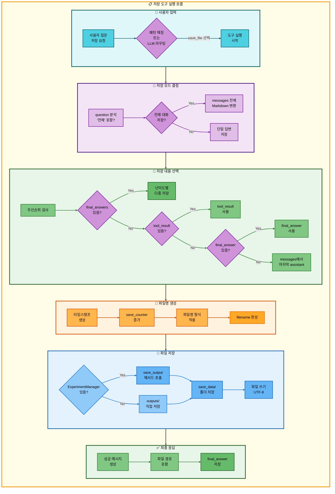

# 저장 도구 아키텍처

## 📋 문서 정보
- **작성일**: 2025-11-07
- **작성자**: 최현화[팀장]
- **프로젝트명**: 논문 리뷰 챗봇 (AI Agent + RAG)
- **팀명**: 연결의 민족
- **문서 버전**: 1.0

---

## 📑 목차
1. [도구 개요](#도구-개요)
2. [도구 실행 조건](#도구-실행-조건)
3. [도구 동작 (Fallback 없음)](#도구-동작-fallback-없음)
4. [단순 흐름 아키텍처](#단순-흐름-아키텍처)
5. [상세 기능 동작 흐름도](#상세-기능-동작-흐름도)
6. [동작 설명](#동작-설명)
7. [사용 예시](#사용-예시)
8. [핵심 포인트](#핵심-포인트)
9. [참고 정보](#참고-정보)

---

## 📌 도구 개요

### 목적과 역할

저장 도구는 이전 도구의 실행 결과를 로컬 파일 시스템에 Markdown 파일로 저장하는 최종 단계 도구입니다.

**핵심 역할:**
- 이전 도구 실행 결과를 파일로 영구 저장
- 타임스탬프 기반 자동 파일명 생성
- 세션별 저장 카운터 관리 (중복 방지)
- 전체 대화 저장 vs 단일 답변 저장 모드 지원
- 난이도별 다중 답변 저장 (final_answers)

**저장 대상 데이터:**
- **단일 답변**: 이전 도구의 실행 결과 (tool_result, final_answer, messages)
- **전체 대화**: 전체 대화 내역 (user/assistant 메시지 전체)
- **난이도별 답변**: 요약 도구의 다중 수준 답변 (elementary/beginner/intermediate/advanced)

**저장 위치:**
- **ExperimentManager 사용**: `experiments/<날짜>/<세션>/outputs/save_data/`
- **직접 저장**: `outputs/` (테스트 환경)

**저장 형식:**
- **파일 형식**: Markdown (.md)
- **파일명 패턴**: `{YYYYMMDD}_{HHMMSS}_response_{번호}.md`
- **난이도별 파일명**: `{YYYYMMDD}_{HHMMSS}_response_{번호}_{level}.md`
- **인코딩**: UTF-8

---

## 📋 도구 실행 조건

### 언제 실행되는가?

**1. 사용자가 명시적으로 저장을 요청할 때**

**1-1. 전체 대화 저장**
- "전체 저장해줘"
- "전체 대화 저장해줘"
- "전체 대화 내용 저장해줘"

**1-2. 단일 답변 저장**
- "저장해줘"
- "답변 저장해줘"
- "결과 저장해줘"

**2. 다중 요청의 마지막 단계로 실행**
- "논문 찾아서 저장해줘" → search_paper → save_file
- "Transformer 설명하고 저장해줘" → glossary → save_file
- "GPT 논문 요약해서 저장해줘" → search_paper → web_search → general → summarize → save_file

**3. 패턴 매칭 우선순위**

`configs/multi_request_patterns.yaml`에서 정의된 패턴 예시:

```yaml
# 전체 대화 저장 (최우선)
- keywords:
  - 전체
  - 저장
  tools:
  - save_file
  priority: 150
  description: 전체 대화 내용 저장

# 용어 정의 후 저장
- keywords:
  - 저장
  any_of_keywords:
  - 뭐야
  - 뭔데
  - 뭔지
  exclude_keywords:
  - 전체
  - 논문
  tools:
  - glossary
  - save_file
  priority: 140

# 논문 검색 후 저장
- keywords:
  - 논문
  - 찾
  - 저장
  exclude_keywords:
  - 요약
  tools:
  - search_paper
  - save_file
  priority: 110

# 논문 요약 후 저장
- keywords:
  - 논문
  - 요약
  - 저장
  tools:
  - search_paper
  - web_search
  - general
  - summarize
  - save_file
  priority: 100
```

**실행 조건 검증:**
- `keywords`에 `저장` 포함 → 저장 도구 활성화
- 파이프라인 마지막 단계로 `save_file` 배치
- 이전 도구(들)의 실행 결과를 `tool_result` 또는 `final_answer`로 전달받음

### 저장 모드 결정 로직

**파일**: `src/tools/save_file.py:34-39`

```python
# "전체"와 "저장" 키워드가 동시에 있으면 전체 대화 저장
is_full_save = "전체" in question and "저장" in question

if is_full_save and messages:
    # 전체 대화 저장 모드
else:
    # 단일 답변 저장 모드
```

---

## 🔄 도구 동작 (Fallback 없음)

### 저장 도구 흐름

```
사용자 저장 요청 (이전 단계의 결과 데이터 전달받음)
  ↓
저장 모드 결정
  ├─ 전체 대화 저장?
  │  ├─ Yes → messages 전체 Markdown 변환
  │  └─ No → 단일 답변 저장
  ↓
저장할 내용 우선순위 결정
  ├─ 1순위: final_answers (난이도별 다중 답변)
  ├─ 2순위: tool_result (파이프라인 결과)
  ├─ 3순위: final_answer (최종 답변)
  └─ 4순위: messages (마지막 assistant 메시지)
  ↓
파일명 생성
  └─ {YYYYMMDD}_{HHMMSS}_response_{번호}.md
  ↓
파일 저장 실행
  ├─ 성공 → "파일이 성공적으로 저장되었습니다.\n파일 경로: {경로}"
  └─ 실패 → Exception 발생 (현재 미처리)
  ↓
최종 답변 반환
  └─ state["final_answer"] = 성공 메시지
  ↓
END
```

### 저장 도구는 Fallback이 없음

**이유:**
1. **최종 단계 도구**: 저장 도구는 파이프라인의 마지막 단계로 실행됨
2. **필수 동작 아님**: 저장 실패는 시스템 오류이지 논리적 실패가 아님
3. **재시도 불필요**: 파일 저장 실패는 디스크 문제 또는 권한 문제이므로 Fallback으로 해결 불가

**실패 시 처리:**
- 현재 코드에는 Exception 처리 없음
- 실패 시 Python Exception 발생 → Streamlit UI에 표시
- 사용자에게 수동 저장 안내 (UI 레벨에서 처리)

---

## 🎨 단순 흐름 아키텍처



---

## 🔍 상세 기능 동작 흐름도

```mermaid
graph TB
    subgraph MainFlow["📋 저장 도구 상세 실행 흐름"]
        direction TB

        subgraph Init["🔸 초기화 & 라우팅"]
            direction LR
            A[main.py] --> B[ui/app.py<br/>initialize_agent]
            B --> C[src/agent/graph.py<br/>create_agent_graph]
            C --> D[src/agent/nodes.py<br/>router_node]
            D --> E{패턴 매칭}
            E -->|매칭 성공| F[multi_request_patterns.yaml<br/>priority: 150/110/100]
            E -->|매칭 실패| G[LLM 라우팅<br/>routing_prompts.json]
            F --> H[tool_choice =<br/>'save_file']
            G --> H
        end

        subgraph NodeExec["🔹 노드 실행"]
            direction LR
            I[src/tools/save_file.py<br/>save_file_node] --> J[state 추출<br/>question, messages]
            J --> K{ExperimentManager<br/>있음?}
            K -->|Yes| L[exp_manager.logger<br/>로깅 시작]
            K -->|No| M[로깅 생략]
        end

        subgraph ModeCheck["🔺 저장 모드 체크"]
            direction LR
            N[is_full_save =<br/>'전체' in question<br/>and '저장' in question] --> O{전체 대화<br/>저장?}
            O -->|Yes| P[messages 조회]
            O -->|No| Q[단일 답변<br/>모드]
        end

        subgraph FullSave["🔶 전체 대화 저장"]
            direction LR
            R[content_lines 초기화<br/>대화 내용 헤더] --> S[messages<br/>순회]
            S --> T[role 확인<br/>user/assistant]
            T --> U[헤더 생성<br/>🙋/🤖]
            U --> V[content_lines<br/>추가]
            V --> W[Markdown<br/>병합]
        end

        subgraph ContentPriority["💾 저장 내용 우선순위"]
            direction LR
            X{final_answers<br/>있음?} -->|Yes| Y[난이도별<br/>다중 파일 생성]
            X -->|No| Z{tool_result<br/>있음?}
            Z -->|Yes| AA[tool_result<br/>사용]
            Z -->|No| AB{final_answer<br/>있음?}
            AB -->|Yes| AC[final_answer<br/>사용]
            AB -->|No| AD[messages에서<br/>마지막 assistant]
        end

        subgraph MultiLevelSave["✨ 난이도별 다중 저장"]
            direction LR
            AE[save_counter<br/>증가] --> AF[타임스탬프<br/>생성]
            AF --> AG[level_labels<br/>정의]
            AG --> AH[final_answers<br/>순회]
            AH --> AI[filename 생성<br/>난이도별 파일명]
            AI --> AJ[exp_manager<br/>save_output 호출]
            AJ --> AK[saved_files<br/>리스트 추가]
        end

        subgraph FileNameGen["🔷 파일명 생성"]
            direction LR
            AL[datetime<br/>타임스탬프] --> AM[YYYYMMDD_HHMMSS<br/>포맷팅]
            AM --> AN[save_counter<br/>증가]
            AN --> AO[filename<br/>패턴 적용]
        end

        subgraph FileSaveProcess["💡 파일 저장 처리"]
            direction LR
            AP{ExperimentManager<br/>있음?} -->|Yes| AQ[exp_manager<br/>save_output 호출]
            AP -->|No| AR[outputs 폴더<br/>생성]
            AQ --> AS[outputs_dir /<br/>save_data/]
            AR --> AT[file_path<br/>생성]
            AS --> AU[파일 열기<br/>UTF-8]
            AT --> AU
            AU --> AV[파일 쓰기<br/>content]
        end

        subgraph SuccessMsg["✅ 성공 메시지"]
            direction LR
            AW{난이도별<br/>다중?} -->|Yes| AX[saved_files<br/>목록 구성]
            AW -->|No| AY[단일 파일<br/>경로]
            AX --> AZ[저장 완료<br/>메시지 + 목록]
            AY --> BA[저장 완료<br/>메시지 + 경로]
            AZ --> BB[state 업데이트<br/>final_answer]
            BA --> BB
        end

        subgraph Return["⚠️ 상태 반환"]
            direction LR
            BC[save_counter<br/>업데이트] --> BD[state 반환]
        end

        %% 단계 간 연결
        Init --> NodeExec
        NodeExec --> ModeCheck
        ModeCheck --> FullSave
        ModeCheck --> ContentPriority
        ContentPriority --> MultiLevelSave
        ContentPriority --> FileNameGen
        FileNameGen --> FileSaveProcess
        FileSaveProcess --> SuccessMsg
        SuccessMsg --> Return
    end

    %% 메인 워크플로우 배경
    style MainFlow fill:#fffde7,stroke:#f9a825,stroke-width:4px,color:#000

    %% Subgraph 스타일
    style Init fill:#e0f7fa,stroke:#006064,stroke-width:3px,color:#000
    style NodeExec fill:#e1f5ff,stroke:#01579b,stroke-width:3px,color:#000
    style ModeCheck fill:#f3e5f5,stroke:#4a148c,stroke-width:3px,color:#000
    style FullSave fill:#fff3e0,stroke:#e65100,stroke-width:3px,color:#000
    style ContentPriority fill:#e8f5e9,stroke:#1b5e20,stroke-width:3px,color:#000
    style MultiLevelSave fill:#e3f2fd,stroke:#1565c0,stroke-width:3px,color:#000
    style FileNameGen fill:#f3e5f5,stroke:#4a148c,stroke-width:3px,color:#000
    style FileSaveProcess fill:#fff3e0,stroke:#e65100,stroke-width:3px,color:#000
    style SuccessMsg fill:#e8f5e9,stroke:#1b5e20,stroke-width:3px,color:#000
    style Return fill:#ffebee,stroke:#c62828,stroke-width:3px,color:#000

    %% 노드 스타일 (초기화 - 청록 계열)
    style A fill:#4dd0e1,stroke:#006064,stroke-width:2px,color:#000
    style B fill:#4dd0e1,stroke:#006064,stroke-width:2px,color:#000
    style C fill:#4dd0e1,stroke:#006064,stroke-width:2px,color:#000
    style D fill:#4dd0e1,stroke:#006064,stroke-width:2px,color:#000
    style E fill:#ce93d8,stroke:#7b1fa2,stroke-width:2px,color:#000
    style F fill:#4dd0e1,stroke:#006064,stroke-width:2px,color:#000
    style G fill:#4dd0e1,stroke:#006064,stroke-width:2px,color:#000
    style H fill:#4dd0e1,stroke:#006064,stroke-width:2px,color:#000

    %% 노드 스타일 (노드 실행 - 파랑 계열)
    style I fill:#90caf9,stroke:#1976d2,stroke-width:2px,color:#000
    style J fill:#90caf9,stroke:#1976d2,stroke-width:2px,color:#000
    style K fill:#ce93d8,stroke:#7b1fa2,stroke-width:2px,color:#000
    style L fill:#90caf9,stroke:#1976d2,stroke-width:2px,color:#000
    style M fill:#90caf9,stroke:#1976d2,stroke-width:2px,color:#000

    %% 노드 스타일 (모드 체크 - 보라 계열)
    style N fill:#e1bee7,stroke:#7b1fa2,stroke-width:2px,color:#000
    style O fill:#ce93d8,stroke:#6a1b9a,stroke-width:2px,color:#000
    style P fill:#e1bee7,stroke:#7b1fa2,stroke-width:2px,color:#000
    style Q fill:#e1bee7,stroke:#7b1fa2,stroke-width:2px,color:#000

    %% 노드 스타일 (전체 저장 - 주황 계열)
    style R fill:#ffb74d,stroke:#e65100,stroke-width:2px,color:#000
    style S fill:#ffb74d,stroke:#e65100,stroke-width:2px,color:#000
    style T fill:#ffb74d,stroke:#e65100,stroke-width:2px,color:#000
    style U fill:#ffa726,stroke:#ef6c00,stroke-width:2px,color:#000
    style V fill:#ffb74d,stroke:#e65100,stroke-width:2px,color:#000
    style W fill:#ffa726,stroke:#ef6c00,stroke-width:2px,color:#000

    %% 노드 스타일 (내용 우선순위 - 녹색 계열)
    style X fill:#ce93d8,stroke:#7b1fa2,stroke-width:2px,color:#000
    style Y fill:#66bb6a,stroke:#1b5e20,stroke-width:2px,color:#000
    style Z fill:#ce93d8,stroke:#7b1fa2,stroke-width:2px,color:#000
    style AA fill:#81c784,stroke:#2e7d32,stroke-width:2px,color:#000
    style AB fill:#ce93d8,stroke:#7b1fa2,stroke-width:2px,color:#000
    style AC fill:#81c784,stroke:#2e7d32,stroke-width:2px,color:#000
    style AD fill:#81c784,stroke:#2e7d32,stroke-width:2px,color:#000

    %% 노드 스타일 (다중 저장 - 파랑 계열)
    style AE fill:#90caf9,stroke:#1976d2,stroke-width:2px,color:#000
    style AF fill:#90caf9,stroke:#1976d2,stroke-width:2px,color:#000
    style AG fill:#90caf9,stroke:#1976d2,stroke-width:2px,color:#000
    style AH fill:#90caf9,stroke:#1976d2,stroke-width:2px,color:#000
    style AI fill:#64b5f6,stroke:#1565c0,stroke-width:2px,color:#000
    style AJ fill:#64b5f6,stroke:#1565c0,stroke-width:2px,color:#000
    style AK fill:#90caf9,stroke:#1976d2,stroke-width:2px,color:#000

    %% 노드 스타일 (파일명 생성 - 보라 계열)
    style AL fill:#e1bee7,stroke:#7b1fa2,stroke-width:2px,color:#000
    style AM fill:#e1bee7,stroke:#7b1fa2,stroke-width:2px,color:#000
    style AN fill:#e1bee7,stroke:#7b1fa2,stroke-width:2px,color:#000
    style AO fill:#ce93d8,stroke:#6a1b9a,stroke-width:2px,color:#000

    %% 노드 스타일 (파일 저장 - 주황 계열)
    style AP fill:#ce93d8,stroke:#7b1fa2,stroke-width:2px,color:#000
    style AQ fill:#ffb74d,stroke:#e65100,stroke-width:2px,color:#000
    style AR fill:#ffb74d,stroke:#e65100,stroke-width:2px,color:#000
    style AS fill:#ffa726,stroke:#ef6c00,stroke-width:2px,color:#000
    style AT fill:#ffb74d,stroke:#e65100,stroke-width:2px,color:#000
    style AU fill:#ffa726,stroke:#ef6c00,stroke-width:2px,color:#000
    style AV fill:#ffa726,stroke:#ef6c00,stroke-width:2px,color:#000

    %% 노드 스타일 (성공 메시지 - 녹색 계열)
    style AW fill:#ce93d8,stroke:#7b1fa2,stroke-width:2px,color:#000
    style AX fill:#81c784,stroke:#2e7d32,stroke-width:2px,color:#000
    style AY fill:#81c784,stroke:#2e7d32,stroke-width:2px,color:#000
    style AZ fill:#66bb6a,stroke:#1b5e20,stroke-width:2px,color:#000
    style BA fill:#66bb6a,stroke:#1b5e20,stroke-width:2px,color:#000
    style BB fill:#66bb6a,stroke:#1b5e20,stroke-width:2px,color:#000

    %% 노드 스타일 (상태 반환 - 빨강 계열)
    style BC fill:#ef9a9a,stroke:#c62828,stroke-width:2px,color:#000
    style BD fill:#ef9a9a,stroke:#c62828,stroke-width:2px,color:#000

    %% 연결선 스타일 (초기화 - 청록 0~7)
    linkStyle 0 stroke:#006064,stroke-width:2px
    linkStyle 1 stroke:#006064,stroke-width:2px
    linkStyle 2 stroke:#006064,stroke-width:2px
    linkStyle 3 stroke:#006064,stroke-width:2px
    linkStyle 4 stroke:#006064,stroke-width:2px
    linkStyle 5 stroke:#006064,stroke-width:2px
    linkStyle 6 stroke:#006064,stroke-width:2px

    %% 연결선 스타일 (노드 실행 - 파랑 8~11)
    linkStyle 7 stroke:#1976d2,stroke-width:2px
    linkStyle 8 stroke:#1976d2,stroke-width:2px
    linkStyle 9 stroke:#1976d2,stroke-width:2px
    linkStyle 10 stroke:#1976d2,stroke-width:2px

    %% 연결선 스타일 (모드 체크 - 보라 12~14)
    linkStyle 11 stroke:#7b1fa2,stroke-width:2px
    linkStyle 12 stroke:#7b1fa2,stroke-width:2px
    linkStyle 13 stroke:#7b1fa2,stroke-width:2px

    %% 연결선 스타일 (전체 저장 - 주황 15~20)
    linkStyle 14 stroke:#e65100,stroke-width:2px
    linkStyle 15 stroke:#e65100,stroke-width:2px
    linkStyle 16 stroke:#e65100,stroke-width:2px
    linkStyle 17 stroke:#e65100,stroke-width:2px
    linkStyle 18 stroke:#e65100,stroke-width:2px
    linkStyle 19 stroke:#e65100,stroke-width:2px

    %% 연결선 스타일 (내용 우선순위 - 녹색 21~27)
    linkStyle 20 stroke:#2e7d32,stroke-width:2px
    linkStyle 21 stroke:#2e7d32,stroke-width:2px
    linkStyle 22 stroke:#2e7d32,stroke-width:2px
    linkStyle 23 stroke:#2e7d32,stroke-width:2px
    linkStyle 24 stroke:#2e7d32,stroke-width:2px
    linkStyle 25 stroke:#2e7d32,stroke-width:2px
    linkStyle 26 stroke:#2e7d32,stroke-width:2px

    %% 연결선 스타일 (다중 저장 - 파랑 28~33)
    linkStyle 27 stroke:#1976d2,stroke-width:2px
    linkStyle 28 stroke:#1976d2,stroke-width:2px
    linkStyle 29 stroke:#1976d2,stroke-width:2px
    linkStyle 30 stroke:#1976d2,stroke-width:2px
    linkStyle 31 stroke:#1976d2,stroke-width:2px
    linkStyle 32 stroke:#1976d2,stroke-width:2px

    %% 연결선 스타일 (파일명 생성 - 보라 34~36)
    linkStyle 33 stroke:#7b1fa2,stroke-width:2px
    linkStyle 34 stroke:#7b1fa2,stroke-width:2px
    linkStyle 35 stroke:#7b1fa2,stroke-width:2px

    %% 연결선 스타일 (파일 저장 - 주황 37~43)
    linkStyle 36 stroke:#e65100,stroke-width:2px
    linkStyle 37 stroke:#e65100,stroke-width:2px
    linkStyle 38 stroke:#e65100,stroke-width:2px
    linkStyle 39 stroke:#e65100,stroke-width:2px
    linkStyle 40 stroke:#e65100,stroke-width:2px
    linkStyle 41 stroke:#e65100,stroke-width:2px
    linkStyle 42 stroke:#e65100,stroke-width:2px

    %% 연결선 스타일 (성공 메시지 - 녹색 44~49)
    linkStyle 43 stroke:#2e7d32,stroke-width:2px
    linkStyle 44 stroke:#2e7d32,stroke-width:2px
    linkStyle 45 stroke:#2e7d32,stroke-width:2px
    linkStyle 46 stroke:#2e7d32,stroke-width:2px
    linkStyle 47 stroke:#2e7d32,stroke-width:2px
    linkStyle 48 stroke:#2e7d32,stroke-width:2px

    %% 연결선 스타일 (상태 반환 - 빨강 50)
    linkStyle 49 stroke:#c62828,stroke-width:2px

    %% 단계 간 연결 (회색 51~58)
    linkStyle 50 stroke:#616161,stroke-width:3px
    linkStyle 51 stroke:#616161,stroke-width:3px
    linkStyle 52 stroke:#616161,stroke-width:3px
    linkStyle 53 stroke:#616161,stroke-width:3px
    linkStyle 54 stroke:#616161,stroke-width:3px
    linkStyle 55 stroke:#616161,stroke-width:3px
    linkStyle 56 stroke:#616161,stroke-width:3px
    linkStyle 57 stroke:#616161,stroke-width:3px
```



---

### 전체 흐름 요약 표

| 단계 | 파일명 | 메서드명 | 동작 설명 | 입력 | 출력 | 파일 시스템 사용 |
|------|--------|----------|-----------|------|------|------------------|
| 1 | `main.py` | - | Streamlit 서버 시작 | - | - | 없음 |
| 2 | `ui/app.py` | `initialize_agent()` | Agent 그래프 초기화 | - | agent_executor | 없음 |
| 3 | `src/agent/graph.py` | `create_agent_graph()` | LangGraph 상태 머신 생성 | exp_manager | CompiledGraph | 없음 |
| 4 | `src/agent/nodes.py` | `router_node()` | 질문 분석 및 도구 선택 | state (question) | state (tool_choice) | 없음 |
| 5 | `configs/multi_request_patterns.yaml` | - | 패턴 매칭 (우선순위 150/110/100) | question | tool_pipeline | 없음 |
| 6 | `src/tools/save_file.py` | `save_file_node()` | 파일 저장 노드 실행 | state (question, messages, final_answer) | state (final_answer) | outputs/save_data/ |
| 7 | `src/tools/save_file.py` | - | 저장 모드 결정 | question | is_full_save (bool) | 없음 |
| 8 | `src/tools/save_file.py` | - | 전체 대화 저장 (전체 모드) | messages | content_to_save | 없음 |
| 9 | `src/tools/save_file.py` | - | final_answers 확인 (단일 모드) | state["final_answers"] | 난이도별 저장 여부 | 없음 |
| 10 | `src/tools/save_file.py` | - | 저장 내용 우선순위 결정 | tool_result, final_answer, messages | content_to_save | 없음 |
| 11 | `src/tools/save_file.py` | - | save_counter 증가 | state["save_counter"] | save_counter + 1 | 없음 |
| 12 | `datetime` | `now().strftime()` | 타임스탬프 생성 | - | YYYYMMDD_HHMMSS | 없음 |
| 13 | `src/tools/save_file.py` | - | 파일명 생성 | timestamp, save_counter | filename | 없음 |
| 14 | `src/utils/experiment_manager.py` | `save_output()` | 파일 저장 (ExperimentManager) | filename, content | file_path | outputs/save_data/{filename} |
| 15 | `os` | `makedirs()` | 출력 디렉토리 생성 (직접 저장) | output_dir | - | outputs/ |
| 16 | `os.path` | `join()` | 파일 경로 생성 (직접 저장) | output_dir, filename | file_path | 없음 |
| 17 | `builtins` | `open()` | 파일 열기 (쓰기 모드) | file_path, mode='w', encoding='utf-8' | file object | {file_path} |
| 18 | `file.write()` | - | 파일 내용 쓰기 | content_to_save | - | {file_path} (WRITE) |
| 19 | `src/tools/save_file.py` | - | 성공 메시지 구성 | file_path | answer | 없음 |
| 20 | `src/tools/save_file.py` | - | state 업데이트 | answer, save_counter | state["final_answer"] | 없음 |
| 21 | `src/tools/save_file.py` | - | 상태 반환 | state | updated state | 없음 |

---

## 📝 동작 설명

### 저장 프로세스 상세 설명

#### 1단계: 저장 모드 결정

**목적**: 전체 대화를 저장할지, 단일 답변만 저장할지 결정

**파일**: `src/tools/save_file.py:34-39`

**로직**:
```python
is_full_save = "전체" in question and "저장" in question

if is_full_save and messages:
    # 전체 대화 저장 모드
else:
    # 단일 답변 저장 모드
```

**전체 대화 저장 조건**:
1. 사용자 질문에 `"전체"` 키워드 포함
2. 사용자 질문에 `"저장"` 키워드 포함
3. `state["messages"]`에 대화 내역 존재

**전체 대화 Markdown 형식** (`src/tools/save_file.py:44-64`):
```markdown
# 대화 내용

## [1] 🙋 사용자

Transformer 논문 요약해줘

## [2] 🤖 AI

Transformer 논문 요약 결과입니다...

## [3] 🙋 사용자

저장해줘

## [4] 🤖 AI

파일이 성공적으로 저장되었습니다...
```

#### 2단계: 저장 내용 우선순위 결정

**목적**: 어떤 데이터를 저장할지 우선순위에 따라 결정

**파일**: `src/tools/save_file.py:66-150`

**우선순위**:

| 순위 | 데이터 출처 | 설명 | 사용 시나리오 |
|------|-------------|------|---------------|
| **0순위** | `final_answers` (dict) | 난이도별 다중 답변 | 요약 도구 실행 후 저장 |
| **1순위** | `tool_result` | 파이프라인 실행 결과 | 다중 요청 파이프라인 |
| **2순위** | `final_answer` | 최종 답변 | 단일 도구 실행 |
| **3순위** | `messages` | 마지막 assistant 메시지 | 대화 이력에서 추출 |

**0순위: final_answers (난이도별 다중 저장)**

**조건**: `final_answers`가 dict이고 비어있지 않을 때

**동작** (`src/tools/save_file.py:69-116`):
```python
final_answers = state.get("final_answers", {})
if final_answers and isinstance(final_answers, dict) and len(final_answers) > 0:
    # 난이도별로 각각 별도 파일 저장
    for level, content in final_answers.items():
        filename = f"{timestamp}_response_{save_counter}_{level}.md"
        file_path = exp_manager.save_output(filename, content)
        saved_files.append(f"- {level_labels.get(level, level)}: {file_path}")

    answer = f"난이도별 답변이 각각 저장되었습니다.\n저장된 파일:\n" + "\n".join(saved_files)
```

**생성되는 파일 예시**:
- `20251107_153000_response_1_elementary.md`
- `20251107_153000_response_1_beginner.md`
- `20251107_153000_response_1_intermediate.md`
- `20251107_153000_response_1_advanced.md`

**1순위: tool_result**

**조건**: 파이프라인 모드에서 이전 도구의 결과가 있을 때

**예시 시나리오**:
- "GPT 논문 찾아서 저장해줘" → search_paper → save_file
- `tool_result`에 search_paper의 검색 결과 저장

**2순위: final_answer**

**조건**: 단일 도구 실행 후 최종 답변이 있을 때

**3순위: messages**

**조건**: 위 모든 출처에서 데이터를 찾지 못했을 때

**동작** (`src/tools/save_file.py:135-143`):
```python
if not content_to_save and messages:
    for msg in reversed(messages):
        if msg.get("role") == "assistant":
            content = msg.get("content", "")
            if content.strip():
                content_to_save = content
                break
```

#### 3단계: 파일명 생성

**목적**: 타임스탬프와 카운터를 사용하여 고유한 파일명 생성

**파일**: `src/tools/save_file.py:154-162`

**파일명 패턴**:
```
{YYYYMMDD}_{HHMMSS}_response_{번호}.md
```

**예시**:
- `20251107_153045_response_1.md`
- `20251107_153120_response_2.md`
- `20251107_153200_response_3.md`

**save_counter 관리**:
```python
save_counter = state.get("save_counter", 0) + 1
state["save_counter"] = save_counter
```

- 세션별로 누적 카운터
- 0부터 시작하여 매 저장마다 +1
- 같은 세션 내에서 중복 방지

#### 4단계: 파일 저장 실행

**목적**: 생성된 내용을 실제 파일 시스템에 저장

**파일**: `src/tools/save_file.py:167-188`

**ExperimentManager 사용** (기본):
```python
if exp_manager:
    file_path = exp_manager.save_output(filename, content_to_save)
```

**저장 경로**: `experiments/{날짜}/{세션}/outputs/save_data/{filename}`

**예시**:
```
experiments/20251107/20251107_153000_session_001/outputs/save_data/20251107_153045_response_1.md
```

**직접 저장** (테스트 환경):
```python
else:
    output_dir = "outputs"
    os.makedirs(output_dir, exist_ok=True)
    file_path = os.path.join(output_dir, filename)
    with open(file_path, 'w', encoding='utf-8') as f:
        f.write(content_to_save)
```

**저장 경로**: `outputs/{filename}`

#### 5단계: 성공 메시지 반환

**목적**: 사용자에게 저장 완료를 알림

**파일**: `src/tools/save_file.py:174-191`

**단일 파일 저장**:
```
파일이 성공적으로 저장되었습니다.
파일 경로: experiments/.../outputs/save_data/20251107_153045_response_1.md
```

**난이도별 다중 저장**:
```
난이도별 답변이 각각 저장되었습니다.
저장된 파일:
- 초급자용(14-22세): experiments/.../20251107_153000_response_1_beginner.md
- 중급자용(23-30세): experiments/.../20251107_153000_response_1_intermediate.md
```

### 저장 구조 (파일 시스템)

#### ExperimentManager 폴더 구조

```
experiments/
└── 20251107/                          # 날짜별 폴더
    └── 20251107_153000_session_001/   # 세션별 폴더
        ├── metadata.json              # 세션 메타데이터
        ├── chatbot.log                # 전체 로그
        ├── tools/                     # 도구별 로그
        ├── database/                  # DB 쿼리 기록
        ├── prompts/                   # 프롬프트 기록
        ├── ui/                        # UI 이벤트
        ├── evaluation/                # 평가 지표
        └── outputs/                   # 결과물
            ├── save_data/             # save_file 도구로 저장된 파일
            │   ├── 20251107_153045_response_1.md
            │   ├── 20251107_153120_response_2.md
            │   └── 20251107_153200_response_3_beginner.md
            └── summary/               # summarize 도구의 요약 결과
                └── Attention_Is_All_You_Need.md
```

#### save_data 폴더 자동 생성

**파일**: `src/utils/experiment_manager.py:455-462`

```python
def save_output(self, filename: str, content: str):
    # save_file 도구를 통한 저장인 경우 save_data 하위 폴더에 저장
    if filename.endswith('.md') and '_' in filename:
        save_data_dir = self.outputs_dir / "save_data"
        save_data_dir.mkdir(parents=True, exist_ok=True)
        output_path = save_data_dir / filename
    else:
        output_path = self.outputs_dir / filename
```

**자동 폴더 생성 조건**:
- 파일명이 `.md`로 끝남
- 파일명에 `_`가 포함됨 (타임스탬프 패턴)

### 데이터 무결성 보장 방법

#### 1. 세션별 카운터 관리

**문제**: 같은 세션에서 여러 번 저장 시 파일명 중복 가능

**해결**: `state["save_counter"]`로 세션별 누적 카운터 관리

```python
save_counter = state.get("save_counter", 0) + 1
state["save_counter"] = save_counter
```

**효과**:
- 같은 타임스탬프여도 카운터로 구분
- 세션 내에서 고유성 보장

#### 2. 타임스탬프 기반 파일명

**문제**: 다른 세션에서 파일명 중복 가능

**해결**: 타임스탬프 (초 단위) 포함

```python
timestamp = datetime.now().strftime("%Y%m%d_%H%M%S")
filename = f"{timestamp}_response_{save_counter}.md"
```

**효과**:
- 초 단위 정밀도로 중복 확률 극히 낮음
- 다른 세션 간 구분 가능

#### 3. 폴더 자동 생성

**문제**: 폴더가 없으면 저장 실패

**해결**: `mkdir(parents=True, exist_ok=True)`

```python
save_data_dir.mkdir(parents=True, exist_ok=True)
os.makedirs(output_dir, exist_ok=True)
```

**효과**:
- 폴더가 없어도 자동 생성
- 이미 있어도 오류 발생 안 함

#### 4. UTF-8 인코딩

**문제**: 한글 등 유니코드 문자 깨짐 가능

**해결**: 명시적 UTF-8 인코딩

```python
with open(file_path, 'w', encoding='utf-8') as f:
    f.write(content_to_save)
```

**효과**:
- 모든 언어 문자 정상 저장
- 크로스 플랫폼 호환성

---

## 💡 사용 예시

### 예시 1: 단일 답변 저장

**사용자 질문:**
```
GPT 논문 찾아서 저장해줘
```

**실행 흐름:**

1. **패턴 매칭**: `keywords: [논문, 찾, 저장]` → tool_pipeline
   ```python
   tool_pipeline = ["search_paper", "save_file"]
   ```
2. **search_paper 실행**:
   - pgvector 검색: "GPT" 관련 논문 5편 조회
   - 검색 결과를 `tool_result`에 저장
   ```
   1. Improving Language Understanding by Generative Pre-Training (Radford et al., 2018)
      - GPT-1 모델 제안
      - Transformer decoder 기반
      - 비지도 사전 학습 + 지도 미세 조정
      ...
   ```
3. **save_file 실행**:
   - 저장 모드 결정: `is_full_save = False` (단일 답변)
   - 저장 내용 선택: `tool_result` 사용 (1순위)
   - save_counter 증가: `1`
   - 타임스탬프 생성: `20251107_153045`
   - 파일명 생성: `20251107_153045_response_1.md`
4. **파일 저장** (ExperimentManager):
   ```
   experiments/20251107/20251107_150000_session_001/outputs/save_data/20251107_153045_response_1.md
   ```
5. **저장 내용**:
   ```markdown
   1. Improving Language Understanding by Generative Pre-Training (Radford et al., 2018)
      - GPT-1 모델 제안
      - Transformer decoder 기반
      - 비지도 사전 학습 + 지도 미세 조정
      - BookCorpus 데이터셋 사용
      - 다양한 NLP 태스크에서 SOTA 달성

   2. Language Models are Unsupervised Multitask Learners (Radford et al., 2019)
      - GPT-2 모델 제안
      - 15억 파라미터
      - WebText 데이터셋 (40GB)
      - Zero-shot 성능 향상
      ...
   ```
6. **최종 답변**:
   ```
   파일이 성공적으로 저장되었습니다.
   파일 경로: experiments/20251107/20251107_150000_session_001/outputs/save_data/20251107_153045_response_1.md
   ```

### 예시 2: 난이도별 다중 저장

**사용자 질문:**
```
Transformer 논문 요약해서 저장해줘
```

**실행 흐름:**

1. **패턴 매칭**: `keywords: [논문, 요약, 저장]` → tool_pipeline
   ```python
   tool_pipeline = ["search_paper", "web_search", "general", "summarize", "save_file"]
   ```
2. **summarize 실행**:
   - 논문 제목 추출: "Attention Is All You Need"
   - PostgreSQL 검색: 논문 발견
   - pgvector 청크 조회: 48개 청크
   - 난이도별 요약 생성 (easy 모드):
     - `final_answers["elementary"]`: 초등학생용 요약
     - `final_answers["beginner"]`: 초급자용 요약
3. **save_file 실행**:
   - 저장 모드 결정: `is_full_save = False`
   - 저장 내용 선택: `final_answers` 발견 (0순위)
   - save_counter 증가: `2`
   - 타임스탬프 생성: `20251107_153200`
   - 난이도별 파일명 생성:
     - `20251107_153200_response_2_elementary.md`
     - `20251107_153200_response_2_beginner.md`
4. **파일 저장** (2개 파일):
   - `experiments/.../outputs/save_data/20251107_153200_response_2_elementary.md`
   - `experiments/.../outputs/save_data/20251107_153200_response_2_beginner.md`
5. **최종 답변**:
   ```
   난이도별 답변이 각각 저장되었습니다.
   저장된 파일:
   - 초등학생용(8-13세): experiments/.../20251107_153200_response_2_elementary.md
   - 초급자용(14-22세): experiments/.../20251107_153200_response_2_beginner.md
   ```

### 예시 3: 전체 대화 저장

**사용자 질문:**
```
전체 대화 저장해줘
```

**실행 흐름:**

1. **패턴 매칭**: `keywords: [전체, 저장]` → save_file 단일 실행
   ```python
   tool_pipeline = ["save_file"]
   ```
2. **save_file 실행**:
   - 저장 모드 결정: `is_full_save = True` (전체 대화)
   - messages 전체 조회:
     ```python
     messages = [
         {"role": "user", "content": "Transformer 논문 요약해줘"},
         {"role": "assistant", "content": "Transformer 논문 요약 결과..."},
         {"role": "user", "content": "저장해줘"},
         {"role": "assistant", "content": "파일이 성공적으로 저장되었습니다..."},
         {"role": "user", "content": "전체 대화 저장해줘"}
     ]
     ```
   - Markdown 변환:
     ```markdown
     # 대화 내용

     ## [1] 🙋 사용자

     Transformer 논문 요약해줘

     ## [2] 🤖 AI

     Transformer 논문 요약 결과...

     ## [3] 🙋 사용자

     저장해줘

     ## [4] 🤖 AI

     파일이 성공적으로 저장되었습니다...

     ## [5] 🙋 사용자

     전체 대화 저장해줘
     ```
   - save_counter 증가: `3`
   - 파일명 생성: `20251107_153300_response_3.md`
3. **파일 저장**:
   ```
   experiments/.../outputs/save_data/20251107_153300_response_3.md
   ```
4. **최종 답변**:
   ```
   파일이 성공적으로 저장되었습니다.
   파일 경로: experiments/.../20251107_153300_response_3.md
   ```

---

## 🔍 핵심 포인트

### 1. 저장 도구는 최종 단계 도구

**특징**:
- 파이프라인의 마지막에 위치
- Fallback 없음 (저장 실패는 시스템 오류)
- 이전 도구의 결과를 영구 보존

**장점**:
- 다중 요청의 모든 결과를 파일로 저장
- 세션 종료 후에도 결과 조회 가능
- 실험 재현성 향상

### 2. 우선순위 기반 저장 내용 선택

**4단계 우선순위**:
1. **final_answers**: 난이도별 다중 답변 (요약 도구)
2. **tool_result**: 파이프라인 실행 결과
3. **final_answer**: 최종 답변
4. **messages**: 대화 이력

**왜 중요한가?**
- 가장 풍부한 정보부터 우선 저장
- 데이터 손실 방지
- 사용자 의도에 맞는 저장

### 3. 세션별 카운터 + 타임스탬프

**파일명 중복 방지**:
- **타임스탬프**: 다른 세션 간 구분
- **save_counter**: 같은 세션 내 구분

**예시**:
```
20251107_153000_response_1.md  # 세션 1, 첫 번째 저장
20251107_153045_response_2.md  # 세션 1, 두 번째 저장
20251107_160000_response_1.md  # 세션 2, 첫 번째 저장
```

### 4. ExperimentManager 통합

**자동 폴더 관리**:
- `outputs/save_data/` 자동 생성
- 세션별 폴더 구조 유지
- 실험 추적 용이

**실험 재현성**:
- 모든 저장 파일이 세션별로 관리됨
- metadata.json과 연동
- 실험 결과 체계적 보관

---

## 📚 참고 정보

### 주요 파일 및 위치

- **도구 구현**: `src/tools/save_file.py`
- **ExperimentManager**: `src/utils/experiment_manager.py` > `save_output()`
- **패턴 설정**: `configs/multi_request_patterns.yaml` (priority: 150/140/110/100...)
- **출력 폴더**: `experiments/{날짜}/{세션}/outputs/save_data/`

### 관련 기술 스택

- **파이썬 표준 라이브러리**:
  - `datetime`: 타임스탬프 생성
  - `os`: 파일 시스템 조작
  - `pathlib`: 경로 관리
- **LangGraph**: 상태 머신 기반 워크플로우
- **파일 시스템**: 로컬 디스크 저장

### 저장 성능 고려사항

| 항목 | 값 | 설명 |
|------|------|------|
| **파일 형식** | Markdown (.md) | 가독성 우수, 버전 관리 용이 |
| **인코딩** | UTF-8 | 모든 언어 지원, 범용성 |
| **파일명 패턴** | 타임스탬프_response_번호 | 중복 방지, 정렬 용이 |
| **폴더 구조** | 세션별 분리 | 실험 추적, 재현성 |
| **저장 속도** | 즉시 (< 10ms) | 로컬 파일 시스템 I/O |

### 제약 사항

1. **DB 저장 없음**: 파일 시스템에만 저장 (DB에는 미저장)
2. **클라우드 저장 미지원**: 로컬 파일 시스템만 지원 (S3, GCS 등 미지원)
3. **저장 실패 처리 부족**: 현재 Exception 처리 없음 (향후 개선 필요)
4. **파일 크기 제한 없음**: 매우 큰 답변도 저장 (디스크 공간 고려)

### 개선 방향

1. **Exception 처리 추가**: 저장 실패 시 명확한 오류 메시지
2. **클라우드 저장 지원**: S3, GCS, Azure Blob 등 클라우드 스토리지
3. **DB 저장 옵션**: PostgreSQL에 저장 내용 백업
4. **파일 압축**: 큰 파일 자동 압축 (gzip)
5. **저장 이력 관리**: 저장 파일 메타데이터 DB 기록

---

**작성일**: 2025-11-07
**버전**: 1.0
