# 일반 답변 도구 아키텍처

## 📋 문서 정보
- **작성일**: 2025-11-07
- **작성자**: 최현화[팀장]
- **프로젝트명**: 논문 리뷰 챗봇 (AI Agent + RAG)
- **팀명**: 연결의 민족
- **문서 버전**: 1.0

---

## 📑 목차
1. [도구 개요](#도구-개요)
2. [도구 실행 조건](#도구-실행-조건)
3. [도구 동작 (Fallback의 최종 단계)](#도구-동작-fallback의-최종-단계)
4. [단순 흐름 아키텍처](#단순-흐름-아키텍처)
5. [상세 기능 동작 흐름도](#상세-기능-동작-흐름도)
6. [동작 설명](#동작-설명)
7. [사용 예시](#사용-예시)
8. [핵심 포인트](#핵심-포인트)
9. [참고 정보](#참고-정보)

---

## 📌 도구 개요

### 목적과 역할

일반 답변 도구는 LLM의 자체 지식으로 직접 답변을 생성하는 범용 답변 도구이자 **모든 다른 도구의 Fallback 최종 단계**입니다.

**핵심 역할:**
- LLM의 사전 학습 지식으로 직접 답변 생성
- 다른 모든 도구 실패 시 최종 Fallback으로 동작
- 데이터베이스 없이 순수 LLM 답변 생성
- 난이도별 2단계 답변 생성 (elementary+beginner / intermediate+advanced)

**실행 경로:**
1. **직접 실행**: 특별한 도구가 필요없는 일반 질문 (예: "안녕", "추천해줘")
2. **Fallback 실행**: 다른 도구 실패 시 자동 전환 (예: RAG 용어집 검색 실패 → 일반 답변으로 용어 설명)

**특징:**
- **외부 데이터 없음**: 데이터베이스, 웹 검색 없이 LLM 지식만 사용
- **범용성**: 모든 종류의 질문에 답변 가능
- **최종 Fallback**: 이 도구 이후 Fallback 없음 (반드시 답변 생성)
- **난이도 지원**: easy/hard 모드에 따라 2개 수준 답변 생성

**사용 LLM:**
- **easy 모드**: GPT-4o-mini
- **hard 모드**: GPT-4o

---

## 📋 도구 실행 조건

### 언제 실행되는가?

**경로 1: 직접 실행 (단순 질문)**

사용자 질문이 특별한 도구를 필요로 하지 않는 일반적인 대화나 질문일 때:

- "안녕"
- "날씨 어때?"
- "점심 뭐 먹을까?"
- "GPT 추천해줘"
- "왜 딥러닝을 사용하는거야?"

**조건:**
- 패턴 매칭에 실패 (multi_request_patterns.yaml에 매칭되는 패턴 없음)
- LLM 라우팅에서 `general` 도구 선택

**패턴 매칭 예시** (`configs/multi_request_patterns.yaml:42-66`):
```yaml
# 간단한 이유 질문 패턴
- keywords:
  - 왜
  any_of_keywords:
  - 쓰는거야
  - 사용하는거야
  - 사용하는지
  - 알고싶어
  - 하는거야
  - 하는지
  - 쓰는지
  exclude_keywords:
  - 논문
  - 검색
  - 찾아
  - 저장
  tools:
  - general
  priority: 150
```

**경로 2: Fallback 실행 (다른 도구 실패 시)**

다른 도구가 실패했을 때 자동으로 전환되어 실행:

| 실패한 도구 | Fallback 순서 | 일반 답변 도구의 역할 |
|-------------|---------------|----------------------|
| **RAG 용어집 검색** | glossary → **general** | 용어집에 없는 용어를 LLM 지식으로 설명 |
| **RAG 논문 검색** | search_paper → web_search → **general** | 데이터베이스에 없는 논문을 LLM 지식으로 설명 |
| **Web 논문 검색** | web_search → **general** | 웹에서도 찾지 못한 정보를 LLM 지식으로 답변 |
| **Text2SQL** | text2sql → search_paper → web_search → **general** | 통계 조회 실패 시 LLM 지식으로 답변 |
| **논문 요약** | search_paper → web_search → **general** → summarize | 논문을 찾지 못했을 때 LLM 지식으로 설명 후 요약 |

**Fallback 동작 조건** (`src/agent/config_loader.py`):
```python
priority_chain = {
    "glossary": ["general"],
    "search_paper": ["web_search", "general"],
    "web_search": ["general"],
    "text2sql": ["search_paper", "web_search", "general"],
    "summarize": []  # 최종 도구, Fallback 없음
}
```

**경로 2 상세 예시:**

1. **용어집 Fallback**: "xyz 용어 설명해줘" (용어집에 없는 용어)
   - glossary 실행 → 용어집에서 찾지 못함 → general로 Fallback → LLM이 직접 설명

2. **논문 검색 Fallback**: "abc 논문 찾아줘" (DB에 없는 논문)
   - search_paper 실행 → DB에서 찾지 못함 → web_search로 Fallback → 웹에서도 못 찾음 → general로 Fallback → LLM이 직접 설명

3. **통계 조회 Fallback**: "2030년 논문 몇 개?" (미래 데이터 조회 불가)
   - text2sql 실행 → 조회 실패 → search_paper → web_search → general로 Fallback → LLM이 "미래 데이터는 조회할 수 없습니다" 답변

### 패턴 매칭 vs LLM 라우팅

**패턴 매칭 우선 시도** (`src/agent/nodes.py:75-120`):
- `multi_request_patterns.yaml`에서 우선순위 순서로 패턴 검사
- 모든 `keywords` AND 조건 + `any_of_keywords` OR 조건 + `exclude_keywords` NOT 조건
- 매칭 성공 시 `tool_pipeline` 구성

**LLM 라우팅** (패턴 매칭 실패 시):
- `prompts/routing_prompts.json` 프롬프트 사용
- LLM이 도구 선택 (search_paper, glossary, general, web_search, text2sql, summarize 중 선택)
- 일반 질문은 대부분 `general` 선택

---

## 🔄 도구 동작 (Fallback의 최종 단계)

### 실행 흐름

**경로 1: 직접 실행**

```
사용자 일반 질문
  ↓
패턴 매칭 실패 (또는 general 패턴 매칭 성공)
  ↓
LLM 라우팅 → general 선택
  ↓
일반 답변 도구 실행
  ↓
난이도별 프롬프트 로드
  ↓
LLM 호출 (2회: elementary+beginner 또는 intermediate+advanced)
  ↓
최종 답변 반환
  ↓
END
```

**경로 2: Fallback 실행**

```
다른 도구 실행 (예: RAG 용어집 검색)
  ↓
실행 실패 (예: 용어집에 용어 없음)
  ↓
Fallback 체인 조회 (priority_chain)
  ↓
일반 답변 도구로 자동 전환
  ↓
난이도별 프롬프트 로드
  ↓
LLM 호출 (2회)
  ↓
최종 답변 반환
  ↓
END
```

### 일반 답변 도구는 Fallback이 없음

**이유:**
1. **범용 도구**: 모든 질문에 답변 가능 (LLM 지식 기반)
2. **최종 단계**: 모든 다른 도구의 Fallback 종착점
3. **반드시 성공**: LLM은 항상 답변 생성 (실패 불가)

**Fallback이 필요 없는 이유:**
- RAG, 웹 검색, DB는 "데이터가 없으면" 실패 가능
- LLM은 자체 지식으로 항상 답변 생성 가능
- 답변 품질은 다를 수 있지만 "실패"는 없음

**전체 Fallback 체인에서의 위치:**

```
search_paper (논문 검색 시도)
  ↓ 실패
web_search (웹에서 검색 시도)
  ↓ 실패
general (LLM 지식으로 답변) ← 최종 Fallback
  ↓
반드시 답변 생성 (실패 없음)
```

---

## 🎨 단순 흐름 아키텍처

```mermaid
graph TB
    subgraph MainFlow["📋 일반 답변 도구 실행 흐름"]
        direction TB

        subgraph Path1["🔸 경로 1: 직접 실행"]
            direction LR
            A[사용자<br/>일반 질문] --> B{패턴 매칭}
            B -->|매칭 실패| C[LLM 라우팅]
            B -->|general 패턴| D[일반 답변<br/>도구 실행]
            C -->|general 선택| D
        end

        subgraph Path2["🔹 경로 2: Fallback 실행"]
            direction LR
            E[다른 도구<br/>실행] --> F{실행 성공?}
            F -->|실패| G[Fallback 체인<br/>조회]
            G --> H{general이<br/>체인에 있음?}
            H -->|Yes| I[일반 답변<br/>도구로 전환]
        end

        subgraph Execution["🔺 도구 실행"]
            direction LR
            J[난이도<br/>확인] --> K{easy or<br/>hard?}
            K -->|easy| L[elementary +<br/>beginner]
            K -->|hard| M[intermediate +<br/>advanced]
            L --> N[LLM 프롬프트<br/>구성]
            M --> N
        end

        subgraph LLMCall["🔶 LLM 호출"]
            direction LR
            O[System 프롬프트<br/>로드] --> P[User 프롬프트<br/>구성]
            P --> Q[LLM 호출<br/>2회]
            Q --> R[답변 생성<br/>완료]
        end

        subgraph Output["✅ 최종 응답"]
            direction LR
            S[final_answers<br/>저장] --> T[final_answer<br/>저장]
            T --> U[tool_result<br/>저장]
            U --> V[state 반환]
        end

        subgraph Fallback["⚠️ Fallback 체인"]
            direction LR
            W[glossary → general] --> X[search_paper →<br/>web_search → general]
            X --> Y[web_search → general]
            Y --> Z[text2sql → ... → general]
        end

        %% 경로 연결
        Path1 --> Execution
        Path2 --> Execution
        Execution --> LLMCall
        LLMCall --> Output
        Path2 -.참조.-> Fallback
    end

    %% 메인 워크플로우 배경
    style MainFlow fill:#fffde7,stroke:#f9a825,stroke-width:4px,color:#000

    %% Subgraph 스타일
    style Path1 fill:#e0f7fa,stroke:#006064,stroke-width:3px,color:#000
    style Path2 fill:#e1f5ff,stroke:#01579b,stroke-width:3px,color:#000
    style Execution fill:#f3e5f5,stroke:#4a148c,stroke-width:3px,color:#000
    style LLMCall fill:#fff3e0,stroke:#e65100,stroke-width:3px,color:#000
    style Output fill:#e8f5e9,stroke:#1b5e20,stroke-width:3px,color:#000
    style Fallback fill:#ffebee,stroke:#c62828,stroke-width:3px,color:#000

    %% 노드 스타일 (경로 1 - 청록 계열)
    style A fill:#4dd0e1,stroke:#006064,stroke-width:2px,color:#000
    style B fill:#ce93d8,stroke:#7b1fa2,stroke-width:2px,color:#000
    style C fill:#4dd0e1,stroke:#006064,stroke-width:2px,color:#000
    style D fill:#4dd0e1,stroke:#006064,stroke-width:2px,color:#000

    %% 노드 스타일 (경로 2 - 파랑 계열)
    style E fill:#90caf9,stroke:#1976d2,stroke-width:2px,color:#000
    style F fill:#ce93d8,stroke:#7b1fa2,stroke-width:2px,color:#000
    style G fill:#90caf9,stroke:#1976d2,stroke-width:2px,color:#000
    style H fill:#ce93d8,stroke:#7b1fa2,stroke-width:2px,color:#000
    style I fill:#90caf9,stroke:#1976d2,stroke-width:2px,color:#000

    %% 노드 스타일 (실행 - 보라 계열)
    style J fill:#e1bee7,stroke:#7b1fa2,stroke-width:2px,color:#000
    style K fill:#ce93d8,stroke:#6a1b9a,stroke-width:2px,color:#000
    style L fill:#e1bee7,stroke:#7b1fa2,stroke-width:2px,color:#000
    style M fill:#e1bee7,stroke:#7b1fa2,stroke-width:2px,color:#000
    style N fill:#e1bee7,stroke:#7b1fa2,stroke-width:2px,color:#000

    %% 노드 스타일 (LLM 호출 - 주황 계열)
    style O fill:#ffb74d,stroke:#e65100,stroke-width:2px,color:#000
    style P fill:#ffb74d,stroke:#e65100,stroke-width:2px,color:#000
    style Q fill:#ffa726,stroke:#ef6c00,stroke-width:2px,color:#000
    style R fill:#ffa726,stroke:#ef6c00,stroke-width:2px,color:#000

    %% 노드 스타일 (최종 응답 - 녹색 계열)
    style S fill:#81c784,stroke:#2e7d32,stroke-width:2px,color:#000
    style T fill:#81c784,stroke:#2e7d32,stroke-width:2px,color:#000
    style U fill:#81c784,stroke:#2e7d32,stroke-width:2px,color:#000
    style V fill:#66bb6a,stroke:#1b5e20,stroke-width:2px,color:#000

    %% 노드 스타일 (Fallback - 빨강 계열)
    style W fill:#ef9a9a,stroke:#c62828,stroke-width:2px,color:#000
    style X fill:#ef9a9a,stroke:#c62828,stroke-width:2px,color:#000
    style Y fill:#ef9a9a,stroke:#c62828,stroke-width:2px,color:#000
    style Z fill:#ef9a9a,stroke:#c62828,stroke-width:2px,color:#000

    %% 연결선 스타일 (경로 1 - 청록 0~4)
    linkStyle 0 stroke:#006064,stroke-width:2px
    linkStyle 1 stroke:#006064,stroke-width:2px
    linkStyle 2 stroke:#006064,stroke-width:2px
    linkStyle 3 stroke:#006064,stroke-width:2px

    %% 연결선 스타일 (경로 2 - 파랑 5~9)
    linkStyle 4 stroke:#1976d2,stroke-width:2px
    linkStyle 5 stroke:#1976d2,stroke-width:2px
    linkStyle 6 stroke:#1976d2,stroke-width:2px
    linkStyle 7 stroke:#1976d2,stroke-width:2px

    %% 연결선 스타일 (실행 - 보라 10~15)
    linkStyle 8 stroke:#7b1fa2,stroke-width:2px
    linkStyle 9 stroke:#7b1fa2,stroke-width:2px
    linkStyle 10 stroke:#7b1fa2,stroke-width:2px
    linkStyle 11 stroke:#7b1fa2,stroke-width:2px
    linkStyle 12 stroke:#7b1fa2,stroke-width:2px

    %% 연결선 스타일 (LLM 호출 - 주황 16~19)
    linkStyle 13 stroke:#e65100,stroke-width:2px
    linkStyle 14 stroke:#e65100,stroke-width:2px
    linkStyle 15 stroke:#e65100,stroke-width:2px

    %% 연결선 스타일 (최종 응답 - 녹색 20~23)
    linkStyle 16 stroke:#2e7d32,stroke-width:2px
    linkStyle 17 stroke:#2e7d32,stroke-width:2px
    linkStyle 18 stroke:#2e7d32,stroke-width:2px

    %% 연결선 스타일 (Fallback - 빨강 24~26)
    linkStyle 19 stroke:#c62828,stroke-width:2px
    linkStyle 20 stroke:#c62828,stroke-width:2px
    linkStyle 21 stroke:#c62828,stroke-width:2px

    %% 단계 간 연결 (회색 27~31)
    linkStyle 22 stroke:#616161,stroke-width:3px
    linkStyle 23 stroke:#616161,stroke-width:3px
    linkStyle 24 stroke:#616161,stroke-width:3px
    linkStyle 25 stroke:#616161,stroke-width:3px
    linkStyle 26 stroke:#616161,stroke-width:2px,stroke-dasharray:5
```



---

## 🔍 상세 기능 동작 흐름도

```mermaid
graph TB
    subgraph MainFlow["📋 일반 답변 도구 상세 실행 흐름"]
        direction TB

        subgraph Init["🔸 초기화 & 라우팅"]
            direction LR
            A[main.py] --> B[ui/app.py<br/>initialize_agent]
            B --> C[src/agent/graph.py<br/>create_agent_graph]
            C --> D[src/agent/nodes.py<br/>router_node]
            D --> E{패턴 매칭}
            E -->|매칭 성공| F[multi_request_patterns.yaml<br/>priority: 150]
            E -->|매칭 실패| G[LLM 라우팅<br/>routing_prompts.json]
            F --> H[tool_choice =<br/>general]
            G --> H
        end

        subgraph Fallback["🔹 Fallback 체크"]
            direction LR
            I[이전 도구<br/>실행 결과] --> J{성공?}
            J -->|실패| K[priority_chain<br/>조회]
            K --> L{general이<br/>체인에 있음?}
            L -->|Yes| M[tool_choice =<br/>general]
        end

        subgraph NodeExec["🔺 노드 실행"]
            direction LR
            N[src/tools/general_answer.py<br/>general_answer_node] --> O[state 추출<br/>question, difficulty]
            O --> P{ExperimentManager<br/>있음?}
            P -->|Yes| Q[exp_manager.logger<br/>로깅 시작]
            P -->|No| R[로깅 생략]
        end

        subgraph LevelMap["🔶 난이도 매핑"]
            direction LR
            S{difficulty?} -->|easy| T[levels =<br/>elementary, beginner]
            S -->|hard| U[levels =<br/>intermediate, advanced]
            T --> V[LLMClient<br/>from_difficulty]
            U --> V
            V --> W[GPT-4o-mini<br/>or GPT-4o]
        end

        subgraph PromptLoad["💡 프롬프트 구성"]
            direction LR
            X[첫 번째 수준<br/>시작] --> Y[get_tool_prompt<br/>general_answer, level]
            Y --> Z[System 프롬프트<br/>로드]
            Z --> AA[SystemMessage<br/>생성]
            AA --> AB[HumanMessage<br/>question]
        end

        subgraph LLMInvoke["🔷 LLM 호출"]
            direction LR
            AC[messages =<br/>System + Human] --> AD{ExperimentManager?}
            AD -->|Yes| AE[save_system_prompt<br/>save_final_prompt]
            AD -->|No| AF[프롬프트 저장 생략]
            AE --> AG[llm_client.llm<br/>invoke]
            AF --> AG
            AG --> AH[response.content<br/>추출]
        end

        subgraph MultiLevel["✨ 다중 수준 처리"]
            direction LR
            AI[final_answers<br/>딕셔너리] --> AJ{두 번째<br/>수준?}
            AJ -->|Yes| AK[프롬프트 로드<br/>두 번째 수준]
            AJ -->|No| AL[모든 수준<br/>완료]
            AK --> AM[LLM 호출<br/>두 번째]
            AM --> AN[final_answers<br/>추가]
        end

        subgraph StateUpdate["✅ 상태 업데이트"]
            direction LR
            AO[final_answers<br/>저장] --> AP[final_answer =<br/>두 번째 수준 답변]
            AP --> AQ[tool_result =<br/>두 번째 수준 답변]
            AQ --> AR[state 반환]
        end

        subgraph FallbackChain["⚠️ 전체 Fallback 체인"]
            direction LR
            AS[glossary → general] --> AT[search_paper →<br/>web_search → general]
            AT --> AU[web_search → general]
            AU --> AV[text2sql →<br/>... → general]
        end

        %% 단계 간 연결
        Init --> Fallback
        Fallback --> NodeExec
        NodeExec --> LevelMap
        LevelMap --> PromptLoad
        PromptLoad --> LLMInvoke
        LLMInvoke --> MultiLevel
        MultiLevel --> StateUpdate
        Fallback -.참조.-> FallbackChain
    end

    %% 메인 워크플로우 배경
    style MainFlow fill:#fffde7,stroke:#f9a825,stroke-width:4px,color:#000

    %% Subgraph 스타일
    style Init fill:#e0f7fa,stroke:#006064,stroke-width:3px,color:#000
    style Fallback fill:#e1f5ff,stroke:#01579b,stroke-width:3px,color:#000
    style NodeExec fill:#f3e5f5,stroke:#4a148c,stroke-width:3px,color:#000
    style LevelMap fill:#e8f5e9,stroke:#1b5e20,stroke-width:3px,color:#000
    style PromptLoad fill:#fff3e0,stroke:#e65100,stroke-width:3px,color:#000
    style LLMInvoke fill:#e3f2fd,stroke:#1565c0,stroke-width:3px,color:#000
    style MultiLevel fill:#f3e5f5,stroke:#4a148c,stroke-width:3px,color:#000
    style StateUpdate fill:#e8f5e9,stroke:#1b5e20,stroke-width:3px,color:#000
    style FallbackChain fill:#ffebee,stroke:#c62828,stroke-width:3px,color:#000

    %% 노드 스타일 (초기화 - 청록 계열)
    style A fill:#4dd0e1,stroke:#006064,stroke-width:2px,color:#000
    style B fill:#4dd0e1,stroke:#006064,stroke-width:2px,color:#000
    style C fill:#4dd0e1,stroke:#006064,stroke-width:2px,color:#000
    style D fill:#4dd0e1,stroke:#006064,stroke-width:2px,color:#000
    style E fill:#ce93d8,stroke:#7b1fa2,stroke-width:2px,color:#000
    style F fill:#4dd0e1,stroke:#006064,stroke-width:2px,color:#000
    style G fill:#4dd0e1,stroke:#006064,stroke-width:2px,color:#000
    style H fill:#4dd0e1,stroke:#006064,stroke-width:2px,color:#000

    %% 노드 스타일 (Fallback - 파랑 계열)
    style I fill:#90caf9,stroke:#1976d2,stroke-width:2px,color:#000
    style J fill:#ce93d8,stroke:#7b1fa2,stroke-width:2px,color:#000
    style K fill:#90caf9,stroke:#1976d2,stroke-width:2px,color:#000
    style L fill:#ce93d8,stroke:#7b1fa2,stroke-width:2px,color:#000
    style M fill:#90caf9,stroke:#1976d2,stroke-width:2px,color:#000

    %% 노드 스타일 (노드 실행 - 보라 계열)
    style N fill:#e1bee7,stroke:#7b1fa2,stroke-width:2px,color:#000
    style O fill:#e1bee7,stroke:#7b1fa2,stroke-width:2px,color:#000
    style P fill:#ce93d8,stroke:#6a1b9a,stroke-width:2px,color:#000
    style Q fill:#e1bee7,stroke:#7b1fa2,stroke-width:2px,color:#000
    style R fill:#e1bee7,stroke:#7b1fa2,stroke-width:2px,color:#000

    %% 노드 스타일 (난이도 매핑 - 녹색 계열)
    style S fill:#ce93d8,stroke:#7b1fa2,stroke-width:2px,color:#000
    style T fill:#81c784,stroke:#2e7d32,stroke-width:2px,color:#000
    style U fill:#81c784,stroke:#2e7d32,stroke-width:2px,color:#000
    style V fill:#66bb6a,stroke:#1b5e20,stroke-width:2px,color:#000
    style W fill:#66bb6a,stroke:#1b5e20,stroke-width:2px,color:#000

    %% 노드 스타일 (프롬프트 구성 - 주황 계열)
    style X fill:#ffb74d,stroke:#e65100,stroke-width:2px,color:#000
    style Y fill:#ffb74d,stroke:#e65100,stroke-width:2px,color:#000
    style Z fill:#ffb74d,stroke:#e65100,stroke-width:2px,color:#000
    style AA fill:#ffa726,stroke:#ef6c00,stroke-width:2px,color:#000
    style AB fill:#ffa726,stroke:#ef6c00,stroke-width:2px,color:#000

    %% 노드 스타일 (LLM 호출 - 파랑 계열)
    style AC fill:#90caf9,stroke:#1976d2,stroke-width:2px,color:#000
    style AD fill:#ce93d8,stroke:#7b1fa2,stroke-width:2px,color:#000
    style AE fill:#90caf9,stroke:#1976d2,stroke-width:2px,color:#000
    style AF fill:#90caf9,stroke:#1976d2,stroke-width:2px,color:#000
    style AG fill:#64b5f6,stroke:#1565c0,stroke-width:2px,color:#000
    style AH fill:#64b5f6,stroke:#1565c0,stroke-width:2px,color:#000

    %% 노드 스타일 (다중 수준 - 보라 계열)
    style AI fill:#e1bee7,stroke:#7b1fa2,stroke-width:2px,color:#000
    style AJ fill:#ce93d8,stroke:#6a1b9a,stroke-width:2px,color:#000
    style AK fill:#e1bee7,stroke:#7b1fa2,stroke-width:2px,color:#000
    style AL fill:#e1bee7,stroke:#7b1fa2,stroke-width:2px,color:#000
    style AM fill:#e1bee7,stroke:#7b1fa2,stroke-width:2px,color:#000
    style AN fill:#e1bee7,stroke:#7b1fa2,stroke-width:2px,color:#000

    %% 노드 스타일 (상태 업데이트 - 녹색 계열)
    style AO fill:#81c784,stroke:#2e7d32,stroke-width:2px,color:#000
    style AP fill:#81c784,stroke:#2e7d32,stroke-width:2px,color:#000
    style AQ fill:#81c784,stroke:#2e7d32,stroke-width:2px,color:#000
    style AR fill:#66bb6a,stroke:#1b5e20,stroke-width:2px,color:#000

    %% 노드 스타일 (Fallback 체인 - 빨강 계열)
    style AS fill:#ef9a9a,stroke:#c62828,stroke-width:2px,color:#000
    style AT fill:#ef9a9a,stroke:#c62828,stroke-width:2px,color:#000
    style AU fill:#ef9a9a,stroke:#c62828,stroke-width:2px,color:#000
    style AV fill:#ef9a9a,stroke:#c62828,stroke-width:2px,color:#000

    %% 연결선 스타일 (초기화 - 청록 0~7)
    linkStyle 0 stroke:#006064,stroke-width:2px
    linkStyle 1 stroke:#006064,stroke-width:2px
    linkStyle 2 stroke:#006064,stroke-width:2px
    linkStyle 3 stroke:#006064,stroke-width:2px
    linkStyle 4 stroke:#006064,stroke-width:2px
    linkStyle 5 stroke:#006064,stroke-width:2px
    linkStyle 6 stroke:#006064,stroke-width:2px

    %% 연결선 스타일 (Fallback - 파랑 8~12)
    linkStyle 7 stroke:#1976d2,stroke-width:2px
    linkStyle 8 stroke:#1976d2,stroke-width:2px
    linkStyle 9 stroke:#1976d2,stroke-width:2px
    linkStyle 10 stroke:#1976d2,stroke-width:2px

    %% 연결선 스타일 (노드 실행 - 보라 13~17)
    linkStyle 11 stroke:#7b1fa2,stroke-width:2px
    linkStyle 12 stroke:#7b1fa2,stroke-width:2px
    linkStyle 13 stroke:#7b1fa2,stroke-width:2px
    linkStyle 14 stroke:#7b1fa2,stroke-width:2px

    %% 연결선 스타일 (난이도 매핑 - 녹색 18~22)
    linkStyle 15 stroke:#2e7d32,stroke-width:2px
    linkStyle 16 stroke:#2e7d32,stroke-width:2px
    linkStyle 17 stroke:#2e7d32,stroke-width:2px
    linkStyle 18 stroke:#2e7d32,stroke-width:2px

    %% 연결선 스타일 (프롬프트 구성 - 주황 23~27)
    linkStyle 19 stroke:#e65100,stroke-width:2px
    linkStyle 20 stroke:#e65100,stroke-width:2px
    linkStyle 21 stroke:#e65100,stroke-width:2px
    linkStyle 22 stroke:#e65100,stroke-width:2px

    %% 연결선 스타일 (LLM 호출 - 파랑 28~33)
    linkStyle 23 stroke:#1976d2,stroke-width:2px
    linkStyle 24 stroke:#1976d2,stroke-width:2px
    linkStyle 25 stroke:#1976d2,stroke-width:2px
    linkStyle 26 stroke:#1976d2,stroke-width:2px
    linkStyle 27 stroke:#1976d2,stroke-width:2px

    %% 연결선 스타일 (다중 수준 - 보라 34~39)
    linkStyle 28 stroke:#7b1fa2,stroke-width:2px
    linkStyle 29 stroke:#7b1fa2,stroke-width:2px
    linkStyle 30 stroke:#7b1fa2,stroke-width:2px
    linkStyle 31 stroke:#7b1fa2,stroke-width:2px
    linkStyle 32 stroke:#7b1fa2,stroke-width:2px

    %% 연결선 스타일 (상태 업데이트 - 녹색 40~43)
    linkStyle 33 stroke:#2e7d32,stroke-width:2px
    linkStyle 34 stroke:#2e7d32,stroke-width:2px
    linkStyle 35 stroke:#2e7d32,stroke-width:2px

    %% 연결선 스타일 (Fallback 체인 - 빨강 44~46)
    linkStyle 36 stroke:#c62828,stroke-width:2px
    linkStyle 37 stroke:#c62828,stroke-width:2px
    linkStyle 38 stroke:#c62828,stroke-width:2px

    %% 단계 간 연결 (회색 47~54)
    linkStyle 39 stroke:#616161,stroke-width:3px
    linkStyle 40 stroke:#616161,stroke-width:3px
    linkStyle 41 stroke:#616161,stroke-width:3px
    linkStyle 42 stroke:#616161,stroke-width:3px
    linkStyle 43 stroke:#616161,stroke-width:3px
    linkStyle 44 stroke:#616161,stroke-width:3px
    linkStyle 45 stroke:#616161,stroke-width:3px
    linkStyle 46 stroke:#616161,stroke-width:2px,stroke-dasharray:5
```



---

### 전체 흐름 요약 표

| 단계 | 파일명 | 메서드명 | 동작 설명 | 입력 | 출력 | 외부 시스템 |
|------|--------|----------|-----------|------|------|-------------|
| 1 | `main.py` | - | Streamlit 서버 시작 | - | - | 없음 |
| 2 | `ui/app.py` | `initialize_agent()` | Agent 그래프 초기화 | - | agent_executor | 없음 |
| 3 | `src/agent/graph.py` | `create_agent_graph()` | LangGraph 상태 머신 생성 | exp_manager | CompiledGraph | 없음 |
| 4 | `src/agent/nodes.py` | `router_node()` | 질문 분석 및 도구 선택 | state (question) | state (tool_choice) | 없음 |
| 5 | `configs/multi_request_patterns.yaml` | - | 패턴 매칭 (우선순위 150) | question | tool_pipeline | 없음 |
| 6 | `prompts/routing_prompts.json` | - | LLM 라우팅 (패턴 실패 시) | question | tool_choice | LLM (GPT-4o) |
| 7 | `src/agent/config_loader.py` | `get_priority_chain()` | Fallback 체인 조회 | tool_name | fallback_tools | 없음 |
| 8 | `src/tools/general_answer.py` | `general_answer_node()` | 일반 답변 노드 실행 | state (question, difficulty) | state (final_answers) | 없음 |
| 9 | `src/tools/general_answer.py` | - | 난이도 매핑 | difficulty | levels (2개) | 없음 |
| 10 | `src/llm/client.py` | `LLMClient.from_difficulty()` | 난이도별 LLM 초기화 | difficulty | llm_client | 없음 |
| 11 | `src/prompts/__init__.py` | `get_tool_prompt()` | 프롬프트 로드 | tool, level | system_prompt | 없음 |
| 12 | `prompts/tool_prompts.json` | - | 난이도별 프롬프트 저장소 | level | system_content | 없음 |
| 13 | `langchain.schema` | `SystemMessage()` | System 메시지 생성 | system_content | SystemMessage | 없음 |
| 14 | `langchain.schema` | `HumanMessage()` | User 메시지 생성 | question | HumanMessage | 없음 |
| 15 | `src/llm/client.py` | `llm.invoke()` | LLM 호출 (1차: 첫 수준) | messages | response | OpenAI API |
| 16 | `src/tools/general_answer.py` | - | 첫 수준 답변 저장 | response.content | final_answers[level] | 없음 |
| 17 | `src/llm/client.py` | `llm.invoke()` | LLM 호출 (2차: 두 번째 수준) | messages | response | OpenAI API |
| 18 | `src/tools/general_answer.py` | - | 두 번째 수준 답변 저장 | response.content | final_answers[level] | 없음 |
| 19 | `src/tools/general_answer.py` | - | final_answer 설정 (하위 호환) | final_answers[levels[1]] | state["final_answer"] | 없음 |
| 20 | `src/tools/general_answer.py` | - | tool_result 설정 (파이프라인 지원) | final_answers[levels[1]] | state["tool_result"] | 없음 |
| 21 | `src/tools/general_answer.py` | - | 상태 반환 | state | updated state | 없음 |

---

## 📝 동작 설명

### 일반 답변 프로세스 상세 설명

#### 1단계: 도구 선택 (직접 실행 vs Fallback)

**직접 실행 경로** (`src/agent/nodes.py:30-140`):

1. `router_node`에서 질문 분석
2. 패턴 매칭 시도 (`multi_request_patterns.yaml`)
3. 매칭 실패 또는 general 패턴 매칭 성공
4. LLM 라우팅 실행 → `general` 선택
5. `tool_choice = "general"` 설정

**Fallback 경로** (`src/agent/graph.py`의 conditional edges):

1. 이전 도구 실행 (예: `glossary_node`)
2. 실행 실패 감지 (`final_answer`가 비어있거나 실패 메시지)
3. `priority_chain` 조회
4. `general`이 체인에 있으면 자동 전환
5. `tool_choice = "general"` 설정

**Fallback 체인 정의** (`src/agent/config_loader.py:79-88`):
```python
priority_chain = {
    "glossary": ["general"],
    "search_paper": ["web_search", "general"],
    "web_search": ["general"],
    "text2sql": ["search_paper", "web_search", "general"],
    "summarize": []
}
```

#### 2단계: 난이도 매핑

**목적**: 사용자 난이도에 따라 2개 수준의 답변 생성

**파일**: `src/tools/general_answer.py:39-51`

```python
# easy -> elementary + beginner
# hard -> intermediate + advanced
level_mapping = {
    "easy": ["elementary", "beginner"],
    "hard": ["intermediate", "advanced"]
}

levels = level_mapping.get(difficulty, ["beginner", "intermediate"])
```

**난이도별 특성**:

| 난이도 | 수준 1 | 수준 2 | LLM 모델 | 톤 | 대상 |
|--------|--------|--------|----------|-----|------|
| **easy** | elementary | beginner | GPT-4o-mini | 매우 친근하고 쉬운 설명 | 초등학생~대학생 |
| **hard** | intermediate | advanced | GPT-4o | 기술적이고 학술적인 설명 | 중급자~연구자 |

**왜 2개 수준?**
- 사용자는 난이도만 선택 (easy/hard)
- 시스템은 각 난이도마다 2개 수준 답변 생성
- UI에서 사용자가 더 세밀한 수준 선택 가능

#### 3단계: LLM 초기화

**목적**: 난이도에 맞는 LLM 모델 선택

**파일**: `src/llm/client.py`의 `LLMClient.from_difficulty()`

```python
llm_client = LLMClient.from_difficulty(
    difficulty=difficulty,  # "easy" 또는 "hard"
    logger=exp_manager.logger if exp_manager else None
)
```

**모델 매핑**:
- `difficulty="easy"` → `gpt-4o-mini` (빠르고 경제적)
- `difficulty="hard"` → `gpt-4o` (더 정확하고 상세한 답변)

#### 4단계: 프롬프트 구성

**목적**: 수준별 System 프롬프트 로드 및 메시지 구성

**파일**: `src/tools/general_answer.py:54-85`

**프롬프트 로드**:
```python
# 예: elementary 수준
system_content = get_tool_prompt("general_answer", "elementary")
```

**프롬프트 예시** (`prompts/tool_prompts.json:232-252`):

**elementary 수준**:
```json
{
  "system_prompt": "당신은 초등학생에게 설명하는 친절한 선생님입니다. 😊\n\n답변 규칙:\n- 매우 쉬운 단어만 사용하세요\n- 이모지를 자주 사용하세요\n- 일상생활의 것들로 비유하세요\n- 한 문장은 10단어 이내로 짧게 작성하세요",
  "target_audience": "초등학생",
  "age_range": "8-13세"
}
```

**intermediate 수준**:
```json
{
  "system_prompt": "당신은 중급 개발자를 위한 전문 AI 어시스턴트입니다.\n\n답변 규칙:\n- 전문 용어와 기술 개념을 자유롭게 사용하세요\n- 알고리즘의 동작 원리를 상세히 설명하세요\n- 실제 코드 예시를 제공하세요",
  "level": "대학 고학년~주니어 개발자"
}
```

**메시지 구성**:
```python
messages = [
    SystemMessage(content=system_content),
    HumanMessage(content=question)
]
```

#### 5단계: LLM 호출 (2회)

**목적**: 2개 수준의 답변 각각 생성

**파일**: `src/tools/general_answer.py:54-96`

```python
final_answers = {}

for level in levels:  # ["elementary", "beginner"] 또는 ["intermediate", "advanced"]
    # 프롬프트 로드
    system_content = get_tool_prompt("general_answer", level)
    system_msg = SystemMessage(content=system_content)

    # 메시지 구성
    messages = [system_msg, HumanMessage(content=question)]

    # LLM 호출
    response = llm_client.llm.invoke(messages)
    final_answers[level] = response.content

    # 로깅
    if exp_manager:
        exp_manager.logger.write(f"수준 '{level}' 답변 생성 완료: {len(response.content)} 글자")
```

**LLM 호출 흐름**:
1. **1차 호출**: 첫 번째 수준 (elementary 또는 intermediate)
   - System 프롬프트 + 사용자 질문
   - GPT-4o-mini 또는 GPT-4o 호출
   - 답변 생성 → `final_answers["elementary"]` 저장

2. **2차 호출**: 두 번째 수준 (beginner 또는 advanced)
   - 다른 System 프롬프트 + 동일한 질문
   - 동일한 LLM 호출
   - 답변 생성 → `final_answers["beginner"]` 저장

#### 6단계: 상태 업데이트

**목적**: 생성된 답변을 Agent 상태에 저장

**파일**: `src/tools/general_answer.py:98-105`

```python
# 난이도별 2개 수준 답변 저장
state["final_answers"] = final_answers

# 하위 호환성: final_answer에 두 번째 수준 답변 저장
state["final_answer"] = final_answers[levels[1]]

# 파이프라인 지원: tool_result에도 저장 (다음 도구로 전달)
state["tool_result"] = final_answers[levels[1]]

return state
```

**저장되는 데이터 구조**:
```python
state = {
    "final_answers": {
        "elementary": "초등학생용 답변...",
        "beginner": "초급자용 답변..."
    },
    "final_answer": "초급자용 답변...",  # levels[1]
    "tool_result": "초급자용 답변..."   # 다음 도구로 전달
}
```

**왜 3개 필드에 저장?**
1. `final_answers`: UI에서 모든 수준 선택 가능
2. `final_answer`: 기존 코드 하위 호환성
3. `tool_result`: 파이프라인 모드 지원 (다음 도구로 전달)

### Fallback 동작 상세

#### Fallback 시나리오 1: 용어집 검색 실패

**사용자 질문**: "xyz 용어 설명해줘" (용어집에 없는 용어)

**실행 흐름**:
1. `glossary_node` 실행
2. PostgreSQL `glossary` 테이블 검색
3. 결과 없음 (`docs`가 비어있음)
4. Fallback 감지: `priority_chain["glossary"] = ["general"]`
5. `general_answer_node` 자동 실행
6. LLM이 자체 지식으로 "xyz" 설명

**코드** (`src/tools/glossary.py`의 Fallback 감지 부분):
```python
if not docs or len(docs) == 0:
    answer = f"'{term}' 용어를 용어집에서 찾을 수 없습니다."
    state["final_answer"] = answer
    # Fallback 체인이 이를 감지하고 general로 전환
```

#### Fallback 시나리오 2: 논문 검색 2단계 실패

**사용자 질문**: "abc 논문 찾아줘" (RAG DB와 웹 모두에 없는 논문)

**실행 흐름**:
1. `search_paper_node` 실행 → RAG DB 검색 실패
2. Fallback: `web_search_node` 실행 → 웹 검색 실패
3. Fallback: `general_answer_node` 실행 → LLM이 "abc 논문을 찾을 수 없습니다" 답변

**Fallback 체인**:
```
search_paper (실패) → web_search (실패) → general (성공)
```

#### Fallback 시나리오 3: 통계 조회 3단계 실패

**사용자 질문**: "2030년 논문 몇 개?" (미래 데이터 조회)

**실행 흐름**:
1. `text2sql` 실행 → SQL 조회 불가능 (미래 데이터)
2. Fallback: `search_paper_node` → DB에서 찾지 못함
3. Fallback: `web_search_node` → 웹에서도 못 찾음
4. Fallback: `general_answer_node` → LLM이 "2030년 데이터는 아직 없습니다" 답변

**Fallback 체인**:
```
text2sql (실패) → search_paper (실패) → web_search (실패) → general (성공)
```

---

## 💡 사용 예시

### 예시 1: 직접 실행 - 일반 질문

**사용자 질문:**
```
오늘 점심 뭐 먹을까?
```

**실행 흐름:**

1. **패턴 매칭**: 매칭 실패 (논문, 용어, 저장 등 키워드 없음)
2. **LLM 라우팅**: `general` 선택
3. **일반 답변 도구 실행**:
   - 난이도: `easy` (기본값)
   - 수준: `["elementary", "beginner"]`
4. **LLM 호출 (1차 - elementary)**:
   ```
   System: 당신은 초등학생에게 설명하는 친절한 선생님입니다. 😊
   User: 오늘 점심 뭐 먹을까?

   LLM 답변:
   오늘 점심은 맛있는 김치찌개 어때요? 🍲
   김치찌개는 맵지만 속도 편하고 따뜻해요!
   아니면 샌드위치도 좋아요 🥪
   빵 사이에 햄이랑 치즈가 들어있어서 맛있거든요!
   ```

5. **LLM 호출 (2차 - beginner)**:
   ```
   System: 당신은 초보자에게 친절하게 설명하는 AI 어시스턴트입니다.
   User: 오늘 점심 뭐 먹을까?

   LLM 답변:
   점심 메뉴 추천드릴게요! 😊

   1. 한식: 김치찌개, 된장찌개 (따뜻하고 든든해요)
   2. 양식: 파스타, 샌드위치 (가볍고 빠르게 먹을 수 있어요)
   3. 일식: 초밥, 우동 (건강하고 맛있어요)

   날씨나 기분에 따라 선택해보세요!
   ```

6. **최종 답변**:
   ```python
   state["final_answers"] = {
       "elementary": "오늘 점심은 맛있는 김치찌개 어때요?...",
       "beginner": "점심 메뉴 추천드릴게요!..."
   }
   ```

### 예시 2: Fallback 실행 - 용어집에 없는 용어

**사용자 질문:**
```
Quantum Attention이 뭐야?
```

**실행 흐름:**

1. **패턴 매칭**: `keywords: [뭐야]` → `glossary` 도구 선택
2. **RAG 용어집 검색 실행**:
   - PostgreSQL `glossary` 테이블 검색
   - `SELECT * FROM glossary WHERE term ILIKE '%Quantum Attention%'`
   - **결과 없음** (용어집에 없는 용어)
3. **Fallback 감지**:
   - `final_answer`가 "용어를 찾을 수 없습니다" 메시지
   - `priority_chain["glossary"] = ["general"]` 조회
4. **일반 답변 도구로 자동 전환**:
   - 난이도: `easy`
   - 수준: `["elementary", "beginner"]`
5. **LLM 호출 (1차 - elementary)**:
   ```
   LLM 답변:
   Quantum Attention은 양자 컴퓨팅이랑 Attention을 합친 거예요! 🌟

   Attention은 중요한 것을 찾는 방법이에요.
   예를 들어, 친구들 중에서 말 걸고 싶은 친구를 고르는 것처럼요!

   양자 컴퓨팅은 아주 빠른 컴퓨터예요.
   두 개를 합치면 더 똑똑하게 중요한 걸 찾을 수 있어요!
   ```

6. **LLM 호출 (2차 - beginner)**:
   ```
   LLM 답변:
   Quantum Attention은 양자 컴퓨팅과 Attention 메커니즘을 결합한 개념입니다.

   핵심 아이디어:
   1. 기존 Attention: 입력 시퀀스에서 중요한 부분에 집중
   2. 양자 컴퓨팅: 중첩(superposition)과 얽힘(entanglement) 활용
   3. Quantum Attention: 양자 상태로 Attention을 계산하여 병렬 처리

   장점:
   - 계산 속도 향상
   - 더 복잡한 패턴 학습 가능

   현재는 이론적 연구 단계입니다.
   ```

7. **최종 답변**:
   - 용어집에서 못 찾았지만 LLM 지식으로 설명 성공
   - Fallback 덕분에 사용자는 답변을 받음

### 예시 3: Fallback 실행 - RAG + Web 모두 실패

**사용자 질문:**
```
xyz123 논문 찾아줘
```

**실행 흐름:**

1. **패턴 매칭**: `keywords: [논문, 찾]` → `search_paper` 도구 선택
2. **RAG 논문 검색 실행**:
   - PostgreSQL + pgvector 검색
   - **결과 없음** (DB에 없는 논문)
3. **Fallback #1: Web 논문 검색**:
   - DuckDuckGo 웹 검색
   - **결과 없음** (웹에서도 못 찾음)
4. **Fallback #2: 일반 답변 도구**:
   - `priority_chain["web_search"] = ["general"]` 조회
   - 일반 답변 도구로 자동 전환
5. **LLM 호출 (1차 - elementary)**:
   ```
   LLM 답변:
   앗, 'xyz123' 논문을 찾을 수 없었어요. 😥

   이 논문은 아직 우리 데이터베이스에 없는 것 같아요.

   다른 비슷한 논문을 찾아볼까요?
   아니면 논문 제목을 다시 한 번 확인해주세요! 📚
   ```

6. **LLM 호출 (2차 - beginner)**:
   ```
   LLM 답변:
   'xyz123' 논문을 찾지 못했습니다.

   가능한 이유:
   1. 논문 제목이 정확하지 않을 수 있습니다
   2. 아직 출판되지 않았거나 arXiv에 없을 수 있습니다
   3. 오타가 있을 수 있습니다

   추천 방법:
   - 저자 이름으로 검색해보세요
   - 키워드로 관련 논문을 찾아보세요
   - arXiv 또는 Google Scholar에서 직접 검색해보세요
   ```

7. **최종 답변**:
   - RAG, Web 모두 실패했지만 LLM이 대안 제시
   - 사용자에게 유용한 안내 제공

---

## 🔍 핵심 포인트

### 1. 범용 답변 도구이자 최종 Fallback

**특징**:
- LLM 자체 지식으로 모든 질문에 답변 가능
- 외부 데이터 없이 순수 LLM 답변 생성
- 모든 다른 도구의 Fallback 종착점

**왜 중요한가?**
- 데이터베이스에 없는 정보도 답변 가능
- 시스템이 "답변할 수 없습니다"로 끝나지 않음
- 사용자 경험 향상 (항상 답변 제공)

### 2. 두 가지 실행 경로

**경로 1: 직접 실행**
- 일반적인 질문, 대화
- 특별한 도구가 필요 없는 경우

**경로 2: Fallback 실행**
- 다른 도구 실패 시 자동 전환
- 데이터를 찾지 못했을 때 LLM 지식 활용

**왜 두 경로?**
- 직접 실행: 효율성 (불필요한 도구 실행 방지)
- Fallback: 안정성 (항상 답변 보장)

### 3. 난이도별 2단계 답변 생성

**난이도 매핑**:
- `easy` → elementary (8-13세) + beginner (14-22세)
- `hard` → intermediate (23-30세) + advanced (30세 이상)

**왜 2단계?**
- 사용자는 easy/hard만 선택
- 시스템은 각 난이도에서 2개 수준 제공
- UI에서 사용자가 더 세밀한 선택 가능

**장점**:
- 다양한 사용자 수준 지원
- 동일 질문에 대한 다각도 답변
- 교육적 효과 (쉬운 답변 → 어려운 답변으로 학습)

### 4. Fallback 체인의 종착점

**전체 Fallback 구조**:
```
[특화 도구] → [범용 검색] → [일반 답변] ← 최종 Fallback
   ↓              ↓              ↓
 실패 가능     실패 가능      항상 성공
```

**예시**:
- `glossary` → `general` (용어집 실패 → LLM 설명)
- `search_paper` → `web_search` → `general` (논문 검색 실패 → 웹 검색 → LLM 답변)
- `text2sql` → `search_paper` → `web_search` → `general` (통계 조회 실패 → ... → LLM 답변)

**왜 최종 Fallback?**
- LLM은 항상 답변 생성 가능 (실패 없음)
- 데이터가 없어도 지식 기반 답변
- 사용자에게 항상 유용한 정보 제공

### 5. 파이프라인 모드 지원

**저장 필드**:
```python
state["final_answers"] = {...}  # 모든 수준 답변
state["final_answer"] = ...      # 기본 답변 (하위 호환)
state["tool_result"] = ...       # 다음 도구로 전달
```

**파이프라인 사용 예시**:
```
질문: "GPT가 뭔지 설명하고 저장해줘"
→ glossary (실패) → general (GPT 설명) → save_file (설명 저장)
```

**왜 tool_result?**
- 다중 요청 파이프라인에서 다음 도구로 결과 전달
- 예: general → save_file (일반 답변 저장)
- 예: general → summarize (일반 답변 요약 - 드문 경우)

---

## 📚 참고 정보

### 주요 파일 및 위치

- **도구 구현**: `src/tools/general_answer.py`
- **LLM 클라이언트**: `src/llm/client.py` > `LLMClient.from_difficulty()`
- **프롬프트 저장소**: `prompts/tool_prompts.json` > `general_prompts`
- **라우팅 로직**: `src/agent/nodes.py` > `router_node()`
- **Fallback 체인**: `src/agent/config_loader.py` > `get_priority_chain()`
- **패턴 매칭**: `configs/multi_request_patterns.yaml` (priority: 150)

### 관련 기술 스택

- **LLM**:
  - GPT-4o-mini (easy 모드)
  - GPT-4o (hard 모드)
- **LangChain**: `SystemMessage`, `HumanMessage`, `llm.invoke()`
- **LangGraph**: 상태 머신 기반 워크플로우
- **프롬프트 관리**: JSON 기반 난이도별 프롬프트

### 프롬프트 구조

**general_prompts 구조** (`prompts/tool_prompts.json:232-320`):

```json
{
  "general_prompts": {
    "easy": {
      "elementary": {
        "description": "초등학생 수준 (8-13세)",
        "system_prompt": "...",
        "target_audience": "초등학생",
        "age_range": "8-13세"
      },
      "beginner": {
        "description": "초급자 수준 (고등학생~대학생)",
        "system_prompt": "...",
        "level": "고등학생~대학 저학년"
      }
    },
    "hard": {
      "intermediate": {
        "description": "중급자 수준 (대학 고학년~주니어 개발자)",
        "system_prompt": "..."
      },
      "advanced": {
        "description": "고급자 수준 (시니어 개발자~AI 연구자)",
        "system_prompt": "..."
      }
    }
  }
}
```

### Fallback 우선순위

| 도구 | Fallback 체인 | 설명 |
|------|---------------|------|
| `glossary` | `general` | 용어집에 없으면 LLM 설명 |
| `search_paper` | `web_search` → `general` | RAG 실패 → 웹 검색 → LLM 답변 |
| `web_search` | `general` | 웹 검색 실패 → LLM 답변 |
| `text2sql` | `search_paper` → `web_search` → `general` | SQL 실패 → RAG → 웹 → LLM |
| `general` | 없음 (최종 Fallback) | 항상 성공 |
| `summarize` | 없음 (최종 도구) | 요약 도구는 Fallback 없음 |
| `save_file` | 없음 (최종 도구) | 저장 도구는 Fallback 없음 |

### LLM 모델별 특성

| 모델 | 난이도 | 속도 | 비용 | 정확도 | 용도 |
|------|--------|------|------|--------|------|
| **GPT-4o-mini** | easy | 빠름 | 저렴 | 충분 | 일반 질문, 간단한 설명 |
| **GPT-4o** | hard | 느림 | 비쌈 | 높음 | 복잡한 설명, 학술적 답변 |

### 성능 고려사항

| 항목 | 값 | 설명 |
|------|------|------|
| **LLM 호출 횟수** | 2회 | 2개 수준 답변 생성 |
| **평균 응답 시간** | 3-8초 | GPT-4o-mini 기준 |
| **토큰 사용량** | 500-2000 | 질문 길이에 따라 변동 |
| **외부 API 의존** | OpenAI API | 인터넷 연결 필수 |
| **Fallback 지연** | +1-2초 | 이전 도구 실패 감지 시간 |

### 제약 사항

1. **LLM 지식 한계**: 학습 데이터 시점(2025년 1월) 이후 정보 부족
2. **환각(Hallucination) 가능성**: LLM이 잘못된 정보 생성 가능
3. **비용**: 매 호출마다 OpenAI API 비용 발생
4. **외부 의존성**: OpenAI API 장애 시 사용 불가
5. **Fallback 없음**: 이 도구 실패 시 대안 없음 (하지만 실패 가능성 극히 낮음)

### 개선 방향

1. **캐싱**: 동일 질문 반복 시 LLM 호출 생략
2. **Hybrid 답변**: LLM 답변 + 웹 검색 결과 결합
3. **피드백 학습**: 사용자 피드백으로 프롬프트 개선
4. **로컬 LLM**: Llama 등 오픈소스 모델로 비용 절감
5. **스트리밍 답변**: 답변 생성 중간 결과 실시간 표시

---

**작성일**: 2025-11-07
**버전**: 1.0
