# 멀티턴 대화 아키텍처

## 📋 문서 정보
- **작성일**: 2025-11-07
- **작성자**: 최현화[팀장]
- **프로젝트명**: 논문 리뷰 챗봇 (AI Agent + RAG)
- **팀명**: 연결의 민족
- **문서 버전**: 1.0

---

## 📑 목차
1. [멀티턴 대화 개요](#멀티턴-대화-개요)
2. [멀티턴 대화 실행 조건](#멀티턴-대화-실행-조건)
3. [멀티턴 대화 메커니즘](#멀티턴-대화-메커니즘)
4. [단순 흐름 아키텍처](#단순-흐름-아키텍처)
5. [상세 기능 동작 흐름도](#상세-기능-동작-흐름도)
6. [동작 설명](#동작-설명)
7. [사용 예시](#사용-예시)
8. [핵심 포인트](#핵심-포인트)
9. [참고 정보](#참고-정보)

---

## 📌 멀티턴 대화 개요

### 목적과 역할

멀티턴 대화는 이전 대화의 컨텍스트를 유지하며 연속적인 대화를 진행할 수 있는 대화 관리 시스템입니다.

**핵심 역할:**
- 이전 대화 히스토리를 기억하고 참조
- 맥락 참조 표현 ("그거", "그 논문", "방금 말한 거") 이해
- 세션별 대화 상태 유지
- 연속적인 질문에 대한 일관된 답변 제공

**지원 기능:**
- 대화 히스토리 저장 및 로드
- 맥락 참조 키워드 감지
- 세션 관리 (채팅 생성/전환/삭제)
- 대화 내역 내보내기

**사용 모델:**
- **easy 모드**: Solar-pro2 (한국어 특화, 비용 효율)
- **hard 모드**: GPT-5 (기술적 정확도)

**세션 관리:**
- **세션 ID**: UUID 기반 8자리 고유 ID
- **세션 저장소**: Streamlit session_state (인메모리)
- **세션 지속 시간**: 브라우저 탭이 열려있는 동안 유지

---

## 📋 멀티턴 대화 실행 조건

### 언제 실행되는가?

**조건 1: 맥락 참조 키워드 감지**

사용자 질문에 이전 대화를 참조하는 키워드가 포함될 때:

**맥락 참조 키워드** (`src/agent/nodes.py:50`):
```python
contextual_keywords = ["관련", "그거", "이거", "저거", "해당", "방금", "위", "앞서", "이전", "그"]
```

**맥락 참조 예시:**
- "그거 좀 더 자세히 설명해줘"
- "그 논문 요약해줘"
- "방금 말한 거 저장해줘"
- "이전에 찾은 논문 관련해서 더 알려줘"
- "해당 내용을 쉽게 설명해줘"

**조건 2: 대화 히스토리 존재**

- `state.get("messages", [])` 리스트에 1개 이상의 메시지 존재
- 세션 상태에 이전 대화 기록이 저장되어 있음

**조건 3: 다중 요청 키워드가 없을 때**

맥락 참조가 있어도 명확한 다중 요청 키워드가 있으면 패턴 매칭 우선:

**다중 요청 키워드** (`src/agent/nodes.py:54`):
```python
multi_request_indicators = ["저장", "요약", "정리"]
```

**멀티턴 vs 다중 요청 구분:**
- "그 논문 저장해줘" → 다중 요청 (패턴 매칭)
- "그 논문 자세히 알려줘" → 멀티턴 (LLM 라우팅)

### 실행 조건 로직

**파일**: `src/agent/nodes.py:48-73`

```python
# 맥락 참조 감지
contextual_keywords = ["관련", "그거", "이거", "저거", "해당", "방금", "위", "앞서", "이전", "그"]
has_contextual_ref = any(kw in question for kw in contextual_keywords)

# 다중 요청 키워드 감지
multi_request_indicators = ["저장", "요약", "정리"]
has_multi_request_indicator = any(kw in question for kw in multi_request_indicators)

# 멀티턴 대화 조건
skip_pattern_matching = (
    has_contextual_ref and                    # 맥락 참조 있음
    len(state.get("messages", [])) > 1 and    # 대화 히스토리 있음
    not has_multi_request_indicator           # 다중 요청 아님
)

if skip_pattern_matching:
    # 패턴 매칭 건너뛰고 LLM 라우팅 사용
    # LLM이 messages 리스트를 참조하여 컨텍스트 이해
```

---

## 🔄 멀티턴 대화 메커니즘

### 대화 흐름

```
사용자 첫 번째 질문
  ↓
도구 실행 및 답변 생성
  ↓
대화 히스토리 저장 (세션 메모리)
  └─ messages = [
       {"role": "user", "content": "첫 번째 질문"},
       {"role": "assistant", "content": "첫 번째 답변"}
     ]
  ↓
사용자 두 번째 질문 (이전 대화 참조)
  예: "그거 좀 더 자세히 설명해줘"
  ↓
맥락 참조 키워드 감지 ("그거")
  ↓
대화 히스토리 로드
  └─ messages 리스트에서 이전 대화 컨텍스트 확인
  ↓
패턴 매칭 건너뛰기
  ↓
LLM 라우팅 (messages 포함)
  └─ LLM이 이전 대화를 참조하여 질문 이해
  └─ 적절한 도구 선택 (general, search_paper, summarize 등)
  ↓
도구 실행 및 답변 생성
  ↓
대화 히스토리 업데이트
  └─ messages = [
       {"role": "user", "content": "첫 번째 질문"},
       {"role": "assistant", "content": "첫 번째 답변"},
       {"role": "user", "content": "그거 좀 더 자세히 설명해줘"},
       {"role": "assistant", "content": "상세 설명..."}
     ]
  ↓
END
```

### 세션 관리 구조

**세션 데이터 구조** (`ui/components/chat_manager.py:62-67`):

```python
st.session_state.chats[chat_id] = {
    "messages": [],                 # 대화 메시지 리스트
    "difficulty": difficulty,       # 난이도 (easy/hard)
    "created_at": timestamp,        # 생성 시간
    "title": "새 채팅"              # 채팅 제목
}
```

**세션 ID 생성**:
```python
chat_id = str(uuid.uuid4())[:8]  # UUID의 앞 8자리
# 예: "a3f2e8c1"
```

**세션 저장소**:
- **위치**: `streamlit.session_state.chats` (인메모리)
- **지속 시간**: 브라우저 탭이 열려있는 동안
- **제한**: 탭 닫으면 세션 삭제 (영구 저장 아님)

### 메시지 구조

**메시지 객체** (`src/agent/state.py:59`):

```python
{
    "role": "user" | "assistant",
    "content": "메시지 내용",
    "tool_choice": "search_paper",       # AI 답변인 경우 사용된 도구
    "sources": [...]                     # 참고 문서 (선택)
}
```

**messages 리스트 예시**:
```python
state["messages"] = [
    {"role": "user", "content": "Transformer 논문 요약해줘"},
    {"role": "assistant", "content": "Transformer는...", "tool_choice": "summarize"},
    {"role": "user", "content": "이 논문의 한계점은 뭐야?"},
    {"role": "assistant", "content": "주요 한계점은...", "tool_choice": "general"},
    {"role": "user", "content": "개선한 후속 연구 있어?"},
    {"role": "assistant", "content": "후속 연구로는...", "tool_choice": "search_paper"}
]
```

---

## 🎨 단순 흐름 아키텍처

```mermaid
graph TB
    subgraph MainFlow["📋 멀티턴 대화 실행 흐름"]
        direction TB

        subgraph FirstTurn["🔸 첫 번째 턴 (컨텍스트 생성)"]
            direction LR
            A[사용자<br/>첫 질문] --> B[router_node<br/>도구 선택]
            B --> C[도구 실행<br/>답변 생성]
            C --> D[messages 저장<br/>user + assistant]
            D --> E[UI에<br/>답변 표시]
        end

        subgraph SecondTurn["🔹 두 번째 턴 (컨텍스트 참조)"]
            direction LR
            F[사용자<br/>맥락 참조 질문] --> G{맥락 키워드<br/>감지?}
            G -->|Yes| H{messages<br/>있음?}
            G -->|No| I[일반 처리]
            H -->|Yes| J{다중 요청<br/>키워드?}
            H -->|No| I
            J -->|No| K[멀티턴<br/>모드 진입]
            J -->|Yes| L[패턴 매칭<br/>우선]
        end

        subgraph MultiTurnRouting["🔺 멀티턴 라우팅"]
            direction LR
            M[패턴 매칭<br/>건너뛰기] --> N[LLM 라우팅<br/>messages 포함]
            N --> O[LLM이<br/>컨텍스트 분석]
            O --> P[적절한 도구<br/>선택]
        end

        subgraph ToolExecution["🔶 도구 실행"]
            direction LR
            Q[선택된 도구<br/>실행] --> R[이전 답변<br/>참조]
            R --> S[새 답변<br/>생성]
        end

        subgraph SessionUpdate["✅ 세션 업데이트"]
            direction LR
            T[messages에<br/>질문 추가] --> U[messages에<br/>답변 추가]
            U --> V[세션 상태<br/>저장]
            V --> W[UI 업데이트]
        end

        subgraph SessionManagement["💾 세션 관리"]
            direction LR
            X[채팅 세션<br/>생성] --> Y[UUID 기반<br/>chat_id]
            Y --> Z[session_state에<br/>저장]
            Z --> AA[브라우저 탭<br/>유지 시 지속]
        end

        %% 턴 간 연결
        FirstTurn --> SecondTurn
        SecondTurn --> MultiTurnRouting
        MultiTurnRouting --> ToolExecution
        ToolExecution --> SessionUpdate
        FirstTurn -.세션 생성.-> SessionManagement
        SessionUpdate -.세션 저장.-> SessionManagement
    end

    %% 메인 워크플로우 배경
    style MainFlow fill:#fffde7,stroke:#f9a825,stroke-width:4px,color:#000

    %% Subgraph 스타일
    style FirstTurn fill:#e0f7fa,stroke:#006064,stroke-width:3px,color:#000
    style SecondTurn fill:#e1f5ff,stroke:#01579b,stroke-width:3px,color:#000
    style MultiTurnRouting fill:#f3e5f5,stroke:#4a148c,stroke-width:3px,color:#000
    style ToolExecution fill:#fff3e0,stroke:#e65100,stroke-width:3px,color:#000
    style SessionUpdate fill:#e8f5e9,stroke:#1b5e20,stroke-width:3px,color:#000
    style SessionManagement fill:#ffebee,stroke:#c62828,stroke-width:3px,color:#000

    %% 노드 스타일 (첫 번째 턴 - 청록 계열)
    style A fill:#4dd0e1,stroke:#006064,stroke-width:2px,color:#000
    style B fill:#4dd0e1,stroke:#006064,stroke-width:2px,color:#000
    style C fill:#4dd0e1,stroke:#006064,stroke-width:2px,color:#000
    style D fill:#4dd0e1,stroke:#006064,stroke-width:2px,color:#000
    style E fill:#4dd0e1,stroke:#006064,stroke-width:2px,color:#000

    %% 노드 스타일 (두 번째 턴 - 파랑 계열)
    style F fill:#90caf9,stroke:#1976d2,stroke-width:2px,color:#000
    style G fill:#ce93d8,stroke:#7b1fa2,stroke-width:2px,color:#000
    style H fill:#ce93d8,stroke:#7b1fa2,stroke-width:2px,color:#000
    style I fill:#90caf9,stroke:#1976d2,stroke-width:2px,color:#000
    style J fill:#ce93d8,stroke:#7b1fa2,stroke-width:2px,color:#000
    style K fill:#90caf9,stroke:#1976d2,stroke-width:2px,color:#000
    style L fill:#90caf9,stroke:#1976d2,stroke-width:2px,color:#000

    %% 노드 스타일 (멀티턴 라우팅 - 보라 계열)
    style M fill:#e1bee7,stroke:#7b1fa2,stroke-width:2px,color:#000
    style N fill:#e1bee7,stroke:#7b1fa2,stroke-width:2px,color:#000
    style O fill:#e1bee7,stroke:#7b1fa2,stroke-width:2px,color:#000
    style P fill:#ce93d8,stroke:#6a1b9a,stroke-width:2px,color:#000

    %% 노드 스타일 (도구 실행 - 주황 계열)
    style Q fill:#ffb74d,stroke:#e65100,stroke-width:2px,color:#000
    style R fill:#ffb74d,stroke:#e65100,stroke-width:2px,color:#000
    style S fill:#ffa726,stroke:#ef6c00,stroke-width:2px,color:#000

    %% 노드 스타일 (세션 업데이트 - 녹색 계열)
    style T fill:#81c784,stroke:#2e7d32,stroke-width:2px,color:#000
    style U fill:#81c784,stroke:#2e7d32,stroke-width:2px,color:#000
    style V fill:#81c784,stroke:#2e7d32,stroke-width:2px,color:#000
    style W fill:#66bb6a,stroke:#1b5e20,stroke-width:2px,color:#000

    %% 노드 스타일 (세션 관리 - 빨강 계열)
    style X fill:#ef9a9a,stroke:#c62828,stroke-width:2px,color:#000
    style Y fill:#ef9a9a,stroke:#c62828,stroke-width:2px,color:#000
    style Z fill:#ef9a9a,stroke:#c62828,stroke-width:2px,color:#000
    style AA fill:#ef9a9a,stroke:#c62828,stroke-width:2px,color:#000

    %% 연결선 스타일 (첫 번째 턴 - 청록 0~4)
    linkStyle 0 stroke:#006064,stroke-width:2px
    linkStyle 1 stroke:#006064,stroke-width:2px
    linkStyle 2 stroke:#006064,stroke-width:2px
    linkStyle 3 stroke:#006064,stroke-width:2px

    %% 연결선 스타일 (두 번째 턴 - 파랑 5~13)
    linkStyle 4 stroke:#1976d2,stroke-width:2px
    linkStyle 5 stroke:#1976d2,stroke-width:2px
    linkStyle 6 stroke:#1976d2,stroke-width:2px
    linkStyle 7 stroke:#1976d2,stroke-width:2px
    linkStyle 8 stroke:#1976d2,stroke-width:2px
    linkStyle 9 stroke:#1976d2,stroke-width:2px
    linkStyle 10 stroke:#1976d2,stroke-width:2px
    linkStyle 11 stroke:#1976d2,stroke-width:2px

    %% 연결선 스타일 (멀티턴 라우팅 - 보라 14~16)
    linkStyle 12 stroke:#7b1fa2,stroke-width:2px
    linkStyle 13 stroke:#7b1fa2,stroke-width:2px
    linkStyle 14 stroke:#7b1fa2,stroke-width:2px

    %% 연결선 스타일 (도구 실행 - 주황 17~18)
    linkStyle 15 stroke:#e65100,stroke-width:2px
    linkStyle 16 stroke:#e65100,stroke-width:2px

    %% 연결선 스타일 (세션 업데이트 - 녹색 19~22)
    linkStyle 17 stroke:#2e7d32,stroke-width:2px
    linkStyle 18 stroke:#2e7d32,stroke-width:2px
    linkStyle 19 stroke:#2e7d32,stroke-width:2px

    %% 연결선 스타일 (세션 관리 - 빨강 23~25)
    linkStyle 20 stroke:#c62828,stroke-width:2px
    linkStyle 21 stroke:#c62828,stroke-width:2px
    linkStyle 22 stroke:#c62828,stroke-width:2px

    %% 턴 간 연결 (회색 26~30)
    linkStyle 23 stroke:#616161,stroke-width:3px
    linkStyle 24 stroke:#616161,stroke-width:3px
    linkStyle 25 stroke:#616161,stroke-width:3px
    linkStyle 26 stroke:#616161,stroke-width:3px
    linkStyle 27 stroke:#616161,stroke-width:2px,stroke-dasharray:5
    linkStyle 28 stroke:#616161,stroke-width:2px,stroke-dasharray:5
```

---

## 🔍 상세 기능 동작 흐름도

```mermaid
graph TB
    subgraph MainFlow["📋 멀티턴 대화 상세 실행 흐름"]
        direction TB

        subgraph SessionInit["🔸 세션 초기화"]
            direction LR
            A[ui/app.py<br/>initialize_chat_sessions] --> B[session_state<br/>초기화]
            B --> C[chats 딕셔너리<br/>생성]
            C --> D[current_chat_id<br/>None]
        end

        subgraph FirstTurnInit["🔹 첫 번째 턴 시작"]
            direction LR
            E[사용자<br/>첫 질문 입력] --> F[create_new_chat<br/>호출]
            F --> G[UUID 생성<br/>chat_id]
            G --> H[세션 데이터<br/>생성]
            H --> I[messages 빈<br/>리스트 초기화]
        end

        subgraph FirstTurnRouting["🔺 첫 턴 라우팅"]
            direction LR
            J[router_node<br/>실행] --> K[messages<br/>리스트 확인]
            K --> L{messages<br/>비어있음?}
            L -->|Yes| M[일반 라우팅<br/>패턴 매칭 시도]
            L -->|No| N[멀티턴 체크]
        end

        subgraph FirstTurnTool["🔶 첫 턴 도구 실행"]
            direction LR
            O[도구 선택<br/>완료] --> P[도구 노드<br/>실행]
            P --> Q[답변 생성<br/>final_answer]
            Q --> R[source_documents<br/>저장]
        end

        subgraph FirstTurnSave["💾 첫 턴 저장"]
            direction LR
            S[add_message_to_current_chat<br/>user] --> T[messages에<br/>질문 추가]
            T --> U[add_message_to_current_chat<br/>assistant] --> V[messages에<br/>답변 추가]
            V --> W[채팅 제목<br/>업데이트]
        end

        subgraph SecondTurnStart["💡 두 번째 턴 시작"]
            direction LR
            X[사용자<br/>맥락 참조 질문] --> Y[get_current_messages<br/>호출]
            Y --> Z[이전 messages<br/>로드]
            Z --> AA[state에<br/>messages 전달]
        end

        subgraph ContextDetection["🔷 맥락 참조 감지"]
            direction LR
            AB[router_node<br/>실행] --> AC[contextual_keywords<br/>체크]
            AC --> AD{맥락 키워드<br/>포함?}
            AD -->|Yes| AE[has_contextual_ref<br/>= True]
            AD -->|No| AF[일반 처리]
            AE --> AG{messages<br/>개수 > 1?}
            AG -->|Yes| AH{다중 요청<br/>키워드?}
            AG -->|No| AF
        end

        subgraph MultiTurnMode["✨ 멀티턴 모드"]
            direction LR
            AI[skip_pattern_matching<br/>= True] --> AJ[패턴 매칭<br/>건너뛰기]
            AJ --> AK[LLM 라우팅<br/>직행]
            AK --> AL[routing_prompt<br/>로드]
            AL --> AM[messages 포함<br/>프롬프트 구성]
        end

        subgraph LLMRouting["🔹 LLM 라우팅"]
            direction LR
            AN[LLM에<br/>질문 전달] --> AO[LLM이<br/>messages 분석]
            AO --> AP[컨텍스트<br/>이해]
            AP --> AQ[이전 대화에서<br/>참조 대상 파악]
            AQ --> AR[적절한 도구<br/>선택]
        end

        subgraph SecondTurnTool["🔶 두 번째 턴 도구 실행"]
            direction LR
            AS[선택된 도구<br/>실행] --> AT[이전 답변<br/>참조 가능]
            AT --> AU[새 답변<br/>생성]
            AU --> AV[컨텍스트 일관성<br/>유지]
        end

        subgraph SecondTurnSave["✅ 두 번째 턴 저장"]
            direction LR
            AW[messages에<br/>새 질문 추가] --> AX[messages에<br/>새 답변 추가]
            AX --> AY[세션 상태<br/>업데이트]
            AY --> AZ[UI 리렌더링]
        end

        subgraph SessionManagement["⚠️ 세션 관리 기능"]
            direction LR
            BA[switch_chat<br/>채팅 전환] --> BB[delete_chat<br/>채팅 삭제]
            BB --> BC[export_chat<br/>대화 내보내기]
            BC --> BD[get_chat_list<br/>채팅 목록]
        end

        %% 단계 간 연결
        SessionInit --> FirstTurnInit
        FirstTurnInit --> FirstTurnRouting
        FirstTurnRouting --> FirstTurnTool
        FirstTurnTool --> FirstTurnSave
        FirstTurnSave --> SecondTurnStart
        SecondTurnStart --> ContextDetection
        ContextDetection --> MultiTurnMode
        MultiTurnMode --> LLMRouting
        LLMRouting --> SecondTurnTool
        SecondTurnTool --> SecondTurnSave
        FirstTurnInit -.세션 생성.-> SessionManagement
        SecondTurnSave -.세션 유지.-> SessionManagement
    end

    %% 메인 워크플로우 배경
    style MainFlow fill:#fffde7,stroke:#f9a825,stroke-width:4px,color:#000

    %% Subgraph 스타일
    style SessionInit fill:#e0f7fa,stroke:#006064,stroke-width:3px,color:#000
    style FirstTurnInit fill:#e1f5ff,stroke:#01579b,stroke-width:3px,color:#000
    style FirstTurnRouting fill:#f3e5f5,stroke:#4a148c,stroke-width:3px,color:#000
    style FirstTurnTool fill:#fff3e0,stroke:#e65100,stroke-width:3px,color:#000
    style FirstTurnSave fill:#e8f5e9,stroke:#1b5e20,stroke-width:3px,color:#000
    style SecondTurnStart fill:#e3f2fd,stroke:#1565c0,stroke-width:3px,color:#000
    style ContextDetection fill:#f3e5f5,stroke:#4a148c,stroke-width:3px,color:#000
    style MultiTurnMode fill:#fff3e0,stroke:#e65100,stroke-width:3px,color:#000
    style LLMRouting fill:#e1f5ff,stroke:#01579b,stroke-width:3px,color:#000
    style SecondTurnTool fill:#fff3e0,stroke:#e65100,stroke-width:3px,color:#000
    style SecondTurnSave fill:#e8f5e9,stroke:#1b5e20,stroke-width:3px,color:#000
    style SessionManagement fill:#ffebee,stroke:#c62828,stroke-width:3px,color:#000

    %% 노드 스타일 (세션 초기화 - 청록 계열)
    style A fill:#4dd0e1,stroke:#006064,stroke-width:2px,color:#000
    style B fill:#4dd0e1,stroke:#006064,stroke-width:2px,color:#000
    style C fill:#4dd0e1,stroke:#006064,stroke-width:2px,color:#000
    style D fill:#4dd0e1,stroke:#006064,stroke-width:2px,color:#000

    %% 노드 스타일 (첫 턴 초기화 - 파랑 계열)
    style E fill:#90caf9,stroke:#1976d2,stroke-width:2px,color:#000
    style F fill:#90caf9,stroke:#1976d2,stroke-width:2px,color:#000
    style G fill:#90caf9,stroke:#1976d2,stroke-width:2px,color:#000
    style H fill:#90caf9,stroke:#1976d2,stroke-width:2px,color:#000
    style I fill:#90caf9,stroke:#1976d2,stroke-width:2px,color:#000

    %% 노드 스타일 (첫 턴 라우팅 - 보라 계열)
    style J fill:#e1bee7,stroke:#7b1fa2,stroke-width:2px,color:#000
    style K fill:#e1bee7,stroke:#7b1fa2,stroke-width:2px,color:#000
    style L fill:#ce93d8,stroke:#6a1b9a,stroke-width:2px,color:#000
    style M fill:#e1bee7,stroke:#7b1fa2,stroke-width:2px,color:#000
    style N fill:#e1bee7,stroke:#7b1fa2,stroke-width:2px,color:#000

    %% 노드 스타일 (첫 턴 도구 - 주황 계열)
    style O fill:#ffb74d,stroke:#e65100,stroke-width:2px,color:#000
    style P fill:#ffb74d,stroke:#e65100,stroke-width:2px,color:#000
    style Q fill:#ffa726,stroke:#ef6c00,stroke-width:2px,color:#000
    style R fill:#ffb74d,stroke:#e65100,stroke-width:2px,color:#000

    %% 노드 스타일 (첫 턴 저장 - 녹색 계열)
    style S fill:#81c784,stroke:#2e7d32,stroke-width:2px,color:#000
    style T fill:#81c784,stroke:#2e7d32,stroke-width:2px,color:#000
    style U fill:#81c784,stroke:#2e7d32,stroke-width:2px,color:#000
    style V fill:#81c784,stroke:#2e7d32,stroke-width:2px,color:#000
    style W fill:#66bb6a,stroke:#1b5e20,stroke-width:2px,color:#000

    %% 노드 스타일 (두 번째 턴 시작 - 파랑 계열)
    style X fill:#90caf9,stroke:#1976d2,stroke-width:2px,color:#000
    style Y fill:#90caf9,stroke:#1976d2,stroke-width:2px,color:#000
    style Z fill:#90caf9,stroke:#1976d2,stroke-width:2px,color:#000
    style AA fill:#90caf9,stroke:#1976d2,stroke-width:2px,color:#000

    %% 노드 스타일 (맥락 감지 - 보라 계열)
    style AB fill:#e1bee7,stroke:#7b1fa2,stroke-width:2px,color:#000
    style AC fill:#e1bee7,stroke:#7b1fa2,stroke-width:2px,color:#000
    style AD fill:#ce93d8,stroke:#6a1b9a,stroke-width:2px,color:#000
    style AE fill:#e1bee7,stroke:#7b1fa2,stroke-width:2px,color:#000
    style AF fill:#e1bee7,stroke:#7b1fa2,stroke-width:2px,color:#000
    style AG fill:#ce93d8,stroke:#6a1b9a,stroke-width:2px,color:#000
    style AH fill:#ce93d8,stroke:#6a1b9a,stroke-width:2px,color:#000

    %% 노드 스타일 (멀티턴 모드 - 주황 계열)
    style AI fill:#ffb74d,stroke:#e65100,stroke-width:2px,color:#000
    style AJ fill:#ffb74d,stroke:#e65100,stroke-width:2px,color:#000
    style AK fill:#ffb74d,stroke:#e65100,stroke-width:2px,color:#000
    style AL fill:#ffa726,stroke:#ef6c00,stroke-width:2px,color:#000
    style AM fill:#ffa726,stroke:#ef6c00,stroke-width:2px,color:#000

    %% 노드 스타일 (LLM 라우팅 - 파랑 계열)
    style AN fill:#90caf9,stroke:#1976d2,stroke-width:2px,color:#000
    style AO fill:#90caf9,stroke:#1976d2,stroke-width:2px,color:#000
    style AP fill:#64b5f6,stroke:#1565c0,stroke-width:2px,color:#000
    style AQ fill:#64b5f6,stroke:#1565c0,stroke-width:2px,color:#000
    style AR fill:#64b5f6,stroke:#1565c0,stroke-width:2px,color:#000

    %% 노드 스타일 (두 번째 턴 도구 - 주황 계열)
    style AS fill:#ffb74d,stroke:#e65100,stroke-width:2px,color:#000
    style AT fill:#ffb74d,stroke:#e65100,stroke-width:2px,color:#000
    style AU fill:#ffa726,stroke:#ef6c00,stroke-width:2px,color:#000
    style AV fill:#ffa726,stroke:#ef6c00,stroke-width:2px,color:#000

    %% 노드 스타일 (두 번째 턴 저장 - 녹색 계열)
    style AW fill:#81c784,stroke:#2e7d32,stroke-width:2px,color:#000
    style AX fill:#81c784,stroke:#2e7d32,stroke-width:2px,color:#000
    style AY fill:#81c784,stroke:#2e7d32,stroke-width:2px,color:#000
    style AZ fill:#66bb6a,stroke:#1b5e20,stroke-width:2px,color:#000

    %% 노드 스타일 (세션 관리 - 빨강 계열)
    style BA fill:#ef9a9a,stroke:#c62828,stroke-width:2px,color:#000
    style BB fill:#ef9a9a,stroke:#c62828,stroke-width:2px,color:#000
    style BC fill:#ef9a9a,stroke:#c62828,stroke-width:2px,color:#000
    style BD fill:#ef9a9a,stroke:#c62828,stroke-width:2px,color:#000

    %% 연결선 스타일 (세션 초기화 - 청록 0~2)
    linkStyle 0 stroke:#006064,stroke-width:2px
    linkStyle 1 stroke:#006064,stroke-width:2px
    linkStyle 2 stroke:#006064,stroke-width:2px

    %% 연결선 스타일 (첫 턴 초기화 - 파랑 3~7)
    linkStyle 3 stroke:#1976d2,stroke-width:2px
    linkStyle 4 stroke:#1976d2,stroke-width:2px
    linkStyle 5 stroke:#1976d2,stroke-width:2px
    linkStyle 6 stroke:#1976d2,stroke-width:2px

    %% 연결선 스타일 (첫 턴 라우팅 - 보라 8~12)
    linkStyle 7 stroke:#7b1fa2,stroke-width:2px
    linkStyle 8 stroke:#7b1fa2,stroke-width:2px
    linkStyle 9 stroke:#7b1fa2,stroke-width:2px
    linkStyle 10 stroke:#7b1fa2,stroke-width:2px

    %% 연결선 스타일 (첫 턴 도구 - 주황 13~16)
    linkStyle 11 stroke:#e65100,stroke-width:2px
    linkStyle 12 stroke:#e65100,stroke-width:2px
    linkStyle 13 stroke:#e65100,stroke-width:2px

    %% 연결선 스타일 (첫 턴 저장 - 녹색 17~21)
    linkStyle 14 stroke:#2e7d32,stroke-width:2px
    linkStyle 15 stroke:#2e7d32,stroke-width:2px
    linkStyle 16 stroke:#2e7d32,stroke-width:2px
    linkStyle 17 stroke:#2e7d32,stroke-width:2px

    %% 연결선 스타일 (두 번째 턴 시작 - 파랑 22~25)
    linkStyle 18 stroke:#1976d2,stroke-width:2px
    linkStyle 19 stroke:#1976d2,stroke-width:2px
    linkStyle 20 stroke:#1976d2,stroke-width:2px

    %% 연결선 스타일 (맥락 감지 - 보라 26~33)
    linkStyle 21 stroke:#7b1fa2,stroke-width:2px
    linkStyle 22 stroke:#7b1fa2,stroke-width:2px
    linkStyle 23 stroke:#7b1fa2,stroke-width:2px
    linkStyle 24 stroke:#7b1fa2,stroke-width:2px
    linkStyle 25 stroke:#7b1fa2,stroke-width:2px
    linkStyle 26 stroke:#7b1fa2,stroke-width:2px
    linkStyle 27 stroke:#7b1fa2,stroke-width:2px

    %% 연결선 스타일 (멀티턴 모드 - 주황 34~38)
    linkStyle 28 stroke:#e65100,stroke-width:2px
    linkStyle 29 stroke:#e65100,stroke-width:2px
    linkStyle 30 stroke:#e65100,stroke-width:2px
    linkStyle 31 stroke:#e65100,stroke-width:2px

    %% 연결선 스타일 (LLM 라우팅 - 파랑 39~43)
    linkStyle 32 stroke:#1976d2,stroke-width:2px
    linkStyle 33 stroke:#1976d2,stroke-width:2px
    linkStyle 34 stroke:#1976d2,stroke-width:2px
    linkStyle 35 stroke:#1976d2,stroke-width:2px

    %% 연결선 스타일 (두 번째 턴 도구 - 주황 44~47)
    linkStyle 36 stroke:#e65100,stroke-width:2px
    linkStyle 37 stroke:#e65100,stroke-width:2px
    linkStyle 38 stroke:#e65100,stroke-width:2px

    %% 연결선 스타일 (두 번째 턴 저장 - 녹색 48~51)
    linkStyle 39 stroke:#2e7d32,stroke-width:2px
    linkStyle 40 stroke:#2e7d32,stroke-width:2px
    linkStyle 41 stroke:#2e7d32,stroke-width:2px

    %% 연결선 스타일 (세션 관리 - 빨강 52~54)
    linkStyle 42 stroke:#c62828,stroke-width:2px
    linkStyle 43 stroke:#c62828,stroke-width:2px
    linkStyle 44 stroke:#c62828,stroke-width:2px

    %% 단계 간 연결 (회색 55~65)
    linkStyle 45 stroke:#616161,stroke-width:3px
    linkStyle 46 stroke:#616161,stroke-width:3px
    linkStyle 47 stroke:#616161,stroke-width:3px
    linkStyle 48 stroke:#616161,stroke-width:3px
    linkStyle 49 stroke:#616161,stroke-width:3px
    linkStyle 50 stroke:#616161,stroke-width:3px
    linkStyle 51 stroke:#616161,stroke-width:3px
    linkStyle 52 stroke:#616161,stroke-width:3px
    linkStyle 53 stroke:#616161,stroke-width:3px
    linkStyle 54 stroke:#616161,stroke-width:3px
    linkStyle 55 stroke:#616161,stroke-width:2px,stroke-dasharray:5
    linkStyle 56 stroke:#616161,stroke-width:2px,stroke-dasharray:5
```



---

### 전체 흐름 요약 표

| 단계 | 파일명 | 메서드명 | 동작 설명 | 입력 | 출력 | 세션 저장 |
|------|--------|----------|-----------|------|------|----------|
| 1 | `ui/app.py` | `initialize_chat_sessions()` | 세션 상태 초기화 | - | session_state 초기화 | chats 딕셔너리 생성 |
| 2 | `ui/components/chat_manager.py` | `create_new_chat()` | 새 채팅 생성 | difficulty | chat_id | 세션 데이터 저장 |
| 3 | `ui/components/chat_manager.py` | - | UUID 생성 | - | 8자리 고유 ID | - |
| 4 | `ui/components/chat_manager.py` | - | messages 초기화 | - | 빈 리스트 | session_state |
| 5 | `src/agent/nodes.py` | `router_node()` | 라우터 노드 실행 | state (question, messages) | state (tool_choice) | - |
| 6 | `src/agent/nodes.py` | - | messages 개수 확인 | state["messages"] | len(messages) | - |
| 7 | `src/agent/nodes.py` | - | 맥락 키워드 감지 | question | has_contextual_ref | - |
| 8 | `src/agent/nodes.py` | - | 다중 요청 키워드 감지 | question | has_multi_request_indicator | - |
| 9 | `src/agent/nodes.py` | - | 멀티턴 조건 체크 | has_contextual_ref, messages, indicators | skip_pattern_matching | - |
| 10 | `src/agent/nodes.py` | - | 패턴 매칭 건너뛰기 | skip_pattern_matching | - | - |
| 11 | `src/prompts/__init__.py` | `get_routing_prompt()` | 라우팅 프롬프트 로드 | - | routing_prompt | - |
| 12 | `src/agent/nodes.py` | - | messages 포함 프롬프트 구성 | question, messages | full_prompt | - |
| 13 | `src/llm/client.py` | `llm.invoke()` | LLM 라우팅 호출 | full_prompt | tool_choice | - |
| 14 | `src/tools/*.py` | `*_node()` | 선택된 도구 실행 | state | state (final_answer) | - |
| 15 | `ui/components/chat_manager.py` | `add_message_to_current_chat()` | 사용자 메시지 추가 | role, content | - | messages 리스트 업데이트 |
| 16 | `ui/components/chat_manager.py` | `add_message_to_current_chat()` | AI 메시지 추가 | role, content, tool_choice | - | messages 리스트 업데이트 |
| 17 | `ui/components/chat_manager.py` | `update_chat_title()` | 채팅 제목 업데이트 | chat_id, first_message | - | title 업데이트 |
| 18 | `ui/components/chat_manager.py` | `get_current_messages()` | 현재 메시지 가져오기 | - | messages 리스트 | - |
| 19 | `ui/components/chat_manager.py` | `get_current_difficulty()` | 현재 난이도 가져오기 | - | difficulty | - |
| 20 | `ui/components/chat_manager.py` | `switch_chat()` | 채팅 전환 | chat_id | - | current_chat_id 변경 |
| 21 | `ui/components/chat_manager.py` | `delete_chat()` | 채팅 삭제 | chat_id | - | chats 딕셔너리에서 제거 |
| 22 | `ui/components/chat_manager.py` | `export_chat()` | 대화 내보내기 | chat_id | markdown_text | - |

---

## 📝 동작 설명

### 멀티턴 대화 프로세스 상세 설명

#### 1단계: 세션 초기화

**목적**: 채팅 세션 관리를 위한 세션 상태 초기화

**파일**: `ui/components/chat_manager.py:24-44`

```python
def initialize_chat_sessions():
    # 채팅 세션 딕셔너리 초기화
    if "chats" not in st.session_state:
        st.session_state.chats = {}

    # 현재 활성 채팅 ID 초기화
    if "current_chat_id" not in st.session_state:
        st.session_state.current_chat_id = None

    # 마지막 난이도 추적
    if "last_difficulty" not in st.session_state:
        st.session_state.last_difficulty = None
```

**세션 상태 구조**:
```python
st.session_state = {
    "chats": {
        "a3f2e8c1": {
            "messages": [...],
            "difficulty": "easy",
            "created_at": "2025-11-07 15:30:00",
            "title": "Transformer 논문 요약해줘"
        },
        "b7d4c9a2": {
            "messages": [...],
            "difficulty": "hard",
            "created_at": "2025-11-07 16:00:00",
            "title": "Self-Attention의 시간 복잡도는?"
        }
    },
    "current_chat_id": "a3f2e8c1",
    "last_difficulty": "easy"
}
```

#### 2단계: 첫 번째 턴 처리

**목적**: 새 채팅 세션 생성 및 첫 답변 생성

**파일**: `ui/components/chat_manager.py:47-73`

**채팅 생성**:
```python
def create_new_chat(difficulty: str) -> str:
    # 고유 채팅 ID 생성
    chat_id = str(uuid.uuid4())[:8]  # "a3f2e8c1"
    timestamp = datetime.now().strftime("%Y-%m-%d %H:%M:%S")

    # 채팅 세션 데이터 생성
    st.session_state.chats[chat_id] = {
        "messages": [],                   # 빈 메시지 리스트
        "difficulty": difficulty,
        "created_at": timestamp,
        "title": "새 채팅"
    }

    # 현재 채팅으로 설정
    st.session_state.current_chat_id = chat_id

    return chat_id
```

**첫 턴 흐름**:
1. 사용자 질문 입력: "Transformer 논문 요약해줘"
2. `router_node` 실행 → `messages`가 비어있으므로 일반 라우팅
3. 패턴 매칭 또는 LLM 라우팅으로 도구 선택
4. `summarize_node` 실행 → 논문 요약 생성
5. messages에 저장:
   ```python
   messages = [
       {"role": "user", "content": "Transformer 논문 요약해줘"},
       {"role": "assistant", "content": "Transformer는...", "tool_choice": "summarize"}
   ]
   ```

#### 3단계: 맥락 참조 감지

**목적**: 두 번째 질문이 이전 대화를 참조하는지 감지

**파일**: `src/agent/nodes.py:48-73`

```python
# 맥락 참조 키워드
contextual_keywords = ["관련", "그거", "이거", "저거", "해당", "방금", "위", "앞서", "이전", "그"]
has_contextual_ref = any(kw in question for kw in contextual_keywords)

# 다중 요청 키워드
multi_request_indicators = ["저장", "요약", "정리"]
has_multi_request_indicator = any(kw in question for kw in multi_request_indicators)

# 멀티턴 조건
skip_pattern_matching = (
    has_contextual_ref and                    # 맥락 참조 있음
    len(state.get("messages", [])) > 1 and    # 대화 히스토리 있음
    not has_multi_request_indicator           # 다중 요청 아님
)
```

**두 번째 질문 예시**:
- "이 논문의 한계점은 뭐야?" → `has_contextual_ref = True` ("이")
- `messages` 개수: 2 (user + assistant)
- `has_multi_request_indicator = False`
- **결과**: `skip_pattern_matching = True` → 멀티턴 모드 진입

#### 4단계: LLM 라우팅 with 컨텍스트

**목적**: LLM이 이전 대화를 참조하여 질문 이해

**파일**: `src/agent/nodes.py:140-200` (LLM 라우팅 부분)

**프롬프트 구성**:
```python
routing_prompt = f"""
[이전 대화 내역]
{format_messages(state["messages"])}

[현재 질문]
{question}

위 대화 맥락을 고려하여 현재 질문에 적합한 도구를 선택하세요.
"""
```

**LLM 분석 과정**:
1. 이전 대화 확인: "Transformer 논문 요약해줘" → Transformer 논문 요약 완료
2. 현재 질문 분석: "이 논문의 한계점은 뭐야?"
3. 참조 대상 파악: "이 논문" = "Transformer 논문"
4. 도구 선택: `general` (LLM 지식으로 한계점 설명)

#### 5단계: 도구 실행 with 컨텍스트

**목적**: 선택된 도구가 이전 답변을 참조하여 답변 생성

**예시**: general_answer_node 실행

**파일**: `src/tools/general_answer.py:17-105`

```python
def general_answer_node(state: AgentState, exp_manager=None):
    question = state["question"]
    messages = state.get("messages", [])

    # LLM에 이전 대화 포함하여 호출
    full_messages = messages + [HumanMessage(content=question)]
    response = llm_client.llm.invoke(full_messages)

    # LLM이 이전 대화를 참조하여 답변 생성
    # "이 논문"이 "Transformer 논문"임을 이해하고
    # Transformer의 한계점을 설명
```

**LLM 답변 예시**:
```
Transformer 논문의 주요 한계점은 다음과 같습니다:

1. 계산 복잡도: O(n²) 시간 복잡도로 긴 시퀀스 처리 시 비효율적
2. 위치 정보: Positional Encoding에 의존하여 상대적 위치 정보 부족
3. 로컬 정보: 장거리 의존성에 집중하여 로컬 패턴 학습 부족

이후 Longformer, Reformer 등이 이를 개선했습니다.
```

#### 6단계: 세션 업데이트

**목적**: 새 질문과 답변을 messages 리스트에 추가

**파일**: `ui/components/chat_manager.py:168-190`

```python
def add_message_to_current_chat(role: str, content: str, **kwargs):
    chat_id = st.session_state.current_chat_id

    message = {
        "role": role,
        "content": content,
        **kwargs  # tool_choice, sources 등
    }

    st.session_state.chats[chat_id]["messages"].append(message)
```

**업데이트 후 messages**:
```python
messages = [
    {"role": "user", "content": "Transformer 논문 요약해줘"},
    {"role": "assistant", "content": "Transformer는...", "tool_choice": "summarize"},
    {"role": "user", "content": "이 논문의 한계점은 뭐야?"},
    {"role": "assistant", "content": "주요 한계점은...", "tool_choice": "general"}
]
```

### 세션 관리 방법

#### 세션 ID 생성

**파일**: `ui/components/chat_manager.py:58`

```python
chat_id = str(uuid.uuid4())[:8]
# UUID 예시: "a3f2e8c1-b7d4-49a2-8c1e-f5d9a7b3c2e1"
# chat_id: "a3f2e8c1" (앞 8자리만 사용)
```

**장점**:
- 고유성 보장 (충돌 확률 극히 낮음)
- 짧고 간결 (UI 표시 용이)
- 예측 불가능 (보안)

#### 세션 저장소

**저장 위치**: Streamlit `session_state` (브라우저 메모리)

**특징**:
- 브라우저 탭마다 독립적인 세션
- 탭 새로고침 시 세션 유지
- 탭 닫으면 세션 삭제
- 서버 재시작 시 세션 삭제

**제한 사항**:
- 영구 저장 아님 (DB 저장 없음)
- 탭 간 공유 불가
- 서버 재시작 시 초기화

#### 컨텍스트 윈도우 관리

**현재 구현**:
- 모든 messages를 LLM에 전달
- 윈도우 크기 제한 없음

**잠재적 문제**:
- 대화가 길어지면 토큰 제한 초과 가능
- GPT-5: 128K 토큰, Solar-pro2: 32K 토큰

**향후 개선 방향**:
1. 슬라이딩 윈도우: 최근 N개 메시지만 유지
2. 요약: 오래된 대화는 요약하여 압축
3. 토큰 카운팅: 토큰 개수 모니터링 및 경고

#### 메모리 최적화

**현재 메모리 사용**:
```python
# 1개 채팅 = 세션 데이터 + messages
# 1개 메시지 ≈ 500~2000 bytes (한글 기준)
# 10턴 대화 ≈ 10~40 KB
# 100개 채팅 ≈ 1~4 MB (메모리 부담 적음)
```

**최적화 방법**:
1. 채팅 개수 제한 (예: 최대 50개)
2. 오래된 채팅 자동 삭제
3. messages 압축 (중복 제거)
4. 대화 내보내기 후 삭제

---

## 💡 사용 예시

### 예시: 멀티턴 세트 1 (논문 요약 → 한계점 → 후속 연구)

**출처**: `docs/scenarios/00-2_전문가_질문_리스트.md:154-164`

#### 턴 1: 논문 요약

**사용자 질문:**
```
"Attention Is All You Need" 논문 요약해줘
```

**실행 흐름:**

1. **세션 생성**:
   - `create_new_chat("hard")` 호출
   - `chat_id = "d5a9b2c7"` 생성
   - `messages = []` 초기화

2. **도구 선택**:
   - `router_node` 실행
   - `messages` 비어있음 → 일반 라우팅
   - 패턴 매칭: "논문", "요약" → `summarize` 선택

3. **논문 요약 실행**:
   - `summarize_node` 실행
   - PostgreSQL에서 "Attention Is All You Need" 논문 검색
   - pgvector에서 논문 청크 50개 조회
   - hard 모드 → intermediate + advanced 수준 요약 생성

4. **답변 예시** (intermediate 수준):
   ```
   **논문 개요**
   - 제목: Attention Is All You Need
   - 저자: Vaswani et al., Google Brain & Google Research
   - 발표: NIPS 2017

   **핵심 기여**
   1. RNN/CNN 없이 순수 Attention 메커니즘만으로 구성된 Transformer 아키텍처 제안
   2. Multi-Head Attention: 다양한 위치의 정보를 병렬로 학습
   3. Positional Encoding: 위치 정보를 벡터에 추가하여 시퀀스 순서 표현

   **실험 결과**
   - WMT 2014 영-독 번역: BLEU 28.4 (당시 SOTA)
   - WMT 2014 영-불 번역: BLEU 41.8 (새로운 SOTA)
   - 학습 속도: RNN 대비 10배 이상 빠름

   **아키텍처**
   - Encoder: 6개 레이어 (Multi-Head Attention + Feed-Forward)
   - Decoder: 6개 레이어 (Masked Multi-Head Attention + Encoder-Decoder Attention + Feed-Forward)
   - 시간 복잡도: O(n²·d) (n: 시퀀스 길이, d: 차원)
   ```

5. **세션 저장**:
   ```python
   messages = [
       {
           "role": "user",
           "content": '"Attention Is All You Need" 논문 요약해줘'
       },
       {
           "role": "assistant",
           "content": "**논문 개요**\n- 제목: Attention Is All You Need...",
           "tool_choice": "summarize"
       }
   ]
   ```

#### 턴 2: 한계점 질문

**사용자 질문:**
```
이 논문의 한계점은 뭐야?
```

**실행 흐름:**

1. **맥락 참조 감지**:
   - `contextual_keywords` 체크: "이" 포함
   - `has_contextual_ref = True`
   - `messages` 개수: 2 (> 1)
   - `has_multi_request_indicator = False`
   - **결과**: `skip_pattern_matching = True`

2. **멀티턴 모드 진입**:
   - 패턴 매칭 건너뛰기
   - LLM 라우팅으로 직행

3. **LLM 라우팅 with 컨텍스트**:
   ```python
   routing_prompt = f"""
   [이전 대화 내역]
   사용자: "Attention Is All You Need" 논문 요약해줘
   AI: (Transformer 논문 요약 전체 내용)

   [현재 질문]
   이 논문의 한계점은 뭐야?

   위 대화 맥락을 고려하여 현재 질문에 적합한 도구를 선택하세요.
   도구 목록: general, search_paper, glossary, web_search, summarize, text2sql, save_file
   """
   ```

4. **LLM 분석**:
   - "이 논문" = "Attention Is All You Need" (Transformer 논문)
   - 한계점 질문 = 기술적 분석 필요
   - **도구 선택**: `general` (LLM 지식으로 한계점 설명)

5. **일반 답변 생성**:
   - `general_answer_node` 실행
   - 이전 대화 포함하여 LLM 호출
   - hard 모드 → intermediate + advanced 수준 답변

6. **답변 예시** (intermediate 수준):
   ```
   Transformer 논문의 주요 한계점은 다음과 같습니다:

   **1. 계산 복잡도**
   - Self-Attention: O(n²·d) 시간 복잡도
   - 긴 시퀀스(n이 클 때) 처리 시 메모리와 계산 비용 급증
   - 예: n=1000 → 100만 개 attention 스코어 계산

   **2. 위치 정보 표현의 한계**
   - Sinusoidal Positional Encoding 사용
   - 상대적 위치 관계를 명시적으로 학습하지 못함
   - 학습된 위치보다 긴 시퀀스 처리 시 성능 저하

   **3. 로컬 컨텍스트 무시**
   - 모든 위치에 동등하게 Attention
   - CNN처럼 인접한 토큰 간 로컬 패턴 학습 부족
   - 언어의 지역적 구조 정보 활용 미흡

   **4. 메모리 효율성**
   - Key, Value, Query 벡터를 모두 저장
   - Attention 맵 (n×n) 메모리 사용
   - 배치 크기 제한

   **후속 연구에서 개선**
   - Longformer: Sparse Attention으로 O(n) 복잡도 달성
   - Reformer: LSH Attention으로 메모리 절감
   - Relative Positional Encoding: 상대적 위치 학습
   ```

7. **세션 업데이트**:
   ```python
   messages = [
       {
           "role": "user",
           "content": '"Attention Is All You Need" 논문 요약해줘'
       },
       {
           "role": "assistant",
           "content": "**논문 개요**...",
           "tool_choice": "summarize"
       },
       {
           "role": "user",
           "content": "이 논문의 한계점은 뭐야?"
       },
       {
           "role": "assistant",
           "content": "Transformer 논문의 주요 한계점은...",
           "tool_choice": "general"
       }
   ]
   ```

#### 턴 3: 후속 연구 질문

**사용자 질문:**
```
개선한 후속 연구 있어?
```

**실행 흐름:**

1. **맥락 참조 감지**:
   - "개선한" = 이전 대화의 "한계점"을 개선
   - `has_contextual_ref = True` (암묵적 참조)
   - `messages` 개수: 4 (> 1)
   - **결과**: 멀티턴 모드 진입

2. **LLM 라우팅 with 전체 컨텍스트**:
   ```python
   routing_prompt = f"""
   [이전 대화 내역]
   1. 사용자: "Attention Is All You Need" 논문 요약해줘
      AI: (Transformer 논문 요약)
   2. 사용자: 이 논문의 한계점은 뭐야?
      AI: (한계점: 계산 복잡도, 위치 정보, 로컬 컨텍스트, 메모리)

   [현재 질문]
   개선한 후속 연구 있어?

   위 대화 맥락을 고려하여 현재 질문에 적합한 도구를 선택하세요.
   """
   ```

3. **LLM 분석**:
   - "개선한" = Transformer의 한계점을 개선
   - "후속 연구" = 관련 논문 검색 필요
   - **도구 선택**: `search_paper` (DB에서 후속 연구 검색)

4. **논문 검색 실행**:
   - `search_paper_node` 실행
   - 검색 쿼리: "Transformer improvement Longformer Reformer"
   - pgvector 유사도 검색

5. **답변 예시**:
   ```
   Transformer의 한계를 개선한 주요 후속 연구들입니다:

   **1. Longformer (Beltagy et al., 2020)**
   - 제목: Longformer: The Long-Document Transformer
   - 개선: Sparse Attention → O(n) 복잡도
   - 핵심: Sliding Window + Global Attention 결합
   - 성능: 4096 토큰까지 효율적 처리

   **2. Reformer (Kitaev et al., 2020)**
   - 제목: Reformer: The Efficient Transformer
   - 개선: LSH Attention + Reversible Layers
   - 메모리: 기존 대비 1/8 절감
   - 응용: 긴 시퀀스 처리 (64K 토큰)

   **3. Linformer (Wang et al., 2020)**
   - 제목: Linformer: Self-Attention with Linear Complexity
   - 개선: Low-rank Approximation
   - 복잡도: O(n) 선형 시간
   - 특징: Attention 맵을 저차원으로 근사

   **4. Performer (Choromanski et al., 2021)**
   - 제목: Rethinking Attention with Performers
   - 개선: FAVOR+ (Fast Attention Via positive Orthogonal Random features)
   - 복잡도: O(n) 선형
   - 장점: 정확도 유지하며 속도 향상

   **5. Relative Positional Encoding**
   - Transformer-XL, T5, DeBERTa 등에 적용
   - 개선: 상대적 위치 관계 명시적 학습
   - 효과: 긴 시퀀스에서 일반화 성능 향상
   ```

6. **최종 세션 상태**:
   ```python
   messages = [
       {
           "role": "user",
           "content": '"Attention Is All You Need" 논문 요약해줘'
       },
       {
           "role": "assistant",
           "content": "**논문 개요**...",
           "tool_choice": "summarize"
       },
       {
           "role": "user",
           "content": "이 논문의 한계점은 뭐야?"
       },
       {
           "role": "assistant",
           "content": "Transformer 논문의 주요 한계점은...",
           "tool_choice": "general"
       },
       {
           "role": "user",
           "content": "개선한 후속 연구 있어?"
       },
       {
           "role": "assistant",
           "content": "Transformer의 한계를 개선한 주요 후속 연구들입니다...",
           "tool_choice": "search_paper"
       }
   ]
   ```

### 컨텍스트 유지 분석

**턴 1 → 턴 2**:
- 명시적 참조: "이 논문" → "Attention Is All You Need"
- LLM이 이전 답변(Transformer 요약)을 참조하여 한계점 설명

**턴 2 → 턴 3**:
- 암묵적 참조: "개선한" → 이전 대화의 "한계점"
- LLM이 대화 흐름(요약 → 한계점 → 개선)을 이해
- 한계점에서 언급된 "Longformer, Reformer"를 기억하고 검색

**컨텍스트 일관성**:
- 3턴 모두 "Transformer 논문"을 중심으로 연결
- 각 턴이 이전 답변을 기반으로 심화
- 사용자가 주제를 반복 명시하지 않아도 이해

---

## 🔍 핵심 포인트

### 1. 맥락 참조 키워드 기반 멀티턴 감지

**10가지 키워드**:
```python
["관련", "그거", "이거", "저거", "해당", "방금", "위", "앞서", "이전", "그"]
```

**왜 중요한가?**
- 자동 멀티턴 모드 전환
- 패턴 매칭 건너뛰고 LLM 라우팅 직행
- 컨텍스트를 고려한 도구 선택

**제한 사항**:
- 키워드가 없으면 멀티턴 감지 불가
- 예: "한계점은 뭐야?" (맥락 키워드 없음) → 일반 처리

### 2. 세션 기반 대화 관리

**세션 ID**:
- UUID 기반 8자리 고유 ID
- 채팅별 독립적인 messages 리스트

**장점**:
- 여러 채팅 동시 관리 가능
- 채팅 전환 시 컨텍스트 분리
- 채팅별 난이도 독립 관리

**제한**:
- 브라우저 메모리에만 저장 (영구 저장 아님)
- 탭 닫으면 세션 삭제

### 3. LLM이 전체 대화 히스토리 참조

**프롬프트 구성**:
```python
full_messages = state["messages"] + [HumanMessage(content=question)]
response = llm_client.llm.invoke(full_messages)
```

**LLM 분석 능력**:
- 이전 대화의 맥락 이해
- 참조 대상 파악 ("그거", "이 논문")
- 대화 흐름 파악 (주제 연속성)

**왜 효과적인가?**
- GPT-5, Solar-pro2 모두 강력한 컨텍스트 이해 능력
- 별도의 컨텍스트 파싱 로직 불필요
- 자연스러운 대화 흐름 유지

### 4. 멀티턴 vs 다중 요청 구분

**멀티턴**: 이전 대화 참조, LLM 라우팅
- "그 논문 자세히 알려줘"
- "이전에 말한 거 설명해줘"

**다중 요청**: 명확한 작업 체인, 패턴 매칭
- "그 논문 저장해줘" (저장 키워드)
- "그 논문 요약해줘" (요약 키워드)

**구분 로직**:
```python
skip_pattern_matching = (
    has_contextual_ref and
    len(messages) > 1 and
    not has_multi_request_indicator  # 다중 요청 아님
)
```

### 5. 컨텍스트 윈도우 제한 없음 (현재)

**현재 구현**:
- 모든 messages를 LLM에 전달
- 대화가 아무리 길어도 전체 참조

**장점**:
- 완전한 컨텍스트 유지
- 먼 과거 대화도 참조 가능

**단점**:
- 대화가 길어지면 토큰 한계 도달
- GPT-5: 128K, Solar-pro2: 32K

**향후 개선**:
- 최근 N턴만 유지 (슬라이딩 윈도우)
- 오래된 대화 요약
- 토큰 카운팅 및 경고

---

## 📚 참고 정보

### 주요 파일 및 위치

- **세션 관리**: `ui/components/chat_manager.py`
- **멀티턴 감지**: `src/agent/nodes.py:48-73` > `router_node()`
- **상태 정의**: `src/agent/state.py` > `AgentState`
- **UI 초기화**: `ui/app.py:73-99` > `initialize_agent()`
- **모델 설정**: `configs/model_config.yaml`

### 관련 기술 스택

- **세션 관리**:
  - Streamlit session_state (인메모리 저장소)
  - UUID (고유 ID 생성)
- **LLM**:
  - Solar-pro2 (easy 모드)
  - GPT-5 (hard 모드)
- **LangChain**:
  - `HumanMessage`, `AIMessage`
  - `llm.invoke()` with messages

### 맥락 참조 키워드 상세

| 키워드 | 사용 예시 | 참조 대상 |
|--------|-----------|----------|
| **그거** | "그거 자세히 알려줘" | 이전 답변 전체 |
| **이거** | "이거 뭐야?" | 이전에 언급된 것 |
| **저거** | "저거 설명해줘" | 이전 답변의 특정 부분 |
| **관련** | "관련 논문 찾아줘" | 이전 대화 주제 |
| **해당** | "해당 내용 요약해줘" | 이전 답변 |
| **방금** | "방금 말한 거 저장해줘" | 바로 이전 답변 |
| **위** | "위에 말한 논문" | 이전 대화 |
| **앞서** | "앞서 설명한 내용" | 과거 답변 |
| **이전** | "이전에 찾은 논문" | 과거 검색 결과 |
| **그** | "그 논문 요약해줘" | 이전에 언급된 논문 |

### 세션 관리 API

| 메서드 | 파일 | 설명 |
|--------|------|------|
| `initialize_chat_sessions()` | chat_manager.py:24 | 세션 상태 초기화 |
| `create_new_chat(difficulty)` | chat_manager.py:47 | 새 채팅 생성 |
| `switch_chat(chat_id)` | chat_manager.py:102 | 채팅 전환 |
| `delete_chat(chat_id)` | chat_manager.py:116 | 채팅 삭제 |
| `get_current_messages()` | chat_manager.py:136 | 현재 메시지 조회 |
| `get_current_difficulty()` | chat_manager.py:152 | 현재 난이도 조회 |
| `add_message_to_current_chat()` | chat_manager.py:168 | 메시지 추가 |
| `update_chat_title()` | chat_manager.py:77 | 제목 업데이트 |
| `export_chat(chat_id)` | chat_manager.py:219 | 대화 내보내기 |
| `get_chat_list()` | chat_manager.py:194 | 채팅 목록 조회 |

### LLM 모델 설정

**easy 모드** (`configs/model_config.yaml:107-112`):
```yaml
- condition:
    difficulty: easy
    language: ko
  model:
    provider: solar
    name: solar-pro2
```

**hard 모드** (`configs/model_config.yaml:114-118`):
```yaml
- condition:
    difficulty: hard
  model:
    provider: openai
    name: gpt-5
```

### 성능 고려사항

| 항목 | 값 | 설명 |
|------|------|------|
| **세션 저장소** | 인메모리 | Streamlit session_state |
| **세션 지속 시간** | 탭 열림 동안 | 브라우저 탭 유지 필요 |
| **컨텍스트 윈도우** | 무제한 (현재) | 모든 messages 전달 |
| **토큰 제한** | GPT-5: 128K, Solar: 32K | 긴 대화 시 한계 도달 가능 |
| **메모리 사용** | 10턴: ~20KB | 채팅당 메모리 부담 적음 |

### 제약 사항

1. **영구 저장 없음**: 탭 닫으면 대화 삭제 (DB 저장 미구현)
2. **토큰 한계**: 매우 긴 대화는 토큰 제한 도달 가능
3. **맥락 키워드 의존**: 키워드 없으면 멀티턴 감지 실패
4. **탭 간 공유 불가**: 브라우저 탭마다 독립 세션
5. **서버 재시작 시 삭제**: 세션 상태 초기화

### 개선 방향

1. **DB 저장**: PostgreSQL에 대화 히스토리 영구 저장
2. **컨텍스트 압축**: 슬라이딩 윈도우 + 요약
3. **토큰 모니터링**: 토큰 개수 추적 및 경고
4. **세션 공유**: 로그인 기반 세션 동기화
5. **맥락 이해 개선**: 키워드 외에도 의미 기반 감지
6. **대화 내보내기 자동화**: 주기적 자동 저장

---

**작성일**: 2025-11-07
**버전**: 1.0
