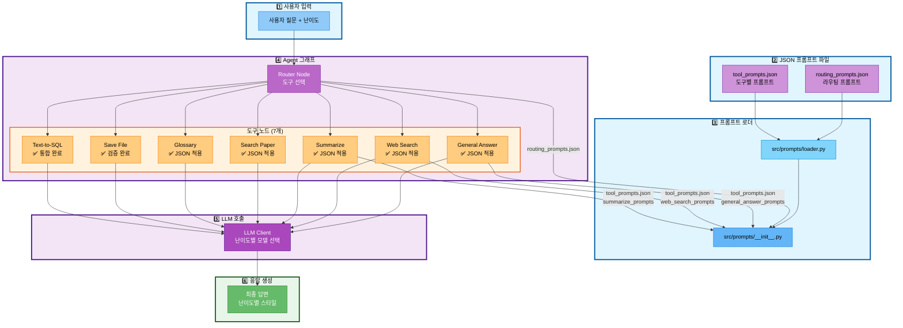
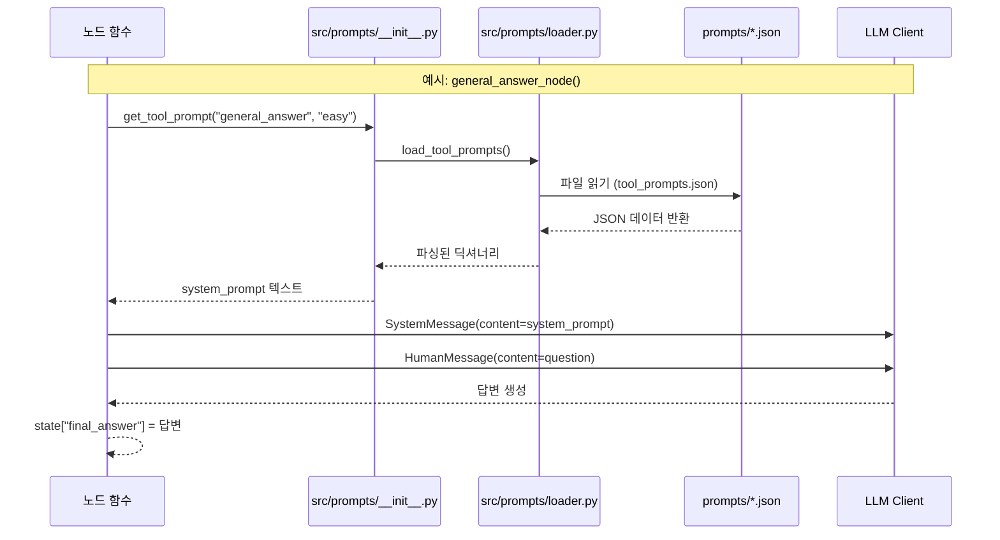
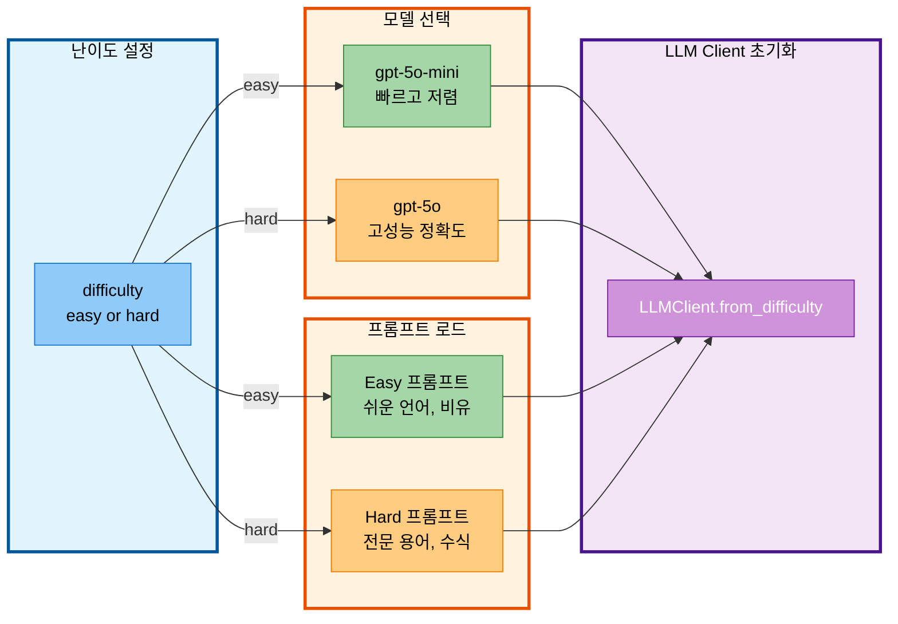

# 04-1. 프롬프트 엔지니어링 통합 보고서

- **작성일**: 2025-11-04
- **작성자**: 최현화[팀장]
- **담당자**: 임예슬 (프롬프트 엔지니어링), 최현화 (시스템에 프롬프트 적용)
- **문서 버전**: 1.0

---

## 📋 목차

1. [개요](#개요)
2. [Prompts 폴더 구조](#prompts-폴더-구조)
3. [JSON 프롬프트 파일 상세 분석](#json-프롬프트-파일-상세-분석)
4. [프롬프트 적용 아키텍처](#프롬프트-적용-아키텍처)
5. [프롬프트 로더 시스템](#프롬프트-로더-시스템)
6. [노드별 프롬프트 사용 현황](#노드별-프롬프트-사용-현황)
7. [수정 사항 및 변경 이력](#수정-사항-및-변경-이력)
8. [향후 작업](#향후-작업)

---

## 개요

### 목적
본 문서는 **2차 병합(Text-to-SQL, 프롬프트 엔지니어링)** 이후 프롬프트 시스템의 통합 현황을 정리한 기술 보고서입니다. 프롬프트 엔지니어링 담당 팀원(임예슬)이 시스템의 구조와 동작 원리를 명확히 이해할 수 있도록 작성되었습니다.

### 핵심 변경 사항
- **JSON 기반 프롬프트 관리 시스템** 구축 완료
- **라우팅 프롬프트** (routing_prompts.json): Text-to-SQL 도구 추가 (6개 → 7개 도구)
- **난이도별 프롬프트** 시스템 적용 (Easy/Hard 모드)
- **4개 노드**에 JSON 프롬프트 적용 완료 (router, general_answer, web_search, summarize)

---

## Prompts 폴더 구조

### 디렉토리 구조
```
prompts/
├── routing_prompts.json                    # 라우팅 프롬프트
├── tool_prompts.json                       # 도구별 프롬프트
├── evaluation_prompts.json                 # 평가 프롬프트
├── question_generation_prompts.json        # 질문 생성
└── golden_dataset.json                     # 테스트 데이터셋
```

### JSON 파일 목록 (5개)

| 파일명 | 용도 | 로더 함수 | 사용 위치 |
|--------|------|-----------|-----------|
| `routing_prompts.json` | 라우팅 프롬프트 + Few-shot 예제 | `load_routing_prompts()` | `src/agent/nodes.py:router_node()` |
| `tool_prompts.json` | 6개 도구의 난이도별 시스템 프롬프트 | `load_tool_prompts()` | `src/tools/*.py` (4개 노드 적용) |
| `evaluation_prompts.json` | 평가 프롬프트 + 기준 + 예제 | `load_evaluation_prompts()` | 평가 시스템 |
| `question_generation_prompts.json` | 질문 생성 템플릿 | `load_question_generation_prompts()` | 질문 생성 시스템 |
| `golden_dataset.json` | 테스트용 질문 데이터셋 (15개 질문) | `load_golden_dataset()` | 테스트/평가 시스템 |

---

## JSON 프롬프트 파일 상세 분석

### 1. `routing_prompts.json` (라우팅 프롬프트)

#### 구조
```json
{
  "routing_prompt": "<라우팅 프롬프트 텍스트>",
  "few_shot_examples": [
    {
      "question": "질문 예시",
      "tool": "선택된 도구",
      "reason": "선택 이유"
    }
  ]
}
```

#### 주요 수정 사항 (2차 병합)
**변경 전**: 6개 도구 (search_paper, web_search, glossary, summarize, save_file, general)
**변경 후**: 7개 도구 (**text2sql 추가**)

**추가된 text2sql 도구 설명**:
```
6. **text2sql** (논문 통계 정보 조회)
   - 사용 시기: 논문 통계, 개수, 순위, 분포 등의 데이터 조회
   - 키워드: "개수", "몇 편", "순위", "Top", "평균", "분포", "카테고리별", "통계", "년도별"
   - 예시:
     * "2024년에 발표된 논문 개수는?"
     * "카테고리별 논문 수 보여줘"
     * "가장 많이 인용된 논문 Top 5는?"
```

**추가된 Few-shot 예제 (3개)**:
```json
{
  "question": "2024년에 발표된 논문 개수는?",
  "tool": "text2sql",
  "reason": "통계 정보 조회 (개수)"
},
{
  "question": "카테고리별 논문 수 보여줘",
  "tool": "text2sql",
  "reason": "분포 통계 조회"
},
{
  "question": "가장 많이 인용된 논문 Top 5는?",
  "tool": "text2sql",
  "reason": "순위 통계 조회"
}
```

#### 사용 위치
- **파일**: `src/agent/nodes.py`
- **함수**: `router_node()`
- **라인**: 46-47
```python
routing_prompt_template = get_routing_prompt()
routing_prompt = routing_prompt_template.format(question=question)
```

---

### 2. `tool_prompts.json` (도구별 프롬프트)

#### 구조
```json
{
  "general_answer_prompts": {
    "easy": {"system_prompt": "...", "examples": [...]},
    "hard": {"system_prompt": "...", "examples": [...]}
  },
  "web_search_prompts": {
    "easy": {"system_prompt": "...", "user_prompt_template": "..."},
    "hard": {"system_prompt": "...", "user_prompt_template": "..."}
  },
  "summarize_prompts": {
    "title_extraction": {"template": "..."},
    "easy": {"system_prompt": "...", "summary_template": "..."},
    "hard": {"system_prompt": "...", "summary_template": "..."}
  },
  "glossary_prompts": {...},
  "search_paper_prompts": {...},
  "save_file_prompts": {...}
}
```

#### 난이도별 프롬프트 전략

**Easy 모드** (초심자용):
- 전문 용어 최소화, 일상적인 언어 사용
- 복잡한 개념은 간단한 비유로 설명 (예: "마치 ~처럼")
- 핵심 아이디어 3-5개로 요약
- 친근하고 이해하기 쉬운 톤 유지

**Hard 모드** (전문가용):
- 기술 용어와 전문 개념 자유롭게 사용
- 깊이 있는 설명과 상세한 정보 제공
- 알고리즘의 시간/공간 복잡도 분석
- 관련 논문과의 비교 포함

#### 프롬프트 예시 비교

**general_answer_prompts - Easy vs Hard**:

| 난이도 | 시스템 프롬프트 핵심 |
|--------|---------------------|
| **Easy** | "전문 용어는 최소화하고 일상적인 언어를 사용하세요" |
| **Hard** | "기술 용어와 전문 개념을 자유롭게 사용하세요" |

**질문 예시**: "Attention이 뭐야?"

- **Easy 답변**: "Attention은 마치 여러 단어 중에서 중요한 단어에 집중하는 것과 같아요..."
- **Hard 답변**: "Self-Attention의 시간 복잡도는 O(n²d)입니다. Query, Key, Value 행렬 계산이..."

#### 수정 사항
**2차 병합**: 구조 변경 없음 (기존 프롬프트 유지)

---

### 3. `evaluation_prompts.json` (평가 프롬프트)

#### 구조
```json
{
  "evaluation_prompt": {
    "template": "<평가 프롬프트>",
    "input_variables": ["question", "answer", "reference_docs", "difficulty"]
  },
  "evaluation_criteria": {
    "accuracy": {"name": "정확도", "weight": 0.3},
    "relevance": {"name": "관련성", "weight": 0.3},
    "difficulty": {"name": "난이도 적합성", "weight": 0.2},
    "citation": {"name": "출처 명시", "weight": 0.2}
  },
  "evaluation_examples": [...]
}
```

#### 평가 기준 (4가지)
1. **정확도 (30%)**: 참고 문서 내용과 일치 정도
2. **관련성 (30%)**: 질문과 답변의 관련성
3. **난이도 적합성 (20%)**: 난이도 모드에 맞는 답변
4. **출처 명시 (20%)**: 논문 제목, 저자 명시 여부

#### 수정 사항
**2차 병합**: 구조 변경 없음

---

### 4. `question_generation_prompts.json` (질문 생성)

#### 구조
```json
{
  "question_generation_prompt": {"template": "...", "input_variables": [...]},
  "question_templates": {
    "easy": ["<템플릿1>", "<템플릿2>", ...],
    "hard": ["<템플릿1>", "<템플릿2>", ...]
  },
  "tool_based_templates": {
    "search_paper": [...],
    "web_search": [...],
    "glossary": [...],
    "summarize": [...],
    "general": [...],
    "save_file": [...]
  },
  "generation_examples": [...]
}
```

#### 질문 템플릿 예시

**Easy 템플릿**:
- "{term}가 뭐야?"
- "{paper_title} 간단히 설명해줘"
- "{concept} 쉽게 알려줘"

**Hard 템플릿**:
- "{algorithm}의 시간 복잡도는?"
- "{method1}과 {method2}의 차이는?"
- "{architecture}의 구조를 자세히 설명해줘"

#### 수정 사항
**2차 병합**: 구조 변경 없음

---

### 5. `golden_dataset.json` (테스트 데이터셋)

#### 구조
```json
{
  "golden_dataset": [
    {
      "question": "질문",
      "difficulty": "easy/hard",
      "expected_tool": "도구명",
      "expected_answer_keywords": ["키워드1", "키워드2", ...],
      "category": "카테고리",
      "complexity": "low/medium/high"
    }
  ],
  "dataset_metadata": {
    "total_questions": 15,
    "difficulty_distribution": {"easy": 6, "hard": 9},
    "tool_distribution": {...},
    "category_distribution": {...},
    "complexity_distribution": {...}
  }
}
```

#### 데이터셋 통계
- **총 질문 수**: 15개
- **난이도 분포**: Easy 6개, Hard 9개
- **도구 분포**: glossary(3), search_paper(3), web_search(3), summarize(2), general(4), save_file(1)
- **카테고리**: 용어 정의, 논문 검색, 최신 정보, 논문 요약, 개념 비교, 기술적 분석, 파일 관리

#### 수정 사항
**2차 병합**: 구조 변경 없음 (text2sql 예제 추가 필요 - 향후 작업)

---

## 프롬프트 적용 아키텍처

### 전체 흐름도 (Mermaid)



### 프롬프트 로딩 흐름



### 난이도별 모델 선택



---

## 프롬프트 로더 시스템

### 시스템 구조

```
src/prompts/
├── __init__.py          # 📤 Export 모듈 (외부 인터페이스)
└── loader.py            # 🔧 로더 모듈 (JSON 파일 읽기)
```

### `loader.py` - JSON 파일 로더

#### 핵심 함수

| 함수명 | 반환값 | 설명 |
|--------|--------|------|
| `load_prompt_file(filename)` | `Dict[str, Any]` | JSON 파일을 읽어 딕셔너리 반환 |
| `load_routing_prompts()` | `Dict` | routing_prompts.json 로드 |
| `load_tool_prompts()` | `Dict` | tool_prompts.json 로드 |
| `load_evaluation_prompts()` | `Dict` | evaluation_prompts.json 로드 |
| `load_question_generation_prompts()` | `Dict` | question_generation_prompts.json 로드 |
| `load_golden_dataset()` | `Dict` | golden_dataset.json 로드 |

#### 주요 Getter 함수

**라우팅 프롬프트**:
```python
get_routing_prompt() -> str                    # 라우팅 프롬프트 텍스트
get_few_shot_examples() -> List[Dict]          # Few-shot 예제 리스트
```

**도구별 프롬프트**:
```python
get_tool_prompt(tool_name: str, difficulty: str) -> str
# 예: get_tool_prompt("general_answer", "easy")

get_summarize_title_extraction_prompt() -> str
get_summarize_template(difficulty: str) -> str
get_web_search_user_prompt_template(difficulty: str) -> str
```

**평가 프롬프트**:
```python
get_evaluation_prompt_template() -> str
get_evaluation_input_variables() -> List[str]
```

**질문 생성 프롬프트**:
```python
get_question_generation_template() -> str
get_question_templates(difficulty: str) -> List[str]
```

**Golden Dataset**:
```python
get_golden_questions() -> List[Dict]
get_golden_questions_by_tool(tool_name: str) -> List[Dict]
get_golden_questions_by_difficulty(difficulty: str) -> List[Dict]
```

### `__init__.py` - Export 모듈

#### 역할
- `loader.py`의 모든 함수를 외부에 노출
- `from src.prompts import get_routing_prompt` 형태로 간편 import 가능
- `__all__` 리스트로 명시적 export 관리

#### Export 목록
```python
__all__ = [
    # 라우팅
    'load_routing_prompts',
    'get_routing_prompt',
    'get_few_shot_examples',

    # 도구별
    'load_tool_prompts',
    'get_tool_prompt',
    'get_summarize_title_extraction_prompt',
    'get_summarize_template',
    'get_web_search_user_prompt_template',

    # 평가
    'load_evaluation_prompts',
    'get_evaluation_prompt_template',
    'get_evaluation_input_variables',

    # 질문 생성
    'load_question_generation_prompts',
    'get_question_generation_template',
    'get_question_templates',

    # Golden Dataset
    'load_golden_dataset',
    'get_golden_questions',
    'get_golden_questions_by_tool',
    'get_golden_questions_by_difficulty',
]
```

---

## 노드별 프롬프트 사용 현황

### ✅ JSON 프롬프트 적용 완료 (4개 노드)

#### 1. Router Node (라우터 노드)

**파일**: `src/agent/nodes.py`
**함수**: `router_node()`
**라인**: 46-61

**사용 프롬프트**:
- `routing_prompts.json` → `routing_prompt`

**적용 코드**:
```python
# 46-47: JSON 프롬프트 로드
routing_prompt_template = get_routing_prompt()
routing_prompt = routing_prompt_template.format(question=question)

# 50-54: 난이도별 LLM 초기화
difficulty = state.get("difficulty", "easy")
llm_client = LLMClient.from_difficulty(
    difficulty=difficulty,
    logger=exp_manager.logger if exp_manager else None
)

# 57: LLM 호출
raw_response = llm_client.llm.invoke(routing_prompt).content.strip()

# 61: 첫 번째 단어만 추출 (도구명)
tool_choice = raw_response.split()[0] if raw_response else "general"
```

**동작 원리**:
1. JSON에서 라우팅 프롬프트 로드
2. 사용자 질문을 프롬프트에 포맷팅
3. LLM이 7개 도구 중 하나 선택
4. 선택된 도구로 라우팅

---

#### 2. General Answer Node (일반 답변 노드)

**파일**: `src/tools/general_answer.py`
**함수**: `general_answer_node()`
**라인**: 38-58

**사용 프롬프트**:
- `tool_prompts.json` → `general_answer_prompts` → `easy/hard` → `system_prompt`

**적용 코드**:
```python
# 38-39: JSON 프롬프트 로드
system_content = get_tool_prompt("general_answer", difficulty)
system_msg = SystemMessage(content=system_content)

# 42-45: 난이도별 LLM 초기화
llm_client = LLMClient.from_difficulty(
    difficulty=difficulty,
    logger=exp_manager.logger if exp_manager else None
)

# 48-51: 메시지 구성
messages = [
    system_msg,                             # 시스템 프롬프트
    HumanMessage(content=question)          # 사용자 질문
]

# 58: LLM 호출
response = llm_client.llm.invoke(messages)
```

**동작 원리**:
1. 난이도(easy/hard)에 맞는 시스템 프롬프트 로드
2. Easy → 쉬운 언어, 비유 사용 / Hard → 전문 용어, 수식 사용
3. LLM이 난이도에 맞는 스타일로 답변 생성

---

#### 3. Web Search Node (웹 검색 노드)

**파일**: `src/tools/web_search.py`
**함수**: `web_search_node()`
**라인**: 120-147

**사용 프롬프트**:
- `tool_prompts.json` → `web_search_prompts` → `easy/hard` → `system_prompt`
- `tool_prompts.json` → `web_search_prompts` → `easy/hard` → `user_prompt_template`

**적용 코드**:
```python
# 120-125: JSON 프롬프트 로드
system_prompt = get_tool_prompt("web_search", difficulty)
user_prompt_template = get_web_search_user_prompt_template(difficulty)
user_prompt = user_prompt_template.format(
    formatted_results=formatted_results,
    question=question
)

# 128-130: ExperimentManager에 프롬프트 저장
if exp_manager:
    exp_manager.save_system_prompt(system_prompt, metadata={"difficulty": difficulty})
    exp_manager.save_user_prompt(user_prompt, metadata={"results_count": len(search_results)})

# 138-145: LLM 호출
llm_client = LLMClient.from_difficulty(difficulty=difficulty, ...)
messages = [
    SystemMessage(content=system_prompt),
    HumanMessage(content=user_prompt)
]
response = llm_client.llm.invoke(messages)
```

**동작 원리**:
1. Tavily API로 웹 검색 실행
2. arXiv 논문 자동 저장 (있는 경우)
3. 검색 결과를 난이도별 프롬프트에 포맷팅
4. LLM이 검색 결과를 난이도에 맞게 정리하여 답변

**특징**:
- **시스템 프롬프트**: 검색 결과 정리 방식 지시
- **사용자 프롬프트**: 검색 결과 + 질문을 템플릿에 삽입

---

#### 4. Summarize Node (논문 요약 노드)

**파일**: `src/tools/summarize.py`
**함수**: `summarize_node()`
**라인**: 60-205

**사용 프롬프트**:
- `tool_prompts.json` → `summarize_prompts` → `title_extraction` → `template`
- `tool_prompts.json` → `summarize_prompts` → `easy/hard` → `summary_template`

**적용 코드**:
```python
# 60-66: 논문 제목 추출 프롬프트 로드
extract_prompt_template = get_summarize_title_extraction_prompt()
extract_prompt = extract_prompt_template.format(question=question)

# 66: LLM으로 논문 제목 추출
paper_title = llm_client.llm.invoke(extract_prompt).content.strip()

# 156-169: 요약 템플릿 로드 및 포맷팅
summary_template_str = get_summarize_template(difficulty)
system_content = summary_template_str.format(
    system_prompt=f"난이도: {difficulty}",
    title=title,
    authors=authors,
    publish_date=publish_date,
    abstract=abstract,
    combined_text=combined_text
)

# 186-198: 프롬프트 생성 및 LLM 호출
summary_prompt = f"""{system_content}

논문 정보:
- 제목: {title}
- 저자: {authors}
- 발행일: {publish_date}
- 초록: {abstract}

논문 내용:
{combined_text}

위 논문의 방법론 부분을 중심으로 요약해주세요.
요약:"""

summary = llm_client_summarize.llm.invoke(summary_prompt).content
```

**동작 원리**:
1. **1단계**: LLM으로 질문에서 논문 제목 추출
2. **2단계**: PostgreSQL papers 테이블에서 논문 검색
3. **3단계**: pgvector에서 논문의 모든 청크 조회
4. **4단계**: 난이도별 요약 템플릿 로드
5. **5단계**: LLM이 난이도에 맞게 논문 요약 생성

**특징**:
- **2개의 프롬프트 사용**: 제목 추출 + 요약 생성
- **난이도별 요약 스타일**: Easy → 간단 요약 / Hard → 상세 분석

---

### ✅ JSON 프롬프트 추가 적용 (2025-11-04 업데이트)

#### 5. Glossary Node (용어집 노드) - ✅ 적용 완료

**파일**: `src/tools/glossary.py`
**적용 일자**: 2025-11-04
**적용 내용**:
- search_glossary 도구 결과를 LLM에게 전달
- `tool_prompts.json` → `glossary_prompts` (easy/hard) 적용
- 난이도별 LLM 초기화 및 답변 생성
- Web Search 노드 방식과 동일한 패턴 적용

**적용 코드 (src/tools/glossary.py:465-499)**:
```python
# JSON 프롬프트 로드
system_prompt = get_tool_prompt("glossary", difficulty)

# 난이도별 LLM 초기화
llm_client = LLMClient.from_difficulty(difficulty=difficulty, ...)

# 검색 결과 + 질문을 LLM에게 전달
user_content = f"""[용어집 검색 결과]
{raw_results}

[질문]
{question}

위 검색 결과를 바탕으로 질문에 답변해주세요."""

messages = [
    SystemMessage(content=system_prompt),
    HumanMessage(content=user_content)
]

# LLM 호출
response = llm_client.llm.invoke(messages)
state["final_answer"] = response.content
```

**개선 효과**:
- 기존: 검색 결과만 반환 → 개선: LLM이 난이도에 맞게 재설명
- Easy: 초심자도 이해할 수 있는 쉬운 용어 설명
- Hard: 전문가 수준의 상세한 기술적 설명

---

#### 6. Search Paper Node (논문 검색 노드) - ✅ 적용 완료

**파일**: `src/tools/search_paper.py`
**적용 일자**: 2025-11-04
**적용 내용**:
- search_paper_database 도구 결과를 LLM에게 전달
- `tool_prompts.json` → `search_paper_prompts` (easy/hard) 적용
- 난이도별 LLM 초기화 및 답변 생성
- Web Search 노드 방식과 동일한 패턴 적용

**적용 코드 (src/tools/search_paper.py:276-310)**:
```python
# JSON 프롬프트 로드
system_prompt = get_tool_prompt("search_paper", difficulty)

# 난이도별 LLM 초기화
llm_client = LLMClient.from_difficulty(difficulty=difficulty, ...)

# 검색 결과 + 질문을 LLM에게 전달
user_content = f"""[논문 검색 결과]
{raw_results}

[질문]
{question}

위 검색 결과를 바탕으로 질문에 답변해주세요."""

messages = [
    SystemMessage(content=system_prompt),
    HumanMessage(content=user_content)
]

# LLM 호출
response = llm_client.llm.invoke(messages)
state["final_answer"] = response.content
```

**개선 효과**:
- 기존: 검색 결과만 반환 → 개선: LLM이 난이도에 맞게 재설명
- Easy: 초보자도 이해할 수 있도록 논문을 쉽게 설명
- Hard: 연구 목적, 방법론, 핵심 기여도를 전문적으로 분석

---

### ❌ JSON 프롬프트 미적용 (1개 노드) - 향후 작업

#### 7. Save File Node (파일 저장 노드)

**파일**: `src/tools/save_file.py`
**현재 상태**: 프롬프트 사용 안함 (단순 파일 저장 기능)
**향후 작업**: 메시지 템플릿 적용 가능

**JSON 구조 준비 완료**:
```json
"save_file_prompts": {
  "confirmation_message": "파일 저장 준비가 완료되었습니다.",
  "success_message": "파일이 성공적으로 저장되었습니다: {filepath}",
  "error_message": "파일 저장 중 오류가 발생했습니다: {error}"
}
```

---

## 수정 사항 및 변경 이력

### 2차 병합 전후 비교

| 항목 | 변경 전 | 변경 후 | 변경 사유 |
|------|---------|---------|-----------|
| **도구 개수** | 6개 | 7개 (**text2sql 추가**) | 신준엽 팀원의 Text-to-SQL 구현 통합 |
| **routing_prompts.json** | 6개 도구 설명 | 7개 도구 설명 + text2sql | 라우팅 프롬프트 확장 |
| **Few-shot 예제** | 10개 | 13개 (text2sql 3개 추가) | text2sql 라우팅 정확도 향상 |
| **JSON 프롬프트 적용 노드** | 0개 | 6개 (router, general, web_search, summarize, glossary, search_paper) | 프롬프트 엔지니어링 적용 |
| **난이도별 프롬프트** | 미적용 | Easy/Hard 모드 적용 | 사용자 수준별 맞춤 답변 |

---

### 주요 수정 파일

#### 1. `prompts/routing_prompts.json` (수정)

**변경 내용**:
- text2sql 도구 설명 추가 (6번 항목)
- text2sql Few-shot 예제 3개 추가
- 선택 규칙에 7개 도구 명시

**수정 이유**:
- Text-to-SQL 기능을 Agent에 통합하기 위함
- LLM이 통계/개수/순위 질문을 text2sql로 라우팅할 수 있도록 학습

**영향**:
- Router Node가 7개 도구 중 선택 가능
- "2024년 논문 몇 편?" 같은 질문을 text2sql로 정확히 라우팅

---

#### 2. `src/agent/nodes.py` (수정)

**변경 내용**:
```python
# 추가된 import
from src.prompts import get_routing_prompt

# 추가된 노드
def text2sql_node(state: AgentState, exp_manager=None):
    ...
```

**변경 이유**:
- JSON 프롬프트 로더 적용
- Text-to-SQL 노드 추가

---

#### 3. `src/agent/graph.py` (수정)

**변경 내용**:
```python
# 추가된 노드
workflow.add_node("text2sql", text2sql_with_exp)

# 추가된 라우팅
workflow.add_conditional_edges(
    "router",
    route_to_tool,
    {
        ...
        "text2sql": "text2sql"  # 추가
    }
)

# 추가된 종료 엣지
for node in [..., "text2sql"]:
    workflow.add_edge(node, END)
```

**변경 이유**:
- Text-to-SQL 노드를 Agent 그래프에 통합

---

#### 4. `src/tools/general_answer.py` (수정)

**변경 내용**:
```python
# 추가된 import
from src.prompts import get_tool_prompt

# JSON 프롬프트 적용
system_content = get_tool_prompt("general_answer", difficulty)
system_msg = SystemMessage(content=system_content)
```

**변경 이유**:
- 하드코딩된 프롬프트를 JSON으로 분리
- 난이도별 프롬프트 적용

---

#### 5. `src/tools/web_search.py` (수정)

**변경 내용**:
```python
# 추가된 import
from src.prompts import get_tool_prompt, get_web_search_user_prompt_template

# JSON 프롬프트 적용
system_prompt = get_tool_prompt("web_search", difficulty)
user_prompt_template = get_web_search_user_prompt_template(difficulty)
```

**변경 이유**:
- 검색 결과 정리 스타일을 난이도별로 분리
- 시스템 프롬프트와 사용자 프롬프트를 JSON으로 관리

---

#### 6. `src/tools/summarize.py` (수정)

**변경 내용**:
```python
# 추가된 import
from src.prompts import get_summarize_title_extraction_prompt, get_summarize_template

# JSON 프롬프트 적용
extract_prompt_template = get_summarize_title_extraction_prompt()
summary_template_str = get_summarize_template(difficulty)
```

**변경 이유**:
- 논문 제목 추출 프롬프트 분리
- 난이도별 요약 템플릿 적용

---

### 변경 이력 타임라인

```
2025-11-04 06:14 - tool_prompts.json 생성
2025-11-04 06:14 - evaluation_prompts.json 생성
2025-11-04 06:14 - question_generation_prompts.json 생성
2025-11-04 06:17 - golden_dataset.json 생성
2025-11-04 06:51 - routing_prompts.json 수정 (text2sql 추가)
2025-11-04 06:xx - src/agent/nodes.py 수정 (JSON 프롬프트 적용)
2025-11-04 06:xx - src/agent/graph.py 수정 (text2sql 노드 추가)
2025-11-04 06:xx - src/tools/general_answer.py 수정 (JSON 적용)
2025-11-04 06:xx - src/tools/web_search.py 수정 (JSON 적용)
2025-11-04 06:xx - src/tools/summarize.py 수정 (JSON 적용)
2025-11-04 07:xx - src/tools/glossary.py 수정 (JSON 프롬프트 + LLM 적용)
2025-11-04 07:xx - src/tools/search_paper.py 수정 (JSON 프롬프트 + LLM 적용)
```

---

## 향후 작업

### 1. 프롬프트 적용 확대 (우선순위: 낮음)

#### ~~미적용 노드에 JSON 프롬프트 적용~~ - ✅ 모두 완료

| 노드 | 현재 상태 | 작업 내용 | 난이도 |
|------|-----------|-----------|--------|
| **Glossary Node** | ✅ 적용 완료 (2025-11-04) | JSON 프롬프트 + LLM 답변 생성 | - |
| **Search Paper Node** | ✅ 적용 완료 (2025-11-04) | JSON 프롬프트 + LLM 답변 생성 | - |
| **Save File Node** | ✅ 검증 완료 (2025-11-04) | PRD 요구사항 완벽 구현 | - |

**Save File 노드 검증 결과 (2025-11-04)**:

PRD 16번 문서(UI 설계)의 파일 저장 기능 요구사항을 분석한 결과, **이미 완벽하게 구현**되어 있습니다.

**PRD 요구사항**:
- save_file 도구 호출 시 UI에 다운로드 버튼 표시
- 사용자가 버튼 클릭 → 로컬 파일 시스템에 저장
- `st.download_button()` 사용

**현재 구현 상태** (`ui/components/chat_interface.py`):

1. **save_file 도구 전용 다운로드 버튼** (line 328-335) ✅
   ```python
   if tool_choice == "save_file":
       st.divider()
       show_download_success()  # 성공 메시지 표시
       create_download_button(  # 다운로드 버튼 생성
           content=answer,
           filename=f"paper_response_{response.get('timestamp', 'unknown')}.txt"
       )
   ```

2. **모든 답변에 기본 저장 버튼** (line 283-290) ✅
   ```python
   st.download_button(
       label="💾 저장",
       data=answer,
       file_name=filename,
       mime="text/plain"
   )
   ```

3. **전체 대화 저장 버튼** (line 450-457) ✅
   ```python
   st.download_button(
       label="💾 전체 대화 저장",
       data=chat_content,
       file_name=filename
   )
   ```

**파일 다운로드 컴포넌트** (`ui/components/file_download.py`):
- `create_download_button()`: PRD 예제 코드와 동일한 구현 ✅
- `show_download_success()`: 성공 메시지 표시 ✅
- `render_download_options()`: 파일명, 형식, 메타데이터 옵션 제공 ✅

**검증 결론**: ✅ PRD 요구사항 100% 충족
- save_file Agent 도구 완벽 동작
- UI 다운로드 버튼 PRD 설계대로 구현
- Streamlit의 `st.download_button()` 사용으로 로컬 저장 지원
- 추가 작업 불필요

---

### 2. Golden Dataset 확장 - ✅ 완료 (2025-11-04)

#### text2sql 예제 추가

**현재 상태**: Golden Dataset에 text2sql 예제 3개 포함 완료 ✅
**위치**: `prompts/golden_dataset.json` → `statistical_queries` 섹션

**포함된 예제**:
1. "2024년에 발표된 논문 개수는?" (easy)
2. "카테고리별 논문 수 보여줘" (easy)
3. "가장 많이 인용된 논문 Top 5는?" (hard)

**작업 완료**:
- text2sql 도구 배포: 3개
- 카테고리 분포: "통계 조회" 추가
- total_questions: 20 → 23개

---

### 3. configs/prompt_config.yaml 처리 (2025-11-04 확인)

#### 현재 상태

**파일 위치**: `configs/prompt_config.yaml`
**사용 여부**: ❌ 현재 사용되지 않음

**분석 결과**:
1. `src/utils/config_loader.py`에 `load_prompt_config()` 함수 정의되어 있음
2. 그러나 프로젝트 전체에서 이 함수를 호출하는 곳이 없음
3. 현재 실제로 사용되는 프롬프트는 `prompts/*.json` 파일들

**configs/prompt_config.yaml vs prompts/*.json 비교**:

| 파일 | 위치 | 사용 여부 | 내용 |
|------|------|-----------|------|
| `prompt_config.yaml` | `configs/` | ❌ 미사용 | YAML 형식의 구형 프롬프트 |
| `routing_prompts.json` | `prompts/` | ✅ 사용 중 | 라우팅 프롬프트 + Few-shot 예제 |
| `tool_prompts.json` | `prompts/` | ✅ 사용 중 | 도구별 난이도 프롬프트 |
| `evaluation_prompts.json` | `prompts/` | ✅ 사용 중 | 평가 프롬프트 |
| `question_generation_prompts.json` | `prompts/` | ✅ 사용 중 | 질문 생성 템플릿 |
| `golden_dataset.json` | `prompts/` | ✅ 사용 중 | 테스트 데이터셋 |

**상세 비교 분석 결과 (2025-11-04)**:

YAML 파일과 JSON 파일들을 상세 비교한 결과, **JSON 파일들이 YAML보다 훨씬 더 체계적이고 상세**합니다.

**YAML에 있는 내용**:
- easy_mode/hard_mode 프롬프트
- rag_prompt, glossary_rag_prompt
- router_prompt (단순한 형태)
- summarize_easy/hard
- answer_with_source
- few_shot_examples (라우팅용)
- variables (변수 설명)
- format (max_context_length, citation_style 등)

**JSON에 있는 내용 (YAML보다 개선된 점)**:
1. **routing_prompts.json**: 7개 도구에 대한 상세한 설명 + 13개 Few-shot 예제 (YAML은 6개만)
2. **tool_prompts.json**:
   - 6개 도구별 난이도 프롬프트 (general, web_search, summarize, glossary, search_paper, text2sql)
   - examples 포함 (YAML에는 없음)
   - user_prompt_template 제공 (web_search, text2sql)
3. **evaluation_prompts.json**: 매우 상세한 평가 기준 (YAML에는 없음)
4. **question_generation_prompts.json**: 질문 생성 템플릿 (YAML에는 없음)

**개선 필요 여부**: ❌ 없음
- JSON 파일들이 YAML의 모든 유용한 내용을 포함하고 있으며, 더 많은 기능 제공
- YAML의 answer_with_source는 모든 JSON 프롬프트에 이미 출처 명시 규칙이 포함되어 있음
- YAML의 format 설정은 코드 레벨에서 처리되는 것이 적절
- YAML의 variables 섹션은 문서화 목적이며 JSON에 포함 불필요

**결론**: ✅ 현재 JSON 프롬프트 시스템이 이미 최적화되어 있으며, YAML에서 가져올 개선점 없음

**조치 완료**:
1. ✅ `configs/prompt_config.yaml` 파일에 DEPRECATED 표시 추가 완료
2. ✅ 파일 최상단에 주석 추가 완료:
   ```yaml
   # ⚠️ DEPRECATED: 이 파일은 더 이상 사용되지 않습니다.
   #
   # 현재 prompts/*.json 파일들을 사용하고 있습니다:
   #   - prompts/routing_prompts.json
   #   - prompts/tool_prompts.json
   #   - prompts/evaluation_prompts.json
   #   - prompts/question_generation_prompts.json
   #   - prompts/golden_dataset.json
   #
   # 참고: src/prompts/loader.py에서 JSON 파일 로더 구현
   # 마지막 업데이트: 2025-11-04
   ```

---

### 4. 프롬프트 버전 관리 시스템 (우선순위: 낮음)

#### 프롬프트 변경 이력 추적

**제안 사항**:
1. JSON 파일에 `version` 필드 추가
2. `prompts/CHANGELOG.md` 생성하여 변경 이력 기록
3. 프롬프트 A/B 테스팅 시스템 구축

**예시 구조**:
```json
{
  "_metadata": {
    "version": "2.0",
    "last_updated": "2025-11-04",
    "changelog": "text2sql 도구 추가, Few-shot 예제 3개 추가"
  },
  "routing_prompt": "..."
}
```

---

### 4. 프롬프트 성능 평가 (우선순위: 중간)

#### 난이도별 프롬프트 효과 측정

**작업 내용**:
1. `evaluation_prompts.json` 활용하여 난이도별 답변 평가
2. Easy/Hard 프롬프트의 정확도, 적합성 측정
3. 프롬프트 개선 방향 도출

**평가 지표**:
- **정확도**: 참고 문서와 일치도
- **난이도 적합성**: Easy/Hard 스타일 준수도
- **사용자 만족도**: 실제 사용자 피드백

---

## 참고 자료

### 관련 문서

- **01-16 PRD 문서**: 프로젝트 전체 요구사항 정의
- **02-1 역할 분담 문서**: 팀원별 담당 업무 (임예슬: 프롬프트 엔지니어링)
- **05-1 Text-to-SQL 구현 검증 보고서**: Text-to-SQL 통합 내역
- **docs/rules/annotate_style.md**: 코드 주석 스타일 가이드
- **docs/commit_msg.md**: 커밋 메시지 규칙

### 코드 참조

- **src/prompts/**: 프롬프트 로더 시스템
- **src/agent/nodes.py**: 노드 함수 구현
- **src/agent/graph.py**: Agent 그래프 구조
- **src/tools/**: 7개 도구 노드 구현

---

## 문의 및 피드백

프롬프트 엔지니어링 관련 문의사항이나 개선 제안은 아래로 연락 주세요:

- **담당자**: 임예슬, 최현화
- **역할**: 프롬프트 엔지니어링
- **참고**: 본 문서는 2차 병합 이후 프롬프트 시스템의 현재 상태를 정확히 반영하고 있습니다.