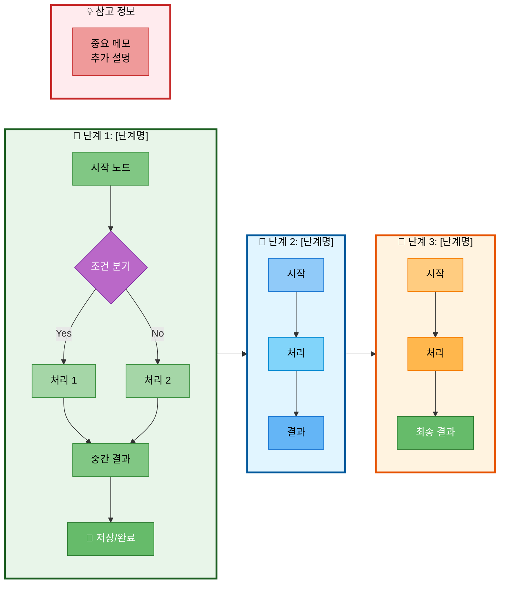
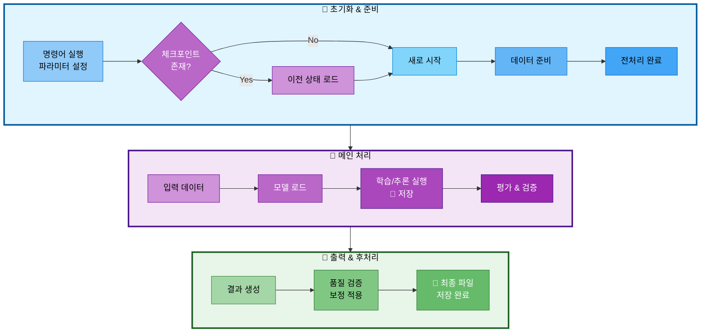
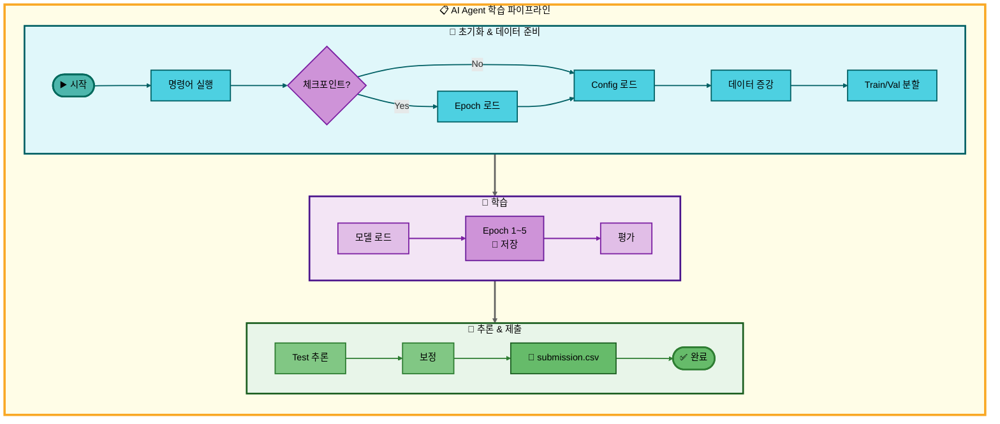

# Mermaid 파이프라인 다이어그램 스타일 가이드

## 목차
1. [방식 1: 가로 배치 (LR + TB)](#방식-1-가로-배치-lr--tb)
2. [방식 2: 세로 배치 (TB + LR)](#방식-2-세로-배치-tb--lr)
3. [색상 팔레트](#색상-팔레트)
4. [노드 타입별 스타일 규칙](#노드-타입별-스타일-규칙)
5. [사용 팁](#사용-팁)

---

## 방식 1: 가로 배치 (LR + TB)

### 기본 구조
- **전체 방향**: `graph LR` (Subgraph들이 가로로 배치)
- **Subgraph 내부**: `direction TB` (세로 흐름)
- **단계 구분**: 색상별 subgraph로 구분
- **용도**: Subgraph가 3~4개 정도로 많지 않을 때, 전체 파이프라인을 가로로 한눈에 보고 싶을 때

### 코드 템플릿



### 방식 1 체크리스트
- [ ] `graph LR` 선언
- [ ] 각 subgraph에 `direction TB` 추가
- [ ] 단계별 subgraph 생성 (Stage1, Stage2, ...)
- [ ] 단계 간 연결 (`Stage1 --> Stage2`)
- [ ] Subgraph 스타일 적용
- [ ] 노드별 개별 스타일 적용
- [ ] 이모지로 시각적 강조

---

## 방식 2: 세로 배치 (TB + LR)

### 기본 구조
- **전체 방향**: `graph TB` (Subgraph들이 세로로 배치)
- **Subgraph 내부**: `direction LR` (가로 흐름)
- **단계 구분**: 색상별 subgraph로 구분
- **용도**: 가로로 너무 길어질 때, 각 단계의 프로세스를 가로로 펼쳐서 보여주고 싶을 때, 더 컴팩트한 구조가 필요할 때

### 코드 템플릿



### 방식 2 체크리스트
- [ ] `graph TB` 선언
- [ ] 각 subgraph에 `direction LR` 추가
- [ ] 단계별 subgraph 생성 (Init, Process, Output)
- [ ] 단계 간 세로 연결 (`Init --> Process`)
- [ ] Subgraph 스타일 적용
- [ ] 노드별 개별 스타일 적용
- [ ] 이모지로 시각적 강조

### 방식 2 장점
- ✅ 가로로 너무 길어지는 문제 해결
- ✅ 각 단계 내부 프로세스를 가로로 명확하게 표현
- ✅ 전체적으로 컴팩트하고 균형잡힌 레이아웃
- ✅ 복잡한 파이프라인도 깔끔하게 표현

---

## 색상 팔레트

### 전체 워크플로우 배경
- **메인 워크플로우**: `fill:#fffde7,stroke:#f9a825,stroke-width:4px` (옅은 노랑 배경, 진한 노랑 테두리)
  - 전체 다이어그램을 감싸는 subgraph에 사용

### Subgraph 배경색
| 단계 | 배경색 | 테두리색 | 용도 |
|------|--------|----------|------|
| 1단계/입력 | `#e0f7fa` | `#006064` | 초기 입력/준비 단계 (청록) |
| 2단계/처리 | `#f3e5f5` | `#4a148c` | 메인 처리 단계 (보라) |
| 3단계/조회 | `#e8f5e9` | `#1b5e20` | 데이터 조회 단계 (녹색) |
| 4단계/생성 | `#fff3e0` | `#e65100` | 답변 생성 단계 (주황) |
| 5단계/표시 | `#ffebee` | `#c62828` | 결과 표시 단계 (빨강) |
| 6단계/평가 | `#e3f2fd` | `#1565c0` | 품질 평가 단계 (파랑) |

### 노드 색상 (단계별)

> **중요**: 모든 노드 텍스트는 `color:#000` (검정색)으로 통일하여 가독성 최대화

**입력/1단계 (청록 계열)**
- 시작 노드: `fill:#4db6ac,stroke:#00695c,stroke-width:3px,color:#000`
- 일반 노드: `fill:#4dd0e1,stroke:#006064,stroke-width:2px,color:#000`
- 분기 노드: `fill:#ce93d8,stroke:#7b1fa2,stroke-width:2px,color:#000`

**처리/2단계 (보라 계열)**
- 라우터 노드: `fill:#ce93d8,stroke:#6a1b9a,stroke-width:2px,color:#000`
- 일반 노드: `fill:#e1bee7,stroke:#7b1fa2,stroke-width:2px,color:#000`

**조회/3단계 (녹색 계열)**
- 일반 노드: `fill:#81c784,stroke:#2e7d32,stroke-width:2px,color:#000`
- 중요 노드: `fill:#66bb6a,stroke:#1b5e20,stroke-width:2px,color:#000`

**생성/4단계 (주황 계열)**
- 일반 노드: `fill:#ffb74d,stroke:#e65100,stroke-width:2px,color:#000`
- 중요 노드: `fill:#ffa726,stroke:#ef6c00,stroke-width:2px,color:#000`

**표시/5단계 (빨강 계열)**
- 일반 노드: `fill:#ef9a9a,stroke:#c62828,stroke-width:2px,color:#000`
- 중요 노드: `fill:#e57373,stroke:#c62828,stroke-width:2px,color:#000`
- 강조 노드: `fill:#ef5350,stroke:#b71c1c,stroke-width:2px,color:#000`

**평가/6단계 (파랑 계열)**
- 일반 노드: `fill:#90caf9,stroke:#0d47a1,stroke-width:2px,color:#000`
- 처리 노드: `fill:#64b5f6,stroke:#1565c0,stroke-width:2px,color:#000`
- 저장 노드: `fill:#42a5f5,stroke:#0d47a1,stroke-width:2px,color:#000`
- 완료 노드: `fill:#2196f3,stroke:#01579b,stroke-width:2px,color:#000`

**공통 (흐름 제어)**
- 분기 노드: `fill:#ce93d8,stroke:#6a1b9a,stroke-width:2px,color:#000`
- 종료 노드: `fill:#66bb6a,stroke:#2e7d32,stroke-width:2px,color:#000`

### 연결선 색상 (단계별)

**기본 원칙**: 각 단계의 연결선은 해당 subgraph의 테두리 색상과 동일하게 설정

- **입력 단계**: `stroke:#006064,stroke-width:2px` (청록)
- **처리 단계**: `stroke:#7b1fa2,stroke-width:2px` (보라)
- **조회 단계**: `stroke:#2e7d32,stroke-width:2px` (녹색)
- **생성 단계**: `stroke:#e65100,stroke-width:2px` (주황)
- **표시 단계**: `stroke:#c62828,stroke-width:2px` (빨강)
- **평가 단계**: `stroke:#1565c0,stroke-width:2px` (파랑)
- **흐름 제어**: `stroke:#7b1fa2,stroke-width:2px` (보라)
- **단계 간 연결**: `stroke:#616161,stroke-width:3px` (회색, 두껍게)

---

## 노드 타입별 스타일 규칙

### 1. 일반 프로세스 노드 `[텍스트]`
- 사각형 박스
- 단계별 기본 색상 적용
- **텍스트 색상**: `color:#000` (검정색)
- 배경색: 진하고 채도 높은 색상 사용

### 2. 조건 분기 노드 `{텍스트}`
- 마름모 모양
- 보라색 (`#ce93d8`) 배경, **검정색 텍스트** (`color:#000`)
- 항상 Yes/No 레이블 사용

### 3. 시작/종료 노드 `([텍스트])`
- 둥근 사각형 모양
- 시작: 녹색 계열 (`#4db6ac`), **검정색 텍스트**
- 종료: 녹색 계열 (`#66bb6a`), **검정색 텍스트**

### 4. 중요/저장 노드 `[💾 텍스트]`
- 이모지 포함
- 진한 배경색, **검정색 텍스트** (`color:#000`)
- 체크포인트나 최종 결과에 사용

### 5. 서브 프로세스 `[텍스트<br/>상세설명]`
- `<br/>` 태그로 줄바꿈
- 밝은 배경색, **검정색 텍스트**
- 파라미터나 설정 정보 표시

---

## 사용 팁

### 1. 전체 다이어그램 배경색 설정


### 2. 이모지 활용
- 🔸 (1단계/입력), 🔹 (2단계/처리), 🔺 (3단계/조회), 🔶 (4단계/생성)
- 💡 (표시), 🔷 (평가), 📋 (메인)
- 💾 (저장/체크포인트), ⚙️ (설정), ▶️ (시작), ✅ (완료)
- 📊 (데이터), 🔄 (반복), 🤖 (AI/LLM)

### 3. 연결선 레이블
```mermaid
A -->|Yes| B
A -->|No| C
A -->|Fold 1~5| D
```

### 4. 연결선 색상 설정 (linkStyle)
```mermaid
%% 연결선 색상 (단계별)
%% 0번째 연결선부터 순서대로 지정
linkStyle 0 stroke:#006064,stroke-width:2px
linkStyle 1 stroke:#7b1fa2,stroke-width:2px
linkStyle 2 stroke:#2e7d32,stroke-width:2px

%% 단계 간 연결은 회색으로 두껍게
linkStyle 10 stroke:#616161,stroke-width:3px
```

### 5. 점선 연결 (참고용)
```mermaid
Step3 -.-> Info
Training -.-> Checkpoint
```

### 6. 노드 ID 규칙
**방식 1 (LR + TB)**
- 단계 1: A, B, C, D, E, F
- 단계 2: G, H, I, J, K
- 단계 3: L, M, N, O, P
- 정보: Q, R, S

**방식 2 (TB + LR)**
- 초기화: A, B, C, D, CP1, CP2
- 처리: E, F, G, H
- 출력: I, J, K
- 정보: Z

### 7. 방식 선택 가이드

**방식 1 (LR + TB) 선택 시기:**
- Subgraph가 2~4개 정도로 적을 때
- 전체 파이프라인을 한 화면에 가로로 보고 싶을 때
- 각 단계의 세부 프로세스가 길 때

**방식 2 (TB + LR) 선택 시기:**
- 가로로 너무 길어질 때 (5개 이상 subgraph)
- 각 단계의 프로세스를 가로로 펼쳐서 명확하게 표현하고 싶을 때
- 더 컴팩트하고 균형잡힌 레이아웃이 필요할 때
- 모바일이나 좁은 화면에서도 보기 좋게 만들 때

---

## 실전 예제

### 예제 1: 방식 2 사용 (AI Agent 학습 파이프라인) - 권장 스타일


---

## 문제 해결

### Q1: Subgraph가 너무 길어요
**A:** 방식 2 (TB + LR)로 변경하거나, 노드를 더 세분화된 subgraph로 분리하세요.

### Q2: 노드 ID가 충돌해요
**A:** 각 subgraph마다 다른 알파벳 범위를 사용하세요 (A~F, G~K, L~P 등).

### Q3: 색상이 너무 화려해요
**A:** 중요한 노드(체크포인트, 최종 결과)만 진한 색상을 쓰고, 나머지는 연한 색상을 사용하세요.

### Q4: 어떤 방식을 선택해야 할지 모르겠어요
**A:** 먼저 방식 1로 그려보고, 가로로 너무 길면 방식 2로 변경하세요.

---

## 추가 리소스

- [Mermaid 공식 문서](https://mermaid.js.org/)
- [Mermaid Live Editor](https://mermaid.live/)
- [Material Design 색상](https://material.io/design/color/)