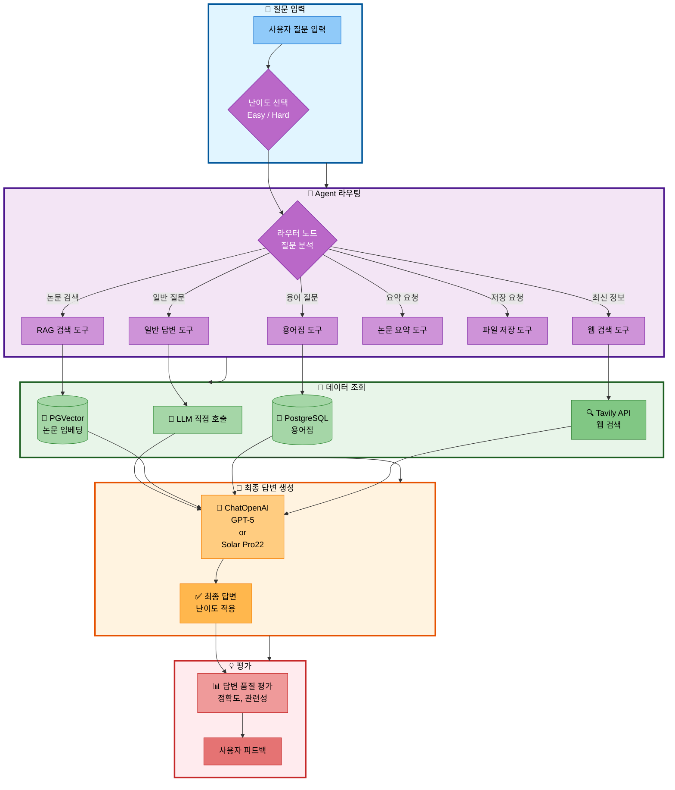
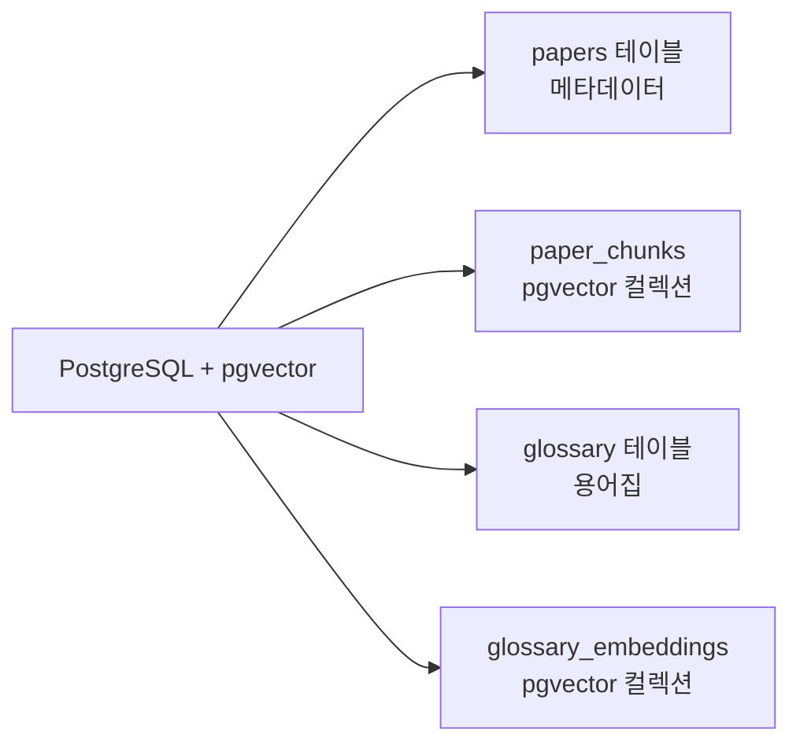
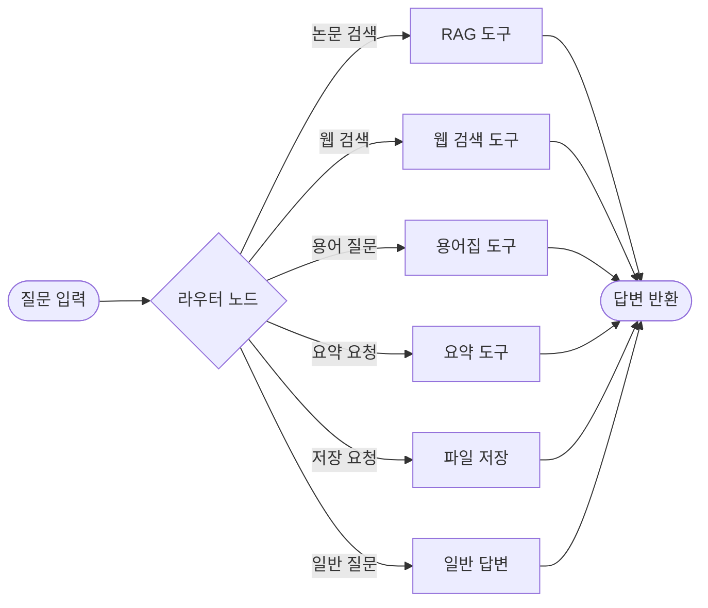

# 멘토링 질의응답 (2025.10.30)

## 프로젝트 개요

### 프로젝트명
**논문 리뷰 챗봇 (AI Agent + RAG)**

### 팀 정보
- **팀명**: 연결의 민족
- **팀 구성**: 4명 (10/31 이후 3명)
- **프로젝트 기간**: 2025.10.28 ~ 11.06 (10일)
- **발표일**: 11월 6일 (목) 13:00

### 멘토링 참여 명단
- **멘토링 일시**: 2025-10-30 18:00~19:00
- **강사**: 박나연
- **수강생**: 최현화, 박재홍, 신준엽 

### 프로젝트 소개

본 프로젝트는 AI/ML 논문을 누구나 쉽게 이해하고 활용할 수 있도록 돕는 지능형 논문 리뷰 챗봇입니다. 전문 용어와 수식이 많아 초심자가 논문을 이해하기 어렵고, 초심자와 전문가 간 정보 격차가 크며, LLM의 지식 컷오프로 최신 논문 정보가 부족한 문제를 해결합니다.

LangGraph 기반 AI Agent가 사용자 질문을 분석하여 6가지 도구(일반 답변, RAG 검색, 웹 검색, 용어집, 논문 요약, 파일 저장) 중 적절한 도구를 자동으로 선택합니다. 사용자는 Easy/Hard 모드를 선택하여 난이도에 맞는 답변을 받을 수 있으며, Easy 모드는 쉬운 용어와 비유를 사용하고, Hard 모드는 기술 세부사항과 수식을 포함합니다. PostgreSQL + pgvector 통합 DB를 사용하여 논문 메타데이터와 벡터 검색을 하나의 DB에서 처리하며, 용어집 DB와 논문 DB를 하이브리드 검색하여 전문 용어를 자동으로 설명합니다. Tavily Search API를 통해 최신 논문 정보를 실시간으로 검색할 수 있습니다.

### 기술 스택

#### Core Technologies

| 구분 | 기술 | 비고 |
|------|------|------|
| **LLM** | OpenAI GPT-5 / GPT-5 / GPT-5<br/>Upstage Solar Pro22 | Easy: Solar Pro22 (한국어 특화)<br/>Hard: GPT-5 (기술 정확도) |
| **Framework** | Langchain + LangGraph | AI Agent 및 RAG 통합 |
| **Database** | PostgreSQL + pgvector | 관계형 + 벡터 검색 통합 |
| **Embeddings** | OpenAI text-embedding-3-small | 비용 효율적 |
| **UI** | Streamlit | 빠른 개발, 채팅 UI |
| **Web Search** | Tavily Search API | 최신 논문 검색 |
| **Document** | PyPDFLoader, RecursiveCharacterTextSplitter | 논문 처리 |

#### 개발 환경
- Python 3.11.9
- Git + GitHub (Feature Branch 전략)

### 시스템 아키텍처



### 데이터 범위
- **논문**: arXiv 기반 AI/ML 논문 50-100편
- **카테고리**: Transformer, BERT, GPT, Attention Mechanism 등
- **용어집**: 50-100개 항목

---

## Q&A

### Q1. 이중 LLM 전략의 효과성과 운영 복잡도

현재 프로젝트에서 난이도별로 다른 LLM을 사용하는 전략을 계획하고 있습니다:

**계획한 전략:**
- **Easy 모드**: Solar Pro22 (한국어 특화, 비용 효율적)
- **Hard 모드**: GPT-5 (기술적 정확도, 전문성)

**궁금한 점:**
1. 난이도별로 다른 LLM을 사용하는 것이 실제로 효과적인가요?
2. 단일 LLM (예: GPT-5)에 프롬프트만 달리 주는 것과 비교했을 때, 이중 LLM 전략의 실질적인 이점이 있나요?
3. 모델 전환 로직으로 인한 운영 복잡도 증가 대비 성능 향상 효과가 충분한가요?
4. 비용 절감 측면에서 실제로 의미 있는 차이가 발생하나요? (Easy 모드에 Solar Pro22 사용 시)

**배경:**
- 프로젝트 기간이 10일로 짧고, 복잡도를 최소화해야 하는 상황
- Easy 모드는 한국어 답변이 주를 이루고, Hard 모드는 전문 용어와 수식 포함

**A1.**

### 멘토의 답변

**1. 난이도별 LLM 사용의 효과성**
- ✅ **매우 효과적이고 실무에서도 권장하는 전략**
- 실무 환경에서도 답변 난이도와 복잡도에 따라 서로 다른 모델을 선택하는 방식을 적극 활용
- 사용자 요구사항에 따라 적절한 모델을 선택하면 품질과 비용 모두 최적화 가능

**2. 단일 LLM vs 이중 LLM 전략 비교**
- ✅ **이중 LLM 전략이 실질적인 효과 있음**
- 프롬프트만으로도 어느 정도 난이도 조절이 가능하지만, 모델 자체의 특성을 활용하면 더 나은 결과
- Solar Pro2는 한국어 특화 모델로 초보자용 설명에 최적화
- GPT-5는 기술적 정확도가 높아 전문가용 답변에 적합

**3. 운영 복잡도 대비 효과**
- ✅ **성능 향상 측면보다는 비용 절감 측면에서 효과가 크다**
- LangGraph를 사용하면 난이도별 모델 전환 로직을 간단하게 구현 가능
- 복잡도 증가는 미미하지만 비용 절감 효과는 명확
- 프로젝트 기간 10일이면 구현 가능한 수준

**4. 비용 절감 효과**
- ✅ **의미 있는 비용 차이 발생**
- Easy 모드에서 Solar Pro2 사용 시 OpenAI 대비 비용이 크게 절감
- 간단한 작업(요약, 용어 설명 등)에는 저비용 모델 활용 권장
- 복잡한 작업(논문 분석, 비교)에만 고비용 모델 사용

### 프로젝트 적용 방안

**난이도별 모델 선택 전략:**

```python
def get_llm(difficulty="easy", task_complexity="low"):
    """
    난이도와 작업 복잡도에 따라 최적의 LLM 선택

    - Easy 모드: Solar Pro2 (한국어 특화, 비용 효율)
    - Hard 모드: GPT-5 (기술 정확도, 전문성)
    - 간단한 작업: Solar Pro2 (요약, 용어 설명)
    - 복잡한 작업: GPT-5 (논문 비교, 심층 분석)
    """
    if difficulty == "easy":
        return ChatUpstage(model="solar-pro2", temperature=0.7)
    elif difficulty == "hard":
        return ChatOpenAI(model="gpt-5", temperature=0.7)
```

**비용 최적화 전략:**
- 일반 답변, 용어집 도구: Solar Pro2 우선 사용
- RAG 검색, 논문 비교: 난이도에 따라 선택
- 라우팅 로직: GPT-5 (저비용, 빠른 속도)

**구현 우선순위:**
1. 핵심 기능 구현 (11/3까지)
2. 난이도별 LLM 전환 로직 추가 (11/4)
3. 비용 모니터링 기능 추가 (선택)


---

### Q2. PostgreSQL + pgvector 단일 통합 전략의 적합성

별도의 Vector DB (Pinecone, Weaviate 등) 대신 PostgreSQL + pgvector로 통합하여 관계형 데이터와 벡터 검색을 한 DB에서 처리하려고 합니다.

**계획한 아키텍처:**



**아키텍처 구성요소 설명:**

1. **papers 테이블** (관계형 데이터)
   - 논문의 메타데이터를 저장 (paper_id, title, authors, publish_date, source, url, category, abstract 등)
   - 벡터 검색 결과의 paper_id로 조회하여 논문 정보를 제공
   - Full-text 검색 인덱스 지원 (제목 검색)

2. **paper_chunks** (pgvector 컬렉션)
   - 논문 본문을 RecursiveCharacterTextSplitter로 1000자 단위 청크 분할
   - OpenAI text-embedding-3-small (1536차원) 임베딩 벡터 저장
   - 코사인 유사도 기반 벡터 검색으로 관련 논문 청크 추출
   - 각 청크는 paper_id와 연결되어 메타데이터 조회 가능

3. **glossary 테이블** (관계형 데이터)
   - AI/ML 전문 용어 50-100개 저장 (term, definition)
   - 난이도별 설명: easy_explanation (초심자용), hard_explanation (전문가용)
   - 카테고리 분류 (ML, NLP, CV, RL 등) 및 난이도 레벨
   - 관련 용어 배열 (related_terms) 및 사용 예시

4. **glossary_embeddings** (pgvector 컬렉션)
   - 용어 정의의 임베딩 벡터 저장
   - 유사 용어 검색 및 자동 용어 인식에 사용
   - 사용자 질문에 포함된 전문 용어 자동 감지

**궁금한 점:**
1. 논문 50-100편 규모에서 PostgreSQL + pgvector의 성능이 충분한가요?
2. 벡터 검색과 관계형 조회를 동시에 수행할 때 성능 병목이 발생할 가능성은 없나요?
3. 별도의 Vector DB를 사용하는 것과 비교했을 때 단점이 있나요?
4. pgvector의 유사도 검색 성능을 최적화하기 위한 인덱스 설정이나 튜닝 팁이 있나요?

**배경:**
- 운영 및 유지보수 간소화를 위해 단일 DB 솔루션 선호
- Langchain의 PGVector 통합 사용 예정
- 데이터 규모: 논문 50-100편, 청크 약 500-1000개

**A2.**

### 멘토의 답변

**1. 논문 50-100편 규모에서 성능**
- ✅ **충분히 적합함**
- PostgreSQL + pgvector는 소규모~중규모 데이터셋에서 매우 안정적
- 논문 50-100편, 청크 500-1000개 수준이면 성능 이슈 없음
- 수천~수만 개 이상의 벡터가 아니라면 전용 Vector DB 불필요

**2. 성능 병목 가능성**
- ✅ **병목 발생 가능성 없음**
- 벡터 검색과 관계형 조회를 동시에 수행해도 문제없음
- 오히려 도구를 병렬로 처리하면 시간이 더 빨라짐
- **도구 병렬 처리 시 토큰량 우려**: GPT-5는 대용량 컨텍스트를 처리할 수 있어 문제없음

**3. 별도 Vector DB 대비 장단점**
- ✅ **단점 없음, 오히려 장점이 많음**
- PostgreSQL 통합으로 관계형 데이터와 벡터 검색을 한 곳에서 처리
- 별도 DB 관리 부담 없음 (유지보수 간소화)
- Langchain PGVector 통합 지원으로 구현 용이
- 데이터 일관성 보장 (단일 트랜잭션)

**4. pgvector 성능 최적화**
- ✅ **메타데이터 필터링 활용 권장**
- **인덱스 설정**: pgvector는 IVFFlat, HNSW 인덱스 지원
- **메타데이터 필터링**: 카테고리, 연도, 저자 등으로 검색 범위 좁히기
- **예시**: AI 카테고리 논문만 검색하면 검색 범위가 줄어들어 성능 향상

### 프로젝트 적용 방안

**데이터베이스 스키마 설계:**

```sql
-- 논문 메타데이터 테이블
CREATE TABLE papers (
    paper_id SERIAL PRIMARY KEY,
    title TEXT NOT NULL,
    authors TEXT[],
    publish_date DATE,
    category VARCHAR(50),  -- 메타데이터 필터링용
    source VARCHAR(100),
    url TEXT,
    abstract TEXT
);

-- 논문 청크 + 벡터 (pgvector)
CREATE TABLE paper_chunks (
    chunk_id SERIAL PRIMARY KEY,
    paper_id INTEGER REFERENCES papers(paper_id),
    chunk_text TEXT,
    chunk_index INTEGER,
    embedding vector(1536)  -- OpenAI text-embedding-3-small
);

-- 벡터 검색 인덱스 (HNSW 권장)
CREATE INDEX ON paper_chunks USING hnsw (embedding vector_cosine_ops);

-- 메타데이터 필터링 인덱스
CREATE INDEX idx_papers_category ON papers(category);
CREATE INDEX idx_papers_date ON papers(publish_date);
```

**메타데이터 필터링 활용:**

```python
# 카테고리 필터링으로 검색 범위 좁히기
def search_with_filter(query, category=None, year=None):
    """메타데이터 필터를 적용한 검색"""

    filter_dict = {}
    if category:
        filter_dict["category"] = category
    if year:
        filter_dict["publish_date"] = year

    # pgvector 검색 with 필터
    docs = vectorstore.similarity_search(
        query,
        k=5,
        filter=filter_dict  # 메타데이터 필터
    )

    return docs
```

**도구 병렬 처리 예시:**

```python
# LangGraph에서 여러 도구를 병렬로 실행
# 예: 용어집 검색 + 논문 검색 동시 수행
async def parallel_search(query):
    """용어집과 논문 검색 병렬 처리"""

    glossary_task = asyncio.create_task(search_glossary(query))
    paper_task = asyncio.create_task(search_papers(query))

    glossary_result, paper_result = await asyncio.gather(
        glossary_task,
        paper_task
    )

    return combine_results(glossary_result, paper_result)
```

**구현 우선순위:**
1. PostgreSQL + pgvector 기본 설정 (10/30 완료)
2. 메타데이터 스키마 설계 및 인덱스 생성 (10/31)
3. 카테고리 필터링 기능 추가 (11/2)
4. 병렬 검색 최적화 (선택)


---

### Q3. AI Agent 도구 구조와 라우팅 정확도 개선 방법

LangGraph StateGraph를 사용하여 6개 도구를 라우팅하는 AI Agent를 구현하려고 합니다.

**계획한 Agent 구조:**



**궁금한 점:**
1. 6개 도구가 적절한 개수인가요? (너무 많거나 적지 않은지)
2. 라우터가 질문을 분석하여 도구를 선택할 때, 정확도를 높이는 효과적인 방법이 있나요?
3. Few-shot 예시를 라우팅 프롬프트에 포함하는 것이 실제로 도움이 되나요?
4. 도구 선택이 잘못되었을 때 재라우팅하거나 fallback 처리를 구현해야 하나요?

**배경:**
- LangGraph는 처음 사용해보는 기술
- 라우팅 정확도가 전체 시스템 품질에 큰 영향을 미칠 것으로 예상
- 10개 테스트 시나리오에서 모두 정확한 도구 선택이 필요

**A3.**

### 멘토의 답변

**1. 6개 도구의 적절성**
- ✅ **적절한 개수임**
- 실무에서 평균적으로 4개 정도의 도구를 사용하는데, 6개는 절대 많은 수치가 아님
- 오히려 프로젝트의 목적(논문 리뷰)을 고려하면 6개가 적절
- 도구가 너무 많으면(10개 이상) 라우팅 정확도가 떨어질 수 있지만, 6개는 LLM이 충분히 구분 가능

**2. 라우팅 정확도를 높이는 방법**
- ✅ **프롬프트 엔지니어링이 핵심**
- **도구 설명 상세화**: 각 도구의 역할과 사용 시나리오를 명확하게 프롬프트에 기재
- **키워드 기반 라우팅**: 특정 키워드가 포함되면 해당 도구 선택 (예: "요약" → summarize)
- **다양한 시나리오 템플릿**: 예상되는 질문 패턴을 미리 프롬프트에 정의
- **필터링 조건**: 조건문을 프롬프트에 명확하게 작성 (예: "만약 ~이면 A 도구 사용")

**3. Few-shot 예시의 효과**
- ✅ **아주 효과적이니 적극 권장**
- Few-shot 예시를 라우팅 프롬프트에 포함하면 라우팅 정확도가 크게 향상
- 각 도구별로 2-3개의 대표 예시를 제공하면 LLM이 패턴을 학습
- 실제 테스트를 통해 헷갈리는 케이스를 발견하고 Few-shot에 추가

**4. 재라우팅 및 Fallback 처리**
- ✅ **도구 선택 분기를 다시 선택할 수 있도록 구현해야 함**
- LLM이 잘못된 도구를 선택했을 때 다시 라우팅할 수 있는 로직 필요
- 하지만 **처음부터 프롬프팅을 잘해서 정확한 도구를 선택하도록 하는 것이 더 중요**
- Fallback: 도구 실행 실패 시 general 도구로 대체하는 전략 고려

### 프로젝트 적용 방안

**라우팅 프롬프트 상세화:**

```python
ROUTER_PROMPT = """
당신은 사용자 질문을 분석하여 가장 적절한 도구를 선택하는 전문가입니다.

[도구 목록 및 사용 시나리오]

1. **search_paper** (논문 DB 검색)
   - 사용 시기: 논문 내용, 연구 방법, 알고리즘에 대한 질문
   - 키워드: "논문", "연구", "방법", "알고리즘", "찾아줘", "검색"
   - 예시: "RAG에 대한 논문 찾아줘", "Transformer 연구 방법 알려줘"

2. **web_search** (웹 검색)
   - 사용 시기: 최신 정보, 뉴스, 트렌드 검색
   - 키워드: "최신", "2024년", "뉴스", "트렌드"
   - 예시: "최신 AI 뉴스", "2024년 논문 트렌드"

3. **glossary** (용어집)
   - 사용 시기: 전문 용어 정의와 설명
   - 키워드: "뭐야", "무엇", "정의", "설명", "의미"
   - 예시: "BERT가 뭐야?", "Attention 설명해줘"

4. **summarize** (논문 요약)
   - 사용 시기: 논문 전체 또는 섹션 요약
   - 키워드: "요약", "핵심", "간단히", "정리"
   - 예시: "이 논문 요약해줘", "핵심 내용만 알려줘"

5. **save_file** (파일 저장)
   - 사용 시기: 대화 내용이나 결과를 파일로 저장
   - 키워드: "저장", "다운로드", "파일"
   - 예시: "파일로 저장해줘", "다운로드"

6. **general** (일반 답변)
   - 사용 시기: 인사, 감사, 간단한 대화
   - 키워드: "안녕", "고마워", "도움", "괜찮아"
   - 예시: "안녕하세요", "고마워요"

[선택 규칙]
- 위 6개 도구 중 **하나만** 선택
- 도구 이름만 반환 (예: search_paper)
- 키워드와 사용 시나리오를 기준으로 판단
- 애매한 경우 general 선택

[사용자 질문]
{question}

[선택한 도구]
"""
```

**Few-shot 예시 추가:**

```python
from langchain.prompts import FewShotPromptTemplate

# Few-shot 예시
examples = [
    {"question": "BERT가 뭐야?", "tool": "glossary"},
    {"question": "RAG 논문 찾아줘", "tool": "search_paper"},
    {"question": "최신 AI 뉴스", "tool": "web_search"},
    {"question": "이 논문 요약해줘", "tool": "summarize"},
    {"question": "대화 내용 저장해줘", "tool": "save_file"},
    {"question": "안녕하세요", "tool": "general"},
    {"question": "Transformer 논문 찾아줘", "tool": "search_paper"},
    {"question": "Attention이 뭐야?", "tool": "glossary"}
]

few_shot_prompt = create_few_shot_routing_prompt(examples)
```

**재라우팅 로직 구현:**

```python
def route_with_fallback(state: AgentState) -> str:
    """재라우팅 지원 라우팅 함수"""

    question = state["question"]
    retry_count = state.get("retry_count", 0)

    # 라우팅 시도
    try:
        tool_choice = llm_router.invoke(routing_prompt.format(question=question))

        # 유효성 검증
        valid_tools = ["search_paper", "web_search", "glossary", "summarize", "save_file", "general"]
        if tool_choice not in valid_tools:
            if retry_count < 2:
                # 재시도
                state["retry_count"] = retry_count + 1
                return route_with_fallback(state)
            else:
                # Fallback: general 도구 사용
                return "general"

        return tool_choice

    except Exception as e:
        logger.error(f"라우팅 실패: {e}")
        return "general"  # Fallback
```

**구현 우선순위:**
1. 기본 라우팅 로직 구현 (10/31)
2. Few-shot 예시 추가 (11/1)
3. 라우팅 프롬프트 상세화 (11/2)
4. 재라우팅 로직 추가 (11/3)
5. 10개 테스트 시나리오로 검증 (11/4)


---

### Q4. 프롬프트만으로 난이도 구분의 한계와 개선 방안

Easy/Hard 모드의 답변 차이를 프롬프트 엔지니어링만으로 구현하려고 합니다.

**계획한 프롬프트 전략:**

**Easy 프롬프트:**
- 초등학생도 이해할 수 있는 수준
- 비유와 실생활 예시 활용
- 전문 용어는 풀어서 설명
- 한 문장을 짧게 (20자 이내)

**Hard 프롬프트:**
- 학술적이고 정확한 용어 사용
- 논문의 세부 내용과 수식 포함
- 비판적 분석 제공
- 연구 방법론과 한계점 언급

**궁금한 점:**
1. 프롬프트만으로 난이도 차이를 명확하게 구분할 수 있나요?
2. LLM이 프롬프트 지시를 일관되게 따르지 않을 때 대처 방법이 있나요?
3. 난이도 차이를 더 명확하게 보여주기 위한 추가적인 접근 방법이 있나요? (예: Temperature 조절, Few-shot 예시 등)
4. 발표 시연에서 Easy/Hard 차이를 효과적으로 보여주기 위한 좋은 예시 질문이 있나요?

**배경:**
- 프롬프트 엔지니어링이 프로젝트의 핵심 차별화 요소
- 발표 시 난이도 차이가 명확하지 않으면 감점 가능성
- Easy 모드는 초심자, Hard 모드는 전문가를 대상으로 설계

**A4.**

### 멘토의 답변

**1. 프롬프트만으로 난이도 구분 가능성**
- ✅ **가능하지만 추가 전략이 필요함**
- 프롬프트만으로도 어느 정도 난이도 구분이 가능하지만, 일관성을 보장하기 어려움
- **메타데이터 필터링**을 활용하면 검색 정확도가 크게 향상
- **구조화된 출력(Structured Output)**을 사용하면 LLM이 지시를 더 일관되게 따름

**2. LLM의 일관성 문제 대처 방법**
- ✅ **조건을 명확하게 프롬프트에 기재**
- 특정 조건이나 규칙이 있을 경우 프롬프트에 명시적으로 작성
- **Few-shot 예시**에 다양한 시나리오를 추가하여 LLM 학습
- **미리 정해진 템플릿**을 프롬프트에 포함하면 일관성 향상
- **Structured Output**: `llm.with_structured_output({"논문_제목": "", "인용자료": ""})`처럼 스키마를 정의하면 LLM이 반드시 해당 형식으로 답변

**3. 난이도 차이를 명확하게 보여주는 방법**
- ✅ **Temperature 조절보다는 프롬프트와 스키마가 중요**
- Temperature: Easy 0.7, Hard 0.5-0.7 (큰 차이 없음)
- **Few-shot 예시**: Easy/Hard 각각 2-3개 예시 제공
- **원하는 답변 템플릿**을 프롬프트에 미리 작성
  - Easy: "이것은 ~와 같습니다. 예를 들어..."
  - Hard: "본 연구에서는 ~를 제안합니다. 수식은..."

**4. 발표 시연 예시 질문**
- ⚠️ **직접 개발하며 테스트 필요**
- 멘토님은 구체적인 예시를 제공하지 않았지만, 기능 개발 과정에서 테스트를 통해 확인하라고 조언
- **권장 접근**: 간단한 용어(Easy)와 복잡한 알고리즘(Hard)으로 대비

### 프로젝트 적용 방안

**Structured Output 활용:**

```python
from pydantic import BaseModel, Field

# 답변 스키마 정의
class PaperAnswer(BaseModel):
    """논문 답변 구조"""
    summary: str = Field(description="논문 요약 (난이도에 맞게)")
    key_points: list[str] = Field(description="핵심 내용 3-5개")
    sources: list[str] = Field(description="출처 (논문 제목, 저자)")
    difficulty_level: str = Field(description="easy 또는 hard")

# Structured Output으로 LLM 호출
llm_structured = llm.with_structured_output(PaperAnswer)

response = llm_structured.invoke(prompt)
# response는 반드시 PaperAnswer 형식으로 반환
```

**난이도별 프롬프트 템플릿:**

```python
EASY_TEMPLATE = """
당신은 논문을 쉽게 설명하는 전문가입니다.

[답변 형식]
1. 핵심 내용: (한 줄로 요약)
2. 쉬운 설명: (비유와 예시 포함, 초등학생도 이해 가능)
3. 예시: (실생활 예시)

[규칙]
- 전문 용어는 풀어서 설명
- 한 문장을 짧게 (20자 이내)
- "즉", "예를 들어" 등 연결어 사용

[참고 논문]
{context}

[질문]
{question}

[답변]
"""

HARD_TEMPLATE = """
당신은 논문 리뷰 전문가입니다.

[답변 형식]
1. 연구 배경: (기존 연구의 한계점)
2. 제안 방법: (핵심 알고리즘과 수식)
3. 실험 결과: (평가 지표와 성능)
4. 한계점: (개선 가능한 부분)

[규칙]
- 전문 용어 그대로 사용 (영문 병기)
- 수식과 알고리즘 포함
- 비판적 분석 제공

[참고 논문]
{context}

[질문]
{question}

[답변]
"""
```

**Few-shot 예시 (난이도별):**

```python
# Easy 모드 Few-shot
easy_examples = [
    {
        "question": "Transformer가 뭐야?",
        "answer": """
핵심 내용: Transformer는 문장을 이해하는 AI 모델입니다.

쉬운 설명:
책을 읽을 때 중요한 부분에 밑줄을 긋는 것처럼, Transformer는 문장에서 중요한 단어에 집중합니다. 즉, "주목(Attention)"이라는 기능을 사용해요.

예시:
"나는 학교에 간다"라는 문장에서 "학교"와 "간다"가 서로 관련이 있다는 것을 AI가 스스로 찾아냅니다.
"""
    }
]

# Hard 모드 Few-shot
hard_examples = [
    {
        "question": "Transformer의 핵심 알고리즘을 설명해주세요",
        "answer": """
연구 배경:
기존 RNN은 순차적 처리로 인한 병렬화 한계와 장거리 의존성 문제가 있었습니다.

제안 방법:
Self-Attention 메커니즘을 통해 입력 시퀀스의 모든 위치를 병렬로 처리합니다.
수식: Attention(Q, K, V) = softmax(QK^T / √d_k)V

실험 결과:
WMT 번역 태스크에서 BLEU 점수 28.4 달성 (기존 SOTA 대비 2점 향상)

한계점:
시퀀스 길이 O(n^2) 복잡도로 인해 긴 문서 처리 시 메모리 제약
"""
    }
]
```

**메타데이터 필터링으로 검색 정확도 향상:**

```python
def search_with_difficulty(query, difficulty="easy"):
    """난이도에 따른 메타데이터 필터링 검색"""

    # Easy 모드: 입문용 논문 위주
    if difficulty == "easy":
        docs = vectorstore.similarity_search(
            query,
            k=5,
            filter={"category": ["tutorial", "survey"]}  # 입문/서베이 논문
        )
    # Hard 모드: 기술 논문 위주
    else:
        docs = vectorstore.similarity_search(
            query,
            k=5,
            filter={"category": ["research", "technical"]}  # 연구 논문
        )

    return docs
```

**발표 시연 예시 질문 (권장):**

| 난이도 | 질문 예시 | 기대 답변 특징 |
|--------|-----------|---------------|
| Easy | "BERT가 뭐야?" | 비유, 쉬운 용어, 실생활 예시 |
| Hard | "BERT의 Masked Language Model 원리를 설명해주세요" | 수식, 알고리즘, 기술 세부사항 |
| Easy | "Transformer 요약해줘" | 3-5문장, 핵심만 간단히 |
| Hard | "Transformer의 실험 결과와 한계점을 분석해주세요" | 평가 지표, 비판적 분석 |

**구현 우선순위:**
1. 난이도별 프롬프트 템플릿 작성 (11/1)
2. Structured Output 적용 (11/2)
3. Few-shot 예시 추가 (11/2)
4. 발표 시연용 테스트 질문 10개 준비 (11/4)


---

### Q5. RAG 검색 최적화 전략과 실무 튜닝 방법

RAG 시스템의 검색 성능을 최적화하기 위해 여러 전략을 검토하고 있습니다.

**계획한 검색 전략:**

1. **검색 방식:**
   - Similarity Search vs MMR (Maximal Marginal Relevance)
   - MultiQueryRetriever로 쿼리 확장

2. **청크 분할:**
   - chunk_size: 1000자
   - chunk_overlap: 200자
   - separator: `["\n\n", "\n", ". ", " "]`

3. **하이브리드 검색:**
   - 용어집 Vector DB + 논문 Vector DB 동시 검색
   - 검색 결과 결합하여 컨텍스트 구성

**궁금한 점:**
1. MMR과 기본 유사도 검색 중 어떤 것이 논문 검색에 더 효과적인가요?
2. MultiQueryRetriever가 실제로 검색 정확도를 향상시키나요? (추가 API 호출 비용 대비)
3. 청크 사이즈 1000자, overlap 200자가 적절한가요? 조정이 필요하다면 기준은 무엇인가요?
4. 용어집과 논문 본문을 하이브리드 검색할 때, 결과를 결합하는 효과적인 방법이 있나요? (가중치, 순서 등)
5. RAG 검색 품질을 평가하고 개선하는 실무적인 접근 방법이 있나요?

**배경:**
- RAG 시스템 구축 경험이 부족
- 검색 품질이 답변 품질에 직접적인 영향
- 시간이 제한적이라 효과적인 전략에 집중하고 싶음

**A5.**

### 멘토의 답변

**1. MMR vs 기본 유사도 검색**
- ✅ **논문 규모와 특성에 따라 선택**
- **MMR 사용 시기**: 문서 사이즈가 천차만별일 때 효과적 (다양성 확보)
- **기본 유사도 검색**: 논문 분량이 비슷하면 충분히 효과적
- **프로젝트 권장**: 논문 50-100편 규모이고 분량 차이가 크지 않으므로 **기본 유사도 검색** 사용해도 문제없음

**2. MultiQueryRetriever 효과**
- ✅ **정확도는 향상되지만 비용 증가를 고려해야 함**
- **작동 원리**: 하나의 질문을 여러 개의 다양한 질문으로 재구성하여 각각 검색, 더 풍부한 컨텍스트 확보
- **장점**: 검색 정확도 향상, 누락된 관련 문서 발견 가능
- **단점**: 여러 번 쿼리를 사용하므로 API 호출 비용 증가
- **프로젝트 권장**: 개발 시에는 기본 Retriever 사용, 성능 개선 필요 시 선택적으로 적용

**3. 청크 사이즈 및 Overlap**
- ✅ **문서마다 다르므로 문서 분석 필요**
- **현재 설정**: chunk_size=1000자, overlap=200자
- **조정 기준**: 논문의 평균 문단 길이를 분석하여 결정
- **권장 접근**: 논문 2-3편을 샘플링하여 문단 길이 측정 → 평균값으로 chunk_size 설정
- **Overlap**: 일반적으로 chunk_size의 10-20% (현재 20%로 적절)

**4. 하이브리드 검색 결과 결합 방법**
- ✅ **벡터 검색과 키워드 검색 가중치 조정**
- **실무 평균**: 벡터 검색 0.7, 키워드 검색 0.3
- **프로젝트 권장**: 개발하면서 가중치를 조정해야 함
- **조정 방법**: 키워드 검색이 중요하고 원하는 정보를 잘 담으면 키워드 가중치 증가
- **예시**: 용어집 검색은 키워드가 중요하므로 0.5:0.5 또는 0.4:0.6

**5. RAG 검색 품질 평가 방법**
- ✅ **골든 데이터셋(Golden Dataset) 사용 적극 권장**
- **LLM 평가의 문제**: 불확실성과 비용 증가
- **골든 데이터셋**: 질문-답변 쌍을 미리 만들어두고 정확도 측정
- **실무 접근**: 10-20개의 대표 질문과 정답을 준비하여 검색 품질 측정
- **평가 지표**: Precision, Recall, MRR (Mean Reciprocal Rank)

### 프로젝트 적용 방안

**검색 방식 선택:**

```python
from langchain_postgres.vectorstores import PGVector

# 기본 유사도 검색 (권장)
def basic_similarity_search(query, k=5):
    """기본 유사도 검색 - 논문 규모 50-100편에 적합"""
    docs = vectorstore.similarity_search(query, k=k)
    return docs

# MMR 검색 (선택적 사용)
def mmr_search(query, k=5, fetch_k=20):
    """다양성 확보가 필요한 경우"""
    docs = vectorstore.max_marginal_relevance_search(
        query,
        k=k,
        fetch_k=fetch_k
    )
    return docs
```

**청크 사이즈 분석 및 조정:**

```python
from langchain.text_splitter import RecursiveCharacterTextSplitter

# 논문 샘플 분석
def analyze_paper_paragraphs(papers_sample):
    """논문의 평균 문단 길이 분석"""
    paragraph_lengths = []

    for paper in papers_sample:
        paragraphs = paper.split("\n\n")
        lengths = [len(p) for p in paragraphs if p.strip()]
        paragraph_lengths.extend(lengths)

    avg_length = sum(paragraph_lengths) / len(paragraph_lengths)
    print(f"평균 문단 길이: {avg_length}자")

    return avg_length

# 분석 결과를 바탕으로 chunk_size 설정
avg_length = analyze_paper_paragraphs(sample_papers)

text_splitter = RecursiveCharacterTextSplitter(
    chunk_size=int(avg_length * 1.5),  # 평균의 1.5배
    chunk_overlap=int(avg_length * 0.3),  # 평균의 30%
    separators=["\n\n", "\n", ". ", " ", ""]
)
```

**하이브리드 검색 구현:**

```python
def hybrid_search(query, difficulty="easy", vector_weight=0.7, keyword_weight=0.3):
    """
    용어집과 논문 본문 하이브리드 검색

    Args:
        query: 검색 질문
        difficulty: 난이도
        vector_weight: 벡터 검색 가중치 (기본 0.7)
        keyword_weight: 키워드 검색 가중치 (기본 0.3)
    """

    # 1. 용어집 벡터 검색
    glossary_results = glossary_store.similarity_search(query, k=2)

    # 2. 논문 벡터 검색
    paper_results = vectorstore.similarity_search(query, k=3)

    # 3. 키워드 검색 (PostgreSQL Full-Text Search)
    keyword_results = db.execute(
        "SELECT * FROM papers WHERE title ILIKE %s OR abstract ILIKE %s",
        (f"%{query}%", f"%{query}%")
    )

    # 4. 결과 결합 (가중치 적용)
    combined_results = []

    # 벡터 검색 결과 (높은 가중치)
    for doc in paper_results:
        doc.metadata["score"] = doc.metadata.get("score", 1.0) * vector_weight
        combined_results.append(doc)

    # 키워드 검색 결과 (낮은 가중치)
    for doc in keyword_results:
        doc.metadata["score"] = 1.0 * keyword_weight
        combined_results.append(doc)

    # 점수 기준으로 정렬
    combined_results.sort(key=lambda x: x.metadata["score"], reverse=True)

    return combined_results[:5]
```

**골든 데이터셋 생성:**

```python
# 골든 데이터셋: 질문-정답 쌍
GOLDEN_DATASET = [
    {
        "question": "BERT의 핵심 아이디어는 무엇인가?",
        "expected_papers": ["BERT: Pre-training of Deep Bidirectional Transformers"],
        "expected_answer_keywords": ["Masked Language Model", "bidirectional", "pre-training"]
    },
    {
        "question": "Transformer의 Attention 메커니즘을 설명해주세요",
        "expected_papers": ["Attention Is All You Need"],
        "expected_answer_keywords": ["self-attention", "query", "key", "value"]
    },
    # ... 10-20개 질문
]

# RAG 검색 품질 평가
def evaluate_rag_quality(golden_dataset):
    """골든 데이터셋으로 RAG 검색 품질 평가"""

    total_precision = 0
    total_recall = 0

    for item in golden_dataset:
        query = item["question"]
        expected_papers = set(item["expected_papers"])

        # RAG 검색 실행
        retrieved_docs = vectorstore.similarity_search(query, k=5)
        retrieved_papers = set([doc.metadata["title"] for doc in retrieved_docs])

        # Precision & Recall 계산
        correct = expected_papers.intersection(retrieved_papers)
        precision = len(correct) / len(retrieved_papers) if retrieved_papers else 0
        recall = len(correct) / len(expected_papers) if expected_papers else 0

        total_precision += precision
        total_recall += recall

    avg_precision = total_precision / len(golden_dataset)
    avg_recall = total_recall / len(golden_dataset)

    print(f"평균 Precision: {avg_precision:.2f}")
    print(f"평균 Recall: {avg_recall:.2f}")

    return avg_precision, avg_recall
```

**MultiQueryRetriever 선택적 사용:**

```python
from langchain.retrievers import MultiQueryRetriever

# 개발 환경: 기본 Retriever
def get_retriever(use_multi_query=False):
    """MultiQueryRetriever 선택적 사용"""

    base_retriever = vectorstore.as_retriever(search_kwargs={"k": 5})

    if use_multi_query:
        # 비용이 증가하지만 정확도 향상
        retriever = MultiQueryRetriever.from_llm(
            retriever=base_retriever,
            llm=llm
        )
        return retriever
    else:
        return base_retriever
```

**구현 우선순위:**
1. 기본 유사도 검색 구현 (10/31)
2. 청크 사이즈 분석 및 조정 (11/1)
3. 하이브리드 검색 구현 (11/2)
4. 골든 데이터셋 10개 준비 (11/3)
5. RAG 검색 품질 평가 (11/4)
6. MultiQueryRetriever 성능 비교 (선택)


---

## 멘토링 결과

### 핵심 인사이트

**1. 이중 LLM 전략 (난이도별 모델 선택)**
- 실무에서도 활발히 사용되는 효과적인 전략
- Easy 모드: Solar Pro2 (한국어 특화, 비용 효율)
- Hard 모드: GPT-5 (기술적 정확도, 전문성)
- 간단한 작업(요약, 용어 설명): 저비용 모델
- 복잡한 작업(논문 분석, 비교): 고비용 모델
- **비용 절감 효과가 매우 크므로 적극 권장**

**2. PostgreSQL + pgvector 통합 전략**
- 논문 50-100편 규모에서 충분히 효과적
- 별도 Vector DB 대비 장점: 단일 DB 관리, 데이터 일관성, 구현 용이
- **메타데이터 필터링**으로 검색 범위를 좁혀 성능 향상 (카테고리, 연도, 저자 등)
- 도구 병렬 처리로 성능 개선 가능 (GPT-5는 대용량 컨텍스트 처리 가능)
- HNSW 인덱스 사용 권장

**3. AI Agent 라우팅 최적화**
- 6개 도구는 적절한 개수 (실무 평균 4개)
- **Few-shot 예시**가 라우팅 정확도를 크게 향상시킴 (적극 권장)
- 도구 설명을 상세화하여 LLM이 명확하게 선택할 수 있도록 프롬프트 작성
- 키워드, 시나리오 템플릿, 필터링 조건을 프롬프트에 명시
- 재라우팅 로직 구현 필요하지만, **처음부터 프롬프팅을 정확하게 하는 것이 더 중요**

**4. 프롬프트 엔지니어링**
- 메타데이터 필터링으로 난이도별 검색 정확도 향상
- **Structured Output** (`llm.with_structured_output`)으로 LLM의 일관성 보장
- Few-shot 예시에 다양한 시나리오 추가
- 원하는 답변 템플릿을 프롬프트에 미리 정의
- 조건문을 명확하게 프롬프트에 작성

**5. RAG 검색 최적화**
- **기본 유사도 검색**이 논문 50-100편 규모에서 충분 (MMR은 선택적)
- **MultiQueryRetriever**: 정확도 향상되지만 비용 증가 (선택적 사용)
- **청크 사이즈**: 논문 샘플을 분석하여 평균 문단 길이의 1.5배로 설정
- **하이브리드 검색 가중치**: 벡터 0.7, 키워드 0.3 (실무 평균) → 프로젝트에 맞춰 조정
- **골든 데이터셋(Golden Dataset)** 사용 적극 권장: 10-20개 질문-정답 쌍으로 검색 품질 평가

### 개발 우선순위 (멘토 조언)

**Phase 1: 필수 도구 우선 개발 (10/31~11/2)**
1. 웹 검색 도구 (최신 정보 제공)
2. 파일 저장 도구 (사용자 편의성)
3. RAG 검색 도구 + 용어집 도구 (함께 개발 필요)
4. 논문 요약 도구
5. 일반 답변 도구

**Phase 2: 핵심 기능 완성 (11/3~11/4)**
1. 난이도 선택 기능 추가
2. Few-shot 예시로 라우팅 정확도 향상
3. Structured Output 적용
4. 골든 데이터셋 10개 준비

**Phase 3: 데모 준비 (11/5~11/6)**
- **11/4 (화)까지 개발 완료 목표**
- **11/5 (수)부터 데모 준비 시작**
- Q&A 질문 리스트 약 10개 준비
- 발표 시연 시나리오 작성

### 추가 개선 사항

**1. 사용자 경험 개선**
- Streamlit UI에 별점 시스템 추가하여 사용자 피드백 수집
- 초보자를 위한 용어 설명을 DB에 저장하여 재사용

**2. 성능 평가 및 개선**
- 단순 구현을 넘어 평가 및 개선 과정까지 경험하는 것이 중요
- 골든 데이터셋으로 Precision, Recall 측정
- RAG 검색 품질 평가 결과를 바탕으로 청크 사이즈, 가중치 조정

**3. 프로젝트 완성도**
- GitHub에 프로젝트를 완성된 형태로 업로드
- README.md 작성 (프로젝트 소개, 설치 방법, 사용법)
- 포트폴리오로 활용 가능하도록 문서화

### 기술 스택 최종 확정

| 구분 | 기술 | 용도 |
|------|------|------|
| **LLM** | OpenAI GPT-5 | Hard 모드, 라우팅 로직 |
| | Upstage Solar Pro2 | Easy 모드, 비용 절감 |
| **Database** | PostgreSQL + pgvector | 단일 통합 DB (관계형 + 벡터) |
| **Embeddings** | OpenAI text-embedding-3-small | 비용 효율적 |
| **Framework** | LangChain + LangGraph | AI Agent, RAG 시스템 |
| **UI** | Streamlit | 빠른 개발, 채팅 인터페이스 |
| **Web Search** | Tavily Search API | 최신 논문 검색 |

### 다음 액션 아이템

**즉시 실행 (10/31):**
- [ ] PostgreSQL + pgvector HNSW 인덱스 생성
- [ ] 메타데이터 필터링 스키마 설계 (카테고리, 연도, 저자)
- [ ] 기본 라우팅 로직 구현
- [ ] 웹 검색 도구 개발 시작

**11/1~11/2:**
- [ ] Few-shot 예시 8-12개 준비
- [ ] 난이도별 프롬프트 템플릿 작성
- [ ] Structured Output 적용
- [ ] 청크 사이즈 분석 및 조정

**11/3~11/4:**
- [ ] 골든 데이터셋 10개 생성
- [ ] RAG 검색 품질 평가 실행
- [ ] 10개 테스트 시나리오 검증
- [ ] 하이브리드 검색 가중치 조정

**11/5~11/6:**
- [ ] 발표 시연 시나리오 작성
- [ ] Q&A 질문 리스트 10개 준비
- [ ] README.md 및 발표 자료 완성
- [ ] 최종 데모 리허설
