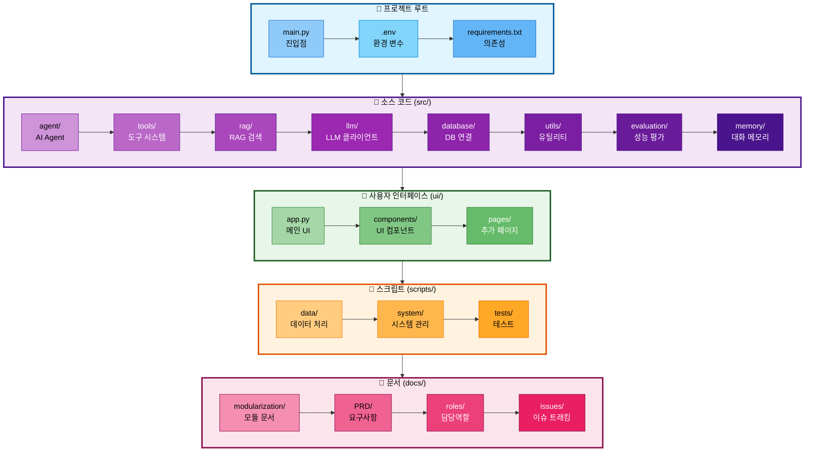

# 멘토링 질의응답 (2025.11.04)

## 프로젝트 개요

### 프로젝트명
**논문 리뷰 챗봇 (AI Agent + RAG)**

### 팀 정보
- **팀명**: 연결의 민족
- **팀 구성**: 3명
- **프로젝트 기간**: 2025.10.28 ~ 11.06 (10일)
- **발표일**: 11월 6일 (목) 13:00

### 멘토링 참여 명단
- **멘토링 일시**: 2025-11-04
- **수강생**: 최현화, 박재홍, 신준엽

### 프로젝트 소개

본 프로젝트는 AI/ML 논문을 누구나 쉽게 이해하고 활용할 수 있도록 돕는 지능형 논문 리뷰 챗봇입니다. 전문 용어와 수식이 많아 초심자가 논문을 이해하기 어렵고, 초심자와 전문가 간 정보 격차가 크며, LLM의 지식 컷오프로 최신 논문 정보가 부족한 문제를 해결합니다.

LangGraph 기반 AI Agent가 사용자 질문을 분석하여 7가지 도구(일반 답변, RAG 검색, 웹 검색, 용어집, 논문 요약, Text-to-SQL, 파일 저장) 중 적절한 도구를 자동으로 선택합니다. 사용자는 Easy/Hard 모드를 선택하여 난이도에 맞는 답변을 받을 수 있으며, Easy 모드는 쉬운 용어와 비유를 사용하고, Hard 모드는 기술 세부사항과 수식을 포함합니다. PostgreSQL + pgvector 통합 DB를 사용하여 논문 메타데이터와 벡터 검색을 하나의 DB에서 처리하며, 용어집 DB와 논문 DB를 하이브리드 검색하여 전문 용어를 자동으로 설명합니다. Tavily Search API를 통해 최신 논문 정보를 실시간으로 검색할 수 있습니다.

**최신 업데이트**: LLM-as-a-Judge 방식의 실시간 성능 평가 시스템을 Streamlit UI 워크플로우에 통합하여, 모든 답변에 대해 정확도(0-10), 관련성(0-10), 난이도 적합성(0-10), 출처 명시(0-10) 총 4가지 기준으로 자동 평가를 수행하고 결과를 UI에 표시 및 DB에 저장합니다.

### 기술 스택

#### Core Technologies

| 구분 | 기술 | 비고 |
|------|------|------|
| **LLM** | OpenAI GPT-5 / GPT-5 / GPT-5<br/>Upstage Solar Pro2 | Easy: Solar Pro2 (한국어 특화)<br/>Hard: GPT-5 (기술 정확도) |
| **Framework** | Langchain + LangGraph | AI Agent 및 RAG 통합 |
| **Database** | PostgreSQL + pgvector | 관계형 + 벡터 검색 통합 |
| **Embeddings** | OpenAI text-embedding-3-small | 비용 효율적 |
| **UI** | Streamlit | 빠른 개발, 채팅 UI |
| **Web Search** | Tavily Search API | 최신 논문 검색 |
| **Document** | PyPDFLoader, RecursiveCharacterTextSplitter | 논문 처리 |

#### 개발 환경
- Python 3.11.9
- Git + GitHub (Feature Branch 전략)

---

## 프로젝트 아키텍처

### 프로젝트 구조도



---

### 사용자 질문 처리 흐름

```mermaid
graph TB
    subgraph MainFlow["📋 AI Agent 질문 처리 워크플로우"]
        direction TB

        subgraph Input["🔸 질문 입력"]
            direction LR
            Start([▶️ 시작]) --> User[사용자 질문 입력]
            User --> Difficulty{난이도 선택<br/>Easy / Hard}
        end

        subgraph AgentProcessing["🔹 Agent 라우팅"]
            direction LR
            Difficulty --> Router{라우터 노드<br/>질문 분석}
            Router -->|일반 질문| GeneralTool[일반 답변 도구]
            Router -->|논문 검색| RAGTool[RAG 검색 도구]
            Router -->|최신 정보| WebTool[웹 검색 도구]
            Router -->|용어 질문| GlossaryTool[용어집 도구]
            Router -->|요약 요청| SummarizeTool[논문 요약 도구]
            Router -->|통계 조회| Text2SQLTool[Text-to-SQL 도구]
            Router -->|저장 요청| SaveTool[파일 저장 도구]
        end

        subgraph DataRetrieval["🔺 데이터 조회"]
            direction LR
            GeneralTool --> LLMDirect[🤖 LLM 직접 호출]
            RAGTool --> VectorDB[(💾 PGVector<br/>논문 임베딩)]
            GlossaryTool --> PostgreSQL[(💾 PostgreSQL<br/>용어집)]
            Text2SQLTool --> PostgreSQL2[(💾 PostgreSQL<br/>papers 테이블)]
            WebTool --> TavilyAPI[🔍 Tavily API<br/>웹 검색]
        end

        subgraph ResponseGen["🔶 최종 답변 생성"]
            direction LR
            LLMDirect --> LLM["🤖 ChatOpenAI<br>GPT-5<br>or<br>Solar-pro2"]
            VectorDB --> LLM
            PostgreSQL --> LLM
            PostgreSQL2 --> LLM
            TavilyAPI --> LLM
            LLM --> Answer[✅ 최종 답변<br/>난이도 적용]
        end

        subgraph Display["💡 답변 표시"]
            direction LR
            DispStart[답변 준비] --> ShowAnswer[채팅 화면<br/>답변 표시]
            ShowAnswer --> SaveTerms[용어 자동 추출<br/>DB 저장]
        end

        subgraph Evaluation["🔷 품질 평가"]
            direction LR
            EvalStart[평가 시작] --> EvalAnswer[LLM-as-a-Judge<br/>답변 품질 평가]
            EvalAnswer --> SaveEval[평가 결과<br/>DB 저장]
            SaveEval --> ShowEval[평가 결과<br/>UI 표시]
        end

        %% 단계 간 연결
        Input --> AgentProcessing
        AgentProcessing --> DataRetrieval
        DataRetrieval --> ResponseGen
        ResponseGen --> Display
        Answer --> DispStart
        Display --> Evaluation
        SaveTerms --> EvalStart
        ShowEval --> Continue{계속<br/>질문?}
        Continue -->|Yes| Input
        Continue -->|No| End[✅ 종료]
    end

    %% 메인 워크플로우 배경
    style MainFlow fill:#fffde7,stroke:#f9a825,stroke-width:4px,color:#000

    %% Subgraph 스타일
    style Input fill:#e0f7fa,stroke:#006064,stroke-width:3px,color:#000
    style AgentProcessing fill:#f3e5f5,stroke:#4a148c,stroke-width:3px,color:#000
    style DataRetrieval fill:#e8f5e9,stroke:#1b5e20,stroke-width:3px,color:#000
    style ResponseGen fill:#fff3e0,stroke:#e65100,stroke-width:3px,color:#000
    style Display fill:#ffebee,stroke:#c62828,stroke-width:3px,color:#000
    style Evaluation fill:#e3f2fd,stroke:#1565c0,stroke-width:3px,color:#000

    %% 노드 스타일 (입력 - 청록 계열)
    style Start fill:#4db6ac,stroke:#00695c,stroke-width:3px,color:#000
    style User fill:#4dd0e1,stroke:#006064,stroke-width:2px,color:#000
    style Difficulty fill:#ce93d8,stroke:#7b1fa2,stroke-width:2px,color:#000

    %% 노드 스타일 (Agent - 보라 계열)
    style Router fill:#ce93d8,stroke:#6a1b9a,stroke-width:2px,color:#000
    style GeneralTool fill:#e1bee7,stroke:#7b1fa2,stroke-width:2px,color:#000
    style RAGTool fill:#e1bee7,stroke:#7b1fa2,stroke-width:2px,color:#000
    style WebTool fill:#e1bee7,stroke:#7b1fa2,stroke-width:2px,color:#000
    style GlossaryTool fill:#e1bee7,stroke:#7b1fa2,stroke-width:2px,color:#000
    style SummarizeTool fill:#e1bee7,stroke:#7b1fa2,stroke-width:2px,color:#000
    style Text2SQLTool fill:#e1bee7,stroke:#7b1fa2,stroke-width:2px,color:#000
    style SaveTool fill:#e1bee7,stroke:#7b1fa2,stroke-width:2px,color:#000

    %% 노드 스타일 (데이터 조회 - 녹색 계열)
    style LLMDirect fill:#81c784,stroke:#2e7d32,stroke-width:2px,color:#000
    style VectorDB fill:#81c784,stroke:#2e7d32,stroke-width:2px,color:#000
    style PostgreSQL fill:#81c784,stroke:#2e7d32,stroke-width:2px,color:#000
    style PostgreSQL2 fill:#81c784,stroke:#2e7d32,stroke-width:2px,color:#000
    style TavilyAPI fill:#66bb6a,stroke:#1b5e20,stroke-width:2px,color:#000

    %% 노드 스타일 (답변 생성 - 주황 계열)
    style LLM fill:#ffb74d,stroke:#e65100,stroke-width:2px,color:#000
    style Answer fill:#ffa726,stroke:#ef6c00,stroke-width:2px,color:#000

    %% 노드 스타일 (답변 표시 - 빨강 계열)
    style DispStart fill:#ef9a9a,stroke:#c62828,stroke-width:2px,color:#000
    style ShowAnswer fill:#e57373,stroke:#c62828,stroke-width:2px,color:#000
    style SaveTerms fill:#ef5350,stroke:#b71c1c,stroke-width:2px,color:#000

    %% 노드 스타일 (품질 평가 - 파랑 계열)
    style EvalStart fill:#90caf9,stroke:#0d47a1,stroke-width:2px,color:#000
    style EvalAnswer fill:#64b5f6,stroke:#1565c0,stroke-width:2px,color:#000
    style SaveEval fill:#42a5f5,stroke:#0d47a1,stroke-width:2px,color:#000
    style ShowEval fill:#2196f3,stroke:#01579b,stroke-width:2px,color:#000

    %% 노드 스타일 (흐름 제어)
    style Continue fill:#ce93d8,stroke:#6a1b9a,stroke-width:2px,color:#000
    style End fill:#66bb6a,stroke:#2e7d32,stroke-width:2px,color:#000

    %% 연결선 스타일 (단계별 색상)
    %% 질문 입력 (청록 - 0~2)
    linkStyle 0 stroke:#006064,stroke-width:2px
    linkStyle 1 stroke:#006064,stroke-width:2px

    %% Agent 라우팅 (보라 - 3~10)
    linkStyle 2 stroke:#7b1fa2,stroke-width:2px
    linkStyle 3 stroke:#7b1fa2,stroke-width:2px
    linkStyle 4 stroke:#7b1fa2,stroke-width:2px
    linkStyle 5 stroke:#7b1fa2,stroke-width:2px
    linkStyle 6 stroke:#7b1fa2,stroke-width:2px
    linkStyle 7 stroke:#7b1fa2,stroke-width:2px
    linkStyle 8 stroke:#7b1fa2,stroke-width:2px
    linkStyle 9 stroke:#7b1fa2,stroke-width:2px

    %% 데이터 조회 (녹색 - 11~15)
    linkStyle 10 stroke:#2e7d32,stroke-width:2px
    linkStyle 11 stroke:#2e7d32,stroke-width:2px
    linkStyle 12 stroke:#2e7d32,stroke-width:2px
    linkStyle 13 stroke:#2e7d32,stroke-width:2px
    linkStyle 14 stroke:#2e7d32,stroke-width:2px

    %% 답변 생성 (주황 - 16~21)
    linkStyle 15 stroke:#e65100,stroke-width:2px
    linkStyle 16 stroke:#e65100,stroke-width:2px
    linkStyle 17 stroke:#e65100,stroke-width:2px
    linkStyle 18 stroke:#e65100,stroke-width:2px
    linkStyle 19 stroke:#e65100,stroke-width:2px
    linkStyle 20 stroke:#e65100,stroke-width:2px

    %% 답변 표시 (빨강 - 22~24)
    linkStyle 21 stroke:#c62828,stroke-width:2px
    linkStyle 22 stroke:#c62828,stroke-width:2px
    linkStyle 23 stroke:#c62828,stroke-width:2px

    %% 품질 평가 (파랑 - 25~28)
    linkStyle 24 stroke:#1565c0,stroke-width:2px
    linkStyle 25 stroke:#1565c0,stroke-width:2px
    linkStyle 26 stroke:#1565c0,stroke-width:2px
    linkStyle 27 stroke:#1565c0,stroke-width:2px

    %% 흐름 제어 (보라 - 29~31)
    linkStyle 28 stroke:#7b1fa2,stroke-width:2px
    linkStyle 29 stroke:#7b1fa2,stroke-width:2px
    linkStyle 30 stroke:#7b1fa2,stroke-width:2px

    %% 단계 간 연결 (회색 - 32~36)
    linkStyle 31 stroke:#616161,stroke-width:3px
    linkStyle 32 stroke:#616161,stroke-width:3px
    linkStyle 33 stroke:#616161,stroke-width:3px
    linkStyle 34 stroke:#616161,stroke-width:3px
    linkStyle 35 stroke:#616161,stroke-width:3px
```



---

## Q&A

### Q1. 하이브리드 도구 패턴 설계의 적절성

현재 프로젝트에서 단일 도구 내부에서 여러 시스템(VectorDB, PostgreSQL, LLM)을 조합하여 사용하는 "하이브리드 도구 패턴"을 구현했습니다.

**구현한 하이브리드 패턴:**

| 도구 | 조합 패턴 | 내부 동작 |
|------|----------|----------|
| **web_search** | Tavily API + LLM | 1) Tavily API로 웹 검색<br/>2) LLM이 검색 결과를 난이도에 맞게 재구성 |
| **search_paper** | VectorDB + PostgreSQL + LLM | 1) PGVector로 유사 논문 검색<br/>2) PostgreSQL에서 메타데이터 조회<br/>3) LLM이 결과를 난이도에 맞게 답변 생성 |
| **glossary** | VectorDB + PostgreSQL + LLM | 1) glossary_embeddings 컬렉션 유사도 검색<br/>2) glossary 테이블 ILIKE 키워드 검색<br/>3) 두 결과 병합 및 중복 제거<br/>4) LLM이 난이도별 설명 선택 및 답변 생성 |
| **summarize** | VectorDB + PostgreSQL + LLM | 1) 질문에서 논문 제목 추출(LLM)<br/>2) PostgreSQL에서 논문 메타데이터 조회<br/>3) PGVector에서 논문 청크 검색<br/>4) LLM이 요약 생성 |
| **text2sql** | Text-to-SQL + PostgreSQL + LLM | 1) 질문을 SQL로 변환(LLM)<br/>2) PostgreSQL에서 통계 조회<br/>3) LLM이 결과를 난이도에 맞게 설명 |

**설계 의도:**
- 각 도구가 자체적으로 완결된 기능 제공
- Agent는 단순히 도구를 선택하기만 하면 됨
- 사용자 관점에서 일관된 경험 제공

**궁금한 점:**
1. 단일 도구 내부에서 여러 시스템을 조합하는 것이 적절한 설계인가요?
2. 아니면 각 시스템(검색, DB 조회, 답변 생성)을 별도 도구로 분리하고 Agent가 순차적으로 호출하도록 하는 것이 더 나은가요?
3. 현재 방식의 장단점과 개선 방향이 있다면 무엇인가요?
4. 특히 `search_paper`와 `summarize` 도구는 내부 로직이 복잡한데, 이를 더 작은 단위로 분해해야 하나요?

**배경:**
- LangGraph Agent가 여러 도구를 순차적으로 호출하는 것보다 단일 도구로 완결된 답변을 제공하는 것이 사용자 경험에 좋다고 판단
- 하지만 도구 내부 복잡도가 높아져 테스트와 유지보수가 어려울 수 있음

**A1.**

(멘토님 답변 대기)

---

### Q2. Text-to-SQL 도구의 안전성과 구현 방식

자연어 질문을 SQL로 변환하여 PostgreSQL 논문 메타데이터 테이블을 조회하는 `text2sql` 도구를 구현했습니다.

**구현 방식:**
```python
# 1. 자연어 질문 → SQL 변환 (LLM 사용)
sql_prompt = f"""
다음 질문을 papers 테이블을 조회하는 SQL로 변환하세요.

테이블 스키마:
- papers(paper_id, title, authors, publish_date, category, abstract, citation_count)

질문: {question}

SQL:
"""

# 2. 생성된 SQL 실행
sql_query = llm.invoke(sql_prompt)
results = db.execute(sql_query)

# 3. 결과를 LLM이 난이도에 맞게 설명
```

**안전성 고려사항:**
- SQL Injection 방지를 위해 읽기 전용(SELECT) 쿼리만 허용
- `papers` 테이블에만 접근 허용
- 위험한 키워드(DROP, DELETE, UPDATE, INSERT) 필터링

**궁금한 점:**
1. LLM이 생성한 SQL을 그대로 실행하는 것이 안전한가요?
2. SQL Injection 공격을 방지하기 위한 추가적인 검증 방법이 있나요?
3. 생성된 SQL의 유효성을 검증하는 별도 단계가 필요한가요?
4. 실무에서 Text-to-SQL을 사용할 때 권장되는 베스트 프랙티스가 있나요?

**배경:**
- 논문 통계 조회 기능(연도별 논문 수, 카테고리별 분포 등)을 사용자 친화적으로 제공하기 위해 Text-to-SQL 도입
- 하지만 LLM이 생성한 SQL을 직접 실행하는 것에 대한 보안 우려

**A2.**

(멘토님 답변 대기)

---

### Q3. 실시간 성능 평가 시스템 통합의 적절성

LLM-as-a-Judge 방식의 성능 평가 시스템을 Streamlit UI 워크플로우에 실시간으로 통합했습니다.

**구현 방식:**
```python
# ui/components/chat_interface.py (313-376번째 줄)

# 1. 답변 생성 후 자동으로 평가 시작
evaluation_result = None
try:
    with st.spinner("📊 답변 품질 평가 중..."):
        # 참고 문서 준비
        reference_docs = ""
        if "source_documents" in response:
            for doc in response["source_documents"]:
                doc_text = f"제목: {metadata.get('title', 'N/A')}\n"
                doc_text += f"저자: {metadata.get('authors', 'N/A')}\n"
                reference_docs += doc_text

        # 평가 수행 (AnswerEvaluator 사용)
        evaluator = AnswerEvaluator(exp_manager=exp_manager)
        evaluation_result = evaluator.evaluate(
            question=prompt,
            answer=answer,
            reference_docs=reference_docs,
            difficulty=difficulty
        )

        # DB 저장
        save_evaluation_results([evaluation_result])

# 2. 평가 결과 UI 표시
if evaluation_result:
    with st.expander("📊 답변 품질 평가 결과", expanded=False):
        col1, col2 = st.columns(2)
        with col1:
            st.metric("정확도", f"{evaluation_result.get('accuracy_score', 0)}/10")
            st.metric("관련성", f"{evaluation_result.get('relevance_score', 0)}/10")
        with col2:
            st.metric("난이도 적합성", f"{evaluation_result.get('difficulty_score', 0)}/10")
            st.metric("출처 명시", f"{evaluation_result.get('citation_score', 0)}/10")
```

**평가 기준:**
- **정확도 (0-10점)**: 참고 문서의 내용과 일치하는가?
- **관련성 (0-10점)**: 질문과 답변이 관련있는가?
- **난이도 적합성 (0-10점)**: 난이도 모드에 맞는 답변인가?
- **출처 명시 (0-10점)**: 논문 제목, 저자를 명시했는가?

**궁금한 점:**
1. 모든 답변마다 실시간으로 평가를 수행하는 것이 적절한가요? (API 비용 증가)
2. 평가를 선택적으로 수행하거나 비동기로 처리하는 것이 더 나은가요?
3. LLM-as-a-Judge의 평가 결과를 얼마나 신뢰할 수 있나요?
4. 4가지 평가 기준이 적절한가요? 추가하거나 제거해야 할 기준이 있나요?
5. 평가 결과를 발표 시연에서 어떻게 활용하면 좋을까요?

**배경:**
- 이전 멘토링(10/30)에서는 성능 평가 시스템이 별도 스크립트로만 존재했음
- 실제 워크플로우에 통합하여 답변 품질을 실시간으로 모니터링할 수 있도록 개선
- 평가 결과를 DB에 저장하여 추후 분석 가능

**A3.**

(멘토님 답변 대기)

---

### Q4. 프롬프트 엔지니어링 기법 적용 검증

이전 멘토링(10/30)에서 받은 프롬프트 엔지니어링 피드백을 적용하여 시스템을 개선했습니다.

**이전 멘토링 피드백과 적용 현황:**

| 피드백 항목 | 적용 여부 | 구현 내용 |
|-----------|---------|----------|
| **Few-shot 예시 추가** | ✅ 완료 | routing_prompts.json에 13개 Few-shot 예시 추가<br/>- 7개 도구별 대표 예시<br/>- 헷갈리는 케이스(비교 질문, 최신 정보) 구분 |
| **도구 설명 상세화** | ✅ 완료 | 각 도구별 사용 시나리오, 키워드, 예시, 주의사항(❌) 명시<br/>- search_paper: "논문", "연구", "방법", "알고리즘"<br/>- web_search: "최신", "2024년", "뉴스", "트렌드" |
| **난이도별 프롬프트 템플릿** | ✅ 완료 | tool_prompts.json에 모든 도구의 easy/hard 프롬프트 분리<br/>- Easy: "쉬운 언어", "비유 사용", "간단 요약"<br/>- Hard: "기술 용어", "수식 포함", "복잡도 분석" |
| **Structured Output 사용** | ❓ 확인 필요 | 평가 시스템에서 JSON 스키마 사용 중이나,<br/>`llm.with_structured_output()` 사용 여부 불확실 |
| **메타데이터 필터링** | ✅ 부분 완료 | PostgreSQL + pgvector에서 category, publish_date 필터 가능<br/>하지만 실제 검색에서 활용도는 제한적 |

**구현 예시 - 라우팅 프롬프트:**
```python
# routing_prompts.json (일부 발췌)
{
  "routing_prompt": "당신은 사용자 질문을 분석하여 가장 적절한 도구를 선택하는 전문가입니다.\n\n[도구 목록 및 사용 시나리오]\n\n1. **search_paper** (논문 데이터베이스 검색)\n   - 사용 시기: 특정 논문 내용, 연구 방법, 알고리즘 검색\n   - 키워드: \"논문\", \"연구\", \"방법\", \"알고리즘\"\n   - ❌ 최신 정보는 web_search 사용\n\n3. **glossary** (용어집 - 단일 용어 정의만)\n   - 사용 시기: 하나의 전문 용어 정의와 설명\n   - ❌ 비교 질문은 general 사용\n   ...",

  "few_shot_examples": [
    {"question": "BERT가 뭐야?", "tool": "glossary"},
    {"question": "BERT와 GPT의 차이는?", "tool": "general"},
    {"question": "2024년에 발표된 논문 개수는?", "tool": "text2sql"},
    ...
  ]
}
```

**구현 예시 - 난이도별 프롬프트:**
```python
# tool_prompts.json (일부 발췌)
{
  "general_answer_prompts": {
    "easy": {
      "system_prompt": "당신은 친절한 AI 어시스턴트입니다.\n초심자도 이해할 수 있도록 쉽고 명확하게 답변해주세요.\n\n답변 규칙:\n- 전문 용어는 최소화하고 일상적인 언어를 사용하세요\n- 복잡한 개념은 간단한 비유로 설명하세요\n- 핵심 아이디어 3가지 이내로 요약하세요"
    },
    "hard": {
      "system_prompt": "당신은 전문적인 AI 어시스턴트입니다.\n기술적인 세부사항을 포함하여 정확하고 전문적으로 답변해주세요.\n\n답변 규칙:\n- 기술 용어와 전문 개념을 자유롭게 사용하세요\n- 알고리즘의 시간/공간 복잡도를 분석하세요\n- 관련 논문과의 비교를 포함하세요"
    }
  }
}
```

**궁금한 점:**
1. 이전 멘토링 피드백이 제대로 적용되었나요?
2. Few-shot 예시 13개가 충분한가요? 더 추가해야 할 케이스가 있나요?
3. Structured Output을 평가 시스템뿐만 아니라 다른 도구에도 적용해야 하나요?
4. 난이도별 프롬프트가 실제로 답변 품질 차이를 만들어내는지 검증 방법이 있나요?
5. 프롬프트 개선을 위해 추가로 적용해야 할 기법이 있나요?

**배경:**
- 이전 멘토링 피드백을 최대한 반영하여 시스템 개선
- 프롬프트가 프로젝트의 핵심 차별화 요소이므로 정확한 적용이 중요
- 발표 시 "멘토링 피드백 반영" 항목으로 강조 예정

**A4.**

(멘토님 답변 대기)

---

### Q5. 프로젝트 목표 대비 구현 적합성 평가

프로젝트의 핵심 목표는 **"AI/ML 논문을 초심자도 쉽게 이해하고 활용할 수 있도록 돕는 것"**입니다.

**구현한 핵심 기능과 목표 정렬:**

| 기능 | 프로젝트 목표 기여도 | 실제 활용성 |
|------|-------------------|----------|
| **Easy/Hard 난이도 선택** | ⭐⭐⭐⭐⭐ 핵심 기능 | 초심자는 Easy, 전문가는 Hard 모드로 맞춤형 답변 제공 |
| **용어집 도구 (Glossary)** | ⭐⭐⭐⭐⭐ 핵심 기능 | 논문의 전문 용어를 쉽게 설명하여 초심자 이해 도움 |
| **논문 요약 도구** | ⭐⭐⭐⭐ 중요 | 긴 논문을 빠르게 파악 가능 |
| **RAG 검색 도구** | ⭐⭐⭐⭐ 중요 | 특정 주제 논문을 빠르게 찾아 정보 제공 |
| **웹 검색 도구** | ⭐⭐⭐ 보조 | 최신 정보 보완 (LLM 지식 컷오프 문제 해결) |
| **Text-to-SQL 도구** | ⭐⭐ 부가 | 논문 통계 제공 (활용도 검증 필요) |
| **파일 저장 도구** | ⭐ 편의 기능 | 대화 내용 저장 (사용 빈도 낮을 것으로 예상) |

**프로젝트 목표 달성 현황:**

| 목표 문제 | 해결 방법 | 달성도 |
|----------|----------|-------|
| **전문 용어가 어려움** | Glossary 도구 + Easy 모드 비유 설명 | ✅ 충분 |
| **초심자-전문가 격차** | Easy/Hard 난이도별 프롬프트 | ✅ 충분 |
| **LLM 지식 컷오프** | Web Search 도구 (Tavily API) | ✅ 충분 |
| **긴 논문 이해 어려움** | Summarize 도구 | ✅ 충분 |

**우려 사항:**
- **Text-to-SQL 도구**: 초심자가 "2024년 논문 개수" 같은 통계 질문을 실제로 하는지 불확실
- **파일 저장 도구**: 기능은 있지만 사용 빈도가 낮을 것으로 예상
- **7개 도구**: 도구 개수가 너무 많아 라우팅 정확도에 영향을 줄 수 있음

**궁금한 점:**
1. 프로젝트 목표("초심자도 쉽게 이해")를 고려할 때, 현재 구현이 적절한가요?
2. Text-to-SQL과 파일 저장 도구가 프로젝트 핵심 목표에 기여하는지, 아니면 불필요한 복잡도를 추가하는 건 아닌가요?
3. 7개 도구가 적절한가요? 일부 도구를 통합하거나 제거하는 것이 나을까요?
4. Easy 모드 답변이 실제로 초심자에게 이해하기 쉬운지 검증하는 방법이 있나요?
5. 발표 시연에서 프로젝트 목표를 효과적으로 보여주기 위한 시나리오 추천이 있나요?

**배경:**
- 기능을 많이 추가하다 보니 프로젝트 핵심 목표에서 벗어났을 수 있음
- 발표 시 "초심자를 위한 논문 리뷰 챗봇"이라는 차별점을 명확히 보여줘야 함
- 남은 시간(11/4~11/6)을 고려할 때 핵심 기능 완성도를 높이는 것이 중요

**A5.**

(멘토님 답변 대기)

---

## 멘토링 요약

### 핵심 질문 정리

1. **하이브리드 도구 패턴**: 단일 도구 내부에서 여러 시스템을 조합하는 설계가 적절한가?
2. **Text-to-SQL 안전성**: LLM이 생성한 SQL을 직접 실행하는 것의 보안 문제와 베스트 프랙티스
3. **실시간 평가 시스템**: 모든 답변마다 실시간 평가를 수행하는 것이 적절한가? API 비용 vs 품질 모니터링
4. **프롬프트 엔지니어링**: 이전 멘토링 피드백이 제대로 적용되었는지 검증 및 추가 개선 방향
5. **프로젝트 목표 정렬**: "초심자를 위한 논문 리뷰"라는 핵심 목표에 현재 구현이 적합한지

### 다음 액션 아이템

**즉시 실행 (11/4):**
- [ ] 멘토링 피드백 반영
- [ ] 하이브리드 도구 패턴 검토 및 필요시 리팩토링
- [ ] Text-to-SQL 보안 강화 (SQL 검증 로직 추가)
- [ ] 실시간 평가 시스템 성능 최적화 고려

**11/5:**
- [ ] 발표 시연 시나리오 작성 (Easy/Hard 차이 명확히 보여주기)
- [ ] 핵심 기능 완성도 점검
- [ ] 10개 테스트 케이스로 라우팅 정확도 검증
- [ ] Structured Output 적용 범위 확대 검토

**11/6 (발표일):**
- [ ] 발표 자료 최종 점검
- [ ] Q&A 예상 질문 리스트 준비
- [ ] 데모 리허설 (Easy vs Hard 비교, 실시간 평가 결과 표시)

---

## 참고 자료

### 구현 관련 문서
- [docs/modularization/14_하이브리드_도구_패턴.md](../../modularization/14_하이브리드_도구_패턴.md) - 하이브리드 도구 패턴 설계
- [docs/modularization/05_프롬프트_엔지니어링.md](../../modularization/05_프롬프트_엔지니어링.md) - 프롬프트 엔지니어링 전략
- [docs/modularization/10_성능평가시스템.md](../../modularization/10_성능평가시스템.md) - LLM-as-a-Judge 평가 시스템
- [docs/modularization/06_도구_시스템.md](../../modularization/06_도구_시스템.md) - 7가지 도구 상세 설명

### 프롬프트 파일
- [prompts/routing_prompts.json](../../../prompts/routing_prompts.json) - 라우팅 프롬프트 및 Few-shot 예시
- [prompts/tool_prompts.json](../../../prompts/tool_prompts.json) - 도구별 난이도별 프롬프트
- [prompts/evaluation_prompts.json](../../../prompts/evaluation_prompts.json) - 평가 기준 및 프롬프트

### 이전 멘토링 문서
- [docs/minutes/20251030/20251030_멘토링.md](../20251030/20251030_멘토링.md) - 10/30 멘토링 피드백

---

## 작성자

- **최현화[팀장]**, 박재홍, 신준엽
