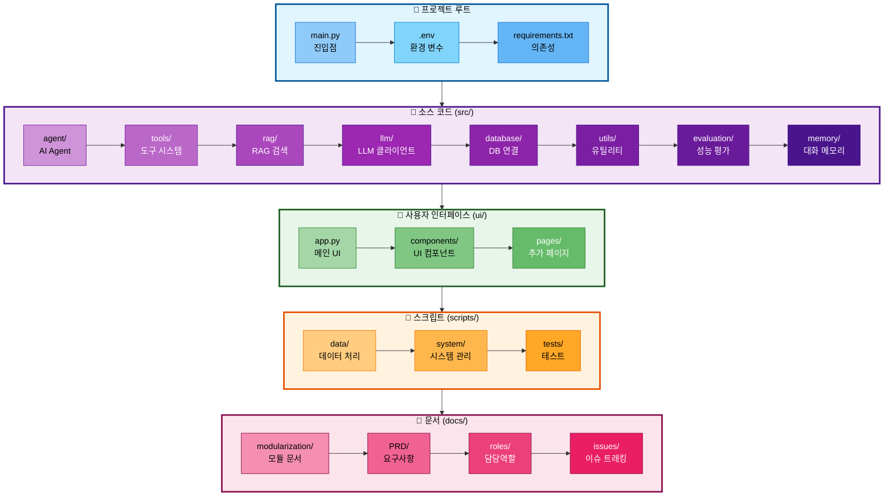
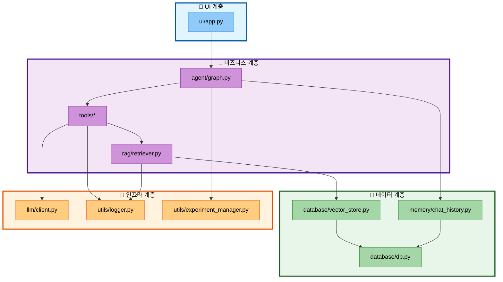

# 00. 프로젝트 구조

## 문서 정보
- **작성일**: 2025-11-04
- **작성자**: 최현화[팀장]
- **최종 수정일**: 2025-11-04

---

## 개요

본 문서는 논문 리뷰 챗봇 프로젝트의 **전체 디렉토리 구조와 파일 조직**을 설명합니다. 프로젝트는 **모듈화 원칙**에 따라 기능별로 분리된 디렉토리 구조를 가지고 있으며, 각 디렉토리는 명확한 책임을 가집니다.

### 핵심 설계 원칙
1. **관심사의 분리 (Separation of Concerns)**: 소스 코드, 스크립트, 데이터, 문서를 명확히 구분
2. **모듈화 (Modularity)**: 기능별로 독립된 모듈 구조
3. **계층화 (Layering)**: UI, 비즈니스 로직, 데이터 계층 분리
4. **확장성 (Scalability)**: 새로운 기능 추가가 용이한 구조

---

## 프로젝트 구조도



**구조도 설명:**
- **프로젝트 루트**: 진입점과 설정 파일
- **소스 코드 (src/)**: 핵심 비즈니스 로직 (Agent, Tools, RAG, LLM, Database, Evaluation 등)
- **사용자 인터페이스 (ui/)**: Streamlit 기반 웹 UI
- **스크립트 (scripts/)**: 데이터 처리, 시스템 관리, 테스트 스크립트
- **문서 (docs/)**: 설계 문서, PRD, 역할 문서, 이슈 트래킹

---

## 전체 디렉토리 구조

```
langchain-project/
│
├── 📄 main.py                          # 메인 진입점 (AI Agent 실행)
├── 📄 requirements.txt                 # Python 의존성 패키지
├── 📄 .env                             # 환경 변수 (API 키, DB 설정)
├── 📄 .env.example                     # 환경 변수 템플릿
├── 📄 .gitignore                       # Git 무시 파일
├── 📄 README.md                        # 프로젝트 소개
│
├── 📂 src/                             # 소스 코드
│   ├── 📂 agent/                       # AI Agent 시스템
│   │   ├── __init__.py
│   │   ├── state.py                    # Agent 상태 정의
│   │   ├── graph.py                    # LangGraph 그래프 구성
│   │   └── nodes.py                    # Agent 노드 정의
│   │
│   ├── 📂 tools/                       # AI Agent 도구
│   │   ├── __init__.py
│   │   ├── general_answer.py           # 일반 답변 도구
│   │   ├── search_paper.py             # 논문 검색 도구
│   │   ├── summarize.py                # 논문 요약 도구
│   │   ├── glossary.py                 # 용어 설명 도구
│   │   ├── web_search.py               # 웹 검색 도구
│   │   ├── text2sql.py                 # Text-to-SQL 도구
│   │   ├── arxiv_handler.py            # arXiv 논문 다운로드 도구
│   │   └── save_file.py                # 파일 저장 도구
│   │
│   ├── 📂 rag/                         # RAG 시스템
│   │   └── retriever.py                # RAG 검색 로직
│   │
│   ├── 📂 llm/                         # LLM 클라이언트
│   │   ├── __init__.py
│   │   └── client.py                   # OpenAI/Solar LLM 클라이언트
│   │
│   ├── 📂 database/                    # 데이터베이스 연결
│   │   ├── db.py                       # PostgreSQL 연결
│   │   ├── vector_store.py             # VectorDB 관리
│   │   └── embeddings.py               # Embeddings 생성
│   │
│   ├── 📂 memory/                      # 대화 메모리
│   │   ├── __init__.py
│   │   └── chat_history.py             # PostgreSQL 채팅 히스토리
│   │
│   ├── 📂 prompts/                     # 프롬프트 관리
│   │   ├── __init__.py
│   │   └── loader.py                   # 프롬프트 템플릿 로더
│   │
│   ├── 📂 data/                        # 데이터 로더
│   │   └── document_loader.py          # 문서 로딩
│   │
│   ├── 📂 utils/                       # 유틸리티
│   │   ├── __init__.py
│   │   ├── logger.py                   # 로깅 시스템
│   │   ├── experiment_manager.py       # 실험 관리 시스템
│   │   ├── config_loader.py            # 설정 파일 로더
│   │   └── glossary_extractor.py       # 용어 추출
│   │
│   ├── 📂 evaluation/                  # 성능 평가 시스템
│   │   ├── __init__.py
│   │   ├── evaluator.py                # LLM-as-a-Judge 평가
│   │   └── storage.py                  # 평가 결과 저장/조회
│   │
│   ├── 📂 papers/                      # 논문 도메인
│   │   ├── domain/
│   │   │   └── dto.py                  # 논문 DTO
│   │   └── infra/
│   │       └── arxiv_client.py         # arXiv API 클라이언트
│   │
│   ├── 📂 text2sql/                    # Text-to-SQL (예약됨)
│   │
│   └── __init__.py
│
├── 📂 ui/                              # Streamlit UI
│   ├── app.py                          # 메인 UI 진입점
│   │
│   ├── 📂 components/                  # UI 컴포넌트
│   │   ├── chat_interface.py           # 채팅 인터페이스
│   │   ├── chat_manager.py             # 채팅 세션 관리
│   │   ├── sidebar.py                  # 사이드바
│   │   ├── file_download.py            # 파일 다운로드
│   │   └── storage.py                  # 세션 스토리지
│   │
│   ├── 📂 pages/                       # 추가 페이지
│   │   └── 1_📚_Glossary.py            # 용어집 페이지
│   │
│   ├── 📂 test/                        # UI 테스트
│   │   └── paper_review_app.py         # 테스트 앱
│   │
│   ├── 📂 assets/                      # 정적 파일 (이미지 등)
│   │
│   └── __init__.py
│
├── 📂 scripts/                         # 스크립트
│   ├── evaluate_answers.py             # 답변 평가 스크립트
│   │
│   ├── 📂 data/                        # 데이터 처리 스크립트
│   │   ├── collect_arxiv_papers.py     # arXiv 논문 수집
│   │   ├── process_documents.py        # 문서 전처리
│   │   ├── load_embeddings.py          # 임베딩 생성 및 로드
│   │   ├── setup_database.py           # DB 초기 설정
│   │   ├── update_glossary_explanations.py  # 용어집 업데이트
│   │   ├── inspect_vector_db.py        # VectorDB 검사
│   │   └── run_full_pipeline.py        # 전체 파이프라인 실행
│   │
│   ├── 📂 system/                      # 시스템 관리 스크립트
│   │   ├── find_experiments.py         # 실험 로그 검색
│   │   └── aggregate_metrics.py        # 메트릭 집계
│   │
│   ├── 📂 tests/                       # 테스트 스크립트
│   │   ├── unit/                       # 단위 테스트
│   │   │   ├── test_db_connection.py   # DB 연결 테스트
│   │   │   ├── test_experiment_manager.py  # 실험 관리 테스트
│   │   │   ├── test_crud_operations.py # CRUD 테스트
│   │   │   ├── test_vector_store.py    # VectorDB 테스트
│   │   │   ├── test_rag.py             # RAG 테스트
│   │   │   ├── init_database.py        # DB 초기화 테스트
│   │   │   └── tools/                  # 도구 테스트
│   │   │       ├── test_arxiv_handler.py
│   │   │       └── test_summarize.py
│   │   │
│   │   └── integration/                # 통합 테스트
│   │       ├── test_integration.py     # 통합 테스트
│   │       └── test_data_pipeline.py   # 데이터 파이프라인 테스트
│   │
│   └── 📂 debug/                       # 디버깅 스크립트
│       ├── check_db.py                 # DB 상태 확인
│       ├── check_db2.py
│       ├── check_bert_chunks.py        # BERT 청크 확인
│       └── test_summarize_debug.py     # 요약 디버깅
│
├── 📂 data/                            # 데이터 디렉토리
│   ├── 📂 raw/                         # 원본 데이터
│   │   └── pdfs/                       # PDF 파일
│   │
│   ├── 📂 processed/                   # 전처리된 데이터
│   │
│   ├── 📂 rdbms/                       # RDBMS 데이터 (PostgreSQL)
│   │
│   └── 📂 vectordb/                    # VectorDB 데이터
│       └── papers_faiss/               # FAISS 인덱스
│
├── 📂 configs/                         # 설정 파일
│   └── collect/                        # 수집 설정
│
├── 📂 logs/                            # 로그 파일
│   └── experiments/                    # 실험 로그
│       └── YYYYMMDD_HHMMSS/            # 실험별 디렉토리
│
├── 📂 notebooks/                       # Jupyter 노트북
│   ├── base/                           # 기본 노트북
│   └── team/                           # 팀원 노트북
│
├── 📂 docs/                            # 문서
│   ├── 📂 modularization/              # 모듈화 문서
│   │   ├── 00_프로젝트_구조.md         # 프로젝트 구조 (본 문서)
│   │   ├── 01_개발환경_및_기술스택.md
│   │   ├── 01_로깅_시스템.md
│   │   ├── 02_실험_관리_시스템.md
│   │   ├── 03_AI_Agent_시스템.md
│   │   ├── 04_LLM_클라이언트.md
│   │   ├── 05_대화_메모리_시스템.md
│   │   ├── 05_프롬프트_엔지니어링.md
│   │   ├── 06_도구_시스템.md
│   │   ├── 07_Streamlit_UI_시스템.md
│   │   ├── 08_데이터베이스_시스템.md
│   │   ├── 09_RAG_시스템.md
│   │   └── 10_성능평가시스템.md
│   │
│   ├── 📂 PRD/                         # PRD (Product Requirements Document)
│   │   ├── 01_프로젝트_개요.md
│   │   ├── 02_유저_페르소나.md
│   │   ├── 03_핵심_기능_명세.md
│   │   ├── 04_AI_Agent_아키텍처.md
│   │   ├── 05_RAG_시스템_설계.md
│   │   ├── 06_데이터베이스_설계.md
│   │   ├── 07_UI_UX_설계.md
│   │   ├── 08_프롬프트_전략.md
│   │   ├── 09_평가_기준.md
│   │   └── 10_기술_요구사항.md
│   │
│   ├── 📂 roles/                       # 담당역할 문서
│   │   ├── 담당역할_01_이예포_로깅시스템.md
│   │   ├── 담당역할_02_윤정인_실험관리.md
│   │   ├── 담당역할_03_강도형_AI_Agent.md
│   │   ├── 담당역할_04_권지원_LLM_클라이언트.md
│   │   ├── 담당역할_05-1_신준엽_Text-to-SQL.md
│   │   └── 담당역할_05-2_최현화_성능평가시스템.md
│   │
│   ├── 📂 issues/                      # 이슈 트래킹 문서
│   │   ├── 05-1_Text-to-SQL_구현.md
│   │   ├── 05-2_성능평가시스템_구현.md
│   │   └── merge/                      # 병합 관련 이슈
│   │
│   ├── 📂 usage/                       # 사용 가이드
│   │   ├── team/                       # 팀원별 사용 가이드
│   │   └── tests/                      # 테스트 가이드
│   │
│   ├── 📂 architecture/                # 아키텍처 문서
│   │
│   ├── 📂 scenarios/                   # 시나리오 문서
│   │
│   ├── 📂 rules/                       # 코딩 규칙
│   │   ├── annotate_style.md           # 한글 주석 스타일 가이드
│   │   ├── mermaid_style.md            # Mermaid 다이어그램 스타일 가이드
│   │   └── commit_msg.md               # 커밋 메시지 가이드
│   │
│   ├── 📂 minutes/                     # 회의록
│   │   ├── 20251028/
│   │   ├── 20251029/
│   │   ├── 20251030/
│   │   ├── 20251031/
│   │   └── 20251103/
│   │
│   ├── 📂 experiments/                 # 실험 문서
│   │   └── 20251101/
│   │
│   └── 📂 errors/                      # 에러 기록
│
├── 📂 .streamlit/                      # Streamlit 설정
│   └── config.toml                     # Streamlit 설정 파일
│
└── 📂 .github/                         # GitHub 설정
    └── ISSUE_TEMPLATE/                 # 이슈 템플릿
```

---

## 디렉토리별 상세 설명

### 1. 프로젝트 루트

| 파일/디렉토리 | 설명 |
|-------------|------|
| **main.py** | 메인 진입점 - AI Agent 실행 |
| **requirements.txt** | Python 의존성 패키지 목록 |
| **.env** | 환경 변수 (API 키, DB 설정) - Git에 포함되지 않음 |
| **.env.example** | 환경 변수 템플릿 - Git에 포함됨 |
| **.gitignore** | Git 무시 파일 목록 |
| **README.md** | 프로젝트 소개 및 실행 가이드 |

---

### 2. src/ - 소스 코드

#### 2.1 agent/ - AI Agent 시스템

| 파일 | 설명 | 문서 참조 |
|------|------|----------|
| **state.py** | Agent 상태 정의 (AgentState 클래스) | [03_AI_Agent_시스템.md](./03_AI_Agent_시스템.md) |
| **graph.py** | LangGraph 그래프 구성 (create_graph 함수) | [03_AI_Agent_시스템.md](./03_AI_Agent_시스템.md) |
| **nodes.py** | Agent 노드 정의 (router, call_tool 등) | [03_AI_Agent_시스템.md](./03_AI_Agent_시스템.md) |

#### 2.2 tools/ - AI Agent 도구

| 파일 | 설명 | 문서 참조 |
|------|------|----------|
| **general_answer.py** | 일반 답변 도구 (쉬운/어려운 모드) | [06_도구_시스템.md](./06_도구_시스템.md) |
| **search_paper.py** | 논문 검색 도구 (RAG 검색) | [06_도구_시스템.md](./06_도구_시스템.md) |
| **summarize.py** | 논문 요약 도구 | [06_도구_시스템.md](./06_도구_시스템.md) |
| **glossary.py** | 용어 설명 도구 | [06_도구_시스템.md](./06_도구_시스템.md) |
| **web_search.py** | 웹 검색 도구 (Tavily API) | [06_도구_시스템.md](./06_도구_시스템.md) |
| **text2sql.py** | Text-to-SQL 도구 | [06_도구_시스템.md](./06_도구_시스템.md) |
| **arxiv_handler.py** | arXiv 논문 다운로드 도구 | [06_도구_시스템.md](./06_도구_시스템.md) |
| **save_file.py** | 파일 저장 도구 | [06_도구_시스템.md](./06_도구_시스템.md) |

#### 2.3 rag/ - RAG 시스템

| 파일 | 설명 | 문서 참조 |
|------|------|----------|
| **retriever.py** | RAG 검색 로직 (PGVector + HyDE) | [09_RAG_시스템.md](./09_RAG_시스템.md) |

#### 2.4 llm/ - LLM 클라이언트

| 파일 | 설명 | 문서 참조 |
|------|------|----------|
| **client.py** | OpenAI/Solar LLM 클라이언트 (Singleton) | [04_LLM_클라이언트.md](./04_LLM_클라이언트.md) |

#### 2.5 database/ - 데이터베이스 연결

| 파일 | 설명 | 문서 참조 |
|------|------|----------|
| **db.py** | PostgreSQL 연결 및 CRUD 함수 | [08_데이터베이스_시스템.md](./08_데이터베이스_시스템.md) |
| **vector_store.py** | VectorDB 관리 (PGVector) | [08_데이터베이스_시스템.md](./08_데이터베이스_시스템.md) |
| **embeddings.py** | Embeddings 생성 (OpenAI) | [08_데이터베이스_시스템.md](./08_데이터베이스_시스템.md) |

#### 2.6 memory/ - 대화 메모리

| 파일 | 설명 | 문서 참조 |
|------|------|----------|
| **chat_history.py** | PostgreSQL 채팅 히스토리 관리 | [05_대화_메모리_시스템.md](./05_대화_메모리_시스템.md) |

#### 2.7 prompts/ - 프롬프트 관리

| 파일 | 설명 | 문서 참조 |
|------|------|----------|
| **loader.py** | 프롬프트 템플릿 로더 | [05_프롬프트_엔지니어링.md](./05_프롬프트_엔지니어링.md) |

#### 2.8 data/ - 데이터 로더

| 파일 | 설명 | 문서 참조 |
|------|------|----------|
| **document_loader.py** | 문서 로딩 (PDF, 텍스트) | [09_RAG_시스템.md](./09_RAG_시스템.md) |

#### 2.9 utils/ - 유틸리티

| 파일 | 설명 | 문서 참조 |
|------|------|----------|
| **logger.py** | 로깅 시스템 (Logger 클래스) | [01_로깅_시스템.md](./01_로깅_시스템.md) |
| **experiment_manager.py** | 실험 관리 시스템 (ExperimentManager) | [02_실험_관리_시스템.md](./02_실험_관리_시스템.md) |
| **config_loader.py** | 설정 파일 로더 (YAML) | - |
| **glossary_extractor.py** | 용어 추출 유틸리티 | - |

#### 2.10 evaluation/ - 성능 평가 시스템

| 파일 | 설명 | 문서 참조 |
|------|------|----------|
| **evaluator.py** | LLM-as-a-Judge 평가 (AnswerEvaluator) | [10_성능평가시스템.md](./10_성능평가시스템.md) |
| **storage.py** | 평가 결과 저장/조회 (PostgreSQL) | [10_성능평가시스템.md](./10_성능평가시스템.md) |

#### 2.11 papers/ - 논문 도메인

| 파일 | 설명 | 문서 참조 |
|------|------|----------|
| **domain/dto.py** | 논문 DTO (Data Transfer Object) | - |
| **infra/arxiv_client.py** | arXiv API 클라이언트 | - |

---

### 3. ui/ - Streamlit UI

| 파일/디렉토리 | 설명 | 문서 참조 |
|-------------|------|----------|
| **app.py** | 메인 UI 진입점 (Streamlit 앱) | [07_Streamlit_UI_시스템.md](./07_Streamlit_UI_시스템.md) |
| **components/chat_interface.py** | 채팅 인터페이스 컴포넌트 | [07_Streamlit_UI_시스템.md](./07_Streamlit_UI_시스템.md) |
| **components/chat_manager.py** | 채팅 세션 관리 | [07_Streamlit_UI_시스템.md](./07_Streamlit_UI_시스템.md) |
| **components/sidebar.py** | 사이드바 컴포넌트 | [07_Streamlit_UI_시스템.md](./07_Streamlit_UI_시스템.md) |
| **components/file_download.py** | 파일 다운로드 컴포넌트 | [07_Streamlit_UI_시스템.md](./07_Streamlit_UI_시스템.md) |
| **components/storage.py** | 세션 스토리지 | [07_Streamlit_UI_시스템.md](./07_Streamlit_UI_시스템.md) |
| **pages/1_📚_Glossary.py** | 용어집 페이지 | [07_Streamlit_UI_시스템.md](./07_Streamlit_UI_시스템.md) |
| **test/paper_review_app.py** | 테스트 앱 | - |
| **assets/** | 정적 파일 (이미지 등) | - |

---

### 4. scripts/ - 스크립트

#### 4.1 scripts/data/ - 데이터 처리 스크립트

| 파일 | 설명 | 실행 명령 |
|------|------|----------|
| **collect_arxiv_papers.py** | arXiv 논문 수집 | `python scripts/data/collect_arxiv_papers.py` |
| **process_documents.py** | 문서 전처리 (청킹) | `python scripts/data/process_documents.py` |
| **load_embeddings.py** | 임베딩 생성 및 VectorDB 로드 | `python scripts/data/load_embeddings.py` |
| **setup_database.py** | PostgreSQL DB 초기 설정 | `python scripts/data/setup_database.py` |
| **update_glossary_explanations.py** | 용어집 업데이트 | `python scripts/data/update_glossary_explanations.py` |
| **inspect_vector_db.py** | VectorDB 검사 | `python scripts/data/inspect_vector_db.py` |
| **run_full_pipeline.py** | 전체 데이터 파이프라인 실행 | `python scripts/data/run_full_pipeline.py` |

#### 4.2 scripts/system/ - 시스템 관리 스크립트

| 파일 | 설명 | 실행 명령 |
|------|------|----------|
| **find_experiments.py** | 실험 로그 검색 | `python scripts/system/find_experiments.py` |
| **aggregate_metrics.py** | 메트릭 집계 | `python scripts/system/aggregate_metrics.py` |

#### 4.3 scripts/tests/ - 테스트 스크립트

| 파일 | 설명 | 실행 명령 |
|------|------|----------|
| **unit/test_db_connection.py** | DB 연결 테스트 | `python scripts/tests/unit/test_db_connection.py` |
| **unit/test_experiment_manager.py** | 실험 관리 테스트 | `python scripts/tests/unit/test_experiment_manager.py` |
| **unit/test_crud_operations.py** | CRUD 테스트 | `python scripts/tests/unit/test_crud_operations.py` |
| **unit/test_vector_store.py** | VectorDB 테스트 | `python scripts/tests/unit/test_vector_store.py` |
| **unit/test_rag.py** | RAG 테스트 | `python scripts/tests/unit/test_rag.py` |
| **unit/init_database.py** | DB 초기화 테스트 | `python scripts/tests/unit/init_database.py` |
| **unit/tools/test_arxiv_handler.py** | arXiv 도구 테스트 | `python scripts/tests/unit/tools/test_arxiv_handler.py` |
| **unit/tools/test_summarize.py** | 요약 도구 테스트 | `python scripts/tests/unit/tools/test_summarize.py` |
| **integration/test_integration.py** | 통합 테스트 | `python scripts/tests/integration/test_integration.py` |
| **integration/test_data_pipeline.py** | 데이터 파이프라인 테스트 | `python scripts/tests/integration/test_data_pipeline.py` |

#### 4.4 scripts/debug/ - 디버깅 스크립트

| 파일 | 설명 | 실행 명령 |
|------|------|----------|
| **check_db.py** | DB 상태 확인 | `python scripts/debug/check_db.py` |
| **check_db2.py** | DB 상태 확인 (추가) | `python scripts/debug/check_db2.py` |
| **check_bert_chunks.py** | BERT 청크 확인 | `python scripts/debug/check_bert_chunks.py` |
| **test_summarize_debug.py** | 요약 디버깅 | `python scripts/debug/test_summarize_debug.py` |

#### 4.5 scripts/ (루트)

| 파일 | 설명 | 실행 명령 |
|------|------|----------|
| **evaluate_answers.py** | 답변 평가 스크립트 (LLM-as-a-Judge) | `python scripts/evaluate_answers.py` |

---

### 5. data/ - 데이터 디렉토리

| 디렉토리 | 설명 |
|----------|------|
| **raw/pdfs/** | 원본 PDF 파일 (논문) |
| **processed/** | 전처리된 데이터 (청킹된 텍스트) |
| **rdbms/** | RDBMS 데이터 (PostgreSQL 덤프 등) |
| **vectordb/papers_faiss/** | FAISS 벡터 인덱스 |

---

### 6. configs/ - 설정 파일

| 디렉토리 | 설명 |
|----------|------|
| **collect/** | 논문 수집 설정 (YAML) |

---

### 7. logs/ - 로그 파일

| 디렉토리 | 설명 |
|----------|------|
| **experiments/YYYYMMDD_HHMMSS/** | 실험별 로그 디렉토리 |

**로그 파일 구조 예시:**
```
logs/experiments/20251104_143022/
├── experiment_metadata.json    # 실험 메타데이터
├── agent.log                   # Agent 로그
├── router.log                  # Router 로그
├── general_answer.log          # 일반 답변 로그
├── search_paper.log            # 논문 검색 로그
└── ...
```

---

### 8. notebooks/ - Jupyter 노트북

| 디렉토리 | 설명 |
|----------|------|
| **base/** | 기본 노트북 (실험, 프로토타이핑) |
| **team/** | 팀원별 노트북 |

---

### 9. docs/ - 문서

#### 9.1 docs/modularization/ - 모듈화 문서

| 파일 | 설명 |
|------|------|
| **00_프로젝트_구조.md** | 프로젝트 구조 (본 문서) |
| **01_개발환경_및_기술스택.md** | 개발 환경 및 기술 스택 |
| **01_로깅_시스템.md** | 로깅 시스템 |
| **02_실험_관리_시스템.md** | 실험 관리 시스템 |
| **03_AI_Agent_시스템.md** | AI Agent 시스템 |
| **04_LLM_클라이언트.md** | LLM 클라이언트 |
| **05_대화_메모리_시스템.md** | 대화 메모리 시스템 |
| **05_프롬프트_엔지니어링.md** | 프롬프트 엔지니어링 |
| **06_도구_시스템.md** | 도구 시스템 |
| **07_Streamlit_UI_시스템.md** | Streamlit UI 시스템 |
| **08_데이터베이스_시스템.md** | 데이터베이스 시스템 |
| **09_RAG_시스템.md** | RAG 시스템 |
| **10_성능평가시스템.md** | 성능 평가 시스템 |

#### 9.2 docs/PRD/ - PRD 문서

| 파일 | 설명 |
|------|------|
| **01_프로젝트_개요.md** | 프로젝트 개요 |
| **02_유저_페르소나.md** | 유저 페르소나 |
| **03_핵심_기능_명세.md** | 핵심 기능 명세 |
| **04_AI_Agent_아키텍처.md** | AI Agent 아키텍처 |
| **05_RAG_시스템_설계.md** | RAG 시스템 설계 |
| **06_데이터베이스_설계.md** | 데이터베이스 설계 |
| **07_UI_UX_설계.md** | UI/UX 설계 |
| **08_프롬프트_전략.md** | 프롬프트 전략 |
| **09_평가_기준.md** | 평가 기준 |
| **10_기술_요구사항.md** | 기술 요구사항 |

#### 9.3 docs/roles/ - 담당역할 문서

| 파일 | 설명 |
|------|------|
| **담당역할_01_이예포_로깅시스템.md** | 이예포 - 로깅 시스템 |
| **담당역할_02_윤정인_실험관리.md** | 윤정인 - 실험 관리 |
| **담당역할_03_강도형_AI_Agent.md** | 강도형 - AI Agent |
| **담당역할_04_권지원_LLM_클라이언트.md** | 권지원 - LLM 클라이언트 |
| **담당역할_05-1_신준엽_Text-to-SQL.md** | 신준엽 - Text-to-SQL |
| **담당역할_05-2_최현화_성능평가시스템.md** | 최현화 - 성능 평가 시스템 |

#### 9.4 docs/issues/ - 이슈 트래킹 문서

| 파일 | 설명 |
|------|------|
| **05-1_Text-to-SQL_구현.md** | Text-to-SQL 구현 이슈 |
| **05-2_성능평가시스템_구현.md** | 성능 평가 시스템 구현 이슈 |
| **merge/** | 병합 관련 이슈 |

#### 9.5 docs/usage/ - 사용 가이드

| 디렉토리 | 설명 |
|----------|------|
| **team/** | 팀원별 사용 가이드 |
| **tests/** | 테스트 가이드 |

#### 9.6 docs/rules/ - 코딩 규칙

| 파일 | 설명 |
|------|------|
| **annotate_style.md** | 한글 주석 스타일 가이드 |
| **mermaid_style.md** | Mermaid 다이어그램 스타일 가이드 |
| **commit_msg.md** | 커밋 메시지 가이드 |

#### 9.7 docs/minutes/ - 회의록

| 디렉토리 | 설명 |
|----------|------|
| **20251028/** | 2025-10-28 회의록 |
| **20251029/** | 2025-10-29 회의록 |
| **20251030/** | 2025-10-30 회의록 |
| **20251031/** | 2025-10-31 회의록 |
| **20251103/** | 2025-11-03 회의록 |

---

### 10. 기타 디렉토리

| 디렉토리 | 설명 |
|----------|------|
| **.streamlit/** | Streamlit 설정 파일 (config.toml) |
| **.github/ISSUE_TEMPLATE/** | GitHub 이슈 템플릿 |

---

## 모듈 간 의존성



**의존성 설명:**
- **UI 계층**: Streamlit UI가 Agent를 호출
- **비즈니스 계층**: Agent가 Tools를 호출하고, Tools가 RAG/LLM/Logger를 사용
- **데이터 계층**: RAG가 VectorDB를 사용하고, Memory가 PostgreSQL 사용
- **인프라 계층**: LLM, Logger, ExperimentManager가 모든 계층에서 사용됨

---

## 핵심 실행 파일

### 1. 메인 진입점

| 파일 | 실행 명령 | 설명 |
|------|----------|------|
| **main.py** | `python main.py` | AI Agent 실행 (CLI) |
| **ui/app.py** | `streamlit run ui/app.py` | Streamlit UI 실행 |

### 2. 데이터 파이프라인

| 실행 순서 | 파일 | 실행 명령 |
|----------|------|----------|
| **1** | scripts/data/setup_database.py | `python scripts/data/setup_database.py` |
| **2** | scripts/data/collect_arxiv_papers.py | `python scripts/data/collect_arxiv_papers.py` |
| **3** | scripts/data/process_documents.py | `python scripts/data/process_documents.py` |
| **4** | scripts/data/load_embeddings.py | `python scripts/data/load_embeddings.py` |

### 3. 테스트 실행

| 파일 | 실행 명령 |
|------|----------|
| **전체 단위 테스트** | `pytest scripts/tests/unit/` |
| **전체 통합 테스트** | `pytest scripts/tests/integration/` |
| **특정 테스트** | `python scripts/tests/unit/test_db_connection.py` |

---

## 환경 변수 설정

### .env 파일 구조

```bash
# ==================== OpenAI API ====================
OPENAI_API_KEY=sk-your-openai-api-key-here

# ==================== Solar API (Upstage) ====================
SOLAR_API_KEY=up-your-solar-api-key-here

# ==================== PostgreSQL ====================
POSTGRES_USER=langchain_user
POSTGRES_PASSWORD=your_password
POSTGRES_HOST=localhost
POSTGRES_PORT=5432
POSTGRES_DB=papers

# ==================== Tavily Search API ====================
TAVILY_API_KEY=tvly-your-tavily-api-key-here

# ==================== 개발 환경 ====================
ENVIRONMENT=development  # development, production
LOG_LEVEL=INFO          # DEBUG, INFO, WARNING, ERROR

# ==================== LLM 설정 ====================
LLM_MODEL=gpt-3.5-turbo  # development: gpt-3.5-turbo, production: gpt-4
LLM_TEMPERATURE=0.7
LLM_MAX_TOKENS=2000

# ==================== Solar LLM 설정 ====================
SOLAR_MODEL=solar-pro  # solar-pro, solar-mini
SOLAR_TEMPERATURE=0.7
SOLAR_MAX_TOKENS=2000

# ==================== Embeddings 설정 ====================
EMBEDDING_MODEL=text-embedding-3-small
EMBEDDING_DIMENSION=1536
```

---

## Git 관리

### .gitignore 주요 내용

```
# 환경 변수
.env

# Python 캐시
__pycache__/
*.pyc
*.pyo
*.pyd

# 가상 환경
venv/
.venv/

# 데이터
data/raw/pdfs/*.pdf
data/vectordb/papers_faiss/*

# 로그
logs/experiments/*

# IDE
.vscode/
.idea/

# OS
.DS_Store
Thumbs.db
```

---

## 프로젝트 확장 가이드

### 새로운 도구 추가하기

1. **src/tools/** 디렉토리에 새로운 도구 파일 생성
   - 파일명: `<tool_name>.py`
   - 함수명: `<tool_name>(state: AgentState) -> dict`

2. **src/tools/__init__.py**에 도구 임포트 추가
   ```python
   from .new_tool import new_tool
   ```

3. **src/agent/graph.py**에서 도구 등록
   ```python
   tools = [general_answer, search_paper, summarize, glossary, web_search, text2sql, new_tool]
   ```

4. **docs/modularization/06_도구_시스템.md** 문서 업데이트

### 새로운 테스트 추가하기

1. **scripts/tests/unit/** 또는 **scripts/tests/integration/**에 테스트 파일 생성
   - 파일명: `test_<module_name>.py`

2. pytest 실행
   ```bash
   pytest scripts/tests/unit/test_<module_name>.py -v
   ```

### 새로운 모듈화 문서 추가하기

1. **docs/modularization/** 디렉토리에 새로운 문서 생성
   - 파일명: `<번호>_<모듈명>.md`
   - 예: `11_새로운_모듈.md`

2. 문서 형식은 기존 문서와 동일하게 유지
   - 문서 정보, 개요, 시스템 아키텍처, 구현 파일 구조, 주요 클래스/함수, 사용 예시 등

---

## 참고 문서

- [docs/modularization/01_개발환경_및_기술스택.md](./01_개발환경_및_기술스택.md) - 개발 환경 설정
- [docs/PRD/04_AI_Agent_아키텍처.md](../PRD/04_AI_Agent_아키텍처.md) - AI Agent 아키텍처 설계
- [docs/PRD/10_기술_요구사항.md](../PRD/10_기술_요구사항.md) - 기술 스택 상세 명세
- [docs/rules/annotate_style.md](../rules/annotate_style.md) - 한글 주석 스타일 가이드
- [docs/rules/mermaid_style.md](../rules/mermaid_style.md) - Mermaid 다이어그램 스타일 가이드

---

## 작성자

- **최현화[팀장]** (프로젝트 구조 문서화)
