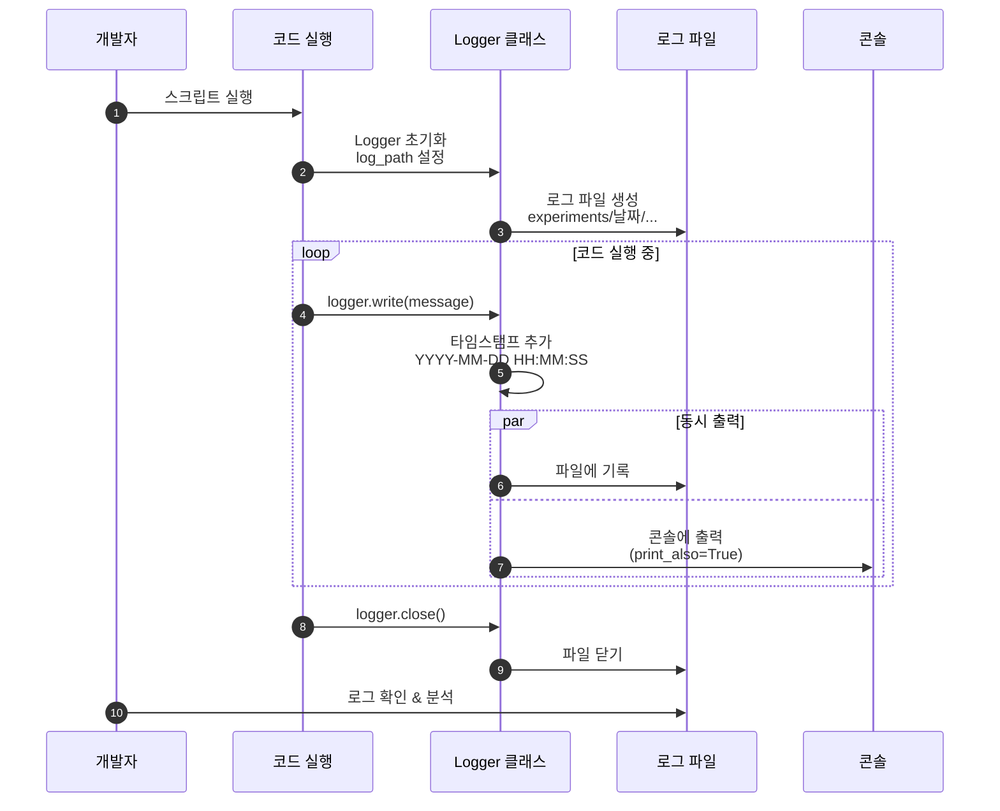

# 01. 로깅 시스템 (Logger 클래스)

## 📋 문서 정보
- **작성일**: 2025-11-03
- **시스템명**: 로깅 시스템
- **구현 파일**: `src/utils/logger.py`
- **우선순위**: ⭐⭐⭐ (최우선 - 모든 시스템의 기반)
- **참고 문서**: [PRD/05_로깅_시스템.md](../PRD/05_로깅_시스템.md)

---

## 📌 시스템 개요

### 목적 및 배경

로깅 시스템은 **논문 리뷰 챗봇 프로젝트 전체에서 사용하는 통합 로깅 기반 시스템**으로, `src/utils/logger.py`에 `Logger` 클래스로 구현되었습니다. 본 시스템은 개발 과정에서 발생하는 모든 이벤트를 체계적으로 기록하고, 실험 추적, 디버깅, 성능 분석, 오류 진단을 지원합니다.

### 주요 역할

1. **이벤트 기록**: 모든 챗봇 실행 내역을 타임스탬프와 함께 기록
2. **실험 추적**: ExperimentManager와 통합되어 세션별 로그 관리
3. **디버깅 지원**: 에러 메시지 색상 구분 및 상세 트레이스 제공
4. **성능 분석**: 실행 시간, 쿼리 성능 등 분석 데이터 수집
5. **프로젝트 문서화**: 실행 과정 자동 문서화로 개발 히스토리 보존

### 의존 관계

```
Logger (기반 시스템)
  ↓
ExperimentManager (실험 관리)
  ↓
AI Agent, RAG, LLM Client, Tools 등 (모든 모듈)
```

모든 상위 시스템이 Logger에 의존하여 실행 내역을 기록합니다.

---

## 🏗️ 시스템 아키텍처

### 로깅 흐름



**로깅 흐름 설명:**
- 개발자가 코드를 실행하면 Logger 클래스가 초기화되고 `experiments/날짜/` 경로에 로그 파일이 자동으로 생성됩니다.
- 코드 실행 중 `logger.write()` 호출 시 타임스탬프(`YYYY-MM-DD HH:MM:SS`)가 자동으로 추가되며 파일과 콘솔에 동시 출력됩니다.
- 작업 완료 후 `logger.close()`로 파일을 닫고, 개발자는 로그 파일을 통해 실행 과정을 분석 및 디버깅할 수 있습니다.

---

## 📋 로깅 정책

### 필수 준수 사항

1. **모든 챗봇 실행은 로그로 기록**
   - 실행 시작/종료 시간
   - 사용자 질문 및 난이도
   - AI Agent 도구 선택 및 실행 과정
   - 실행 결과 및 오류 메시지

2. **표준 출력 대신 Logger 사용**
   - `print()` 사용 **금지**
   - `logger.write()` 사용 **필수**
   - 리디렉션 기능 제공 (필요 시 print도 자동 로그)

3. **로그 파일은 실험 폴더에 저장**
   - **메인 로그**: `experiments/{날짜}/{날짜}_{시간}_session_XXX/chatbot.log`
   - **도구별 로그**: `experiments/{날짜}/{날짜}_{시간}_session_XXX/tools/*.log`

---

## 🔧 Logger 클래스 구조

### 주요 메서드

| 메서드 | 설명 | 구현 내용 |
|--------|------|-----------|
| `__init__(log_path, print_also)` | Logger 초기화 | 로그 파일 생성, 폴더 자동 생성 |
| `write(message, print_also, print_error)` | 로그 메시지 기록 | 타임스탬프 추가, 파일+콘솔 출력 |
| `flush()` | 버퍼 즉시 플러시 | 데이터 손실 방지 |
| `close()` | 로그 파일 닫기 | 리소스 해제 (필수) |
| `start_redirect()` | 표준 출력 리디렉션 시작 | stdout/stderr → 로그 파일 |
| `stop_redirect()` | 표준 출력 리디렉션 중지 | 원래 출력으로 복원 |
| `tqdm()` | 진행률 표시 | 10% 단위로만 로그 기록 |

### 핵심 기능

1. **타임스탬프 자동 추가**
   - 모든 로그 메시지에 `YYYY-MM-DD HH:MM:SS` 형식의 시간 기록
   - 실행 시간 분석 및 성능 평가에 활용

2. **파일 및 콘솔 동시 출력**
   - `print_also=True` (기본값): 파일 저장 + 콘솔 출력
   - `print_also=False`: 파일만 저장 (내부 디버그 정보)

3. **표준 출력/에러 리디렉션**
   - `start_redirect()`: 모든 `print()`를 로그로 자동 저장
   - 외부 라이브러리 출력도 자동 기록 가능

4. **tqdm 진행률 표시 지원**
   - 콘솔: 실시간 진행률 바 표시
   - 로그: 10% 단위로만 기록 (로그 파일 크기 절약)

5. **에러 메시지 색상 구분**
   - `print_error=True`: 콘솔에 빨간색으로 표시
   - 에러 메시지 빠른 식별 가능

---

## 📁 실험 폴더 구조

### 디렉토리 구조

모든 로그 파일은 **`experiments/날짜/날짜_시간_session_XXX/`** 구조로 저장됩니다:

```
experiments/
└── 20251103/                                # 날짜 (YYYYMMDD)
    ├── 20251103_103015_session_001/         # 시간_session_ID
    │   ├── chatbot.log                      # 메인 실행 로그
    │   ├── metadata.json                    # 실험 메타데이터
    │   ├── config.yaml                      # 전체 설정
    │   │
    │   ├── tools/                           # 도구 실행 로그
    │   │   ├── rag_paper.log
    │   │   ├── rag_glossary.log
    │   │   ├── web_search.log
    │   │   └── ...
    │   │
    │   ├── database/                        # DB 관련 기록
    │   ├── prompts/                         # 프롬프트 기록
    │   ├── ui/                              # UI 관련 기록
    │   ├── outputs/                         # 생성된 결과물
    │   ├── evaluation/                      # 평가 지표
    │   └── debug/                           # 디버그 정보 (선택)
    │
    └── 20251103_110234_session_002/         # 다음 실행
        └── ...
```

### Session ID 자동 부여

**규칙:**
- **형식**: `session_001`, `session_002`, `session_003` ...
- **부여 방식**: 당일 날짜 기준으로 순차적으로 증가
- **시작 번호**: 매일 `001`부터 시작
- **중복 방지**: ExperimentManager가 자동으로 다음 번호 계산

**예시:**
```
experiments/20251103/
├── 20251103_103015_session_001/   # 오늘 첫 번째 실행
├── 20251103_110234_session_002/   # 오늘 두 번째 실행
└── 20251103_143520_session_003/   # 오늘 세 번째 실행

experiments/20251104/
└── 20251104_090012_session_001/   # 다음 날, 다시 001부터 시작
```

---

## 🔗 ExperimentManager와의 통합

### 통합 구조

Logger는 **ExperimentManager를 통해 사용되는 것이 권장**됩니다. ExperimentManager가 자동으로 다음 작업을 수행합니다:

1. 당일 폴더 확인 (`experiments/20251103/`)
2. 기존 session 확인하여 다음 번호 부여 (session_001, 002...)
3. 실험 폴더 생성 (`20251103_103015_session_001/`)
4. 서브 폴더 6개 생성 (tools, database, prompts, ui, outputs, evaluation)
5. `metadata.json` 초기화
6. **Logger 자동 초기화** (`chatbot.log` 생성)

### 도구별 Logger 생성

각 AI Agent 도구는 독립적인 로그 파일을 가집니다:

```python
# ExperimentManager가 제공하는 메서드
exp.get_tool_logger('rag_paper')     # tools/rag_paper.log
exp.get_tool_logger('web_search')    # tools/web_search.log
exp.get_tool_logger('glossary')      # tools/glossary.log
```

**장점:**
- 도구별 실행 과정 독립적 추적
- 병렬 실행 시 로그 혼선 방지
- 도구별 성능 분석 용이

---

## ⚠️ 주의사항

### 1. print() 사용 금지

**정책:** 모든 출력은 `logger.write()`를 통해 기록되어야 합니다.

- ❌ **잘못된 사용**: `print("로그 메시지")` → 파일에 기록 안 됨
- ✅ **올바른 사용**: `logger.write("로그 메시지")` → 파일과 콘솔에 모두 출력

### 2. Logger 종료 필수

작업 완료 후 반드시 `close()`를 호출해야 합니다:

- ❌ **잘못된 사용**: `logger.close()` 누락 → 파일 핸들 누수
- ✅ **올바른 사용** (with 문 권장):
  ```python
  with Logger("test.log") as logger:
      logger.write("메시지")
  # 자동으로 close()
  ```

### 3. 로그 파일 경로 확인

로그 파일을 저장할 디렉토리는 자동으로 생성되지만, 잘못된 경로는 에러를 발생시킵니다:

- `Logger` 초기화 시 상위 폴더는 자동 생성
- ExperimentManager 사용 시 모든 폴더 자동 생성 (권장)

### 4. 멀티스레딩 환경

**현재 구현은 멀티스레드 안전하지 않습니다.** 향후 개선 필요 항목:
- Lock 추가로 스레드 안전성 확보
- RotatingFileHandler 고려 (대용량 로그 관리)

---

## 📊 성능 고려사항

### 1. 즉시 플러시 (Flush)

Logger는 모든 `write()` 호출 시 자동으로 `flush()`를 수행합니다:

**장점:**
- 프로그램 비정상 종료 시에도 로그 보존
- 실시간 로그 확인 가능 (`tail -f` 지원)

**단점:**
- I/O 성능 저하 (대량 로그 발생 시)
- 향후 버퍼링 옵션 추가 고려 필요

### 2. tqdm 진행률 로그 최적화

tqdm 통합 시 **콘솔과 로그 파일의 출력 빈도를 다르게 설정**하여 성능과 가독성을 최적화했습니다:

- **콘솔**: 모든 진행률 실시간 표시 (사용자 경험)
- **로그 파일**: 10% 단위로만 기록 (파일 크기 절약)

예: 1000개 작업 → 콘솔 1000줄, 로그 파일 10줄

---

## 🔗 관련 문서

- **[02_실험_관리_시스템.md](./02_실험_관리_시스템.md)** - ExperimentManager에서 Logger 사용
- **[03_AI_Agent_시스템.md](./03_AI_Agent_시스템.md)** - Agent 노드에서 Logger 사용
- **[PRD/05_로깅_시스템.md](../PRD/05_로깅_시스템.md)** - 로깅 시스템 전체 명세
- **[PRD/06_실험_추적_관리.md](../PRD/06_실험_추적_관리.md)** - 실험 폴더 구조 상세

---

## 📝 요약

### 구현된 핵심 기능

1. ✅ 타임스탬프 자동 추가 (`YYYY-MM-DD HH:MM:SS` 형식)
2. ✅ 파일 및 콘솔 동시 출력 (`print_also` 파라미터)
3. ✅ 표준 출력/에러 리디렉션 (`start_redirect()`, `stop_redirect()`)
4. ✅ tqdm 진행률 표시 통합 (10% 단위 로그)
5. ✅ 에러 메시지 색상 구분 (빨간색 콘솔 출력)
6. ✅ with 문 지원 (자동 리소스 정리)

### 적용된 로깅 정책

- **print() 금지**: 모든 출력은 `logger.write()` 사용
- **필수 구조**: `experiments/날짜/날짜_시간_session_XXX/`
- **Session ID 자동 부여**: 당일 기준 순차 증가 (001, 002, ...)
- **도구별 로그 분리**: `tools/*.log` 독립 파일

### 통합 시스템

- **ExperimentManager**: 자동 Logger 생성 및 폴더 구조 관리
- **AI Agent**: 라우터 및 6개 도구에서 Logger 사용
- **RAG 시스템**: DB 쿼리 및 검색 결과 로깅
- **UI (Streamlit)**: 사용자 인터랙션 로그 기록

### 향후 개선 사항

- 멀티스레드 안전성 확보 (Lock 추가)
- 로그 로테이션 (RotatingFileHandler)
- 버퍼링 옵션 추가 (성능 최적화)
