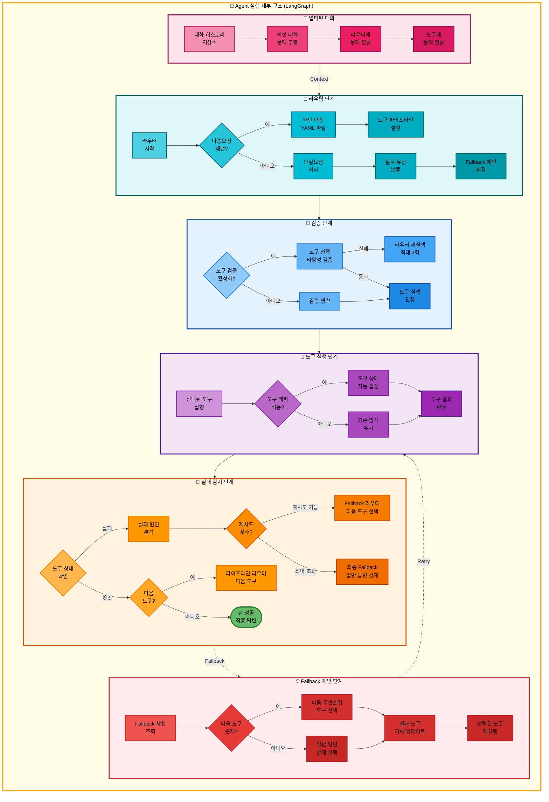

# 00. 프로젝트 구조

## 문서 정보
- **작성일**: 2025-11-04
- **작성자**: 최현화[팀장]
- **최종 수정일**: 2025-11-04

---

## 개요

본 문서는 논문 리뷰 챗봇 프로젝트의 **전체 디렉토리 구조와 파일 조직**을 설명합니다. 프로젝트는 **모듈화 원칙**에 따라 기능별로 분리된 디렉토리 구조를 가지고 있으며, 각 디렉토리는 명확한 책임을 가집니다.

### 핵심 설계 원칙
1. **관심사의 분리 (Separation of Concerns)**: 소스 코드, 스크립트, 데이터, 문서를 명확히 구분
2. **모듈화 (Modularity)**: 기능별로 독립된 모듈 구조
3. **계층화 (Layering)**: UI, 비즈니스 로직, 데이터 계층 분리
4. **확장성 (Scalability)**: 새로운 기능 추가가 용이한 구조

---

## 디렉토리 구조

```
langchain-project/
├── configs/                    # 설정 파일
│   └── collect/               # 데이터 수집 설정
├── data/                       # 데이터 저장소
│   ├── processed/             # 전처리된 데이터
│   ├── raw/                   # 원본 데이터
│   │   └── pdfs/              # PDF 논문 파일
│   ├── rdbms/                 # 관계형 DB 데이터
│   └── vectordb/              # 벡터 DB 데이터
│       └── papers_faiss/      # FAISS 인덱스
├── database/                   # DB 스키마 및 마이그레이션
├── docs/                       # 프로젝트 문서
│   ├── PPT/                   # 발표 자료
│   ├── PRD/                   # 제품 요구사항 명세서
│   ├── QnA/                   # 질의응답 문서
│   ├── architecture/          # 아키텍처 문서
│   │   ├── claude_prompts/    # Claude 프롬프트
│   │   ├── mermaid/           # Mermaid 다이어그램
│   │   ├── multiple_request/  # 다중 요청 문서
│   │   └── single_request/    # 단일 요청 문서
│   ├── errors/                # 에러 로그
│   ├── images/                # 문서 이미지
│   ├── issues/                # 이슈 트래킹
│   ├── minutes/               # 회의록
│   ├── modularization/        # 모듈화 문서
│   ├── roles/                 # 역할 정의
│   ├── rules/                 # 규칙 및 가이드
│   ├── scenarios/             # 사용 시나리오
│   └── usage/                 # 사용법 문서
├── notebooks/                  # Jupyter 노트북
│   ├── base/                  # 기본 실험 노트북
│   └── team/                  # 팀별 노트북
├── prompts/                    # 프롬프트 템플릿
├── scripts/                    # 유틸리티 스크립트
│   ├── analysis/              # 분석 스크립트
│   ├── data/                  # 데이터 처리
│   ├── debug/                 # 디버깅 도구
│   ├── system/                # 시스템 관리
│   └── tests/                 # 테스트 스크립트
│       ├── integration/       # 통합 테스트
│       └── unit/              # 단위 테스트
├── src/                        # 소스 코드
│   ├── agent/                 # AI Agent (LangGraph)
│   ├── data/                  # 데이터 처리
│   ├── database/              # DB 연결 및 쿼리
│   ├── evaluation/            # 성능 평가
│   ├── llm/                   # LLM 클라이언트
│   ├── memory/                # 대화 메모리
│   ├── papers/                # 논문 처리
│   │   ├── domain/            # 도메인 모델
│   │   └── infra/             # 인프라 계층
│   ├── prompts/               # 프롬프트 관리
│   ├── rag/                   # RAG 검색
│   ├── text2sql/              # Text-to-SQL
│   ├── tools/                 # Agent 도구
│   └── utils/                 # 유틸리티 함수
└── ui/                         # Streamlit UI
    ├── assets/                # 정적 자산
    ├── components/            # UI 컴포넌트
    ├── pages/                 # 페이지
    └── test/                  # UI 테스트
```

---

## 프로젝트 구조도

```mermaid
graph TB
    subgraph MainFlow["📋 프로젝트 전체 구조"]
        direction TB

        subgraph Root["🔸 프로젝트 루트"]
            direction LR
            Main[main.py<br/>진입점] --> Config[.env<br/>환경 변수]
            Config --> Req[requirements.txt<br/>의존성]
        end

        subgraph Configs["🔸 설정 (configs/)"]
            direction TB
            DBConfig[db_config.yaml<br/>DB 설정]
            DBConfig ~~~ ModelConfig[model_config.yaml<br/>모델 설정]
            ModelConfig ~~~ MultiRequest[multi_request_patterns.yaml<br/>다중 요청 패턴]
            MultiRequest ~~~ PromptConfig[prompt_config.yaml<br/>프롬프트 설정]
            PromptConfig ~~~ CollectConfig[collect/config.yaml<br/>데이터 수집 설정]
        end

        subgraph Source["🔹 소스 코드 (src/)"]
            direction TB

            subgraph SourceCore["🔷 핵심 로직"]
                direction LR
                Agent[agent/<br/>AI Agent<br/>Fallback Chain] --> Tools[tools/<br/>도구 시스템]
                Tools --> PromptsMgr[prompts/<br/>프롬프트 관리]
            end

            subgraph SourceData["🔶 데이터 처리"]
                direction LR
                RAG[rag/<br/>RAG 검색] --> Papers[papers/<br/>논문 처리]
                Papers --> DataLoader[data/<br/>문서 로더]
            end

            subgraph SourceInfra["🔺 인프라"]
                direction LR
                LLM[llm/<br/>LLM 클라이언트] --> DB[database/<br/>DB 연결]
                DB --> Text2SQL[text2sql/<br/>SQL 변환]
            end

            subgraph SourceSupport["💡 지원 기능"]
                direction LR
                Utils[utils/<br/>유틸리티] --> Eval[evaluation/<br/>성능 평가]
                Eval --> Mem[memory/<br/>대화 메모리]
            end

            SourceCore --> SourceData
            SourceData --> SourceInfra
            SourceInfra --> SourceSupport
        end

        subgraph Prompts["🔺 프롬프트 엔지니어링<br>(prompts/)"]
            direction TB
            RoutingPrompts[routing_prompts.json<br/>라우팅 프롬프트]
            RoutingPrompts ~~~ ToolPrompts[tool_prompts.json<br/>도구 프롬프트]
            ToolPrompts ~~~ EvalPrompts[evaluation_prompts.json<br/>평가 프롬프트]
            EvalPrompts --> QGenPrompts[question_generation_prompts.json<br/>질문 생성 프롬프트]
            QGenPrompts --> GoldenDataset[golden_dataset.json<br/>골든 데이터셋]
        end

        subgraph UI["🔺 사용자 인터페이스 (ui/)"]
            direction LR
            App[app.py<br/>메인 UI] --> Comp[components/<br/>UI 컴포넌트]
            Comp --> Pages[pages/<br/>추가 페이지]
        end

        subgraph Scripts["🔶 스크립트 (scripts/)"]
            direction LR
            DataScript[data/<br/>데이터 처리] --> System[system/<br/>시스템 관리]
            System --> Tests[tests/<br/>테스트]
        end

        subgraph Docs["🔷 문서 (docs/)"]
            direction TB

            subgraph DocsBasic["📑 기본 문서"]
                direction LR
                Rules[rules/<br/>규칙] --> PRD2[PRD/<br/>요구사항]
                PRD2 --> Roles[roles/<br/>담당역할]
                Roles --> Minutes[minutes/<br/>회의록]
            end

            subgraph DocsTracking["📊 추적 문서"]
                direction LR
                Issues[issues/<br/>이슈 트래킹] --> Errors[errors/<br/>에러]
                Errors --> Experiments[experiments/<br/>실험 보고서]
            end

            subgraph DocsArch["🏗️ 아키텍처 문서"]
                direction LR
                Mod[modularization/<br/>모듈 문서] --> Arch[architecture/<br/>단일요청/다중요청/<br/>멀티턴 기능별<br/>아키텍처]
            end

            subgraph DocsUsage["📖 사용 가이드"]
                direction LR
                Usage[usage/<br/>실행 명령어] --> QnA[QnA/<br/>프로젝트 관련<br/>질의응답]
                QnA --> Scenarios[scenarios/<br/>질문 리스트<br/>시나리오]
            end

            DocsBasic --> DocsTracking
            DocsTracking --> DocsArch
            DocsArch --> DocsUsage
        end

        Root --> Configs
        Root --> Prompts
        Configs --> Source
        Prompts --> Source
        Source --> UI
        UI --> Scripts
        Scripts --> Docs
    end

    %% 메인 워크플로우 배경
    style MainFlow fill:#fffde7,stroke:#f9a825,stroke-width:4px,color:#000

    %% Subgraph 스타일 (상위 레벨)
    style Root fill:#e0f7fa,stroke:#006064,stroke-width:3px,color:#000
    style Configs fill:#fff3e0,stroke:#f57c00,stroke-width:3px,color:#000
    style Source fill:#f3e5f5,stroke:#4a148c,stroke-width:3px,color:#000
    style Prompts fill:#e1f5fe,stroke:#01579b,stroke-width:3px,color:#000
    style UI fill:#e8f5e9,stroke:#1b5e20,stroke-width:3px,color:#000
    style Scripts fill:#fff3e0,stroke:#e65100,stroke-width:3px,color:#000
    style Docs fill:#fce4ec,stroke:#880e4f,stroke-width:3px,color:#000

    %% Subgraph 스타일 (소스 코드 하위 레벨)
    style SourceCore fill:#f3e5f5,stroke:#7b1fa2,stroke-width:2px,color:#000
    style SourceData fill:#f3e5f5,stroke:#7b1fa2,stroke-width:2px,color:#000
    style SourceInfra fill:#f3e5f5,stroke:#7b1fa2,stroke-width:2px,color:#000
    style SourceSupport fill:#f3e5f5,stroke:#7b1fa2,stroke-width:2px,color:#000

    %% Subgraph 스타일 (문서 하위 레벨)
    style DocsBasic fill:#fce4ec,stroke:#c2185b,stroke-width:2px,color:#000
    style DocsTracking fill:#fce4ec,stroke:#c2185b,stroke-width:2px,color:#000
    style DocsArch fill:#fce4ec,stroke:#c2185b,stroke-width:2px,color:#000
    style DocsUsage fill:#fce4ec,stroke:#c2185b,stroke-width:2px,color:#000

    %% 노드 스타일 (프로젝트 루트 - 청록 계열)
    style Main fill:#4dd0e1,stroke:#006064,stroke-width:2px,color:#000
    style Config fill:#4dd0e1,stroke:#006064,stroke-width:2px,color:#000
    style Req fill:#4dd0e1,stroke:#006064,stroke-width:2px,color:#000

    %% 노드 스타일 (설정 - 주황 계열)
    style DBConfig fill:#ffcc80,stroke:#f57c00,stroke-width:2px,color:#000
    style ModelConfig fill:#ffcc80,stroke:#f57c00,stroke-width:2px,color:#000
    style MultiRequest fill:#ffcc80,stroke:#f57c00,stroke-width:2px,color:#000
    style PromptConfig fill:#ffcc80,stroke:#f57c00,stroke-width:2px,color:#000
    style CollectConfig fill:#ffcc80,stroke:#f57c00,stroke-width:2px,color:#000

    %% 노드 스타일 (소스 코드 - 보라 계열)
    style Agent fill:#e1bee7,stroke:#7b1fa2,stroke-width:2px,color:#000
    style Tools fill:#e1bee7,stroke:#7b1fa2,stroke-width:2px,color:#000
    style PromptsMgr fill:#e1bee7,stroke:#7b1fa2,stroke-width:2px,color:#000
    style RAG fill:#e1bee7,stroke:#7b1fa2,stroke-width:2px,color:#000
    style Papers fill:#e1bee7,stroke:#7b1fa2,stroke-width:2px,color:#000
    style DataLoader fill:#e1bee7,stroke:#7b1fa2,stroke-width:2px,color:#000
    style LLM fill:#e1bee7,stroke:#7b1fa2,stroke-width:2px,color:#000
    style DB fill:#e1bee7,stroke:#7b1fa2,stroke-width:2px,color:#000
    style Text2SQL fill:#e1bee7,stroke:#7b1fa2,stroke-width:2px,color:#000
    style Utils fill:#e1bee7,stroke:#7b1fa2,stroke-width:2px,color:#000
    style Eval fill:#e1bee7,stroke:#7b1fa2,stroke-width:2px,color:#000
    style Mem fill:#e1bee7,stroke:#7b1fa2,stroke-width:2px,color:#000

    %% 노드 스타일 (프롬프트 엔지니어링 - 파랑 계열)
    style RoutingPrompts fill:#81d4fa,stroke:#01579b,stroke-width:2px,color:#000
    style ToolPrompts fill:#81d4fa,stroke:#01579b,stroke-width:2px,color:#000
    style EvalPrompts fill:#81d4fa,stroke:#01579b,stroke-width:2px,color:#000
    style QGenPrompts fill:#81d4fa,stroke:#01579b,stroke-width:2px,color:#000
    style GoldenDataset fill:#81d4fa,stroke:#01579b,stroke-width:2px,color:#000

    %% 노드 스타일 (UI - 녹색 계열)
    style App fill:#a5d6a7,stroke:#2e7d32,stroke-width:2px,color:#000
    style Comp fill:#a5d6a7,stroke:#2e7d32,stroke-width:2px,color:#000
    style Pages fill:#a5d6a7,stroke:#2e7d32,stroke-width:2px,color:#000

    %% 노드 스타일 (스크립트 - 주황 계열)
    style DataScript fill:#ffcc80,stroke:#e65100,stroke-width:2px,color:#000
    style System fill:#ffcc80,stroke:#e65100,stroke-width:2px,color:#000
    style Tests fill:#ffcc80,stroke:#e65100,stroke-width:2px,color:#000

    %% 노드 스타일 (문서 - 분홍 계열)
    style Rules fill:#f48fb1,stroke:#880e4f,stroke-width:2px,color:#000
    style PRD2 fill:#f48fb1,stroke:#880e4f,stroke-width:2px,color:#000
    style Roles fill:#f48fb1,stroke:#880e4f,stroke-width:2px,color:#000
    style Minutes fill:#f48fb1,stroke:#880e4f,stroke-width:2px,color:#000
    style Issues fill:#f48fb1,stroke:#880e4f,stroke-width:2px,color:#000
    style Errors fill:#f48fb1,stroke:#880e4f,stroke-width:2px,color:#000
    style Experiments fill:#f48fb1,stroke:#880e4f,stroke-width:2px,color:#000
    style Mod fill:#f48fb1,stroke:#880e4f,stroke-width:2px,color:#000
    style Arch fill:#f48fb1,stroke:#880e4f,stroke-width:2px,color:#000
    style Usage fill:#f48fb1,stroke:#880e4f,stroke-width:2px,color:#000
    style QnA fill:#f48fb1,stroke:#880e4f,stroke-width:2px,color:#000
    style Scenarios fill:#f48fb1,stroke:#880e4f,stroke-width:2px,color:#000

    %% 연결선 스타일
    linkStyle 0,1 stroke:#006064,stroke-width:2px
    linkStyle 2,3,4,5 stroke:#none,stroke-width:0px
    linkStyle 6,7 stroke:#7b1fa2,stroke-width:2px
    linkStyle 8,9 stroke:#7b1fa2,stroke-width:2px
    linkStyle 10,11 stroke:#7b1fa2,stroke-width:2px
    linkStyle 12,13 stroke:#7b1fa2,stroke-width:2px
    linkStyle 14,15,16 stroke:#616161,stroke-width:3px
    linkStyle 17,18 stroke:#none,stroke-width:0px
    linkStyle 19,20 stroke:#01579b,stroke-width:2px
    linkStyle 21,22 stroke:#2e7d32,stroke-width:2px
    linkStyle 23,24 stroke:#e65100,stroke-width:2px
    linkStyle 25,26,27 stroke:#880e4f,stroke-width:2px
    linkStyle 28,29 stroke:#c2185b,stroke-width:2px
    linkStyle 30 stroke:#c2185b,stroke-width:2px
    linkStyle 31,32 stroke:#c2185b,stroke-width:2px
    linkStyle 33,34,35,36,37,38 stroke:#616161,stroke-width:3px
```



**구조도 설명:**
- **프로젝트 루트**: 진입점(`main.py`)과 환경 설정(`.env`)
- **설정 (configs/)**: DB, 모델, 다중 요청 패턴, 프롬프트 설정 파일
- **소스 코드 (src/)**:
  - **핵심 로직**: Agent, Tools, 프롬프트 관리
  - **데이터 처리**: RAG, 논문 처리, 문서 로더
  - **인프라**: LLM 클라이언트, DB 연결, Text2SQL
  - **지원 기능**: 유틸리티, 평가, 대화 메모리
- **프롬프트 엔지니어링 (prompts/)**: 라우팅, 도구, 평가, 질문 생성 프롬프트 및 골든 데이터셋
- **사용자 인터페이스 (ui/)**: Streamlit 기반 웹 UI
- **스크립트 (scripts/)**: 데이터 처리, 시스템 관리, 테스트 스크립트
- **문서 (docs/)**: 설계 문서, PRD, 역할 문서, 아키텍처, 사용 가이드

---

## 전체 아키텍처 (단순 흐름도)

```mermaid
graph TB
    subgraph MainFlow["📋 main.py 실행 워크플로우"]
        direction TB

        subgraph Init["🔸 초기화"]
            direction LR
            Start([▶️ python main.py]) --> LoadEnv[.env 파일<br/>환경변수 로드]
            LoadEnv --> CheckPath[ui/app.py<br/>경로 확인]
        end

        subgraph Streamlit["🔹 Streamlit 서버 시작"]
            direction LR
            RunStreamlit[Streamlit 실행<br/>ui/app.py] --> SetConfig[서버 설정<br/>port: 8501]
            SetConfig --> OpenBrowser[브라우저<br/>자동 열기]
        end

        subgraph UIInit["🔺 UI 초기화 (ui/app.py)"]
            direction LR
            PageConfig[페이지 설정<br/>제목/아이콘] --> ValidateEnv{환경변수<br/>검증}
            ValidateEnv -->|API 키 없음| ErrorStop[❌ 앱 중지]
            ValidateEnv -->|정상| InitAgent[Agent 초기화<br/>캐싱]
        end

        subgraph AgentSetup["🔶 Agent & 실험관리자 생성"]
            direction LR
            CreateExpMgr[실험관리자<br/>생성] --> CreateGraph[Agent 그래프<br/>구성]
            CreateGraph --> AddNodes[노드 추가<br/>라우터 + 7개 도구]
            AddNodes --> AddEdges[엣지 추가<br/>조건부 라우팅]
            AddEdges --> Compile[그래프<br/>컴파일]
        end

        subgraph UIRender["💡 UI 렌더링"]
            direction LR
            RenderSidebar[사이드바 렌더링<br/>난이도 선택] --> InitChat[채팅 세션<br/>초기화]
            InitChat --> ShowHistory[채팅 히스토리<br/>표시]
            ShowHistory --> WaitInput[사용자 입력<br/>대기]
        end

        subgraph UserInput["🔷 사용자 입력 처리"]
            direction LR
            InputReceived[질문 입력<br/>수신] --> SelectDiff[난이도 선택<br/>초심자/전문가]
            SelectDiff --> AddUserMsg[사용자 메시지<br/>추가]
            AddUserMsg --> ExtractKeyword[키워드 추출<br/>패턴 매칭]
            ExtractKeyword --> SelectToolInit[도구 선택<br/>우선순위]
            SelectToolInit --> ValidateTool{도구<br/>검증}
            ValidateTool -->|적합| InvokeAgent[Agent 그래프<br/>실행]
            ValidateTool -->|재선택| SelectToolInit
        end

        subgraph AgentExec["✨ Agent 실행 (LangGraph)"]
            direction LR
            RouterNode[라우터<br/>최종 도구 확정] --> SelectTool{도구<br/>선택}
            SelectTool -->|일반| GeneralNode[일반 답변]
            SelectTool -->|RAG 논문| SearchNode[RAG 논문 검색]
            SelectTool -->|Web 논문| WebNode[Web 논문 검색]
            SelectTool -->|RAG 용어| GlossaryNode[RAG 용어집 검색]
            SelectTool -->|요약| SummarizeNode[논문 요약]
            SelectTool -->|통계| Text2SQLNode[Text2SQL 통계]
            SelectTool -->|저장| SaveNode[파일 저장]
        end

        subgraph DataQuery["💾 데이터 조회"]
            direction LR
            GeneralNode --> LLMDirect[🤖 LLM<br/>직접 호출]
            SearchNode --> VectorDB[(💾 PGVector<br/>논문 임베딩)]
            GlossaryNode --> GlossaryDB[(💾 PostgreSQL<br/>glossary 테이블)]
            Text2SQLNode --> PapersDB[(💾 PostgreSQL<br/>papers 테이블)]
            WebNode --> TavilyAPI[🔍 Tavily API<br/>웹 검색]
            SummarizeNode --> SummarizeDB[(💾 PGVector<br/>논문 청크)]
        end

        subgraph FallbackChain["🔄 도구 자동 전환 (Fallback)"]
            direction LR
            GlossaryFail[RAG 용어집 검색<br/>실패] -.-> GlossaryToGeneral[일반 답변<br/>전환]
            SearchFail[RAG 논문 검색<br/>실패] -.-> SearchToWeb[Web 논문 검색<br/>전환]
            SearchToWeb -.-> WebToGeneral[일반 답변<br/>전환]
            Text2SQLFail[Text2SQL 통계<br/>실패] -.-> Text2SQLToGeneral[일반 답변<br/>전환]
        end

        subgraph FinalAnswer["✍️ 최종 답변 생성"]
            direction LR
            CheckDiff{난이도<br/>확인} -->|초보자| EasyPrompt[초보자용<br/>프롬프트]
            CheckDiff -->|전문가| HardPrompt[전문가용<br/>프롬프트]
            EasyPrompt --> GenerateLLM[LLM으로<br/>답변 생성]
            HardPrompt --> GenerateLLM
        end

        subgraph AnswerDisplay["📱 답변 표시"]
            direction LR
            DisplayAnswer[답변<br/>UI 렌더링] --> ShowBadge[도구 배지<br/>표시]
            ShowBadge --> ShowReason[선택 이유<br/>펼침 메뉴]
            ShowReason --> ExtractTerms[용어 추출<br/>DB 저장]
        end

        subgraph Evaluation["📊 답변 품질 평가"]
            direction LR
            LLMJudge[LLM-as-a-Judge<br/>품질 평가] --> EvalScore[평가 점수<br/>생성]
            EvalScore --> SaveEval[평가 결과<br/>DB 저장]
            SaveEval --> ShowEval[평가 결과<br/>UI 표시]
        end

        subgraph Continue["🔹 계속 질문"]
            direction LR
            WaitNext{계속<br/>질문?} -->|Yes| BackToInput[입력창<br/>복귀]
            WaitNext -->|No| SessionEnd[세션<br/>유지]
        end

        %% 시작/종료 노드
        Start([▶️ 시작<br/>사용자 실행]) --> Init
        SessionEnd --> End([✅ 종료<br/>브라우저 탭 닫기])

        %% 단계 간 연결
        Init --> Streamlit
        Streamlit --> UIInit
        UIInit --> AgentSetup
        AgentSetup --> UIRender
        UIRender --> UserInput
        UserInput --> AgentExec
        AgentExec --> DataQuery
        DataQuery --> FinalAnswer
        FinalAnswer --> AnswerDisplay
        AnswerDisplay --> Evaluation
        Evaluation --> Continue
        BackToInput --> UserInput
    end

    %% 메인 워크플로우 배경
    style MainFlow fill:#fffde7,stroke:#f9a825,stroke-width:4px,color:#000

    %% Subgraph 스타일
    style Init fill:#e0f7fa,stroke:#006064,stroke-width:3px,color:#000
    style Streamlit fill:#e3f2fd,stroke:#0d47a1,stroke-width:3px,color:#000
    style UIInit fill:#f3e5f5,stroke:#4a148c,stroke-width:3px,color:#000
    style AgentSetup fill:#fff3e0,stroke:#e65100,stroke-width:3px,color:#000
    style UIRender fill:#ffebee,stroke:#c62828,stroke-width:3px,color:#000
    style UserInput fill:#fce4ec,stroke:#880e4f,stroke-width:3px,color:#000
    style AgentExec fill:#e8f5e9,stroke:#1b5e20,stroke-width:3px,color:#000
    style DataQuery fill:#ede7f6,stroke:#512da8,stroke-width:3px,color:#000
    style FinalAnswer fill:#e0f2f1,stroke:#00695c,stroke-width:3px,color:#000
    style AnswerDisplay fill:#e1f5fe,stroke:#01579b,stroke-width:3px,color:#000
    style Evaluation fill:#fff9c4,stroke:#f57f17,stroke-width:3px,color:#000
    style Continue fill:#f1f8e9,stroke:#33691e,stroke-width:3px,color:#000

    %% 노드 스타일 (시작/종료)
    style Start fill:#4db6ac,stroke:#00695c,stroke-width:3px,color:#000
    style End fill:#66bb6a,stroke:#2e7d32,stroke-width:3px,color:#000

    %% 노드 스타일 (초기화 - 청록)
    style LoadEnv fill:#4dd0e1,stroke:#006064,stroke-width:2px,color:#000
    style CheckPath fill:#4dd0e1,stroke:#006064,stroke-width:2px,color:#000

    %% 노드 스타일 (Streamlit - 파랑)
    style RunStreamlit fill:#90caf9,stroke:#1976d2,stroke-width:2px,color:#000
    style SetConfig fill:#64b5f6,stroke:#1976d2,stroke-width:2px,color:#000
    style OpenBrowser fill:#42a5f5,stroke:#1565c0,stroke-width:2px,color:#000

    %% 노드 스타일 (UI 초기화 - 보라)
    style PageConfig fill:#e1bee7,stroke:#7b1fa2,stroke-width:2px,color:#000
    style ValidateEnv fill:#ce93d8,stroke:#7b1fa2,stroke-width:2px,color:#000
    style ErrorStop fill:#ef5350,stroke:#c62828,stroke-width:2px,color:#000
    style InitAgent fill:#e1bee7,stroke:#7b1fa2,stroke-width:2px,color:#000

    %% 노드 스타일 (Agent 생성 - 주황)
    style CreateExpMgr fill:#ffcc80,stroke:#f57c00,stroke-width:2px,color:#000
    style CreateGraph fill:#ffb74d,stroke:#f57c00,stroke-width:2px,color:#000
    style AddNodes fill:#ffa726,stroke:#ef6c00,stroke-width:2px,color:#000
    style AddEdges fill:#ff9800,stroke:#e65100,stroke-width:2px,color:#000
    style Compile fill:#fb8c00,stroke:#e65100,stroke-width:2px,color:#000

    %% 노드 스타일 (UI 렌더링 - 빨강)
    style RenderSidebar fill:#ef9a9a,stroke:#c62828,stroke-width:2px,color:#000
    style InitChat fill:#e57373,stroke:#c62828,stroke-width:2px,color:#000
    style ShowHistory fill:#ef5350,stroke:#b71c1c,stroke-width:2px,color:#000
    style WaitInput fill:#f44336,stroke:#b71c1c,stroke-width:2px,color:#000

    %% 노드 스타일 (사용자 입력 - 핑크)
    style InputReceived fill:#f48fb1,stroke:#ad1457,stroke-width:2px,color:#000
    style SelectDiff fill:#f48fb1,stroke:#ad1457,stroke-width:2px,color:#000
    style AddUserMsg fill:#f06292,stroke:#ad1457,stroke-width:2px,color:#000
    style ExtractKeyword fill:#f06292,stroke:#ad1457,stroke-width:2px,color:#000
    style SelectToolInit fill:#ec407a,stroke:#880e4f,stroke-width:2px,color:#000
    style ValidateTool fill:#e91e63,stroke:#880e4f,stroke-width:2px,color:#000
    style InvokeAgent fill:#ec407a,stroke:#880e4f,stroke-width:2px,color:#000

    %% 노드 스타일 (Agent 실행 - 녹색)
    style RouterNode fill:#81c784,stroke:#2e7d32,stroke-width:2px,color:#000
    style SelectTool fill:#66bb6a,stroke:#2e7d32,stroke-width:2px,color:#000
    style GeneralNode fill:#a5d6a7,stroke:#388e3c,stroke-width:2px,color:#000
    style SearchNode fill:#a5d6a7,stroke:#388e3c,stroke-width:2px,color:#000
    style WebNode fill:#a5d6a7,stroke:#388e3c,stroke-width:2px,color:#000
    style GlossaryNode fill:#a5d6a7,stroke:#388e3c,stroke-width:2px,color:#000
    style SummarizeNode fill:#a5d6a7,stroke:#388e3c,stroke-width:2px,color:#000
    style Text2SQLNode fill:#a5d6a7,stroke:#388e3c,stroke-width:2px,color:#000
    style SaveNode fill:#a5d6a7,stroke:#388e3c,stroke-width:2px,color:#000

    %% 노드 스타일 (데이터 조회 - 보라)
    style LLMDirect fill:#ce93d8,stroke:#7b1fa2,stroke-width:2px,color:#000
    style VectorDB fill:#b39ddb,stroke:#512da8,stroke-width:2px,color:#000
    style GlossaryDB fill:#b39ddb,stroke:#512da8,stroke-width:2px,color:#000
    style PapersDB fill:#b39ddb,stroke:#512da8,stroke-width:2px,color:#000
    style TavilyAPI fill:#ba68c8,stroke:#7b1fa2,stroke-width:2px,color:#000
    style SummarizeDB fill:#b39ddb,stroke:#512da8,stroke-width:2px,color:#000

    %% Subgraph 스타일 (Fallback - 주황)
    style FallbackChain fill:#fff3e0,stroke:#e65100,stroke-width:3px,color:#000

    %% 노드 스타일 (Fallback - 주황)
    style GlossaryFail fill:#ffcc80,stroke:#f57c00,stroke-width:2px,color:#000
    style GlossaryToGeneral fill:#ffb74d,stroke:#f57c00,stroke-width:2px,color:#000
    style SearchFail fill:#ffcc80,stroke:#f57c00,stroke-width:2px,color:#000
    style SearchToWeb fill:#ffa726,stroke:#ef6c00,stroke-width:2px,color:#000
    style WebToGeneral fill:#ffb74d,stroke:#f57c00,stroke-width:2px,color:#000
    style Text2SQLFail fill:#ffcc80,stroke:#f57c00,stroke-width:2px,color:#000
    style Text2SQLToGeneral fill:#ffb74d,stroke:#f57c00,stroke-width:2px,color:#000

    %% 노드 스타일 (최종 답변 생성 - 청록)
    style CheckDiff fill:#4dd0e1,stroke:#00838f,stroke-width:2px,color:#000
    style EasyPrompt fill:#26c6da,stroke:#00838f,stroke-width:2px,color:#000
    style HardPrompt fill:#26c6da,stroke:#00838f,stroke-width:2px,color:#000
    style GenerateLLM fill:#00bcd4,stroke:#00695c,stroke-width:2px,color:#000

    %% 노드 스타일 (답변 표시 - 하늘색)
    style DisplayAnswer fill:#81d4fa,stroke:#0288d1,stroke-width:2px,color:#000
    style ShowBadge fill:#4fc3f7,stroke:#0277bd,stroke-width:2px,color:#000
    style ShowReason fill:#29b6f6,stroke:#01579b,stroke-width:2px,color:#000
    style ExtractTerms fill:#03a9f4,stroke:#01579b,stroke-width:2px,color:#000

    %% 노드 스타일 (답변 품질 평가 - 노랑)
    style LLMJudge fill:#fff59d,stroke:#f9a825,stroke-width:2px,color:#000
    style EvalScore fill:#ffee58,stroke:#f57f17,stroke-width:2px,color:#000
    style SaveEval fill:#fdd835,stroke:#f57f17,stroke-width:2px,color:#000
    style ShowEval fill:#fbc02d,stroke:#ef6c00,stroke-width:2px,color:#000

    %% 노드 스타일 (계속 - 연두)
    style WaitNext fill:#9ccc65,stroke:#558b2f,stroke-width:2px,color:#000
    style BackToInput fill:#8bc34a,stroke:#33691e,stroke-width:2px,color:#000
    style SessionEnd fill:#aed581,stroke:#558b2f,stroke-width:2px,color:#000

    %% 연결선 스타일 (Continue 내부 0~1)
    linkStyle 0 stroke:#558b2f,stroke-width:2px
    linkStyle 1 stroke:#558b2f,stroke-width:2px

    %% 연결선 스타일 (시작/종료 2~3)
    linkStyle 2 stroke:#00695c,stroke-width:3px
    linkStyle 3 stroke:#2e7d32,stroke-width:3px

    %% 연결선 스타일 (초기화 4~5)
    linkStyle 4 stroke:#006064,stroke-width:2px
    linkStyle 5 stroke:#006064,stroke-width:2px

    %% 연결선 스타일 (Streamlit 6~7)
    linkStyle 6 stroke:#1976d2,stroke-width:2px
    linkStyle 7 stroke:#1976d2,stroke-width:2px

    %% 연결선 스타일 (UI 초기화 8~10)
    linkStyle 8 stroke:#7b1fa2,stroke-width:2px
    linkStyle 9 stroke:#c62828,stroke-width:2px
    linkStyle 10 stroke:#7b1fa2,stroke-width:2px

    %% 연결선 스타일 (Agent 생성 11~14)
    linkStyle 11 stroke:#f57c00,stroke-width:2px
    linkStyle 12 stroke:#f57c00,stroke-width:2px
    linkStyle 13 stroke:#f57c00,stroke-width:2px
    linkStyle 14 stroke:#f57c00,stroke-width:2px

    %% 연결선 스타일 (UI 렌더링 15~17)
    linkStyle 15 stroke:#c62828,stroke-width:2px
    linkStyle 16 stroke:#c62828,stroke-width:2px
    linkStyle 17 stroke:#c62828,stroke-width:2px

    %% 연결선 스타일 (사용자 입력 18~24)
    linkStyle 18 stroke:#ad1457,stroke-width:2px
    linkStyle 19 stroke:#ad1457,stroke-width:2px
    linkStyle 20 stroke:#ad1457,stroke-width:2px
    linkStyle 21 stroke:#ad1457,stroke-width:2px
    linkStyle 22 stroke:#ad1457,stroke-width:2px
    linkStyle 23 stroke:#880e4f,stroke-width:2px
    linkStyle 24 stroke:#ad1457,stroke-width:2px

    %% 연결선 스타일 (Agent 실행 25~32)
    linkStyle 25 stroke:#2e7d32,stroke-width:2px
    linkStyle 26 stroke:#2e7d32,stroke-width:2px
    linkStyle 27 stroke:#2e7d32,stroke-width:2px
    linkStyle 28 stroke:#2e7d32,stroke-width:2px
    linkStyle 29 stroke:#2e7d32,stroke-width:2px
    linkStyle 30 stroke:#2e7d32,stroke-width:2px
    linkStyle 31 stroke:#2e7d32,stroke-width:2px
    linkStyle 32 stroke:#2e7d32,stroke-width:2px

    %% 연결선 스타일 (데이터 조회 33~38)
    linkStyle 33 stroke:#7b1fa2,stroke-width:2px
    linkStyle 34 stroke:#512da8,stroke-width:2px
    linkStyle 35 stroke:#512da8,stroke-width:2px
    linkStyle 36 stroke:#512da8,stroke-width:2px
    linkStyle 37 stroke:#7b1fa2,stroke-width:2px
    linkStyle 38 stroke:#512da8,stroke-width:2px

    %% 연결선 스타일 (최종 답변 생성 39~42)
    linkStyle 39 stroke:#00838f,stroke-width:2px
    linkStyle 40 stroke:#00838f,stroke-width:2px
    linkStyle 41 stroke:#00838f,stroke-width:2px
    linkStyle 42 stroke:#00838f,stroke-width:2px

    %% 연결선 스타일 (답변 표시 43~45)
    linkStyle 43 stroke:#0288d1,stroke-width:2px
    linkStyle 44 stroke:#0277bd,stroke-width:2px
    linkStyle 45 stroke:#01579b,stroke-width:2px

    %% 연결선 스타일 (답변 품질 평가 46~48)
    linkStyle 46 stroke:#f9a825,stroke-width:2px
    linkStyle 47 stroke:#f57f17,stroke-width:2px
    linkStyle 48 stroke:#f57f17,stroke-width:2px

    %% 단계 간 연결 (회색 49~57)
    linkStyle 49 stroke:#616161,stroke-width:3px
    linkStyle 50 stroke:#616161,stroke-width:3px
    linkStyle 51 stroke:#616161,stroke-width:3px
    linkStyle 52 stroke:#616161,stroke-width:3px
    linkStyle 53 stroke:#616161,stroke-width:3px
    linkStyle 54 stroke:#616161,stroke-width:3px
    linkStyle 55 stroke:#616161,stroke-width:3px
    linkStyle 56 stroke:#616161,stroke-width:3px
    linkStyle 57 stroke:#616161,stroke-width:3px
```



---

## 전체 아키텍처 (상세 흐름도)

```mermaid
graph TB
    subgraph MainFlow["📋 전체 시스템 상세 실행 흐름 (main.py → UI → Agent → Tools → DB)"]
        direction TB

        subgraph Init["🔸 1단계: 프로그램 시작"]
            direction LR
            A([▶️ python main.py]) --> B[main 함수<br/>실행]
            B --> C[load_dotenv 함수<br/>.env 로드]
            C --> D[경로 확인<br/>ui/app.py]
        end

        subgraph StreamlitStart["🔹 2단계: Streamlit 서버 시작"]
            direction LR
            E[subprocess.run<br/>streamlit run ui/app.py] --> F[서버 설정<br/>port: 8501]
            F --> G[브라우저 열기<br/>localhost:8501]
        end

        subgraph UISetup["🔺 3단계: UI 초기화 (ui/app.py)"]
            direction LR
            H[st.set_page_config<br/>페이지 설정] --> I{환경변수 검증<br/>OPENAI_API_KEY}
            I -->|없음| J[st.stop<br/>앱 중지]
            I -->|있음| K[initialize_agent<br/>캐시된 초기화]
        end

        subgraph ExpMgrSetup["🔶 4단계: ExperimentManager 생성"]
            direction LR
            L[ExperimentManager<br/>생성자 호출] --> M[실험 폴더 생성<br/>experiments/YYYYMMDD/ID]
            M --> N[Logger 초기화<br/>로그 파일 생성]
            N --> O[메타데이터 저장<br/>config.json]
        end

        subgraph GraphSetup["✨ 5단계: Agent 그래프 생성 (src/agent/graph.py)"]
            direction LR
            P[create_agent_graph<br/>그래프 구성] --> Q[StateGraph<br/>AgentState 기반]
            Q --> R[노드 추가<br/>router + 7개 도구]
            R --> S[엣지 추가<br/>조건부 라우팅]
            S --> T[workflow.compile<br/>그래프 컴파일]
        end

        subgraph UIRender["💡 6단계: UI 렌더링"]
            direction LR
            U[initialize_storage<br/>Storage 초기화] --> V[initialize_chat_sessions<br/>세션 상태 초기화]
            V --> W[create_new_chat<br/>첫 채팅 자동 생성]
            W --> X[render_sidebar<br/>사이드바 렌더링]
            X --> Y[display_chat_history<br/>히스토리 표시]
        end

        subgraph UserInput["🔷 7단계: 사용자 입력 처리 (ui/components/chat_interface.py)"]
            direction LR
            Z[st.chat_input<br/>입력 대기] --> AA[입력 수신<br/>prompt]
            AA --> AB[현재 채팅 ID<br/>가져오기]
            AB --> AC[이전 메시지<br/>로드]
            AC --> AD[사용자 메시지<br/>추가]
        end

        subgraph AgentInvoke["🔸 8단계: Agent 실행 (agent_executor.invoke)"]
            direction LR
            AE[agent_executor.invoke<br/>그래프 실행] --> AF[입력 데이터<br/>question, difficulty]
            AF --> AG[메시지 히스토리<br/>messages 전달]
            AG --> AH[Streamlit Callback<br/>실시간 로깅]
        end

        subgraph RouterNode["🔹 9단계: 라우터 노드 (src/agent/nodes.py:router_node)"]
            direction LR
            AI[router_node<br/>도구 선택] --> AJ[키워드 추출<br/>패턴 매칭]
            AJ --> AK[multi_request_patterns.yaml<br/>다중 요청 패턴 확인]
            AK --> AL{다중 요청?}
            AL -->|Yes| AM[tool_pipeline 설정<br/>5단계 파이프라인]
            AL -->|No| AN[LLM 라우팅<br/>단일 도구 선택]
            AM --> AO[tool_choice 설정<br/>첫 번째 도구]
            AN --> AO
        end

        subgraph ToolWrapper["🔺 10단계: 도구 래퍼 (src/agent/tool_wrapper.py:wrap_tool_node)"]
            direction LR
            AP[wrap_tool_node<br/>도구 실행 래퍼] --> AQ[도구 함수 호출<br/>예: glossary_node]
            AQ --> AR[결과 검증<br/>성공/실패 판단]
            AR --> AS[tool_status 설정<br/>success/failed]
            AS --> AT[tool_result 저장<br/>AgentState에 저장]
        end

        subgraph ToolExecution["🔶 11단계: 도구 실행 예시 (RAG 용어집 검색)"]
            direction LR
            AU[glossary_node<br/>src/tools/glossary.py] --> AV[extract_term_from_question<br/>용어 추출]
            AV --> AW[SQL 검색<br/>glossary 테이블 ILIKE]
            AW --> AX[벡터 검색<br/>glossary_embeddings<br/>pgvector]
            AX --> AY[하이브리드 병합<br/>50% SQL + 50% Vector]
            AY --> AZ{결과 있음?}
            AZ -->|Yes| BA[tool_result 반환<br/>용어 정의]
            AZ -->|No| BB[tool_status: failed<br/>찾을 수 없습니다]
        end

        subgraph DBQuery["💾 12단계: DB 조회 (PostgreSQL + pgvector)"]
            direction LR
            BC[(PostgreSQL<br/>glossary 테이블)] --> BD[SQL 쿼리<br/>ILIKE 패턴 검색]
            BE[(PGVector<br/>glossary_embeddings)] --> BF[벡터 유사도 검색<br/>cosine_similarity]
            BD --> BG[SQL 결과<br/>정확한 매칭]
            BF --> BH[벡터 결과<br/>유사 용어]
        end

        subgraph FallbackCheck["🔷 13단계: Fallback 체크 (src/agent/graph.py:check_pipeline_or_fallback)"]
            direction LR
            BI[check_pipeline_or_fallback<br/>상태 확인] --> BJ{tool_status?}
            BJ -->|success| BK[pipeline_router<br/>다음 도구로]
            BJ -->|failed| BL[fallback_router_node<br/>Fallback 실행]
        end

        subgraph FallbackRouter["✨ 14단계: Fallback Router (src/agent/nodes.py:fallback_router_node)"]
            direction LR
            BM[fallback_router_node<br/>도구 교체] --> BN[TOOL_FALLBACKS 조회<br/>glossary → general]
            BN --> BO[tool_pipeline 수정<br/>실패 도구 교체]
            BO --> BP[tool_choice 업데이트<br/>Fallback 도구 설정]
            BP --> BQ[retry_count 증가<br/>재시도 횟수 관리]
        end

        subgraph PipelineRouter["💡 15단계: Pipeline Router (src/agent/graph.py:pipeline_router)"]
            direction LR
            BR[pipeline_router<br/>다음 도구 결정] --> BS{검색 도구<br/>성공?}
            BS -->|search_paper 성공| BT[스킵 로직<br/>web_search, general 건너뛰기]
            BS -->|web_search 성공| BU[스킵 로직<br/>general 건너뛰기]
            BS -->|일반| BV[순차 진행<br/>pipeline_index 증가]
            BT --> BW[pipeline_index 조정<br/>summarize로 직행]
            BU --> BW
            BV --> BW
        end

        subgraph ToolExecution2["🔸 16단계: 다음 도구 실행 (search_paper_node)"]
            direction LR
            BX[search_paper_node<br/>src/tools/search_paper.py] --> BY[RAGRetriever<br/>초기화]
            BY --> BZ[벡터 검색<br/>papers_embeddings]
            BZ --> CA[키워드 검색<br/>papers 테이블 FTS]
            CA --> CB[하이브리드 병합<br/>70% Vector + 30% FTS]
            CB --> CC{유사도<br/>0.5 미만?}
            CC -->|Yes| CD[tool_result 반환<br/>논문 본문]
            CC -->|No| CE[tool_status: failed<br/>찾을 수 없습니다]
        end

        subgraph DBQuery2["💾 17단계: DB 조회 (papers 테이블)"]
            direction LR
            CF[(PGVector<br/>papers_embeddings)] --> CG[벡터 검색<br/>임베딩 유사도]
            CH[(PostgreSQL<br/>papers 테이블)] --> CI[FTS 검색<br/>Full-Text Search]
            CG --> CJ[벡터 결과 70%<br/>의미적 유사도]
            CI --> CK[FTS 결과 30%<br/>키워드 매칭]
        end

        subgraph ToolExecution3["🔹 18단계: 요약 도구 실행 (summarize_node)"]
            direction LR
            CL[summarize_node<br/>src/tools/summarize.py] --> CM{파이프라인<br/>모드?}
            CM -->|Yes| CN[이전 tool_result 사용<br/>검색 결과 활용]
            CM -->|No| CO[제목 추출 후<br/>DB 검색]
            CN --> CP[난이도 매핑<br/>easy → elementary/beginner]
            CO --> CP
            CP --> CQ[프롬프트 로드<br/>get_summarize_template]
            CQ --> CR[LLM 호출<br/>LLMClient.generate]
        end

        subgraph LLMCall["🔺 19단계: LLM 호출 (src/llm/client.py)"]
            direction LR
            CS[LLMClient.generate<br/>LLM 클라이언트] --> CT[모델 선택<br/>Solar-pro2 또는 GPT-5]
            CT --> CU[프롬프트 조합<br/>시스템 + 사용자]
            CU --> CV[OpenAI API 호출<br/>chat.completions.create]
            CV --> CW[응답 수신<br/>generated_text]
            CW --> CX[토큰 사용량 계산<br/>prompt + completion]
        end

        subgraph StateUpdate["🔶 20단계: AgentState 업데이트"]
            direction LR
            CY[tool_result 저장<br/>도구 출력] --> CZ[final_answers 저장<br/>난이도별 답변]
            CZ --> DA[tool_status 저장<br/>success/failed]
            DA --> DB[messages 업데이트<br/>대화 히스토리]
            DB --> DC[metadata 저장<br/>도구명, 이유, 시간]
        end

        subgraph EndCheck["✨ 21단계: 종료 조건 확인 (src/agent/graph.py:should_end)"]
            direction LR
            DD[should_end<br/>종료 판단] --> DE{조건 확인}
            DE -->|pipeline_index 완료| DF[파이프라인 완료<br/>END]
            DE -->|final_answers 존재| DF
            DE -->|retry_count 초과| DF
            DE -->|계속| DG[다음 도구<br/>CONTINUE]
        end

        subgraph UIDisplay["💡 22단계: UI 답변 표시 (ui/components/chat_interface.py)"]
            direction LR
            DH[response 수신<br/>agent_executor 결과] --> DI[final_answers 추출<br/>난이도별 답변]
            DI --> DJ[도구 배지 표시<br/>tool_choice]
            DJ --> DK[선택 이유 표시<br/>routing_reason]
            DK --> DL[답변 텍스트<br/>st.markdown]
            DL --> DM[용어 추출<br/>extract_and_save_terms]
        end

        subgraph TermExtraction["🔷 23단계: 용어 추출 및 저장"]
            direction LR
            DN[extract_and_save_terms<br/>용어 추출] --> DO[정규식 매칭<br/>기술 용어 패턴]
            DO --> DP[LLM 용어 추출<br/>GPT로 용어 감지]
            DP --> DQ[DB 저장<br/>extracted_terms 테이블]
            DQ --> DR[UI 표시<br/>추출된 용어 목록]
        end

        subgraph Evaluation["🔸 24단계: 답변 평가 (LLM-as-a-Judge)"]
            direction LR
            DS[평가 시작<br/>사용자 클릭] --> DT[LLMClient.generate<br/>평가 프롬프트]
            DT --> DU[평가 기준<br/>정확성/완전성/명확성]
            DU --> DV[점수 계산<br/>0~100점]
            DV --> DW[DB 저장<br/>evaluations 테이블]
            DW --> DX[UI 표시<br/>평가 결과]
        end

        subgraph Continue["🔹 25단계: 계속 대화"]
            direction LR
            DY[입력창 대기<br/>st.chat_input] --> DZ{새 질문?}
            DZ -->|Yes| EA[7단계로 복귀<br/>새 질문 처리]
            DZ -->|No| EB[세션 유지<br/>대화 히스토리 보존]
        end

        subgraph End["💾 26단계: 세션 종료"]
            direction LR
            EC[브라우저 탭 닫기] --> ED[cleanup_on_exit<br/>정리 함수 호출]
            ED --> EE[빈 폴더 삭제<br/>experiments 정리]
            EE --> EF([✅ 종료])
        end

        %% 단계 간 연결
        Init --> StreamlitStart
        StreamlitStart --> UISetup
        UISetup --> ExpMgrSetup
        ExpMgrSetup --> GraphSetup
        GraphSetup --> UIRender
        UIRender --> UserInput
        UserInput --> AgentInvoke
        AgentInvoke --> RouterNode
        RouterNode --> ToolWrapper
        ToolWrapper --> ToolExecution
        ToolExecution --> DBQuery
        DBQuery --> FallbackCheck
        FallbackCheck --> FallbackRouter
        FallbackCheck --> PipelineRouter
        FallbackRouter --> PipelineRouter
        PipelineRouter --> ToolExecution2
        ToolExecution2 --> DBQuery2
        DBQuery2 --> ToolExecution3
        ToolExecution3 --> LLMCall
        LLMCall --> StateUpdate
        StateUpdate --> EndCheck
        EndCheck --> UIDisplay
        UIDisplay --> TermExtraction
        TermExtraction --> Evaluation
        Evaluation --> Continue
        Continue --> End
        EA --> UserInput
    end

    %% 메인 워크플로우 배경
    style MainFlow fill:#fffde7,stroke:#f9a825,stroke-width:4px,color:#000

    %% Subgraph 스타일
    style Init fill:#e0f7fa,stroke:#006064,stroke-width:3px,color:#000
    style StreamlitStart fill:#e1f5ff,stroke:#01579b,stroke-width:3px,color:#000
    style UISetup fill:#f3e5f5,stroke:#4a148c,stroke-width:3px,color:#000
    style ExpMgrSetup fill:#fff3e0,stroke:#e65100,stroke-width:3px,color:#000
    style GraphSetup fill:#ffebee,stroke:#c62828,stroke-width:3px,color:#000
    style UIRender fill:#fce4ec,stroke:#880e4f,stroke-width:3px,color:#000
    style UserInput fill:#e8f5e9,stroke:#1b5e20,stroke-width:3px,color:#000
    style AgentInvoke fill:#e0f2f1,stroke:#00695c,stroke-width:3px,color:#000
    style RouterNode fill:#e1f5ff,stroke:#01579b,stroke-width:3px,color:#000
    style ToolWrapper fill:#f3e5f5,stroke:#4a148c,stroke-width:3px,color:#000
    style ToolExecution fill:#e3f2fd,stroke:#0d47a1,stroke-width:3px,color:#000
    style DBQuery fill:#ede7f6,stroke:#512da8,stroke-width:3px,color:#000
    style FallbackCheck fill:#fce4ec,stroke:#880e4f,stroke-width:3px,color:#000
    style FallbackRouter fill:#ffebee,stroke:#c62828,stroke-width:3px,color:#000
    style PipelineRouter fill:#fff3e0,stroke:#e65100,stroke-width:3px,color:#000
    style ToolExecution2 fill:#e3f2fd,stroke:#0d47a1,stroke-width:3px,color:#000
    style DBQuery2 fill:#ede7f6,stroke:#512da8,stroke-width:3px,color:#000
    style ToolExecution3 fill:#e8f5e9,stroke:#1b5e20,stroke-width:3px,color:#000
    style LLMCall fill:#e0f7fa,stroke:#006064,stroke-width:3px,color:#000
    style StateUpdate fill:#fff9c4,stroke:#f57f17,stroke-width:3px,color:#000
    style EndCheck fill:#f1f8e9,stroke:#33691e,stroke-width:3px,color:#000
    style UIDisplay fill:#e1f5fe,stroke:#0277bd,stroke-width:3px,color:#000
    style TermExtraction fill:#e0f2f1,stroke:#00695c,stroke-width:3px,color:#000
    style Evaluation fill:#fff3e0,stroke:#e65100,stroke-width:3px,color:#000
    style Continue fill:#f1f8e9,stroke:#558b2f,stroke-width:3px,color:#000
    style End fill:#e8f5e9,stroke:#2e7d32,stroke-width:3px,color:#000

    %% 노드 스타일 (1단계 - 청록)
    style A fill:#4db6ac,stroke:#00695c,stroke-width:3px,color:#000
    style B fill:#4dd0e1,stroke:#006064,stroke-width:2px,color:#000
    style C fill:#4dd0e1,stroke:#006064,stroke-width:2px,color:#000
    style D fill:#4dd0e1,stroke:#006064,stroke-width:2px,color:#000

    %% 노드 스타일 (2단계 - 파랑)
    style E fill:#90caf9,stroke:#1976d2,stroke-width:2px,color:#000
    style F fill:#64b5f6,stroke:#1976d2,stroke-width:2px,color:#000
    style G fill:#42a5f5,stroke:#1565c0,stroke-width:2px,color:#000

    %% 노드 스타일 (3단계 - 보라)
    style H fill:#e1bee7,stroke:#7b1fa2,stroke-width:2px,color:#000
    style I fill:#ce93d8,stroke:#7b1fa2,stroke-width:2px,color:#000
    style J fill:#ef5350,stroke:#c62828,stroke-width:2px,color:#000
    style K fill:#e1bee7,stroke:#7b1fa2,stroke-width:2px,color:#000

    %% 노드 스타일 (4단계 - 주황)
    style L fill:#ffcc80,stroke:#f57c00,stroke-width:2px,color:#000
    style M fill:#ffb74d,stroke:#f57c00,stroke-width:2px,color:#000
    style N fill:#ffa726,stroke:#ef6c00,stroke-width:2px,color:#000
    style O fill:#ff9800,stroke:#e65100,stroke-width:2px,color:#000

    %% 노드 스타일 (5단계 - 빨강)
    style P fill:#ef9a9a,stroke:#c62828,stroke-width:2px,color:#000
    style Q fill:#e57373,stroke:#c62828,stroke-width:2px,color:#000
    style R fill:#ef5350,stroke:#b71c1c,stroke-width:2px,color:#000
    style S fill:#f44336,stroke:#b71c1c,stroke-width:2px,color:#000
    style T fill:#e53935,stroke:#b71c1c,stroke-width:2px,color:#000

    %% 노드 스타일 (6단계 - 핑크)
    style U fill:#f48fb1,stroke:#ad1457,stroke-width:2px,color:#000
    style V fill:#f06292,stroke:#ad1457,stroke-width:2px,color:#000
    style W fill:#ec407a,stroke:#880e4f,stroke-width:2px,color:#000
    style X fill:#e91e63,stroke:#880e4f,stroke-width:2px,color:#000
    style Y fill:#d81b60,stroke:#880e4f,stroke-width:2px,color:#000

    %% 노드 스타일 (7단계 - 녹색)
    style Z fill:#a5d6a7,stroke:#388e3c,stroke-width:2px,color:#000
    style AA fill:#81c784,stroke:#2e7d32,stroke-width:2px,color:#000
    style AB fill:#66bb6a,stroke:#2e7d32,stroke-width:2px,color:#000
    style AC fill:#4caf50,stroke:#1b5e20,stroke-width:2px,color:#000
    style AD fill:#43a047,stroke:#1b5e20,stroke-width:2px,color:#000

    %% 노드 스타일 (8단계 - 청록)
    style AE fill:#4dd0e1,stroke:#00838f,stroke-width:2px,color:#000
    style AF fill:#26c6da,stroke:#00838f,stroke-width:2px,color:#000
    style AG fill:#00bcd4,stroke:#00695c,stroke-width:2px,color:#000
    style AH fill:#00acc1,stroke:#00695c,stroke-width:2px,color:#000

    %% 노드 스타일 (9단계 - 파랑)
    style AI fill:#90caf9,stroke:#1976d2,stroke-width:2px,color:#000
    style AJ fill:#64b5f6,stroke:#1976d2,stroke-width:2px,color:#000
    style AK fill:#42a5f5,stroke:#1565c0,stroke-width:2px,color:#000
    style AL fill:#ce93d8,stroke:#7b1fa2,stroke-width:2px,color:#000
    style AM fill:#64b5f6,stroke:#1976d2,stroke-width:2px,color:#000
    style AN fill:#90caf9,stroke:#1976d2,stroke-width:2px,color:#000
    style AO fill:#2196f3,stroke:#1565c0,stroke-width:2px,color:#000

    %% 노드 스타일 (10단계 - 보라)
    style AP fill:#e1bee7,stroke:#7b1fa2,stroke-width:2px,color:#000
    style AQ fill:#ce93d8,stroke:#6a1b9a,stroke-width:2px,color:#000
    style AR fill:#ba68c8,stroke:#6a1b9a,stroke-width:2px,color:#000
    style AS fill:#ab47bc,stroke:#4a148c,stroke-width:2px,color:#000
    style AT fill:#9c27b0,stroke:#4a148c,stroke-width:2px,color:#000

    %% 노드 스타일 (11단계 - 파랑)
    style AU fill:#90caf9,stroke:#1976d2,stroke-width:2px,color:#000
    style AV fill:#64b5f6,stroke:#1976d2,stroke-width:2px,color:#000
    style AW fill:#42a5f5,stroke:#1565c0,stroke-width:2px,color:#000
    style AX fill:#2196f3,stroke:#1565c0,stroke-width:2px,color:#000
    style AY fill:#ce93d8,stroke:#7b1fa2,stroke-width:2px,color:#000
    style AZ fill:#ce93d8,stroke:#7b1fa2,stroke-width:2px,color:#000
    style BA fill:#64b5f6,stroke:#1976d2,stroke-width:2px,color:#000
    style BB fill:#90caf9,stroke:#1976d2,stroke-width:2px,color:#000

    %% 노드 스타일 (12단계 - 보라)
    style BC fill:#b39ddb,stroke:#512da8,stroke-width:2px,color:#000
    style BD fill:#9575cd,stroke:#512da8,stroke-width:2px,color:#000
    style BE fill:#b39ddb,stroke:#512da8,stroke-width:2px,color:#000
    style BF fill:#9575cd,stroke:#512da8,stroke-width:2px,color:#000
    style BG fill:#7e57c2,stroke:#4a148c,stroke-width:2px,color:#000
    style BH fill:#7e57c2,stroke:#4a148c,stroke-width:2px,color:#000

    %% 노드 스타일 (13단계 - 핑크)
    style BI fill:#f48fb1,stroke:#ad1457,stroke-width:2px,color:#000
    style BJ fill:#ce93d8,stroke:#7b1fa2,stroke-width:2px,color:#000
    style BK fill:#f06292,stroke:#ad1457,stroke-width:2px,color:#000
    style BL fill:#ec407a,stroke:#880e4f,stroke-width:2px,color:#000

    %% 노드 스타일 (14단계 - 빨강)
    style BM fill:#ef9a9a,stroke:#c62828,stroke-width:2px,color:#000
    style BN fill:#e57373,stroke:#c62828,stroke-width:2px,color:#000
    style BO fill:#ef5350,stroke:#b71c1c,stroke-width:2px,color:#000
    style BP fill:#f44336,stroke:#b71c1c,stroke-width:2px,color:#000
    style BQ fill:#e53935,stroke:#b71c1c,stroke-width:2px,color:#000

    %% 노드 스타일 (15단계 - 주황)
    style BR fill:#ffcc80,stroke:#f57c00,stroke-width:2px,color:#000
    style BS fill:#ce93d8,stroke:#7b1fa2,stroke-width:2px,color:#000
    style BT fill:#ffb74d,stroke:#f57c00,stroke-width:2px,color:#000
    style BU fill:#ffa726,stroke:#ef6c00,stroke-width:2px,color:#000
    style BV fill:#ff9800,stroke:#e65100,stroke-width:2px,color:#000
    style BW fill:#fb8c00,stroke:#e65100,stroke-width:2px,color:#000

    %% 노드 스타일 (16단계 - 파랑)
    style BX fill:#90caf9,stroke:#1976d2,stroke-width:2px,color:#000
    style BY fill:#64b5f6,stroke:#1976d2,stroke-width:2px,color:#000
    style BZ fill:#42a5f5,stroke:#1565c0,stroke-width:2px,color:#000
    style CA fill:#2196f3,stroke:#1565c0,stroke-width:2px,color:#000
    style CB fill:#1e88e5,stroke:#0d47a1,stroke-width:2px,color:#000
    style CC fill:#ce93d8,stroke:#7b1fa2,stroke-width:2px,color:#000
    style CD fill:#64b5f6,stroke:#1976d2,stroke-width:2px,color:#000
    style CE fill:#90caf9,stroke:#1976d2,stroke-width:2px,color:#000

    %% 노드 스타일 (17단계 - 보라)
    style CF fill:#b39ddb,stroke:#512da8,stroke-width:2px,color:#000
    style CG fill:#9575cd,stroke:#512da8,stroke-width:2px,color:#000
    style CH fill:#b39ddb,stroke:#512da8,stroke-width:2px,color:#000
    style CI fill:#9575cd,stroke:#512da8,stroke-width:2px,color:#000
    style CJ fill:#7e57c2,stroke:#4a148c,stroke-width:2px,color:#000
    style CK fill:#7e57c2,stroke:#4a148c,stroke-width:2px,color:#000

    %% 노드 스타일 (18단계 - 녹색)
    style CL fill:#81c784,stroke:#2e7d32,stroke-width:2px,color:#000
    style CM fill:#ce93d8,stroke:#7b1fa2,stroke-width:2px,color:#000
    style CN fill:#66bb6a,stroke:#2e7d32,stroke-width:2px,color:#000
    style CO fill:#4caf50,stroke:#1b5e20,stroke-width:2px,color:#000
    style CP fill:#43a047,stroke:#1b5e20,stroke-width:2px,color:#000
    style CQ fill:#388e3c,stroke:#1b5e20,stroke-width:2px,color:#000
    style CR fill:#2e7d32,stroke:#1b5e20,stroke-width:2px,color:#000

    %% 노드 스타일 (19단계 - 청록)
    style CS fill:#4dd0e1,stroke:#00838f,stroke-width:2px,color:#000
    style CT fill:#26c6da,stroke:#00838f,stroke-width:2px,color:#000
    style CU fill:#00bcd4,stroke:#00695c,stroke-width:2px,color:#000
    style CV fill:#00acc1,stroke:#00695c,stroke-width:2px,color:#000
    style CW fill:#0097a7,stroke:#006064,stroke-width:2px,color:#000
    style CX fill:#00838f,stroke:#006064,stroke-width:2px,color:#000

    %% 노드 스타일 (20단계 - 노랑)
    style CY fill:#fff59d,stroke:#f9a825,stroke-width:2px,color:#000
    style CZ fill:#ffee58,stroke:#f57f17,stroke-width:2px,color:#000
    style DA fill:#fdd835,stroke:#f57f17,stroke-width:2px,color:#000
    style DB fill:#fbc02d,stroke:#ef6c00,stroke-width:2px,color:#000
    style DC fill:#f9a825,stroke:#ef6c00,stroke-width:2px,color:#000

    %% 노드 스타일 (21단계 - 연두)
    style DD fill:#aed581,stroke:#558b2f,stroke-width:2px,color:#000
    style DE fill:#ce93d8,stroke:#7b1fa2,stroke-width:2px,color:#000
    style DF fill:#9ccc65,stroke:#558b2f,stroke-width:2px,color:#000
    style DG fill:#8bc34a,stroke:#33691e,stroke-width:2px,color:#000

    %% 노드 스타일 (22단계 - 하늘색)
    style DH fill:#81d4fa,stroke:#0288d1,stroke-width:2px,color:#000
    style DI fill:#4fc3f7,stroke:#0277bd,stroke-width:2px,color:#000
    style DJ fill:#29b6f6,stroke:#01579b,stroke-width:2px,color:#000
    style DK fill:#03a9f4,stroke:#01579b,stroke-width:2px,color:#000
    style DL fill:#039be5,stroke:#0277bd,stroke-width:2px,color:#000
    style DM fill:#0288d1,stroke:#01579b,stroke-width:2px,color:#000

    %% 노드 스타일 (23단계 - 청록)
    style DN fill:#4dd0e1,stroke:#00838f,stroke-width:2px,color:#000
    style DO fill:#26c6da,stroke:#00838f,stroke-width:2px,color:#000
    style DP fill:#00bcd4,stroke:#00695c,stroke-width:2px,color:#000
    style DQ fill:#00acc1,stroke:#00695c,stroke-width:2px,color:#000
    style DR fill:#0097a7,stroke:#006064,stroke-width:2px,color:#000

    %% 노드 스타일 (24단계 - 주황)
    style DS fill:#ffcc80,stroke:#f57c00,stroke-width:2px,color:#000
    style DT fill:#ffb74d,stroke:#f57c00,stroke-width:2px,color:#000
    style DU fill:#ffa726,stroke:#ef6c00,stroke-width:2px,color:#000
    style DV fill:#ff9800,stroke:#e65100,stroke-width:2px,color:#000
    style DW fill:#fb8c00,stroke:#e65100,stroke-width:2px,color:#000
    style DX fill:#f57c00,stroke:#ef6c00,stroke-width:2px,color:#000

    %% 노드 스타일 (25단계 - 연두)
    style DY fill:#aed581,stroke:#558b2f,stroke-width:2px,color:#000
    style DZ fill:#ce93d8,stroke:#7b1fa2,stroke-width:2px,color:#000
    style EA fill:#9ccc65,stroke:#558b2f,stroke-width:2px,color:#000
    style EB fill:#8bc34a,stroke:#33691e,stroke-width:2px,color:#000

    %% 노드 스타일 (26단계 - 녹색)
    style EC fill:#81c784,stroke:#2e7d32,stroke-width:2px,color:#000
    style ED fill:#66bb6a,stroke:#2e7d32,stroke-width:2px,color:#000
    style EE fill:#4caf50,stroke:#1b5e20,stroke-width:2px,color:#000
    style EF fill:#43a047,stroke:#1b5e20,stroke-width:3px,color:#000

    %% 연결선 스타일 (1단계 0~2)
    linkStyle 0 stroke:#006064,stroke-width:2px
    linkStyle 1 stroke:#006064,stroke-width:2px
    linkStyle 2 stroke:#006064,stroke-width:2px

    %% 연결선 스타일 (2단계 3~4)
    linkStyle 3 stroke:#1976d2,stroke-width:2px
    linkStyle 4 stroke:#1976d2,stroke-width:2px

    %% 연결선 스타일 (3단계 5~7)
    linkStyle 5 stroke:#7b1fa2,stroke-width:2px
    linkStyle 6 stroke:#c62828,stroke-width:2px
    linkStyle 7 stroke:#7b1fa2,stroke-width:2px

    %% 연결선 스타일 (4단계 8~10)
    linkStyle 8 stroke:#f57c00,stroke-width:2px
    linkStyle 9 stroke:#f57c00,stroke-width:2px
    linkStyle 10 stroke:#f57c00,stroke-width:2px

    %% 연결선 스타일 (5단계 11~14)
    linkStyle 11 stroke:#c62828,stroke-width:2px
    linkStyle 12 stroke:#c62828,stroke-width:2px
    linkStyle 13 stroke:#c62828,stroke-width:2px
    linkStyle 14 stroke:#c62828,stroke-width:2px

    %% 연결선 스타일 (6단계 15~18)
    linkStyle 15 stroke:#ad1457,stroke-width:2px
    linkStyle 16 stroke:#ad1457,stroke-width:2px
    linkStyle 17 stroke:#ad1457,stroke-width:2px
    linkStyle 18 stroke:#ad1457,stroke-width:2px

    %% 연결선 스타일 (7단계 19~22)
    linkStyle 19 stroke:#2e7d32,stroke-width:2px
    linkStyle 20 stroke:#2e7d32,stroke-width:2px
    linkStyle 21 stroke:#2e7d32,stroke-width:2px
    linkStyle 22 stroke:#2e7d32,stroke-width:2px

    %% 연결선 스타일 (8단계 23~25)
    linkStyle 23 stroke:#00838f,stroke-width:2px
    linkStyle 24 stroke:#00838f,stroke-width:2px
    linkStyle 25 stroke:#00838f,stroke-width:2px

    %% 연결선 스타일 (9단계 26~32)
    linkStyle 26 stroke:#1976d2,stroke-width:2px
    linkStyle 27 stroke:#1976d2,stroke-width:2px
    linkStyle 28 stroke:#1976d2,stroke-width:2px
    linkStyle 29 stroke:#1976d2,stroke-width:2px
    linkStyle 30 stroke:#1976d2,stroke-width:2px
    linkStyle 31 stroke:#1976d2,stroke-width:2px
    linkStyle 32 stroke:#1976d2,stroke-width:2px

    %% 연결선 스타일 (10단계 33~36)
    linkStyle 33 stroke:#7b1fa2,stroke-width:2px
    linkStyle 34 stroke:#7b1fa2,stroke-width:2px
    linkStyle 35 stroke:#7b1fa2,stroke-width:2px
    linkStyle 36 stroke:#7b1fa2,stroke-width:2px

    %% 연결선 스타일 (11단계 37~43)
    linkStyle 37 stroke:#1976d2,stroke-width:2px
    linkStyle 38 stroke:#1976d2,stroke-width:2px
    linkStyle 39 stroke:#1976d2,stroke-width:2px
    linkStyle 40 stroke:#1976d2,stroke-width:2px
    linkStyle 41 stroke:#1976d2,stroke-width:2px
    linkStyle 42 stroke:#1976d2,stroke-width:2px
    linkStyle 43 stroke:#1976d2,stroke-width:2px

    %% 연결선 스타일 (12단계 44~49)
    linkStyle 44 stroke:#512da8,stroke-width:2px
    linkStyle 45 stroke:#512da8,stroke-width:2px
    linkStyle 46 stroke:#512da8,stroke-width:2px
    linkStyle 47 stroke:#512da8,stroke-width:2px
    linkStyle 48 stroke:#512da8,stroke-width:2px
    linkStyle 49 stroke:#512da8,stroke-width:2px

    %% 연결선 스타일 (13단계 50~52)
    linkStyle 50 stroke:#ad1457,stroke-width:2px
    linkStyle 51 stroke:#ad1457,stroke-width:2px
    linkStyle 52 stroke:#880e4f,stroke-width:2px

    %% 연결선 스타일 (14단계 53~56)
    linkStyle 53 stroke:#c62828,stroke-width:2px
    linkStyle 54 stroke:#c62828,stroke-width:2px
    linkStyle 55 stroke:#c62828,stroke-width:2px
    linkStyle 56 stroke:#c62828,stroke-width:2px

    %% 연결선 스타일 (15단계 57~62)
    linkStyle 57 stroke:#f57c00,stroke-width:2px
    linkStyle 58 stroke:#f57c00,stroke-width:2px
    linkStyle 59 stroke:#f57c00,stroke-width:2px
    linkStyle 60 stroke:#f57c00,stroke-width:2px
    linkStyle 61 stroke:#f57c00,stroke-width:2px
    linkStyle 62 stroke:#f57c00,stroke-width:2px

    %% 연결선 스타일 (16단계 63~69)
    linkStyle 63 stroke:#1976d2,stroke-width:2px
    linkStyle 64 stroke:#1976d2,stroke-width:2px
    linkStyle 65 stroke:#1976d2,stroke-width:2px
    linkStyle 66 stroke:#1976d2,stroke-width:2px
    linkStyle 67 stroke:#1976d2,stroke-width:2px
    linkStyle 68 stroke:#1976d2,stroke-width:2px
    linkStyle 69 stroke:#1976d2,stroke-width:2px

    %% 연결선 스타일 (17단계 70~75)
    linkStyle 70 stroke:#512da8,stroke-width:2px
    linkStyle 71 stroke:#512da8,stroke-width:2px
    linkStyle 72 stroke:#512da8,stroke-width:2px
    linkStyle 73 stroke:#512da8,stroke-width:2px
    linkStyle 74 stroke:#512da8,stroke-width:2px
    linkStyle 75 stroke:#512da8,stroke-width:2px

    %% 연결선 스타일 (18단계 76~82)
    linkStyle 76 stroke:#2e7d32,stroke-width:2px
    linkStyle 77 stroke:#2e7d32,stroke-width:2px
    linkStyle 78 stroke:#2e7d32,stroke-width:2px
    linkStyle 79 stroke:#2e7d32,stroke-width:2px
    linkStyle 80 stroke:#2e7d32,stroke-width:2px
    linkStyle 81 stroke:#2e7d32,stroke-width:2px
    linkStyle 82 stroke:#2e7d32,stroke-width:2px

    %% 연결선 스타일 (19단계 83~86)
    linkStyle 83 stroke:#00838f,stroke-width:2px
    linkStyle 84 stroke:#00838f,stroke-width:2px
    linkStyle 85 stroke:#00838f,stroke-width:2px
    linkStyle 86 stroke:#00838f,stroke-width:2px
```

---

## 전체 흐름 요약 표

아래 표는 main.py부터 시작되는 전체 시스템 실행 흐름을 단계별로 정리한 것입니다.

| 단계 | 도구/컴포넌트명 | 파일명 | 메서드명 | 동작 설명 | 입력 | 출력 | Fallback | 세션 저장 |
|------|-----------------|--------|----------|-----------|------|------|----------|----------|
| **1** | **프로그램 시작** | `main.py` | `main()`, `load_dotenv()` | .env 파일 로드 후 Streamlit 서버 시작 | 없음 | 환경변수 로드 완료 | 없음 | 없음 |
| **2** | **Streamlit 서버** | `main.py` | `subprocess.run()` | Streamlit 앱 실행 (port 8501) | `ui/app.py` 경로 | 브라우저 localhost:8501 열림 | 없음 | 없음 |
| **3** | **UI 초기화** | `ui/app.py` | `st.set_page_config()`, `initialize_agent()` | 페이지 설정 및 환경변수 검증 | OPENAI_API_KEY 확인 | Agent 및 ExpManager 생성 | 없음 | `st.session_state` |
| **4** | **ExperimentManager** | `src/utils/experiment_manager.py` | `__init__()`, `Logger.write()` | 실험 폴더 생성 (experiments/YYYYMMDD/ID) | 없음 | 로그 파일 생성, config.json 저장 | 없음 | 로컬 파일 |
| **5** | **Agent 그래프 생성** | `src/agent/graph.py` | `create_agent_graph()`, `StateGraph()`, `workflow.compile()` | LangGraph 그래프 구성 (router + 7개 도구 노드) | `exp_manager` | 컴파일된 Agent 그래프 | 없음 | 메모리 |
| **6** | **UI 렌더링** | `ui/app.py` | `initialize_storage()`, `initialize_chat_sessions()`, `create_new_chat()`, `render_sidebar()` | Storage 및 채팅 세션 초기화 | 없음 | 첫 채팅 자동 생성 완료 | 없음 | `st.session_state` |
| **7** | **사용자 입력 처리** | `ui/components/chat_interface.py` | `st.chat_input()`, `render_chat_input()` | 사용자 질문 수신 및 메시지 추가 | 사용자 prompt | 채팅 히스토리에 메시지 추가 | 없음 | `st.session_state.chats` |
| **8** | **Agent 실행** | `ui/components/chat_interface.py` | `agent_executor.invoke()` | LangGraph 그래프 실행 시작 | `question`, `difficulty`, `messages` | AgentState 반환 | 없음 | 없음 |
| **9** | **라우터 노드** | `src/agent/nodes.py` | `router_node()`, `extract_keywords()` | 다중 요청 패턴 확인 및 도구 선택 | `question`, `multi_request_patterns.yaml` | `tool_choice`, `tool_pipeline`, `routing_reason` | 없음 | `AgentState` |
| **10** | **도구 래퍼** | `src/agent/tool_wrapper.py` | `wrap_tool_node()` | 도구 실행 전 래퍼 적용 | 도구 함수 | `tool_status`, `tool_result` 설정 | 없음 | `AgentState` |
| **11-A** | **RAG 용어집 검색** | `src/tools/glossary.py` | `glossary_node()`, `extract_term_from_question()`, `hybrid_search()` | SQL(ILIKE) + Vector 하이브리드 검색 (50%+50%) | `question` | 용어 정의 또는 실패 | **일반 답변** | `AgentState.tool_result` |
| **11-A-F** | **일반 답변 (Fallback)** | `src/tools/general.py` | `general_node()`, `get_general_template()`, `LLMClient.generate()` | LLM으로 직접 답변 생성 | `question`, `difficulty` | 일반 답변 텍스트 | 없음 | `AgentState.final_answers` |
| **12** | **DB 조회 (glossary)** | `src/db/rag_retriever.py` | `hybrid_search()`, `sql_search()`, `vector_search()` | PostgreSQL glossary 테이블 + pgvector 검색 | 추출된 용어 | SQL 결과 + 벡터 결과 병합 | 없음 | 없음 |
| **13** | **Fallback 체크** | `src/agent/graph.py` | `check_pipeline_or_fallback()` | `tool_status` 확인하여 Fallback 또는 Pipeline 진행 | `tool_status` | `pipeline_router` 또는 `fallback_router_node` | 없음 | 없음 |
| **14** | **Fallback Router** | `src/agent/nodes.py` | `fallback_router_node()`, `TOOL_FALLBACKS.get()` | 실패한 도구를 Fallback 도구로 교체 (glossary→general) | `tool_choice`, `TOOL_FALLBACKS` | `tool_pipeline` 수정, `retry_count` 증가 | 없음 | `AgentState` |
| **15** | **Pipeline Router** | `src/agent/graph.py` | `pipeline_router()` | 검색 성공 시 스킵 로직 적용 (search_paper→summarize 직행) | `tool_status`, `pipeline_index` | 다음 도구 선택 또는 스킵 | 없음 | `AgentState` |
| **16-A** | **RAG 논문 검색** | `src/tools/search_paper.py` | `search_paper_node()`, `RAGRetriever()`, `hybrid_search()` | Vector(70%) + FTS(30%) 하이브리드 검색 | `question` | 논문 본문 또는 실패 | **Web 논문 검색** | `AgentState.tool_result` |
| **16-A-F1** | **Web 논문 검색 (Fallback 1)** | `src/tools/web_search.py` | `web_search_node()`, `TavilySearchResults()` | Tavily API로 웹 검색 | `question` | 웹 검색 결과 또는 실패 | **일반 답변** | `AgentState.tool_result` |
| **16-A-F2** | **일반 답변 (Fallback 2)** | `src/tools/general.py` | `general_node()`, `get_general_template()`, `LLMClient.generate()` | LLM으로 직접 답변 생성 | `question`, `difficulty` | 일반 답변 텍스트 | 없음 | `AgentState.final_answers` |
| **17** | **DB 조회 (papers)** | `src/db/rag_retriever.py` | `hybrid_search()`, `vector_search()`, `fts_search()` | PostgreSQL papers 테이블 + pgvector 검색 | 질문 임베딩 | Vector 70% + FTS 30% 병합 결과 | 없음 | 없음 |
| **18** | **논문 요약** | `src/tools/summarize.py` | `summarize_node()`, `get_summarize_template()`, `LLMClient.generate()` | 파이프라인 모드: 이전 tool_result 활용하여 요약 | 검색된 논문 본문, `difficulty` | 난이도별 논문 요약 | **일반 답변** | `AgentState.final_answers` |
| **18-F** | **일반 답변 (Fallback)** | `src/tools/general.py` | `general_node()`, `get_general_template()`, `LLMClient.generate()` | 요약 실패 시 일반 답변 생성 | `question`, `difficulty` | 일반 답변 텍스트 | 없음 | `AgentState.final_answers` |
| **19** | **LLM 호출** | `src/llm/client.py` | `LLMClient.generate()`, `chat.completions.create()` | OpenAI API 호출 (Solar-pro2 또는 GPT-5) | 시스템 프롬프트 + 사용자 질문 | `generated_text`, 토큰 사용량 | 없음 | 없음 |
| **20** | **AgentState 업데이트** | `src/agent/graph.py` | (LangGraph 자동) | `tool_result`, `final_answers`, `tool_status`, `messages`, `metadata` 업데이트 | 도구 출력 | AgentState 갱신 | 없음 | 메모리 |
| **21** | **종료 조건 확인** | `src/agent/graph.py` | `should_end()` | `pipeline_index` 완료, `final_answers` 존재, `retry_count` 초과 확인 | `AgentState` | `END` 또는 `CONTINUE` | 없음 | 없음 |
| **22** | **UI 답변 표시** | `ui/components/chat_interface.py` | `render_chat_input()`, `st.markdown()` | 난이도별 답변, 도구 배지, 선택 이유 표시 | `response.final_answers` | 채팅 UI에 답변 렌더링 | 없음 | `st.session_state.chats` |
| **23** | **용어 추출 및 저장** | `ui/components/chat_interface.py` | `extract_and_save_terms()`, 정규식 매칭, LLM 추출 | 답변에서 기술 용어 추출 후 DB 저장 | 답변 텍스트 | `extracted_terms` 테이블에 INSERT | 없음 | PostgreSQL DB |
| **24** | **답변 평가** | `ui/components/chat_interface.py` | `LLMClient.generate()` (평가 프롬프트) | LLM-as-a-Judge로 정확성/완전성/명확성 평가 | 질문 + 답변 | 평가 점수(0~100), `evaluations` 테이블 저장 | 없음 | PostgreSQL DB |
| **25** | **계속 대화** | `ui/components/chat_interface.py` | `st.chat_input()` | 새 질문 대기, 있으면 7단계로 복귀 | 새 질문 또는 없음 | 7단계로 복귀 또는 세션 유지 | 없음 | `st.session_state` |
| **26** | **세션 종료** | `ui/app.py` | `cleanup_on_exit()`, `atexit.register()` | 브라우저 탭 닫기 시 빈 폴더 정리 | `experiments/` 폴더 | 빈 폴더 삭제 완료 | 없음 | 로컬 파일 시스템 |

### 표 설명

- **단계**: 실행 순서 (1~26단계)
- **Fallback 표기**:
  - `11-A`: 용어집 검색 (메인)
  - `11-A-F`: 용어집 실패 시 Fallback (일반 답변)
  - `16-A`: 논문 검색 (메인)
  - `16-A-F1`: 논문 검색 실패 시 Fallback 1단계 (Web 검색)
  - `16-A-F2`: Web 검색 실패 시 Fallback 2단계 (일반 답변)
- **세션 저장**: 각 단계의 결과가 저장되는 위치 (메모리, DB, 파일 등)

---

## 단계별 워크플로우 상세 설명 (초보 개발자용)

아래는 각 단계가 **언제, 왜, 어떻게** 실행되는지를 초보 개발자도 이해할 수 있도록 상세히 설명한 것입니다.

### 🚀 Phase 1: 프로그램 시작 및 초기화 (1~6단계)

<details>
<summary><strong>1단계: 프로그램 시작</strong></summary>

**언제 실행되나요?**
- 터미널에서 `python main.py` 명령어를 실행했을 때 가장 먼저 실행됩니다.

**무엇을 하나요?**
- `.env` 파일에 저장된 환경변수(API 키, DB 접속 정보 등)를 메모리에 로드합니다.
- `load_dotenv()` 함수가 `.env` 파일을 읽어서 `os.getenv()`로 접근 가능하게 만듭니다.

**왜 필요한가요?**
- OpenAI API 키나 PostgreSQL 비밀번호 같은 민감한 정보를 코드에 직접 쓰지 않고 안전하게 관리하기 위함입니다.

**실제 코드 예시:**
```python
# main.py
from dotenv import load_dotenv
load_dotenv()  # .env 파일 로드
```

</details>

<details>
<summary><strong>2단계: Streamlit 서버 시작</strong></summary>

**언제 실행되나요?**
- 1단계에서 환경변수 로드가 완료된 직후 실행됩니다.

**무엇을 하나요?**
- `subprocess.run()` 함수로 새로운 프로세스를 생성하여 Streamlit 서버를 시작합니다.
- 서버는 `localhost:8501` 포트에서 실행되며, 자동으로 브라우저가 열립니다.

**왜 필요한가요?**
- 사용자가 웹 브라우저에서 챗봇과 대화할 수 있는 UI를 제공하기 위함입니다.

**실제 코드 예시:**
```python
# main.py
subprocess.run(["streamlit", "run", "ui/app.py"])
```

</details>

<details>
<summary><strong>3단계: UI 초기화</strong></summary>

**언제 실행되나요?**
- Streamlit 서버가 시작되고 브라우저에서 페이지를 로드할 때 실행됩니다.

**무엇을 하나요?**
- `st.set_page_config()`로 페이지 제목, 아이콘, 레이아웃을 설정합니다.
- 환경변수 검증: `OPENAI_API_KEY`가 없으면 에러 메시지를 표시하고 앱을 중지합니다.
- `initialize_agent()` 함수로 Agent와 ExperimentManager를 생성합니다 (캐싱됨).

**왜 필요한가요?**
- API 키가 없으면 LLM을 호출할 수 없으므로, 앱 시작 전에 검증해야 합니다.
- Agent를 매번 새로 생성하면 느리므로, 캐싱하여 재사용합니다.

**실제 코드 예시:**
```python
# ui/app.py
st.set_page_config(page_title="논문 리뷰 챗봇", page_icon="📚")
if not os.getenv("OPENAI_API_KEY"):
    st.error("❌ API 키가 없습니다")
    st.stop()
```

</details>

<details>
<summary><strong>4단계: ExperimentManager 생성</strong></summary>

**언제 실행되나요?**
- 3단계의 `initialize_agent()` 함수 내부에서 실행됩니다.

**무엇을 하나요?**
- 실험 폴더를 생성합니다: `experiments/20250108/exp_001/` (날짜와 ID로 구분)
- 로그 파일(`log.txt`)과 설정 파일(`config.json`)을 생성합니다.
- 모든 실험 데이터를 이 폴더에 저장합니다.

**왜 필요한가요?**
- 여러 실험을 체계적으로 관리하고, 나중에 결과를 비교/분석하기 위함입니다.
- 로그를 통해 문제가 발생했을 때 디버깅이 쉬워집니다.

**실제 폴더 구조:**
```
experiments/
└── 20250108/
    ├── exp_001/
    │   ├── log.txt
    │   └── config.json
    └── exp_002/
        ├── log.txt
        └── config.json
```

</details>

<details>
<summary><strong>5단계: Agent 그래프 생성</strong></summary>

**언제 실행되나요?**
- 4단계에서 ExperimentManager 생성 직후 실행됩니다.

**무엇을 하나요?**
- LangGraph의 `StateGraph`를 사용하여 Agent의 실행 흐름을 정의합니다.
- 노드 추가: `router_node`, `glossary_node`, `search_paper_node` 등 8개 노드
- 엣지 추가: 노드 간 연결 (조건부 라우팅 포함)
- `workflow.compile()`로 그래프를 실행 가능한 형태로 컴파일합니다.

**왜 필요한가요?**
- Agent가 질문을 받았을 때 어떤 순서로 도구를 실행할지 미리 정의해야 합니다.
- 그래프 구조로 표현하면 복잡한 로직도 시각적으로 이해하기 쉽습니다.

**실제 코드 예시:**
```python
# src/agent/graph.py
workflow = StateGraph(AgentState)
workflow.add_node("router", router_node)
workflow.add_node("glossary", glossary_node)
workflow.add_edge("router", "glossary")
agent = workflow.compile()
```

</details>

<details>
<summary><strong>6단계: UI 렌더링</strong></summary>

**언제 실행되나요?**
- 5단계에서 Agent 그래프 생성 완료 후, 페이지를 처음 로드할 때 실행됩니다.

**무엇을 하나요?**
- `initialize_storage()`: Storage 초기화 (채팅 데이터 저장용)
- `initialize_chat_sessions()`: 세션 상태 초기화 (`st.session_state.chats = {}`)
- `create_new_chat()`: 첫 번째 채팅을 자동으로 생성 (난이도: easy)
- `render_sidebar()`: 사이드바에 난이도 선택, 채팅 목록 표시

**왜 필요한가요?**
- 사용자가 페이지를 열자마자 바로 대화를 시작할 수 있도록 준비합니다.
- 여러 채팅 세션을 관리하기 위한 초기 구조를 설정합니다.

**실제 화면:**
```
사이드바: [새 채팅] [난이도: Easy] [채팅 1, 채팅 2, ...]
메인 화면: 채팅 입력창 (비어있음)
```

</details>

---

### 💬 Phase 2: 사용자 입력 및 Agent 실행 (7~10단계)

<details>
<summary><strong>7단계: 사용자 입력 처리</strong></summary>

**언제 실행되나요?**
- 사용자가 채팅 입력창에 질문을 입력하고 Enter를 누를 때 실행됩니다.

**무엇을 하나요?**
- `st.chat_input()`으로 사용자 입력을 수신합니다.
- 현재 채팅 ID를 가져와서 해당 채팅의 메시지 히스토리에 사용자 메시지를 추가합니다.
- 이전 대화 내역도 함께 로드하여 Agent에 전달합니다.

**왜 필요한가요?**
- Agent가 이전 대화 맥락을 이해하고 연속적인 대화를 할 수 있도록 합니다.
- 여러 채팅 세션을 구분하여 관리합니다.

**실제 코드 예시:**
```python
# ui/components/chat_interface.py
user_input = st.chat_input("질문을 입력하세요")
if user_input:
    st.session_state.chats[chat_id]["messages"].append({
        "role": "user",
        "content": user_input
    })
```

</details>

<details>
<summary><strong>8단계: Agent 실행</strong></summary>

**언제 실행되나요?**
- 7단계에서 사용자 메시지가 추가된 직후 실행됩니다.

**무엇을 하나요?**
- `agent_executor.invoke()`로 LangGraph 그래프를 실행합니다.
- 입력 데이터: `question` (사용자 질문), `difficulty` (난이도), `messages` (대화 히스토리)
- Streamlit Callback을 사용하여 실시간으로 로그를 출력합니다.

**왜 필요한가요?**
- Agent의 실행을 시작하는 진입점입니다.
- 입력 데이터를 AgentState에 전달하여 모든 노드에서 접근 가능하게 만듭니다.

**실제 코드 예시:**
```python
# ui/components/chat_interface.py
response = agent_executor.invoke({
    "question": user_input,
    "difficulty": difficulty,
    "messages": previous_messages
})
```

</details>

<details>
<summary><strong>9단계: 라우터 노드</strong></summary>

**언제 실행되나요?**
- Agent 실행 시 가장 먼저 실행되는 노드입니다.

**무엇을 하나요?**
- 사용자 질문을 분석하여 어떤 도구를 사용할지 결정합니다.
- **다중 요청 패턴 확인**: `multi_request_patterns.yaml` 파일에서 패턴을 찾습니다.
  - 예: "논문 검색 후 요약해줘" → `[search_paper, summarize]` 파이프라인
- **단일 요청**: LLM을 사용하여 가장 적합한 도구 1개를 선택합니다.
- 결과: `tool_choice`, `tool_pipeline`, `routing_reason`을 AgentState에 저장

**왜 필요한가요?**
- 질문에 따라 다른 도구를 사용해야 하므로, 라우팅 로직이 필요합니다.
- 다중 요청을 자동으로 감지하여 여러 도구를 순차 실행합니다.

**실제 예시:**
```
질문: "Transformer가 뭐야?"
→ 라우터 판단: glossary (용어집 검색)

질문: "Attention 논문 찾아서 요약해줘"
→ 라우터 판단: [search_paper, summarize] 파이프라인
```

</details>

<details>
<summary><strong>10단계: 도구 래퍼</strong></summary>

**언제 실행되나요?**
- 라우터가 도구를 선택한 직후, 실제 도구를 실행하기 전에 래퍼가 감싸서 실행합니다.

**무엇을 하나요?**
- 선택된 도구 함수(예: `glossary_node`)를 호출합니다.
- 도구 실행 결과를 검증합니다 (성공/실패 판단).
- `tool_status`를 자동으로 설정합니다 (`success` 또는 `failed`).
- `tool_result`를 AgentState에 저장합니다.

**왜 필요한가요?**
- 모든 도구에 공통적으로 적용되는 로직(상태 설정, 결과 저장)을 중복 없이 처리합니다.
- 도구가 실패했을 때 자동으로 Fallback을 트리거할 수 있습니다.

**실제 코드 예시:**
```python
# src/agent/tool_wrapper.py
def wrap_tool_node(tool_func):
    def wrapper(state: AgentState):
        result = tool_func(state)  # 도구 실행
        if result:
            state["tool_status"] = "success"
        else:
            state["tool_status"] = "failed"
        state["tool_result"] = result
        return state
    return wrapper
```

</details>

---

### 🔍 Phase 3: 도구 실행 및 Fallback (11~18단계)

<details>
<summary><strong>11-A단계: RAG 용어집 검색</strong></summary>

**언제 실행되나요?**
- 라우터가 `glossary` 도구를 선택했을 때 실행됩니다.

**무엇을 하나요?**
1. **용어 추출**: `extract_term_from_question()`으로 질문에서 기술 용어를 추출
   - 예: "Transformer가 뭐야?" → "Transformer"
2. **SQL 검색**: PostgreSQL `glossary` 테이블에서 `ILIKE '%Transformer%'` 검색
3. **벡터 검색**: `glossary_embeddings` 테이블에서 코사인 유사도 검색
4. **하이브리드 병합**: SQL 결과 50% + 벡터 결과 50%를 합산하여 최종 결과 선택

**왜 필요한가요?**
- 단순 키워드 검색(SQL)만으로는 동의어나 유사 용어를 찾기 어렵습니다.
- 벡터 검색을 함께 사용하면 의미적으로 유사한 용어도 찾을 수 있습니다.

**결과:**
- **성공**: 용어 정의를 `tool_result`에 저장 → 바로 22단계(UI 표시)로 이동
- **실패**: `tool_status = "failed"` → 11-A-F단계(Fallback)로 이동

</details>

<details>
<summary><strong>11-A-F단계: 일반 답변 (Fallback)</strong></summary>

**언제 실행되나요?**
- 11-A단계에서 용어를 찾지 못했을 때(실패) 자동으로 실행됩니다.

**무엇을 하나요?**
- `general_node()`를 실행하여 LLM에게 직접 질문을 전달합니다.
- 난이도에 맞는 프롬프트 템플릿을 로드합니다 (`get_general_template()`).
- LLM이 자체 지식으로 답변을 생성합니다.

**왜 필요한가요?**
- DB에 없는 용어라도 사용자에게 "찾을 수 없습니다"라고만 답하는 것보다, LLM의 일반 지식으로 답변하는 것이 더 유용합니다.

**실제 예시:**
```
질문: "Quantum Attention이 뭐야?"
→ glossary 검색 실패 (DB에 없음)
→ Fallback: general_node가 LLM으로 답변 생성
→ "Quantum Attention은 양자 컴퓨팅 개념을 Attention 메커니즘에 적용한 것입니다..."
```

</details>

<details>
<summary><strong>12단계: DB 조회 (glossary)</strong></summary>

**언제 실행되나요?**
- 11-A단계의 `glossary_node` 내부에서 실행됩니다.

**무엇을 하나요?**
- `RAGRetriever.hybrid_search()` 메서드 호출
- **SQL 검색**: `SELECT * FROM glossary WHERE term ILIKE '%검색어%'`
- **벡터 검색**: pgvector 확장을 사용하여 임베딩 유사도 검색
- 두 결과를 점수 기반으로 병합합니다.

**왜 필요한가요?**
- 실제 데이터를 가져오는 레이어입니다.
- SQL과 벡터 검색을 분리하여 각각의 장점을 활용합니다.

**실제 SQL 예시:**
```sql
-- SQL 검색
SELECT term, definition FROM glossary WHERE term ILIKE '%Transformer%';

-- 벡터 검색 (pgvector)
SELECT term, definition
FROM glossary_embeddings
ORDER BY embedding <=> '[0.1, 0.2, ...]'
LIMIT 5;
```

</details>

<details>
<summary><strong>13단계: Fallback 체크</strong></summary>

**언제 실행되나요?**
- 도구(11-A단계) 실행 완료 후 자동으로 실행됩니다.

**무엇을 하나요?**
- `tool_status`를 확인합니다.
- **성공**: `pipeline_router`로 이동 (다음 도구 실행 또는 종료)
- **실패**: `fallback_router_node`로 이동 (Fallback 도구 실행)

**왜 필요한가요?**
- 도구 실패 시 자동으로 대체 도구를 실행하여 사용자에게 항상 답변을 제공합니다.

**실제 흐름:**
```
glossary 성공 → pipeline_router → END
glossary 실패 → fallback_router_node → general 실행
```

</details>

<details>
<summary><strong>14단계: Fallback Router</strong></summary>

**언제 실행되나요?**
- 13단계에서 `tool_status = "failed"`일 때 실행됩니다.

**무엇을 하나요?**
- `TOOL_FALLBACKS` 딕셔너리에서 실패한 도구의 Fallback을 조회합니다.
  - 예: `TOOL_FALLBACKS = {"glossary": "general", "search_paper": "web_search"}`
- `tool_pipeline`을 수정하여 실패한 도구를 Fallback 도구로 교체합니다.
- `retry_count`를 증가시켜 무한 루프를 방지합니다.

**왜 필요한가요?**
- 도구마다 다른 Fallback 전략을 가질 수 있습니다.
- 자동으로 Fallback 체인을 따라 재시도합니다.

**실제 예시:**
```python
TOOL_FALLBACKS = {
    "glossary": "general",
    "search_paper": "web_search",
    "web_search": "general",
    "summarize": "general"
}

# glossary 실패 시
tool_pipeline = ["glossary"]  # 원래
→ tool_pipeline = ["general"]  # Fallback 적용
```

</details>

<details>
<summary><strong>15단계: Pipeline Router</strong></summary>

**언제 실행되나요?**
- 13단계에서 `tool_status = "success"`일 때, 또는 14단계(Fallback Router) 실행 후 실행됩니다.

**무엇을 하나요?**
- **검색 스킵 로직**: 검색 도구가 성공하면 나머지 검색 도구를 건너뜁니다.
  - `search_paper` 성공 → `web_search`, `general` 건너뛰기 → `summarize`로 직행
  - `web_search` 성공 → `general` 건너뛰기 → `summarize`로 직행
- **순차 진행**: 파이프라인의 다음 도구로 `pipeline_index`를 증가시킵니다.

**왜 필요한가요?**
- 불필요한 검색을 방지하여 실행 시간과 비용을 절약합니다.
- 다중 요청 파이프라인에서 효율적으로 도구를 실행합니다.

**실제 예시:**
```
파이프라인: [search_paper, web_search, general, summarize]

Case 1: search_paper 성공
→ web_search, general 스킵
→ summarize 실행

Case 2: search_paper 실패 → web_search 성공
→ general 스킵
→ summarize 실행

Case 3: search_paper, web_search 모두 실패
→ general 실행 (Fallback)
→ summarize 실행
```

</details>

<details>
<summary><strong>16-A단계: RAG 논문 검색</strong></summary>

**언제 실행되나요?**
- 라우터가 `search_paper` 도구를 선택했을 때 실행됩니다.

**무엇을 하나요?**
1. **RAGRetriever 초기화**: PostgreSQL + pgvector 연결
2. **벡터 검색**: `papers_embeddings` 테이블에서 임베딩 유사도 검색 (70% 가중치)
3. **FTS 검색**: `papers` 테이블에서 Full-Text Search (30% 가중치)
4. **하이브리드 병합**: 벡터 70% + FTS 30%를 합산하여 최상위 논문 선택
5. **유사도 확인**: 유사도가 0.5 미만이면 성공, 0.5 이상이면 실패

**왜 필요한가요?**
- 로컬 DB에 저장된 논문을 먼저 검색하는 것이 웹 검색보다 빠르고 정확합니다.
- 벡터 검색은 의미적 유사도를, FTS는 키워드 매칭을 잘 수행합니다.

**결과:**
- **성공**: 논문 본문을 `tool_result`에 저장 → 18단계(요약)로 이동
- **실패**: `tool_status = "failed"` → 16-A-F1단계(Web 검색)로 Fallback

</details>

<details>
<summary><strong>16-A-F1단계: Web 논문 검색 (Fallback 1)</strong></summary>

**언제 실행되나요?**
- 16-A단계에서 논문을 찾지 못했을 때 자동으로 실행됩니다.

**무엇을 하나요?**
- Tavily API를 사용하여 웹에서 논문을 검색합니다.
- `TavilySearchResults()` 도구가 Google Scholar, arXiv 등에서 검색합니다.
- 검색 결과(제목, 링크, 요약)를 반환합니다.

**왜 필요한가요?**
- 로컬 DB에 없는 최신 논문이나 특정 논문은 웹 검색으로 찾아야 합니다.

**결과:**
- **성공**: 웹 검색 결과를 `tool_result`에 저장 → 18단계(요약)로 이동
- **실패**: `tool_status = "failed"` → 16-A-F2단계(일반 답변)로 Fallback

</details>

<details>
<summary><strong>16-A-F2단계: 일반 답변 (Fallback 2)</strong></summary>

**언제 실행되나요?**
- 16-A-F1단계(Web 검색)도 실패했을 때 최종적으로 실행됩니다.

**무엇을 하나요?**
- LLM에게 질문을 직접 전달하여 일반 지식으로 답변을 생성합니다.

**왜 필요한가요?**
- 모든 검색이 실패해도 사용자에게 "찾을 수 없습니다"보다는 LLM의 일반 지식으로 답변하는 것이 더 유용합니다.

**실제 예시:**
```
질문: "2025년 1월에 발표된 최신 LLM 논문 찾아줘"
→ search_paper 실패 (로컬 DB에 없음)
→ web_search 실패 (너무 최신이라 인덱싱 안 됨)
→ Fallback: general_node가 답변
→ "2025년 1월 최신 논문은 아직 제 데이터베이스에 없습니다. 하지만 일반적으로 LLM 연구는..."
```

</details>

<details>
<summary><strong>17단계: DB 조회 (papers)</strong></summary>

**언제 실행되나요?**
- 16-A단계의 `search_paper_node` 내부에서 실행됩니다.

**무엇을 하나요?**
- **벡터 검색**: `papers_embeddings` 테이블에서 임베딩 유사도 검색
- **FTS 검색**: `papers` 테이블에서 PostgreSQL Full-Text Search
- 두 결과를 가중치 기반으로 병합 (벡터 70%, FTS 30%)

**왜 필요한가요?**
- 논문 검색은 용어집보다 복잡하므로 벡터 검색 비중을 더 높입니다.
- FTS는 저자명, 논문 제목 등 정확한 키워드 매칭에 유리합니다.

**실제 SQL 예시:**
```sql
-- FTS 검색
SELECT title, abstract, content
FROM papers
WHERE to_tsvector('english', content) @@ to_tsquery('Transformer & Attention');

-- 벡터 검색
SELECT title, abstract, content
FROM papers_embeddings
ORDER BY embedding <=> '[...]'
LIMIT 10;
```

</details>

<details>
<summary><strong>18단계: 논문 요약</strong></summary>

**언제 실행되나요?**
- 16-A, 16-A-F1, 또는 16-A-F2 중 하나가 성공한 후, 파이프라인에 `summarize`가 있을 때 실행됩니다.

**무엇을 하나요?**
1. **파이프라인 모드 확인**: 이전 단계의 `tool_result` 사용 (검색 결과 활용)
2. **난이도 매핑**: `easy` → `elementary/beginner` 수준으로 변환
3. **프롬프트 로드**: `get_summarize_template(difficulty)`로 난이도별 프롬프트 가져오기
4. **LLM 호출**: `LLMClient.generate()`로 요약 생성

**왜 필요한가요?**
- 논문 전문은 길고 어려우므로, 사용자 난이도에 맞게 요약해야 합니다.
- 초보자는 쉬운 용어로, 전문가는 상세한 기술 내용으로 요약합니다.

**결과:**
- **성공**: 난이도별 요약을 `final_answers`에 저장 → 22단계(UI 표시)로 이동
- **실패**: Fallback (`18-F`)으로 일반 답변 생성

</details>

<details>
<summary><strong>18-F단계: 일반 답변 (Fallback)</strong></summary>

**언제 실행되나요?**
- 18단계에서 요약 생성이 실패했을 때 실행됩니다.

**무엇을 하나요?**
- LLM에게 원래 질문을 전달하여 일반 답변을 생성합니다.

**왜 필요한가요?**
- 요약 실패 시에도 사용자에게 답변을 제공하기 위함입니다.

</details>

---

### 🤖 Phase 4: LLM 호출 및 상태 관리 (19~21단계)

<details>
<summary><strong>19단계: LLM 호출</strong></summary>

**언제 실행되나요?**
- 일반 답변(`general_node`), 요약(`summarize_node`), 평가 등에서 LLM이 필요할 때 실행됩니다.

**무엇을 하나요?**
1. **모델 선택**: 환경변수 또는 설정에 따라 Solar-pro2 또는 GPT-5 선택
2. **프롬프트 조합**: 시스템 프롬프트 + 사용자 질문 결합
3. **OpenAI API 호출**: `chat.completions.create()` 메서드 사용
4. **응답 수신**: `generated_text` 추출
5. **토큰 사용량 계산**: `prompt_tokens + completion_tokens` 계산하여 로깅

**왜 필요한가요?**
- LLM은 모든 도구의 핵심입니다 (답변 생성, 라우팅, 평가 등).
- 토큰 사용량을 추적하여 비용을 관리합니다.

**실제 코드 예시:**
```python
# src/llm/client.py
response = openai.chat.completions.create(
    model="gpt-4o",
    messages=[
        {"role": "system", "content": system_prompt},
        {"role": "user", "content": user_question}
    ],
    temperature=0.7
)
generated_text = response.choices[0].message.content
```

</details>

<details>
<summary><strong>20단계: AgentState 업데이트</strong></summary>

**언제 실행되나요?**
- 각 도구 실행 후 자동으로 LangGraph가 상태를 업데이트합니다.

**무엇을 하나요?**
- `tool_result`: 도구 실행 결과 저장
- `final_answers`: 난이도별 최종 답변 저장
- `tool_status`: `success` 또는 `failed` 저장
- `messages`: 대화 히스토리에 AI 메시지 추가
- `metadata`: 도구명, 선택 이유, 실행 시간 등 저장

**왜 필요한가요?**
- 모든 노드가 공유 상태를 통해 데이터를 주고받습니다.
- 대화 히스토리를 유지하여 연속적인 대화를 가능하게 합니다.

**AgentState 구조:**
```python
class AgentState(TypedDict):
    question: str
    difficulty: str
    tool_choice: str
    tool_result: str
    tool_status: str  # "success" or "failed"
    final_answers: dict  # {"easy": "...", "medium": "...", "hard": "..."}
    messages: list
    metadata: dict
    pipeline_index: int
    retry_count: int
```

</details>

<details>
<summary><strong>21단계: 종료 조건 확인</strong></summary>

**언제 실행되나요?**
- 각 도구 실행 후 매번 확인합니다.

**무엇을 하나요?**
- `should_end()` 함수가 다음 조건을 확인합니다:
  1. **파이프라인 완료**: `pipeline_index >= len(tool_pipeline)`
  2. **최종 답변 존재**: `final_answers`에 난이도별 답변이 모두 있음
  3. **재시도 횟수 초과**: `retry_count > 3`
- 조건 충족 시 `END`, 아니면 `CONTINUE`

**왜 필요한가요?**
- 무한 루프를 방지합니다.
- 답변이 완성되면 즉시 종료하여 불필요한 실행을 막습니다.

**실제 코드 예시:**
```python
# src/agent/graph.py
def should_end(state: AgentState):
    if state.get("final_answers"):
        return "END"
    if state.get("retry_count", 0) > 3:
        return "END"
    if state.get("pipeline_index", 0) >= len(state.get("tool_pipeline", [])):
        return "END"
    return "CONTINUE"
```

</details>

---

### 🖥️ Phase 5: UI 표시 및 부가 기능 (22~26단계)

<details>
<summary><strong>22단계: UI 답변 표시</strong></summary>

**언제 실행되나요?**
- Agent 실행이 완료되고 `response` 객체를 받은 후 실행됩니다.

**무엇을 하나요?**
1. **`final_answers` 추출**: 난이도별 답변 가져오기
2. **도구 배지 표시**: 어떤 도구를 사용했는지 표시 (예: `[용어집]`, `[논문 검색]`)
3. **선택 이유 표시**: `routing_reason` 출력
4. **답변 텍스트**: `st.markdown()`으로 마크다운 형식 렌더링

**왜 필요한가요?**
- 사용자에게 답변을 시각적으로 보기 좋게 표시합니다.
- 어떤 도구를 사용했는지 투명하게 보여줍니다.

**실제 화면 예시:**
```
🤖 AI 답변 [용어집]

선택 이유: 질문에서 기술 용어 "Transformer"를 감지하여 용어집 검색을 선택했습니다.

Transformer는 2017년 Google이 발표한...
```

</details>

<details>
<summary><strong>23단계: 용어 추출 및 저장</strong></summary>

**언제 실행되나요?**
- 22단계에서 답변이 UI에 표시된 직후 자동으로 실행됩니다.

**무엇을 하나요?**
1. **정규식 매칭**: 답변 텍스트에서 대문자로 시작하는 기술 용어 패턴 찾기
2. **LLM 용어 추출**: GPT로 기술 용어를 자동으로 추출
3. **DB 저장**: `extracted_terms` 테이블에 INSERT
4. **UI 표시**: 추출된 용어 목록을 사이드바나 하단에 표시

**왜 필요한가요?**
- 대화 중 등장한 기술 용어를 자동으로 수집하여 나중에 복습할 수 있습니다.
- 사용자가 어떤 용어에 관심 있는지 분석할 수 있습니다.

**실제 예시:**
```
답변: "Transformer는 Self-Attention 메커니즘을 사용합니다..."

추출된 용어:
- Transformer
- Self-Attention
- Multi-Head Attention
```

</details>

<details>
<summary><strong>24단계: 답변 평가</strong></summary>

**언제 실행되나요?**
- 사용자가 "평가하기" 버튼을 클릭했을 때 실행됩니다 (선택적 기능).

**무엇을 하나요?**
1. **평가 프롬프트 생성**: 질문 + 답변을 LLM에게 전달
2. **평가 기준 적용**:
   - 정확성 (Accuracy): 답변이 사실적으로 정확한가?
   - 완전성 (Completeness): 질문에 충분히 답변했는가?
   - 명확성 (Clarity): 이해하기 쉬운가?
3. **점수 계산**: 0~100점 산출
4. **DB 저장**: `evaluations` 테이블에 저장
5. **UI 표시**: 평가 결과를 사용자에게 표시

**왜 필요한가요?**
- Agent의 답변 품질을 자동으로 평가하여 개선점을 찾을 수 있습니다.
- LLM-as-a-Judge 방식으로 인간 평가 없이 빠르게 평가합니다.

**실제 평가 결과 예시:**
```
📊 답변 평가 결과

✅ 정확성: 90/100
✅ 완전성: 85/100
✅ 명확성: 95/100

총점: 90/100
```

</details>

<details>
<summary><strong>25단계: 계속 대화</strong></summary>

**언제 실행되나요?**
- 22~24단계가 완료된 후, 화면 하단에 입력창이 다시 활성화됩니다.

**무엇을 하나요?**
- `st.chat_input()`이 새로운 질문을 대기합니다.
- **새 질문 입력 시**: 7단계로 복귀하여 새 질문 처리
- **입력 없음**: 세션 유지, 대화 히스토리 보존

**왜 필요한가요?**
- 연속적인 대화를 지원하여 멀티턴 대화가 가능합니다.
- 이전 대화 맥락을 유지합니다.

**실제 흐름:**
```
사용자: "Transformer가 뭐야?"
→ (7~24단계 실행)
→ AI: "Transformer는..."

사용자: "그럼 BERT는?"
→ (7~24단계 다시 실행, 이전 대화 맥락 포함)
→ AI: "BERT는 Transformer 기반의..."
```

</details>

<details>
<summary><strong>26단계: 세션 종료</strong></summary>

**언제 실행되나요?**
- 사용자가 브라우저 탭을 닫거나 Streamlit 서버를 종료할 때 실행됩니다.

**무엇을 하나요?**
1. **`cleanup_on_exit()` 함수 호출**: `atexit.register()`로 등록된 정리 함수
2. **빈 폴더 탐색**: `experiments/YYYYMMDD/` 폴더에서 빈 폴더 찾기
3. **빈 폴더 삭제**: `folder.rmdir()`로 빈 폴더 정리
4. **로그 출력**: 삭제된 폴더 개수 출력

**왜 필요한가요?**
- 실험 폴더는 자동으로 생성되지만, 아무 파일도 없으면 불필요한 폴더가 쌓입니다.
- 정리 함수로 자동으로 디스크 공간을 절약합니다.

**실제 코드 예시:**
```python
# ui/app.py
def cleanup_on_exit():
    date_dir = Path(f"experiments/{today}")
    for folder in sorted(date_dir.rglob("*"), key=lambda p: -len(p.parts)):
        if folder.is_dir() and not any(folder.iterdir()):
            folder.rmdir()

atexit.register(cleanup_on_exit)
```

</details>

---

### 📊 핵심 개념 정리

#### Fallback 체인 (도구 자동 전환)

```
용어집 검색:
glossary (DB 검색) → 실패 → general (LLM 답변)

논문 검색:
search_paper (로컬 DB) → 실패 → web_search (Tavily) → 실패 → general (LLM)

요약:
summarize (파이프라인 모드) → 실패 → general (LLM)
```

#### 하이브리드 검색

**용어집 (50% + 50%)**
- SQL 검색 50%: 정확한 키워드 매칭
- 벡터 검색 50%: 의미적 유사도

**논문 (70% + 30%)**
- 벡터 검색 70%: 논문은 의미적 유사도가 더 중요
- FTS 검색 30%: 저자명, 제목 등 정확한 매칭

#### 다중 요청 파이프라인

```
질문: "Attention 논문 찾아서 초보자용으로 요약해줘"

파이프라인: [search_paper, web_search, general, summarize]

실행 흐름:
1. search_paper 실행 → 성공
2. web_search, general 스킵 (검색 성공했으므로)
3. summarize 실행 (이전 검색 결과 활용)
4. 최종 답변 반환
```

---

## Agent 내부 실행 흐름

Agent는 LangGraph 기반으로 구현되어 있으며, 라우팅 → 검증 → 도구 실행 → Fallback 처리의 단계를 거칩니다.



### Agent 실행 흐름 설명

#### 1. 라우팅 단계 (🔸)
**역할**: 사용자 질문을 분석하여 적절한 도구를 선택합니다.

- **다중 요청 확인**: `multi_request_patterns.yaml` 파일에서 패턴 매칭
  - 예: "논문 검색 후 요약해줘" → `[search_paper, summarize]` 파이프라인 설정
- **단일 요청 처리**: LLM을 사용하여 질문 유형 분류 후 도구 선택
- **Fallback 체인 설정**: 각 도구마다 실패 시 대체 도구 미리 설정

**주요 함수**: `router_node()` (src/agent/nodes.py)

#### 2. 검증 단계 (🔹)
**역할**: 선택된 도구가 질문에 적합한지 검증합니다.

- **도구 검증 활성화 시**: LLM이 선택된 도구의 타당성을 평가
- **실패 시**: 라우터를 최대 2회까지 재실행하여 다른 도구 선택
- **통과 시**: 도구 실행으로 진행

**주요 함수**: `validate_tool_selection()` (src/agent/nodes.py)

#### 3. 도구 실행 단계 (🔺)
**역할**: 선택된 도구를 실행하고 결과를 반환합니다.

- **도구 래퍼 적용**: 모든 도구는 래퍼로 감싸져서 실행
  - 자동으로 `tool_status` (`success`/`failed`) 설정
  - `tool_result`를 AgentState에 저장
- **기존 방식 유지**: 래퍼 없이 직접 실행 (레거시 지원)

**주요 함수**: `wrap_tool_node()` (src/agent/tool_wrapper.py)

#### 4. 실패 감지 단계 (🔶)
**역할**: 도구 실행 결과를 확인하고 다음 동작을 결정합니다.

- **성공 시**:
  - 다음 도구가 있으면 파이프라인 라우터로 이동
  - 없으면 최종 답변 반환
- **실패 시**:
  - 재시도 횟수 확인 (최대 3회)
  - Fallback 라우터로 이동하여 대체 도구 선택

**주요 함수**: `check_pipeline_or_fallback()` (src/agent/graph.py)

#### 5. Fallback 체인 단계 (💡)
**역할**: 도구 실패 시 자동으로 대체 도구를 실행합니다.

- **Fallback 우선순위**:
  ```
  glossary → general
  search_paper → web_search → general
  summarize → general
  ```
- **실패 도구 기록**: 무한 루프 방지를 위해 이미 실패한 도구는 재시도 안 함
- **최종 Fallback**: 모든 도구 실패 시 `general` (일반 답변) 강제 실행

**주요 함수**: `fallback_router_node()` (src/agent/nodes.py)

#### 6. 멀티턴 대화 (🔷)
**역할**: 이전 대화 맥락을 유지하여 연속적인 대화를 지원합니다.

- **대화 히스토리 저장**: 모든 사용자/AI 메시지를 `st.session_state`에 저장
- **문맥 추출**: 이전 대화에서 관련 정보 추출
- **라우터/도구에 전달**: 문맥을 포함하여 도구 선택 및 실행

**주요 데이터 구조**: `AgentState.messages` (List[BaseMessage])

---

## 참고 자료

### 관련 문서
- [docs/architecture/](../architecture/) - 시스템 아키텍처 상세 문서
- [docs/rules/annotate_style.md](../rules/annotate_style.md) - 한글 주석 스타일 가이드
- [docs/rules/mermaid_style.md](../rules/mermaid_style.md) - Mermaid 다이어그램 스타일 가이드

---

## 작성자

- **최현화[팀장]** (프로젝트 구조 문서화)

