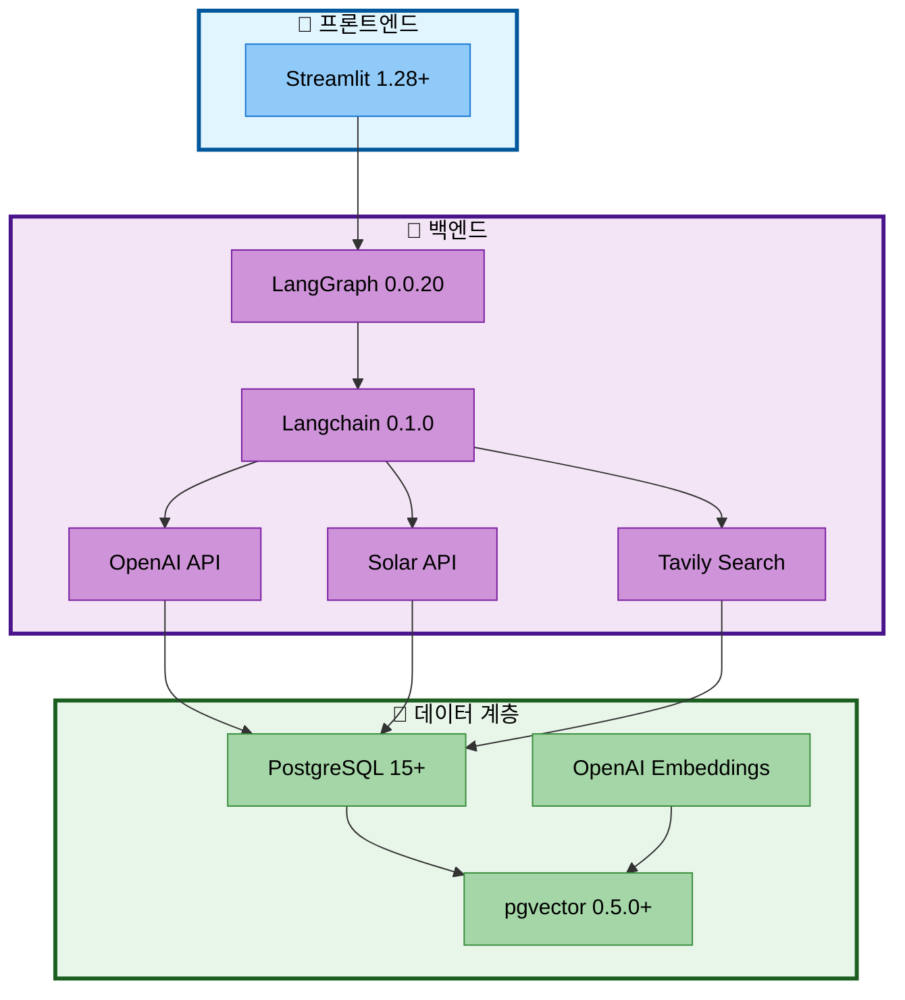

# 01. 개발 환경 및 기술 스택

## 📋 문서 정보
- **작성일**: 2025-11-04
- **작성자**: 최현화[팀장]
- **프로젝트명**: 논문 리뷰 챗봇 (AI Agent + RAG)
- **팀명**: 연결의 민족
- **우선순위**: ⭐⭐⭐ (최고 - 필수 문서)
- **참고 문서**: [PRD/10_기술_요구사항.md](../PRD/10_기술_요구사항.md)

---

## 📌 개요

### 목적
본 문서는 논문 리뷰 챗봇 프로젝트의 **개발 환경 설정 및 기술 스택**을 정의합니다. 팀원들이 일관된 개발 환경에서 작업할 수 있도록 표준 환경을 제시하고, 프로젝트에서 사용하는 모든 기술 스택의 버전과 선택 이유를 명시합니다.

### 개발 환경 요약
- **OS**: Windows 11 + WSL 24.04 LTS (Ubuntu)
- **Python**: 3.11.9
- **가상 환경**: pyenv (langchain_py3_11_9) + venv
- **IDE**: Visual Studio Code
- **데이터베이스**: PostgreSQL 15+ + pgvector 0.5.0+
- **Version Control**: Git + GitHub

---

## 🖥️ 개발 환경

### 1. 운영 체제

#### Windows 11 + WSL 24.04 LTS

**WSL (Windows Subsystem for Linux) 사용 이유:**
- Windows 환경에서 Linux 네이티브 도구 사용
- PostgreSQL 설치 및 관리 용이
- Python 패키지 호환성 우수
- Git, Bash 등 Linux 도구 네이티브 지원

**WSL 설치 및 설정:**

```bash
# PowerShell (관리자 권한)
wsl --install

# Ubuntu 24.04 설치
wsl --install -d Ubuntu-24.04

# WSL 버전 확인
wsl --list --verbose

# WSL2로 업그레이드 (권장)
wsl --set-version Ubuntu-24.04 2
```

**Ubuntu 24.04 초기 설정:**

```bash
# 시스템 업데이트
sudo apt update && sudo apt upgrade -y

# 필수 패키지 설치
sudo apt install -y build-essential curl git wget

# 홈 디렉토리 확인
pwd  # /home/<username>
```

#### macOS (대안)

- macOS 12.0+ (Monterey 이상)
- Homebrew 패키지 관리자 사용

#### Linux (대안)

- Ubuntu 20.04+ LTS
- Debian 11+

---

### 2. Python 환경

#### Python 3.11.9

**선택 이유:**
- Langchain 0.1.0 호환성
- 성능 개선 (3.10 대비 10-60% 향상)
- 안정적인 LTS 버전
- 타입 힌트 강화

#### pyenv 설치 및 설정

**pyenv란?**
- 여러 Python 버전 관리 도구
- 프로젝트별 Python 버전 독립 관리
- 가상 환경 통합 지원

**pyenv 설치:**

```bash
# pyenv 설치 (Linux/WSL)
curl https://pyenv.run | bash

# .bashrc 또는 .zshrc에 추가
echo 'export PYENV_ROOT="$HOME/.pyenv"' >> ~/.bashrc
echo 'command -v pyenv >/dev/null || export PATH="$PYENV_ROOT/bin:$PATH"' >> ~/.bashrc
echo 'eval "$(pyenv init -)"' >> ~/.bashrc

# 설정 적용
source ~/.bashrc

# pyenv 버전 확인
pyenv --version
```

**Python 3.11.9 설치:**

```bash
# Python 3.11.9 설치
pyenv install 3.11.9

# 프로젝트 디렉토리에서 Python 버전 설정
cd /home/<username>/AI_Lab/langchain-project
pyenv local 3.11.9

# 버전 확인
python --version  # Python 3.11.9
```

#### 가상 환경 (venv)

**가상 환경 생성 및 활성화:**

```bash
# 방법 1: Python 기본 venv 사용
python -m venv venv

# 가상 환경 활성화
source venv/bin/activate  # Linux/WSL/macOS
# venv\Scripts\activate  # Windows CMD

# 방법 2: pyenv-virtualenv 사용 (권장)
pyenv virtualenv 3.11.9 langchain_py3_11_9

# 가상 환경 활성화
pyenv activate langchain_py3_11_9

# 가상 환경 확인
which python  # /home/<username>/.pyenv/versions/langchain_py3_11_9/bin/python
```

**가상 환경 자동 활성화 (선택):**

```bash
# 프로젝트 디렉토리에 .python-version 파일 생성
cd /home/<username>/AI_Lab/langchain-project
echo "langchain_py3_11_9" > .python-version

# 이제 디렉토리 진입 시 자동 활성화됨
```

---

### 3. 패키지 관리

#### requirements.txt

**Core Dependencies (필수):**

```txt
# Langchain & LangGraph
langchain==0.1.0
langchain-openai==0.0.2
langchain-community==0.0.13
langgraph==0.0.20
langchain-postgres==0.0.1

# OpenAI
openai==1.6.1

# Database
psycopg2-binary==2.9.9
pgvector==0.2.3

# Web Search
tavily-python==0.3.0

# UI
streamlit==1.28.2
streamlit-chat==0.1.1

# Document Processing
pypdf==3.17.1
pdfplumber==0.10.3
arxiv==2.1.0

# Text Splitting
tiktoken==0.5.2

# Utilities
python-dotenv==1.0.0
pydantic==2.5.3
pyyaml==6.0.1
requests==2.31.0

# Logging & Monitoring
tqdm==4.66.1

# Testing
pytest==7.4.3
pytest-asyncio==0.21.1
```

**Development Dependencies (개발용):**

```txt
# requirements-dev.txt

black==23.12.1       # 코드 포맷팅
flake8==7.0.0        # 린팅
mypy==1.7.1          # 타입 체킹
ipython==8.18.1      # 대화형 셸
jupyter==1.0.0       # 노트북 (실험용)
```

**패키지 설치:**

```bash
# 가상 환경 활성화 후
pip install --upgrade pip

# 필수 패키지 설치
pip install -r requirements.txt

# 개발 패키지 설치 (선택)
pip install -r requirements-dev.txt

# 설치 확인
pip list
```

---

### 4. IDE 및 개발 도구

#### Visual Studio Code

**필수 확장 프로그램:**

| 확장 프로그램 | 설명 |
|--------------|------|
| **Python** (`ms-python.python`) | Python 언어 지원 |
| **Pylance** (`ms-python.vscode-pylance`) | 타입 체킹, 자동완성 |
| **Black Formatter** (`ms-python.black-formatter`) | 코드 포맷팅 |
| **Jupyter** (`ms-toolsai.jupyter`) | 노트북 지원 |
| **GitLens** (`eamodio.gitlens`) | Git 시각화 |

**VS Code 설정 (`.vscode/settings.json`):**

```json
{
  "python.defaultInterpreterPath": "/home/<username>/.pyenv/versions/langchain_py3_11_9/bin/python",
  "python.linting.enabled": true,
  "python.linting.flake8Enabled": true,
  "python.formatting.provider": "black",
  "editor.formatOnSave": true,
  "editor.rulers": [88],
  "[python]": {
    "editor.tabSize": 4,
    "editor.insertSpaces": true
  },
  "files.exclude": {
    "**/__pycache__": true,
    "**/*.pyc": true
  }
}
```

**추천 확장 프로그램 (`.vscode/extensions.json`):**

```json
{
  "recommendations": [
    "ms-python.python",
    "ms-python.vscode-pylance",
    "ms-python.black-formatter",
    "ms-toolsai.jupyter",
    "eamodio.gitlens",
    "ms-vscode-remote.remote-wsl"
  ]
}
```

---

## 🏗️ 기술 스택

### 기술 스택 구조도



**기술 스택 설명:**
- **프론트엔드**: Streamlit 1.28+로 사용자 인터페이스 제공
- **백엔드**: LangGraph + Langchain 기반 AI Agent 로직 처리
- **LLM**: OpenAI (GPT-5), Solar (Solar Pro2) 듀얼 LLM 시스템
- **데이터**: PostgreSQL 15+ + pgvector로 관계형 데이터 및 벡터 검색 통합

---

### 기술 스택 상세표

| 구분 | 기술 | 버전 | 선택 이유 | 라이선스 |
|------|------|------|----------|---------|
| **Frontend** | Streamlit | 1.28+ | 빠른 개발, 채팅 UI 최적화, Python 네이티브 | Apache 2.0 |
| **Framework** | LangGraph | 0.0.20 | AI Agent 상태 관리, 조건부 라우팅 | MIT |
| | Langchain | 0.1.0 | RAG 통합, LLM 추상화, 풍부한 생태계 | MIT |
| **LLM** | OpenAI GPT-5 | Latest | 높은 성능, 안정적 Function Calling | 상용 |
| | Solar Pro2 | Latest | 한국어 특화, Easy 모드 전용 | 상용 |
| **Embeddings** | text-embedding-3-small | Latest | 1536 차원, 비용 효율적, 높은 정확도 | 상용 |
| **Database** | PostgreSQL | 15+ | 안정성, 확장성, pgvector 지원 | PostgreSQL License |
| **Vector Search** | pgvector | 0.5.0+ | PostgreSQL 네이티브, 빠른 검색 | PostgreSQL License |
| **Web Search** | Tavily Search API | Latest | AI Agent 도구, 월 1,000회 무료 | 상용 (Freemium) |
| **Document** | pypdf | 3.17.1 | PDF 텍스트 추출 | BSD-3 |
| | pdfplumber | 0.10.3 | PDF 레이아웃 분석 | MIT |
| | arxiv | 2.1.0 | arXiv API 연동 | MIT |
| **Utilities** | python-dotenv | 1.0.0 | 환경 변수 관리 | BSD-3 |
| | pydantic | 2.5.3 | 데이터 검증 | MIT |
| | pyyaml | 6.0.1 | YAML 설정 파일 파싱 | MIT |
| **Testing** | pytest | 7.4.3 | 단위 테스트 | MIT |

---

### LLM 모델 선택 전략

#### 개발 환경 (Development)

**라우팅 (Router):**
- **모델**: Solar Pro2
- **이유**: 빠른 응답, 저렴한 비용, 충분한 정확도

**일반 답변 (General Answer) - Easy 모드:**
- **모델**: Solar Pro2
- **이유**: 한국어 특화, 쉬운 설명에 적합

**일반 답변 (General Answer) - Hard 모드:**
- **모델**: GPT-5
- **이유**: 전문적 답변, 높은 정확도

**RAG 검색, 논문 요약:**
- **모델**: GPT-5
- **이유**: 복잡한 논문 이해 필요

**웹 검색 정리:**
- **모델**: GPT-5
- **이유**: 빠른 응답, 간단한 정리 작업

#### 운영 환경 (Production)

**모든 도구:**
- **모델**: GPT-5
- **이유**: 최고 품질, 일관된 답변

---

## 🗄️ 데이터베이스 환경

### PostgreSQL 15 + pgvector

#### PostgreSQL 설치 (WSL/Ubuntu)

```bash
# PostgreSQL 저장소 추가
sudo sh -c 'echo "deb http://apt.postgresql.org/pub/repos/apt $(lsb_release -cs)-pgdg main" > /etc/apt/sources.list.d/pgdg.list'
wget --quiet -O - https://www.postgresql.org/media/keys/ACCC4CF8.asc | sudo apt-key add -

# 패키지 목록 업데이트
sudo apt update

# PostgreSQL 15 설치
sudo apt install -y postgresql-15 postgresql-contrib-15

# PostgreSQL 시작 및 자동 시작 설정
sudo service postgresql start
sudo service postgresql status
```

#### pgvector 설치

```bash
# 필수 패키지 설치
sudo apt install -y postgresql-server-dev-15 build-essential git

# pgvector 클론 및 빌드
git clone https://github.com/pgvector/pgvector.git
cd pgvector
make
sudo make install

# PostgreSQL 재시작
sudo service postgresql restart
```

#### 데이터베이스 초기 설정

```bash
# PostgreSQL 접속
sudo -u postgres psql

# 데이터베이스 생성
CREATE DATABASE papers;

# pgvector 확장 활성화
\c papers
CREATE EXTENSION vector;

# 사용자 생성 (선택)
CREATE USER langchain_user WITH PASSWORD 'your_password';
GRANT ALL PRIVILEGES ON DATABASE papers TO langchain_user;

# 종료
\q
```

#### 데이터베이스 스키마

**papers 테이블:**
```sql
CREATE TABLE papers (
    paper_id SERIAL PRIMARY KEY,
    title TEXT NOT NULL,
    authors TEXT,
    publish_date DATE,
    source VARCHAR(50),
    url TEXT,
    category VARCHAR(100),
    citation_count INTEGER,
    abstract TEXT,
    created_at TIMESTAMP DEFAULT CURRENT_TIMESTAMP,
    updated_at TIMESTAMP DEFAULT CURRENT_TIMESTAMP
);
```

**paper_chunks 테이블 (pgvector):**
```sql
CREATE TABLE paper_chunks (
    id SERIAL PRIMARY KEY,
    paper_id INTEGER REFERENCES papers(paper_id),
    chunk_text TEXT,
    embedding vector(1536),
    chunk_index INTEGER,
    created_at TIMESTAMP DEFAULT CURRENT_TIMESTAMP
);

-- 벡터 검색 인덱스 생성
CREATE INDEX ON paper_chunks USING ivfflat (embedding vector_cosine_ops);
```

**glossary 테이블:**
```sql
CREATE TABLE glossary (
    term VARCHAR PRIMARY KEY,
    definition TEXT,
    easy_explanation TEXT,
    hard_explanation TEXT,
    category VARCHAR,
    created_at TIMESTAMP DEFAULT CURRENT_TIMESTAMP
);
```

**query_logs 테이블:**
```sql
CREATE TABLE query_logs (
    log_id SERIAL PRIMARY KEY,
    user_query TEXT,
    difficulty_mode VARCHAR(10),
    tool_used VARCHAR(50),
    response TEXT,
    response_time_ms INTEGER,
    success BOOLEAN,
    error_message TEXT,
    created_at TIMESTAMP DEFAULT CURRENT_TIMESTAMP
);
```

---

## 🔑 환경 변수 설정

### .env 파일

**`.env` 파일 생성:**

```bash
# .env

# ====================
# OpenAI API
# ====================
OPENAI_API_KEY=sk-your-openai-api-key-here

# ====================
# Solar API (Upstage)
# ====================
SOLAR_API_KEY=up-your-solar-api-key-here

# ====================
# PostgreSQL
# ====================
POSTGRES_USER=langchain_user
POSTGRES_PASSWORD=your_password
POSTGRES_HOST=localhost
POSTGRES_PORT=5432
POSTGRES_DB=papers

# ====================
# Tavily Search API
# ====================
TAVILY_API_KEY=tvly-your-tavily-api-key-here

# ====================
# 개발 환경
# ====================
ENVIRONMENT=development  # development, production
LOG_LEVEL=INFO          # DEBUG, INFO, WARNING, ERROR

# ====================
# LLM 설정
# ====================
LLM_MODEL=gpt-5  # GPT-5 모델 사용
LLM_TEMPERATURE=0.7
LLM_MAX_TOKENS=2000

# ====================
# Solar LLM 설정
# ====================
SOLAR_MODEL=solar-pro2  # Solar Pro2 모델 사용
SOLAR_TEMPERATURE=0.7
SOLAR_MAX_TOKENS=2000

# ====================
# Embeddings 설정
# ====================
EMBEDDING_MODEL=text-embedding-3-small
EMBEDDING_DIMENSION=1536
```

**`.env.example` 파일 (Git에 포함):**

```bash
# .env.example

OPENAI_API_KEY=sk-...
SOLAR_API_KEY=up-...
POSTGRES_USER=your_username
POSTGRES_PASSWORD=your_password
POSTGRES_HOST=localhost
POSTGRES_PORT=5432
POSTGRES_DB=papers
TAVILY_API_KEY=tvly-...
ENVIRONMENT=development
LOG_LEVEL=INFO
```

---

## 🛠️ 프로젝트 초기 설정

### 전체 설치 가이드

```bash
# 1. 저장소 클론
git clone https://github.com/<your-org>/langchain-project.git
cd langchain-project

# 2. Python 3.11.9 설치 (pyenv)
pyenv install 3.11.9
pyenv local 3.11.9

# 3. 가상 환경 생성 및 활성화
pyenv virtualenv 3.11.9 langchain_py3_11_9
pyenv activate langchain_py3_11_9

# 4. 패키지 설치
pip install --upgrade pip
pip install -r requirements.txt

# 5. 환경 변수 설정
cp .env.example .env
# .env 파일 편집하여 API 키 입력
nano .env

# 6. PostgreSQL 설정 (위의 데이터베이스 설정 참조)

# 7. 데이터베이스 초기화
python scripts/init_database.py

# 8. 논문 데이터 수집 (선택)
python scripts/collect_papers.py

# 9. VectorDB 구축 (선택)
python scripts/build_vectordb.py

# 10. Streamlit UI 실행
streamlit run ui/app.py
```

### 개발 서버 실행

```bash
# 가상 환경 활성화
pyenv activate langchain_py3_11_9

# Streamlit 실행
streamlit run ui/app.py

# 브라우저 자동 열림: http://localhost:8501
```

---

## ⚠️ 트러블슈팅

### 1. Python 버전 문제

**문제**: `python --version`이 3.11.9가 아님

**해결**:
```bash
# pyenv 경로 확인
which python  # /home/<username>/.pyenv/versions/langchain_py3_11_9/bin/python

# .python-version 파일 생성
echo "langchain_py3_11_9" > .python-version

# 셸 재시작
exec $SHELL
```

### 2. PostgreSQL 연결 오류

**문제**: `psycopg2.OperationalError: could not connect to server`

**해결**:
```bash
# PostgreSQL 상태 확인
sudo service postgresql status

# PostgreSQL 시작
sudo service postgresql start

# 연결 테스트
psql -U langchain_user -d papers -h localhost
```

### 3. pgvector 설치 오류

**문제**: `ERROR: extension "vector" is not available`

**해결**:
```bash
# postgresql-server-dev 확인
sudo apt install postgresql-server-dev-15

# pgvector 재설치
cd pgvector
make clean
make
sudo make install

# PostgreSQL 재시작
sudo service postgresql restart
```

### 4. OpenAI API 오류

**문제**: `openai.error.AuthenticationError`

**해결**:
1. `.env` 파일에서 `OPENAI_API_KEY` 확인
2. API 키 유효성 확인: https://platform.openai.com/api-keys
3. 환경 변수 재로드: `source .env` 또는 서버 재시작

---

## 📝 요약

### 개발 환경 스택

| 항목 | 기술 | 버전 |
|------|------|------|
| **OS** | Windows 11 + WSL 24.04 LTS | - |
| **Python** | Python | 3.11.9 |
| **가상 환경** | pyenv + venv | - |
| **IDE** | Visual Studio Code | Latest |
| **데이터베이스** | PostgreSQL + pgvector | 15+ / 0.5.0+ |
| **VCS** | Git + GitHub | Latest |

### 핵심 기술 스택

| 계층 | 기술 | 버전 |
|------|------|------|
| **Frontend** | Streamlit | 1.28+ |
| **Backend** | LangGraph + Langchain | 0.0.20 + 0.1.0 |
| **LLM** | OpenAI + Solar | Latest |
| **Database** | PostgreSQL + pgvector | 15+ + 0.5.0+ |
| **Embeddings** | text-embedding-3-small | Latest |

### 필수 API 키

1. **OpenAI API Key** - GPT-5/Embeddings
2. **Solar API Key** - Solar Pro2
3. **Tavily API Key** - 웹 검색 (월 1,000회 무료)

### 다음 단계

1. ✅ 개발 환경 설정 완료
2. ✅ 데이터베이스 구축 완료
3. ⭐ 논문 데이터 수집 (선택)
4. ⭐ VectorDB 구축 (선택)
5. ⭐ Streamlit UI 실행

---

## 🔗 관련 문서

- **[PRD/10_기술_요구사항.md](../PRD/10_기술_요구사항.md)** - 기술 스택 상세 명세
- **[02_실험_관리_시스템.md](./02_실험_관리_시스템.md)** - ExperimentManager 설정
- **[04_LLM_클라이언트.md](./04_LLM_클라이언트.md)** - LLM 설정 및 사용
- **[09_RAG_시스템.md](./09_RAG_시스템.md)** - RAG 시스템 구축
