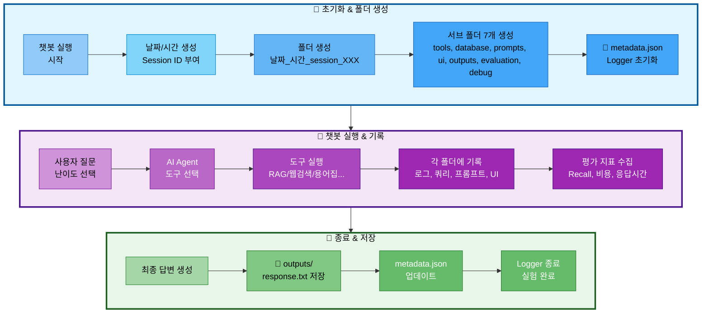

# 02. 실험 관리 시스템 (ExperimentManager)

## 📋 문서 정보
- **작성일**: 2025-11-03
- **시스템명**: 실험 관리 시스템
- **구현 파일**: `src/utils/experiment_manager.py`
- **우선순위**: ⭐⭐⭐ (최우선 - 모든 실험의 기반)
- **참고 문서**: [PRD/06_실험_추적_관리.md](../PRD/06_실험_추적_관리.md)

---

## 📌 시스템 개요

### 목적 및 배경

실험 관리 시스템은 **모든 챗봇 실행을 체계적으로 추적하고 관리하는 핵심 시스템**으로, `src/utils/experiment_manager.py`에 `ExperimentManager` 클래스로 구현되었습니다. 본 시스템은 Session ID 자동 부여, 폴더 구조 자동 생성, Logger 통합, 메타데이터 관리 등을 통합적으로 제공합니다.

### 주요 역할

1. **Session ID 자동 부여**: 당일 기준 순차적 ID 생성 (session_001, 002...)
2. **폴더 구조 자동 생성**: 7개 서브 폴더 자동 생성 (tools, database, prompts, ui, outputs, evaluation, debug)
3. **Logger 통합**: 메인 Logger 및 도구별 Logger 자동 생성
4. **메타데이터 관리**: `metadata.json`으로 실험 정보 추적
5. **DB 쿼리 기록**: SQL 쿼리 및 pgvector 검색 기록
6. **프롬프트 저장**: 시스템/사용자/최종 프롬프트 저장
7. **평가 지표 저장**: RAG, Agent, 비용, 응답 시간 등 평가 데이터 저장

### 의존 관계

```
ExperimentManager (실험 관리)
  ↓
├── Logger (로깅)
├── DB Queries (데이터베이스 기록)
├── Prompts (프롬프트 저장)
├── UI Events (UI 인터랙션)
├── Outputs (결과물 저장)
└── Evaluation (평가 지표)
```

---

## 🏗️ 시스템 아키텍처

### 실험 폴더 생성 흐름



**실험 폴더 생성 흐름 설명:**
- **초기화 단계**: 챗봇 실행 시 자동으로 Session ID 부여 (session_001, 002...) → 폴더 및 서브 폴더 7개 생성 → metadata.json과 Logger 초기화
- **실행 단계**: 사용자 질문 입력 및 난이도 선택 → AI Agent가 적절한 도구 선택 (RAG, 웹검색, 용어집 등) → 실행 과정을 각 폴더에 기록 (도구 로그, DB 쿼리, 프롬프트, UI 인터랙션) → 평가 지표 수집 (Recall@K, 비용, 응답시간)
- **종료 단계**: 최종 답변 생성 → outputs/response.txt 저장 → metadata.json 업데이트 → Logger 종료 및 실험 완료

---

## 📁 실험 폴더 구조

### 필수 디렉토리 구조

모든 챗봇 실행 결과는 `experiments/날짜/날짜_시간_session_XXX/` 구조로 저장됩니다:

```
experiments/
└── 20251103/                                # 날짜 (YYYYMMDD)
    └── 20251103_103015_session_001/         # 시간_session_ID
        │
        ├── metadata.json                    # ⭐ 전체 실험 메타데이터
        ├── chatbot.log                      # 메인 실행 로그
        ├── config.yaml                      # 전체 설정
        │
        ├── tools/                           # 🔧 도구 실행 로그
        │   ├── rag_paper.log                # 논문 검색 로그
        │   ├── rag_glossary.log             # 용어집 검색 로그
        │   ├── web_search.log               # 웹 검색 로그
        │   ├── summary_paper.log            # 논문 요약 로그
        │   ├── file_save.log                # 파일 저장 로그
        │   └── general.log                  # 일반 답변 로그
        │
        ├── database/                        # 🗄️ DB 관련 기록
        │   ├── queries.sql                  # 실행된 SQL 쿼리 모음
        │   ├── pgvector_searches.json       # pgvector 검색 기록
        │   ├── search_results.json          # DB 검색 결과
        │   └── db_performance.json          # 쿼리 실행 시간 등
        │
        ├── prompts/                         # 💬 프롬프트 기록
        │   ├── system_prompt.txt            # 사용된 시스템 프롬프트
        │   ├── user_prompt.txt              # 사용자 질문 + 컨텍스트
        │   ├── final_prompt.txt             # LLM에 전달된 최종 프롬프트
        │   └── prompt_template.yaml         # 프롬프트 템플릿 정보
        │
        ├── ui/                              # 🖥️ UI 관련 기록
        │   ├── streamlit_session.json       # Streamlit 세션 상태
        │   ├── user_interactions.log        # 사용자 인터랙션 로그
        │   └── ui_events.json               # UI 이벤트 기록
        │
        ├── outputs/                         # 📄 생성된 결과물
        │   ├── response.txt                 # 최종 답변
        │   ├── summary.md                   # 요약본 (있을 경우)
        │   └── saved_file.txt               # 사용자가 저장 요청한 파일
        │
        ├── evaluation/                      # 📊 평가 지표
        │   ├── rag_metrics.json             # RAG 평가 지표
        │   ├── agent_accuracy.json          # Agent 정확도
        │   ├── latency_report.json          # 응답 시간 분석
        │   ├── cost_analysis.json           # 비용 분석
        │   └── test_results.json            # 테스트 결과
        │
        └── debug/                           # 🐛 디버그 정보 (선택)
            ├── agent_trace.json             # Agent 실행 추적
            ├── llm_tokens.json              # 토큰 사용량
            └── error_trace.log              # 에러 발생 시 스택 트레이스
```

### metadata.json 구조

각 실험의 핵심 정보를 한 곳에 요약합니다:

```json
{
  "session_id": "001",
  "start_time": "2025-11-03T10:30:15",
  "end_time": "2025-11-03T10:32:45",
  "difficulty": "easy",
  "tool_used": "rag_paper",
  "user_query": "RAG에 대해 알려줘",
  "success": true,
  "response_time_ms": 2500,
  "response_length": 450,
  "model": "gpt-4",
  "temperature": 0.7,
  "tokens_used": {
    "prompt": 1200,
    "completion": 800,
    "total": 2000
  },
  "db_queries_count": 4,
  "db_total_time_ms": 120
}
```

---

## 🔧 ExperimentManager 클래스 구조

### 주요 메서드 분류

#### 1. 도구 (Tools) 관련

| 메서드 | 설명 | 저장 위치 |
|--------|------|-----------|
| `get_tool_logger(tool_name)` | 도구별 독립 Logger 생성 | `tools/{tool_name}.log` |

#### 2. 데이터베이스 (Database) 관련

| 메서드 | 설명 | 저장 위치 |
|--------|------|-----------|
| `log_sql_query(query, description, tool, execution_time_ms)` | SQL 쿼리 기록 | `database/queries.sql` |
| `log_pgvector_search(search_info)` | pgvector 검색 기록 | `database/pgvector_searches.json` |
| `save_search_results(tool, results)` | DB 검색 결과 저장 | `database/search_results.json` |

#### 3. 프롬프트 (Prompts) 관련

| 메서드 | 설명 | 저장 위치 |
|--------|------|-----------|
| `save_system_prompt(system_prompt, metadata)` | 시스템 프롬프트 저장 | `prompts/system_prompt.txt` |
| `save_user_prompt(user_prompt, metadata)` | 사용자 프롬프트 저장 | `prompts/user_prompt.txt` |
| `save_final_prompt(final_prompt)` | 최종 프롬프트 저장 | `prompts/final_prompt.txt` |
| `save_prompt_template(template_info)` | 템플릿 정보 저장 | `prompts/prompt_template.yaml` |

#### 4. UI 관련

| 메서드 | 설명 | 저장 위치 |
|--------|------|-----------|
| `log_ui_interaction(message)` | UI 인터랙션 로그 | `ui/user_interactions.log` |
| `log_ui_event(event_data)` | UI 이벤트 기록 | `ui/ui_events.json` |
| `save_streamlit_session(session_data)` | Streamlit 세션 저장 | `ui/streamlit_session.json` |

#### 5. 평가 (Evaluation) 관련

| 메서드 | 설명 | 저장 위치 |
|--------|------|-----------|
| `save_rag_metrics(metrics)` | RAG 평가 지표 저장 | `evaluation/rag_metrics.json` |
| `save_agent_accuracy(accuracy_data)` | Agent 정확도 저장 | `evaluation/agent_accuracy.json` |
| `save_latency_report(latency_data)` | 응답 시간 분석 저장 | `evaluation/latency_report.json` |
| `save_cost_analysis(cost_data)` | 비용 분석 저장 | `evaluation/cost_analysis.json` |

#### 6. 결과물 (Outputs) 관련

| 메서드 | 설명 | 저장 위치 |
|--------|------|-----------|
| `save_output(filename, content)` | 결과물 저장 | `outputs/{filename}` |
| `update_metadata(**kwargs)` | metadata.json 업데이트 | `metadata.json` |

---

## 📋 Session ID 자동 부여 규칙

### 자동 생성 방식

ExperimentManager는 챗봇 실행 시마다 **Session ID를 자동으로 부여**합니다:

- **형식**: `session_001`, `session_002`, `session_003` ...
- **부여 방식**: 당일 날짜 기준으로 순차적으로 증가
- **시작 번호**: 매일 `001`부터 시작
- **중복 방지**: 당일 폴더를 스캔하여 가장 큰 번호 + 1 부여

### 예시

```
experiments/20251103/
├── 20251103_103015_session_001/   # 오늘 첫 번째 실행
├── 20251103_110234_session_002/   # 오늘 두 번째 실행
└── 20251103_143520_session_003/   # 오늘 세 번째 실행

experiments/20251104/
└── 20251104_090012_session_001/   # 다음 날, 다시 001부터 시작
```

### 구현 로직

ExperimentManager 클래스가 자동으로:
1. 당일 폴더 (`experiments/20251103/`) 스캔
2. 기존 session 폴더 확인 (정규식으로 `session_XXX` 패턴 검색)
3. 가장 큰 번호 추출
4. 다음 번호 (max + 1) 부여

---

## 🔗 통합 시스템

### Logger 통합

ExperimentManager는 Logger를 자동으로 생성하고 관리합니다:

**메인 Logger:**
- 경로: `experiments/날짜/날짜_시간_session_XXX/chatbot.log`
- 접근: `exp.logger.write("메시지")`
- 자동 초기화/종료: with 문 사용 시

**도구별 Logger:**
```python
# 각 도구는 독립 로그 파일 사용
rag_logger = exp.get_tool_logger('rag_paper')     # tools/rag_paper.log
web_logger = exp.get_tool_logger('web_search')    # tools/web_search.log
glossary_logger = exp.get_tool_logger('glossary') # tools/glossary.log
```

### AI Agent 통합

AI Agent의 모든 노드는 ExperimentManager를 통해 실행 과정을 기록합니다:

- **Router 노드**: 도구 선택 로그
- **Tool 노드**: 각 도구의 실행 로그 (도구별 Logger 사용)
- **DB 쿼리**: SQL 및 pgvector 검색 기록
- **프롬프트**: 시스템/사용자/최종 프롬프트 저장
- **평가 지표**: RAG, Agent, 비용, 응답 시간 저장

---

## ⚠️ 주의사항

### 1. with 문 사용 필수

ExperimentManager는 **반드시 with 문으로 사용**해야 합니다:

- ❌ **잘못된 사용**:
  ```python
  exp = ExperimentManager()
  exp.logger.write("메시지")
  # close() 누락 → 리소스 누수
  ```

- ✅ **올바른 사용**:
  ```python
  with ExperimentManager() as exp:
      exp.logger.write("메시지")
  # 자동으로 close() 및 metadata.json 업데이트
  ```

### 2. 도구별 Logger 종료

도구별 Logger는 사용 후 **반드시 close()** 호출해야 합니다:

```python
tool_logger = exp.get_tool_logger('rag_paper')
tool_logger.write("검색 완료")
tool_logger.close()  # 필수!
```

### 3. metadata.json 업데이트 타이밍

`metadata.json`은 `update_metadata()` 호출 시 즉시 저장됩니다:

```python
# 실험 시작 시
exp.update_metadata(user_query="RAG란?", difficulty="easy")

# 실험 종료 시
exp.update_metadata(success=True, tool_used="rag_paper", response_time_ms=2500)
```

### 4. 폴더 자동 생성

ExperimentManager는 7개 서브 폴더를 **자동으로 생성**하지만, 사용자가 임의로 삭제하면 에러 발생:

- 자동 생성 폴더: `tools/`, `database/`, `prompts/`, `ui/`, `outputs/`, `evaluation/`, `debug/`
- 삭제 금지: 실행 중 폴더 삭제 시 파일 저장 실패

---

## 📊 실험 검색 및 분석

### 메타데이터 기반 검색

`metadata.json`을 활용하여 실험을 검색할 수 있습니다:

**검색 조건 예시:**
- 난이도별: `difficulty == "easy"`
- 도구별: `tool_used == "rag_paper"`
- 날짜별: `experiments/20251103/` 폴더 탐색
- 응답 시간: `response_time_ms < 3000`
- 성공/실패: `success == true`

### 평가 지표 집계

여러 실험의 평가 지표를 집계하여 분석할 수 있습니다:

**집계 대상:**
- RAG 평가: `evaluation/rag_metrics.json` (Recall@K, Precision, Faithfulness)
- Agent 정확도: `evaluation/agent_accuracy.json` (도구 선택 정확도)
- 응답 시간: `evaluation/latency_report.json` (p50/p95/p99)
- 비용: `evaluation/cost_analysis.json` (토큰 사용량, USD/KRW)

---

## 🔗 관련 문서

- **[01_로깅_시스템.md](./01_로깅_시스템.md)** - Logger 클래스 상세
- **[03_AI_Agent_시스템.md](./03_AI_Agent_시스템.md)** - Agent에서 ExperimentManager 사용
- **[PRD/06_실험_추적_관리.md](../PRD/06_실험_추적_관리.md)** - 실험 추적 관리 전체 명세
- **[PRD/09_평가_기준.md](../PRD/09_평가_기준.md)** - RAG, Agent, DB 평가 지표

---

## 📝 요약

### 구현된 핵심 기능

1. ✅ Session ID 자동 부여 (당일 기준 순차 증가)
2. ✅ 7개 서브 폴더 자동 생성 (tools, database, prompts, ui, outputs, evaluation, debug)
3. ✅ Logger 자동 통합 (메인 + 도구별)
4. ✅ metadata.json 자동 관리
5. ✅ DB 쿼리 기록 (SQL, pgvector)
6. ✅ 프롬프트 저장 (시스템, 사용자, 최종)
7. ✅ 평가 지표 저장 (RAG, Agent, 비용, 응답시간)
8. ✅ with 문 지원 (자동 리소스 정리)

### 저장되는 파일 구조

**필수 파일:**
- `chatbot.log` - 메인 실행 로그
- `metadata.json` - 실험 메타데이터
- `config.yaml` - 전체 설정

**서브 폴더별 파일:**
- `tools/*.log` - 도구별 실행 로그
- `database/*.{sql,json}` - DB 쿼리 및 검색 기록
- `prompts/*.{txt,yaml}` - 프롬프트 저장
- `ui/*.{log,json}` - UI 인터랙션 기록
- `outputs/*` - 최종 답변 및 결과물
- `evaluation/*.json` - 평가 지표
- `debug/*.{json,log}` - 디버그 정보 (선택)

### 통합 시스템

- **Logger 시스템**: 자동 생성 및 관리
- **AI Agent**: 모든 노드에서 실험 기록
- **RAG 시스템**: DB 쿼리 및 검색 결과 저장
- **LLM Client**: 토큰 사용량 및 비용 추적
- **UI (Streamlit)**: 사용자 인터랙션 기록

### 사용 패턴

```python
# 기본 사용
with ExperimentManager() as exp:
    exp.logger.write("실험 시작")
    exp.update_metadata(user_query="RAG란?")

    # 도구별 Logger
    tool_logger = exp.get_tool_logger('rag_paper')
    tool_logger.write("검색 완료")
    tool_logger.close()

    # 결과 저장
    exp.save_output('response.txt', answer)
    exp.update_metadata(success=True)
```
