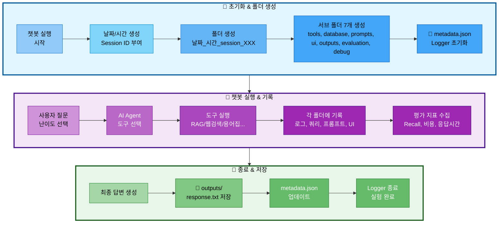

# 03. 실험 관리 시스템 (ExperimentManager)

## 📋 문서 정보
- **최초 작성일**: 2025-11-03
- **최근 업데이트**: 2025-11-04
- **시스템명**: 실험 관리 시스템
- **구현 파일**: `src/utils/experiment_manager.py`
- **우선순위**: ⭐⭐⭐ (최우선 - 모든 실험의 기반)
- **작성자**: 최현화[팀장]
- **참고 문서**: [PRD/06_실험_추적_관리.md](../PRD/06_실험_추적_관리.md), [docs/rules/실험_폴더_구조.md](../rules/실험_폴더_구조.md)

---

## 📌 시스템 개요

### 목적 및 배경

실험 관리 시스템은 **모든 챗봇 실행을 체계적으로 추적하고 관리하는 핵심 시스템**으로, `src/utils/experiment_manager.py`에 `ExperimentManager` 클래스로 구현되었습니다. 본 시스템은 Session ID 자동 부여, 폴더 구조 자동 생성, Logger 통합, 메타데이터 관리 등을 통합적으로 제공합니다.

### 주요 역할

1. **Session ID 자동 부여**: 당일 기준 순차적 ID 생성 (session_001, 002...)
2. **폴더 구조 자동 생성**: 7개 서브 폴더 자동 생성 (tools, database, prompts, ui, outputs, evaluation, debug)
3. **Logger 통합**: 메인 Logger 및 도구별 Logger 자동 생성
4. **메타데이터 관리**: `metadata.json`으로 실험 정보 추적
5. **DB 쿼리 기록**: SQL 쿼리 및 pgvector 검색 기록
6. **프롬프트 저장**: 시스템/사용자/최종 프롬프트 저장
7. **평가 지표 저장**: RAG, Agent, 비용, 응답 시간 등 평가 데이터 저장

### 의존 관계

```
ExperimentManager (실험 관리)
  ↓
├── Logger (로깅)
├── DB Queries (데이터베이스 기록)
├── Prompts (프롬프트 저장)
├── UI Events (UI 인터랙션)
├── Outputs (결과물 저장)
└── Evaluation (평가 지표)
```

---

## ✅ 구현 현황 (2025-11-04 기준)

### 완전 구현된 기능

#### 1. 평가 시스템 완전 작동 ✅
- **파일**: `src/evaluation/evaluator.py:282-305`
- **개선 내용**: KeyError 'question' 문제 해결
- **구현 상세**:
  - 평가 결과에 question, answer, reference_docs, difficulty 필드 추가
  - 에러 처리 시에도 모든 필드 포함하도록 개선
  - DB 저장 및 UI 표시 정상 작동

```python
# src/evaluation/evaluator.py:287-295
result = json.loads(result_text)

# 질문과 답변 추가 (DB 저장용)
result["question"] = question
result["answer"] = answer
result["reference_docs"] = reference_docs
result["difficulty"] = difficulty

self.logger.write(f"평가 완료: 총점 {result.get('total_score', 0)}/40")
return result
```

#### 2. LLM 응답 전체 내용 로깅 ✅
- **대상 도구**: general_answer, search_paper, web_search, glossary, summarize, text2sql
- **개선 내용**: 기존에는 글자 수만 기록, 이제 전체 응답 내용 로깅
- **구현 위치**:
  - `src/tools/general_answer.py:72-77`
  - `src/tools/search_paper.py:320-326`
  - `src/tools/web_search.py:149-155`
  - `src/tools/glossary.py:494-500`
  - `src/tools/summarize.py:208-213`
  - `src/tools/text2sql.py` (text2sql.log에 기록)

```python
# 모든 도구의 공통 패턴
if tool_logger:
    tool_logger.write(f"답변 생성 완료: {len(response.content)} 글자")
    tool_logger.write("=" * 80)
    tool_logger.write("[LLM 답변 전체 내용]")
    tool_logger.write(response.content)
    tool_logger.write("=" * 80)
    tool_logger.close()
```

#### 3. 평가 결과 자동 저장 ✅
- **파일**: `src/utils/experiment_manager.py:263-275`, `ui/components/chat_interface.py:266-272`
- **저장 위치**: `evaluation/evaluation_YYYYMMDD_HHMMSS.json`
- **구현 상세**:
  - 답변 평가 완료 후 자동으로 evaluation 폴더에 JSON 저장
  - 타임스탬프 포함하여 중복 방지
  - 평가 점수, 질문, 답변, 참고 문서 모두 포함

```python
# src/utils/experiment_manager.py:263-275
def save_evaluation_result(self, evaluation_data: Dict):
    """답변 평가 결과 저장"""
    evaluation_data['timestamp'] = datetime.now().isoformat()
    timestamp = datetime.now().strftime("%Y%m%d_%H%M%S")
    eval_file = self.evaluation_dir / f"evaluation_{timestamp}.json"

    with open(eval_file, 'w', encoding='utf-8') as f:
        json.dump(evaluation_data, f, ensure_ascii=False, indent=2)

    self.logger.write(f"평가 결과 저장: {eval_file.name}")
```

#### 4. 전체 대화 자동 저장 ✅ (2025-11-04 개선)
- **파일**: `src/utils/experiment_manager.py:559-596`, `ui/components/chat_interface.py:462`
- **저장 위치**: `outputs/conversation_{difficulty}_{timestamp}.json`
- **개선 내용**:
  - ✅ **모드별 파일명 구분**: conversation_easy_*, conversation_hard_* 형식으로 저장
  - ✅ **이어쓰기 방식**: 세션당 모드별로 하나의 파일 사용, 새 메시지만 추가
  - ✅ **중복 방지**: 기존 메시지 내용 체크하여 중복 메시지 제외
  - ✅ **타임스탬프**: 세션 시작 시 한 번만 생성, 파일명에 포함

**구현 상세**:
```python
# src/utils/experiment_manager.py:559-596
def save_conversation(self, conversation_data: list, difficulty: str = "easy"):
    """전체 대화 기록 저장 (이어쓰기 방식)"""
    # 세션당 모드별로 하나의 파일 사용
    if not hasattr(self, f'conversation_file_{difficulty}'):
        timestamp = datetime.now().strftime("%Y%m%d_%H%M%S")
        conv_file = self.outputs_dir / f"conversation_{difficulty}_{timestamp}.json"
        setattr(self, f'conversation_file_{difficulty}', conv_file)
    else:
        conv_file = getattr(self, f'conversation_file_{difficulty}')

    # 기존 내용 읽기 (있다면)
    if conv_file.exists():
        with open(conv_file, 'r', encoding='utf-8') as f:
            try:
                existing_data = json.load(f)
            except json.JSONDecodeError:
                existing_data = []
    else:
        existing_data = []

    # 새 메시지만 추가 (중복 방지)
    existing_contents = {msg.get('content', '') for msg in existing_data}
    for msg in conversation_data:
        if msg.get('content', '') not in existing_contents:
            existing_data.append(msg)
            existing_contents.add(msg.get('content', ''))

    # 저장
    with open(conv_file, 'w', encoding='utf-8') as f:
        json.dump(existing_data, f, ensure_ascii=False, indent=2)

    self.logger.write(f"대화 저장: {conv_file.name} ({len(existing_data)}개 메시지)")

# ui/components/chat_interface.py:462
exp_manager.save_conversation(messages, difficulty=difficulty)
```

**변경 전후 비교**:
- **변경 전**: 매 답변마다 새 파일 생성 (conversation_20251104_213739.json, conversation_20251104_213805.json...)
- **변경 후**: 모드별로 하나의 파일에 이어쓰기 (conversation_easy_20251104_213739.json)

**장점**:
- 대화 히스토리 추적 용이
- 파일 개수 감소 (세션당 최대 2개: easy + hard)
- 모드 전환 시에도 각 모드별 대화 분리 저장

**상세 문서**: [03-1_Conversation_파일_관리.md](./03-1_Conversation_파일_관리.md)

#### 5. SQL 쿼리 자동 저장 ✅
- **파일**: `src/utils/experiment_manager.py:291-312`, `close()` 메서드에서 자동 호출
- **저장 위치**: `database/queries_YYYYMMDD_HHMMSS.sql`
- **구현 상세**:
  - 실험 세션 종료 시 수집된 모든 SQL 쿼리 자동 저장
  - 쿼리별 타임스탬프, 실행 시간 포함
  - 주석으로 메타데이터 기록

```python
# src/utils/experiment_manager.py:304-312
with open(query_file, 'w', encoding='utf-8') as f:
    f.write("-- SQL Queries Log\n")
    f.write(f"-- Generated at: {datetime.now().isoformat()}\n\n")

    for i, query_info in enumerate(self.db_queries, 1):
        f.write(f"-- Query {i}\n")
        f.write(f"-- Time: {query_info.get('timestamp', 'N/A')}\n")
        f.write(f"-- Execution Time: {query_info.get('execution_time_ms', 'N/A')} ms\n")
        f.write(f"{query_info['query']}\n\n")
```

#### 6. 프롬프트 자동 저장 ✅
- **대상 도구**: general_answer, search_paper, web_search, glossary, summarize
- **저장 위치**: `prompts/system_prompt_YYYYMMDD_HHMMSS.txt`, `prompts/user_prompt_YYYYMMDD_HHMMSS.txt`
- **구현 위치**:
  - `src/tools/general_answer.py:42-50`
  - `src/tools/search_paper.py:280-308`
  - `src/tools/web_search.py:127-130`
  - `src/tools/glossary.py:468-496`
  - `src/tools/summarize.py:172-174`

```python
# 공통 패턴 (예: search_paper.py:280-308)
if exp_manager:
    exp_manager.save_system_prompt(system_prompt, {
        "tool": "search_paper",
        "difficulty": difficulty
    })

if exp_manager:
    exp_manager.save_user_prompt(user_content, {
        "tool": "search_paper",
        "difficulty": difficulty,
        "search_results_length": len(raw_results)
    })
```

### 부분 구현된 기능 (인프라 존재, 호출 필요)

#### 1. pgvector 검색 기록 🟡
- **메서드**: `log_pgvector_search()` - ✅ 구현됨
- **호출 상태**: summarize.py에서만 호출 (`src/tools/summarize.py:138-145`)
- **필요 작업**: search_paper, glossary 도구에서도 호출 필요

#### 2. DB 검색 결과 저장 🟡
- **메서드**: `save_search_results()` - ✅ 구현됨
- **호출 상태**: 미호출
- **필요 작업**: 각 도구에서 검색 결과 저장 호출

#### 3. DB 성능 저장 🟡
- **메서드**: `save_db_performance()` - ✅ 구현됨
- **호출 상태**: 미호출
- **필요 작업**: 쿼리 실행 시간 측정 후 저장

#### 4. Streamlit 세션 저장 🟡
- **메서드**: `save_streamlit_session()` - ✅ 구현됨
- **호출 상태**: 미호출
- **필요 작업**: UI에서 세션 상태 저장 호출

#### 5. UI 이벤트 기록 🟡
- **메서드**: `log_ui_event()` - ✅ 구현됨
- **호출 상태**: 미호출
- **필요 작업**: UI 이벤트 발생 시마다 기록

### 미구현 기능 ❌

#### 1. final_prompt.txt ❌
- **위치**: `prompts/final_prompt.txt`
- **목적**: LLM에 전달된 최종 프롬프트 (system + user 결합)
- **구현 필요**: 메서드는 존재하나 호출하는 곳 없음

#### 2. prompt_template.yaml ❌
- **위치**: `prompts/prompt_template.yaml`
- **목적**: 프롬프트 템플릿 메타데이터
- **구현 필요**: 메서드는 존재하나 호출하는 곳 없음

#### 3. summary.md (요약 도구) ❌
- **위치**: `outputs/summary.md`
- **목적**: summarize 도구 실행 결과를 Markdown으로 저장
- **구현 필요**: summarize_node에서 결과를 summary.md로 저장

#### 4. config.yaml ❌
- **위치**: `config.yaml` (실험 폴더 루트)
- **목적**: 실험 실행 시 사용된 전체 설정 스냅샷
- **구현 필요**: 실험 시작 시 config 파일 복사

#### 5. RAG 평가 지표 ❌
- **메서드**: `save_rag_metrics()` - ✅ 구현됨
- **호출 상태**: 미호출
- **필요 작업**: Recall@K, Precision 계산 후 저장

#### 6. Agent 정확도 ❌
- **메서드**: `save_agent_accuracy()` - ✅ 구현됨
- **호출 상태**: 미호출
- **필요 작업**: 도구 선택 정확도 계산 후 저장

#### 7. 응답 시간 분석 ❌
- **메서드**: `save_latency_report()` - ✅ 구현됨
- **호출 상태**: 미호출
- **필요 작업**: 단계별 응답 시간 측정 후 저장

#### 8. 비용 분석 ❌
- **메서드**: `save_cost_analysis()` - ✅ 구현됨
- **호출 상태**: 미호출
- **필요 작업**: 토큰 사용량 및 비용 계산 후 저장

---

## 📝 최근 개선사항 (2025-11-04)

### 커밋 기록 (7개)

#### 1. fix: 평가 결과에 question, answer 필드 누락 수정 (35c2480)
**문제**: 평가 시스템에서 `KeyError: 'question'` 발생
**원인**: evaluator.py의 evaluate() 메서드가 점수만 반환, question/answer 미포함
**해결**:
- evaluate() 반환 딕셔너리에 question, answer, reference_docs, difficulty 추가
- 에러 처리 케이스에도 동일 필드 추가
- 평가 결과 DB 저장 및 UI 표시 정상화

**수정 파일**: `src/evaluation/evaluator.py`

#### 2-3. feat: 도구별 LLM 답변 전체 내용 로그 기록 추가 (aaf1dfc, b21cbec)
**문제**: 로그에 "LLM 응답 생성 완료: 590 글자"만 기록, 실제 내용 없음
**원인**: 각 도구에서 response.content를 로깅하지 않음
**해결**:
- 6개 도구(general_answer, search_paper, web_search, glossary, summarize, text2sql)에 전체 응답 로깅 추가
- 80자 구분선(`"=" * 80`)으로 가독성 향상
- "[LLM 답변 전체 내용]" 헤더로 구분

**수정 파일**:
- `src/tools/general_answer.py`
- `src/tools/search_paper.py`
- `src/tools/web_search.py`
- `src/tools/glossary.py`
- `src/tools/summarize.py`
- `src/tools/text2sql.py`

#### 4. feat: ExperimentManager 저장 메서드 추가 (95834c2)
**문제**: 평가 결과, 대화 내역, SQL 쿼리가 저장되지 않음
**원인**: 인프라 메서드가 없었음
**해결**:
- `save_evaluation_result()`: evaluation 폴더에 평가 결과 JSON 저장
- `save_conversation()`: outputs 폴더에 전체 대화 JSON 저장
- `flush_queries_to_file()`: database 폴더에 SQL 쿼리 저장
- `close()` 메서드에서 flush_queries_to_file() 자동 호출

**수정 파일**: `src/utils/experiment_manager.py`

#### 5. feat: 평가 결과 및 전체 대화 자동 저장 기능 추가 (465ba4c)
**문제**: 평가/대화 저장 메서드가 있지만 실제로 호출되지 않음
**원인**: UI에서 호출하지 않음
**해결**:
- 평가 완료 후 `exp_manager.save_evaluation_result()` 호출
- 답변 추가 후 `exp_manager.save_conversation()` 호출
- get_current_messages()로 세션 상태에서 대화 추출

**수정 파일**: `ui/components/chat_interface.py`

#### 6. feat: 일반 답변 도구 프롬프트 자동 저장 (b149e21)
**문제**: 프롬프트가 prompts 폴더에 저장되지 않음
**원인**: 도구에서 save_system_prompt/save_user_prompt 호출 안 함
**해결**:
- general_answer_node에 프롬프트 저장 로직 추가
- 메타데이터(tool, difficulty) 포함하여 저장

**수정 파일**: `src/tools/general_answer.py`

#### 7. feat: 용어집 도구 프롬프트 자동 저장 (25b7bb6)
**문제**: glossary 도구의 프롬프트 미저장
**원인**: search_paper, web_search, summarize는 추가했지만 glossary 누락
**해결**:
- glossary_node에 save_system_prompt(), save_user_prompt() 호출 추가
- 검색 결과 길이(search_results_length) 메타데이터 포함

**수정 파일**: `src/tools/glossary.py`

**참고**: search_paper, web_search, summarize는 이미 프롬프트 저장 기능이 구현되어 있었음

---

## 🏗️ 시스템 아키텍처

### 실험 폴더 생성 흐름



**실험 폴더 생성 흐름 설명:**
- **초기화 단계**: 챗봇 실행 시 자동으로 Session ID 부여 (session_001, 002...) → 폴더 및 서브 폴더 7개 생성 → metadata.json과 Logger 초기화
- **실행 단계**: 사용자 질문 입력 및 난이도 선택 → AI Agent가 적절한 도구 선택 (RAG, 웹검색, 용어집 등) → 실행 과정을 각 폴더에 기록 (도구 로그, DB 쿼리, 프롬프트, UI 인터랙션) → 평가 지표 수집 (Recall@K, 비용, 응답시간)
- **종료 단계**: 최종 답변 생성 → outputs/response.txt 저장 → metadata.json 업데이트 → Logger 종료 및 실험 완료

---

## 📁 실험 폴더 구조

### 필수 디렉토리 구조

모든 챗봇 실행 결과는 `experiments/날짜/날짜_시간_session_XXX/` 구조로 저장됩니다:

```
experiments/
└── 20251103/                                # 날짜 (YYYYMMDD)
    └── 20251103_103015_session_001/         # 시간_session_ID
        │
        ├── metadata.json                    # ⭐ 전체 실험 메타데이터
        ├── chatbot.log                      # 메인 실행 로그
        ├── config.yaml                      # 전체 설정
        │
        ├── tools/                           # 🔧 도구 실행 로그
        │   ├── rag_paper.log                # 논문 검색 로그
        │   ├── rag_glossary.log             # 용어집 검색 로그
        │   ├── web_search.log               # 웹 검색 로그
        │   ├── summary_paper.log            # 논문 요약 로그
        │   ├── file_save.log                # 파일 저장 로그
        │   └── general.log                  # 일반 답변 로그
        │
        ├── database/                        # 🗄️ DB 관련 기록
        │   ├── queries.sql                  # 실행된 SQL 쿼리 모음
        │   ├── pgvector_searches.json       # pgvector 검색 기록
        │   ├── search_results.json          # DB 검색 결과
        │   └── db_performance.json          # 쿼리 실행 시간 등
        │
        ├── prompts/                         # 💬 프롬프트 기록
        │   ├── system_prompt.txt            # 사용된 시스템 프롬프트
        │   ├── user_prompt.txt              # 사용자 질문 + 컨텍스트
        │   ├── final_prompt.txt             # LLM에 전달된 최종 프롬프트
        │   └── prompt_template.yaml         # 프롬프트 템플릿 정보
        │
        ├── ui/                              # 🖥️ UI 관련 기록
        │   ├── streamlit_session.json       # Streamlit 세션 상태
        │   ├── user_interactions.log        # 사용자 인터랙션 로그
        │   └── ui_events.json               # UI 이벤트 기록
        │
        ├── outputs/                         # 📄 생성된 결과물
        │   ├── response.txt                 # 최종 답변
        │   ├── summary.md                   # 요약본 (있을 경우)
        │   └── saved_file.txt               # 사용자가 저장 요청한 파일
        │
        ├── evaluation/                      # 📊 평가 지표
        │   ├── rag_metrics.json             # RAG 평가 지표
        │   ├── agent_accuracy.json          # Agent 정확도
        │   ├── latency_report.json          # 응답 시간 분석
        │   ├── cost_analysis.json           # 비용 분석
        │   └── test_results.json            # 테스트 결과
        │
        └── debug/                           # 🐛 디버그 정보 (선택)
            ├── agent_trace.json             # Agent 실행 추적
            ├── llm_tokens.json              # 토큰 사용량
            └── error_trace.log              # 에러 발생 시 스택 트레이스
```

### metadata.json 구조 (2025-11-04 개선)

각 실험의 핵심 정보를 한 곳에 요약합니다:

```json
{
  "session_id": "001",
  "start_time": "2025-11-03T10:30:15",
  "end_time": "2025-11-03T10:32:45",
  "difficulty": "easy",
  "tool_used": "rag_paper",
  "user_query": "RAG에 대해 알려줘",
  "success": true,
  "response_time_ms": 2500,
  "response_length": 450,
  "model": "gpt-5",
  "temperature": 0.7,
  "tokens_used": {
    "prompt": 1200,
    "completion": 800,
    "total": 2000
  },
  "db_queries_count": 4,
  "db_total_time_ms": 120
}
```

**2025-11-04 개선사항**:
- ✅ **difficulty 자동 업데이트**: Agent 실행 시작 시 난이도 자동 기록
- ✅ **success 자동 설정**: 답변 성공 시 True, 에러 발생 시 False 자동 업데이트
- ✅ **response_time_ms 자동 계산**: 시작~종료 시간 차이 밀리초 단위로 자동 계산
- ✅ **end_time 자동 업데이트**: ExperimentManager close() 시 자동 설정

**구현 위치**: `ui/components/chat_interface.py:186-211, 488-489`

---

## 🔧 ExperimentManager 클래스 구조

### 주요 메서드 분류

#### 1. 도구 (Tools) 관련

| 메서드 | 설명 | 저장 위치 |
|--------|------|-----------|
| `get_tool_logger(tool_name)` | 도구별 독립 Logger 생성 | `tools/{tool_name}.log` |

#### 2. 데이터베이스 (Database) 관련

| 메서드 | 설명 | 저장 위치 |
|--------|------|-----------|
| `log_sql_query(query, description, tool, execution_time_ms)` | SQL 쿼리 기록 | `database/queries.sql` |
| `log_pgvector_search(search_info)` | pgvector 검색 기록 | `database/pgvector_searches.json` |
| `save_search_results(tool, results)` | DB 검색 결과 저장 | `database/search_results.json` |

#### 3. 프롬프트 (Prompts) 관련

| 메서드 | 설명 | 저장 위치 |
|--------|------|-----------|
| `save_system_prompt(system_prompt, metadata)` | 시스템 프롬프트 저장 | `prompts/system_prompt.txt` |
| `save_user_prompt(user_prompt, metadata)` | 사용자 프롬프트 저장 | `prompts/user_prompt.txt` |
| `save_final_prompt(final_prompt)` | 최종 프롬프트 저장 | `prompts/final_prompt.txt` |
| `save_prompt_template(template_info)` | 템플릿 정보 저장 | `prompts/prompt_template.yaml` |

#### 4. UI 관련

| 메서드 | 설명 | 저장 위치 |
|--------|------|-----------|
| `log_ui_interaction(message)` | UI 인터랙션 로그 | `ui/user_interactions.log` |
| `log_ui_event(event_data)` | UI 이벤트 기록 | `ui/ui_events.json` |
| `save_streamlit_session(session_data)` | Streamlit 세션 저장 | `ui/streamlit_session.json` |

#### 5. 평가 (Evaluation) 관련

| 메서드 | 설명 | 저장 위치 |
|--------|------|-----------|
| `save_rag_metrics(metrics)` | RAG 평가 지표 저장 | `evaluation/rag_metrics.json` |
| `save_agent_accuracy(accuracy_data)` | Agent 정확도 저장 | `evaluation/agent_accuracy.json` |
| `save_latency_report(latency_data)` | 응답 시간 분석 저장 | `evaluation/latency_report.json` |
| `save_cost_analysis(cost_data)` | 비용 분석 저장 | `evaluation/cost_analysis.json` |

#### 6. 결과물 (Outputs) 관련

| 메서드 | 설명 | 저장 위치 |
|--------|------|-----------|
| `save_output(filename, content)` | 결과물 저장 | `outputs/{filename}` |
| `update_metadata(**kwargs)` | metadata.json 업데이트 | `metadata.json` |

---

## 📋 Session ID 자동 부여 규칙

### 자동 생성 방식

ExperimentManager는 챗봇 실행 시마다 **Session ID를 자동으로 부여**합니다:

- **형식**: `session_001`, `session_002`, `session_003` ...
- **부여 방식**: 당일 날짜 기준으로 순차적으로 증가
- **시작 번호**: 매일 `001`부터 시작
- **중복 방지**: 당일 폴더를 스캔하여 가장 큰 번호 + 1 부여

### 예시

```
experiments/20251103/
├── 20251103_103015_session_001/   # 오늘 첫 번째 실행
├── 20251103_110234_session_002/   # 오늘 두 번째 실행
└── 20251103_143520_session_003/   # 오늘 세 번째 실행

experiments/20251104/
└── 20251104_090012_session_001/   # 다음 날, 다시 001부터 시작
```

### 구현 로직

ExperimentManager 클래스가 자동으로:
1. 당일 폴더 (`experiments/20251103/`) 스캔
2. 기존 session 폴더 확인 (정규식으로 `session_XXX` 패턴 검색)
3. 가장 큰 번호 추출
4. 다음 번호 (max + 1) 부여

---

## 🔗 통합 시스템

### Logger 통합

ExperimentManager는 Logger를 자동으로 생성하고 관리합니다:

**메인 Logger:**
- 경로: `experiments/날짜/날짜_시간_session_XXX/chatbot.log`
- 접근: `exp.logger.write("메시지")`
- 자동 초기화/종료: with 문 사용 시

**도구별 Logger:**
```python
# 각 도구는 독립 로그 파일 사용
rag_logger = exp.get_tool_logger('rag_paper')     # tools/rag_paper.log
web_logger = exp.get_tool_logger('web_search')    # tools/web_search.log
glossary_logger = exp.get_tool_logger('glossary') # tools/glossary.log
```

### AI Agent 통합

AI Agent의 모든 노드는 ExperimentManager를 통해 실행 과정을 기록합니다:

- **Router 노드**: 도구 선택 로그
- **Tool 노드**: 각 도구의 실행 로그 (도구별 Logger 사용)
- **DB 쿼리**: SQL 및 pgvector 검색 기록
- **프롬프트**: 시스템/사용자/최종 프롬프트 저장
- **평가 지표**: RAG, Agent, 비용, 응답 시간 저장

---

## ⚠️ 주의사항

### 1. with 문 사용 필수

ExperimentManager는 **반드시 with 문으로 사용**해야 합니다:

- ❌ **잘못된 사용**:
  ```python
  exp = ExperimentManager()
  exp.logger.write("메시지")
  # close() 누락 → 리소스 누수
  ```

- ✅ **올바른 사용**:
  ```python
  with ExperimentManager() as exp:
      exp.logger.write("메시지")
  # 자동으로 close() 및 metadata.json 업데이트
  ```

### 2. 도구별 Logger 종료

도구별 Logger는 사용 후 **반드시 close()** 호출해야 합니다:

```python
tool_logger = exp.get_tool_logger('rag_paper')
tool_logger.write("검색 완료")
tool_logger.close()  # 필수!
```

### 3. metadata.json 업데이트 타이밍

`metadata.json`은 `update_metadata()` 호출 시 즉시 저장됩니다:

```python
# 실험 시작 시
exp.update_metadata(user_query="RAG란?", difficulty="easy")

# 실험 종료 시
exp.update_metadata(success=True, tool_used="rag_paper", response_time_ms=2500)
```

### 4. 폴더 자동 생성

ExperimentManager는 7개 서브 폴더를 **자동으로 생성**하지만, 사용자가 임의로 삭제하면 에러 발생:

- 자동 생성 폴더: `tools/`, `database/`, `prompts/`, `ui/`, `outputs/`, `evaluation/`, `debug/`
- 삭제 금지: 실행 중 폴더 삭제 시 파일 저장 실패

---

## 📊 실험 검색 및 분석

### 메타데이터 기반 검색

`metadata.json`을 활용하여 실험을 검색할 수 있습니다:

**검색 조건 예시:**
- 난이도별: `difficulty == "easy"`
- 도구별: `tool_used == "rag_paper"`
- 날짜별: `experiments/20251103/` 폴더 탐색
- 응답 시간: `response_time_ms < 3000`
- 성공/실패: `success == true`

### 평가 지표 집계

여러 실험의 평가 지표를 집계하여 분석할 수 있습니다:

**집계 대상:**
- RAG 평가: `evaluation/rag_metrics.json` (Recall@K, Precision, Faithfulness)
- Agent 정확도: `evaluation/agent_accuracy.json` (도구 선택 정확도)
- 응답 시간: `evaluation/latency_report.json` (p50/p95/p99)
- 비용: `evaluation/cost_analysis.json` (토큰 사용량, USD/KRW)

---

## 🔗 관련 문서

- **[01_로깅_시스템.md](./01_로깅_시스템.md)** - Logger 클래스 상세
- **[03_AI_Agent_시스템.md](./03_AI_Agent_시스템.md)** - Agent에서 ExperimentManager 사용
- **[PRD/06_실험_추적_관리.md](../PRD/06_실험_추적_관리.md)** - 실험 추적 관리 전체 명세
- **[PRD/09_평가_기준.md](../PRD/09_평가_기준.md)** - RAG, Agent, DB 평가 지표

---

## 📝 요약

### 완전 구현된 기능 (2025-11-04 기준)

1. ✅ **Session ID 자동 부여**: 당일 기준 순차 증가 (session_001, 002...)
2. ✅ **7개 서브 폴더 자동 생성**: tools, database, prompts, ui, outputs, evaluation, debug
3. ✅ **Logger 자동 통합**: 메인 + 도구별 Logger 자동 생성 및 관리
4. ✅ **metadata.json 자동 관리**: 실험 메타데이터 자동 추적
5. ✅ **LLM 응답 전체 로깅**: 6개 도구 모두 전체 응답 내용 기록
6. ✅ **평가 결과 자동 저장**: evaluation 폴더에 JSON 형식 저장
7. ✅ **전체 대화 자동 저장**: outputs 폴더에 대화 내역 JSON 저장
8. ✅ **SQL 쿼리 자동 저장**: database 폴더에 SQL 파일 자동 저장 (close 시)
9. ✅ **프롬프트 자동 저장**: 5개 주요 도구에서 system/user 프롬프트 저장
10. ✅ **with 문 지원**: 자동 리소스 정리 및 종료 처리

### 부분 구현 (인프라 있음, 호출 필요)

1. 🟡 **pgvector 검색 기록**: summarize만 호출, search_paper/glossary 미호출
2. 🟡 **DB 검색 결과 저장**: save_search_results() 메서드 존재하나 미사용
3. 🟡 **DB 성능 저장**: save_db_performance() 메서드 존재하나 미사용
4. 🟡 **Streamlit 세션 저장**: save_streamlit_session() 메서드 존재하나 미사용
5. 🟡 **UI 이벤트 기록**: log_ui_event() 메서드 존재하나 미사용

### 미구현 기능

1. ❌ **final_prompt.txt**: LLM 최종 프롬프트 저장 미구현
2. ❌ **prompt_template.yaml**: 프롬프트 템플릿 메타데이터 미구현
3. ❌ **summary.md**: 요약 도구 결과 Markdown 저장 미구현
4. ❌ **config.yaml**: 실험 설정 스냅샷 복사 미구현
5. ❌ **RAG 평가 지표**: save_rag_metrics() 메서드 있으나 미호출
6. ❌ **Agent 정확도**: save_agent_accuracy() 메서드 있으나 미호출
7. ❌ **응답 시간 분석**: save_latency_report() 메서드 있으나 미호출
8. ❌ **비용 분석**: save_cost_analysis() 메서드 있으나 미호출

### 실제 저장되는 파일 구조 (현재)

**루트 필수 파일:**
- ✅ `chatbot.log` - 메인 실행 로그
- ✅ `metadata.json` - 실험 메타데이터
- ❌ `config.yaml` - 전체 설정 (미구현)

**tools/ 폴더:**
- ✅ `{tool_name}.log` - 도구별 실행 로그 (6개 도구)
- ✅ LLM 응답 전체 내용 포함

**database/ 폴더:**
- ✅ `queries_YYYYMMDD_HHMMSS.sql` - SQL 쿼리 (close 시 자동 저장)
- 🟡 `pgvector_searches.json` - pgvector 검색 (일부만 호출)
- ❌ `search_results.json` - DB 검색 결과 (미사용)
- ❌ `db_performance.json` - 쿼리 실행 시간 (미사용)

**prompts/ 폴더:**
- ✅ `system_prompt_YYYYMMDD_HHMMSS.txt` - 시스템 프롬프트 (5개 도구)
- ✅ `user_prompt_YYYYMMDD_HHMMSS.txt` - 사용자 프롬프트 (5개 도구)
- ❌ `final_prompt.txt` - 최종 프롬프트 (미구현)
- ❌ `prompt_template.yaml` - 템플릿 정보 (미구현)

**ui/ 폴더:**
- ✅ `user_interactions.log` - 사용자 인터랙션 로그
- ❌ `streamlit_session.json` - Streamlit 세션 (미사용)
- ❌ `ui_events.json` - UI 이벤트 (미사용)

**outputs/ 폴더:**
- ✅ `response_YYYYMMDD_HHMMSS.txt` - 최종 답변
- ✅ `conversation_YYYYMMDD_HHMMSS.json` - 전체 대화 (NEW!)
- ❌ `summary.md` - 요약본 (미구현)
- ✅ `saved_file_YYYYMMDD_HHMMSS.txt` - 사용자 저장 파일

**evaluation/ 폴더:**
- ✅ `evaluation_YYYYMMDD_HHMMSS.json` - 평가 결과 (NEW!)
- ❌ `rag_metrics.json` - RAG 평가 지표 (미사용)
- ❌ `agent_accuracy.json` - Agent 정확도 (미사용)
- ❌ `latency_report.json` - 응답 시간 분석 (미사용)
- ❌ `cost_analysis.json` - 비용 분석 (미사용)
- ❌ `test_results.json` - 테스트 결과 (미사용)

**debug/ 폴더:**
- ❌ `agent_trace.json` - Agent 추적 (미사용)
- ❌ `llm_tokens.json` - 토큰 사용량 (미사용)
- ❌ `error_trace.log` - 에러 스택 (미사용)

### 통합 시스템 현황

- ✅ **Logger 시스템**: 완전 작동 (메인 + 도구별)
- ✅ **AI Agent**: 모든 노드에서 로깅 작동
- 🟡 **RAG 시스템**: 검색 작동하나 일부 기록 누락
- ❌ **LLM Client**: 토큰/비용 추적 미구현
- 🟡 **UI (Streamlit)**: 인터랙션 로그만 작동, 세션/이벤트 미사용

### 사용 패턴

#### 기본 사용 패턴
```python
# with 문으로 자동 리소스 관리
with ExperimentManager() as exp:
    exp.logger.write("실험 시작")
    exp.update_metadata(user_query="RAG란?", difficulty="easy")

    # 도구별 Logger 생성 및 사용
    tool_logger = exp.get_tool_logger('rag_paper')
    tool_logger.write("검색 시작")
    tool_logger.write("검색 완료")
    tool_logger.write("=" * 80)
    tool_logger.write("[LLM 답변 전체 내용]")
    tool_logger.write(llm_response)
    tool_logger.write("=" * 80)
    tool_logger.close()  # 필수!

    # 결과 저장
    exp.save_output('response.txt', answer)
    exp.update_metadata(success=True, tool_used="rag_paper")
# close() 자동 호출 → flush_queries_to_file() 자동 실행
```

#### 프롬프트 저장 패턴
```python
# 시스템 프롬프트 저장
exp_manager.save_system_prompt(system_prompt, {
    "tool": "search_paper",
    "difficulty": difficulty
})

# 사용자 프롬프트 저장
exp_manager.save_user_prompt(user_content, {
    "tool": "search_paper",
    "difficulty": difficulty,
    "search_results_length": len(results)
})
```

#### 평가/대화 저장 패턴
```python
# 평가 결과 저장
evaluation_result = evaluate_answer(question, answer)
exp_manager.save_evaluation_result(evaluation_result)

# 전체 대화 저장
messages = get_current_messages()
exp_manager.save_conversation(messages)
```

### 다음 단계 우선순위

**높음 (인프라 있음, 호출만 추가):**
1. pgvector 검색 기록 - search_paper, glossary에 log_pgvector_search() 호출
2. DB 검색 결과 저장 - 각 도구에서 save_search_results() 호출
3. Streamlit 세션 저장 - UI에서 save_streamlit_session() 호출
4. UI 이벤트 기록 - UI 이벤트 발생 시 log_ui_event() 호출

**중간 (간단한 구현):**
5. final_prompt.txt - system + user 결합하여 저장
6. summary.md - summarize 도구 결과를 Markdown으로 저장
7. config.yaml - 실험 시작 시 config 파일 복사

**낮음 (별도 계산 로직 필요):**
8. RAG 평가 지표 - Recall@K, Precision 계산
9. Agent 정확도 - 도구 선택 정확도 계산
10. 응답 시간 분석 - 단계별 시간 측정
11. 비용 분석 - 토큰 사용량 및 비용 계산
