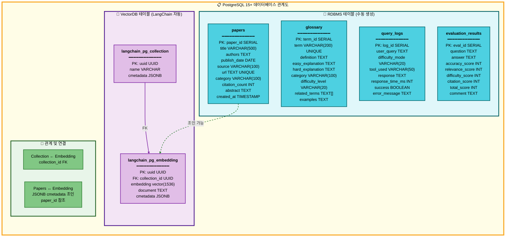
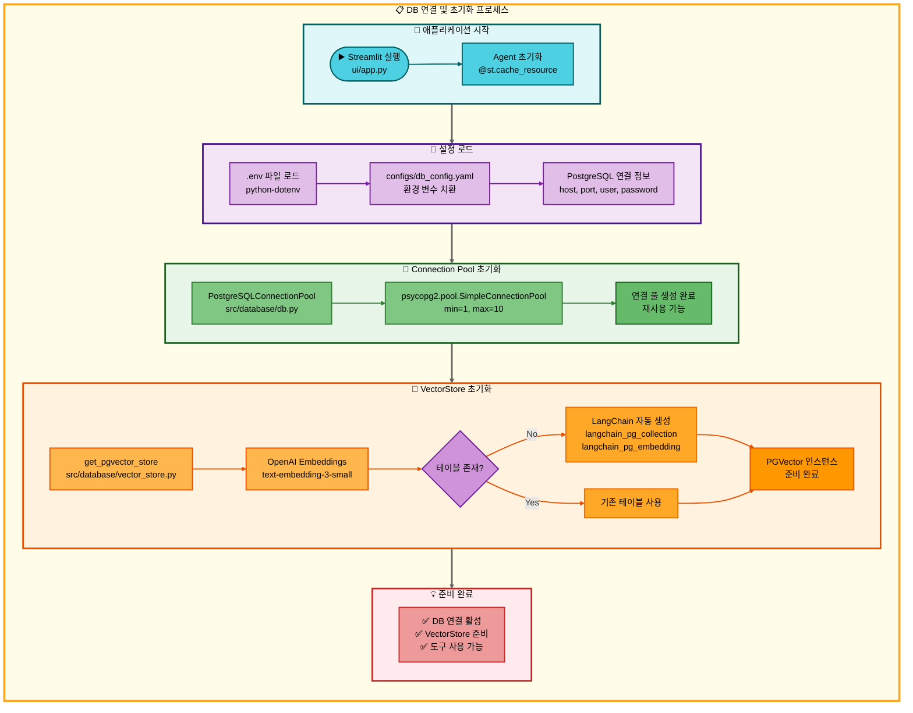

# 08. 데이터베이스 시스템

## 📋 문서 정보
- **작성일**: 2025-11-04
- **작성자**: 최현화[팀장]
- **시스템명**: 데이터베이스 시스템 (PostgreSQL + pgvector)
- **구현 파일**: `src/database/`, `database/schema.sql`, `configs/db_config.yaml`
- **우선순위**: ⭐⭐⭐ (최고 - 핵심 인프라)
- **참고 문서**: [PRD/11_데이터베이스_설계.md](../PRD/11_데이터베이스_설계.md)

---

## 📌 시스템 개요

### 목적 및 배경

데이터베이스 시스템은 **논문 리뷰 챗봇의 모든 데이터를 저장하고 관리**하는 핵심 인프라입니다. PostgreSQL 15+를 RDBMS로 사용하고, pgvector Extension을 통해 벡터 검색 기능을 통합하여 **하나의 데이터베이스에서 관계형 데이터와 벡터 데이터를 모두 처리**합니다.

### 시스템 아키텍처

```mermaid
graph TB
    subgraph MainFlow["📋 데이터베이스 시스템 아키텍처"]
        direction TB

        subgraph Client["🔸 클라이언트 계층"]
            direction LR
            A[Streamlit UI] --> B[AI Agent]
            B --> C[도구 시스템<br/>search_paper, glossary,<br/>text2sql, summarize]
        end

        subgraph DB["🔹 데이터베이스 계층 (PostgreSQL 15+)"]
            direction TB
            D[Connection Pool<br/>min=1, max=10] --> E{데이터 타입}
            E -->|관계형 데이터| F[RDBMS 테이블]
            E -->|벡터 데이터| G[VectorDB 테이블]

            F --> H[papers<br/>논문 메타데이터]
            F --> I[glossary<br/>용어집]
            F --> J[query_logs<br/>사용자 로그]
            F --> K[evaluation_results<br/>평가 결과]

            G --> L[langchain_pg_collection<br/>컬렉션 메타데이터]
            G --> M[langchain_pg_embedding<br/>벡터 임베딩]
        end

        subgraph Extension["🔺 pgvector Extension"]
            direction LR
            N[vector 데이터 타입<br/>1536차원] --> O[IVFFlat 인덱스<br/>코사인 유사도]
            O --> P[유사도 검색<br/>ORDER BY embedding]
        end

        %% 연결
        Client --> DB
        DB --> Extension
    end

    %% 스타일
    style MainFlow fill:#fffde7,stroke:#f9a825,stroke-width:4px,color:#000

    style Client fill:#e0f7fa,stroke:#006064,stroke-width:3px,color:#000
    style DB fill:#f3e5f5,stroke:#4a148c,stroke-width:3px,color:#000
    style Extension fill:#e8f5e9,stroke:#1b5e20,stroke-width:3px,color:#000

    style A fill:#4dd0e1,stroke:#006064,stroke-width:2px,color:#000
    style B fill:#4dd0e1,stroke:#006064,stroke-width:2px,color:#000
    style C fill:#4dd0e1,stroke:#006064,stroke-width:2px,color:#000

    style D fill:#e1bee7,stroke:#7b1fa2,stroke-width:2px,color:#000
    style E fill:#ce93d8,stroke:#6a1b9a,stroke-width:2px,color:#000
    style F fill:#e1bee7,stroke:#7b1fa2,stroke-width:2px,color:#000
    style G fill:#e1bee7,stroke:#7b1fa2,stroke-width:2px,color:#000
    style H fill:#ce93d8,stroke:#7b1fa2,stroke-width:2px,color:#000
    style I fill:#ce93d8,stroke:#7b1fa2,stroke-width:2px,color:#000
    style J fill:#ce93d8,stroke:#7b1fa2,stroke-width:2px,color:#000
    style K fill:#ce93d8,stroke:#7b1fa2,stroke-width:2px,color:#000
    style L fill:#ce93d8,stroke:#7b1fa2,stroke-width:2px,color:#000
    style M fill:#ce93d8,stroke:#7b1fa2,stroke-width:2px,color:#000

    style N fill:#81c784,stroke:#2e7d32,stroke-width:2px,color:#000
    style O fill:#81c784,stroke:#2e7d32,stroke-width:2px,color:#000
    style P fill:#66bb6a,stroke:#1b5e20,stroke-width:2px,color:#000

    linkStyle 0 stroke:#006064,stroke-width:2px
    linkStyle 1 stroke:#006064,stroke-width:2px
    linkStyle 2 stroke:#7b1fa2,stroke-width:2px
    linkStyle 3 stroke:#7b1fa2,stroke-width:2px
    linkStyle 4 stroke:#7b1fa2,stroke-width:2px
    linkStyle 5 stroke:#7b1fa2,stroke-width:2px
    linkStyle 6 stroke:#7b1fa2,stroke-width:2px
    linkStyle 7 stroke:#7b1fa2,stroke-width:2px
    linkStyle 8 stroke:#7b1fa2,stroke-width:2px
    linkStyle 9 stroke:#7b1fa2,stroke-width:2px
    linkStyle 10 stroke:#7b1fa2,stroke-width:2px
    linkStyle 11 stroke:#7b1fa2,stroke-width:2px
    linkStyle 12 stroke:#2e7d32,stroke-width:2px
    linkStyle 13 stroke:#2e7d32,stroke-width:2px
    linkStyle 14 stroke:#616161,stroke-width:3px
    linkStyle 15 stroke:#616161,stroke-width:3px
```

### 통합 데이터베이스 전략

**전통적인 방식 (분리형)**:
```
PostgreSQL  ← 논문 메타데이터 (제목, 저자, 날짜 등)
    +
Chroma/Pinecone  ← 벡터 임베딩 (RAG 검색)
```

**본 프로젝트 방식 (통합형)**:
```
PostgreSQL + pgvector
    ├── papers 테이블 (RDBMS)          ← 논문 메타데이터
    ├── glossary 테이블 (RDBMS)        ← 용어집
    ├── query_logs 테이블 (RDBMS)      ← 로그
    └── langchain_pg_collection (pgvector) ← 벡터 임베딩
        └── langchain_pg_embedding     ← 실제 벡터 데이터
```

**통합 전략의 장점**:
- **단일 DB 관리**: 운영 및 유지보수 간소화
- **트랜잭션 일관성**: ACID 보장
- **조인 가능**: 관계형 데이터와 벡터 데이터 조인 가능
- **비용 절감**: 별도의 벡터 DB 서비스 불필요
- **Langchain 통합**: Langchain PGVector 네이티브 지원

---

## 🔍 PostgreSQL + pgvector 선택 이유

### 데이터베이스 대안 비교

프로젝트 초기 단계에서 여러 데이터베이스 솔루션을 검토하였으며, **PostgreSQL + pgvector 통합 솔루션**을 최종 선택하였습니다.

#### 비교 대상

| 데이터베이스 | 타입 | 벡터 검색 지원 | 관계형 데이터 | 비용 | 학습 곡선 |
|------------|------|--------------|-------------|------|----------|
| **PostgreSQL + pgvector** ⭐ | RDBMS + VectorDB | ✅ (pgvector) | ✅ | 무료 | 중간 |
| MySQL | RDBMS | ❌ (별도 DB 필요) | ✅ | 무료 | 낮음 |
| Pinecone | VectorDB | ✅ | ❌ (메타데이터만) | 유료 | 낮음 |
| Weaviate | VectorDB | ✅ | ⚠️ (제한적) | 무료 (자체 호스팅) | 높음 |
| Chroma | VectorDB | ✅ | ❌ | 무료 | 낮음 |

### PostgreSQL + pgvector 선택 근거

#### 1. **통합 솔루션의 이점**

**MySQL의 한계**:
- 벡터 검색 미지원 → 별도의 Vector DB(Pinecone, Chroma 등) 필요
- **문제점**: 두 개의 DB 관리 (MySQL + Vector DB)
  - 데이터 동기화 복잡성
  - 운영 오버헤드 증가
  - 트랜잭션 일관성 보장 어려움

**PostgreSQL + pgvector의 해결책**:
- **하나의 DB**로 관계형 + 벡터 검색 모두 처리
- papers 테이블(RDBMS) ↔ langchain_pg_embedding(VectorDB) **조인 가능**
- 단일 트랜잭션으로 메타데이터 + 벡터 동시 저장

```sql
-- PostgreSQL + pgvector만 가능한 조인 쿼리
SELECT
    p.title,
    p.authors,
    e.document,
    e.embedding <=> '[...]'::vector AS distance
FROM papers p
JOIN langchain_pg_embedding e
  ON p.paper_id = (e.cmetadata->>'paper_id')::int
WHERE p.category = 'cs.AI'
ORDER BY distance
LIMIT 5;
```

#### 2. **Pinecone/Weaviate 대비 장점**

**Pinecone (클라우드 Vector DB)**:
- ✅ 장점: 빠른 벡터 검색, 관리 편리
- ❌ 단점:
  - **유료 서비스** (무료 티어 제한적)
  - 메타데이터만 저장 가능 (관계형 데이터 불가)
  - **별도 RDBMS 필요** (논문 메타데이터, 용어집 등)
  - Text-to-SQL 불가능

**Weaviate (오픈소스 Vector DB)**:
- ✅ 장점: 강력한 벡터 검색, GraphQL 지원
- ❌ 단점:
  - **자체 호스팅 복잡** (Docker, Kubernetes 필요)
  - 관계형 데이터 저장 제한적
  - SQL 쿼리 불가 (GraphQL만 지원)
  - 프로젝트 기간 대비 학습 곡선 높음

**PostgreSQL + pgvector의 우위**:
- ✅ **무료** 오픈소스
- ✅ **설치 간단** (WSL Ubuntu에서 apt install)
- ✅ **표준 SQL** 사용 (Text-to-SQL 도구 구현 가능)
- ✅ **관계형 + 벡터** 데이터 통합 관리
- ✅ **Langchain 네이티브 지원** (PGVector 클래스)

#### 3. **Chroma 대비 장점**

**Chroma (Python Vector DB)**:
- ✅ 장점: 설치 쉬움 (pip install), 경량
- ❌ 단점:
  - **메모리 기반** (재시작 시 데이터 손실 위험)
  - **프로덕션 부적합** (소규모 프로젝트용)
  - SQL 쿼리 불가
  - 관계형 데이터 저장 불가

**PostgreSQL + pgvector의 우위**:
- ✅ **디스크 기반 영구 저장**
- ✅ **프로덕션 검증됨** (20년+ 역사)
- ✅ **ACID 트랜잭션** 보장
- ✅ **백업/복구** 시스템 완비

#### 4. **프로젝트 요구사항 충족도**

| 요구사항 | PostgreSQL + pgvector | MySQL + Pinecone | Weaviate | Chroma |
|---------|----------------------|------------------|----------|--------|
| **논문 메타데이터 저장** | ✅ papers 테이블 | ✅ MySQL | ⚠️ 제한적 | ❌ |
| **벡터 임베딩 검색** | ✅ pgvector | ✅ Pinecone | ✅ | ✅ |
| **용어집 (glossary)** | ✅ glossary 테이블 | ✅ MySQL | ⚠️ | ❌ |
| **Text-to-SQL 도구** | ✅ 표준 SQL | ✅ MySQL | ❌ | ❌ |
| **사용자 로그 저장** | ✅ query_logs | ✅ MySQL | ⚠️ | ❌ |
| **성능 평가 결과** | ✅ evaluation_results | ✅ MySQL | ⚠️ | ❌ |
| **단일 DB 관리** | ✅ | ❌ (2개 DB) | ⚠️ | ❌ |
| **무료 사용** | ✅ | ⚠️ (Pinecone 유료) | ✅ | ✅ |
| **Langchain 통합** | ✅ PGVector | ✅ | ✅ | ✅ |

#### 5. **성능 및 확장성**

**벡터 검색 성능**:
- pgvector **IVFFlat 인덱스**: 수십만 벡터도 빠른 검색 (O(log n))
- 근사 검색(ANN) 지원으로 정확도 vs 속도 조절 가능

**관계형 쿼리 성능**:
- PostgreSQL은 **복잡한 JOIN, 집계 쿼리**에서 MySQL보다 우수
- **GIN 인덱스** (Full-text search) 지원
- **B-tree 인덱스** (범위 검색, 정렬 최적화)

**확장성**:
- **Connection Pool** (psycopg2.pool) 지원
- **파티셔닝** (테이블 분할) 가능
- **레플리케이션** (마스터-슬레이브) 가능

### 최종 결론

**PostgreSQL + pgvector를 선택한 핵심 이유**:

1. ✅ **통합 관리**: 관계형 + 벡터 데이터를 하나의 DB에서 처리
2. ✅ **비용 효율**: 무료 오픈소스 (Pinecone 등 유료 서비스 불필요)
3. ✅ **개발 편의성**: Langchain PGVector 네이티브 지원
4. ✅ **프로젝트 요구사항**: Text-to-SQL, 용어집, 로그, 평가 결과 모두 지원
5. ✅ **검증된 안정성**: PostgreSQL 20년+ 역사, 프로덕션 검증
6. ✅ **짧은 학습 곡선**: 팀원들의 SQL 경험 활용 가능
7. ✅ **프로젝트 기간 적합**: 설치/설정 간단, 빠른 개발 가능

---

## 🗄️ PostgreSQL 15+

### 버전 정보
- **사용 버전**: PostgreSQL 15.5 이상
- **설치 위치**: WSL 24.04 LTS (Ubuntu)
- **포트**: 5432 (기본값)
- **인코딩**: UTF-8

### 역할 및 특징

**RDBMS (Relational Database Management System)**:
- SQL 표준 준수
- ACID 트랜잭션 지원
- 복잡한 쿼리 최적화
- 강력한 인덱스 시스템

**프로젝트에서 사용하는 이유**:
1. **확장성**: pgvector Extension 지원
2. **안정성**: 20년 이상의 검증된 역사
3. **성능**: Full-text search, GIN 인덱스
4. **오픈소스**: 무료, 활발한 커뮤니티
5. **Langchain 지원**: LangChain PGVector 네이티브 통합

### PostgreSQL 사용자 설정

**사용자 정보**:
- **사용자명**: `langchain`
- **비밀번호**: `dusrufdmlalswhr` (프로젝트 전용)
- **권한**: SUPERUSER, CREATE DB
- **접속 방법**: TCP/IP (`-h localhost`)

**사용자 생성 명령어** (`docs/usage/` 문서 참조):
```sql
CREATE USER langchain WITH PASSWORD 'dusrufdmlalswhr';
ALTER USER langchain CREATEDB;
ALTER USER langchain WITH SUPERUSER;
```

### 데이터베이스 정보

**데이터베이스명**: `papers`
- **Owner**: langchain
- **Encoding**: UTF8
- **Collate**: en_US.UTF-8
- **Extensions**: vector (pgvector)

---

## 🔍 pgvector 0.5.0+

### Extension 역할

**pgvector**는 PostgreSQL에서 **벡터 임베딩을 저장하고 유사도 검색을 수행**할 수 있게 해주는 확장 기능입니다.

**주요 기능**:
- **vector 데이터 타입**: `vector(1536)` (1536차원 벡터)
- **유사도 연산자**: 코사인 유사도, L2 거리, 내적
- **인덱스**: IVFFlat 인덱스로 빠른 검색
- **SQL 쿼리**: 표준 SQL로 벡터 검색 가능

### 벡터 검색 원리

**임베딩 벡터**:
- OpenAI `text-embedding-3-small` 모델 사용
- **차원**: 1536
- **표현 방식**: Float32 배열

**유사도 계산**:
```sql
-- 코사인 유사도 (Cosine Similarity)
SELECT
    content,
    embedding <=> '[0.1, 0.2, ...]'::vector AS distance
FROM langchain_pg_embedding
ORDER BY embedding <=> '[0.1, 0.2, ...]'::vector
LIMIT 5;
```

**유사도 연산자**:
- `<->`: L2 거리 (Euclidean Distance)
- `<=>`: 코사인 거리 (1 - Cosine Similarity)
- `<#>`: 내적 (Inner Product)

### IVFFlat 인덱스

**인덱스 생성**:
```sql
CREATE INDEX ON langchain_pg_embedding
USING ivfflat (embedding vector_cosine_ops);
```

**IVFFlat (Inverted File with Flat compression)**:
- **원리**: 벡터 공간을 여러 클러스터로 분할
- **검색 속도**: O(log n) → 수십만 벡터도 빠른 검색
- **정확도**: 근사 검색 (Approximate Nearest Neighbor)
- **트레이드오프**: 속도 vs 정확도 조절 가능

---

## 📊 데이터베이스 스키마

### 전체 테이블 구조

```
papers DB (PostgreSQL 15+)
│
├── 📁 RDBMS 테이블 (사용자 정의, 4개)
│   ├── papers (논문 메타데이터)
│   ├── glossary (용어집)
│   ├── query_logs (사용자 질의 로그)
│   └── evaluation_results (성능 평가 결과)
│
└── 📁 VectorDB 테이블 (LangChain 자동 생성, 2개)
    ├── langchain_pg_collection (벡터 컬렉션 메타데이터)
    └── langchain_pg_embedding (벡터 임베딩 데이터)
```

### 데이터베이스 관계도



**RDBMS vs VectorDB 구분**:

| 구분 | 테이블 | 생성 방식 | 관리 주체 | 용도 |
|------|--------|-----------|-----------|------|
| **RDBMS** | papers, glossary, query_logs, evaluation_results | `database/schema.sql` 수동 실행 | 개발자 | 논문 메타데이터, 용어집, 로그, 평가 결과 저장 |
| **VectorDB** | langchain_pg_collection, langchain_pg_embedding | LangChain PGVector 자동 생성 | LangChain 라이브러리 | 벡터 임베딩 저장 및 유사도 검색 |

**VectorDB 자동 생성 메커니즘**:
- **시점**: `PGVector.from_documents()` 또는 `PGVector.from_texts()` 최초 호출 시
- **방식**: LangChain이 내부적으로 `CREATE TABLE IF NOT EXISTS` 실행
- **특징**: 개발자가 직접 테이블 생성 불필요, 라이브러리가 스키마 관리

---

### 1. papers 테이블 (논문 메타데이터)

#### 스키마

| 컬럼명 | 타입 | 제약조건 | 설명 |
|--------|------|----------|------|
| **paper_id** | SERIAL | PRIMARY KEY | 논문 고유 ID (자동 증가) |
| **title** | VARCHAR(500) | NOT NULL | 논문 제목 |
| **authors** | TEXT | - | 저자 목록 (쉼표 구분) |
| **publish_date** | DATE | - | 발표 날짜 (YYYY-MM-DD) |
| **source** | VARCHAR(100) | - | 출처 (arXiv, IEEE, ACL 등) |
| **url** | TEXT | UNIQUE | 논문 URL (중복 방지) |
| **category** | VARCHAR(100) | - | 카테고리 (cs.AI, cs.CL, cs.CV) |
| **citation_count** | INT | DEFAULT 0 | 인용 수 |
| **abstract** | TEXT | - | 논문 초록 |
| **created_at** | TIMESTAMP | DEFAULT CURRENT_TIMESTAMP | 생성 시간 |
| **updated_at** | TIMESTAMP | DEFAULT CURRENT_TIMESTAMP | 수정 시간 |

#### 인덱스 전략

```sql
-- Full-text search 인덱스 (제목 검색)
CREATE INDEX idx_papers_title
ON papers USING GIN (to_tsvector('english', title));

-- 카테고리 검색 인덱스
CREATE INDEX idx_papers_category ON papers(category);

-- 날짜 정렬 인덱스 (최신순)
CREATE INDEX idx_papers_publish_date ON papers(publish_date DESC);

-- 생성 시간 인덱스
CREATE INDEX idx_papers_created_at ON papers(created_at DESC);
```

**인덱스 선택 이유**:
- **GIN 인덱스 (title)**: Full-text 검색 성능 향상
- **B-tree 인덱스 (category, date)**: 필터링 및 정렬 최적화

#### 사용 시점

**도구별 papers 테이블 사용**:

| 도구 | 사용 방식 | SQL 쿼리 예시 |
|------|-----------|---------------|
| **search_paper** | paper_id로 메타데이터 조회 | `SELECT * FROM papers WHERE paper_id = ?` |
| **summarize** | 논문 제목으로 paper_id 검색 | `SELECT paper_id FROM papers WHERE title ILIKE '%Transformer%'` |
| **web_search** | arXiv 논문 저장 (ArxivHandler) | `INSERT INTO papers (...) VALUES (...) ON CONFLICT (url) DO NOTHING` |
| **text2sql** | 논문 통계 조회 | `SELECT COUNT(*) FROM papers WHERE EXTRACT(YEAR FROM publish_date) = 2024` |

---

### 2. glossary 테이블 (용어집)

#### 스키마

| 컬럼명 | 타입 | 제약조건 | 설명 |
|--------|------|----------|------|
| **term_id** | SERIAL | PRIMARY KEY | 용어 고유 ID |
| **term** | VARCHAR(200) | NOT NULL, UNIQUE | 용어 (예: "BERT", "Attention") |
| **definition** | TEXT | NOT NULL | 기본 정의 |
| **easy_explanation** | TEXT | - | Easy 모드 설명 (초심자용) |
| **hard_explanation** | TEXT | - | Hard 모드 설명 (전문가용) |
| **category** | VARCHAR(100) | - | 카테고리 (ML, NLP, CV, RL) |
| **difficulty_level** | VARCHAR(20) | - | 난이도 (beginner, intermediate, advanced) |
| **related_terms** | TEXT[] | - | 관련 용어 배열 |
| **examples** | TEXT | - | 사용 예시 |
| **created_at** | TIMESTAMP | DEFAULT CURRENT_TIMESTAMP | 생성 시간 |
| **updated_at** | TIMESTAMP | DEFAULT CURRENT_TIMESTAMP | 수정 시간 |

#### 인덱스

```sql
-- 용어 검색 인덱스
CREATE INDEX idx_glossary_term ON glossary(term);

-- 카테고리 필터 인덱스
CREATE INDEX idx_glossary_category ON glossary(category);

-- 난이도 필터 인덱스
CREATE INDEX idx_glossary_difficulty ON glossary(difficulty_level);
```

#### 사용 시점

**glossary 도구**:
1. **용어 추출**: LLM이 질문에서 용어 추출
2. **DB 검색**: `SELECT * FROM glossary WHERE term ILIKE '%BERT%'`
3. **난이도별 반환**:
   - Easy 모드 → `easy_explanation`
   - Hard 모드 → `hard_explanation`
   - Fallback → `definition`

**쿼리 예시**:
```sql
-- 용어 검색
SELECT
    term,
    CASE
        WHEN 'easy' = 'easy' THEN easy_explanation
        ELSE hard_explanation
    END AS explanation
FROM glossary
WHERE term ILIKE '%Attention%'
LIMIT 1;
```

---

### 3. query_logs 테이블 (사용자 질의 로그)

#### 스키마

| 컬럼명 | 타입 | 제약조건 | 설명 |
|--------|------|----------|------|
| **log_id** | SERIAL | PRIMARY KEY | 로그 고유 ID |
| **user_query** | TEXT | NOT NULL | 사용자 질문 |
| **difficulty_mode** | VARCHAR(20) | - | 난이도 (easy, hard) |
| **tool_used** | VARCHAR(50) | - | 사용된 도구명 |
| **response** | TEXT | - | 생성된 응답 |
| **response_time_ms** | INT | - | 응답 시간 (밀리초) |
| **success** | BOOLEAN | DEFAULT TRUE | 성공 여부 |
| **error_message** | TEXT | - | 오류 메시지 (실패 시) |
| **created_at** | TIMESTAMP | DEFAULT CURRENT_TIMESTAMP | 생성 시간 |

#### 인덱스

```sql
-- 시간 기반 조회 인덱스 (최신순)
CREATE INDEX idx_query_logs_created_at ON query_logs(created_at DESC);

-- 도구별 필터 인덱스
CREATE INDEX idx_query_logs_tool_used ON query_logs(tool_used);

-- 성공/실패 필터 인덱스
CREATE INDEX idx_query_logs_success ON query_logs(success);
```

#### 사용 시점

**text2sql 도구**:
- 모든 Text-to-SQL 요청을 `query_logs` 테이블에 기록
- 성공/실패 여부, 응답 시간, 에러 메시지 저장

**쿼리 예시**:
```sql
-- 통계 분석
SELECT
    tool_used,
    COUNT(*) AS total_queries,
    AVG(response_time_ms) AS avg_response_time,
    SUM(CASE WHEN success THEN 1 ELSE 0 END) * 100.0 / COUNT(*) AS success_rate
FROM query_logs
WHERE created_at >= NOW() - INTERVAL '7 days'
GROUP BY tool_used
ORDER BY total_queries DESC;
```

---

### 4. evaluation_results 테이블 (성능 평가 결과)

#### 스키마

| 컬럼명 | 타입 | 제약조건 | 설명 |
|--------|------|----------|------|
| **eval_id** | SERIAL | PRIMARY KEY | 평가 고유 ID |
| **question** | TEXT | NOT NULL | 사용자 질문 |
| **answer** | TEXT | NOT NULL | AI 답변 |
| **accuracy_score** | INT | CHECK (0~10) | 정확도 점수 (참고 문서 일치도) |
| **relevance_score** | INT | CHECK (0~10) | 관련성 점수 (질문-답변 연관성) |
| **difficulty_score** | INT | CHECK (0~10) | 난이도 적합성 점수 (Easy/Hard 모드) |
| **citation_score** | INT | CHECK (0~10) | 출처 명시 점수 (논문 제목, 저자) |
| **total_score** | INT | CHECK (0~40) | 총점 (4개 항목 합계) |
| **comment** | TEXT | - | 평가 코멘트 (상세 피드백) |
| **created_at** | TIMESTAMP | DEFAULT CURRENT_TIMESTAMP | 생성 시간 |

#### 인덱스

```sql
-- 시간 기반 조회 인덱스 (최신순)
CREATE INDEX idx_evaluation_results_created_at
ON evaluation_results(created_at DESC);

-- 총점 정렬 인덱스 (성능 순위)
CREATE INDEX idx_evaluation_results_total_score
ON evaluation_results(total_score DESC);
```

#### 사용 시점

**성능 평가 시스템** (`src/evaluation/evaluator.py`):
1. **답변 평가**: LLM-as-a-Judge 방식으로 챗봇 답변 품질 평가
2. **DB 저장**:
   ```sql
   INSERT INTO evaluation_results (
       question, answer,
       accuracy_score, relevance_score, difficulty_score, citation_score,
       total_score, comment
   ) VALUES (?, ?, ?, ?, ?, ?, ?, ?)
   ```
3. **통계 분석**:
   ```sql
   SELECT
       AVG(accuracy_score) AS avg_accuracy,
       AVG(relevance_score) AS avg_relevance,
       AVG(total_score) AS avg_total
   FROM evaluation_results
   WHERE created_at >= NOW() - INTERVAL '7 days'
   ```

**평가 기준** (LLM-as-a-Judge):
- **accuracy_score**: 참고 문서 내용과 일치도
- **relevance_score**: 질문 의도 부합도
- **difficulty_score**: Easy/Hard 모드 적합성
- **citation_score**: 출처(논문 제목, 저자) 명시 여부

---

### 5. langchain_pg_collection (VectorDB 컬렉션 메타데이터)

> **⚠️ 자동 생성 테이블**: LangChain PGVector가 자동으로 생성하므로 `database/schema.sql`에 포함되지 않음

#### 자동 생성 메커니즘

**생성 시점**:
```python
# src/database/vector_store.py 초기화 시
vectorstore = PGVector(
    collection_name="paper_chunks",  # ← 이 시점에 자동으로 테이블 생성
    connection_string=connection_string,
    embedding_function=embeddings
)
```

**내부 동작**:
1. `PGVector` 객체 초기화
2. LangChain이 `langchain_pg_collection` 테이블 존재 확인
3. 테이블 없으면 자동으로 `CREATE TABLE IF NOT EXISTS` 실행
4. `collection_name`으로 컬렉션 레코드 생성 또는 조회

**개발자가 해야 할 일**: 없음 (LangChain이 모두 처리)

#### 스키마 (LangChain 자동 생성)

| 컬럼명 | 타입 | 설명 |
|--------|------|------|
| **uuid** | UUID | 컬렉션 고유 ID (자동 생성) |
| **name** | VARCHAR | 컬렉션 이름 (예: "paper_chunks") |
| **cmetadata** | JSONB | 컬렉션 메타데이터 (선택적) |

**컬렉션 목록**:
- `paper_chunks`: 논문 본문 청크 임베딩 (현재 사용 중)
- (향후 확장 가능: `paper_abstracts`, `glossary_embeddings`)

---

### 6. langchain_pg_embedding (VectorDB 벡터 데이터)

> **⚠️ 자동 생성 테이블**: LangChain PGVector가 자동으로 생성하므로 `database/schema.sql`에 포함되지 않음

#### 자동 생성 메커니즘

**생성 시점**:
```python
# src/database/vector_store.py에서 문서 추가 시
vectorstore.add_documents(documents)  # ← 이 시점에 자동으로 테이블 생성
```

**내부 동작**:
1. `add_documents()` 또는 `from_documents()` 호출
2. LangChain이 `langchain_pg_embedding` 테이블 존재 확인
3. 테이블 없으면 자동으로 `CREATE TABLE IF NOT EXISTS` 실행
4. `embedding` 컬럼을 `vector(1536)` 타입으로 생성 (pgvector Extension 활용)
5. IVFFlat 인덱스 자동 생성 (벡터 유사도 검색 최적화)

**개발자가 해야 할 일**:
- ✅ `pgvector` Extension 활성화 (`CREATE EXTENSION vector`)
- ✅ LangChain 라이브러리만 사용하면 테이블 자동 생성됨
- ❌ 직접 `CREATE TABLE` 실행 불필요

#### 스키마 (LangChain 자동 생성)

| 컬럼명 | 타입 | 설명 |
|--------|------|------|
| **uuid** | UUID | 임베딩 고유 ID (자동 생성) |
| **collection_id** | UUID | 컬렉션 ID (FK → langchain_pg_collection.uuid) |
| **embedding** | vector(1536) | 벡터 임베딩 (1536차원) |
| **document** | TEXT | 원본 텍스트 (청크 내용) |
| **cmetadata** | JSONB | 메타데이터 (paper_id, chunk_index, title 등) |

**임베딩 벡터**:
- **모델**: OpenAI `text-embedding-3-small`
- **차원**: 1536
- **정규화**: 단위 벡터 (코사인 유사도 최적화)
- **저장 방식**: pgvector의 `vector` 데이터 타입

**메타데이터 예시**:
```json
{
  "paper_id": 123,
  "chunk_index": 0,
  "title": "Attention Is All You Need",
  "source": "arXiv"
}
```

#### 인덱스

```sql
-- IVFFlat 인덱스 (코사인 유사도)
CREATE INDEX langchain_pg_embedding_embedding_idx
ON langchain_pg_embedding
USING ivfflat (embedding vector_cosine_ops)
WITH (lists = 100);
```

**인덱스 파라미터**:
- `lists`: 클러스터 개수 (100 = 중간 속도/정확도)
- `vector_cosine_ops`: 코사인 유사도 연산자

#### 사용 시점

**RAG 검색 (search_paper 도구)**:
1. **사용자 질문 임베딩**: "What is Transformer?" → `[0.1, 0.2, ..., 0.8]` (1536차원)
2. **유사도 검색**:
   ```sql
   SELECT document, embedding <=> '[0.1, 0.2, ...]'::vector AS distance
   FROM langchain_pg_embedding
   WHERE collection_id = (SELECT uuid FROM langchain_pg_collection WHERE name = 'paper_chunks')
   ORDER BY distance
   LIMIT 5;
   ```
3. **메타데이터 조인**:
   ```python
   # LangChain이 자동으로 처리
   docs = vectorstore.similarity_search("What is Transformer?", k=5)
   # 반환: Document 리스트 (page_content + metadata)
   ```

---

## 🔗 DB 연결 시스템

### Connection Pool (src/database/db.py)

**Connection Pool**은 **DB 연결을 재사용**하여 성능을 향상시키는 시스템입니다.

**구현**:
```python
class PostgreSQLConnectionPool:
    def __init__(self, min_connections=1, max_connections=10):
        db_config = get_db_config()
        pg_config = db_config['postgresql']

        self.connection_pool = psycopg2.pool.SimpleConnectionPool(
            minconn=min_connections,
            maxconn=max_connections,
            host=pg_config['host'],
            port=pg_config['port'],
            database=pg_config['database'],
            user=pg_config['user'],
            password=pg_config['password']
        )
```

**장점**:
- **성능 향상**: 연결 생성 오버헤드 제거
- **리소스 관리**: 최대 연결 수 제한 (10개)
- **동시성 지원**: 여러 요청 동시 처리

### 설정 파일 (configs/db_config.yaml)

**구조**:
```yaml
postgresql:
  host: ${POSTGRES_HOST}
  port: ${POSTGRES_PORT}
  database: ${POSTGRES_DB}
  user: ${POSTGRES_USER}
  password: ${POSTGRES_PASSWORD}

pgvector:
  collections:
    - name: paper_chunks
      dimension: 1536
```

**환경 변수 치환**:
- `${POSTGRES_HOST}` → `.env` 파일의 `POSTGRES_HOST` 값
- `config_loader.py`가 자동으로 치환

### 환경 변수 (.env)

```bash
# PostgreSQL 설정
POSTGRES_USER=langchain
POSTGRES_PASSWORD=dusrufdmlalswhr
POSTGRES_HOST=localhost
POSTGRES_PORT=5432
POSTGRES_DB=papers
```

**로드 방식**:
1. `.env` 파일 읽기 (`python-dotenv`)
2. `configs/db_config.yaml` 로드 (`config_loader.py`)
3. 환경 변수 치환
4. Connection Pool 초기화

---

## 🔄 프로젝트 실행 단계별 DB 사용

### DB 연결 및 초기화 흐름도



### 1. 애플리케이션 초기화

**실행 순서**:
```
Streamlit 시작 (ui/app.py)
    ↓
Agent 초기화 (@st.cache_resource)
    ↓
Connection Pool 초기화 (src/database/db.py)
    ↓
PGVector VectorStore 초기화 (src/database/vector_store.py)
```

**DB 연결**:
- **시점**: 애플리케이션 시작 시 1회
- **방식**: Connection Pool (min=1, max=10)
- **캐싱**: Streamlit `@st.cache_resource`로 재사용

---

### 2. RAG 검색 (search_paper 도구)

#### RAG 검색 DB 접근 흐름도

```mermaid
graph TB
    subgraph MainFlow["📋 RAG 검색 프로세스 (search_paper 도구)"]
        direction TB

        subgraph Input["🔸 사용자 입력"]
            direction LR
            A([사용자 질문<br/>'What is Transformer?']) --> B[AI Agent Router]
            B --> C{도구 선택}
            C -->|RAG 검색| D[search_paper 도구]
        end

        subgraph Embedding["🔹 질문 임베딩"]
            direction LR
            E[RAGRetriever.retrieve] --> F[OpenAI Embeddings<br/>text-embedding-3-small]
            F --> G[질문 벡터 생성<br/>1536차원 배열]
        end

        subgraph VectorSearch["🔺 벡터 유사도 검색"]
            direction LR
            H[DB 접근 1:<br/>langchain_pg_embedding] --> I[SELECT *<br/>WHERE collection_id = '...'<br/>ORDER BY embedding <=> '[...]'::vector<br/>LIMIT 5]
            I --> J[IVFFlat 인덱스 활용<br/>코사인 유사도 계산]
            J --> K[Top-5 유사 청크 반환<br/>document + cmetadata]
        end

        subgraph Metadata["🔶 메타데이터 조인"]
            direction LR
            L[DB 접근 2:<br/>papers 테이블] --> M[SELECT p.title, p.authors<br/>FROM papers p<br/>WHERE p.paper_id IN ...]
            M --> N[논문 메타데이터 병합<br/>제목, 저자, 날짜]
        end

        subgraph Generation["💡 답변 생성"]
            direction LR
            O[Document 리스트<br/>청크 + 메타데이터] --> P[LLM 프롬프트 구성<br/>컨텍스트 + 질문]
            P --> Q[GPT-5 답변 생성<br/>출처 포함]
            Q --> R([✅ 사용자에게 응답])
        end

        %% 연결
        Input --> Embedding
        Embedding --> VectorSearch
        VectorSearch --> Metadata
        Metadata --> Generation
    end

    %% 스타일
    style MainFlow fill:#fffde7,stroke:#f9a825,stroke-width:4px,color:#000

    style Input fill:#e0f7fa,stroke:#006064,stroke-width:3px,color:#000
    style Embedding fill:#f3e5f5,stroke:#4a148c,stroke-width:3px,color:#000
    style VectorSearch fill:#e8f5e9,stroke:#1b5e20,stroke-width:3px,color:#000
    style Metadata fill:#fff3e0,stroke:#e65100,stroke-width:3px,color:#000
    style Generation fill:#ffebee,stroke:#c62828,stroke-width:3px,color:#000

    style A fill:#4dd0e1,stroke:#006064,stroke-width:2px,color:#000
    style B fill:#4dd0e1,stroke:#006064,stroke-width:2px,color:#000
    style C fill:#ce93d8,stroke:#6a1b9a,stroke-width:2px,color:#000
    style D fill:#4dd0e1,stroke:#006064,stroke-width:2px,color:#000

    style E fill:#e1bee7,stroke:#7b1fa2,stroke-width:2px,color:#000
    style F fill:#e1bee7,stroke:#7b1fa2,stroke-width:2px,color:#000
    style G fill:#e1bee7,stroke:#7b1fa2,stroke-width:2px,color:#000

    style H fill:#81c784,stroke:#2e7d32,stroke-width:2px,color:#000
    style I fill:#81c784,stroke:#2e7d32,stroke-width:2px,color:#000
    style J fill:#81c784,stroke:#2e7d32,stroke-width:2px,color:#000
    style K fill:#66bb6a,stroke:#1b5e20,stroke-width:2px,color:#000

    style L fill:#ffb74d,stroke:#e65100,stroke-width:2px,color:#000
    style M fill:#ffb74d,stroke:#e65100,stroke-width:2px,color:#000
    style N fill:#ffa726,stroke:#ef6c00,stroke-width:2px,color:#000

    style O fill:#ef9a9a,stroke:#c62828,stroke-width:2px,color:#000
    style P fill:#ef9a9a,stroke:#c62828,stroke-width:2px,color:#000
    style Q fill:#e57373,stroke:#c62828,stroke-width:2px,color:#000
    style R fill:#ef5350,stroke:#b71c1c,stroke-width:2px,color:#000

    linkStyle 0 stroke:#006064,stroke-width:2px
    linkStyle 1 stroke:#006064,stroke-width:2px
    linkStyle 2 stroke:#006064,stroke-width:2px
    linkStyle 3 stroke:#7b1fa2,stroke-width:2px
    linkStyle 4 stroke:#7b1fa2,stroke-width:2px
    linkStyle 5 stroke:#2e7d32,stroke-width:2px
    linkStyle 6 stroke:#2e7d32,stroke-width:2px
    linkStyle 7 stroke:#2e7d32,stroke-width:2px
    linkStyle 8 stroke:#e65100,stroke-width:2px
    linkStyle 9 stroke:#e65100,stroke-width:2px
    linkStyle 10 stroke:#c62828,stroke-width:2px
    linkStyle 11 stroke:#c62828,stroke-width:2px
    linkStyle 12 stroke:#c62828,stroke-width:2px
    linkStyle 13 stroke:#616161,stroke-width:3px
    linkStyle 14 stroke:#616161,stroke-width:3px
    linkStyle 15 stroke:#616161,stroke-width:3px
    linkStyle 16 stroke:#616161,stroke-width:3px
```

**실행 흐름**:
```
사용자 질문: "What is Transformer?"
    ↓
Router 노드 → search_paper 도구 선택
    ↓
RAGRetriever.retrieve()
    ↓
[DB 접근 1] PGVector 유사도 검색
    SELECT * FROM langchain_pg_embedding
    WHERE collection_id = '...'
    ORDER BY embedding <=> '[0.1, 0.2, ...]'::vector
    LIMIT 5
    ↓
[DB 접근 2] papers 테이블 조인 (메타데이터)
    SELECT p.title, p.authors, p.publish_date
    FROM papers p
    WHERE p.paper_id IN (...)
    ↓
Document 리스트 반환 → LLM 답변 생성
```

**DB 연결**:
- **테이블**: `langchain_pg_embedding`, `papers`
- **인덱스 사용**: IVFFlat 인덱스 (벡터 검색), idx_papers_category
- **쿼리 수**: 1~2회

---

### 3. 용어집 검색 (glossary 도구)

**실행 흐름**:
```
사용자 질문: "BERT가 뭐야?"
    ↓
Router 노드 → glossary 도구 선택
    ↓
LLM 용어 추출: "BERT"
    ↓
[DB 접근] glossary 테이블 검색
    SELECT term, easy_explanation, hard_explanation
    FROM glossary
    WHERE term ILIKE '%BERT%'
    LIMIT 1
    ↓
난이도별 설명 선택 (easy_explanation 또는 hard_explanation)
    ↓
답변 반환
```

**DB 연결**:
- **테이블**: `glossary`
- **인덱스 사용**: idx_glossary_term
- **쿼리 수**: 1회

---

### 4. Text-to-SQL (text2sql 도구)

**실행 흐름**:
```
사용자 질문: "2024년 논문 개수는?"
    ↓
Router 노드 → text2sql 도구 선택
    ↓
LLM SQL 생성:
    SELECT COUNT(*) FROM papers
    WHERE EXTRACT(YEAR FROM publish_date) = 2024
    ↓
[DB 접근 1] SQL 실행
    ↓
[DB 접근 2] query_logs 테이블 로그 저장
    INSERT INTO query_logs (user_query, tool_used, ...)
    VALUES (...)
    ↓
Markdown 표 형식으로 결과 반환
```

**DB 연결**:
- **테이블**: `papers`, `query_logs`
- **인덱스 사용**: idx_papers_publish_date
- **쿼리 수**: 2회 (통계 조회 + 로그 저장)

---

### 5. 논문 요약 (summarize 도구)

**실행 흐름**:
```
사용자 질문: "Attention Is All You Need 요약해줘"
    ↓
Router 노드 → summarize 도구 선택
    ↓
[DB 접근 1] papers 테이블 제목 검색
    SELECT paper_id FROM papers
    WHERE title ILIKE '%Attention Is All You Need%'
    LIMIT 1
    ↓
[DB 접근 2] PGVector 논문 전체 청크 조회
    SELECT document FROM langchain_pg_embedding
    WHERE cmetadata->>'paper_id' = '...'
    ORDER BY cmetadata->>'chunk_index'
    LIMIT 10
    ↓
청크 결합 → LLM 요약 생성 → 답변 반환
```

**DB 연결**:
- **테이블**: `papers`, `langchain_pg_embedding`
- **인덱스 사용**: idx_papers_title (GIN 인덱스)
- **쿼리 수**: 2회

---

### 6. 웹 검색 + arXiv 저장 (web_search 도구)

**실행 흐름**:
```
사용자 질문: "2025년 최신 LLM 논문?"
    ↓
Router 노드 → web_search 도구 선택
    ↓
Tavily API 호출 → 검색 결과 획득
    ↓
arXiv URL 감지? (예: https://arxiv.org/abs/2301.12345)
    ↓
ArxivPaperHandler.process_arxiv_paper()
    ↓
[DB 접근 1] papers 테이블 저장
    INSERT INTO papers (...) VALUES (...)
    ON CONFLICT (url) DO NOTHING
    RETURNING paper_id
    ↓
PDF 다운로드 → 텍스트 추출 → 청킹
    ↓
[DB 접근 2] PGVector 임베딩 저장
    INSERT INTO langchain_pg_embedding (...)
    VALUES (...)
    ↓
검색 결과 LLM 정리 → 답변 반환
```

**DB 연결**:
- **테이블**: `papers`, `langchain_pg_embedding`
- **쿼리 수**: 2회 (논문 저장 + 임베딩 저장)

---

## 📈 DB 성능 최적화

### 인덱스 전략

**Full-text Search (GIN 인덱스)**:
- **테이블**: papers.title
- **용도**: 제목 전문 검색
- **쿼리**: `WHERE to_tsvector('english', title) @@ to_tsquery('transformer')`

**B-tree 인덱스**:
- **테이블**: papers.category, papers.publish_date
- **용도**: 필터링 및 정렬
- **쿼리**: `WHERE category = 'cs.CL' ORDER BY publish_date DESC`

**IVFFlat 인덱스 (pgvector)**:
- **테이블**: langchain_pg_embedding.embedding
- **용도**: 벡터 유사도 검색
- **쿼리**: `ORDER BY embedding <=> '[...]'::vector LIMIT 5`

### Connection Pool 설정

**파라미터**:
- **min_connections**: 1 (최소 연결 수)
- **max_connections**: 10 (최대 연결 수)

**튜닝 가이드**:
- **동시 사용자 10명 이하**: max=10
- **동시 사용자 10~50명**: max=20
- **동시 사용자 50명 이상**: max=50 + pgBouncer 도입

### 쿼리 최적화

**EXPLAIN ANALYZE 사용**:
```sql
EXPLAIN ANALYZE
SELECT * FROM papers
WHERE category = 'cs.CL'
ORDER BY publish_date DESC
LIMIT 10;
```

**인덱스 활용 확인**:
```
Index Scan using idx_papers_category on papers  (cost=0.29..45.76 rows=10 width=...)
  Index Cond: ((category)::text = 'cs.CL'::text)
  Filter: (publish_date IS NOT NULL)
```

---

## 🔗 관련 문서

- **[PRD/11_데이터베이스_설계.md](../PRD/11_데이터베이스_설계.md)** - 데이터베이스 설계 명세
- **[09_RAG_시스템.md](./09_RAG_시스템.md)** - RAG 시스템에서 DB 사용
- **[06_도구_시스템.md](./06_도구_시스템.md)** - 도구별 DB 사용 방식
- **[01_개발환경_및_기술스택.md](./01_개발환경_및_기술스택.md)** - PostgreSQL 설치 가이드

---

## 📝 요약

### 핵심 구성 요소

**데이터베이스**:
- PostgreSQL 15.5
- pgvector 0.5.0

**RDBMS 테이블** (사용자 정의, 4개):
- papers (논문 메타데이터)
- glossary (용어집)
- query_logs (사용자 질의 로그)
- evaluation_results (성능 평가 결과)

**VectorDB 테이블** (LangChain 자동 생성, 2개):
- langchain_pg_collection (벡터 컬렉션 메타데이터)
- langchain_pg_embedding (벡터 임베딩 데이터)

### 연결 정보

**사용자**: langchain / dusrufdmlalswhr
**데이터베이스**: papers
**호스트**: localhost:5432
**Connection Pool**: min=1, max=10

### 도구별 DB 사용

| 도구 | 사용 테이블 | 쿼리 수 |
|------|-------------|---------|
| **search_paper** | langchain_pg_embedding, papers | 1~2회 |
| **glossary** | glossary | 1회 |
| **summarize** | papers, langchain_pg_embedding | 2회 |
| **text2sql** | papers, query_logs | 2회 |
| **web_search** | papers, langchain_pg_embedding | 2회 (arXiv 시) |

### 성능 최적화

- ✅ IVFFlat 인덱스 (벡터 검색)
- ✅ GIN 인덱스 (Full-text search)
- ✅ B-tree 인덱스 (필터링/정렬)
- ✅ Connection Pool (연결 재사용)
- ✅ 환경 변수 기반 설정 (configs/db_config.yaml)
