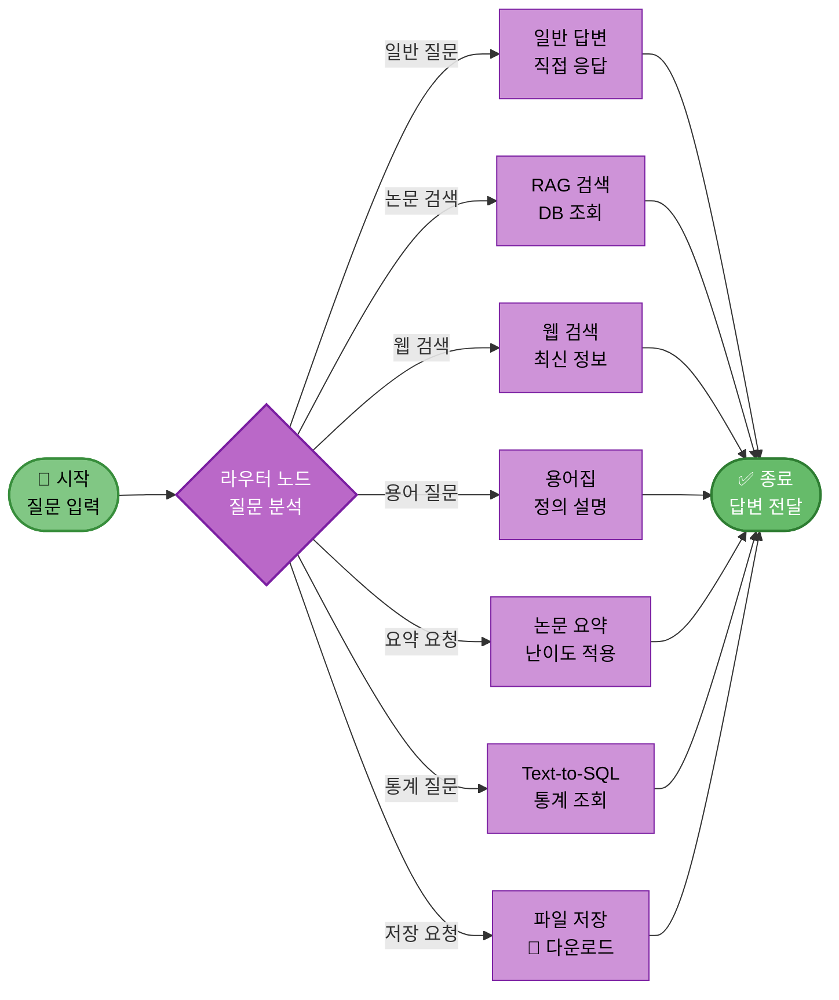
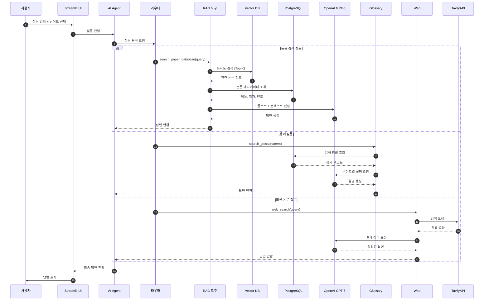

# 03. AI Agent 시스템 (LangGraph 기반)

## 📋 문서 정보
- **작성일**: 2025-11-03
- **시스템명**: AI Agent 시스템
- **구현 파일**: `src/agent/` (graph.py, nodes.py, state.py)
- **우선순위**: ⭐⭐ (중요 - 핵심 로직)
- **작성자**: 최현화[팀장]
- **참고 문서**: [PRD/12_AI_Agent_설계.md](../PRD/12_AI_Agent_설계.md)

---

## 📌 시스템 개요

### 목적 및 배경

AI Agent 시스템은 **LangGraph StateGraph**를 기반으로 **사용자 질문을 분석하고 적절한 도구를 자동으로 선택하여 실행하는 지능형 시스템**입니다. `src/agent/` 폴더에 구현되어 있으며, 라우터 노드와 7개의 도구 노드로 구성되어 있습니다.

### 주요 역할

1. **질문 분석**: 라우터 노드에서 LLM을 활용하여 질문 유형 분석
2. **도구 선택**: 7가지 도구 중 질문에 가장 적합한 도구 자동 선택
3. **도구 실행**: 선택된 도구 노드 실행 및 결과 반환
4. **난이도 적용**: Easy/Hard 모드에 따른 프롬프트 자동 조정
5. **대화 관리**: 멀티턴 대화를 위한 메모리 통합

### 7가지 도구

| 도구명 | 구현 파일 | 설명 | 사용 시나리오 |
|--------|-----------|------|--------------|
| **general** | general_answer.py | LLM 직접 호출 | 일반적인 질문 |
| **search_paper** | search_paper.py | 논문 DB 검색 | 논문 관련 질문 |
| **glossary** | glossary.py | 용어 정의 조회 | 용어 설명 요청 |
| **web_search** | web_search.py | Tavily API | 최신 정보 검색 |
| **summarize** | summarize.py | 논문 요약 | 논문 요약 요청 |
| **text2sql** | text2sql.py | 논문 통계 조회 | 개수, 순위, 분포 질문 |
| **save_file** | save_file.py | 파일 저장 | 결과물 저장 요청 |

---

## 🏗️ Agent 아키텍처

### LangGraph 구조



**Agent 그래프 구조 설명:**
- LangGraph 기반 AI Agent의 전체 구조를 시각화하여 시작부터 종료까지의 라우팅 프로세스를 표현
- 사용자 질문이 입력되면 라우터 노드에서 질문을 분석하여 7가지 도구 중 하나를 자동으로 선택
- 7가지 도구는 일반 답변(직접 응답), RAG 검색(DB 조회), 웹 검색(최신 정보), 용어집(정의 설명), 논문 요약(난이도 적용), Text-to-SQL(통계 조회), 파일 저장(다운로드)으로 구성
- Text-to-SQL 도구는 논문 개수, 순위, 분포 등의 통계 질문에 대해 자연어를 SQL로 변환하여 데이터베이스에서 정확한 통계를 조회
- 각 도구가 실행을 완료하면 결과가 답변으로 전달되고 종료 노드로 이동하여 최종 답변이 사용자에게 반환

### AgentState 구조

```python
from typing import TypedDict, Sequence
from langchain_core.messages import BaseMessage

class AgentState(TypedDict):
    """Agent 상태 정의"""
    question: str                          # 사용자 질문
    difficulty: str                        # 난이도 (easy/hard)
    tool_choice: str                       # 선택된 도구
    tool_result: str                       # 도구 실행 결과
    final_answer: str                      # 최종 답변
    messages: Sequence[BaseMessage]        # 대화 히스토리
```

### 파일 구조

```
src/agent/
├── state.py              # AgentState 정의
├── graph.py              # StateGraph 생성 및 컴파일
├── nodes.py              # 8개 노드 함수 (router + 7 tools)
└── __init__.py           # 모듈 초기화
```

---

## 🔧 핵심 구성 요소

### 1. 라우터 노드 (Router Node) - 2025-11-04 개선

**역할:**
- 사용자 질문을 LLM으로 분석
- 7가지 도구 중 가장 적합한 도구 선택
- `state["tool_choice"]`에 선택된 도구 이름 저장
- ✅ **다중 요청 감지** (신규): "논문 찾아서 요약해줘" 같은 복합 요청 처리

**구현 내용:**
- LLM: OpenAI GPT-5 (temperature=0)
- 프롬프트: 질문 + 도구 목록 → 도구 이름 반환
- 로깅: ExperimentManager로 라우팅 결정 기록

**다중 요청 감지 (2025-11-04 추가)**:

키워드 기반 패턴 매칭으로 다중 도구 필요 여부를 자동 감지합니다.

```python
# src/agent/nodes.py:48-96
multi_request_patterns = {
    ("찾", "요약"): ["search_paper", "summarize"],
    ("검색", "요약"): ["search_paper", "summarize"],
    ("찾", "정리"): ["search_paper", "summarize", "general"],
    ("논문", "요약"): ["search_paper", "summarize"],
    ("검색", "설명"): ["search_paper", "general"]
}

# 패턴 확인
for keywords, tools in multi_request_patterns.items():
    if all(kw in question for kw in keywords):
        if exp_manager:
            exp_manager.logger.write(f"다중 요청 감지: {keywords} → {tools}")

        # tool_pipeline 설정 (순차 실행 도구 목록)
        state["tool_pipeline"] = tools
        state["tool_choice"] = tools[0]  # 첫 번째 도구부터 시작
        return state

# 단일 요청은 기존 로직 사용
state["tool_pipeline"] = [tool_choice]
```

**다중 요청 처리 예시**:
```
사용자: "Transformer 논문 찾아서 요약해줘"
   ↓
Router: 키워드 감지 ("찾" + "요약")
   ↓
tool_pipeline: ["search_paper", "summarize"]
   ↓
1단계: search_paper 실행 → 논문 검색
2단계: summarize 실행 → 논문 요약
   ↓
최종 답변: 논문 요약 결과
```

**제약사항**:
- 현재는 키워드 기반 감지 (향후 LLM 기반 분석으로 개선 예정)
- 순차 실행 메커니즘은 기본 구현 완료 (graph 수정은 향후 개선)

**상세 문서**: [06-2_다중_요청_처리.md](./06-2_다중_요청_처리.md)

### 2. StateGraph 생성

**구성:**
```python
# 노드 등록
workflow.add_node("router", router_node)
workflow.add_node("general", general_answer_node)
workflow.add_node("search_paper", search_paper_node)
workflow.add_node("web_search", web_search_node)
workflow.add_node("glossary", glossary_node)
workflow.add_node("summarize", summarize_node)
workflow.add_node("text2sql", text2sql_node)
workflow.add_node("save_file", save_file_node)

# 시작점: router
workflow.set_entry_point("router")

# 조건부 엣지: router → 도구 선택
workflow.add_conditional_edges("router", route_to_tool, {
    "general": "general",
    "search_paper": "search_paper",
    "web_search": "web_search",
    "glossary": "glossary",
    "summarize": "summarize",
    "text2sql": "text2sql",
    "save_file": "save_file"
})

# 종료 엣지: 모든 도구 → END
workflow.add_edge("도구명", END)
```

### 3. 도구 노드 공통 패턴

모든 도구 노드는 다음 패턴을 따릅니다:

1. **Logger 생성**: `exp.get_tool_logger('tool_name')`
2. **난이도 체크**: `state.get("difficulty", "easy")`
3. **작업 수행**: DB 검색, LLM 호출 등
4. **프롬프트 저장**: `exp.save_system_prompt()`, `exp.save_user_prompt()`
5. **결과 저장**: `state["final_answer"]`에 저장
6. **Logger 종료**: `tool_logger.close()`
7. **State 반환**: `return state` (필수)

---

## 🔗 Agent 실행 흐름

### 상세 데이터 흐름



**상세 데이터 흐름 설명:**
- 사용자 질문이 Streamlit UI를 통해 입력되고 AI Agent가 처리하여 최종 답변을 반환하는 전체 데이터 흐름을 상세히 표현
- UI에서 질문과 난이도가 Agent로 전달되면 라우터가 질문을 분석하여 적절한 도구를 선택
- 논문 검색 시에는 RAG 도구가 Vector DB에서 유사도 검색을 수행하고 PostgreSQL에서 메타데이터를 조회한 후 LLM에 전달
- 용어 질문 시에는 Glossary 도구가 PostgreSQL에서 정의를 조회하고, 최신 논문 질문 시에는 Web 도구가 Tavily API를 호출
- 모든 경우 LLM이 난이도에 맞는 답변을 생성하여 UI를 통해 사용자에게 전달

---

## 📋 난이도별 프롬프트 전략

### Easy 모드 (초심자)

**특징:**
- 쉬운 언어와 비유 사용
- 단계별 설명
- 전문 용어 최소화

**시스템 프롬프트 예시:**
```
당신은 친절한 AI 어시스턴트입니다.
초심자도 이해할 수 있도록 쉽고 명확하게 답변해주세요.
```

### Hard 모드 (전문가)

**특징:**
- 기술적 세부사항 포함
- 논문 원문 용어 사용
- 수식 및 알고리즘 설명

**시스템 프롬프트 예시:**
```
당신은 전문적인 AI 어시스턴트입니다.
기술적인 세부사항을 포함하여 정확하고 전문적으로 답변해주세요.
```

---

## 🔗 통합 시스템

### ExperimentManager 통합

모든 Agent 실행은 ExperimentManager를 통해 기록됩니다:

**통합 항목:**
- 메인 Logger: 챗봇 실행 전체 로그
- 도구별 Logger: 각 도구의 독립 로그
- DB 쿼리 기록: SQL 및 pgvector 검색
- 프롬프트 저장: 시스템/사용자/최종 프롬프트
- 평가 지표: RAG, Agent 정확도, 응답 시간, 비용

### 대화 메모리 통합 (2025-11-04 개선)

ChatMemoryManager를 통해 멀티턴 대화를 지원합니다:

**사용 방식 (개선 후):**
```python
# ui/components/chat_interface.py:192-204
from ui.components.chat_manager import get_current_messages

# 이전 대화 히스토리 가져오기
previous_messages = get_current_messages()

# Agent 실행 시 전달
response = agent_executor.invoke(
    {
        "question": prompt,
        "difficulty": difficulty,
        "messages": previous_messages  # 빈 리스트 대신 이전 대화 전달
    },
    config={"callbacks": [st_callback]}
)
```

**개선 전후 비교**:
- **개선 전**: `messages=[]` (빈 리스트 전달) → 이전 대화 참조 불가
- **개선 후**: `messages=previous_messages` → 멀티턴 대화 지원

**효과:**
- ✅ 이전 대화 기억 가능
- ✅ 대명사 해석 가능 ("그럼", "그거", "첫 번째 논문")
- ✅ 컨텍스트 유지
- ✅ 연속적인 질문 처리 가능

**사용 예시**:
```
사용자: "Transformer 논문 찾아줘"
Agent: "Attention is All You Need 논문을 찾았습니다..."

사용자: "첫 번째 논문 요약해줘"  # 이전 대화 참조
Agent: "Attention is All You Need 논문을 요약하겠습니다..."
```

**상세 문서**: [06-1_멀티턴_대화_시스템.md](./06-1_멀티턴_대화_시스템.md)

---

## ⚠️ 주의사항

### 1. 모든 노드에서 state 반환 필수

```python
# ❌ 잘못된 예
def my_node(state: AgentState):
    state["final_answer"] = "답변"
    # return 없음 → StateGraph 동작 안 함

# ✅ 올바른 예
def my_node(state: AgentState):
    state["final_answer"] = "답변"
    return state  # 필수!
```

### 2. 조건부 엣지 키 일치

조건부 엣지에서 반환하는 키는 `add_conditional_edges`에 등록된 키와 **정확히 일치**해야 합니다:

```python
# add_conditional_edges에 등록된 키
{
    "search_paper": "search_paper",
    "web_search": "web_search",
    ...
}

# route_to_tool 함수는 정확히 같은 키를 반환해야 함
def route_to_tool(state: AgentState):
    return state["tool_choice"]  # "search_paper", "web_search" 등
```

### 3. 도구별 Logger 종료

도구별 Logger는 사용 후 **반드시 close()** 호출:

```python
tool_logger = exp.get_tool_logger('rag_paper')
tool_logger.write("검색 완료")
tool_logger.close()  # 필수!
```

### 4. 난이도 처리

모든 도구 노드에서 난이도 체크:

```python
difficulty = state.get("difficulty", "easy")  # 기본값: easy

if difficulty == "easy":
    system_prompt = "초심자용 프롬프트"
else:  # hard
    system_prompt = "전문가용 프롬프트"
```

---

## 🔗 관련 문서

- **[01_로깅_시스템.md](./01_로깅_시스템.md)** - Logger 사용법
- **[02_실험_관리_시스템.md](./02_실험_관리_시스템.md)** - ExperimentManager 통합
- **[04_LLM_클라이언트.md](./04_LLM_클라이언트.md)** - LLM 호출 방법
- **[05_대화_메모리_시스템.md](./05_대화_메모리_시스템.md)** - 대화 히스토리 관리
- **[06_도구_시스템.md](./06_도구_시스템.md)** - 7가지 도구 상세
- **[PRD/12_AI_Agent_설계.md](../PRD/12_AI_Agent_설계.md)** - Agent 설계 명세

---

## 📝 요약

### 구현된 핵심 기능

1. ✅ LangGraph StateGraph 기반 아키텍처
2. ✅ 라우터 노드 (LLM 기반 자동 도구 선택)
3. ✅ 7가지 도구 노드 (general, search_paper, web_search, glossary, summarize, text2sql, save_file)
4. ✅ 난이도별 프롬프트 (Easy/Hard 모드)
5. ✅ 대화 메모리 통합 (멀티턴 대화)
6. ✅ ExperimentManager 통합 (전체 실행 기록)
7. ✅ Text-to-SQL 통합 (논문 통계 조회)

### Agent 실행 흐름

```
사용자 질문 입력
  ↓
Router 노드 (질문 분석 → 도구 선택)
  ↓
도구 노드 실행 (7가지 중 하나)
  ↓
최종 답변 생성 (state["final_answer"])
  ↓
Agent 종료 (END 노드)
```

### 사용 패턴

```python
# Agent 생성 및 실행
with ExperimentManager() as exp:
    agent = create_agent_graph(exp_manager=exp)

    state = {
        "question": "RAG에 대해 알려줘",
        "difficulty": "easy",
        "messages": []
    }

    result = agent.invoke(state)
    print(result["final_answer"])
```

### 모범 사례

1. 모든 Agent 실행 시 ExperimentManager 사용
2. 모든 노드에서 반드시 state 반환
3. 도구별 Logger로 독립적인 로그 관리
4. 난이도 모드에 따른 프롬프트 분리
5. 대화 메모리로 컨텍스트 유지
6. 조건부 엣지 키 정확히 일치시키기
