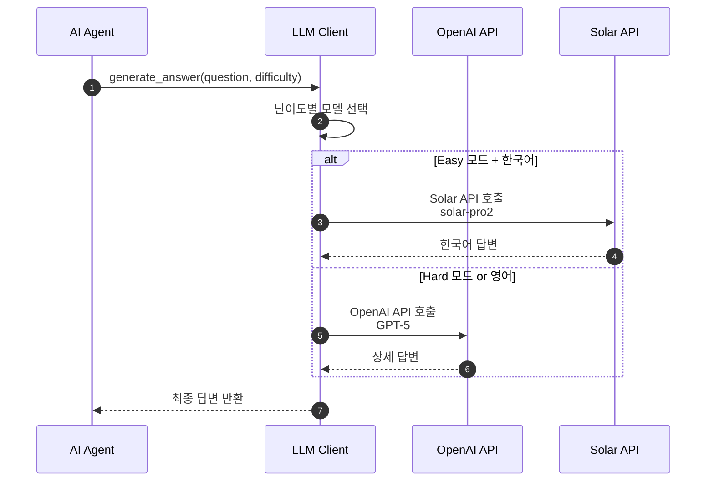
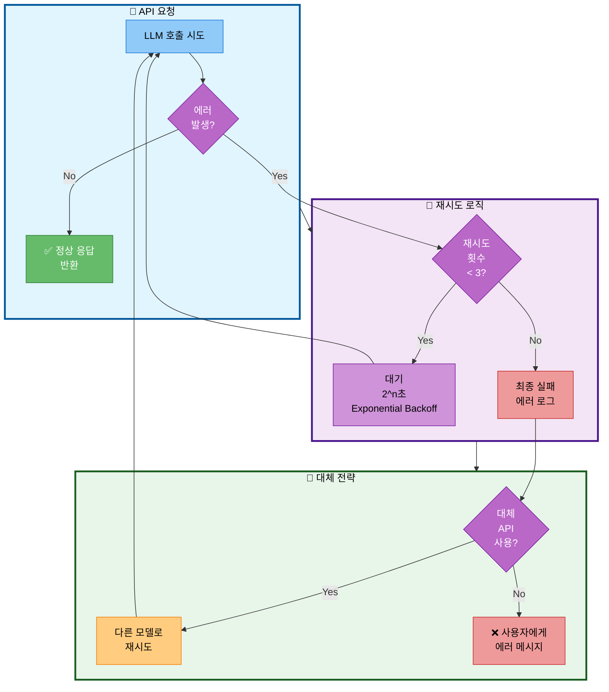

# 04. LLM 클라이언트 (다중 LLM 지원)

## 📋 문서 정보
- **작성일**: 2025-11-03
- **시스템명**: LLM 클라이언트
- **구현 파일**: `src/llm/client.py`
- **우선순위**: ⭐⭐ (중요 - LLM 호출)
- **작성자**: 최현화[팀장]
- **참고 문서**: [PRD/14_LLM_설정.md](../PRD/14_LLM_설정.md)

---

## 📌 시스템 개요

### 목적 및 배경

LLM 클라이언트는 **OpenAI와 Solar(Upstage) 듀얼 LLM을 지원**하며, **에러 핸들링 및 재시도 로직을 제공**하는 시스템입니다. `src/llm/client.py`에 `LLMClient` 클래스로 구현되어 있으며, 작업 유형에 따라 최적의 LLM을 선택할 수 있습니다.

### 주요 역할

1. **다중 LLM 지원**: OpenAI (GPT-5) + Solar (Solar Pro2)
2. **에러 핸들링**: 자동 재시도 (최대 3회, 지수 백오프)
3. **토큰 추적**: OpenAI 토큰 사용량 및 비용 추적
4. **스트리밍**: 실시간 응답 스트리밍 지원
5. **작업별 최적화**: 라우팅, 답변 생성, 요약 등 작업별 LLM 선택

### 지원 LLM

| Provider | 모델 | 용도 | 비용 | Temperature |
|----------|------|------|------|-------------|
| OpenAI | gpt-5 | 복잡한 답변, 요약 | 높음 | 0.7 |
| Solar | solar-pro2 | 빠른 라우팅, 전문적 답변 | 중간 | 0.7 |

---

## 🏗️ LLM API 호출 흐름

### API 호출 및 에러 처리



**LLM API 호출 흐름 설명:**
- AI Agent가 질문에 대한 답변을 생성할 때 LLM Client가 난이도에 따라 적절한 모델을 선택하는 과정을 표현
- Agent가 질문과 난이도를 LLM Client에 전달하면 Client는 난이도별로 최적의 모델을 선택
- Easy 모드와 한국어 답변이 필요한 경우 Solar API의 Solar Pro2 모델을 호출하여 한국어에 특화된 답변을 생성
- Hard 모드이거나 영어 답변이 필요한 경우 OpenAI API의 GPT-5 모델을 호출하여 상세하고 전문적인 답변을 생성
- 선택된 API에서 답변을 받아 Agent에 최종 답변을 반환

### 에러 처리 흐름



**에러 처리 흐름 설명:**
- LLM API 호출 시 발생할 수 있는 에러를 체계적으로 처리하는 전체 프로세스를 3단계로 표현
- API 요청 단계에서 LLM을 호출하여 에러 없이 성공하면 정상 응답을 반환
- 재시도 로직 단계에서 에러 발생 시 재시도 횟수를 확인하여 3회 미만이면 Exponential Backoff(2^n초)로 대기 후 재시도하고, 3회 이상이면 최종 실패로 에러 로그를 기록
- 대체 전략 단계에서 최종 실패 시 대체 API 사용 여부를 확인하여 가능하면 다른 모델로 재시도하고, 불가능하면 사용자에게 에러 메시지를 전달

---

## 🔧 LLMClient 클래스 구조

### 주요 메서드

| 메서드 | 설명 | 구현 내용 |
|--------|------|-----------|
| `__init__(provider, model, temperature)` | LLM 클라이언트 초기화 | OpenAI 또는 Solar 인스턴스 생성 |
| `invoke_with_retry(messages)` | 재시도 로직 포함 호출 | tenacity로 최대 3회 재시도 |
| `invoke_with_tracking(messages)` | 토큰 사용량 추적 호출 | OpenAI callback으로 토큰/비용 추적 |
| `astream(messages)` | 비동기 스트리밍 응답 | 실시간 응답 생성 |

### 재시도 로직

**Exponential Backoff 전략:**
```
1차 시도 → 실패 → 2초 대기
2차 시도 → 실패 → 4초 대기
3차 시도 → 실패 → 8초 대기
4차 시도 (없음) → 최종 에러 발생
```

**구현:**
```python
from tenacity import retry, stop_after_attempt, wait_exponential

@retry(
    stop=stop_after_attempt(3),
    wait=wait_exponential(multiplier=2, min=2, max=8)
)
def invoke_with_retry(self, messages):
    return self.llm.invoke(messages)
```

---

## 📋 작업 유형별 LLM 선택 전략

### 선택 기준

| 작업 유형 | 추천 LLM | Temperature | 이유 |
|----------|----------|-------------|------|
| **라우팅** | Solar Pro2 | 0.0 | 빠르고 저렴, 결정론적 |
| **답변 생성** | OpenAI GPT-5 | 0.7 | 높은 품질, 자연스러운 답변 |
| **요약** | OpenAI GPT-5 | 0.0 | 정확성 중시 |

### 난이도별 선택

**Easy 모드 (초심자):**
- Solar Pro2 (한국어 특화)

**Hard 모드 (전문가):**
- OpenAI GPT-5 (기술적 정확도)
- Temperature: 0.7 (자연스러운 답변)

---

## 🔗 통합 시스템

### AI Agent 통합

LLMClient는 모든 Agent 노드에서 사용됩니다:

- **Router 노드**: Solar Pro2 (빠른 라우팅)
- **General 노드**: Solar Pro2 (일반 답변 - Easy) / GPT-5 (일반 답변 - Hard)
- **RAG 노드**: GPT-5 (복잡한 답변)
- **Glossary 노드**: GPT-5 (용어 설명)
- **Summarize 노드**: GPT-5 (정확한 요약)

### Fallback 전략

OpenAI 실패 시 Solar로 자동 전환:

```python
try:
    llm_openai = LLMClient(provider="openai", model="gpt-5")
    return llm_openai.invoke_with_retry(messages)
except Exception as e:
    logger.write(f"OpenAI 실패, Solar로 Fallback: {e}")
    llm_solar = LLMClient(provider="solar", model="solar-pro2")
    return llm_solar.invoke_with_retry(messages)
```

---

## ⚠️ 주의사항

### 1. API 키 필수 설정

`.env` 파일에 API 키를 반드시 설정해야 합니다:

```bash
OPENAI_API_KEY=sk-...
SOLAR_API_KEY=up-...
```

### 2. 비용 관리

| 모델 | 1K 토큰 비용 (입력) | 1K 토큰 비용 (출력) |
|------|---------------------|---------------------|
| gpt-5 | $0.04 | $0.08 |
| solar-pro2 | 무료 (제한적) | 무료 (제한적) |

**비용 절감 팁:**
- 라우팅은 Solar Pro2 사용
- Easy 모드는 Solar Pro2 사용
- Hard 모드만 GPT-5 사용

### 3. 타임아웃 설정

```python
llm = ChatOpenAI(
    model="gpt-5",
    request_timeout=30,  # 30초 타임아웃
    max_retries=2
)
```

### 4. 스트리밍 사용 시 주의

스트리밍은 UI가 실시간 응답을 보여줄 때만 사용:
- Streamlit: StreamlitCallbackHandler 사용
- 일반 스크립트: 동기 호출 사용 (invoke)

---

## 🔗 관련 문서

- **[03_AI_Agent_시스템.md](./03_AI_Agent_시스템.md)** - Agent에서 LLM 사용
- **[PRD/14_LLM_설정.md](../PRD/14_LLM_설정.md)** - LLM 설정 전체 명세
- **[PRD/15_프롬프트_엔지니어링.md](../PRD/15_프롬프트_엔지니어링.md)** - 프롬프트 전략

---

## 📝 요약

### 구현된 핵심 기능

1. ✅ OpenAI + Solar 듀얼 LLM 지원
2. ✅ 자동 재시도 (최대 3회, 지수 백오프)
3. ✅ 토큰 사용량 추적 (OpenAI)
4. ✅ 스트리밍 응답 처리
5. ✅ 작업 유형별 LLM 선택
6. ✅ Fallback 전략 (OpenAI 실패 시 Solar)

### 사용 패턴

```python
# OpenAI 사용
llm_openai = LLMClient(provider="openai", model="gpt-5", temperature=0.7)

# Solar 사용
llm_solar = LLMClient(provider="solar", model="solar-pro2", temperature=0)

# 재시도 로직
response = llm_openai.invoke_with_retry(messages)

# 토큰 추적
response = llm_openai.invoke_with_tracking(messages)
```

### 모범 사례

1. **라우팅**: Solar Pro2 (빠르고 저렴)
2. **답변 생성**: GPT-5 (높은 품질)
3. **재시도 로직**: 모든 호출에 적용 (안정성)
4. **Fallback**: OpenAI 실패 시 Solar 사용 (가용성)
5. **토큰 모니터링**: OpenAI 비용 추적 (비용 관리)
6. **Temperature**: 라우팅 0, 답변 0.7
