# 06-1. 도구 자동전환 및 Fallback Chain 시스템

## 📋 문서 정보
- **작성일**: 2025-11-04
- **작성자**: 최현화[팀장]
- **시스템명**: Fallback Chain 메커니즘
- **구현 파일**: `src/agent/` (graph.py, nodes.py, failure_detector.py 등)
- **우선순위**: ⭐⭐⭐ (높음 - 시스템 안정성)
- **참고 문서**: [09_도구_시스템.md](./09_도구_시스템.md), [03_AI_Agent_시스템.md](./03_AI_Agent_시스템.md)

---

## 📌 시스템 개요

### 목적 및 배경

Fallback Chain 시스템은 **AI Agent가 도구 실행 실패 시 자동으로 다음 우선순위 도구로 전환**하여 사용자 질문에 항상 적절한 답변을 제공하는 메커니즘입니다.

### 핵심 기능

1. **도구 실행 실패 감지**: 도구 실행 결과에서 실패 패턴 자동 감지
2. **질문 유형 분류**: 7가지 질문 유형으로 자동 분류 (LLM 기반)
3. **우선순위 기반 Fallback**: 질문 유형별 도구 우선순위 체인 실행
4. **Router 검증**: LLM이 Router의 도구 선택을 검증하여 정확도 향상
5. **최종 Fallback**: 모든 도구 실패 시 general 도구 강제 실행

### 도입 배경

**기존 시스템의 문제점:**
- Router가 한 번 도구를 선택하면 해당 도구만 실행하고 바로 종료
- 도구 실행 실패 시 다른 도구로 자동 전환되지 않음
- 사용자 질문에 적절한 답변을 제공하지 못하는 경우 발생

**해결 방안:**
- 도구 실행 실패 감지 및 자동 재라우팅
- 질문 유형별 도구 우선순위 설정
- Router 선택 검증 노드 추가
- Fallback Chain 메커니즘 구현

---

## 🚨 기존 시스템의 문제점

### 문제 1: 도구 간 자동 전환 없음

```
시나리오:
사용자: "최신 Diffusion Model 논문 찾아줘"
    ↓
Router: search_paper 선택
    ↓
search_paper: DB에 관련 논문 없음
    → "관련 논문을 찾을 수 없습니다." 반환
    ↓
END (종료) ❌
    ↓
❌ web_search로 자동 전환 안 됨
❌ general로 Fallback 안 됨
```

**코드 위치**: `src/agent/graph.py:266-267`
```python
# 기존 코드 (Fallback Chain 비활성화 시)
for node in ["general", "save_file", "search_paper", "web_search", "glossary", "summarize", "text2sql"]:
    workflow.add_edge(node, END)  # 모든 도구 실행 후 바로 END
```

### 문제 2: 도구 선택 실패 시 재시도 없음

```
시나리오:
사용자: "Attention 메커니즘 설명해줘"
    ↓
Router: 실수로 save_file 선택 (잘못된 판단)
    ↓
save_file: 파일 경로 없음 → 오류
    ↓
END (종료) ❌
    ↓
❌ 도구 재선택 안 됨
❌ glossary나 general로 자동 전환 안 됨
```

### 문제 3: Fallback Chain 부재

```
이상적인 Fallback Chain:
glossary 검색 → 실패
    ↓
search_paper 검색 → 실패
    ↓
web_search 검색 → 실패
    ↓
general 답변 (최종 Fallback)

기존 구현:
선택된 도구 1개만 실행 → END
```

---

## ✨ 해결 방안

### 1. 도구 실행 실패 감지

**FailureDetector 클래스** (`src/agent/failure_detector.py`)
- 도구 실행 결과에서 실패 패턴 매칭
- 11개 실패 패턴 + 7개 정규식 패턴 지원
- `is_tool_failed(result: str) -> (bool, str)` 함수 제공

**실패 패턴 예시:**
- "관련 용어를 찾을 수 없습니다"
- "관련 논문을 찾을 수 없습니다"
- "검색 결과가 없습니다"
- "파일 경로를 지정해주세요"
- "SQL 쿼리 생성에 실패했습니다"
- "오류가 발생했습니다"

### 2. 질문 유형 분류

**QuestionClassifier 클래스** (`src/agent/question_classifier.py`)
- LLM 기반 질문 유형 분류 (7가지)
- 분류 결과 캐싱 (동일 질문 재분류 방지)
- Solar Pro2 사용 (빠르고 저렴)

**7가지 질문 유형:**
1. **term_definition**: AI/ML 용어 정의 질문
2. **paper_search**: 특정 논문 검색 질문
3. **latest_research**: 최신 연구 동향 질문
4. **paper_summary**: 논문 요약 요청
5. **statistics**: 논문 통계 정보 질문
6. **file_save**: 파일 저장 요청
7. **general_question**: 일반 질문

### 3. 도구 우선순위 체인

**설정 파일** (`configs/model_config.yaml`)
```yaml
fallback_chain:
  priorities:
    term_definition:
      - glossary
      - general
    paper_search:
      - search_paper
      - web_search
      - general
    latest_research:
      - web_search
      - search_paper
      - general
    paper_summary:
      - summarize
      - search_paper
      - general
    statistics:
      - text2sql
      - general
    general_question:
      - general
    file_save:
      - save_file
```

### 4. Router 검증 메커니즘

**validate_tool_choice_node** (`src/agent/nodes.py:205-312`)
- LLM이 Router의 도구 선택을 검증
- "yes" / "no" 응답으로 적절성 판단
- 검증 실패 시 재라우팅 (최대 2회)
- 검증 재시도 초과 시 general 강제 실행

### 5. Fallback Router 노드

**fallback_router_node** (`src/agent/nodes.py:120-200`)
- 도구 실행 실패 시 다음 우선순위 도구 선택
- 실패한 도구 목록 관리 (`state["failed_tools"]`)
- 재시도 횟수 추적 (`state["retry_count"]`)
- 최대 재시도 초과 시 general 강제 실행

---

## 🏗️ 시스템 아키텍처

### Fallback Chain 실행 흐름

```mermaid
graph TB
    Start([사용자 질문]) --> ClassifyQ{질문 유형 분류<br/>QuestionClassifier}
    ClassifyQ --> LoadChain[우선순위 체인 로드<br/>config_loader.py]
    LoadChain --> Router{Router 노드<br/>도구 선택}

    Router --> Validate{Router 검증<br/>validation_enabled?}
    Validate -->|검증 비활성화| Tool1[도구 1 실행]
    Validate -->|검증 활성화| ValidateNode{validate_tool_choice_node<br/>LLM 검증}

    ValidateNode -->|적절함| Tool1
    ValidateNode -->|부적절함| CheckRetry1{검증 재시도<br/>< max_validation?}
    CheckRetry1 -->|Yes| Router
    CheckRetry1 -->|No| ForcedGeneral[general 강제 실행]

    Tool1 --> FailureCheck1{실패 감지<br/>FailureDetector}
    FailureCheck1 -->|성공| End([답변 반환])
    FailureCheck1 -->|실패| CheckRetry2{재시도 횟수<br/>< max_retries?}

    CheckRetry2 -->|Yes| FallbackRouter[Fallback Router<br/>다음 도구 선택]
    CheckRetry2 -->|No| FinalFallback[final_fallback_node<br/>general 강제 실행]

    FallbackRouter --> Tool2[도구 2 실행]
    Tool2 --> FailureCheck2{실패 감지}
    FailureCheck2 -->|성공| End
    FailureCheck2 -->|실패| CheckRetry3{재시도 횟수<br/>< max_retries?}

    CheckRetry3 -->|Yes| FallbackRouter
    CheckRetry3 -->|No| FinalFallback

    FinalFallback --> End
    ForcedGeneral --> End

    %% 노드 스타일
    style Start fill:#81d4fa,stroke:#0288d1,stroke-width:2px,color:#000
    style End fill:#a5d6a7,stroke:#388e3c,stroke-width:2px,color:#000
    style ClassifyQ fill:#ce93d8,stroke:#7b1fa2,stroke-width:2px,color:#000
    style Router fill:#ce93d8,stroke:#7b1fa2,stroke-width:2px,color:#000
    style Validate fill:#ffb74d,stroke:#f57c00,stroke-width:2px,color:#000
    style ValidateNode fill:#ffb74d,stroke:#f57c00,stroke-width:2px,color:#000
    style Tool1 fill:#90caf9,stroke:#1976d2,stroke-width:2px,color:#000
    style Tool2 fill:#90caf9,stroke:#1976d2,stroke-width:2px,color:#000
    style FailureCheck1 fill:#ef5350,stroke:#c62828,stroke-width:2px,color:#fff
    style FailureCheck2 fill:#ef5350,stroke:#c62828,stroke-width:2px,color:#fff
    style FallbackRouter fill:#ba68c8,stroke:#7b1fa2,stroke-width:2px,color:#fff
    style FinalFallback fill:#ff7043,stroke:#d84315,stroke-width:2px,color:#fff
    style ForcedGeneral fill:#ff7043,stroke:#d84315,stroke-width:2px,color:#fff
```



### 상태 관리 (AgentState)

**Fallback Chain 관련 상태 필드** (`src/agent/state.py`)
```python
class AgentState(TypedDict, total=False):
    # 기존 필드
    question: str
    difficulty: str
    tool_choice: str
    final_answer: str

    # Fallback Chain 필드
    retry_count: int                  # 현재 재시도 횟수
    failed_tools: List[str]           # 실패한 도구 리스트
    question_type: str                # 질문 유형
    fallback_chain: List[str]         # 도구 우선순위 리스트
    validation_failed: bool           # Router 검증 실패 여부
    tool_status: str                  # 도구 실행 상태 (success/failed/error)
    tool_timeline: List[Dict[str, Any]]  # 도구 실행 타임라인
    max_retries: int                  # 최대 재시도 횟수
    validation_enabled: bool          # Router 검증 활성화 여부
    validation_retries: int           # 검증 재시도 횟수
    max_validation: int               # 최대 검증 재시도 횟수
```

---

## 📂 구현 파일 구조

### 1. 핵심 모듈

| 파일 | 설명 | 주요 클래스/함수 |
|------|------|------------------|
| **src/agent/graph.py** | LangGraph 그래프 재구성 | `create_agent_graph()`, `should_fallback()`, `should_validate()`, `initialize_fallback_state()` |
| **src/agent/nodes.py** | Fallback 노드 구현 | `fallback_router_node()`, `validate_tool_choice_node()`, `final_fallback_node()` |
| **src/agent/failure_detector.py** | 실패 패턴 감지 | `FailureDetector`, `is_tool_failed()` |
| **src/agent/question_classifier.py** | 질문 유형 분류 | `QuestionClassifier`, `classify_question()` |
| **src/agent/config_loader.py** | Fallback 설정 로더 | `load_fallback_config()`, `get_priority_chain()`, `is_fallback_enabled()` |
| **src/agent/tool_wrapper.py** | 도구 래퍼 (자동 상태 설정) | `wrap_tool_node()` |
| **src/agent/state.py** | Agent 상태 정의 | `AgentState` (11개 Fallback 필드 추가) |

### 2. 설정 파일

| 파일 | 설명 |
|------|------|
| **configs/model_config.yaml** | Fallback Chain 설정 (우선순위, 재시도 횟수 등) |

---

## 🔧 주요 컴포넌트

### 1. FailureDetector (실패 감지)

**파일**: `src/agent/failure_detector.py`

```python
class FailureDetector:
    """도구 실행 실패 감지 클래스"""

    # 실패 패턴 (11개)
    FAILURE_PATTERNS = [
        "관련 용어를 찾을 수 없습니다",
        "관련 논문을 찾을 수 없습니다",
        "검색 결과가 없습니다",
        "웹 검색에 실패했습니다",
        "파일 경로를 지정해주세요",
        "SQL 쿼리 생성에 실패했습니다",
        "요약할 논문을 찾을 수 없습니다",
        "오류가 발생했습니다",
        "실패했습니다",
        "처리할 수 없습니다",
        "지원하지 않습니다"
    ]

    # 정규식 패턴 (7개)
    FAILURE_REGEX = [
        r"오류.*발생",
        r"실패.*했습니다",
        r"찾을 수 없",
        r"존재하지 않",
        r"처리.*불가",
        r"지원.*않",
        r"접근.*거부"
    ]

    def is_failed(self, result: str) -> Tuple[bool, str]:
        """
        도구 실행 결과에서 실패 여부 판단

        Returns:
            (is_failed, failure_reason)
        """
        # 패턴 매칭 로직
        # ...
```

**사용 위치**: `src/agent/tool_wrapper.py:56`

### 2. QuestionClassifier (질문 분류)

**파일**: `src/agent/question_classifier.py`

```python
class QuestionClassifier:
    """질문 유형 분류 클래스"""

    QUESTION_TYPES = {
        "term_definition": "AI/ML 용어의 정의를 묻는 질문",
        "paper_search": "특정 논문을 검색하거나 찾는 질문",
        "latest_research": "최신 연구 동향이나 최근 논문을 묻는 질문",
        "paper_summary": "논문의 요약을 요청하는 질문",
        "statistics": "논문 개수, 저자, 연도 등 통계 정보를 묻는 질문",
        "file_save": "답변을 파일로 저장해달라는 요청",
        "general_question": "위 카테고리에 속하지 않는 일반적인 질문"
    }

    def classify(self, question: str, difficulty: str = "easy") -> str:
        """
        질문 유형 분류 (LLM 기반)

        Returns:
            question_type (7가지 중 하나)
        """
        # LLM 호출 및 분류 로직
        # 결과 캐싱
        # ...
```

**사용 위치**: `src/agent/graph.py:302`

### 3. Config Loader (설정 로더)

**파일**: `src/agent/config_loader.py`

```python
def load_fallback_config(force_reload: bool = False) -> Dict[str, Any]:
    """
    Fallback Chain 설정 로드

    Returns:
        {
            "enabled": True,
            "max_retries": 3,
            "validation_enabled": True,
            "validation_retries": 2,
            "priorities": {
                "term_definition": ["glossary", "general"],
                "paper_search": ["search_paper", "web_search", "general"],
                # ...
            }
        }
    """
    # configs/model_config.yaml 읽기
    # 설정 검증 및 캐싱
    # ...

def get_priority_chain(question_type: str) -> List[str]:
    """질문 유형에 대한 도구 우선순위 리스트 반환"""
    # ...

def is_fallback_enabled() -> bool:
    """Fallback Chain 활성화 여부 반환"""
    # ...
```

**사용 위치**: `src/agent/graph.py:137`, `src/agent/nodes.py:15`

### 4. Fallback Router Node

**파일**: `src/agent/nodes.py:120-200`

```python
def fallback_router_node(state: AgentState, exp_manager=None):
    """
    Fallback Router 노드: 도구 실행 실패 시 다음 우선순위 도구 선택

    처리 로직:
    1. 실패한 도구를 state["failed_tools"]에 추가
    2. state["retry_count"] 증가
    3. max_retries 초과 확인
       - 초과 시: general 강제 선택
       - 미초과: fallback_chain에서 다음 도구 선택
    4. 모든 도구 시도 완료 시 general 선택
    5. 타임라인 기록
    """
    # 현재 상태 정보 추출
    question = state["question"]
    failed_tool = state.get("tool_choice", "unknown")
    retry_count = state.get("retry_count", 0)
    max_retries = state.get("max_retries", 3)
    fallback_chain = state.get("fallback_chain", [])
    failed_tools = state.get("failed_tools", [])

    # 실패한 도구 기록
    if failed_tool not in failed_tools:
        failed_tools.append(failed_tool)
        state["failed_tools"] = failed_tools

    # 재시도 횟수 증가
    retry_count += 1
    state["retry_count"] = retry_count

    # 최대 재시도 초과 확인
    if retry_count > max_retries:
        state["tool_choice"] = "general"
        return state

    # Fallback Chain에서 다음 도구 선택
    next_tool = None
    for tool in fallback_chain:
        if tool not in failed_tools:
            next_tool = tool
            break

    # 모든 도구 시도 완료
    if next_tool is None:
        next_tool = "general"

    state["tool_choice"] = next_tool

    # 타임라인 기록
    # ...

    return state
```

### 5. Router 검증 Node

**파일**: `src/agent/nodes.py:205-312`

```python
def validate_tool_choice_node(state: AgentState, exp_manager=None):
    """
    Router 검증 노드: Router가 선택한 도구가 적절한지 LLM으로 검증

    처리 로직:
    1. 도구 설명 조회
    2. LLM에게 검증 요청 (yes/no)
    3. 검증 결과 파싱
    4. 검증 실패 시:
       - validation_retries 증가
       - max_validation 초과 확인
       - 초과: general 강제 선택
       - 미초과: 재라우팅
    """
    # 상태 정보 추출
    question = state["question"]
    tool_choice = state.get("tool_choice", "general")
    validation_retries = state.get("validation_retries", 0)
    max_validation = state.get("max_validation", 2)

    # 도구 설명
    TOOL_DESCRIPTIONS = {
        "general": "일반 질문에 LLM 지식으로 답변",
        "glossary": "AI/ML 용어 정의 검색",
        "search_paper": "논문 DB에서 RAG 검색",
        "web_search": "웹에서 최신 논문 검색",
        "summarize": "논문 요약 생성",
        "text2sql": "논문 통계 정보 SQL 조회",
        "save_file": "답변을 파일로 저장"
    }

    tool_desc = TOOL_DESCRIPTIONS.get(tool_choice, "알 수 없는 도구")

    # 검증 프롬프트 생성
    validation_prompt = f"""질문: {question}

선택된 도구: {tool_choice}
도구 설명: {tool_desc}

이 도구 선택이 질문에 적절한가요?

- yes: 적절함 (도구를 사용하여 질문에 답변 가능)
- no: 부적절함 (다른 도구를 사용해야 함)

답변 (yes/no):"""

    # LLM 호출 및 검증
    # ...

    # 검증 결과 처리
    if is_valid:
        state["validation_failed"] = False
    else:
        validation_retries += 1
        state["validation_retries"] = validation_retries

        if validation_retries > max_validation:
            state["tool_choice"] = "general"
            state["validation_failed"] = False
        else:
            state["validation_failed"] = True

    return state
```

### 6. Tool Wrapper (자동 상태 설정)

**파일**: `src/agent/tool_wrapper.py`

```python
def wrap_tool_node(tool_node_func: Callable, tool_name: str) -> Callable:
    """
    도구 노드를 래핑하여 tool_status 자동 설정

    처리 로직:
    1. 타임라인 기록 (실행 전)
    2. 원본 도구 실행
    3. 실행 결과 확인 (FailureDetector)
    4. tool_status 설정 (success/failed/error)
    5. 타임라인 기록 (실행 후)
    """
    def wrapped_tool_node(state: AgentState, exp_manager=None) -> AgentState:
        # 타임라인 기록 (실행 전)
        timeline = state.get("tool_timeline", [])
        timeline.append({
            "timestamp": datetime.now().isoformat(),
            "event": "tool_start",
            "tool": tool_name,
            "retry_count": state.get("retry_count", 0)
        })
        state["tool_timeline"] = timeline

        # 원본 도구 실행
        try:
            state = tool_node_func(state, exp_manager)

            # 실행 결과 확인
            final_answer = state.get("final_answer", "")
            is_failed, failure_reason = is_tool_failed(final_answer)

            if is_failed:
                state["tool_status"] = "failed"
            else:
                state["tool_status"] = "success"

        except Exception as e:
            state["tool_status"] = "error"
            state["final_answer"] = f"도구 실행 중 오류 발생: {str(e)}"

        # 타임라인 기록 (실행 후)
        # ...

        return state

    return wrapped_tool_node
```

**사용 위치**: `src/agent/graph.py:158-164`

---

## ⚙️ 설정 방법

### configs/model_config.yaml 설정

**파일 위치**: `configs/model_config.yaml`

```yaml
# ==================== Fallback Chain 설정 ==================== #
fallback_chain:
  # Fallback Chain 활성화 여부
  enabled: true

  # 도구 실행 실패 시 최대 재시도 횟수 (1-5 권장)
  max_retries: 3

  # Router 선택 검증 활성화 여부
  validation_enabled: true

  # Router 검증 실패 시 최대 재시도 횟수 (1-3 권장)
  validation_retries: 2

  # 질문 유형별 도구 우선순위
  priorities:
    # 용어 정의 질문
    term_definition:
      - glossary      # 1순위: 용어집 검색
      - general       # 2순위: 일반 답변 (최종 Fallback)

    # 논문 검색 질문
    paper_search:
      - search_paper  # 1순위: DB 검색
      - web_search    # 2순위: 웹 검색
      - general       # 3순위: 일반 답변

    # 최신 연구 동향
    latest_research:
      - web_search    # 1순위: 웹 검색
      - search_paper  # 2순위: DB 검색
      - general       # 3순위: 일반 답변

    # 논문 요약 요청
    paper_summary:
      - summarize     # 1순위: 요약 도구
      - search_paper  # 2순위: DB 검색 후 LLM 요약
      - general       # 3순위: 일반 답변

    # 통계 정보 질문
    statistics:
      - text2sql      # 1순위: SQL 쿼리
      - general       # 2순위: 일반 답변

    # 일반 질문
    general_question:
      - general       # 바로 일반 답변

    # 파일 저장 요청
    file_save:
      - save_file     # 파일 저장만
```

### 설정 변경 방법

**1. Fallback Chain 비활성화:**
```yaml
fallback_chain:
  enabled: false  # 기존 동작 (도구 1개만 실행)
```

**2. 최대 재시도 횟수 변경:**
```yaml
fallback_chain:
  max_retries: 5  # 최대 5회까지 재시도 (기본값: 3)
```

**3. Router 검증 비활성화:**
```yaml
fallback_chain:
  validation_enabled: false  # Router 검증 생략
```

**4. 도구 우선순위 커스터마이징:**
```yaml
fallback_chain:
  priorities:
    paper_search:
      - web_search     # 1순위: 웹 검색 (변경)
      - search_paper   # 2순위: DB 검색
      - glossary       # 3순위: 용어집 (추가)
      - general        # 4순위: 일반 답변
```

**주의사항:**
- 모든 우선순위 리스트는 마지막에 `general` 포함 권장
- `general` 도구는 항상 성공하므로 최종 Fallback 역할
- 우선순위 리스트는 최대 3-4개 권장 (비용 및 응답 시간 고려)

---

## 🔍 사용 예시

### 예시 1: glossary 실패 → general Fallback

**시나리오**: 용어집에 없는 용어 질문

```
사용자: "ml이 뭐야?"
    ↓
Step 1. QuestionClassifier
    - 질문 유형 분류: "term_definition"
    - 우선순위 체인 로드: ["glossary", "general"]
    ↓
Step 2. Router 노드
    - 도구 선택: "glossary"
    ↓
Step 3. Glossary 도구 실행
    - glossary 테이블 검색
    - 결과 없음: "관련 용어를 찾을 수 없습니다."
    - state["tool_status"] = "failed"  (tool_wrapper.py:60)
    ↓
Step 4. should_fallback() 함수 (graph.py:63)
    - tool_status == "failed" → "retry" 반환
    ↓
Step 5. Fallback Router (nodes.py:120)
    - state["failed_tools"].append("glossary")
    - state["retry_count"] = 1
    - fallback_chain = ["glossary", "general"]
    - 다음 도구: "general"
    - state["tool_choice"] = "general"
    ↓
Step 6. General 도구 실행
    - LLM 자체 지식으로 답변
    - "ML은 Machine Learning의 약자로..."
    - state["tool_status"] = "success"
    ↓
Step 7. should_fallback() 함수
    - tool_status == "success" → "end" 반환
    ↓
END (성공) ✅
```

**로그 출력:**
```
[Fallback Router 실행]
실패한 도구: glossary
재시도 횟수: 1/3
다음 도구 선택: general
Fallback Chain: glossary → general
```

### 예시 2: search_paper 실패 → web_search → 성공

**시나리오**: 로컬 DB에 없는 최신 논문 질문

```
사용자: "최신 Diffusion Model 논문 찾아줘"
    ↓
Step 1. QuestionClassifier
    - 질문 유형 분류: "latest_research"
    - 우선순위 체인 로드: ["web_search", "search_paper", "general"]
    ↓
Step 2. Router 노드
    - 도구 선택: "web_search" (최신 정보 필요)
    ↓
Step 3. Web Search 도구 실행
    - Tavily API 검색
    - arXiv 논문 발견:
      * "Diffusion Models Beat GANs on Image Synthesis" (2021)
      * "High-Resolution Image Synthesis with Latent Diffusion Models" (2022)
    - arXiv 논문 자동 다운로드 및 DB 저장
    - state["tool_status"] = "success"
    ↓
Step 4. should_fallback() 함수
    - tool_status == "success" → "end" 반환
    ↓
END (성공) ✅
```

**답변 예시:**
```
최신 Diffusion Model 논문을 찾았습니다:

1. **Diffusion Models Beat GANs on Image Synthesis** (2021)
   - 저자: Prafulla Dhariwal, Alex Nichol
   - 주요 내용: Diffusion 모델이 이미지 생성에서 GAN을 능가함을 입증
   - 링크: https://arxiv.org/abs/2105.05233

2. **High-Resolution Image Synthesis with Latent Diffusion Models** (2022)
   - 저자: Robin Rombach, et al.
   - 주요 내용: Latent Space에서 Diffusion 수행으로 고해상도 생성
   - 링크: https://arxiv.org/abs/2112.10752

논문이 자동으로 DB에 저장되어, 향후 "Diffusion Model 설명해줘" 질문 시 RAG 검색에서 사용됩니다.
```

### 예시 3: Router 검증 실패 → 재라우팅

**시나리오**: Router의 잘못된 도구 선택

```
사용자: "Attention 메커니즘 설명해줘"
    ↓
Step 1. QuestionClassifier
    - 질문 유형 분류: "term_definition"
    - 우선순위 체인 로드: ["glossary", "general"]
    ↓
Step 2. Router 노드
    - 도구 선택: "save_file" (잘못된 판단)
    ↓
Step 3. Validator 노드 (nodes.py:205)
    - validation_enabled == true
    - LLM 검증 프롬프트:
      """
      질문: Attention 메커니즘 설명해줘
      선택된 도구: save_file
      도구 설명: 답변을 파일로 저장

      이 도구 선택이 질문에 적절한가요? (yes/no)
      """
    - LLM 응답: "no" (부적절함)
    - state["validation_failed"] = True
    - state["validation_retries"] = 1
    ↓
Step 4. should_validate() 함수 (graph.py:92)
    - validation_failed == True → "re_route" 반환
    ↓
Step 5. Router 재실행
    - 질문 재분석
    - 도구 선택: "glossary" (올바른 선택)
    ↓
Step 6. Validator 노드
    - LLM 검증 프롬프트:
      """
      질문: Attention 메커니즘 설명해줘
      선택된 도구: glossary
      도구 설명: AI/ML 용어 정의 검색

      이 도구 선택이 질문에 적절한가요? (yes/no)
      """
    - LLM 응답: "yes" (적절함)
    - state["validation_failed"] = False
    ↓
Step 7. Glossary 도구 실행
    - 용어 정의 검색
    - "Attention은 입력 데이터의 특정 부분에 집중하는 메커니즘..."
    - state["tool_status"] = "success"
    ↓
END (성공) ✅
```

**로그 출력:**
```
[Router 검증 시작]
선택된 도구: save_file
도구 설명: 답변을 파일로 저장
검증 결과: 부적절함 (FAIL)
재라우팅 진행 (재시도 1/2)

[Router 재실행]
선택된 도구: glossary
도구 설명: AI/ML 용어 정의 검색
검증 결과: 적절함 (PASS)
```

### 예시 4: 모든 도구 실패 → 최종 Fallback

**시나리오**: 모든 도구가 실패하는 예외 상황

```
사용자: "XYZ 논문 찾아줘" (존재하지 않는 논문)
    ↓
Step 1. QuestionClassifier
    - 질문 유형 분류: "paper_search"
    - 우선순위 체인 로드: ["search_paper", "web_search", "general"]
    ↓
Step 2. Router → search_paper 실행
    - 결과 없음: "관련 논문을 찾을 수 없습니다."
    - state["tool_status"] = "failed"
    ↓
Step 3. Fallback Router → web_search 실행
    - 웹 검색 실패: "검색 결과가 없습니다."
    - state["tool_status"] = "failed"
    - state["retry_count"] = 2
    ↓
Step 4. Fallback Router → general 실행
    - LLM 직접 답변
    - "죄송합니다. 'XYZ 논문'에 대한 정보를 찾을 수 없습니다..."
    - state["tool_status"] = "success"
    ↓
END (성공) ✅
```

**답변 예시:**
```
죄송합니다. "XYZ 논문"에 대한 정보를 논문 DB와 웹 검색에서 찾을 수 없습니다.

다음 사항을 확인해주세요:
1. 논문 제목이 정확한가요?
2. 저자 이름이나 발행 연도를 함께 알려주시면 더 정확한 검색이 가능합니다.
3. 다른 키워드나 관련 주제를 검색해보시겠어요?

예시:
- "Transformer 논문 찾아줘"
- "BERT 관련 논문 검색해줘"
- "2024년 최신 LLM 논문은?"
```

### 예시 5: 최대 재시도 초과 → general 강제 실행

**시나리오**: 재시도 횟수 초과 (max_retries=3)

```
사용자: "ABC 논문 요약해줘" (존재하지 않는 논문)
    ↓
Step 1. QuestionClassifier
    - 질문 유형 분류: "paper_summary"
    - 우선순위 체인 로드: ["summarize", "search_paper", "general"]
    ↓
Step 2. Router → summarize 실행
    - 결과: "요약할 논문을 찾을 수 없습니다."
    - state["tool_status"] = "failed"
    - state["retry_count"] = 1
    ↓
Step 3. Fallback Router → search_paper 실행
    - 결과: "관련 논문을 찾을 수 없습니다."
    - state["tool_status"] = "failed"
    - state["retry_count"] = 2
    ↓
Step 4. Fallback Router → general 실행
    - 결과: "논문 제목을 확인해주세요..."
    - state["tool_status"] = "success"
    ↓
END (성공) ✅
```

**로그 출력:**
```
[Fallback Router 실행]
실패한 도구: summarize
재시도 횟수: 1/3
다음 도구 선택: search_paper
Fallback Chain: summarize → search_paper → general

[Fallback Router 실행]
실패한 도구: search_paper
재시도 횟수: 2/3
다음 도구 선택: general
Fallback Chain: summarize → search_paper → general

[General 도구 실행]
도구 실행 성공: general
```

---

## 📊 실행 흐름

### Fallback Chain 활성화 모드

**LangGraph 조건부 엣지 구조** (`src/agent/graph.py:200-245`)

```python
# Router → Validator
workflow.add_conditional_edges(
    "router",
    should_validate,
    {
        "skip_validation": route_to_tool,  # 검증 건너뛰고 바로 도구 실행
        "re_route": "router",               # 검증 실패 → 재라우팅
        "proceed": route_to_tool            # 검증 통과 → 도구 실행
    }
)

# 각 도구 → Fallback 체크
for tool_name in ["glossary", "search_paper", "web_search", "summarize", "text2sql", "save_file"]:
    workflow.add_conditional_edges(
        tool_name,
        should_fallback,
        {
            "end": END,                         # 성공 → 종료
            "retry": "fallback_router",         # 실패 → Fallback Router
            "final_fallback": "final_fallback"  # 최대 재시도 초과 → 최종 Fallback
        }
    )

# Fallback Router → 다음 도구
workflow.add_conditional_edges(
    "fallback_router",
    route_to_tool,
    {
        "general": "general",
        "glossary": "glossary",
        "search_paper": "search_paper",
        "web_search": "web_search",
        "summarize": "summarize",
        "text2sql": "text2sql",
        "save_file": "save_file"
    }
)

# general 도구는 항상 종료 (최종 Fallback)
workflow.add_edge("general", END)

# final_fallback 노드도 종료
workflow.add_edge("final_fallback", END)
```

### Fallback Chain 비활성화 모드

**기존 동작 유지** (`src/agent/graph.py:248-267`)

```python
# 라우터에서 선택된 도구로 분기
workflow.add_conditional_edges(
    "router",
    route_to_tool,
    {
        "general": "general",
        "save_file": "save_file",
        "search_paper": "search_paper",
        "web_search": "web_search",
        "glossary": "glossary",
        "summarize": "summarize",
        "text2sql": "text2sql"
    }
)

# 모든 도구 노드에서 종료
for node in ["general", "save_file", "search_paper", "web_search", "glossary", "summarize", "text2sql"]:
    workflow.add_edge(node, END)
```

---

## ⚠️ 주의사항

### 1. 비용 증가 주의

**Fallback Chain은 도구 재실행으로 LLM 호출 증가**

**예상 비용:**
- Router 검증: LLM 호출 1회 추가 ($0.001)
- 질문 유형 분류: LLM 호출 1회 ($0.001)
- Fallback 1회: 도구 재실행 ($0.003~$0.015)
- 최대 재시도 3회: 최대 $0.05

**비용 절감 전략:**
- `max_retries`를 3 이하로 설정
- `validation_enabled=false`로 Router 검증 생략
- 질문 유형 분류 결과 캐싱 (이미 구현됨)

### 2. 무한 루프 방지

**`max_retries` 필수 설정**

```yaml
fallback_chain:
  max_retries: 3  # 반드시 설정 (기본값: 3)
  validation_retries: 2  # Router 검증 재시도 (기본값: 2)
```

**무한 루프 발생 시나리오:**
- `max_retries`가 없으면 도구 실패 시 무한 재시도
- `validation_retries`가 없으면 검증 실패 시 무한 재라우팅

**강제 종료 메커니즘:**
- `retry_count > max_retries` → general 강제 실행
- `validation_retries > max_validation` → general 강제 실행

### 3. 로깅 필수

**Fallback 이벤트는 모두 로그 기록**

```python
# src/agent/nodes.py:141-144
if exp_manager:
    exp_manager.logger.write("=" * 60)
    exp_manager.logger.write("Fallback Router 실행")
    exp_manager.logger.write(f"실패한 도구: {failed_tool}")
    exp_manager.logger.write(f"재시도 횟수: {retry_count}/{max_retries}")
```

**로그 파일 위치:**
```
experiments/20251104/20251104_143022_session_001/
├── agent.log                   # Agent 전체 로그
├── fallback_router.log         # Fallback Router 로그
├── validator.log               # Router 검증 로그
└── metadata.json               # 타임라인 포함
```

**metadata.json 타임라인 예시:**
```json
{
  "tool_timeline": [
    {
      "timestamp": "2025-11-04T14:30:22.123456",
      "event": "tool_start",
      "tool": "glossary",
      "retry_count": 0
    },
    {
      "timestamp": "2025-11-04T14:30:23.456789",
      "event": "tool_end",
      "tool": "glossary",
      "status": "failed",
      "retry_count": 0
    },
    {
      "timestamp": "2025-11-04T14:30:23.500000",
      "event": "fallback",
      "from_tool": "glossary",
      "to_tool": "general",
      "retry_count": 1
    },
    {
      "timestamp": "2025-11-04T14:30:24.000000",
      "event": "tool_start",
      "tool": "general",
      "retry_count": 1
    },
    {
      "timestamp": "2025-11-04T14:30:25.500000",
      "event": "tool_end",
      "tool": "general",
      "status": "success",
      "retry_count": 1
    }
  ]
}
```

### 4. 질문 유형 분류 정확도

**질문 유형 분류 실패 시 비효율적인 Fallback Chain**

**예시:**
```
질문: "최신 LLM 논문 찾아줘"
    ↓
잘못된 분류: "term_definition"
    → 우선순위 체인: ["glossary", "general"]
    → glossary 실행 → 실패 → general 실행
    ↓
올바른 분류: "latest_research"
    → 우선순위 체인: ["web_search", "search_paper", "general"]
    → web_search 실행 → 성공 (1번 만에 종료)
```

**개선 방법:**
- QuestionClassifier 프롬프트 개선 (Few-shot 예시 추가)
- 분류 결과 로그 분석 및 정기 개선
- 분류 캐시 주기적 초기화 (`clear_classification_cache()`)

### 5. 일반 답변 도구는 항상 최종 Fallback

**모든 우선순위 리스트 끝에 `general` 포함 필수**

```yaml
fallback_chain:
  priorities:
    term_definition:
      - glossary
      - general  # 필수

    paper_search:
      - search_paper
      - web_search
      - general  # 필수
```

**이유:**
- `general` 도구는 항상 성공 (LLM 직접 호출)
- 최종 Fallback 역할 (모든 도구 실패 시에도 답변 제공)
- `general` 없이 모든 도구 실패 시 `final_fallback_node` 실행

### 6. 성능 고려사항

**Fallback Chain 길이: 최대 3-4개 도구 권장**

```yaml
# 권장 (짧은 체인)
priorities:
  term_definition:
    - glossary
    - general

# 비권장 (긴 체인)
priorities:
  term_definition:
    - glossary
    - search_paper
    - web_search
    - summarize
    - text2sql
    - general
```

**이유:**
- 긴 체인: 응답 시간 증가 (3초 → 15초)
- 긴 체인: 비용 증가 (LLM 호출 횟수 증가)
- 대부분의 경우 2-3개 도구로 충분

### 7. Router 검증 활성화 시 주의

**validation_enabled=true 시 LLM 호출 1회 추가**

```yaml
fallback_chain:
  validation_enabled: true  # Router 검증 활성화
  validation_retries: 2     # 최대 검증 재시도 횟수
```

**비용:**
- Router 검증 1회: $0.001
- 검증 실패 시 재라우팅: Router 재실행 ($0.001)
- 최대 2회 재라우팅: $0.003

**권장 사항:**
- 간단한 질문 ("안녕하세요")은 검증 생략 고려
- Router 정확도가 충분히 높으면 `validation_enabled=false` 설정

---

## 🔗 관련 문서

### 필수 참고 문서

- **[09_도구_시스템.md](./09_도구_시스템.md)** - 7가지 도구 상세 설명
- **[03_AI_Agent_시스템.md](./03_AI_Agent_시스템.md)** - Agent 아키텍처
- **[04_LLM_클라이언트.md](./04_LLM_클라이언트.md)** - LLM 호출 방법
- **[02_실험_관리_시스템.md](./02_실험_관리_시스템.md)** - ExperimentManager 로깅

### 참고 코드

- `src/agent/graph.py` - LangGraph 그래프 재구성
- `src/agent/nodes.py` - Fallback 노드 구현
- `src/agent/failure_detector.py` - 실패 패턴 감지
- `src/agent/question_classifier.py` - 질문 유형 분류
- `src/agent/config_loader.py` - Fallback 설정 로더
- `src/agent/tool_wrapper.py` - 도구 래퍼
- `configs/model_config.yaml` - Fallback Chain 설정

### 외부 링크

- [LangGraph 공식 문서](https://langchain-ai.github.io/langgraph/)
- [LangGraph Conditional Edges](https://langchain-ai.github.io/langgraph/how-tos/branching/)
- [PyYAML 문서](https://pyyaml.org/wiki/PyYAMLDocumentation)

---

## 📝 요약

### 구현된 핵심 기능

1. ✅ 도구 실행 실패 자동 감지 (FailureDetector)
2. ✅ 질문 유형 자동 분류 (QuestionClassifier, 7가지 유형)
3. ✅ 질문 유형별 도구 우선순위 설정 (configs/model_config.yaml)
4. ✅ Router 선택 검증 (validate_tool_choice_node)
5. ✅ Fallback Router 자동 전환 (fallback_router_node)
6. ✅ 최종 Fallback 강제 실행 (final_fallback_node)
7. ✅ 도구 실행 상태 자동 추적 (tool_wrapper)
8. ✅ 도구 실행 타임라인 기록 (metadata.json)
9. ✅ Fallback Chain 활성화/비활성화 지원

### 기대 효과

**1. 사용자 경험 개선**
- 도구 선택 실패 시에도 적절한 답변 제공
- 질문 의도에 맞는 최적의 도구 자동 선택

**2. 시스템 안정성 향상**
- 단일 도구 실패로 인한 서비스 중단 방지
- 다양한 도구를 활용한 강건한 답변 생성

**3. 개발 효율성 증대**
- Fallback 로그로 도구 선택 패턴 분석 가능
- Router 성능 개선 포인트 파악

**4. 비용 최적화**
- 실패 시에만 Fallback 실행 (불필요한 LLM 호출 최소화)
- 최대 재시도 횟수 제한으로 비용 통제

### 사용 패턴

**Agent에서 자동 실행:**
```python
# ui/components/chat_interface.py
state = {
    "question": "Transformer 논문 설명해줘",
    "difficulty": "easy",
    "messages": []
}

# Fallback Chain 상태 초기화
state = initialize_fallback_state(state, exp_manager)

# Agent 실행 (Fallback Chain 자동 적용)
result = agent.invoke(state)

# result:
# {
#     "question": "Transformer 논문 설명해줘",
#     "tool_choice": "search_paper",  # 최종 선택된 도구
#     "final_answer": "Transformer는...",
#     "retry_count": 0,  # 재시도 없이 성공
#     "failed_tools": [],  # 실패한 도구 없음
#     "question_type": "paper_search",
#     "fallback_chain": ["search_paper", "web_search", "general"],
#     "tool_status": "success",
#     "tool_timeline": [...]  # 실행 타임라인
# }
```

### 모범 사례

1. **Fallback Chain 활성화**: `configs/model_config.yaml`에서 `enabled: true` 설정
2. **최대 재시도 제한**: `max_retries: 3` 권장 (비용 및 응답 시간 고려)
3. **Router 검증 활성화**: `validation_enabled: true` 권장 (Router 정확도 향상)
4. **우선순위 체인 최적화**: 질문 유형별 2-3개 도구 권장
5. **로그 분석**: Fallback 이벤트 로그로 도구 선택 패턴 분석
6. **정기 개선**: QuestionClassifier 프롬프트 정기 개선

---

## 작성자

- **최현화[팀장]** (Fallback Chain 시스템 설계 및 구현)
