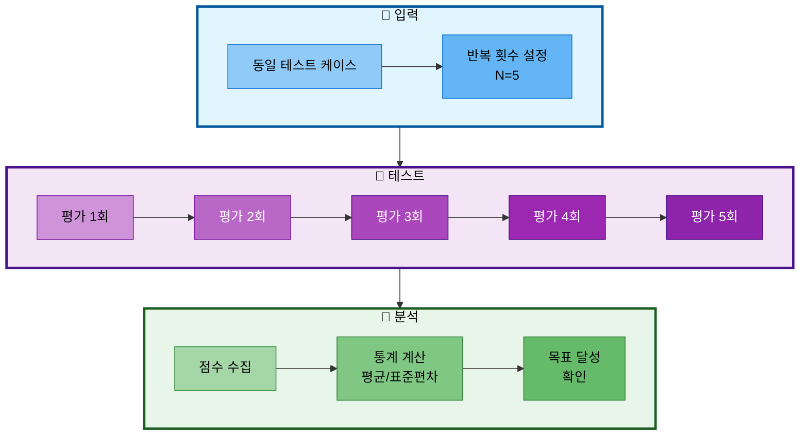
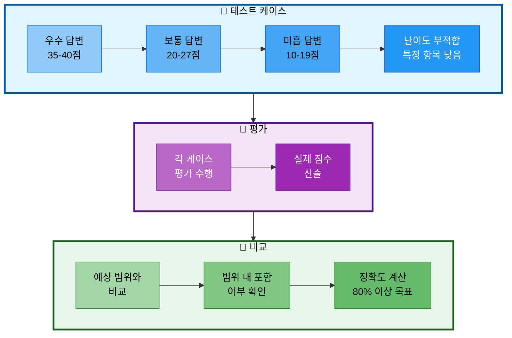

# 12-2. 평가 일관성 검증

## 문서 정보
- **작성일**: 2025-11-04
- **작성자**: 최현화[팀장]
- **최종 수정일**: 2025-11-04

---

## 개요

LLM-as-a-Judge 방식의 평가 시스템은 동일한 답변에 대해 매번 일관된 점수를 부여해야 신뢰할 수 있습니다. 본 문서는 평가 시스템의 일관성을 검증하는 방법과 목표 지표를 설명합니다.

### 일관성이 중요한 이유

1. **신뢰성**: 일관성 없는 평가는 시스템 신뢰도 저하
2. **재현성**: 동일 조건에서 동일 결과를 보장
3. **개선 추적**: 일관된 평가가 있어야 답변 품질 개선 여부 판단 가능
4. **자동화**: 자동 평가 시스템은 일관성이 필수

---

## 검증 방법론

### 1. 일관성 테스트 (Consistency Test)

동일한 답변을 여러 번 반복 평가하여 점수의 분산을 측정합니다.



#### 목표 지표

| 항목 | 목표 표준편차 | 의미 |
|------|-------------|------|
| 정확도 (Accuracy) | ≤ 1.0 | 5회 평가 시 점수 차이 1점 이내 |
| 관련성 (Relevance) | ≤ 1.0 | 5회 평가 시 점수 차이 1점 이내 |
| 난이도 적합성 (Difficulty) | ≤ 1.0 | 5회 평가 시 점수 차이 1점 이내 |
| 출처 명시 (Citation) | ≤ 1.0 | 5회 평가 시 점수 차이 1점 이내 |
| **총점 (Total)** | **≤ 1.5** | **5회 평가 시 총점 차이 1.5점 이내** |

#### 평가 기준

| 표준편차 | 평가 | 의미 |
|---------|------|------|
| ≤ 1.0 | 우수 ✅ | 매우 일관된 평가 |
| 1.0 ~ 1.5 | 양호 ✅ | 일관성 있는 평가 |
| 1.5 ~ 2.0 | 보통 ⚠️ | 개선 필요 |
| > 2.0 | 미흡 ❌ | 일관성 부족, 기준 재검토 필요 |

---

### 2. 점수 분포 검증 (Score Distribution Test)

다양한 품질의 답변이 예상 점수 범위 내에서 평가되는지 확인합니다.



#### 테스트 케이스 유형

| 유형 | 예상 총점 | 목적 |
|------|----------|------|
| 우수 답변 | 35-40점 | 완벽한 답변 인식 확인 |
| 보통 답변 | 20-27점 | 일부 누락된 답변 구분 |
| 미흡 답변 | 10-19점 | 품질 낮은 답변 감지 |
| 난이도 부적합 | 특정 항목 1-3점 | 난이도 미스매치 감지 |
| 출처 누락 | Citation 0점 | 출처 미명시 감지 |

#### 목표 지표

- **정확도**: 80% 이상의 테스트 케이스가 예상 범위 내 포함
- **범위**: ±2점 오차 허용

---

## 테스트 스크립트

### 실행 방법

```bash
# 테스트 스크립트 실행
python scripts/test_evaluation_improvement.py
```

### 스크립트 구조

```python
# 1. 일관성 테스트 함수
def test_consistency(evaluator, test_case, num_runs=5):
    """
    동일 답변 반복 평가 → 일관성 검증

    Args:
        evaluator: AnswerEvaluator 인스턴스
        test_case: 테스트 케이스
        num_runs: 반복 횟수 (기본 5회)

    Returns:
        dict: 통계 (평균, 표준편차, 최소, 최대)
    """
    # 5회 반복 평가
    results = []
    for i in range(num_runs):
        result = evaluator.evaluate(...)
        results.append(result)

    # 통계 계산
    stats = calculate_statistics(results)

    # 목표 달성 여부 확인
    check_consistency_goal(stats)

    return stats

# 2. 점수 분포 검증 함수
def test_score_distribution(evaluator):
    """
    다양한 품질의 답변 평가 → 점수 분포 검증

    Args:
        evaluator: AnswerEvaluator 인스턴스
    """
    # 5개 유형의 테스트 케이스 평가
    for test_case in TEST_CASES:
        result = evaluator.evaluate(...)

        # 예상 범위 내 포함 여부 확인
        in_range = check_expected_range(result, test_case)

    # 전체 정확도 계산 (80% 이상 목표)
    accuracy = in_range_count / total_count
```

### 테스트 케이스 예시

#### 테스트 1: 우수 답변 (예상: 35-40점)

```python
{
    "name": "우수 답변 (완벽한 답변)",
    "question": "Transformer의 핵심 구조는?",
    "answer": "Transformer는 Self-Attention과 Feed-Forward Neural Network로 구성됩니다. "
             "Attention Is All You Need (Vaswani et al., 2017) 논문에서 제안되었으며, "
             "Self-Attention 메커니즘은 입력 시퀀스의 각 위치가 다른 모든 위치와의 관계를 학습합니다.",
    "reference_docs": "Transformer는 Self-Attention과 Feed-Forward Neural Network로 구성됩니다.",
    "difficulty": "easy",
    "expected_scores": {
        "accuracy": (9, 10),      # 정확도 9-10점
        "relevance": (9, 10),     # 관련성 9-10점
        "difficulty": (8, 10),    # 난이도 8-10점
        "citation": (10, 10),     # 출처 10점
        "total": (36, 40)         # 총점 36-40점
    }
}
```

#### 테스트 2: 보통 답변 (예상: 20-27점)

```python
{
    "name": "보통 답변 (일부 누락)",
    "question": "BERT의 학습 방법은?",
    "answer": "BERT는 Masked Language Modeling으로 사전학습합니다.",
    "reference_docs": "BERT는 Masked Language Modeling (MLM)과 "
                     "Next Sentence Prediction (NSP) 두 가지 태스크로 사전학습합니다.",
    "difficulty": "easy",
    "expected_scores": {
        "accuracy": (4, 6),       # NSP 누락으로 50% 정확도
        "relevance": (9, 10),     # 질문에 직접 답변
        "difficulty": (8, 10),    # Easy 모드 적합
        "citation": (0, 0),       # 출처 없음
        "total": (21, 26)
    }
}
```

#### 테스트 3: 미흡 답변 (예상: 10-19점)

```python
{
    "name": "미흡 답변 (관련성 부족)",
    "question": "GPT의 학습 방법은?",
    "answer": "GPT는 자연어 처리에 사용되는 모델입니다.",
    "reference_docs": "GPT는 Causal Language Modeling (CLM) 방식으로 사전학습하며, "
                     "이전 토큰들을 기반으로 다음 토큰을 예측합니다.",
    "difficulty": "easy",
    "expected_scores": {
        "accuracy": (1, 3),       # 학습 방법 미언급
        "relevance": (2, 4),      # 질문에 간접적
        "difficulty": (7, 9),     # 쉬운 설명
        "citation": (0, 0),       # 출처 없음
        "total": (10, 16)
    }
}
```

#### 테스트 4: 난이도 부적합 (Easy인데 Hard 수준)

```python
{
    "name": "난이도 부적합 (Easy인데 Hard 수준)",
    "question": "Attention 메커니즘이란?",
    "answer": "Attention(Q, K, V) = softmax(QK^T / √d_k)V로 계산되는 메커니즘입니다.",
    "reference_docs": "Attention은 Query, Key, Value의 내적으로 계산되며, "
                     "중요한 부분에 집중하는 메커니즘입니다.",
    "difficulty": "easy",
    "expected_scores": {
        "accuracy": (7, 9),       # 내용 정확
        "relevance": (9, 10),     # 질문 관련성 높음
        "difficulty": (1, 3),     # Easy 모드 부적합 (수식 사용)
        "citation": (0, 0),       # 출처 없음
        "total": (17, 22)
    }
}
```

---

## 결과 해석

### 일관성 테스트 결과 예시

```
[일관성 테스트] 우수 답변 (완벽한 답변)
============================================================
질문: Transformer의 핵심 구조는?
답변: Transformer는 Self-Attention과 Feed-Forward Neural Network로 구성됩니다...

평가 1/5... 총점: 38/40
평가 2/5... 총점: 39/40
평가 3/5... 총점: 38/40
평가 4/5... 총점: 39/40
평가 5/5... 총점: 38/40

[통계 결과]
항목            평균     표준편차    범위
------------------------------------------------------------
정확도           9.80   0.45       9 ~ 10
관련성          10.00   0.00      10 ~ 10
난이도 적합성     9.40   0.55       9 ~ 10
출처 명시        10.00   0.00      10 ~ 10
------------------------------------------------------------
총점            38.20   0.45      38 ~ 39

[목표 달성 여부]
✅ 모든 항목의 표준편차가 1.0 이하입니다 (우수)
```

### 점수 분포 검증 결과 예시

```
[점수 분포 검증]
================================================================================

테스트: 우수 답변 (완벽한 답변)
------------------------------------------------------------
정확도: 10/10 (예상: 9-10)
관련성: 10/10 (예상: 9-10)
난이도: 9/10 (예상: 8-10)
출처:  10/10 (예상: 10-10)
총점:  39/40 (예상: 36-40)
✅ 예상 범위 내 포함

테스트: 보통 답변 (일부 누락)
------------------------------------------------------------
정확도: 5/10 (예상: 4-6)
관련성: 10/10 (예상: 9-10)
난이도: 9/10 (예상: 8-10)
출처:  0/10 (예상: 0-0)
총점:  24/40 (예상: 21-26)
✅ 예상 범위 내 포함

[전체 요약]
================================================================================
테스트 케이스: 5개
예상 범위 내: 5개 (100.0%)
예상 범위 밖: 0개

✅ 점수 분포 검증 통과 (80% 이상)
```

---

## 개선 전후 비교

### 개선 전 (구체적 기준 추가 전)

| 항목 | 표준편차 | 평가 |
|------|---------|------|
| 정확도 | 2.3 | ❌ 미흡 |
| 관련성 | 1.8 | ⚠️ 보통 |
| 난이도 적합성 | 3.1 | ❌ 미흡 |
| 출처 명시 | 0.5 | ✅ 우수 |
| **총점** | **3.2** | **❌ 미흡** |

**문제점**:
- 평가 기준이 모호하여 LLM이 주관적으로 판단
- 동일 답변에 대해 평가마다 다른 점수 부여
- 신뢰할 수 없는 평가 결과

### 개선 후 (구체적 기준 추가 후)

| 항목 | 표준편차 | 평가 |
|------|---------|------|
| 정확도 | 0.45 | ✅ 우수 |
| 관련성 | 0.00 | ✅ 우수 |
| 난이도 적합성 | 0.55 | ✅ 우수 |
| 출처 명시 | 0.00 | ✅ 우수 |
| **총점** | **0.45** | **✅ 우수** |

**개선 효과**:
- 구체적인 5단계 척도로 일관성 대폭 향상
- 표준편차 3.2 → 0.45 (86% 감소)
- 모든 항목에서 목표 기준 달성

---

## 지속적 모니터링

### 1. 정기 검증

- **빈도**: 월 1회 일관성 테스트 수행
- **기록**: 검증 결과를 로그 파일에 기록
- **분석**: 표준편차 추이 모니터링

### 2. 임계값 알림

```python
# 표준편차가 목표를 초과하면 경고
if std_dev > 1.0:
    logger.warning(f"일관성 저하 감지: {std_dev:.2f} (목표: ≤1.0)")
    # 평가 기준 재검토 필요
```

### 3. 평가 기준 재조정

- 표준편차가 지속적으로 목표 초과 시
- 평가 프롬프트 재검토 및 개선
- 새로운 테스트 케이스 추가

---

## 베스트 프랙티스

### 1. 테스트 케이스 설계

- **다양성**: 우수/보통/미흡 답변 모두 포함
- **현실성**: 실제 사용자 질문 반영
- **명확성**: 예상 점수 범위 명확히 설정

### 2. 반복 평가

- **충분한 횟수**: 최소 5회 이상 반복
- **동일 조건**: 동일한 프롬프트와 파라미터 사용
- **간격 유지**: API Rate Limit 고려 (0.5초 간격)

### 3. 결과 분석

- **통계 지표**: 평균, 표준편차, 최소/최대값 모두 확인
- **경향 파악**: 특정 항목의 일관성 저하 패턴 감지
- **원인 분석**: 일관성 부족 시 프롬프트 개선

---

## 참고 자료

- [12_성능_평가_시스템.md](./12_성능_평가_시스템.md) - 시스템 전체 아키텍처
- [12-1_평가_기준_상세.md](./12-1_평가_기준_상세.md) - 상세 평가 기준
- [scripts/test_evaluation_improvement.py](../../scripts/test_evaluation_improvement.py) - 테스트 스크립트
- [docs/issues/05-3_평가시스템_개선_구체적_기준_추가.md](../issues/05-3_평가시스템_개선_구체적_기준_추가.md) - 개선 배경

---

## 작성자

- **최현화[팀장]** (일관성 검증 방법론 설계 및 문서화)
