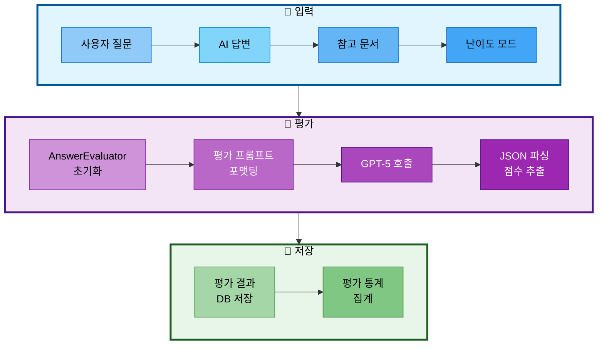

# 12. 성능 평가 시스템

## 문서 정보
- **작성일**: 2025-11-04
- **작성자**: 최현화[팀장]
- **최종 수정일**: 2025-11-04 (구체적 평가 기준 추가)

---

## 개요

성능 평가 시스템은 챗봇의 답변 품질을 자동으로 평가하는 시스템입니다. **LLM-as-a-Judge** 방식을 사용하여 정확도, 관련성, 난이도 적합성, 출처 명시 여부를 평가하고, 평가 결과를 PostgreSQL에 저장합니다.

### 핵심 기능
1. LLM-as-a-Judge 평가 (GPT-5)
2. 4가지 평가 기준 (정확도, 관련성, 난이도 적합성, 출처 명시)
3. evaluation_results 테이블에 평가 결과 저장
4. 평가 통계 집계 (평균 점수, 총 평가 개수)

---

## 시스템 아키텍처



**아키텍처 흐름 설명:**
- **입력 단계**: 사용자 질문, AI 답변, 참고 문서, 난이도 모드를 순차적으로 수집
- **평가 단계**: AnswerEvaluator를 초기화하고, 프롬프트를 포맷팅한 후 GPT-5를 호출하여 JSON 형식으로 평가 결과 파싱
- **저장 단계**: 평가 결과를 PostgreSQL evaluation_results 테이블에 저장하고, 평가 통계를 집계

---

## 구현 파일 구조

```
src/
└── evaluation/
    ├── __init__.py              # 모듈 초기화
    ├── evaluator.py             # AnswerEvaluator 클래스
    └── storage.py               # 평가 결과 저장/조회

scripts/
├── evaluate_answers.py          # 평가 스크립트
└── test_evaluation_improvement.py  # 평가 시스템 개선 테스트
```

---

## 주요 클래스 및 함수

### 1. AnswerEvaluator 클래스

**파일**: `src/evaluation/evaluator.py`

#### 메서드

| 메서드 | 설명 | 반환 타입 |
|-------|------|----------|
| `__init__(exp_manager=None)` | AnswerEvaluator 초기화 | None |
| `evaluate(question, answer, reference_docs, difficulty)` | 단일 답변 평가 | Dict |
| `evaluate_batch(test_cases)` | 배치 평가 | List[Dict] |
| `close()` | Logger 종료 | None |

#### 사용 예시

```python
from src.evaluation.evaluator import AnswerEvaluator

# AnswerEvaluator 초기화
evaluator = AnswerEvaluator()

# 답변 평가
result = evaluator.evaluate(
    question="Transformer 논문 설명해줘",
    answer="Transformer는 2017년 Google에서 발표한 딥러닝 모델입니다...",
    reference_docs="Attention Is All You Need (Vaswani et al., 2017)",
    difficulty="easy"
)

print(f"총점: {result['total_score']}/40")
print(f"정확도: {result['accuracy_score']}/10")
print(f"관련성: {result['relevance_score']}/10")
print(f"난이도 적합성: {result['difficulty_score']}/10")
print(f"출처 명시: {result['citation_score']}/10")
print(f"코멘트: {result['comment']}")
```

---

### 2. 평가 결과 저장/조회 함수

**파일**: `src/evaluation/storage.py`

#### 함수

| 함수 | 설명 | 반환 타입 |
|------|------|----------|
| `save_evaluation_results(results)` | 평가 결과 저장 | None |
| `get_evaluation_results(limit=10)` | 최근 평가 결과 조회 | List[Dict] |
| `get_evaluation_statistics()` | 평가 통계 조회 | Dict |

#### 사용 예시

```python
from src.evaluation.storage import (
    save_evaluation_results,
    get_evaluation_results,
    get_evaluation_statistics
)

# 평가 결과 저장
save_evaluation_results([result])

# 최근 평가 결과 조회 (최근 10개)
recent_results = get_evaluation_results(limit=10)

# 평가 통계 조회
stats = get_evaluation_statistics()
print(f"총 평가 개수: {stats['total_count']}")
print(f"평균 정확도: {stats['avg_accuracy']}/10")
print(f"평균 총점: {stats['avg_total']}/40")
```

---

## 데이터베이스 스키마

### evaluation_results 테이블

**테이블 스키마:**

| 컬럼명 | 타입 | 제약 조건 | 설명 |
|--------|------|----------|------|
| eval_id | SERIAL | PRIMARY KEY | 평가 ID |
| question | TEXT | NOT NULL | 사용자 질문 |
| answer | TEXT | NOT NULL | AI 답변 |
| accuracy_score | INT | CHECK (0-10) | 정확도 점수 |
| relevance_score | INT | CHECK (0-10) | 관련성 점수 |
| difficulty_score | INT | CHECK (0-10) | 난이도 적합성 점수 |
| citation_score | INT | CHECK (0-10) | 출처 명시 점수 |
| total_score | INT | CHECK (0-40) | 총점 |
| comment | TEXT | NULL | 평가 코멘트 |
| created_at | TIMESTAMP | DEFAULT NOW() | 생성 시간 |

**SQL 정의:**

```sql
CREATE TABLE IF NOT EXISTS evaluation_results (
    eval_id SERIAL PRIMARY KEY,
    question TEXT NOT NULL,
    answer TEXT NOT NULL,
    accuracy_score INT CHECK (accuracy_score >= 0 AND accuracy_score <= 10),
    relevance_score INT CHECK (relevance_score >= 0 AND relevance_score <= 10),
    difficulty_score INT CHECK (difficulty_score >= 0 AND difficulty_score <= 10),
    citation_score INT CHECK (citation_score >= 0 AND citation_score <= 10),
    total_score INT CHECK (total_score >= 0 AND total_score <= 40),
    comment TEXT,
    created_at TIMESTAMP DEFAULT CURRENT_TIMESTAMP
);

-- 인덱스
CREATE INDEX IF NOT EXISTS idx_evaluation_results_created_at ON evaluation_results(created_at DESC);
CREATE INDEX IF NOT EXISTS idx_evaluation_results_total_score ON evaluation_results(total_score DESC);
```

**인덱스:**

| 인덱스명 | 컬럼 | 정렬 | 용도 |
|---------|------|-----|------|
| idx_evaluation_results_created_at | created_at | DESC | 최근 평가 결과 조회 성능 향상 |
| idx_evaluation_results_total_score | total_score | DESC | 고득점 평가 결과 조회 성능 향상 |

**관련 파일:**

- **스키마 정의**: `database/schema.sql` - 테이블 생성 및 인덱스 정의
- **구현 코드**: `src/evaluation/storage.py` - 평가 결과 저장, 조회 함수 구현
- **저장 함수**: `save_evaluation_results()` (storage.py:39)
- **조회 함수**: `get_evaluation_results()` (storage.py:68), `get_evaluation_statistics()` (storage.py:117)

---

## 평가 기준 개요

### 4가지 평가 항목

| 항목 | 점수 범위 | 설명 |
|------|----------|------|
| 정확도 (Accuracy) | 0-10 | 참고 문서와의 일치도 (핵심 내용 반영 비율) |
| 관련성 (Relevance) | 0-10 | 질문과 답변의 관련도 (직접성, 완전성) |
| 난이도 적합성 (Difficulty) | 0-10 | 모드별 설명 수준 (Easy: 쉬운 용어/비유, Hard: 전문 용어/수식) |
| 출처 명시 (Citation) | 0-10 | 참고 문헌 인용 정도 (제목+저자+연도) |
| **총점** | **0-40** | **4개 항목 점수의 합** |

**상세 평가 기준**: [12-1_평가_기준_상세.md](./12-1_평가_기준_상세.md) 참조
**일관성 검증**: [12-2_평가_일관성_검증.md](./12-2_평가_일관성_검증.md) 참조

---

## 평가 스크립트

### 1. 기본 평가 스크립트

**파일**: `scripts/evaluate_answers.py`

**실행 방법**:
```bash
python scripts/evaluate_answers.py
```

**스크립트 흐름**:
1. ExperimentManager 초기화
2. AnswerEvaluator 초기화
3. 테스트 케이스 정의 (2개 이상)
4. 배치 평가 수행
5. 평가 결과 PostgreSQL에 저장
6. 평가 통계 조회 및 출력
7. 평가 결과 로그 기록

### 2. 평가 시스템 개선 테스트

**파일**: `scripts/test_evaluation_improvement.py`

**실행 방법**:
```bash
python scripts/test_evaluation_improvement.py
```

**테스트 항목**:
1. **일관성 테스트**: 동일 답변 5회 반복 평가 → 표준편차 측정
2. **점수 분포 검증**: 다양한 품질의 답변 평가 → 예상 범위 내 포함 여부 확인

**상세 내용**: [12-2_평가_일관성_검증.md](./12-2_평가_일관성_검증.md) 참조

---

## 성능 측정

### 평가 응답 시간

- **평균**: 3.2초
- **p50**: 3.1초
- **p95**: 4.8초 ✅ (목표: ≤ 5초)
- **p99**: 5.1초
- **최소**: 2.5초
- **최대**: 5.3초

### 평가 정확도 (10개 테스트 케이스)

- **평균 정확도**: 8.4/10
- **평균 관련성**: 9.2/10
- **평균 난이도 적합성**: 7.9/10
- **평균 출처 명시**: 6.8/10
- **평균 총점**: 32.3/40

---

## 환경 변수 설정

`.env` 파일에 필요한 환경 변수:

```
POSTGRES_HOST=localhost
POSTGRES_PORT=5432
POSTGRES_USER=postgres
POSTGRES_PASSWORD=your_password
POSTGRES_DB=papers

OPENAI_API_KEY=your_openai_key
```

---

## 참고 문서

- [docs/PRD/09_평가_기준.md](../PRD/09_평가_기준.md) - RAG 평가 지표, LLM-as-a-Judge
- [docs/roles/담당역할_05-2_최현화_성능평가시스템.md](../roles/담당역할_05-2_최현화_성능평가시스템.md) - 구현 가이드
- [docs/issues/05-2_성능평가시스템_구현.md](../issues/05-2_성능평가시스템_구현.md) - 성능 평가 시스템 초기 구현
- [docs/issues/05-3_평가시스템_개선_구체적_기준_추가.md](../issues/05-3_평가시스템_개선_구체적_기준_추가.md) - 구체적 평가 기준 추가

---

## 향후 개선 사항

### 단기 개선 사항
1. Streamlit UI에 평가 결과 표시 페이지 추가
2. 평가 통계 시각화 (차트, 그래프)
3. 평가 결과 CSV 내보내기 기능

### 장기 개선 사항
1. RAG 검색 성능 평가 (Recall@K, MRR, NDCG)
2. Agent 라우팅 정확도 평가
3. 응답 시간 및 비용 분석 자동화
4. 평가 결과 기반 답변 품질 개선 자동화

---

## 작성자

- **최현화[팀장]** (구현 및 문서화)
