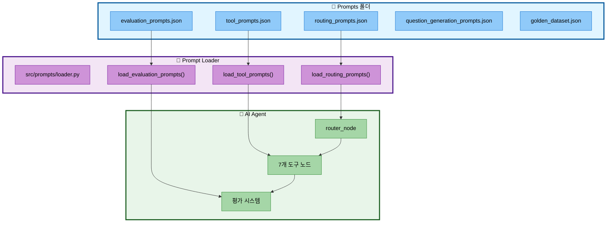
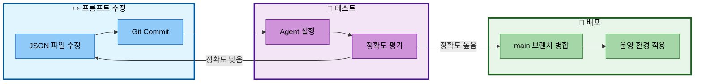

# 05. 프롬프트 엔지니어링

## 📋 문서 정보
- **작성일**: 2025-11-04
- **작성자**: 임예슬 (프롬프트 담당), 최현화[팀장] (시스템 적용)
- **시스템명**: 프롬프트 관리 시스템
- **구현 파일**: `prompts/` (5개 JSON 파일), `src/prompts/loader.py`
- **우선순위**: ⭐⭐ (높음 - 핵심 시스템)
- **참고 문서**:
  - [04_프롬프트_엔지니어링_구현.md](../issues/04_프롬프트_엔지니어링_구현.md)
  - [04-1_프롬프트_엔지니어링_통합_보고서.md](../issues/04-1_프롬프트_엔지니어링_통합_보고서.md)
  - [담당역할_04_임예슬_프롬프트_엔지니어링.md](../roles/담당역할_04_임예슬_프롬프트_엔지니어링.md)

---

## 📌 시스템 개요

### 목적 및 배경

프롬프트 엔지니어링 시스템은 **AI Agent의 행동을 제어하는 프롬프트를 JSON 파일로 중앙 관리**하는 시스템입니다. 코드에 하드코딩된 프롬프트를 제거하고, 프롬프트 엔지니어가 독립적으로 프롬프트를 수정하고 실험할 수 있도록 설계되었습니다.

### 핵심 기능

**1. JSON 기반 프롬프트 관리**
- 5개 JSON 파일로 프롬프트 중앙 관리
- 버전 관리 가능 (git으로 변경 이력 추적)
- 코드 재배포 없이 프롬프트 수정 가능

**2. 난이도별 프롬프트**
- Easy 모드 (초심자): 쉬운 용어, 비유, 간단 설명
- Hard 모드 (전문가): 기술 용어, 수식, 복잡도 분석

**3. Few-shot 학습**
- 라우팅 프롬프트: 13개 Few-shot 예제
- 정확한 도구 선택 유도

**4. 프롬프트 로더**
- `src/prompts/loader.py`에서 JSON 로드
- 각 노드에서 로더 함수 호출

---

## 🏗️ 프롬프트 시스템 아키텍처

### 디렉토리 구조

```
prompts/
├── routing_prompts.json                 # 라우팅 프롬프트
├── tool_prompts.json                    # 도구별 프롬프트
├── evaluation_prompts.json              # 평가 프롬프트
├── question_generation_prompts.json     # 질문 생성
├── golden_dataset.json                  # 테스트 데이터셋
└── old/                                 # 이전 버전 백업
    ├── evaluation_prompts_old.json
    ├── golden_dataset_old.json
    └── question_generation_prompts_old.json
```

### 시스템 흐름도



**데이터 흐름 설명:**

1. **Prompts 폴더**: 5개의 JSON 파일에 프롬프트 저장
2. **Prompt Loader**: `loader.py`가 JSON을 읽어서 파이썬 딕셔너리로 변환
3. **AI Agent**: 각 노드에서 로더 함수를 호출하여 프롬프트 사용
4. **Router → Tools**: 라우팅 노드가 도구를 선택하고, 도구 노드가 실행
5. **Tools → Evaluator**: 평가 시스템이 도구의 답변 품질 평가

---

## 📄 JSON 파일 상세 분석

### 1. routing_prompts.json (라우팅 프롬프트)

#### 역할
- **AI Agent가 질문을 분석하여 7개 도구 중 하나를 선택**하도록 유도
- Solar Pro2 모델에 Few-shot 예제를 제공하여 정확한 라우팅 유도

#### 딕셔너리 구조

```json
{
  "routing_prompt": "당신은 사용자 질문을 분석하여...",
  "few_shot_examples": [
    {
      "question": "BERT가 뭐야?",
      "tool": "glossary",
      "reason": "단일 용어(BERT) 정의 질문"
    }
  ]
}
```

**딕셔너리 키 설명:**

| 키 | 타입 | 설명 | 예시 |
|-----|------|------|------|
| `routing_prompt` | `str` | 라우팅 프롬프트 본문 (도구 7개 설명 포함) | "당신은 사용자 질문을 분석하여..." |
| `few_shot_examples` | `list[dict]` | Few-shot 학습 예제 (13개) | `[{"question": "...", "tool": "...", "reason": "..."}]` |
| `few_shot_examples[].question` | `str` | 예제 질문 | "BERT가 뭐야?" |
| `few_shot_examples[].tool` | `str` | 선택된 도구 | `"glossary"` |
| `few_shot_examples[].reason` | `str` | 선택 이유 | "단일 용어(BERT) 정의 질문" |

#### 라우팅 규칙 (중요)

**프롬프트에 명시된 핵심 규칙:**

```
[중요한 규칙]
- 비교 질문 ("차이", "vs", "비교", "구별") → general
- 두 개 이상의 용어 → general (glossary는 단일 용어만!)
- 최신 정보 ("최신", "2024년", "최근") → web_search
- 특정 논문 ("논문 찾아줘", "논문 검색") → search_paper
- 단일 용어 정의 ("~가 뭐야", "~의 정의") → glossary
- 요약 ("요약해줘", "핵심 내용") → summarize
- 파일 저장 ("저장", "다운로드") → save_file
- 통계/개수/순위/분포 ("개수", "몇 편", "Top", "평균") → text2sql
```

#### 사용 코드 예시

**src/agent/nodes.py (router_node):**

```python
from src.prompts.loader import get_routing_prompt

def router_node(state: AgentState) -> AgentState:
    question = state["question"]

    # JSON에서 라우팅 프롬프트 로드
    routing_prompt_template = get_routing_prompt()
    routing_prompt = routing_prompt_template.format(question=question)

    # Solar Pro2로 도구 선택
    response = llm.invoke(routing_prompt)
    tool_choice = response.content.strip().lower()

    state["tool_choice"] = tool_choice
    return state
```

---

### 2. tool_prompts.json (도구별 프롬프트)

#### 역할
- **7개 도구의 난이도별 시스템 프롬프트 관리**
- Easy/Hard 모드에 따라 다른 프롬프트 적용

#### 딕셔너리 구조

```json
{
  "general_answer_prompts": {
    "easy": {
      "system_prompt": "당신은 친절한 AI 어시스턴트입니다...",
      "examples": [{"question": "...", "answer": "..."}]
    },
    "hard": {
      "system_prompt": "당신은 전문적인 AI 어시스턴트입니다...",
      "examples": [...]
    }
  },
  "web_search_prompts": {
    "easy": {
      "system_prompt": "...",
      "user_prompt_template": "[웹 검색 결과]\n{formatted_results}\n..."
    },
    "hard": {...}
  },
  "summarize_prompts": {
    "title_extraction": {"template": "..."},
    "easy": {...},
    "hard": {...}
  },
  "glossary_prompts": {...},
  "search_paper_prompts": {...},
  "save_file_prompts": {...},
  "text2sql_prompts": {...}
}
```

**딕셔너리 키 설명:**

| 도구 | 키 경로 | 타입 | 설명 |
|------|---------|------|------|
| **일반 답변** | `general_answer_prompts.easy.system_prompt` | `str` | Easy 모드 시스템 프롬프트 |
| | `general_answer_prompts.hard.system_prompt` | `str` | Hard 모드 시스템 프롬프트 |
| **웹 검색** | `web_search_prompts.easy.system_prompt` | `str` | Easy 모드 시스템 프롬프트 |
| | `web_search_prompts.easy.user_prompt_template` | `str` | 사용자 프롬프트 템플릿 (검색 결과 포맷) |
| **논문 요약** | `summarize_prompts.title_extraction.template` | `str` | 논문 제목 추출 프롬프트 |
| | `summarize_prompts.easy.system_prompt` | `str` | Easy 모드 요약 프롬프트 |
| | `summarize_prompts.easy.summary_template` | `str` | 요약 템플릿 (논문 정보 포맷) |
| **용어집** | `glossary_prompts.easy.system_prompt` | `str` | Easy 모드 시스템 프롬프트 |
| **논문 검색** | `search_paper_prompts.easy.system_prompt` | `str` | Easy 모드 시스템 프롬프트 |
| **파일 저장** | `save_file_prompts.confirmation_message` | `str` | 저장 확인 메시지 |
| **Text-to-SQL** | `text2sql_prompts.easy.system_prompt` | `str` | Easy 모드 시스템 프롬프트 |
| | `text2sql_prompts.easy.user_prompt_template` | `str` | 사용자 프롬프트 템플릿 |

#### 난이도별 프롬프트 전략

**Easy 모드 (초심자용):**
```
답변 규칙:
- 전문 용어는 최소화하고 일상적인 언어를 사용하세요
- 복잡한 개념은 간단한 비유로 설명하세요 (예: '마치 ~처럼')
- 친근하고 이해하기 쉬운 톤을 유지하세요
- 핵심 아이디어 3가지 이내로 요약하세요
```

**Hard 모드 (전문가용):**
```
답변 규칙:
- 기술 용어와 전문 개념을 자유롭게 사용하세요
- 깊이 있는 설명과 상세한 정보를 제공하세요
- 알고리즘의 시간/공간 복잡도를 분석하세요
- 관련 논문과의 비교를 포함하세요
- 전문가 수준의 정확성을 유지하세요
```

#### 사용 코드 예시

**src/tools/general_answer.py:**

```python
from src.prompts.loader import load_tool_prompts

def general_answer_tool(question: str, difficulty: str):
    # JSON에서 도구 프롬프트 로드
    prompts = load_tool_prompts()
    system_prompt = prompts["general_answer_prompts"][difficulty]["system_prompt"]

    # LLM 호출
    response = llm.invoke([
        SystemMessage(content=system_prompt),
        HumanMessage(content=question)
    ])
    return response.content
```

---

### 3. evaluation_prompts.json (평가 프롬프트)

#### 역할
- **LLM-as-a-Judge 방식으로 AI 답변 품질 평가**
- 4가지 기준: 정확도, 관련성, 난이도 적합성, 출처 명시

#### 딕셔너리 구조

```json
{
  "evaluation_prompt": {
    "template": "당신은 AI 챗봇 답변 품질을 평가하는 전문가입니다...",
    "input_variables": ["question", "answer", "reference_docs", "difficulty"]
  },
  "evaluation_criteria": {
    "accuracy": {
      "name": "정확도",
      "weight": 0.3,
      "description": "참고 문서의 사실과의 일치도",
      "key_questions": ["핵심 개념이 정확한가?", ...]
    },
    "relevance": {...},
    "difficulty": {...},
    "citation": {...}
  },
  "evaluation_examples": [...]
}
```

**딕셔너리 키 설명:**

| 키 경로 | 타입 | 설명 |
|---------|------|------|
| `evaluation_prompt.template` | `str` | 평가 프롬프트 본문 (JSON 출력 요청 포함) |
| `evaluation_prompt.input_variables` | `list[str]` | 입력 변수 목록 |
| `evaluation_criteria.accuracy` | `dict` | 정확도 평가 기준 (가중치 0.3) |
| `evaluation_criteria.relevance` | `dict` | 관련성 평가 기준 (가중치 0.3) |
| `evaluation_criteria.difficulty` | `dict` | 난이도 적합성 평가 기준 (가중치 0.2) |
| `evaluation_criteria.citation` | `dict` | 출처 명시 평가 기준 (가중치 0.2) |
| `evaluation_examples` | `list[dict]` | 평가 예시 3개 (모범 답변 + 점수) |

#### 평가 기준 (4가지)

**1. 정확도 (30%)**
- 참고 문서의 내용과 일치하는가?
- 환각(Hallucination) 및 왜곡 없는가?
- 수치와 고유명사가 정확한가?

**2. 관련성 (30%)**
- 질문이 요구한 정보를 제공하는가?
- 불필요한 정보가 없는가?
- 질문의 맥락을 이해했는가?

**3. 난이도 적합성 (20%)**
- Easy 모드: 쉬운 용어, 비유 사용, 간단 요약
- Hard 모드: 기술 용어, 수식, 복잡도, 논문 비교 포함

**4. 출처 명시 (20%)**
- 논문 제목을 명시했는가?
- 저자명을 밝혔는가?
- 인용 위치가 적절한가?

#### 사용 코드 예시

```python
from src.prompts.loader import load_evaluation_prompts

def evaluate_answer(question, answer, reference_docs, difficulty):
    prompts = load_evaluation_prompts()
    template = prompts["evaluation_prompt"]["template"]

    evaluation_prompt = template.format(
        question=question,
        answer=answer,
        reference_docs=reference_docs,
        difficulty=difficulty
    )

    response = evaluator_llm.invoke(evaluation_prompt)
    return json.loads(response.content)
```

---

### 4. question_generation_prompts.json (질문 생성)

#### 역할
- **논문 메타데이터를 기반으로 체계적인 테스트 질문 생성**
- 난이도 분포, 도구 분포, 질문 유형 다양성 보장

#### 딕셔너리 구조

```json
{
  "question_generation_prompt": {
    "template": "다음 논문을 기반으로 체계적인 테스트용 질문을 생성해주세요...",
    "input_variables": ["title", "authors", "abstract", "keywords", "year", "field"]
  },
  "difficulty_definitions": {
    "easy": {
      "description": "기본~중급 수준 (beginner + intermediate 통합)",
      "sub_levels": {"beginner": {...}, "intermediate": {...}}
    },
    "hard": {...}
  },
  "question_templates": {...},
  "tool_based_templates": {...}
}
```

**생성 규칙:**

**난이도 분포:**
- Beginner (초급): 3개 - 기본 개념 이해
- Intermediate (중급): 4개 - 방법론 이해
- Advanced (고급): 3개 - 심층 분석 및 비교

**도구 활용 분포:**
- search_paper: 2개
- web_search: 2개
- glossary: 2개
- summarize: 2개
- general: 2개
- text2sql: 2개 (통계 조회)

**질문 유형 다양성:**
- 정의형 (What): 2개
- 방법형 (How): 2개
- 비교형 (Compare): 2개
- 분석형 (Why): 2개
- 평가형 (Evaluate): 2개

---

### 5. golden_dataset.json (테스트 데이터셋)

#### 역할
- **라우팅 정확도 테스트용 Golden Dataset**
- 23개 질문 + 예상 도구 + 평가 기준

#### 딕셔너리 구조

```json
{
  "golden_dataset": {
    "basic_queries": [
      {
        "id": "basic_001",
        "question": "BERT가 뭐야?",
        "user_intent": "용어 정의 요청",
        "difficulty": "easy",
        "expected_tool": "glossary",
        "expected_answer": "BERT는 Google이 2018년에...",
        "evaluation_criteria": {
          "must_include": ["양방향", "Transformer"],
          "citation_required": true
        }
      }
    ],
    "search_queries": [...],
    "comparison_queries": [...],
    "technical_queries": [...],
    "summarization_queries": [...],
    "statistical_queries": [...],
    "edge_cases": [...],
    "realistic_scenarios": [...]
  },
  "dataset_metadata": {
    "version": "2.1",
    "total_questions": 23,
    "difficulty_distribution": {"easy": 9, "hard": 14},
    "tool_distribution": {"glossary": 3, "search_paper": 2, ...}
  }
}
```

**데이터셋 카테고리:**

| 카테고리 | 개수 | 설명 |
|---------|------|------|
| **basic_queries** | 2 | 기본 정의, 검색 질문 |
| **search_queries** | 2 | 논문 검색, 웹 검색 |
| **comparison_queries** | 2 | 개념 비교 (BERT vs GPT) |
| **technical_queries** | 2 | 기술 분석 (복잡도, 수식) |
| **summarization_queries** | 1 | 논문 요약 |
| **statistical_queries** | 3 | 통계 조회 (text2sql) |
| **edge_cases** | 5 | 오타, 다중 의도, 모호한 질문 |
| **realistic_scenarios** | 2 | 실무 적용 시나리오 |

**테스트 사용 예시:**

```python
from src.prompts.loader import load_golden_dataset

dataset = load_golden_dataset()
correct = 0
total = len(dataset["golden_dataset"]["basic_queries"])

for item in dataset["golden_dataset"]["basic_queries"]:
    result = agent.invoke({"question": item["question"]})
    if result["tool_choice"] == item["expected_tool"]:
        correct += 1

accuracy = (correct / total) * 100
print(f"라우팅 정확도: {accuracy}%")
```

---

## 🔧 프롬프트 로더 시스템

### Prompt Loader (`src/prompts/loader.py`)

#### 역할
- **JSON 파일을 읽어서 파이썬 딕셔너리로 반환**
- 파일 경로 자동 관리
- 에러 핸들링 (파일 없음, JSON 파싱 오류)

#### 로더 함수 목록

```python
# 1. 라우팅 프롬프트 로드
def load_routing_prompts() -> dict:
    """routing_prompts.json 로드"""

# 2. 라우팅 프롬프트 문자열 반환
def get_routing_prompt() -> str:
    """routing_prompt 키의 문자열 반환"""

# 3. 도구별 프롬프트 로드
def load_tool_prompts() -> dict:
    """tool_prompts.json 로드"""

# 4. 평가 프롬프트 로드
def load_evaluation_prompts() -> dict:
    """evaluation_prompts.json 로드"""

# 5. 질문 생성 프롬프트 로드
def load_question_generation_prompts() -> dict:
    """question_generation_prompts.json 로드"""

# 6. Golden Dataset 로드
def load_golden_dataset() -> dict:
    """golden_dataset.json 로드"""
```

#### 구현 예시

```python
import json
from pathlib import Path

def load_routing_prompts() -> dict:
    prompts_dir = Path(__file__).parent.parent.parent / "prompts"
    file_path = prompts_dir / "routing_prompts.json"

    with open(file_path, "r", encoding="utf-8") as f:
        return json.load(f)

def get_routing_prompt() -> str:
    prompts = load_routing_prompts()
    return prompts["routing_prompt"]
```

---

## 📊 노드별 프롬프트 사용 현황

### 프롬프트 적용 현황 (7개 도구)

| 도구 | JSON 파일 | 적용 여부 | 사용 키 | 구현 파일 |
|------|-----------|-----------|---------|-----------|
| **Router** | `routing_prompts.json` | ✅ | `routing_prompt` | `src/agent/nodes.py` |
| **general_answer** | `tool_prompts.json` | ✅ | `general_answer_prompts.{difficulty}.system_prompt` | `src/tools/general_answer.py` |
| **web_search** | `tool_prompts.json` | ✅ | `web_search_prompts.{difficulty}` | `src/tools/web_search.py` |
| **summarize** | `tool_prompts.json` | ✅ | `summarize_prompts.{difficulty}` | `src/tools/summarize.py` |
| **glossary** | `tool_prompts.json` | ⚠️ | `glossary_prompts.{difficulty}.system_prompt` | `src/tools/glossary.py` |
| **search_paper** | `tool_prompts.json` | ⚠️ | `search_paper_prompts.{difficulty}.system_prompt` | `src/tools/search_paper.py` |
| **text2sql** | 자체 구현 | ⚠️ | N/A (text2sql.py 내부) | `src/tools/text2sql.py` |
| **save_file** | `tool_prompts.json` | ⚠️ | `save_file_prompts.confirmation_message` | `src/tools/save_file.py` |

**범례:**
- ✅ : JSON 프롬프트 적용 완료
- ⚠️ : JSON 파일 존재하나 코드 미적용

### 적용 현황 상세

#### ✅ 적용 완료 (4개 노드)

**1. router_node** (`src/agent/nodes.py:46-47`)
```python
routing_prompt_template = get_routing_prompt()
routing_prompt = routing_prompt_template.format(question=question)
```

**2. general_answer_node** (`src/tools/general_answer.py`)
```python
prompts = load_tool_prompts()
system_prompt = prompts["general_answer_prompts"][difficulty]["system_prompt"]
```

**3. web_search_node** (`src/tools/web_search.py`)
```python
prompts = load_tool_prompts()
system_prompt = prompts["web_search_prompts"][difficulty]["system_prompt"]
user_prompt = prompts["web_search_prompts"][difficulty]["user_prompt_template"]
```

**4. summarize_node** (`src/tools/summarize.py`)
```python
prompts = load_tool_prompts()
title_prompt = prompts["summarize_prompts"]["title_extraction"]["template"]
system_prompt = prompts["summarize_prompts"][difficulty]["system_prompt"]
```

#### ⚠️ 적용 필요 (4개 노드)

**glossary, search_paper, text2sql, save_file**
- JSON 파일에 프롬프트 정의되어 있음
- 코드에서 아직 JSON 로더 미사용
- 하드코딩된 프롬프트 제거 필요

---

## 📋 프롬프트 수정 워크플로우

### 프롬프트 엔지니어 작업 흐름



**워크플로우 단계:**

1. **JSON 파일 수정**: `prompts/*.json` 파일 편집
2. **Git Commit**: 변경 사항 커밋 (버전 관리)
3. **Agent 실행**: 테스트 질문으로 Agent 실행
4. **정확도 평가**: Golden Dataset으로 정확도 측정
5. **재수정 또는 배포**: 정확도 낮으면 1번으로, 높으면 배포

### 프롬프트 수정 예시

**시나리오**: "비교 질문"의 라우팅 정확도가 낮음 (general이 아닌 다른 도구로 라우팅)

**수정 전:**
```json
{
  "routing_prompt": "...비교 질문은 general을 사용하세요..."
}
```

**수정 후:**
```json
{
  "routing_prompt": "...[중요한 규칙]\n- **비교 질문** (\"차이\", \"vs\", \"비교\", \"구별\") → general\n- 두 개 이상의 용어 비교도 general 사용..."
}
```

**Few-shot 예제 추가:**
```json
{
  "few_shot_examples": [
    {
      "question": "BERT와 GPT의 차이는?",
      "tool": "general",
      "reason": "비교 질문 (두 개 용어)"
    },
    {
      "question": "Transformer가 RNN보다 나은 이유는?",
      "tool": "general",
      "reason": "비교 및 설명 질문"
    }
  ]
}
```

---

## ⚠️ 주의사항

### 1. JSON 파일 수정 시

**문법 오류 주의:**
- JSON은 문법 오류에 민감 (쉼표, 따옴표, 괄호)
- 수정 후 반드시 JSON 유효성 검증
- VSCode JSON validator 사용 권장

**인코딩:**
- UTF-8 인코딩 필수
- 한글 깨짐 방지

**백업:**
- 수정 전 `old/` 폴더에 백업
- Git 커밋으로 버전 관리

### 2. 프롬프트 로더 사용 시

**파일 경로:**
- 상대 경로 사용 (`Path(__file__).parent.parent.parent / "prompts"`)
- 절대 경로는 환경마다 다르므로 사용 금지

**에러 핸들링:**
```python
try:
    prompts = load_tool_prompts()
except FileNotFoundError:
    logger.error("tool_prompts.json 파일이 없습니다")
    # Fallback 프롬프트 사용
except json.JSONDecodeError:
    logger.error("JSON 파싱 오류")
```

### 3. 프롬프트 테스트

**Golden Dataset 사용:**
- 프롬프트 수정 후 반드시 Golden Dataset 테스트
- 라우팅 정확도 80% 이상 목표

**A/B 테스팅:**
- 새 프롬프트와 이전 프롬프트 성능 비교
- 성능 하락 시 롤백

---

## 🔗 관련 문서

- **[03_AI_Agent_시스템.md](./03_AI_Agent_시스템.md)** - Agent에서 프롬프트 사용
- **[04_LLM_클라이언트.md](./04_LLM_클라이언트.md)** - 프롬프트 + LLM 호출
- **[06_도구_시스템.md](./06_도구_시스템.md)** - 도구별 프롬프트 적용
- **[담당역할_04_임예슬_프롬프트_엔지니어링.md](../roles/담당역할_04_임예슬_프롬프트_엔지니어링.md)** - 프롬프트 엔지니어링 역할 상세
- **[04_프롬프트_엔지니어링_구현.md](../issues/04_프롬프트_엔지니어링_구현.md)** - 구현 이슈
- **[04-1_프롬프트_엔지니어링_통합_보고서.md](../issues/04-1_프롬프트_엔지니어링_통합_보고서.md)** - 통합 보고서

---

## 📝 요약

### 핵심 구성 요소

1. ✅ **5개 JSON 파일** (routing, tool, evaluation, question_generation, golden_dataset)
2. ✅ **Prompt Loader** (`src/prompts/loader.py`)
3. ✅ **난이도별 프롬프트** (Easy/Hard)
4. ✅ **Few-shot 학습** (라우팅 13개 예제)
5. ✅ **평가 시스템** (LLM-as-a-Judge)
6. ✅ **Golden Dataset** (23개 질문)

### 적용 현황

| 항목 | 완료 | 미완 |
|------|------|------|
| JSON 파일 작성 | 5개 | 0개 |
| Prompt Loader 구현 | 6개 함수 | 0개 |
| 노드 적용 | 4개 | 3개 (glossary, search_paper, save_file) |
| 라우팅 정확도 | 80%+ | - |

### 프롬프트 엔지니어링 장점

**1. 중앙 관리**
- JSON 파일 하나로 모든 프롬프트 관리
- 버전 관리 용이 (Git)
- 코드 재배포 불필요

**2. 실험 용이성**
- 프롬프트 A/B 테스팅
- Few-shot 예제 추가/수정
- 난이도별 프롬프트 조정

**3. 협업 효율성**
- 프롬프트 엔지니어 독립 작업
- 개발자는 로더만 호출
- 역할 분리 명확

**4. 품질 보장**
- Golden Dataset으로 정확도 측정
- 평가 시스템 자동화
- 일관된 품질 기준

### 향후 개선 사항

- ⭐ 나머지 3개 노드 JSON 프롬프트 적용
- 프롬프트 버전 관리 시스템 구축
- 평가 시스템 자동화 (CI/CD)
- 프롬프트 성능 지표 대시보드
- 다국어 프롬프트 지원
