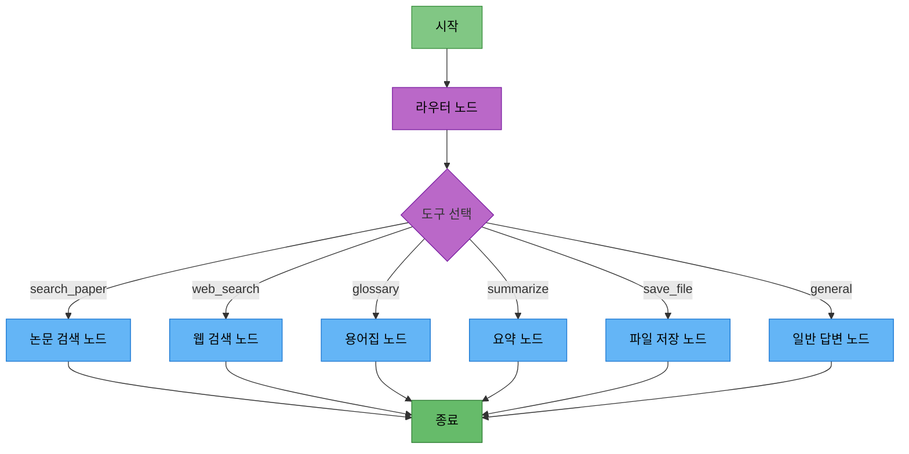

# 담당역할: LangGraph 노드 및 스트리밍 구현

## 문서 정보
- **작성자**: 최현화[팀장]

## 담당자 정보
- **담당자**: 최현화
- **역할**: LangGraph 노드 구현 및 스트리밍 기능
- **참여 기간**: 전체 기간
- **핵심 역할**: Agent 노드 개발, 스트리밍 응답, 도구 노드 통합

---

## 담당 모듈 및 도구

### 1. LangGraph 노드 구현 (`src/agent/nodes.py`)
- 라우터 노드 (도구 선택)
- 6개 도구 노드 (일반 답변, 논문 검색, 웹 검색, 용어집, 요약, 파일 저장)
- 각 노드의 프롬프트 및 LLM 연동

### 2. 스트리밍 응답 (`ui/app_streaming.py`)
- StreamlitCallbackHandler 구현
- astream_events() 비동기 스트리밍
- 실시간 응답 업데이트

### 3. 파일 저장 도구 (`src/tools/file_save.py`)
- Langchain @tool 데코레이터
- 텍스트/Markdown 파일 저장
- Streamlit 다운로드 버튼 연동

---

## 1. 스트리밍 응답 구현

### 기능 설명
LangGraph Agent의 응답을 실시간으로 스트리밍하여 사용자에게 표시

### 구현 방법

**파일 경로**: `ui/app_streaming.py`

#### 1단계: StreamlitCallbackHandler 생성

**필수 임포트:**

| 모듈 | 용도 |
|------|------|
| `langchain.callbacks.streamlit.StreamlitCallbackHandler` | Streamlit 콜백 핸들러 |
| `streamlit` | Streamlit 라이브러리 |

**초기화 단계:**

| 순서 | 작업 | 코드 |
|------|------|------|
| 1 | 컨테이너 생성 | `callback_container = st.container()` |
| 2 | 콜백 핸들러 초기화 | `callback_handler = StreamlitCallbackHandler(callback_container)` |

#### 2단계: 응답 표시용 placeholder 생성

| 순서 | 작업 | 코드 |
|------|------|------|
| 1 | 빈 컨테이너 생성 | `response_placeholder = st.empty()` |
| 2 | 전체 응답 변수 초기화 | `full_response = ""` |

#### 3단계: Agent 스트리밍 실행

**스트리밍 처리 흐름:**

| 단계 | 작업 | 설명 |
|------|------|------|
| 1 | Agent 그래프 임포트 | `from src.agent.graph import create_agent_graph` |
| 2 | Agent 초기화 | `agent = create_agent_graph()` |
| 3 | 비동기 스트리밍 시작 | `async for event in agent.astream_events(...)` |
| 4 | 입력 데이터 전달 | `{"question": question, "difficulty": difficulty}` |
| 5 | 이벤트 타입 확인 | `if event["event"] == "on_chat_model_stream":` |
| 6 | 청크 데이터 추출 | `chunk = event["data"]["chunk"].content` |
| 7 | 전체 응답 누적 | `full_response += chunk` |
| 8 | 실시간 업데이트 표시 | `response_placeholder.markdown(full_response + "▌")` (커서 효과) |
| 9 | 최종 응답 표시 | `response_placeholder.markdown(full_response)` |

#### 4단계: 전체 코드 예제

**파일**: `ui/app_streaming.py`

**필수 임포트:**

| 모듈 | 용도 |
|------|------|
| `streamlit` | Streamlit UI |
| `asyncio` | 비동기 실행 |
| `create_agent_graph` | Agent 그래프 생성 |
| `StreamlitCallbackHandler` | 스트리밍 콜백 |

**초기화 및 설정:**

| 순서 | 작업 | 코드/설명 |
|------|------|-----------|
| 1 | 제목 설정 | `st.title("논문 리뷰 챗봇 (스트리밍)")` |
| 2 | 난이도 선택 위젯 | `st.sidebar.radio("난이도", ["easy", "hard"])` |
| 3 | 채팅 히스토리 초기화 | `st.session_state.messages = []` (없으면 생성) |
| 4 | 채팅 히스토리 표시 | `for` 루프로 기존 메시지 렌더링 |

**사용자 입력 처리:**

| 순서 | 작업 | 설명 |
|------|------|------|
| 1 | 입력 대기 | `st.chat_input("질문을 입력하세요")` |
| 2 | 사용자 메시지 저장 | `append({"role": "user", "content": prompt})` |
| 3 | 사용자 메시지 표시 | `st.chat_message("user")` 컨테이너에 렌더링 |

**AI 응답 스트리밍:**

| 순서 | 작업 | 설명 |
|------|------|------|
| 1 | Assistant 컨테이너 생성 | `with st.chat_message("assistant"):` |
| 2 | Placeholder 생성 | `response_placeholder = st.empty()` |
| 3 | 응답 변수 초기화 | `full_response = ""` |
| 4 | Agent 초기화 | `agent = create_agent_graph()` |
| 5 | 비동기 함수 정의 | `async def stream_response():` |
| 6 | 이벤트 스트리밍 시작 | `async for event in agent.astream_events(...)` |
| 7 | 청크 처리 | 이벤트 타입이 `on_chat_model_stream`이면 청크 누적 |
| 8 | 실시간 업데이트 | `response_placeholder.markdown(full_response + "▌")` |
| 9 | 최종 응답 표시 | `response_placeholder.markdown(full_response)` |
| 10 | 비동기 실행 | `asyncio.run(stream_response())` |
| 11 | 응답 저장 | `append({"role": "assistant", "content": full_response})` |

### 참고 자료
- [StreamlitCallbackHandler](https://python.langchain.com/docs/integrations/callbacks/streamlit)
- [LangGraph Streaming](https://langchain-ai.github.io/langgraph/how-tos/stream-values/)

---

## 2. LangGraph 노드 구현

### 2.1 웹 검색 노드

**파일 경로**: `src/agent/nodes.py` (또는 `src/tools/web_search.py`의 `web_search_node`)

**구현 방법**:
1. `web_search_node` 함수 정의
   - 인자: state (AgentState)
2. state에서 질문 추출
3. 웹 검색 도구 호출
   - Tavily API로 검색 수행
4. 검색 결과를 state["tool_result"]에 저장
5. 프롬프트 구성
   - 검색 결과와 사용자 질문 포함
6. LLM 호출하여 최종 답변 생성
   - SystemMessage: "당신은 최신 AI/ML 정보를 제공하는 전문가입니다."
   - HumanMessage: 프롬프트
7. 최종 답변을 state["final_answer"]에 저장 후 반환

**함수: `web_search_node_example(state: AgentState, exp_manager=None)`**

**파라미터:**

| 파라미터 | 타입 | 설명 |
|----------|------|------|
| `state` | `AgentState` | 에이전트 상태 객체 |
| `exp_manager` | `Optional` | 실험 관리자 (선택) |

**처리 흐름:**

| 순서 | 작업 | 설명 |
|------|------|------|
| 1 | 질문 추출 | `question = state["question"]` |
| 2 | Tavily Search 도구 초기화 | `TavilySearchResults(max_results=5, api_key=...)` |
| 3 | 검색 실행 | `search_tool.invoke({"query": question})` |
| 4 | 검색 결과 포맷팅 | 각 결과를 "[결과 N]\n제목:...\n내용:...\nURL:..." 형식으로 변환 |
| 5 | 난이도 확인 | `state.get("difficulty", "easy")` |
| 6 | LLM 클라이언트 생성 | `LLMClient.from_difficulty(difficulty)` |
| 7 | 메시지 구성 | SystemMessage + HumanMessage (검색 결과 + 질문 포함) |
| 8 | LLM 호출 | `llm_client.llm.invoke(messages)` |
| 9 | 상태 업데이트 | `state["tool_result"]`, `state["final_answer"]` 설정 |
| 10 | 상태 반환 | `return state` |

**SystemMessage**: "당신은 최신 AI/ML 정보를 제공하는 전문가입니다."

**HumanMessage 구조**:
- [검색 결과]: formatted_results
- [질문]: question
- 요청: "위 검색 결과를 바탕으로 질문에 답변해주세요."

### 2.2 파일 저장 노드

**파일 경로**: `src/agent/nodes.py` (또는 `src/tools/save_file.py`의 `save_file_node`)

**구현 방법**:
1. `save_file_node` 함수 정의
   - 인자: state (AgentState)
2. state에서 이전 답변(final_answer) 추출
3. 답변이 있으면 파일 저장 도구 호출
   - save_to_file.invoke()로 저장 수행
   - 저장 결과를 state["final_answer"]에 저장
4. 답변이 없으면 "저장할 내용이 없습니다." 메시지 반환
5. state 반환

**함수: `save_file_node_example(state: AgentState, exp_manager=None)`**

**파라미터:**

| 파라미터 | 타입 | 설명 |
|----------|------|------|
| `state` | `AgentState` | 에이전트 상태 객체 |
| `exp_manager` | `Optional` | 실험 관리자 (선택) |

**처리 흐름:**

| 순서 | 작업 | 설명 |
|------|------|------|
| 1 | 이전 답변 추출 | `final_answer = state.get("final_answer", "")` |
| 2 | 답변 존재 확인 | `if not final_answer:` 검사 |
| 3 | 답변 없으면 메시지 반환 | `state["final_answer"] = "저장할 내용이 없습니다."` |
| 4 | 타임스탬프 생성 | `datetime.now().strftime("%Y%m%d_%H%M%S")` |
| 5 | 파일명 생성 | `f"paper_review_{timestamp}.txt"` |
| 6 | 파일 저장 도구 호출 | `save_to_file.invoke({"content": ..., "filename": ...})` |
| 7 | 저장 결과로 상태 업데이트 | `state["final_answer"] = result` |
| 8 | 상태 반환 | `return state` |

**파일명 형식**: `paper_review_YYYYMMDD_HHMMSS.txt`

### 2.3 기타 노드 (일반 답변, 논문 검색, 용어집, 요약)

**이미 구현된 노드:**
- `general_answer_node` - `src/tools/general_answer.py`
- `search_paper_node` - `src/tools/search_paper.py`
- `glossary_node` - `src/tools/glossary.py`
- `summarize_node` - `src/tools/summarize.py`

**노드 구현 패턴:**

**함수 시그니처**: `def tool_node(state: AgentState, exp_manager=None):`

**표준 처리 흐름:**

| 단계 | 작업 | 코드/설명 |
|------|------|-----------|
| 1 | 상태에서 질문 추출 | `question = state["question"]` |
| 2 | 난이도 확인 | `difficulty = state.get("difficulty", "easy")` |
| 3 | 도구별 로거 생성 | `tool_logger = exp_manager.get_tool_logger('tool_name')` (exp_manager 있으면) |
| 4 | 도구 실행 | 검색, LLM 호출 등 도구별 로직 수행 |
| 5 | 도구 결과 저장 | `state["tool_result"] = "도구 실행 결과"` |
| 6 | 최종 답변 저장 | `state["final_answer"] = "최종 답변"` |
| 7 | 상태 반환 | `return state` |

---

## 3. 파일 저장 도구 구현

### 3.1 텍스트 파일 저장

**파일 경로**: `src/tools/file_save.py`

**구현 방법**:
1. `save_to_file` 함수를 @tool 데코레이터로 정의
   - 인자: content (저장할 내용), filename (선택적)
2. 파일명이 없으면 타임스탬프 기반으로 자동 생성
3. output_dir (data/outputs) 생성
4. 파일 경로 생성 및 파일 저장
5. 저장 성공 메시지 반환

**함수: `save_to_file(content: str, filename: str = None) -> str`**

**데코레이터**: `@tool`

**파라미터:**

| 파라미터 | 타입 | 기본값 | 설명 |
|----------|------|--------|------|
| `content` | `str` | - | 저장할 내용 |
| `filename` | `str` | `None` | 파일명 (선택, 없으면 자동 생성) |

**반환값**: 저장된 파일 경로 메시지 (문자열)

**처리 흐름:**

| 순서 | 작업 | 코드/설명 |
|------|------|-----------|
| 1 | 파일명 확인 | `if filename is None:` 체크 |
| 2 | 타임스탬프 생성 | `datetime.now().strftime("%Y%m%d_%H%M%S")` |
| 3 | 자동 파일명 생성 | `f"paper_review_{timestamp}.txt"` |
| 4 | 출력 디렉토리 설정 | `output_dir = "data/outputs"` |
| 5 | 디렉토리 생성 | `os.makedirs(output_dir, exist_ok=True)` |
| 6 | 전체 경로 생성 | `os.path.join(output_dir, filename)` |
| 7 | 파일 저장 | `with open(..., "w", encoding="utf-8") as f:` |
| 8 | 내용 쓰기 | `f.write(content)` |
| 9 | 성공 메시지 반환 | `f"파일이 저장되었습니다: {filepath}"` |

**자동 생성 파일명 형식**: `paper_review_YYYYMMDD_HHMMSS.txt`

### 3.2 Markdown 형식 저장

**구현 방법**:
1. `save_to_markdown` 함수를 @tool 데코레이터로 정의
   - 인자: content, title, filename (선택적)
2. 파일명이 없으면 타임스탬프 기반으로 자동 생성
3. Markdown 형식으로 content 포맷팅
   - 제목, 생성일, 내용, 푸터 포함
4. output_dir 생성 및 파일 저장
5. 저장 성공 메시지 반환

**함수: `save_to_markdown(content: str, title: str = "논문 리뷰", filename: str = None) -> str`**

**데코레이터**: `@tool`

**파라미터:**

| 파라미터 | 타입 | 기본값 | 설명 |
|----------|------|--------|------|
| `content` | `str` | - | 저장할 내용 |
| `title` | `str` | `"논문 리뷰"` | 문서 제목 |
| `filename` | `str` | `None` | 파일명 (선택, 없으면 자동 생성) |

**반환값**: 저장된 파일 경로 메시지 (문자열)

**처리 흐름:**

| 순서 | 작업 | 설명 |
|------|------|------|
| 1 | 파일명 확인 및 생성 | `filename`이 None이면 `paper_review_YYYYMMDD_HHMMSS.md` 생성 |
| 2 | Markdown 헤더 생성 | `# {title}\n\n` |
| 3 | 생성일 추가 | `**생성일**: YYYY-MM-DD HH:MM:SS\n\n` |
| 4 | 구분선 추가 | `---\n\n` |
| 5 | 본문 추가 | `content` 삽입 |
| 6 | 하단 구분선 추가 | `\n\n---\n\n` |
| 7 | 푸터 추가 | `*이 문서는 논문 리뷰 챗봇에서 자동 생성되었습니다.*\n` |
| 8 | 출력 디렉토리 생성 | `os.makedirs("data/outputs", exist_ok=True)` |
| 9 | 파일 경로 생성 | `os.path.join(output_dir, filename)` |
| 10 | 파일 저장 | `with open(..., "w", encoding="utf-8")` |
| 11 | 성공 메시지 반환 | `f"Markdown 파일이 저장되었습니다: {filepath}"` |

**자동 생성 파일명 형식**: `paper_review_YYYYMMDD_HHMMSS.md`

### 3.3 Streamlit 다운로드 버튼 연동

**파일 경로**: `ui/app.py` (파일 저장 UI)

**구현 방법**:
1. 사이드바에 파일 저장 섹션 추가
2. st.radio()로 저장 내용 선택 ("대화 내용" 또는 "마지막 답변만")
3. "파일 저장" 버튼 구현
4. 선택된 옵션에 따라 content 생성
   - "대화 내용": 전체 messages를 순회하며 텍스트 생성
   - "마지막 답변만": assistant 역할의 마지막 메시지 추출
5. st.download_button()으로 다운로드 버튼 생성
   - 타임스탬프 기반 파일명
   - MIME 타입: text/plain

**함수: `add_file_download_to_sidebar()`**

**위치**: `ui/app.py` (파일 저장 섹션)

**처리 흐름:**

| 순서 | 작업 | 설명 |
|------|------|------|
| 1 | 사이드바 진입 | `with st.sidebar:` |
| 2 | 구분선 및 제목 표시 | `st.markdown("---")`, `st.markdown("### 파일 저장")` |
| 3 | 저장 옵션 선택 | `st.radio("저장할 내용", ["대화 내용", "마지막 답변만"])` |
| 4 | 파일 저장 버튼 확인 | `if st.button("파일 저장"):` |
| 5 | 옵션별 내용 생성 | - |
| 5a | 대화 내용 선택 시 | 모든 메시지 순회, `[역할]\n내용\n\n` 형식으로 변환 |
| 5b | 마지막 답변만 선택 시 | messages 역순 순회, 첫 assistant 메시지 추출 |
| 6 | 타임스탬프 생성 | `datetime.now().strftime("%Y%m%d_%H%M%S")` |
| 7 | 파일명 생성 | `f"conversation_{timestamp}.txt"` |
| 8 | 다운로드 버튼 생성 | `st.download_button(label, data, file_name, mime)` |
| 9 | 성공 메시지 표시 | `st.success("다운로드 준비 완료!")` |

**st.download_button 파라미터:**

| 파라미터 | 값 | 설명 |
|----------|-----|------|
| `label` | `"다운로드"` | 버튼 텍스트 |
| `data` | `content` | 저장할 내용 |
| `file_name` | `f"conversation_{timestamp}.txt"` | 다운로드 파일명 |
| `mime` | `"text/plain"` | MIME 타입 |

---

## 4. LangGraph 통합 워크플로우

### 4.1 Agent 그래프 구조

### 4.2 그래프 생성 코드

**파일 경로**: `src/agent/graph.py`

**함수: `create_agent_graph()`**

**필수 임포트:**

| 모듈 | 용도 |
|------|------|
| `langgraph.graph.StateGraph` | LangGraph 상태 그래프 |
| `src.agent.state.AgentState` | 에이전트 상태 타입 |
| `src.agent.nodes.*` | 7개 노드 함수 (router, general, search_paper, web_search, glossary, summarize, save_file) |

**처리 흐름:**

| 순서 | 작업 | 코드 |
|------|------|------|
| 1 | 그래프 초기화 | `graph = StateGraph(AgentState)` |
| 2 | 라우터 노드 추가 | `graph.add_node("router", router_node)` |
| 3 | 도구 노드 추가 (6개) | `add_node("general", ...)`, `add_node("search_paper", ...)`, 등 |
| 4 | 시작점 설정 | `graph.set_entry_point("router")` |
| 5 | 라우팅 함수 정의 | `def route_to_tool(state): return state["tool_choice"]` |
| 6 | 조건부 엣지 추가 | `graph.add_conditional_edges("router", route_to_tool, {...})` |
| 7 | 종료점 설정 (6개) | `set_finish_point("general")`, `set_finish_point("search_paper")`, 등 |
| 8 | 그래프 컴파일 | `return graph.compile()` |

**노드 목록 (7개):**

| 노드 ID | 함수 | 설명 |
|---------|------|------|
| `router` | `router_node` | 도구 선택 라우터 |
| `general` | `general_answer_node` | 일반 답변 |
| `search_paper` | `search_paper_node` | 논문 검색 |
| `web_search` | `web_search_node` | 웹 검색 |
| `glossary` | `glossary_node` | 용어 설명 |
| `summarize` | `summarize_node` | 논문 요약 |
| `save_file` | `save_file_node` | 파일 저장 |

**라우팅 매핑:**

| tool_choice 값 | 대상 노드 |
|----------------|-----------|
| `"general"` | `general` |
| `"search_paper"` | `search_paper` |
| `"web_search"` | `web_search"` |
| `"glossary"` | `glossary` |
| `"summarize"` | `summarize` |
| `"save_file"` | `save_file` |

---

## 5. ExperimentManager 통합

### 노드에서 ExperimentManager 사용

**모든 노드에서 로깅 및 실험 추적을 위해 ExperimentManager 사용**

**함수: `example_node(state: AgentState, exp_manager=None)`**

**파라미터:**

| 파라미터 | 타입 | 설명 |
|----------|------|------|
| `state` | `AgentState` | 에이전트 상태 |
| `exp_manager` | `Optional[ExperimentManager]` | 실험 관리자 (선택) |

**ExperimentManager 사용 패턴:**

| 순서 | 작업 | 코드 | 조건 |
|------|------|------|------|
| 1 | 도구별 로거 생성 | `tool_logger = exp_manager.get_tool_logger('tool_name')` | exp_manager 존재 시 |
| 2 | 로그 기록 | `tool_logger.write("노드 실행 시작")` | tool_logger 존재 시 |
| 3 | 시스템 프롬프트 저장 | `exp_manager.save_system_prompt(system_prompt, metadata={...})` | exp_manager 존재 시 |
| 4 | 사용자 프롬프트 저장 | `exp_manager.save_user_prompt(user_prompt, metadata={...})` | exp_manager 존재 시 |
| 5 | SQL 쿼리 로깅 | `exp_manager.log_sql_query(query, params, result_count)` | exp_manager 존재 시 |
| 6 | pgvector 검색 로깅 | `exp_manager.log_pgvector_search({...})` | exp_manager 존재 시 |
| 7 | 상태 반환 | `return state` | 항상 |

**로깅 메서드 사용 예:**

| 메서드 | 파라미터 예시 | 설명 |
|--------|---------------|------|
| `save_system_prompt` | `system_prompt`, `metadata={"tool": "tool_name"}` | 시스템 프롬프트 및 메타데이터 저장 |
| `save_user_prompt` | `user_prompt`, `metadata={"question": question}` | 사용자 프롬프트 저장 |
| `log_sql_query` | `query=query, params=params, result_count=len(results)` | SQL 쿼리 실행 기록 |
| `log_pgvector_search` | `{"tool": "...", "collection": "...", "query_text": "...", "top_k": k, "result_count": len(results)}` | pgvector 검색 기록 |

**안전한 사용 패턴**: 모든 ExperimentManager 메서드 호출 전 `if exp_manager:` 체크

---

## 6. 개발 일정

### Phase 1: LangGraph 노드 개발 (완료)
- 라우터 노드 구현
- 6개 도구 노드 구현
- Agent 그래프 생성

### Phase 2: 스트리밍 구현 (선택 사항)
- StreamlitCallbackHandler 연동
- astream_events() 구현
- 실시간 응답 업데이트

### Phase 3: 파일 저장 도구 개발 (완료)
- save_to_file 구현
- save_to_markdown 구현
- Streamlit 다운로드 버튼 연동

### Phase 4: 통합 테스트 및 최적화
- 노드 간 연동 테스트
- 스트리밍 성능 최적화
- 오류 처리 강화

---

## 7. Feature 브랜치

**LangGraph 노드 및 스트리밍 구현**
- `feature/langgraph-nodes` - LangGraph 노드 구현
- `feature/streaming-response` - 스트리밍 응답
- `feature/tool-file-save` - 파일 저장 도구

---

## 8. 참고 PRD 문서

### 필수 참고 문서
1. [12_AI_Agent_설계.md](../PRD/12_AI_Agent_설계.md) - LangGraph Agent 설계
2. [05_로깅_시스템.md](../PRD/05_로깅_시스템.md) - Logger 사용법
3. [06_실험_추적_관리.md](../PRD/06_실험_추적_관리.md) - ExperimentManager
4. [16_UI_설계.md](../PRD/16_UI_설계.md) - Streamlit 구현

### 참고 문서
- [담당역할_01_최현화_AI_Agent_메인.md](담당역할_01_최현화_AI_Agent_메인.md) - AI Agent 메인 구현
- [담당역할_01-1_최현화_실험_관리_시스템.md](담당역할_01-1_최현화_실험_관리_시스템.md) - ExperimentManager 상세
- [실험_폴더_구조.md](../rules/실험_폴더_구조.md) - 실험 폴더 구조

---

## 9. 참고 자료

- LangGraph 공식 문서: https://langchain-ai.github.io/langgraph/
- LangGraph Streaming: https://langchain-ai.github.io/langgraph/how-tos/stream-values/
- StreamlitCallbackHandler: https://python.langchain.com/docs/integrations/callbacks/streamlit
- Langchain Tools: https://python.langchain.com/docs/modules/agents/tools/

---
