# 담당역할: 최현화 - AI Agent 메인

## 문서 정보
- **작성자**: 최현화[팀장]

## 담당자 정보
- **이름**: 최현화
- **역할**: 팀장
- **참여 기간**: 전체 기간
- **핵심 역할**: AI Agent 그래프 설계 및 구현, LLM 클라이언트, 메모리 시스템, 프로젝트 총괄

---

## 담당 모듈 및 도구

### 1. AI Agent 그래프 (`src/agent/`)
- LangGraph StateGraph 설계 및 구현
- 라우터 노드 (질문 분석 및 도구 선택)
- 조건부 엣지 (conditional_edges)
- Agent State 관리 (TypedDict)
- 도구 노드 연결 (6가지 도구)

### 2. LLM 클라이언트 (`src/llm/`)
- Langchain ChatOpenAI 및 Solar(Upstage) API 래퍼 구현
- 다중 LLM 선택 로직 (OpenAI + Solar)
- 에러 핸들링 및 재시도 로직
- 스트리밍 응답 처리 (astream)
- 토큰 사용량 추적 (get_openai_callback)
- Function calling 설정

### 3. 대화 메모리 시스템 (`src/memory/`)
- Langchain ConversationBufferMemory 구현
- 대화 히스토리 관리 (ChatMessageHistory)
- 컨텍스트 윈도우 최적화
- 세션 관리

### 4. 도구: 논문 요약 도구 (`src/tools/summarize.py`)
- Langchain @tool 데코레이터 활용
- load_summarize_chain 구현 (stuff, map_reduce, refine)
- 난이도별 요약 (Easy/Hard)
- 섹션별 요약 기능

### 5. 도구: 일반 답변 도구
- LLM 직접 호출 (ChatOpenAI)
- 간단한 인사, 일반 상식 질문 처리
- 난이도별 프롬프트 적용

### 6. 프로젝트 총괄
- 기능 통합 및 디버깅
- main.py 작성 (LangGraph 컴파일 및 실행)
- 코드 리뷰 및 PR 관리
- 발표 자료 총괄

---

## 도구 1: 일반 답변 도구

### 기능 설명
간단한 인사, 일반 상식 질문에 LLM의 자체 지식을 활용하여 직접 답변하는 도구

### 구현 방법

**파일 경로**: `src/agent/nodes.py`

1. **일반 답변 노드 함수 생성**
   - AgentState를 파라미터로 받는 `general_answer_node` 함수 정의
   - state에서 question과 difficulty 추출
   - 난이도에 따라 다른 SystemMessage 설정
     - Easy: 친절하고 이해하기 쉬운 언어로 답변하도록 지시
     - Hard: 전문적이고 기술적인 언어로 답변하도록 지시

2. **LLM 호출 구성**
   - langchain_openai.ChatOpenAI 사용
   - SystemMessage와 HumanMessage를 리스트로 구성
   - llm.invoke() 메서드로 메시지 전달
   - 응답 결과를 state["final_answer"]에 저장

3. **라우터 노드에서 일반 답변 판단 로직**
   - 사용자 질문을 LLM에 전달하여 적절한 도구 선택
   - 질문 유형 분류 프롬프트 작성 (일반 인사, 상식 질문 등)
   - 선택된 도구를 state["tool_choice"]에 저장

### 사용하는 DB
**DB 사용 없음** (LLM 자체 지식 활용)

**파일:** `src/agent/nodes.py`

**필요 라이브러리:**
- `typing.TypedDict`
- `langchain_openai.ChatOpenAI`
- `langchain.schema.SystemMessage`, `HumanMessage`

**AgentState 구조:**

| 필드 | 타입 | 설명 |
|------|------|------|
| question | str | 사용자 질문 |
| difficulty | str | 난이도 (easy/hard) |
| tool_choice | str | 선택된 도구 |
| tool_result | str | 도구 실행 결과 |
| final_answer | str | 최종 답변 |
| messages | list | 대화 히스토리 |

**함수: general_answer_node**

| 파라미터 | 타입 | 기본값 | 설명 |
|---------|------|--------|------|
| state | AgentState | (필수) | Agent 상태 |
| exp_manager | ExperimentManager | None | 실험 관리자 인스턴스 |

**처리 흐름:**

| 단계 | 동작 |
|------|------|
| 1 | state에서 question, difficulty 추출 |
| 2 | exp_manager 로깅 (선택) |
| 3 | difficulty에 따라 SystemMessage 설정 (easy: 쉬운 언어 / hard: 전문적 언어) |
| 4 | ChatOpenAI 초기화 (model="gpt-5", temperature=0.7) |
| 5 | [SystemMessage, HumanMessage] 구성하여 llm.invoke() 호출 |
| 6 | response.content를 state["final_answer"]에 저장 |
| 7 | state 반환 |

---

## 도구 2: 논문 요약 도구

### 기능 설명
특정 논문의 전체 내용을 난이도별(Easy/Hard)로 요약하는 도구

### 구현 방법

**파일 경로**: `src/tools/summarize.py`, `src/llm/chains.py`

1. **논문 검색 및 전체 내용 조회** (`src/tools/summarize.py`)
   - @tool 데코레이터로 `summarize_paper` 함수 정의
   - 파라미터: paper_title (str), difficulty (str)
   - PostgreSQL 연결 (psycopg2 사용)
   - papers 테이블에서 ILIKE로 논문 제목 검색
   - paper_id 추출 후 Vector DB에서 해당 논문의 모든 청크 조회
   - filter 파라미터로 {"paper_id": paper_id} 전달
   - 난이도에 따라 적절한 요약 체인 선택 후 실행

2. **요약 체인 구현** (`src/llm/chains.py`)
   - Easy 모드 프롬프트: PromptTemplate로 초심자용 요약 규칙 정의
     - 전문 용어 쉽게 풀이, 핵심 아이디어 3가지 이내, 실생활 비유 포함
   - Hard 모드 프롬프트: 전문가용 요약 규칙 정의
     - 기술적 세부사항, 수식/알고리즘 설명, 관련 연구 비교
   - load_summarize_chain으로 체인 생성
     - chain_type: "stuff" (짧은 논문), "map_reduce" (중간 논문), "refine" (긴 논문)

3. **요약 방식 선택 로직**
   - 논문 청크 수에 따라 적절한 chain_type 선택
   - 5개 이하: stuff (모든 청크 한 번에 처리)
   - 5~15개: map_reduce (각 청크 요약 후 통합)
   - 15개 이상: refine (순차적 요약)

### 사용하는 DB

#### PostgreSQL + pgvector (Vector DB)
- **컬렉션**: `paper_chunks`
- **역할**: 논문 전체 내용을 청크로 나눠 저장 (pgvector extension 사용)
- **메타데이터 필터**: `paper_id`로 특정 논문의 모든 청크 조회
- **검색 방식**: 제목 유사도 검색 + 메타데이터 필터
- **벡터 검색**: Cosine Similarity, L2 Distance

#### PostgreSQL (관계형 데이터)
- **테이블**: `papers`
- **역할**: 논문 메타데이터 조회 (제목으로 paper_id 찾기)
- **쿼리**: `SELECT * FROM papers WHERE title ILIKE '%{paper_title}%'`

### 예제 코드

**파일:** `src/tools/summarize.py`

**필요 라이브러리:**
- `langchain.tools.tool`
- `langchain_postgres.vectorstores.PGVector`
- `langchain_openai.ChatOpenAI`
- `langchain.chains.summarize.load_summarize_chain`
- `langchain.prompts.PromptTemplate`
- `psycopg2`

**함수: summarize_paper**

| 파라미터 | 타입 | 기본값 | 설명 |
|---------|------|--------|------|
| paper_title | str | (필수) | 논문 제목 |
| difficulty | str | "easy" | 난이도 ('easy' 또는 'hard') |
| exp_manager | ExperimentManager | None | 실험 관리자 인스턴스 |

**처리 흐름:**

| 단계 | 동작 |
|------|------|
| 1 | exp_manager로부터 도구별 Logger 생성 ('summary_paper') |
| 2 | psycopg2로 PostgreSQL 연결 |
| 3 | papers 테이블에서 제목으로 논문 검색 (ILIKE 사용) |
| 4 | 논문이 없으면 오류 메시지 반환, 있으면 paper_id 추출 |
| 5 | PGVector 초기화 (collection_name="paper_chunks") |
| 6 | similarity_search로 해당 논문의 청크 조회 (k=10, filter={"paper_id": paper_id}) |
| 7 | difficulty에 따라 프롬프트 템플릿 선택 (easy: 쉬운 요약 / hard: 전문가용 요약) |
| 8 | PromptTemplate 생성 (input_variables=["text"]) |
| 9 | ChatOpenAI 초기화 (model="gpt-5", temperature=0) |
| 10 | load_summarize_chain으로 요약 체인 생성 (chain_type="stuff") |
| 11 | chain.run()으로 논문 청크 요약 실행 |
| 12 | 요약 결과 반환 |

**난이도별 프롬프트:**

| 난이도 | 요약 방식 |
|--------|----------|
| easy | 전문 용어 풀이, 핵심 아이디어 3가지, 실생활 비유 포함 |
| hard | 기술적 세부사항, 수식/알고리즘 설명, 관련 연구 비교 |

---

## 도구 3: RAG 검색 도구

### 기능 설명
논문 데이터베이스에서 사용자 질문과 관련된 논문을 검색하고, 난이도에 맞는 답변을 생성하는 도구

### 구현 방법

**파일 경로**: `src/agent/nodes.py`

1. **RAG 검색 노드 함수 생성**
   - AgentState를 파라미터로 받는 `search_paper_node` 함수 정의
   - state에서 question과 difficulty 추출
   - Vector DB (pgvector)에서 유사도 검색 수행 (Top-K=5)
   - 검색된 논문 청크에서 paper_id 추출
   - PostgreSQL papers 테이블에서 메타데이터 조회
   - 검색된 컨텍스트와 난이도별 프롬프트를 결합하여 LLM에 전달
   - 생성된 답변을 state["final_answer"]에 저장

2. **난이도별 프롬프트 구성**
   - Easy 모드: 초심자용 설명, 전문 용어 최소화
   - Hard 모드: 기술적 세부사항, 수식 포함, 논문 비교

3. **ExperimentManager 통합**
   - 도구별 Logger 생성 (`exp.get_tool_logger('rag_paper')`)
   - DB 쿼리 기록 (`exp.log_sql_query()`, `exp.log_pgvector_search()`)
   - 검색 결과 저장 (`exp.save_search_results()`)
   - 프롬프트 저장 (`exp.save_user_prompt()`, `exp.save_system_prompt()`)

### 사용하는 DB

#### PostgreSQL + pgvector (Vector DB)
- **컬렉션**: `paper_chunks`
- **역할**: 논문 내용을 청크로 나눠 저장, 임베딩 벡터 검색
- **검색 방식**: Cosine Similarity 기반 Top-K 검색 (k=5)
- **메타데이터**: paper_id, chunk_index

#### PostgreSQL (관계형 데이터)
- **테이블**: `papers`
- **역할**: 논문 메타데이터 조회 (제목, 저자, 년도, 카테고리)
- **쿼리**: `SELECT * FROM papers WHERE paper_id IN (...)`

**파일:** `src/agent/nodes.py`

**필요 라이브러리:**
- `langchain_postgres.vectorstores.PGVector`
- `langchain_openai.ChatOpenAI`, `OpenAIEmbeddings`
- `langchain.schema.SystemMessage`, `HumanMessage`
- `psycopg2`
- `os`

**함수: search_paper_node**

| 파라미터 | 타입 | 기본값 | 설명 |
|---------|------|--------|------|
| state | AgentState | (필수) | Agent 상태 |
| exp_manager | ExperimentManager | None | 실험 관리자 인스턴스 |

**처리 흐름:**

| 단계 | 동작 |
|------|------|
| 1 | state에서 question, difficulty 추출 |
| 2 | exp_manager로부터 도구별 Logger 생성 ('rag_paper') |
| 3 | OpenAIEmbeddings 초기화 (model="text-embedding-3-small") |
| 4 | PGVector 초기화 (collection_name="paper_chunks") |
| 5 | similarity_search로 유사도 검색 (k=5) |
| 6 | exp_manager.log_pgvector_search()로 검색 기록 |
| 7 | 검색된 문서에서 paper_id 추출 |
| 8 | paper_id가 없으면 오류 메시지 반환, 있으면 계속 |
| 9 | psycopg2로 PostgreSQL 연결 |
| 10 | papers 테이블에서 메타데이터 조회 (paper_id IN ...) |
| 11 | exp_manager.log_sql_query()로 SQL 쿼리 기록 |
| 12 | 검색된 문서들로 컨텍스트 문자열 구성 |
| 13 | difficulty에 따라 system_prompt 선택 (easy: 쉬운 설명 / hard: 전문적 설명) |
| 14 | user_prompt 구성 (참고 논문 + 질문) |
| 15 | exp_manager.save_system_prompt(), save_user_prompt() 호출 |
| 16 | ChatOpenAI 초기화 (model="gpt-5", temperature=0.7) |
| 17 | [SystemMessage, HumanMessage] 구성하여 llm.invoke() 호출 |
| 18 | response.content를 state["final_answer"]에 저장 |
| 19 | state 반환 |

**난이도별 시스템 프롬프트:**

| 난이도 | 프롬프트 내용 |
|--------|--------------|
| easy | 논문을 쉽게 설명, 전문 용어 풀이, 비유와 예시 사용, 수식 최소화 |
| hard | 논문 분석 전문가, 기술적 세부사항, 수식/알고리즘 포함, 관련 연구 비교 |

---

## 도구 4: 웹 검색 도구

### 기능 설명
Tavily Search API를 사용하여 웹에서 최신 논문 정보를 검색하고 결과를 정리하는 도구

### 구현 방법

**파일 경로**: `src/agent/nodes.py`

1. **웹 검색 노드 함수 생성**
   - AgentState를 파라미터로 받는 `web_search_node` 함수 정의
   - state에서 question과 difficulty 추출
   - Tavily Search API 호출 (langchain_community.tools.tavily_search 사용)
   - 검색 결과를 LLM에 전달하여 난이도에 맞게 정리
   - 정리된 답변을 state["final_answer"]에 저장

2. **Tavily API 설정**
   - 환경변수에서 TAVILY_API_KEY 로드
   - TavilySearchResults 도구 초기화 (max_results=5)

3. **검색 결과 정리**
   - LLM에게 검색 결과를 전달하여 요약 및 정리
   - 난이도별 프롬프트 적용

### 사용하는 DB
**DB 사용 없음** (Tavily API 외부 웹 검색)

**파일:** `src/agent/nodes.py`

**필요 라이브러리:**
- `langchain_community.tools.tavily_search.TavilySearchResults`
- `langchain_openai.ChatOpenAI`
- `langchain.schema.SystemMessage`, `HumanMessage`
- `os`

**함수: web_search_node**

| 파라미터 | 타입 | 기본값 | 설명 |
|---------|------|--------|------|
| state | AgentState | (필수) | Agent 상태 |
| exp_manager | ExperimentManager | None | 실험 관리자 인스턴스 |

**처리 흐름:**

| 단계 | 동작 |
|------|------|
| 1 | state에서 question, difficulty 추출 |
| 2 | exp_manager로부터 도구별 Logger 생성 ('web_search') |
| 3 | TavilySearchResults 초기화 (max_results=5, api_key=TAVILY_API_KEY) |
| 4 | search_tool.invoke()로 웹 검색 실행 |
| 5 | 검색 결과를 포맷팅 (제목, 내용, URL) |
| 6 | difficulty에 따라 system_prompt 선택 (easy: 쉬운 설명 / hard: 전문적 설명) |
| 7 | user_prompt 구성 (웹 검색 결과 + 질문) |
| 8 | exp_manager.save_system_prompt(), save_user_prompt() 호출 |
| 9 | ChatOpenAI 초기화 (model="gpt-5", temperature=0.7) |
| 10 | [SystemMessage, HumanMessage] 구성하여 llm.invoke() 호출 |
| 11 | response.content를 state["final_answer"]에 저장 |
| 12 | state 반환 |

**난이도별 시스템 프롬프트:**

| 난이도 | 프롬프트 내용 |
|--------|--------------|
| easy | 최신 논문 정보를 쉽게 설명, 핵심 내용 요약, 쉬운 언어 사용 |
| hard | 논문 분석 전문가, 기술적 세부사항, 최신 연구 동향 분석, 관련 논문 비교 |

---

## 도구 5: 용어집 도구

### 기능 설명
PostgreSQL glossary 테이블에서 용어 정의를 검색하고, 난이도에 맞는 설명을 제공하는 도구

### 구현 방법

**파일 경로**: `src/agent/nodes.py`

1. **용어집 검색 노드 함수 생성**
   - AgentState를 파라미터로 받는 `glossary_node` 함수 정의
   - state에서 question에서 용어 추출
   - PostgreSQL glossary 테이블에서 용어 검색
   - 난이도에 따라 easy_explanation 또는 hard_explanation 반환
   - Vector DB glossary_embeddings에서 유사 용어 검색 (선택)

2. **용어 추출 로직**
   - LLM에게 질문에서 핵심 용어 추출 요청
   - glossary 테이블에서 ILIKE 검색

3. **난이도별 설명 제공**
   - Easy: easy_explanation 필드 사용
   - Hard: hard_explanation 필드 사용

### 사용하는 DB

#### PostgreSQL (관계형 데이터)
- **테이블**: `glossary`
- **역할**: 용어 정의 및 난이도별 설명 저장
- **쿼리**: `SELECT * FROM glossary WHERE term ILIKE '%{term}%'`

#### PostgreSQL + pgvector (선택)
- **컬렉션**: `glossary_embeddings`
- **역할**: 유사 용어 검색

**파일:** `src/agent/nodes.py`

**필요 라이브러리:**
- `langchain_openai.ChatOpenAI`
- `langchain.schema.SystemMessage`, `HumanMessage`
- `psycopg2`
- `os`

**함수: glossary_node**

| 파라미터 | 타입 | 기본값 | 설명 |
|---------|------|--------|------|
| state | AgentState | (필수) | Agent 상태 |
| exp_manager | ExperimentManager | None | 실험 관리자 인스턴스 |

**처리 흐름:**

| 단계 | 동작 |
|------|------|
| 1 | state에서 question, difficulty 추출 |
| 2 | exp_manager로부터 도구별 Logger 생성 ('rag_glossary') |
| 3 | ChatOpenAI로 질문에서 핵심 용어 추출 |
| 4 | psycopg2로 PostgreSQL 연결 |
| 5 | glossary 테이블에서 용어 검색 (ILIKE 사용) |
| 6 | exp_manager.log_sql_query()로 SQL 쿼리 기록 |
| 7 | 결과가 없으면 오류 메시지 반환, 있으면 계속 |
| 8 | difficulty에 따라 설명 선택 (easy: easy_explanation / hard: hard_explanation) |
| 9 | 최종 답변 구성 (용어명, 카테고리, 설명) |
| 10 | 답변을 state["final_answer"]에 저장 |
| 11 | state 반환 |

**난이도별 설명 선택:**

| 난이도 | 사용 필드 | 대체 값 |
|--------|---------|--------|
| easy | easy_explanation | definition (없을 경우) |
| hard | hard_explanation | definition (없을 경우) |

---

## 도구 6: 파일 저장 도구

### 기능 설명
대화 내용이나 생성된 답변을 텍스트 파일로 저장하고, Streamlit 다운로드 기능과 연동하는 도구

### 구현 방법

**파일 경로**: `src/agent/nodes.py`

1. **파일 저장 노드 함수 생성**
   - AgentState를 파라미터로 받는 `save_file_node` 함수 정의
   - state에서 저장할 내용 추출 (이전 답변 또는 요약 내용)
   - ExperimentManager의 `save_output()` 메서드 사용
   - outputs/ 폴더에 파일 저장
   - 파일 경로를 state["final_answer"]에 저장

2. **파일명 생성 로직**
   - 현재 시간 기반 파일명 생성 (예: `response_20251031_103015.txt`)
   - 또는 사용자가 지정한 파일명 사용

3. **ExperimentManager 통합**
   - `exp.save_output(filename, content)` 호출
   - 파일이 experiments/날짜/session_XXX/outputs/ 경로에 저장됨

### 사용하는 DB
**DB 사용 없음** (파일 시스템만 사용)

**파일:** `src/agent/nodes.py`

**필요 라이브러리:**
- `datetime.datetime`
- `os`

**함수: save_file_node**

| 파라미터 | 타입 | 기본값 | 설명 |
|---------|------|--------|------|
| state | AgentState | (필수) | Agent 상태 |
| exp_manager | ExperimentManager | None | 실험 관리자 인스턴스 |

**처리 흐름:**

| 단계 | 동작 |
|------|------|
| 1 | state에서 question 추출 |
| 2 | exp_manager로부터 도구별 Logger 생성 ('file_save') |
| 3 | 저장할 내용 확인 (tool_result → final_answer → 기본 메시지 순) |
| 4 | 타임스탬프 기반 파일명 생성 (response_YYYYMMDD_HHMMSS.txt) |
| 5 | exp_manager 있으면 exp_manager.save_output() 호출 |
| 6 | exp_manager 없으면 outputs/ 폴더에 직접 저장 |
| 7 | 파일 경로를 포함한 성공 메시지 구성 |
| 8 | 성공 메시지를 state["final_answer"]에 저장 |
| 9 | state 반환 |

**파일 저장 경로:**

| 조건 | 저장 경로 |
|------|----------|
| exp_manager 있음 | experiments/날짜/session_XXX/outputs/ |
| exp_manager 없음 | outputs/ (테스트 환경) |

---

## Agent 아키텍처 다이어그램

### 1. LangGraph Agent 구조

```mermaid
graph LR
    START([🔸 시작]) --> Router{라우터<br/>노드}

    Router -->|일반 질문| General[일반 답변]
    Router -->|논문 검색| RAG[RAG 검색]
    Router -->|웹 검색| Web[웹 검색]
    Router -->|용어 질문| Glossary[용어집]
    Router -->|요약 요청| Summarize[논문 요약]
    Router -->|저장 요청| Save[파일 저장]

    General --> END([✅ 종료])
    RAG --> END
    Web --> END
    Glossary --> END
    Summarize --> END
    Save --> END

    style START fill:#81c784,stroke:#388e3c,color:#000
    style END fill:#66bb6a,stroke:#2e7d32,color:#000
    style Router fill:#ba68c8,stroke:#7b1fa2,color:#000
    style General fill:#ce93d8,stroke:#7b1fa2,color:#000
    style RAG fill:#ce93d8,stroke:#7b1fa2,color:#000
    style Web fill:#ce93d8,stroke:#7b1fa2,color:#000
    style Glossary fill:#ce93d8,stroke:#7b1fa2,color:#000
    style Summarize fill:#ce93d8,stroke:#7b1fa2,color:#000
    style Save fill:#ce93d8,stroke:#7b1fa2,color:#000
```



### 2. LLM 선택 전략

```mermaid
graph TB
    A[작업 유형] --> B{작업 분류}

    B -->|라우팅| C[Solar<br/>빠른 응답]
    B -->|답변 생성| D[GPT-5<br/>높은 정확도]
    B -->|요약| E[GPT-5<br/>품질 중요]
    B -->|기타| F[GPT-5<br/>비용 효율]

    C --> G[LLM 호출]
    D --> G
    E --> G
    F --> G

    G --> H{에러?}
    H -->|Yes| I[재시도<br/>최대 3회]
    H -->|No| J[✅ 결과 반환]
    I --> G

    style A fill:#90caf9,stroke:#1976d2,color:#000
    style B fill:#ba68c8,stroke:#7b1fa2,color:#000
    style C fill:#ce93d8,stroke:#7b1fa2,color:#000
    style D fill:#ce93d8,stroke:#7b1fa2,color:#000
    style E fill:#ce93d8,stroke:#7b1fa2,color:#000
    style F fill:#ce93d8,stroke:#7b1fa2,color:#000
    style G fill:#a5d6a7,stroke:#388e3c,color:#000
    style H fill:#ba68c8,stroke:#7b1fa2
    style I fill:#ffcc80,stroke:#f57c00,color:#000
    style J fill:#66bb6a,stroke:#2e7d32,color:#000
```



### 3. 에러 핸들링 흐름

```mermaid
sequenceDiagram
    autonumber
    participant Agent
    participant LLM
    participant Retry

    Agent->>LLM: API 호출

    alt 성공
        LLM-->>Agent: ✅ 응답 반환
    else 실패 (1차)
        LLM-->>Retry: ❌ 에러
        Retry->>Retry: 대기 2초
        Retry->>LLM: 재시도 (1/3)

        alt 성공
            LLM-->>Agent: ✅ 응답 반환
        else 실패 (2차)
            LLM-->>Retry: ❌ 에러
            Retry->>Retry: 대기 4초
            Retry->>LLM: 재시도 (2/3)

            alt 성공
                LLM-->>Agent: ✅ 응답 반환
            else 실패 (3차)
                LLM-->>Retry: ❌ 에러
                Retry->>Retry: 대기 8초
                Retry->>LLM: 재시도 (3/3)

                alt 성공
                    LLM-->>Agent: ✅ 응답 반환
                else 최종 실패
                    LLM-->>Agent: ❌ 에러 반환
                end
            end
        end
    end
```



---

## LangGraph Agent 그래프 구현

### 구현 방법

**파일 경로**: `src/agent/state.py`, `src/agent/graph.py`

### 1. State 정의 (`src/agent/state.py`)
- TypedDict를 상속한 AgentState 클래스 정의
- 필수 필드:
  - question (str): 사용자 질문
  - difficulty (str): 난이도 (easy/hard)
  - tool_choice (str): 선택된 도구
  - tool_result (str): 도구 실행 결과
  - final_answer (str): 최종 답변
  - messages: Annotated[Sequence[BaseMessage], operator.add] - 대화 히스토리

### 2. 그래프 구성 (`src/agent/graph.py`)
- `create_agent_graph` 함수 생성
- StateGraph(AgentState) 인스턴스 생성
- 노드 추가:
  - workflow.add_node("router", router_node)
  - workflow.add_node("general", general_answer_node)
  - workflow.add_node("search_paper", search_paper_node)
  - workflow.add_node("web_search", web_search_node)
  - workflow.add_node("search_glossary", glossary_node)
  - workflow.add_node("summarize_paper", summarize_node)
  - workflow.add_node("save_file", save_file_node)
- 시작점 설정: workflow.set_entry_point("router")
- 조건부 엣지 설정: add_conditional_edges로 라우터에서 각 도구로 분기
- 모든 도구 노드에서 END로 연결
- workflow.compile()로 그래프 컴파일 후 반환

### 3. 라우터 노드 구현 (`src/agent/nodes.py`)
- `router_node` 함수 정의
- 사용자 질문을 분석하여 적절한 도구 선택
- 도구 목록과 각 도구의 사용 케이스를 포함한 프롬프트 작성
- LLM에게 프롬프트 전달하여 도구 이름 반환받기
- 반환된 도구 이름을 state["tool_choice"]에 저장
- 라우팅 결정 로그 출력

### 4. 라우팅 함수 (`src/agent/graph.py`)
- `route_to_tool` 함수: state["tool_choice"] 값을 반환
- add_conditional_edges에서 이 함수를 사용하여 다음 노드 결정

**파일:** `src/agent/graph.py`

**필요 라이브러리:**
- `langgraph.graph.StateGraph`, `END`
- `typing.TypedDict`
- `langchain_openai.ChatOpenAI`

**클래스: AgentState (TypedDict)**

| 필드 | 타입 | 설명 |
|------|------|------|
| question | str | 사용자 질문 |
| difficulty | str | 난이도 (easy/hard) |
| tool_choice | str | 선택된 도구 |
| tool_result | str | 도구 실행 결과 |
| final_answer | str | 최종 답변 |
| messages | list | 대화 히스토리 |

**함수: router_node**

| 파라미터 | 타입 | 기본값 | 설명 |
|---------|------|--------|------|
| state | AgentState | (필수) | Agent 상태 |
| exp_manager | ExperimentManager | None | 실험 관리자 인스턴스 |

**router_node 처리 흐름:**

| 단계 | 동작 |
|------|------|
| 1 | state에서 question 추출 |
| 2 | exp_manager.logger로 라우터 실행 로그 기록 |
| 3 | 6가지 도구 목록을 포함한 라우팅 프롬프트 작성 |
| 4 | ChatOpenAI (model="gpt-5", temperature=0) 초기화 |
| 5 | llm.invoke()로 도구 선택 요청 |
| 6 | 반환된 도구 이름을 state["tool_choice"]에 저장 |
| 7 | exp_manager.logger로 라우팅 결정 기록 |
| 8 | state 반환 |

**함수: route_to_tool**

- state["tool_choice"] 값을 반환하여 다음 노드 결정

**함수: create_agent_graph**

| 파라미터 | 타입 | 기본값 | 설명 |
|---------|------|--------|------|
| exp_manager | ExperimentManager | None | 실험 관리자 인스턴스 |

**create_agent_graph 처리 흐름:**

| 단계 | 동작 |
|------|------|
| 1 | exp_manager.logger로 그래프 생성 로그 기록 |
| 2 | StateGraph(AgentState) 인스턴스 생성 |
| 3 | 7개 노드 추가 (router, search_paper, web_search, glossary, summarize, save_file, general) |
| 4 | workflow.set_entry_point("router")로 시작점 설정 |
| 5 | add_conditional_edges로 라우터에서 6개 도구로 분기 설정 |
| 6 | 모든 도구 노드에서 END로 엣지 연결 |
| 7 | workflow.compile()로 그래프 컴파일 |
| 8 | exp_manager.logger로 컴파일 완료 기록 |
| 9 | agent_executor 반환 |

**도구 목록:**

| 도구 이름 | 사용 케이스 |
|---------|------------|
| search_paper | 논문 데이터베이스에서 검색 |
| web_search | 웹에서 최신 논문 검색 |
| glossary | 용어 정의 검색 |
| summarize | 논문 요약 |
| save_file | 파일 저장 |
| general | 일반 답변 |

---

## LLM 클라이언트 구현

### 구현 방법

**파일 경로**: `src/llm/client.py`

### 1. 다중 LLM 클라이언트 클래스
- `LLMClient` 클래스 정의
- __init__ 메서드:
  - provider 파라미터로 "openai" 또는 "solar" 선택
  - provider에 따라 ChatOpenAI 또는 ChatUpstage 인스턴스 생성
  - 환경변수에서 API 키 로드 (OPENAI_API_KEY, SOLAR_API_KEY)
  - streaming=True 설정

### 2. 에러 핸들링 및 재시도
- tenacity 라이브러리의 @retry 데코레이터 사용
- `invoke_with_retry` 메서드:
  - stop_after_attempt(3): 최대 3회 재시도
  - wait_exponential: 지수 백오프 (2초 → 4초 → 8초)
  - LLM 호출 실패 시 자동 재시도

### 3. 토큰 사용량 추적
- `invoke_with_tracking` 메서드 구현
- OpenAI 사용 시: get_openai_callback으로 토큰 수와 비용 추적
- Solar 사용 시: 기본 로그만 출력
- 각 호출마다 토큰 정보 출력

### 4. 스트리밍 응답 처리
- `astream` 비동기 메서드 구현
- async for 루프로 LLM 응답을 청크 단위로 yield
- Streamlit UI에서 실시간 응답 표시에 사용

### 5. LLM 선택 전략
- `get_llm_for_task` 함수 구현
- 작업 유형별 최적 LLM 선택:
  - routing: Solar (빠른 응답)
  - generation: GPT-5 (높은 정확도)
  - summarization: GPT-5 (품질 중요)
  - 기본값: GPT-5 (비용 효율)

**파일:** `src/llm/client.py`

**필요 라이브러리:**
- `os`
- `langchain_openai.ChatOpenAI`
- `langchain_upstage.ChatUpstage`
- `tenacity.retry`, `stop_after_attempt`, `wait_exponential`
- `langchain.callbacks.get_openai_callback`

**클래스: LLMClient**

**__init__ 메서드:**

| 파라미터 | 타입 | 기본값 | 설명 |
|---------|------|--------|------|
| provider | str | "openai" | "openai" 또는 "solar" |
| model | str | "gpt-5" | 모델 이름 |
| temperature | float | 0.7 | 창의성 수준 (0-1) |
| logger | Logger | None | Logger 인스턴스 |

**초기화 로직:**

| provider | LLM 인스턴스 | 설정 |
|----------|-------------|------|
| openai | ChatOpenAI | model, temperature, OPENAI_API_KEY, streaming=True |
| solar | ChatUpstage | solar-1-mini-chat, temperature, SOLAR_API_KEY, streaming=True |

**메서드: invoke_with_retry**

- @retry 데코레이터: stop_after_attempt(3), wait_exponential (2초 → 4초 → 8초)
- 에러 발생 시 최대 3회 자동 재시도
- llm.invoke(messages) 호출 및 반환

**메서드: invoke_with_tracking**

| provider | 동작 |
|----------|------|
| openai | get_openai_callback으로 토큰 수와 비용 추적, 로그 기록 |
| solar | 기본 llm.invoke() 호출 |

**메서드: astream**

- 비동기 스트리밍 응답 처리
- async for로 llm.astream() 청크 단위 yield

**함수: get_llm_for_task**

| task_type | 반환 LLMClient |
|-----------|---------------|
| routing | Solar (solar-1-mini-chat, temperature=0) |
| generation | OpenAI (gpt-5, temperature=0.7) |
| summarization | OpenAI (gpt-5, temperature=0) |
| 기본값 | OpenAI (gpt-5, temperature=0.7) |

---

## 대화 메모리 시스템

### 구현 방법

**파일 경로**: `src/memory/chat_history.py`

### 1. ChatMemoryManager 클래스
- ConversationBufferMemory 인스턴스 생성
  - return_messages=True: 메시지 객체 형태로 반환
  - memory_key="chat_history": 메모리 키 설정
- `add_user_message`: 사용자 메시지 추가
- `add_ai_message`: AI 메시지 추가
- `get_history`: 전체 대화 히스토리 반환
- `clear`: 대화 히스토리 초기화

### 2. 세션 기반 메모리 (선택사항)
- PostgresChatMessageHistory 사용
- `get_session_history` 함수:
  - session_id로 특정 세션의 대화 히스토리 조회
  - PostgreSQL에 대화 내용 영구 저장
  - 여러 사용자 세션 관리 가능

### 3. Agent와 메모리 통합
- Agent 실행 시 messages 필드에 메모리 히스토리 전달
- 응답 생성 후 사용자 메시지와 AI 메시지를 메모리에 추가
- 이후 질문에서 이전 대화 컨텍스트 활용

**파일:** `src/memory/chat_history.py`

**필요 라이브러리:**
- `langchain.memory.ConversationBufferMemory`
- `langchain_postgres.PostgresChatMessageHistory`
- `os`

**클래스: ChatMemoryManager**

**__init__ 메서드:**

- ConversationBufferMemory 초기화
  - return_messages=True: 메시지 객체 형태로 반환
  - memory_key="chat_history": 메모리 키 설정

**메서드:**

| 메서드 | 파라미터 | 반환값 | 설명 |
|--------|---------|--------|------|
| add_user_message | message: str | None | 사용자 메시지 추가 |
| add_ai_message | message: str | None | AI 메시지 추가 |
| get_history | 없음 | dict | 전체 대화 히스토리 반환 |
| clear | 없음 | None | 대화 히스토리 초기화 |

**함수: get_session_history**

| 파라미터 | 타입 | 설명 |
|---------|------|------|
| session_id | str | 세션 ID |

**반환값:** PostgresChatMessageHistory 인스턴스

**동작:**
- DATABASE_URL에서 PostgreSQL 연결 문자열 가져오기
- PostgresChatMessageHistory 생성 (session_id, connection_string, table_name="chat_history")
- PostgreSQL에 대화 내용 영구 저장

**사용 예시:**

1. **기본 메모리 사용**
   - ChatMemoryManager 인스턴스 생성
   - add_user_message(), add_ai_message()로 대화 추가
   - get_history()로 전체 히스토리 조회

2. **세션 기반 메모리 사용**
   - get_session_history("user_123")로 세션 히스토리 생성
   - add_user_message(), add_ai_message()로 대화 추가
   - messages 속성으로 메시지 조회

---

## 로깅 및 실험 추적 관리

### ExperimentManager 사용

**중요**: 모든 챗봇 실행은 ExperimentManager를 사용하여 자동으로 기록합니다.

**파일 경로**: `src/utils/experiment_manager.py`

**주요 기능**:
- Session ID 자동 부여 (session_001, 002, ...)
- 7개 서브 폴더 자동 생성 (tools, database, prompts, ui, outputs, evaluation, debug)
- metadata.json 기반 자동 추적
- with 문 지원 (자동 초기화 및 종료)

**사용 방법**:

1. **기본 사용 (with 문)**
   ```python
   from src.utils.experiment_manager import ExperimentManager

   # with 문으로 자동 초기화 및 종료
   with ExperimentManager() as exp:
       # 자동으로 다음 작업 수행:
       # 1. experiments/20251031/20251031_103015_session_001/ 생성
       # 2. Session ID 자동 부여 (session_001, 002...)
       # 3. chatbot.log 파일 생성
       # 4. 7개 서브 폴더 생성
       # 5. metadata.json 초기화
       # 6. Logger 초기화

       # 메인 로그 기록
       exp.logger.write("Agent 실행 시작")
       exp.logger.write(f"질문: {question}")

       # 메타데이터 업데이트
       exp.update_metadata(
           user_query=question,
           difficulty="easy"
       )

       # with 블록이 끝나면 자동으로 Logger 종료
   ```

2. **도구별 Logger 사용**
   ```python
   with ExperimentManager() as exp:
       # 도구별 Logger 생성
       tool_logger = exp.get_tool_logger('rag_paper')
       tool_logger.write("논문 검색 시작")
       tool_logger.write("검색 완료: 5개 논문 발견")
       tool_logger.close()
   ```

3. **평가 지표 저장**
   ```python
   with ExperimentManager() as exp:
       # RAG 평가 지표
       exp.save_rag_metrics({
           "recall_at_5": 0.8,
           "faithfulness": 0.95
       })

       # Agent 정확도
       exp.save_agent_accuracy({
           "predicted_tool": "rag_paper",
           "correct": True
       })

       # 비용 분석
       exp.save_cost_analysis({
           "total_cost_krw": 30.51
       })
   ```

### 실험 폴더 구조

**자동 생성 구조**: `experiments/날짜/날짜_시간_session_XXX/`

```
experiments/
└── 20251031/                                # 날짜 (YYYYMMDD)
    └── 20251031_103015_session_001/         # 시간_session_ID
        ├── metadata.json                    # ⭐ 전체 실험 메타데이터
        ├── chatbot.log                      # 메인 실행 로그
        ├── config.yaml                      # 전체 설정
        ├── tools/                           # 도구 실행 로그
        ├── database/                        # DB 관련 기록
        ├── prompts/                         # 프롬프트 기록
        ├── ui/                              # UI 관련 기록
        ├── outputs/                         # 결과물
        └── evaluation/                      # 평가 지표
```

**필수 파일**:
- `metadata.json`: Session ID, 시작/종료 시간, 난이도, 도구, 응답 시간 등
- `chatbot.log`: exp.logger.write() 출력
- `config.yaml`: LLM 설정, 모델 정보
- `evaluation/`: RAG 평가, Agent 정확도, 응답 시간, 비용 분석

### 참고 문서

- [05_로깅_시스템.md](../PRD/05_로깅_시스템.md) - ExperimentManager 상세 사용법
- [06_실험_추적_관리.md](../PRD/06_실험_추적_관리.md) - 실험 폴더 구조 및 Session ID 규칙
- [실험_폴더_구조_최종안.md](../references/실험_폴더_구조_최종안.md) - 전체 폴더 구조 및 ExperimentManager 전체 코드
- [담당역할_01-1_최현화_실험_관리_시스템.md](../roles/담당역할_01-1_최현화_실험_관리_시스템.md) - 실험 관리 시스템 구현 가이드

---

## 개발 일정

### Phase 1: LLM 클라이언트 및 공통 인프라
- ChatOpenAI 래퍼 구현
- 에러 핸들링 및 재시도 로직
- 토큰 사용량 추적
- 스트리밍 응답 처리

### Phase 2: LangGraph Agent 그래프
- State 정의
- 라우터 노드 구현
- 조건부 엣지 설정
- 일반 답변 노드 구현

### Phase 3: 메모리 시스템
- ConversationBufferMemory 구현
- 대화 히스토리 관리
- 세션 관리

### Phase 4: 논문 요약 도구
- load_summarize_chain 구현
- 난이도별 프롬프트 설계
- 요약 방식 선택 로직

### Phase 5: 통합 작업
- main.py 작성
- 모든 모듈 통합
- 디버깅 및 테스트

### Phase 6: 발표 준비
- 발표 자료 작성
- README.md 작성
- 최종 점검

---

## main.py 구현

### 구현 방법

**파일 경로**: `main.py` (프로젝트 루트)

1. **필요한 모듈 import**
   - src.agent.graph에서 create_agent_graph
   - src.llm.client에서 LLMClient
   - src.memory.chat_history에서 ChatMemoryManager

2. **초기화**
   - LLMClient 인스턴스 생성 (model="gpt-5", temperature=0.7)
   - create_agent_graph()로 Agent 생성
   - ChatMemoryManager 인스턴스 생성

3. **Agent 실행 루프**
   - 테스트 질문 리스트 준비 (질문, 난이도 튜플)
   - 각 질문에 대해:
     - agent.invoke()로 실행 (question, difficulty, messages 전달)
     - 결과에서 final_answer 추출
     - memory_manager에 사용자 메시지와 AI 메시지 추가
     - 결과 출력

4. **실행**
   - if __name__ == "__main__": main() 추가
   - 커맨드라인에서 python main.py로 실행

---

## Feature 브랜치

### 총 3개 브랜치로 구현

**효율적인 작업을 위해 10개 브랜치를 3개로 통합**

---

### **1. `feature/agent-system` (Phase 1: 기반 시스템)**

**우선순위**: P0 (최우선)

**구현 내용**:

#### 1-1. LLM 클라이언트 구현
- ChatOpenAI + Solar(Upstage) 다중 LLM 지원
- 에러 핸들링 및 재시도 로직 (tenacity)
- 토큰 사용량 추적 (get_openai_callback)
- 스트리밍 응답 처리 (astream)
- LLM 선택 전략 (작업 유형별)

#### 1-2. Agent 그래프 기본 구조
- AgentState 정의 (question, difficulty, tool_choice, tool_result, final_answer, messages)
- 빈 노드 함수들 정의 (placeholder 함수 6개)
- 라우터 노드 기본 구조
- StateGraph 생성 및 조건부 엣지 설정
- 그래프 컴파일

**구현 파일**:
- `src/llm/client.py` - LLMClient 클래스, get_llm_for_task() 함수
- `src/agent/state.py` - AgentState TypedDict 정의
- `src/agent/graph.py` - create_agent_graph() 함수, route_to_tool() 함수
- `src/agent/nodes.py` - router_node() 및 6개 빈 노드 함수 (placeholder)

**테스트 방법**:
- LLM 클라이언트 단독 테스트 (OpenAI, Solar API 호출)
- Agent 그래프 컴파일 테스트
- 라우터 노드 테스트 (도구 선택 로직)

**의존성**: 없음

---

### **2. `feature/agent-tools` (Phase 2~4: 6개 도구 구현)**

**우선순위**: P1

**구현 내용**:

#### 2-1. 간단한 도구 (DB/API 불필요)
- **도구 1: 일반 답변** (general_answer_node)
  - 난이도별 SystemMessage 설정
  - LLM 직접 호출
  - ExperimentManager 통합

- **도구 2: 파일 저장** (save_file_node)
  - ExperimentManager.save_output() 사용
  - 파일명 자동 생성 (timestamp)
  - outputs/ 폴더에 저장

#### 2-2. DB/API 통합 도구 (팀원 협업 필요)
- **도구 3: RAG 검색** (search_paper_node) ⭐ 신준엽 협업
  - pgvector 유사도 검색 (Top-5)
  - PostgreSQL papers 테이블 메타데이터 조회
  - 난이도별 프롬프트 구성
  - ExperimentManager 통합 (DB 쿼리 기록, 검색 결과 저장)

- **도구 4: 용어집** (glossary_node) ⭐ 신준엽 협업
  - PostgreSQL glossary 테이블 검색
  - 난이도별 설명 제공 (easy_explanation / hard_explanation)
  - 용어 추출 로직 (LLM 사용)
  - ExperimentManager 통합

- **도구 5: 웹 검색** (web_search_node) ⭐ 임예슬 협업
  - Tavily Search API 호출
  - 검색 결과 LLM 정리
  - 난이도별 프롬프트 적용
  - ExperimentManager 통합

#### 2-3. 복잡한 도구
- **도구 6: 논문 요약** (summarize_node)
  - PostgreSQL papers 테이블에서 논문 검색
  - pgvector에서 논문 전체 청크 조회 (filter by paper_id)
  - load_summarize_chain (stuff, map_reduce, refine)
  - 난이도별 프롬프트 설계
  - ExperimentManager 통합

**구현 파일**:
- `src/agent/nodes.py` - 6개 노드 함수 전체 구현 (placeholder → 실제 구현)
- `src/tools/summarize.py` - 논문 요약 도구 (선택)

**테스트 방법**:
- 각 도구별 단독 테스트
- Agent 그래프에서 도구 호출 테스트
- ExperimentManager 로깅 확인

**의존성**: `feature/agent-system`

**협업 포인트**:
- 신준엽: RAG 시스템, 용어집 시스템
- 임예슬: Tavily Search API

---

### **3. `feature/agent-integration` (Phase 5: 통합)**

**우선순위**: P2

**구현 내용**:

#### 3-1. 대화 메모리 시스템
- ConversationBufferMemory 구현
- 대화 히스토리 관리 (add_user_message, add_ai_message)
- 세션 기반 메모리 (PostgresChatMessageHistory, 선택)
- Agent와 메모리 통합

#### 3-2. main.py 작성
- Agent 실행 루프 구현
- ExperimentManager 전역 통합
- 테스트 질문 리스트로 Agent 실행
- 결과 출력 및 로깅

#### 3-3. 전체 통합 테스트
- 10개 시나리오 테스트 (PRD 09 평가 기준)
- 디버깅 및 오류 수정
- 성능 최적화

**구현 파일**:
- `src/memory/chat_history.py` - ChatMemoryManager 클래스
- `main.py` - Agent 실행 메인 파일
- `tests/test_agent.py` - 통합 테스트 (선택)

**테스트 방법**:
- 전체 Agent 실행 테스트
- 10개 시나리오 검증
- 로그 파일 확인

**의존성**: `feature/agent-system`, `feature/agent-tools`

---

### 브랜치 작업 순서

```
1. feature/agent-system
   ├─ LLM 클라이언트 구현
   ├─ Agent 그래프 기본 구조
   └─ 빈 노드 함수들 (placeholder)
   ↓
   병합 → develop
   ↓
2. feature/agent-tools
   ├─ 도구 1: 일반 답변
   ├─ 도구 2: 파일 저장
   ├─ 도구 3: RAG 검색 (신준엽 협업)
   ├─ 도구 4: 용어집 (신준엽 협업)
   ├─ 도구 5: 웹 검색 (임예슬 협업)
   └─ 도구 6: 논문 요약
   ↓
   병합 → develop
   ↓
3. feature/agent-integration
   ├─ 대화 메모리 시스템
   ├─ main.py 작성
   └─ 전체 통합 테스트
   ↓
   최종 병합 → develop → main
```

---

### 협업 포인트

**신준엽 팀원과 협업 필요:**
- RAG 시스템 (Vector DB 스키마, 검색 로직)
- 용어집 시스템 (glossary 테이블 스키마)

**임예슬 팀원과 협업 필요:**
- Tavily Search API (API 키, 사용법)

**팀 전체 협업:**
- ExperimentManager 통합 (모든 도구에서 사용)
- 프롬프트 엔지니어링 (난이도별 프롬프트 검토)

---

## 참고 PRD 문서

개발 시 반드시 참고해야 할 PRD 문서 목록:

### 필수 참고 문서
1. [01_프로젝트_개요.md](../PRD/01_프로젝트_개요.md) - 프로젝트 전체 개요 및 목표
2. [02_프로젝트_구조.md](../PRD/02_프로젝트_구조.md) - 폴더 구조 및 모듈 배치
3. [05_로깅_시스템.md](../PRD/05_로깅_시스템.md) ⭐⭐⭐ - ExperimentManager 사용법 및 로깅 규칙
4. [06_실험_추적_관리.md](../PRD/06_실험_추적_관리.md) ⭐⭐⭐ - 실험 폴더 구조 및 Session ID 자동 부여 규칙
5. [09_평가_기준.md](../PRD/09_평가_기준.md) ⭐⭐ - RAG 평가, Agent 정확도, 응답 시간, 비용 분석
6. [10_기술_요구사항.md](../PRD/10_기술_요구사항.md) - 기술 스택 및 라이브러리
7. [12_AI_Agent_설계.md](../PRD/12_AI_Agent_설계.md) - LangGraph 구조 및 도구 정의
8. [14_LLM_설정.md](../PRD/14_LLM_설정.md) - LLM 선택 전략 및 에러 핸들링

### 참고 역할 문서
- [담당역할_01-1_최현화_실험_관리_시스템.md](담당역할_01-1_최현화_실험_관리_시스템.md) ⭐⭐⭐ - ExperimentManager 구현 가이드
- [담당역할_01-2_최현화_로깅_모니터링.md](담당역할_01-2_최현화_로깅_모니터링.md) ⭐⭐ - Logger 및 실험 관리 시스템

### 참고 레퍼런스 문서
- [실험_폴더_구조.md](../rules/실험_폴더_구조.md) ⭐⭐⭐ - 전체 폴더 구조 및 ExperimentManager 전체 코드

### 기타 참고 문서
- [03_브랜치_전략.md](../PRD/03_브랜치_전략.md) - Feature 브랜치 전략
- [04_일정_관리.md](../PRD/04_일정_관리.md) - 개발 일정 및 마일스톤
- [11_데이터베이스_설계.md](../PRD/11_데이터베이스_설계.md) - DB 스키마 (요약 도구에서 사용)

---

## 참고 자료

- LangGraph 공식 문서: https://langchain-ai.github.io/langgraph/
- Langchain ChatOpenAI: https://python.langchain.com/docs/integrations/chat/openai/
- Langchain Memory: https://python.langchain.com/docs/modules/memory/
- Langchain Summarization: https://python.langchain.com/docs/use_cases/summarization/
- Langchain Callbacks: https://python.langchain.com/docs/modules/callbacks/
