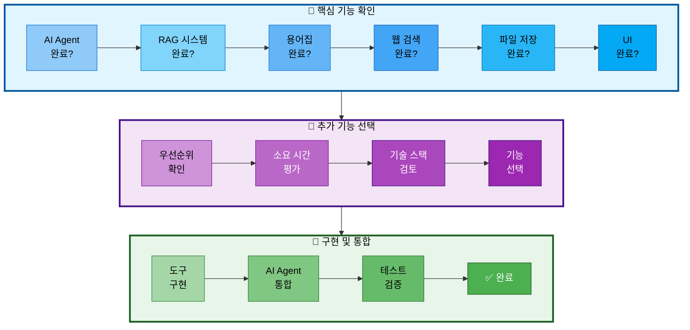

# 추가 선택 기능 (먼저 개발 완료한 팀원이 선택)

## 문서 정보
- **작성일**: 2025-10-30
- **작성자**: 최현화[팀장]
- **목적**: 핵심 기능 개발을 먼저 완료한 팀원이 추가로 선택하여 구현할 수 있는 기능 목록
- **우선순위**: 선택 사항 (시간이 있을 경우)

---

## 개요

핵심 기능(AI Agent, RAG, 용어집, 웹 검색, 파일 저장, UI)을 먼저 완료한 팀원이 아래 기능 중 선택하여 구현할 수 있습니다.

**선택 기준:**
1. 프로젝트에 가산점을 줄 수 있는 기능
2. 구현 난이도와 시간을 고려
3. 팀원의 관심사 및 강점

---

## 추가 기능 선택 프로세스



---

## 선택 기능 1: Text-to-SQL 도구 (⭐⭐⭐ 가산점)

### 기능 설명
자연어 질문을 SQL 쿼리로 변환하여 논문 통계 정보를 조회하는 도구

### 사용 시점
- "2024년에 발표된 논문 개수는?"
- "가장 많이 인용된 논문 Top 5는?"
- "저자별 논문 수 알려줘"
- "카테고리별 논문 분포는?"

### Langchain 구현

#### 1. SQLDatabaseChain 사용

**파일 경로**: `src/tools/text2sql.py`

**구현 방법**:
1. SQLDatabase.from_uri()로 PostgreSQL 연결
2. SQLDatabaseChain 생성
   - LLM: ChatOpenAI (model: gpt-5, temperature: 0)
   - db: SQLDatabase 인스턴스
   - verbose: True
3. `query_paper_statistics` 함수를 @tool 데코레이터로 정의
   - 인자: question (자연어 질문)
   - sql_chain.run()으로 SQL 생성 및 실행
   - 결과를 Markdown 형식으로 포맷팅하여 반환

#### 2. 커스텀 SQL 생성 (고급)

**구현 방법**:
1. SQL_GENERATION_PROMPT 정의
   - 데이터베이스 스키마 정보 포함
   - 질문을 SQL 쿼리로 변환하는 프롬프트
2. `custom_sql_query` 함수를 @tool 데코레이터로 정의
   - LLM으로 SQL 쿼리 생성
   - psycopg2로 PostgreSQL 연결
   - 생성된 SQL 쿼리 실행
   - 결과 포맷팅 (SQL과 결과 포함)
   - 오류 처리 (try-except-finally)

### 구현해야 할 기능
1. SQLDatabaseChain 설정
2. DB 스키마 정보 프롬프트에 포함
3. SQL 쿼리 생성
4. 쿼리 실행 및 결과 포맷팅
5. 오류 처리 (잘못된 SQL 생성 시)

### 사용하는 DB
- **PostgreSQL**: `papers`, `glossary` 테이블

### 예상 소요 시간
**2-3일**

### 구현 설명

**필요 라이브러리**:
- `langchain.tools.tool` (@tool 데코레이터)
- `langchain_openai.ChatOpenAI`
- `langchain_community.utilities.SQLDatabase`
- `langchain.chains.SQLDatabaseChain`
- `psycopg2`

---

#### 방법 1: SQLDatabaseChain 사용 (권장)

**초기화 단계**:

| 단계 | 작업 | 설명 |
|-----|------|------|
| 1 | PostgreSQL 연결 | SQLDatabase.from_uri("postgresql://...") |
| 2 | LLM 초기화 | ChatOpenAI(model="gpt-5", temperature=0) |
| 3 | SQLDatabaseChain 생성 | from_llm(llm, db, verbose=True) |

**도구: `query_paper_statistics`**

| 항목 | 설명 |
|-----|------|
| 데코레이터 | @tool |
| 파라미터 | question (str) - 자연어 질문 |
| 반환값 | str - 쿼리 결과 (Markdown 형식) |
| 동작 | sql_chain.run(question)으로 SQL 생성 및 실행 |
| 오류 처리 | try-except로 오류 메시지 반환 |

**처리 흐름**:
1. 자연어 질문 수신
2. SQLDatabaseChain.run()으로 SQL 자동 생성 및 실행
3. 결과를 Markdown 형식으로 포맷팅
4. 오류 발생 시 오류 메시지 반환

---

#### 방법 2: 커스텀 SQL 생성 (고급)

**SQL 생성 프롬프트 구조**:

| 항목 | 내용 |
|-----|------|
| 목적 | 자연어 질문을 SQL 쿼리로 변환 |
| DB 스키마 정보 | papers, glossary 테이블 구조 포함 |
| 입력 변수 | {question} |
| 출력 형식 | 단일 SQL SELECT 쿼리 |

**도구: `custom_sql_query`**

| 항목 | 설명 |
|-----|------|
| 데코레이터 | @tool |
| 파라미터 | question (str) - 자연어 질문 |
| 반환값 | str - 쿼리 결과 (SQL + 결과 테이블) |

**처리 흐름**:

| 단계 | 작업 | 설명 |
|-----|------|------|
| 1 | SQL 쿼리 생성 | LLM.invoke()로 SQL_GENERATION_PROMPT 실행 |
| 2 | 마크다운 블록 제거 | 코드 블록 구문 제거 (```sql``` 제거) |
| 3 | DB 연결 | psycopg2.connect() |
| 4 | 쿼리 실행 | cursor.execute(sql_query) |
| 5 | 결과 조회 | cursor.fetchall() |
| 6 | 컬럼명 추출 | cursor.description에서 컬럼명 가져오기 |
| 7 | 결과 포맷팅 | Markdown 테이블 형식으로 변환 |
| 8 | 연결 종료 | cursor.close(), conn.close() |
| 9 | 오류 처리 | SQL 오류 발생 시 오류 메시지 + 생성된 SQL 반환 |

**출력 형식**:
- 실행된 SQL 쿼리 (코드 블록)
- 결과 테이블 (Markdown 테이블)
- 오류 발생 시: 오류 메시지 + 생성된 SQL

### 참고 자료
- Langchain SQL Database: https://python.langchain.com/docs/integrations/tools/sql_database
- SQLDatabaseChain: https://python.langchain.com/docs/use_cases/sql/

---

## 선택 기능 2: 성능 평가 시스템 (⭐⭐ 가산점)

### 기능 설명
챗봇의 답변 품질을 자동으로 평가하는 시스템

### 평가 항목
1. **답변 정확도**: 논문 내용과 일치하는지
2. **관련성**: 질문과 답변이 관련있는지
3. **난이도 적합성**: Easy/Hard 모드에 맞는 답변인지
4. **출처 명시**: 논문 제목, 저자를 명시했는지

### Langchain 구현

#### 1. LLM-as-a-Judge 평가

**파일 경로**: `src/evaluation/evaluator.py`

**구현 방법**:
1. EVALUATION_PROMPT 정의 (PromptTemplate)
   - 평가 기준: 정확도, 관련성, 난이도 적합성, 출처 명시 (각 0-10점)
   - JSON 형식으로 평가 결과 반환
2. `AnswerEvaluator` 클래스 정의
   - ChatOpenAI 초기화 (model: gpt-5, temperature: 0)
3. `evaluate` 메서드 구현
   - 프롬프트 포맷팅 (question, answer, reference_docs, difficulty)
   - LLM 호출하여 평가 수행
   - 결과를 JSON으로 파싱하여 반환

#### 2. 평가 결과 저장

**구현 방법**:
1. `save_evaluation_results` 함수 정의
2. PostgreSQL 연결
3. evaluation_results 테이블 생성
   - eval_id, question, answer, accuracy_score, relevance_score, difficulty_score, citation_score, total_score, comment, created_at
4. 평가 결과 리스트를 순회하며 INSERT
5. 커밋 및 연결 종료

### 구현해야 할 기능
1. LLM-as-a-Judge 프롬프트 설계
2. 평가 결과 JSON 파싱
3. PostgreSQL 평가 결과 테이블 생성
4. 평가 결과 저장 및 조회
5. Streamlit UI에 평가 결과 표시

### 예상 소요 시간
**2-3일**

### 구현 설명

**필요 라이브러리**:
- `langchain_openai.ChatOpenAI`
- `langchain.prompts.PromptTemplate`
- `json`
- `psycopg2`

---

#### 평가 프롬프트 구조

**EVALUATION_PROMPT_TEMPLATE**:

| 항목 | 내용 |
|-----|------|
| 입력 변수 | question, answer, reference_docs, difficulty |
| 평가 항목 | 정확도, 관련성, 난이도 적합성, 출처 명시 (각 0-10점) |
| 출력 형식 | JSON (accuracy_score, relevance_score, difficulty_score, citation_score, total_score, comment) |

**PromptTemplate 생성**:
- template: EVALUATION_PROMPT_TEMPLATE
- input_variables: ["question", "answer", "reference_docs", "difficulty"]

---

#### 클래스: `AnswerEvaluator`

**역할**: LLM-as-a-Judge 방식으로 답변 품질 평가

**`__init__` 메서드**:

| 초기화 항목 | 설정 |
|-----------|------|
| LLM | ChatOpenAI(model="gpt-5", temperature=0) |

**`evaluate` 메서드**:

**파라미터**:

| 파라미터 | 타입 | 설명 |
|---------|------|------|
| question | str | 사용자 질문 |
| answer | str | AI 답변 |
| reference_docs | str | 참고 문서 |
| difficulty | str | 난이도 (easy/hard) |

**반환값**: `dict` - 평가 결과 딕셔너리

**처리 흐름**:

| 단계 | 작업 | 설명 |
|-----|------|------|
| 1 | 프롬프트 포맷팅 | EVALUATION_PROMPT.format()으로 입력값 삽입 |
| 2 | LLM 호출 | self.llm.invoke(prompt) |
| 3 | JSON 파싱 | response.content를 json.loads()로 파싱 |
| 4 | 오류 처리 | JSONDecodeError 발생 시 기본값 반환 (모든 점수 0) |

---

#### 함수: `save_evaluation_results`

**역할**: 평가 결과를 PostgreSQL에 저장

**파라미터**:

| 파라미터 | 타입 | 설명 |
|---------|------|------|
| evaluation_results | List[dict] | 평가 결과 리스트 |

**처리 흐름**:

| 단계 | 작업 | 설명 |
|-----|------|------|
| 1 | DB 연결 | psycopg2.connect() |
| 2 | 테이블 생성 | evaluation_results 테이블 (CREATE TABLE IF NOT EXISTS) |
| 3 | 데이터 삽입 | 평가 결과 리스트 순회하며 INSERT |
| 4 | 커밋 | conn.commit() |
| 5 | 연결 종료 | cursor.close(), conn.close() |

**테이블 스키마 (evaluation_results)**:

| 컬럼 | 타입 | 설명 |
|-----|------|------|
| eval_id | SERIAL PRIMARY KEY | 평가 ID (자동 증가) |
| question | TEXT NOT NULL | 사용자 질문 |
| answer | TEXT NOT NULL | AI 답변 |
| accuracy_score | INT | 정확도 점수 (0-10) |
| relevance_score | INT | 관련성 점수 (0-10) |
| difficulty_score | INT | 난이도 적합성 점수 (0-10) |
| citation_score | INT | 출처 명시 점수 (0-10) |
| total_score | INT | 총점 |
| comment | TEXT | 평가 코멘트 |
| created_at | TIMESTAMP | 생성 시간 (기본값: CURRENT_TIMESTAMP) |

---

#### 실행 스크립트 예시

**실행 순서**:
1. ExperimentManager 초기화 (with 문)
2. AnswerEvaluator 인스턴스 생성
3. evaluate() 메서드로 답변 평가
4. 평가 결과를 로그에 기록
5. save_evaluation_results()로 DB 저장

### 참고 자료
- LangChain Evaluation: https://python.langchain.com/docs/guides/evaluation/

---

## 선택 기능 3: Reranking (검색 최적화) (⭐⭐)

### 기능 설명
RAG 검색 결과를 재순위화하여 더 관련성 높은 문서를 상위에 배치

### Langchain 구현

#### 1. Cohere Rerank 사용

**파일 경로**: `src/rag/reranking.py`

**구현 방법**:
1. `create_rerank_retriever` 함수 정의
   - 인자: base_retriever
2. CohereRerank 압축기 생성
   - model: "rerank-english-v2.0"
   - API 키를 환경변수에서 로드
3. ContextualCompressionRetriever 생성
   - base_compressor: CohereRerank
   - base_retriever: 전달받은 Retriever
4. 사용 예시
   - PGVector로 VectorStore 생성
   - base_retriever 생성 (k=20)
   - create_rerank_retriever()로 Reranking 적용
   - 상위 20개 중 재순위화하여 상위 5개 반환

#### 2. LLMChainExtractor (커스텀)

**구현 방법**:
1. `create_llm_extractor_retriever` 함수 정의
   - 인자: base_retriever, llm
2. LLMChainExtractor 생성
   - LLM을 사용하여 문서 압축
3. ContextualCompressionRetriever 생성
   - base_compressor: LLMChainExtractor
   - base_retriever: 전달받은 Retriever
4. 반환

### 구현해야 할 기능
1. Cohere API 키 설정
2. ContextualCompressionRetriever 구현
3. RAG 검색 도구에 Reranking 적용
4. 성능 비교 (Before/After)

### 예상 소요 시간
**1-2일**

### 참고 자료
- ContextualCompressionRetriever: https://python.langchain.com/docs/modules/data_connection/retrievers/contextual_compression/

---

## 선택 기능 4: 논문 비교 도구 (⭐)

### 기능 설명
여러 논문의 차이점을 비교하여 표로 정리

### 사용 시점
- "BERT와 GPT 비교해줘"
- "Transformer와 RNN의 차이는?"

### Langchain 구현

**파일 경로**: `src/tools/paper_comparison.py`

**구현 방법**:
1. `compare_papers` 함수를 @tool 데코레이터로 정의
   - 인자: paper1_title, paper2_title
2. RAG Retriever로 두 논문 검색
   - paper1_docs = rag_retriever.retrieve(paper1_title)
   - paper2_docs = rag_retriever.retrieve(paper2_title)
3. 비교 프롬프트 구성
   - 두 논문의 제목과 내용 포함
   - 비교 항목: 주요 기여, 모델 구조, 장점, 단점, 성능
   - Markdown 표 형식으로 출력 요청
4. LLM 호출하여 비교 결과 생성
5. 결과 반환

### 예상 소요 시간
**1일**

---

## 선택 기능 5: 대화 이력 시각화 (⭐)

### 기능 설명
사용자 질문 패턴, 자주 사용되는 도구 등을 시각화

### Streamlit 구현

**파일 경로**: `ui/analytics.py`

**구현 방법**:
1. `show_analytics` 함수 정의
2. Streamlit 헤더 표시 ("대화 이력 분석")
3. PostgreSQL 연결
4. 도구 사용 통계 조회
   - query_logs 테이블에서 tool_used별 COUNT
   - pandas.read_sql()로 DataFrame 생성
   - plotly.express.bar()로 막대 그래프 생성
   - st.plotly_chart()로 표시
5. 난이도별 질문 분포 조회
   - query_logs 테이블에서 difficulty_mode별 COUNT
   - pandas.read_sql()로 DataFrame 생성
   - plotly.express.pie()로 파이 차트 생성
   - st.plotly_chart()로 표시
6. 연결 종료

### 예상 소요 시간
**1일**

---

## 선택 기능 6: 멀티모달 지원 (이미지 논문) (⭐⭐⭐)

### 기능 설명
논문 내 그래프, 표, 수식 이미지를 GPT-5 Vision으로 분석

### Langchain 구현

**구현 방법**:
1. ChatOpenAI 초기화
   - model: "gpt-5-vision-preview"
2. `analyze_paper_image` 함수 정의
   - 인자: image_path, question
3. 이미지 로드 및 Base64 인코딩
   - 파일을 읽어서 base64로 인코딩
4. HumanMessage 생성
   - content에 text와 image_url 포함
   - text: 질문
   - image_url: Base64 인코딩된 이미지
5. GPT-5 Vision 호출
   - llm_vision.invoke([message])
6. 응답 내용 반환

### 예상 소요 시간
**2-3일**

---

## 우선순위 추천

### High Priority (가산점 크고 구현 가능)
1. **Text-to-SQL** (⭐⭐⭐) - 2-3일
2. **성능 평가 시스템** (⭐⭐) - 2-3일

### Medium Priority (구현 간단)
3. **Reranking** (⭐⭐) - 1-2일
4. **논문 비교 도구** (⭐) - 1일
5. **대화 이력 시각화** (⭐) - 1일

### Low Priority (시간 많이 소요)
6. **멀티모달 지원** (⭐⭐⭐) - 2-3일

---

## 선택 가이드

### 시간이 2일 남았다면
→ **Text-to-SQL** 또는 **성능 평가 시스템**

### 시간이 1일 남았다면
→ **Reranking** 또는 **논문 비교 도구**

### 시간이 여유 있다면
→ **멀티모달 지원**

---

## 참고 사항

- 선택 기능은 **필수가 아닙니다**
- 핵심 기능을 먼저 완성한 후 시간이 남을 때만 구현
- 팀원들과 상의하여 역할 분배
- 구현 시 **Feature 브랜치 생성** 필수

---

## 로깅 및 실험 추적 관리

### ExperimentManager 사용

**중요**: 모든 추가 기능 개발은 ExperimentManager 클래스를 사용해야 합니다.

**파일 경로**: `src/utils/experiment_manager.py`

**사용 방법**:
1. ExperimentManager 인스턴스 생성 (with 문 사용)
   - Session ID 자동 부여 및 폴더 구조 자동 생성
   ```python
   from src.utils.experiment_manager import ExperimentManager

   # ExperimentManager 초기화 (with 문)
   with ExperimentManager() as exp:
       # 자동으로 다음 작업 수행:
       # 1. experiments/20251031/20251031_103015_session_001/ 생성
       # 2. Session ID 자동 부여 (session_001, 002...)
       # 3. chatbot.log 파일 생성
       # 4. 7개 서브 폴더 생성 (tools/, database/, prompts/, ui/, outputs/, evaluation/, debug/)
       # 5. metadata.json 초기화
       # 6. Logger 초기화

       # 추가 기능 로그 작성
       exp.logger.write("Text-to-SQL 도구 실행")

       # 데이터베이스 작업 로그
       exp.db_logger.write("SQL 쿼리 생성 및 실행")

       # 평가 결과 저장
       exp.save_evaluation_metrics(evaluation_results)

       # 실험 종료 (자동으로 logger.close() 호출)
   ```

2. 세션 폴더 구조
   ```
   experiments/
   └── 20251031/
       ├── 20251031_103015_session_001/
       │   ├── chatbot.log          # 챗봇 실행 로그
       │   ├── metadata.json        # 세션 메타데이터
       │   ├── tools/               # 도구 실행 로그
       │   │   └── tool_execution.log
       │   ├── database/            # DB 쿼리 로그
       │   │   └── database.log
       │   ├── prompts/             # 프롬프트 저장
       │   ├── ui/                  # UI 스크린샷
       │   ├── outputs/             # 최종 결과물 저장
       │   ├── evaluation/          # 평가 지표
       │   │   └── evaluation_results.json
       │   └── debug/               # 디버그 로그
       └── 20251031_103520_session_002/
           └── ...
   ```

3. 추가 기능별 로깅
   - Text-to-SQL: `exp.db_logger.write("SQL 쿼리 실행")`
   - 성능 평가: `exp.save_evaluation_metrics(results)`
   - Reranking: `exp.tool_logger.write("Reranking 적용")`

4. 추가 기능
   - SQL 쿼리 저장: `exp.db_logger.write(f"SQL: {sql_query}")`
   - 평가 결과 저장: `exp.save_output(evaluation_results, "evaluation")`
   - 비교 결과 저장: `exp.save_output(comparison_result, "paper_comparison")`

### 실험 폴더 구조

상세 내용은 [실험_폴더_구조.md](../rules/실험_폴더_구조.md) 참조

---

## 참고 PRD 문서

개발 시 반드시 참고해야 할 PRD 문서 목록:

### 필수 참고 문서
1. [01_프로젝트_개요.md](../PRD/01_프로젝트_개요.md) - 프로젝트 전체 개요
2. [02_프로젝트_구조.md](../PRD/02_프로젝트_구조.md) - 폴더 구조
3. [05_로깅_시스템.md](../PRD/05_로깅_시스템.md) ⭐ - Logger 사용법
4. [06_실험_추적_관리.md](../PRD/06_실험_추적_관리.md) ⭐ - ExperimentManager 및 Session 폴더 구조
5. [10_기술_요구사항.md](../PRD/10_기술_요구사항.md) - 기술 스택
6. [11_데이터베이스_설계.md](../PRD/11_데이터베이스_설계.md) - DB 스키마 (Text-to-SQL용)

### 참고 문서
- [03_브랜치_전략.md](../PRD/03_브랜치_전략.md) - Feature 브랜치
- [04_일정_관리.md](../PRD/04_일정_관리.md) - 개발 일정
- [담당역할_01-1_최현화_실험_관리_시스템.md](담당역할_01-1_최현화_실험_관리_시스템.md) - ExperimentManager 클래스 상세 구현
- [담당역할_01-2_최현화_로깅_모니터링.md](담당역할_01-2_최현화_로깅_모니터링.md) - 로깅 및 모니터링 시스템
- [실험_폴더_구조.md](../rules/실험_폴더_구조.md) - 실험 폴더 구조 최종안

---
