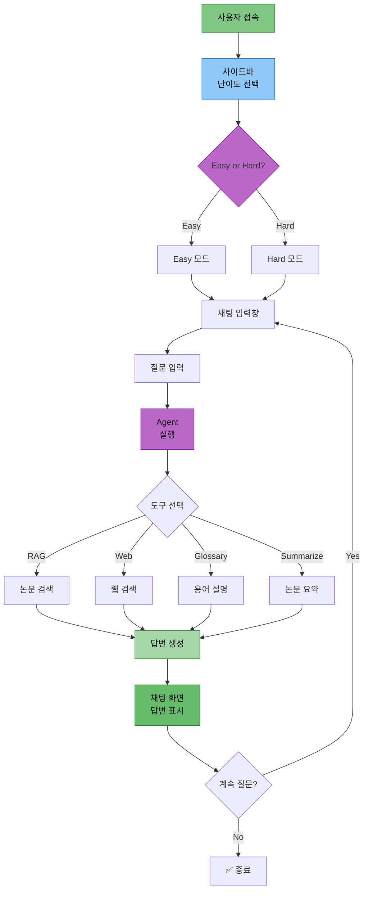
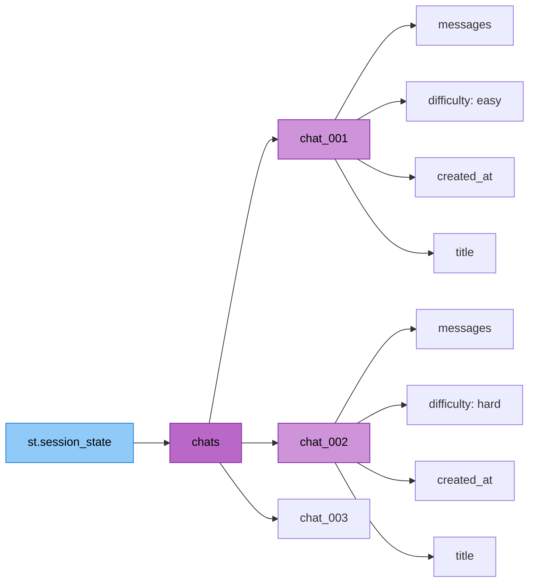

# 담당역할: 최현화 - Streamlit UI 구현

## 문서 정보
- **작성자**: 최현화[팀장]

## 담당자 정보
- **이름**: 최현화
- **역할**: Streamlit UI 구현
- **참여 기간**: 전체 기간
- **핵심 역할**: Streamlit 기반 채팅 UI, 다중 세션 관리, LocalStorage 영속성

---

## 구현 완료된 UI 모듈

### 1. Streamlit 기본 UI (`ui/app.py`)
- 페이지 설정 (page_title, page_icon, layout)
- 메인 헤더 및 캡션
- Agent 및 ExperimentManager 초기화
- API 키 검증 (OpenAI, PostgreSQL)
- 빈 폴더 자동 정리 기능
- 채팅 세션 초기화
- 사이드바 및 채팅 인터페이스 렌더링

### 2. 사이드바 컴포넌트 (`ui/components/sidebar.py`)
- **다크 모드 토글**: CSS 기반 다크/라이트 테마 전환
- **난이도 설명 및 선택**: Expander로 난이도 설명, 라디오 버튼으로 선택
- **새 채팅 버튼**: 선택된 난이도로 새 채팅 생성
- **채팅 목록**: ChatGPT 스타일 날짜별 그룹화 ("오늘", "어제", "지난 7일", "그 이전")
- **채팅 전환/삭제**: 클릭으로 채팅 전환, 삭제 버튼
- **개별 채팅 저장**: 각 채팅별 다운로드 버튼 (마크다운 형식)
- **LocalStorage 관리**: 수동 저장, 초기화 버튼
- **시스템 정보 표시**: 프로젝트 정보 캡션

### 3. 채팅 인터페이스 (`ui/components/chat_interface.py`)
- **채팅 히스토리 표시**: 저장된 메시지 렌더링
- **도구 선택 정보 표시**: Agent가 선택한 도구 배지 표시
- **답변 복사 버튼**: JavaScript 기반 클립보드 복사
- **참고 논문 출처 표시**: Expander로 출처 정보 표시
- **StreamlitCallbackHandler 연동**: Agent 처리 과정 표시
- **전체 대화 복사/저장**: 전체 대화 내역 복사 및 다운로드
- **에러 처리 및 로깅**: UI 에러 로그 파일 저장
- **용어 자동 추출**: AI/ML 용어 자동 추출 및 DB 저장

### 4. 채팅 세션 관리 (`ui/components/chat_manager.py`)
- **다중 채팅 세션 지원**: 여러 채팅 동시 관리
- **채팅 생성/삭제/전환**: UUID 기반 채팅 ID
- **채팅 제목 자동 생성**: 첫 번째 메시지로 제목 자동 설정 (50자 제한)
- **날짜별 그룹화**: 채팅 목록을 날짜별로 분류
- **채팅 내보내기**: 마크다운 형식으로 전체 대화 내역 변환

### 5. LocalStorage 영속성 (`ui/components/storage.py`)
- **브라우저 저장소 활용**: JavaScript LocalStorage API
- **자동 저장/로드**: 채팅 데이터 JSON 직렬화
- **세션 상태 복원**: 페이지 새로고침 시에도 채팅 유지
- **저장소 초기화**: 모든 채팅 데이터 삭제 기능
- **저장소 정보 표시**: 총 채팅 수, 자동 저장 상태

### 6. 파일 다운로드 (`ui/components/file_download.py`)
- **개별 답변 다운로드**: 타임스탬프 기반 파일명
- **전체 대화 다운로드**: 마크다운 형식
- **다운로드 옵션**: 파일명 지정, 형식 선택 (txt/md), 메타데이터 포함 여부

---

## UI 아키텍처 다이어그램

### 1. Streamlit UI 워크플로우



### 2. 다중 채팅 세션 구조



---

## 구현 코드 예제

### 1. 메인 UI 구조 (ui/app.py)

**필수 임포트 모듈:**

| 모듈 | 용도 |
|------|------|
| `streamlit` | Streamlit 프레임워크 |
| `create_agent_graph` | Agent 그래프 생성 |
| `ExperimentManager` | 실험 관리 시스템 |
| `render_sidebar` | 사이드바 렌더링 |
| `display_chat_history`, `render_chat_input` | 채팅 인터페이스 |
| `initialize_chat_sessions` | 채팅 세션 초기화 |

**페이지 설정 (`st.set_page_config`):**

| 설정 | 값 | 설명 |
|------|-----|------|
| `page_title` | "논문 리뷰 챗봇" | 브라우저 탭 제목 |
| `page_icon` | "📚" | 파비콘 |
| `layout` | "wide" | 와이드 레이아웃 |
| `initial_sidebar_state` | "expanded" | 사이드바 기본 확장 |

**Agent 초기화 (`initialize_agent`):**

| 단계 | 작업 | 설명 |
|------|------|------|
| 1 | `@st.cache_resource` 데코레이터 적용 | 리소스 캐싱 |
| 2 | `ExperimentManager()` 생성 | 실험 관리자 인스턴스 |
| 3 | `create_agent_graph(exp_manager)` 호출 | Agent 실행기 생성 |
| 4 | `(agent_executor, exp_manager)` 반환 | 두 인스턴스 반환 |

**메인 실행 흐름:**

| 순서 | 작업 | 함수/메서드 |
|------|------|-------------|
| 1 | Agent 및 관리자 초기화 | `initialize_agent()` |
| 2 | 메인 헤더 표시 | `st.title()`, `st.caption()` |
| 3 | 채팅 세션 초기화 | `initialize_chat_sessions()` |
| 4 | 사이드바 렌더링 | `render_sidebar(exp_manager)` |
| 5 | 채팅 히스토리 표시 | `display_chat_history()` |
| 6 | 채팅 입력 렌더링 | `render_chat_input(agent_executor, difficulty, exp_manager)` |

### 2. 다중 채팅 세션 관리 (ui/components/chat_manager.py)

**필수 임포트:**

| 모듈 | 용도 |
|------|------|
| `streamlit` | 세션 상태 관리 |
| `uuid` | 고유 ID 생성 |
| `datetime` | 타임스탬프 생성 |

**함수 1: `initialize_chat_sessions()`**

| 단계 | 작업 | 설명 |
|------|------|------|
| 1 | `chats` 키 확인 | `st.session_state`에 없으면 빈 딕셔너리 생성 |
| 2 | `current_chat_id` 키 확인 | 없으면 `None`으로 초기화 |

**함수 2: `create_new_chat(difficulty: str) -> str`**

| 파라미터 | 타입 | 설명 |
|----------|------|------|
| `difficulty` | `str` | 난이도 ("easy" 또는 "hard") |

| 단계 | 작업 | 설명 |
|------|------|------|
| 1 | UUID 생성 | `uuid.uuid4()[:8]`로 8자 ID 생성 |
| 2 | 타임스탬프 생성 | `"%Y-%m-%d %H:%M:%S"` 형식 |
| 3 | 채팅 데이터 생성 | `messages=[]`, `difficulty`, `created_at`, `title="새 채팅"` |
| 4 | 세션 상태에 저장 | `st.session_state.chats[chat_id]`에 딕셔너리 저장 |
| 5 | 현재 채팅 ID 설정 | `current_chat_id = chat_id` |
| 6 | ID 반환 | 생성된 `chat_id` 반환 |

**함수 3: `switch_chat(chat_id: str)`**

| 단계 | 작업 | 설명 |
|------|------|------|
| 1 | ID 존재 확인 | `chat_id in st.session_state.chats` 검사 |
| 2 | 현재 채팅 전환 | `current_chat_id = chat_id` |

**함수 4: `delete_chat(chat_id: str)`**

| 단계 | 작업 | 설명 |
|------|------|------|
| 1 | ID 존재 확인 | `chat_id in st.session_state.chats` 검사 |
| 2 | 채팅 삭제 | `del st.session_state.chats[chat_id]` |

### 3. LocalStorage 영속성 (ui/components/storage.py)

**필수 임포트:**

| 모듈 | 용도 |
|------|------|
| `streamlit` | 세션 상태 접근 |
| `streamlit.components.v1` | HTML/JS 컴포넌트 렌더링 |
| `json` | JSON 직렬화 |

**함수 1: `save_chats_to_local_storage()`**

| 단계 | 작업 | 설명 |
|------|------|------|
| 1 | JSON 직렬화 | `json.dumps(st.session_state.chats)` |
| 2 | JavaScript 스크립트 생성 | `localStorage.setItem('langchain_chats', ...)` |
| 3 | 현재 채팅 ID 저장 | `localStorage.setItem('langchain_current_chat_id', ...)` |
| 4 | HTML 컴포넌트 렌더링 | `components.html(save_script, height=0)` |

**저장 데이터:**

| 키 | 값 | 설명 |
|-----|-----|------|
| `langchain_chats` | JSON 문자열 | 모든 채팅 세션 데이터 |
| `langchain_current_chat_id` | 문자열 | 현재 활성 채팅 ID |

**함수 2: `clear_local_storage()`**

| 단계 | 작업 | 설명 |
|------|------|------|
| 1 | JavaScript 스크립트 생성 | `localStorage.removeItem(...)` 호출 |
| 2 | 채팅 데이터 삭제 | `langchain_chats` 키 제거 |
| 3 | 현재 ID 삭제 | `langchain_current_chat_id` 키 제거 |
| 4 | HTML 컴포넌트 렌더링 | `components.html(clear_script, height=0)` |
| 5 | 성공 메시지 표시 | `st.success("브라우저 저장소가 초기화되었습니다.")` |

### 4. 다크 모드 토글 (ui/components/sidebar.py)

**구현 위치:**

사이드바 내부 (`with st.sidebar:` 블록)

**처리 흐름:**

| 단계 | 작업 | 설명 |
|------|------|------|
| 1 | 설정 헤더 표시 | `st.markdown("### ⚙️ 설정")` |
| 2 | 토글 위젯 생성 | `st.toggle("🌙 다크 모드", value=...)` |
| 3 | 세션 상태에서 값 가져오기 | `st.session_state.get("dark_mode", False)` |
| 4 | 다크 모드 여부 확인 | `if dark_mode:` |
| 5 | CSS 스타일 적용 | `st.markdown(..., unsafe_allow_html=True)` |

**다크 모드 CSS 설정:**

| 선택자 | 속성 | 값 | 설명 |
|--------|------|-----|------|
| `.stApp` | `background-color` | `#0E1117` | 메인 배경색 (어두운 회색) |
| `.stApp` | `color` | `#FAFAFA` | 메인 텍스트 색상 (밝은 회색) |
| `.stSidebar` | `background-color` | `#262730` | 사이드바 배경색 (진한 회색) |

### 5. 답변 복사 버튼 (ui/components/chat_interface.py)

**구현 방식:** JavaScript 기반 클립보드 복사

**처리 흐름:**

| 단계 | 작업 | 설명 |
|------|------|------|
| 1 | 답변 텍스트 JSON 직렬화 | `json.dumps(answer)` (안전한 문자열 변환) |
| 2 | 고유 ID 생성 | `abs(hash(answer))` (충돌 방지) |
| 3 | HTML 버튼 생성 | `<button id="copy_btn_{unique_id}">` |
| 4 | JavaScript 함수 정의 | `copyToClipboard_{unique_id}()` |
| 5 | Clipboard API 호출 | `navigator.clipboard.writeText(text)` |
| 6 | 성공 시 버튼 텍스트 변경 | `'✅ 복사됨!'`으로 변경 |
| 7 | HTML 렌더링 | `st.markdown(..., unsafe_allow_html=True)` |

**버튼 스타일 속성:**

| 속성 | 값 | 설명 |
|------|-----|------|
| `background-color` | `#FF4B4B` | Streamlit 빨간색 |
| `color` | `white` | 흰색 텍스트 |
| `border` | `none` | 테두리 없음 |
| `padding` | `0.5rem 1rem` | 내부 여백 |
| `border-radius` | `0.25rem` | 둥근 모서리 |
| `cursor` | `pointer` | 포인터 커서 |

**고유 ID 사용 이유:**
- 여러 답변 동시 표시 시 JavaScript 함수 충돌 방지
- 각 버튼마다 독립적인 복사 기능 제공

---

## 주요 기능 설명

### 1. 다중 채팅 세션 관리

**구현 방식:**
- `st.session_state.chats`: 딕셔너리로 모든 채팅 저장
- `current_chat_id`: 현재 활성 채팅 ID 추적
- UUID 기반 고유 ID 생성

**기능:**
- 무제한 채팅 생성
- 채팅 간 전환
- 개별 채팅 삭제
- 채팅 제목 자동 생성 (첫 메시지 기반)

### 2. ChatGPT 스타일 날짜별 그룹화

**그룹 분류:**
- 오늘: 오늘 생성된 채팅
- 어제: 어제 생성된 채팅
- 지난 7일: 최근 7일 이내
- 그 이전: 7일 이전 채팅

**함수: `group_chats_by_date(chat_list)`**

| 파라미터 | 타입 | 설명 |
|----------|------|------|
| `chat_list` | `list` | 채팅 리스트 |

**처리 흐름:**

| 단계 | 작업 | 설명 |
|------|------|------|
| 1 | 현재 시간 가져오기 | `datetime.now()` |
| 2 | 오늘 시작 시간 계산 | `now.replace(hour=0, minute=0, second=0, microsecond=0)` |
| 3 | 어제 시작 시간 계산 | `today_start - timedelta(days=1)` |
| 4 | 일주일 전 시간 계산 | `today_start - timedelta(days=7)` |
| 5 | 그룹 딕셔너리 초기화 | 4개 키: "오늘", "어제", "지난 7일", "그 이전" |
| 6 | 채팅 리스트 순회 | `for chat in chat_list:` |
| 7 | 생성 시간 파싱 | `datetime.strptime(chat["created_at"], "%Y-%m-%d %H:%M:%S")` |
| 8 | 시간대별 분류 | if/elif 조건문으로 그룹에 추가 |
| 9 | 빈 그룹 제거 후 반환 | `{k: v for k, v in groups.items() if v}` |

**분류 조건:**

| 그룹 | 조건 | 설명 |
|------|------|------|
| "오늘" | `created_at >= today_start` | 오늘 00:00 이후 |
| "어제" | `created_at >= yesterday_start` | 어제 00:00 ~ 오늘 00:00 |
| "지난 7일" | `created_at >= week_ago` | 일주일 전 ~ 어제 |
| "그 이전" | `else` | 일주일 이전 |

### 3. LocalStorage 영속성

**장점:**
- 페이지 새로고침 시에도 채팅 유지
- 서버 부담 없음
- 빠른 로드 속도

**저장 데이터:**
- 모든 채팅 세션 (messages, difficulty, created_at, title)
- 현재 활성 채팅 ID
- 마지막 난이도 설정

### 4. 다크 모드

**구현 방식:**
- CSS 기반 커스텀 스타일
- `st.markdown()` + `unsafe_allow_html=True`
- 배경색, 텍스트 색상, 사이드바 색상 변경

**토글 상태 저장:**

세션 상태 키: `st.session_state.dark_mode`

| 값 | 의미 |
|----|------|
| `True` | 다크 모드 활성화 |
| `False` | 라이트 모드 (기본값) |

### 5. StreamlitCallbackHandler 연동

**기능:**
- Agent 처리 과정 실시간 표시
- Expander로 접힌 상태 표시
- 완료된 단계 자동 접기

**사용 패턴:**

| 단계 | 작업 | 코드 |
|------|------|------|
| 1 | Expander 컨테이너 생성 | `st.expander("🔍 처리 과정 보기", expanded=False)` |
| 2 | CallbackHandler 초기화 | `StreamlitCallbackHandler(...)` |
| 3 | Agent 실행 | `agent_executor.invoke({...}, config={"callbacks": [...]})` |

**StreamlitCallbackHandler 파라미터:**

| 파라미터 | 값 | 설명 |
|----------|-----|------|
| `parent_container` | `process_expander` | 표시할 Streamlit 컨테이너 |
| `expand_new_thoughts` | `False` | 새 단계 자동 확장 여부 |
| `collapse_completed_thoughts` | `True` | 완료된 단계 자동 접기 |

**Agent 호출 시 config 설정:**

| 키 | 값 | 설명 |
|-----|-----|------|
| `callbacks` | `[st_callback]` | CallbackHandler 리스트 |

---

## ExperimentManager 통합

### UI 로깅

**로그 파일 구조:**
```
experiments/20251103/20251103_103015_session_001/
├── chatbot.log                  # 챗봇 실행 로그
├── ui/
│   └── user_interactions.log    # UI 이벤트 로그
│   └── errors.log               # UI 에러 로그
├── outputs/
│   └── response.txt             # 최종 답변 저장
└── metadata.json                # 세션 메타데이터
```

**로깅 함수:**

| 함수 | 용도 | 사용 예 |
|------|------|---------|
| `log_ui_interaction()` | UI 이벤트 로그 | `"사용자 질문: {prompt}"` |
| `log_ui_interaction()` | 채팅 생성 로그 | `"새 채팅 생성: 난이도=easy"` |
| `log_ui_interaction()` | 설정 변경 로그 | `"다크 모드 활성화"` |
| `update_metadata()` | 메타데이터 업데이트 | `user_query=prompt, tool_used=tool_choice, success=True` |
| `save_output()` | 답변 저장 | `save_output("response.txt", answer)` |

**메타데이터 업데이트 파라미터:**

| 파라미터 | 타입 | 설명 |
|----------|------|------|
| `user_query` | `str` | 사용자 질문 |
| `tool_used` | `str` | 사용된 도구 이름 |
| `success` | `bool` | 성공 여부 |

---

## 테스트 코드

### 1. 채팅 세션 관리 테스트

**테스트 파일:** `tests/test_chat_manager.py`

**임포트 모듈:**

| 모듈 | 용도 |
|------|------|
| `pytest` | 테스트 프레임워크 |
| `create_new_chat` | 새 채팅 생성 함수 |
| `switch_chat` | 채팅 전환 함수 |
| `delete_chat` | 채팅 삭제 함수 |
| `get_current_messages` | 현재 메시지 조회 함수 |

**테스트 함수 1: `test_create_new_chat()`**

| 단계 | 작업 | 검증 |
|------|------|------|
| 1 | `create_new_chat("easy")` 호출 | `chat_id` 반환 확인 |
| 2 | 채팅 존재 확인 | `chat_id in st.session_state.chats` |
| 3 | 난이도 확인 | `difficulty == "easy"` |

**테스트 함수 2: `test_switch_chat()`**

| 단계 | 작업 | 검증 |
|------|------|------|
| 1 | 두 개의 채팅 생성 | `chat_id_1`, `chat_id_2` |
| 2 | 첫 번째 채팅으로 전환 | `switch_chat(chat_id_1)` |
| 3 | 현재 채팅 ID 확인 | `current_chat_id == chat_id_1` |

**테스트 함수 3: `test_delete_chat()`**

| 단계 | 작업 | 검증 |
|------|------|------|
| 1 | 새 채팅 생성 | `chat_id` 반환 |
| 2 | 채팅 삭제 | `delete_chat(chat_id)` |
| 3 | 삭제 확인 | `chat_id not in st.session_state.chats` |

---

## 참고 PRD 문서

개발 시 참고한 PRD 문서 목록:

### 필수 참고 문서
1. [01_프로젝트_개요.md](../PRD/01_프로젝트_개요.md) - 프로젝트 전체 개요
2. [02_프로젝트_구조.md](../PRD/02_프로젝트_구조.md) - 폴더 구조 (ui/)
3. [05_로깅_시스템.md](../PRD/05_로깅_시스템.md) - Logger 사용법
4. [06_실험_추적_관리.md](../PRD/06_실험_추적_관리.md) - ExperimentManager 및 Session 폴더 구조
5. [16_UI_설계.md](../PRD/16_UI_설계.md) - Streamlit 구현 가이드

### 참고 문서
- [담당역할_01-1_최현화_실험_관리_시스템.md](담당역할_01-1_최현화_실험_관리_시스템.md) - ExperimentManager 클래스
- [담당역할_01-2_최현화_로깅_모니터링.md](담당역할_01-2_최현화_로깅_모니터링.md) - 로깅 및 모니터링 시스템
- [실험_폴더_구조.md](../rules/실험_폴더_구조.md) - 실험 폴더 구조

---

## 참고 자료

- Streamlit 공식 문서: https://docs.streamlit.io/
- Streamlit Chat Elements: https://docs.streamlit.io/library/api-reference/chat
- Streamlit Components: https://docs.streamlit.io/library/components
- StreamlitCallbackHandler: https://python.langchain.com/docs/integrations/callbacks/streamlit
