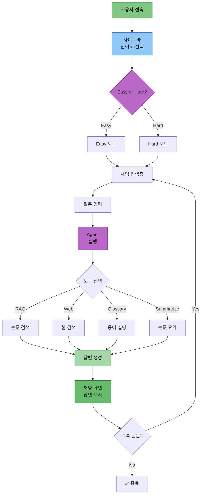
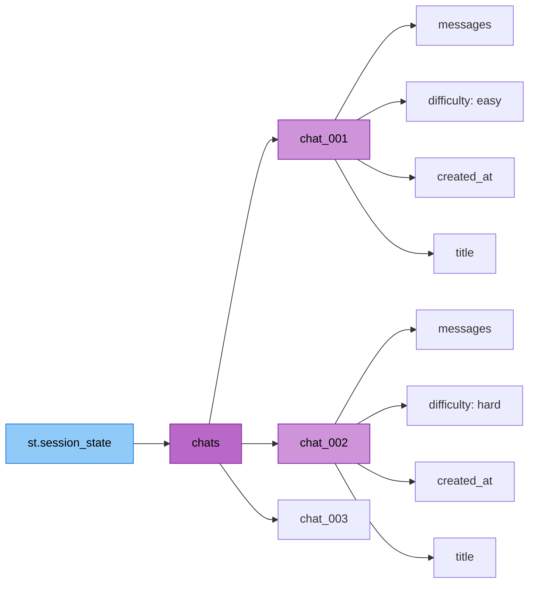

# 담당역할: 최현화 - Streamlit UI 구현

## 문서 정보
- **작성자**: 최현화[팀장]

## 담당자 정보
- **이름**: 최현화
- **역할**: Streamlit UI 구현
- **참여 기간**: 전체 기간
- **핵심 역할**: Streamlit 기반 채팅 UI, 다중 세션 관리, LocalStorage 영속성

---

## 구현 완료된 UI 모듈

### 1. Streamlit 기본 UI (`ui/app.py`)
- 페이지 설정 (page_title, page_icon, layout)
- 메인 헤더 및 캡션
- Agent 및 ExperimentManager 초기화
- API 키 검증 (OpenAI, PostgreSQL)
- 빈 폴더 자동 정리 기능
- 채팅 세션 초기화
- 사이드바 및 채팅 인터페이스 렌더링

### 2. 사이드바 컴포넌트 (`ui/components/sidebar.py`)
- **다크 모드 토글**: CSS 기반 다크/라이트 테마 전환
- **난이도 설명 및 선택**: Expander로 난이도 설명, 라디오 버튼으로 선택
- **새 채팅 버튼**: 선택된 난이도로 새 채팅 생성
- **채팅 목록**: ChatGPT 스타일 날짜별 그룹화 ("오늘", "어제", "지난 7일", "그 이전")
- **채팅 전환/삭제**: 클릭으로 채팅 전환, 삭제 버튼
- **개별 채팅 저장**: 각 채팅별 다운로드 버튼 (마크다운 형식)
- **LocalStorage 관리**: 수동 저장, 초기화 버튼
- **시스템 정보 표시**: 프로젝트 정보 캡션

### 3. 채팅 인터페이스 (`ui/components/chat_interface.py`)
- **채팅 히스토리 표시**: 저장된 메시지 렌더링
- **도구 선택 정보 표시**: Agent가 선택한 도구 배지 표시
- **답변 복사 버튼**: JavaScript 기반 클립보드 복사
- **참고 논문 출처 표시**: Expander로 출처 정보 표시
- **StreamlitCallbackHandler 연동**: Agent 처리 과정 표시
- **전체 대화 복사/저장**: 전체 대화 내역 복사 및 다운로드
- **에러 처리 및 로깅**: UI 에러 로그 파일 저장
- **용어 자동 추출**: AI/ML 용어 자동 추출 및 DB 저장

### 4. 채팅 세션 관리 (`ui/components/chat_manager.py`)
- **다중 채팅 세션 지원**: 여러 채팅 동시 관리
- **채팅 생성/삭제/전환**: UUID 기반 채팅 ID
- **채팅 제목 자동 생성**: 첫 번째 메시지로 제목 자동 설정 (50자 제한)
- **날짜별 그룹화**: 채팅 목록을 날짜별로 분류
- **채팅 내보내기**: 마크다운 형식으로 전체 대화 내역 변환

### 5. LocalStorage 영속성 (`ui/components/storage.py`)
- **브라우저 저장소 활용**: JavaScript LocalStorage API
- **자동 저장/로드**: 채팅 데이터 JSON 직렬화
- **세션 상태 복원**: 페이지 새로고침 시에도 채팅 유지
- **저장소 초기화**: 모든 채팅 데이터 삭제 기능
- **저장소 정보 표시**: 총 채팅 수, 자동 저장 상태

### 6. 파일 다운로드 (`ui/components/file_download.py`)
- **개별 답변 다운로드**: 타임스탬프 기반 파일명
- **전체 대화 다운로드**: 마크다운 형식
- **다운로드 옵션**: 파일명 지정, 형식 선택 (txt/md), 메타데이터 포함 여부

---

## UI 아키텍처 다이어그램

### 1. Streamlit UI 워크플로우



### 2. 다중 채팅 세션 구조



---

## 구현 코드 예제

### 1. 메인 UI 구조 (ui/app.py)

```python
# ui/app.py

import streamlit as st
from src.agent.graph import create_agent_graph
from src.utils.experiment_manager import ExperimentManager
from ui.components.sidebar import render_sidebar
from ui.components.chat_interface import (
    display_chat_history,
    render_chat_input
)
from ui.components.chat_manager import initialize_chat_sessions

# 페이지 설정
st.set_page_config(
    page_title="논문 리뷰 챗봇",
    page_icon="📚",
    layout="wide",
    initial_sidebar_state="expanded"
)

# Agent 및 ExperimentManager 초기화
@st.cache_resource
def initialize_agent():
    exp_manager = ExperimentManager()
    agent_executor = create_agent_graph(exp_manager=exp_manager)
    return agent_executor, exp_manager

agent_executor, exp_manager = initialize_agent()

# 메인 헤더
st.title("📚 논문 리뷰 챗봇 (AI Agent + RAG)")
st.caption("🤖 LangGraph + RAG 기반 논문 검색 및 질문 답변")

# 채팅 세션 초기화
initialize_chat_sessions()

# 사이드바 렌더링
difficulty = render_sidebar(exp_manager=exp_manager)

# 채팅 인터페이스
display_chat_history()
render_chat_input(agent_executor, difficulty, exp_manager)
```

### 2. 다중 채팅 세션 관리 (ui/components/chat_manager.py)

```python
# ui/components/chat_manager.py

import streamlit as st
import uuid
from datetime import datetime

def initialize_chat_sessions():
    """채팅 세션 상태 초기화"""
    if "chats" not in st.session_state:
        st.session_state.chats = {}
    if "current_chat_id" not in st.session_state:
        st.session_state.current_chat_id = None

def create_new_chat(difficulty: str) -> str:
    """새 채팅 생성"""
    chat_id = str(uuid.uuid4())[:8]
    timestamp = datetime.now().strftime("%Y-%m-%d %H:%M:%S")

    st.session_state.chats[chat_id] = {
        "messages": [],
        "difficulty": difficulty,
        "created_at": timestamp,
        "title": "새 채팅"
    }

    st.session_state.current_chat_id = chat_id
    return chat_id

def switch_chat(chat_id: str):
    """채팅 전환"""
    if chat_id in st.session_state.chats:
        st.session_state.current_chat_id = chat_id

def delete_chat(chat_id: str):
    """채팅 삭제"""
    if chat_id in st.session_state.chats:
        del st.session_state.chats[chat_id]
```

### 3. LocalStorage 영속성 (ui/components/storage.py)

```python
# ui/components/storage.py

import streamlit as st
import streamlit.components.v1 as components
import json

def save_chats_to_local_storage():
    """채팅 데이터를 LocalStorage에 저장"""
    chats_json = json.dumps(st.session_state.chats)

    save_script = f"""
    <script>
    localStorage.setItem('langchain_chats', {json.dumps(chats_json)});
    localStorage.setItem('langchain_current_chat_id', '{st.session_state.current_chat_id}');
    </script>
    """
    components.html(save_script, height=0)

def clear_local_storage():
    """LocalStorage 초기화"""
    clear_script = """
    <script>
    localStorage.removeItem('langchain_chats');
    localStorage.removeItem('langchain_current_chat_id');
    </script>
    """
    components.html(clear_script, height=0)
    st.success("브라우저 저장소가 초기화되었습니다.")
```

### 4. 다크 모드 토글 (ui/components/sidebar.py)

```python
# ui/components/sidebar.py 일부

with st.sidebar:
    st.markdown("### ⚙️ 설정")

    # 다크 모드 토글
    dark_mode = st.toggle("🌙 다크 모드", value=st.session_state.get("dark_mode", False))

    # 다크 모드 CSS 적용
    if dark_mode:
        st.markdown("""
        <style>
        .stApp {
            background-color: #0E1117;
            color: #FAFAFA;
        }
        .stSidebar {
            background-color: #262730;
        }
        </style>
        """, unsafe_allow_html=True)
```

### 5. 답변 복사 버튼 (ui/components/chat_interface.py)

```python
# JavaScript 기반 클립보드 복사

import json
safe_answer = json.dumps(answer)
unique_id = abs(hash(answer))

copy_button_html = f"""
<button id="copy_btn_{unique_id}" onclick="copyToClipboard_{unique_id}()" style="
    background-color: #FF4B4B;
    color: white;
    border: none;
    padding: 0.5rem 1rem;
    border-radius: 0.25rem;
    cursor: pointer;
">📋 복사</button>

<script>
function copyToClipboard_{unique_id}() {{
    const text = {safe_answer};
    navigator.clipboard.writeText(text).then(function() {{
        document.getElementById('copy_btn_{unique_id}').textContent = '✅ 복사됨!';
    }});
}}
</script>
"""

st.markdown(copy_button_html, unsafe_allow_html=True)
```

---

## 주요 기능 설명

### 1. 다중 채팅 세션 관리

**구현 방식:**
- `st.session_state.chats`: 딕셔너리로 모든 채팅 저장
- `current_chat_id`: 현재 활성 채팅 ID 추적
- UUID 기반 고유 ID 생성

**기능:**
- 무제한 채팅 생성
- 채팅 간 전환
- 개별 채팅 삭제
- 채팅 제목 자동 생성 (첫 메시지 기반)

### 2. ChatGPT 스타일 날짜별 그룹화

**그룹 분류:**
- 오늘: 오늘 생성된 채팅
- 어제: 어제 생성된 채팅
- 지난 7일: 최근 7일 이내
- 그 이전: 7일 이전 채팅

**구현 로직:**
```python
def group_chats_by_date(chat_list):
    now = datetime.now()
    today_start = now.replace(hour=0, minute=0, second=0, microsecond=0)
    yesterday_start = today_start - timedelta(days=1)
    week_ago = today_start - timedelta(days=7)

    groups = {
        "오늘": [],
        "어제": [],
        "지난 7일": [],
        "그 이전": []
    }

    for chat in chat_list:
        created_at = datetime.strptime(chat["created_at"], "%Y-%m-%d %H:%M:%S")
        if created_at >= today_start:
            groups["오늘"].append(chat)
        elif created_at >= yesterday_start:
            groups["어제"].append(chat)
        elif created_at >= week_ago:
            groups["지난 7일"].append(chat)
        else:
            groups["그 이전"].append(chat)

    return {k: v for k, v in groups.items() if v}
```

### 3. LocalStorage 영속성

**장점:**
- 페이지 새로고침 시에도 채팅 유지
- 서버 부담 없음
- 빠른 로드 속도

**저장 데이터:**
- 모든 채팅 세션 (messages, difficulty, created_at, title)
- 현재 활성 채팅 ID
- 마지막 난이도 설정

### 4. 다크 모드

**구현 방식:**
- CSS 기반 커스텀 스타일
- `st.markdown()` + `unsafe_allow_html=True`
- 배경색, 텍스트 색상, 사이드바 색상 변경

**토글 상태 저장:**
```python
st.session_state.dark_mode = True/False
```

### 5. StreamlitCallbackHandler 연동

**기능:**
- Agent 처리 과정 실시간 표시
- Expander로 접힌 상태 표시
- 완료된 단계 자동 접기

**사용 예:**
```python
process_expander = st.expander("🔍 처리 과정 보기", expanded=False)
st_callback = StreamlitCallbackHandler(
    parent_container=process_expander,
    expand_new_thoughts=False,
    collapse_completed_thoughts=True
)

response = agent_executor.invoke({...}, config={"callbacks": [st_callback]})
```

---

## ExperimentManager 통합

### UI 로깅

**로그 파일 구조:**
```
experiments/20251103/20251103_103015_session_001/
├── chatbot.log                  # 챗봇 실행 로그
├── ui/
│   └── user_interactions.log    # UI 이벤트 로그
│   └── errors.log               # UI 에러 로그
├── outputs/
│   └── response.txt             # 최종 답변 저장
└── metadata.json                # 세션 메타데이터
```

**로깅 함수:**
```python
# UI 이벤트 로그
exp_manager.log_ui_interaction("사용자 질문: {prompt}")
exp_manager.log_ui_interaction("새 채팅 생성: 난이도=easy")
exp_manager.log_ui_interaction("다크 모드 활성화")

# 메타데이터 업데이트
exp_manager.update_metadata(
    user_query=prompt,
    tool_used=tool_choice,
    success=True
)

# 답변 저장
exp_manager.save_output("response.txt", answer)
```

---

## 테스트 코드

### 1. 채팅 세션 관리 테스트

```python
# tests/test_chat_manager.py

import pytest
from ui.components.chat_manager import (
    create_new_chat,
    switch_chat,
    delete_chat,
    get_current_messages
)

def test_create_new_chat():
    """새 채팅 생성 테스트"""
    chat_id = create_new_chat("easy")
    assert chat_id in st.session_state.chats
    assert st.session_state.chats[chat_id]["difficulty"] == "easy"

def test_switch_chat():
    """채팅 전환 테스트"""
    chat_id_1 = create_new_chat("easy")
    chat_id_2 = create_new_chat("hard")

    switch_chat(chat_id_1)
    assert st.session_state.current_chat_id == chat_id_1

def test_delete_chat():
    """채팅 삭제 테스트"""
    chat_id = create_new_chat("easy")
    delete_chat(chat_id)
    assert chat_id not in st.session_state.chats
```

---

## 참고 PRD 문서

개발 시 참고한 PRD 문서 목록:

### 필수 참고 문서
1. [01_프로젝트_개요.md](../PRD/01_프로젝트_개요.md) - 프로젝트 전체 개요
2. [02_프로젝트_구조.md](../PRD/02_프로젝트_구조.md) - 폴더 구조 (ui/)
3. [05_로깅_시스템.md](../PRD/05_로깅_시스템.md) - Logger 사용법
4. [06_실험_추적_관리.md](../PRD/06_실험_추적_관리.md) - ExperimentManager 및 Session 폴더 구조
5. [16_UI_설계.md](../PRD/16_UI_설계.md) - Streamlit 구현 가이드

### 참고 문서
- [담당역할_01-1_최현화_실험_관리_시스템.md](담당역할_01-1_최현화_실험_관리_시스템.md) - ExperimentManager 클래스
- [담당역할_01-2_최현화_로깅_모니터링.md](담당역할_01-2_최현화_로깅_모니터링.md) - 로깅 및 모니터링 시스템
- [실험_폴더_구조.md](../rules/실험_폴더_구조.md) - 실험 폴더 구조

---

## 참고 자료

- Streamlit 공식 문서: https://docs.streamlit.io/
- Streamlit Chat Elements: https://docs.streamlit.io/library/api-reference/chat
- Streamlit Components: https://docs.streamlit.io/library/components
- StreamlitCallbackHandler: https://python.langchain.com/docs/integrations/callbacks/streamlit
