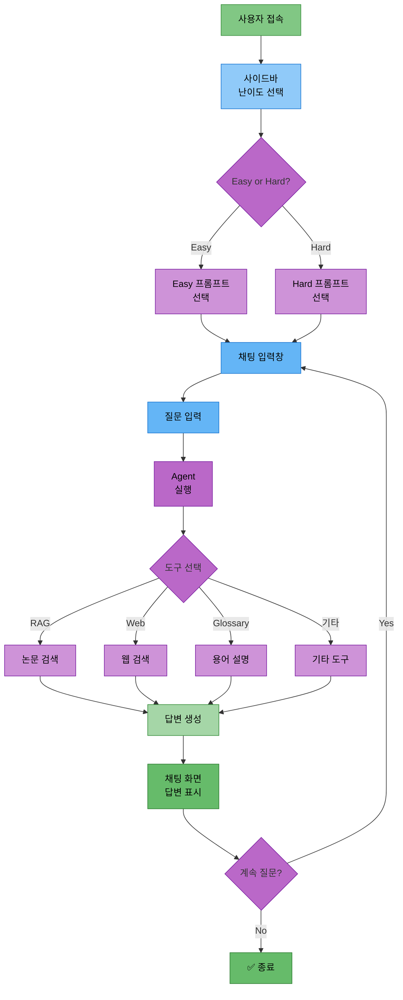
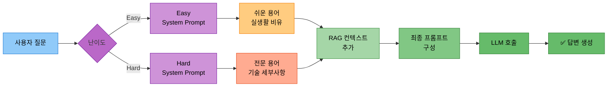

# 담당역할: 임예슬 - Streamlit UI & 프롬프트 & 웹검색/파일저장 도구

## 담당자 정보
- **이름**: 임예슬
- **역할**: UI 및 프롬프트 담당
- **참여 기간**: 전체 기간
- **핵심 역할**: Streamlit UI 개발, 프롬프트 템플릿, 웹 검색 도구, 파일 저장 도구

---

## 담당 모듈 및 도구

### 1. Streamlit UI (`ui/app.py`)
- 채팅 인터페이스 구현
- LangGraph Agent 스트리밍 연동 (astream_events)
- StreamlitCallbackHandler 구현
- 난이도 선택 UI (Easy/Hard)
- 대화 히스토리 표시 (ChatMessageHistory 연동)
- 파일 다운로드 기능

### 2. 프롬프트 템플릿 (`src/prompts/`)
- Langchain PromptTemplate 구현
- ChatPromptTemplate으로 Easy/Hard 모드 프롬프트 구성
- FewShotPromptTemplate (예시 기반 프롬프트, 선택)
- 도구별 프롬프트 (SystemMessage, HumanMessage)

### 3. 도구 2: 웹 검색 도구 (`src/tools/web_search.py`)
- Langchain TavilySearchResults 도구 연동
- @tool 데코레이터로 커스텀 웹 검색 래퍼 구현
- 검색 결과 포맷팅

### 4. 도구 5: 파일 저장 도구 (`src/tools/file_save.py`)
- Langchain @tool 데코레이터로 save_to_file 구현
- 대화 내용 저장
- 요약 내용 저장
- Streamlit 다운로드 버튼 연동

---

## UI 아키텍처 다이어그램

### 1. Streamlit UI 워크플로우



### 2. 프롬프트 선택 흐름



---

## Streamlit UI 구현 현황

### 기본 Streamlit UI (✅ 구현 완료)

**담당자**: 최현화

Streamlit 기본 UI는 **최현화**가 이미 구현 완료했습니다.
상세 내용은 [담당역할_01-3_최현화_Streamlit_UI_구현.md](담당역할_01-3_최현화_Streamlit_UI_구현.md)를 참조하세요.

**구현된 기능:**
- Streamlit 페이지 설정 및 기본 구조
- 난이도 선택 UI (사이드바)
- 다중 채팅 세션 관리 (ChatGPT 스타일)
- 다크 모드 토글
- LocalStorage 영속성 저장
- 채팅 히스토리 표시
- 사용자 입력 처리 및 Agent 실행
- 답변 복사/저장 기능
- StreamlitCallbackHandler 연동
- ExperimentManager 통합 로깅

---

## 임예슬 담당 - 미구현 기능

### 1. 스트리밍 응답 (고급)

**파일 경로**: `ui/app_streaming.py`

**구현 방법**:
1. StreamlitCallbackHandler 생성
   - st.container()를 전달하여 초기화
2. 응답을 표시할 placeholder 생성
   - st.empty()로 빈 컨테이너 생성
3. Agent 스트리밍 실행
   - agent.astream_events()로 비동기 이벤트 스트림 생성
   - question, difficulty 전달
4. 이벤트 처리
   - "on_chat_model_stream" 이벤트에서 청크 추출
   - 청크를 full_response에 누적
   - placeholder에 실시간으로 응답 업데이트 (커서 효과: "▌")
5. 최종 응답 표시
   - 스트리밍 완료 후 최종 응답 표시

---

## 프롬프트 템플릿 구현 (미구현)

### 1. Easy/Hard 모드 프롬프트

**파일 경로**: `src/prompts/templates.py`

**구현 방법**:
1. Langchain 프롬프트 모듈 임포트
   - ChatPromptTemplate, SystemMessagePromptTemplate, HumanMessagePromptTemplate, PromptTemplate
2. Easy 모드 시스템 프롬프트 정의
   - 전문 용어를 쉬운 말로 설명
   - 실생활 비유 사용
   - 수식 최소화 및 직관적 설명
   - 핵심 아이디어 3가지 이내로 요약
   - 초심자도 이해할 수 있는 언어 사용
3. Easy 모드 ChatPromptTemplate 생성
   - SystemMessage와 HumanMessage 조합
4. Hard 모드 시스템 프롬프트 정의
   - 기술적 세부사항 및 수식 포함
   - 알고리즘의 시간/공간 복잡도 분석
   - 관련 논문과의 비교 (장단점)
   - 구현 시 고려사항 설명
   - 최신 연구 동향과의 연결
5. Hard 모드 ChatPromptTemplate 생성
6. `get_difficulty_prompt` 함수 구현
   - 난이도에 따라 적절한 프롬프트 반환

### 2. RAG 프롬프트

**구현 방법**:
1. RAG_PROMPT_TEMPLATE을 ChatPromptTemplate으로 생성
2. SystemMessage에 다음 규칙 포함
   - 논문 리뷰 전문가 역할
   - 검색 결과의 내용을 기반으로 답변
   - 출처 명시 (논문 제목, 저자)
   - 검색 결과에 없는 내용은 추측하지 않음
   - 난이도 모드 반영
   - 검색 결과(context) 포함
3. HumanMessage에 사용자 질문 포함

### 3. Few-Shot 프롬프트 (선택)

**구현 방법**:
1. 예시 데이터 리스트 정의
   - Easy 모드 예시: "Transformer가 뭐야?" → 쉬운 설명
   - Hard 모드 예시: "Transformer의 시간 복잡도는?" → 기술적 설명
2. example_prompt 생성
   - PromptTemplate으로 question, difficulty, answer 포함
3. FewShotPromptTemplate 생성
   - examples: 예시 데이터
   - example_prompt: 예시 포맷
   - prefix: 도입 문구
   - suffix: 실제 질문 부분
   - input_variables: question, difficulty

### 예제 코드

```python
# src/prompts/templates.py

from langchain.prompts import (
    ChatPromptTemplate,
    SystemMessagePromptTemplate,
    HumanMessagePromptTemplate,
    PromptTemplate
)

# Easy 모드 시스템 프롬프트
EASY_SYSTEM_PROMPT = """
당신은 AI 초심자를 위한 친절한 논문 리뷰 어시스턴트입니다.

답변 규칙:
1. 전문 용어는 쉬운 말로 풀어서 설명하세요
2. 실생활 비유를 사용하세요
3. 수식은 최소화하고 직관적으로 설명하세요
4. 핵심 아이디어 3가지 이내로 요약하세요
5. 초심자도 이해할 수 있는 언어를 사용하세요
"""

# Hard 모드 시스템 프롬프트
HARD_SYSTEM_PROMPT = """
당신은 AI 전문가를 위한 기술적인 논문 리뷰 어시스턴트입니다.

답변 규칙:
1. 기술적 세부사항 및 수식을 포함하세요
2. 알고리즘의 시간/공간 복잡도를 분석하세요
3. 관련 논문과의 비교 (장단점)를 제시하세요
4. 구현 시 고려사항을 설명하세요
5. 최신 연구 동향과의 연결을 제공하세요
"""

# Easy 모드 ChatPromptTemplate
EASY_CHAT_PROMPT = ChatPromptTemplate.from_messages([
    SystemMessagePromptTemplate.from_template(EASY_SYSTEM_PROMPT),
    HumanMessagePromptTemplate.from_template("{question}")
])

# Hard 모드 ChatPromptTemplate
HARD_CHAT_PROMPT = ChatPromptTemplate.from_messages([
    SystemMessagePromptTemplate.from_template(HARD_SYSTEM_PROMPT),
    HumanMessagePromptTemplate.from_template("{question}")
])

# RAG 프롬프트
RAG_PROMPT_TEMPLATE = """
당신은 논문 리뷰 전문가입니다.

아래 논문 내용을 참고하여 사용자의 질문에 답변해주세요.

[참고 논문]
{context}

[사용자 질문]
{question}

[답변 규칙]
- 참고 논문의 내용을 기반으로 답변하세요
- 출처를 명시하세요 (논문 제목, 저자)
- 논문에 없는 내용은 추측하지 마세요
- 난이도: {difficulty} 모드

답변:
"""

RAG_CHAT_PROMPT = ChatPromptTemplate.from_template(RAG_PROMPT_TEMPLATE)

def get_difficulty_prompt(difficulty):
    """난이도에 따라 적절한 프롬프트 반환"""
    if difficulty == "easy":
        return EASY_CHAT_PROMPT
    else:
        return HARD_CHAT_PROMPT
```

---

## 도구 2: 웹 검색 도구 (✅ 구현 완료)

**파일 경로**: `src/tools/web_search.py`

**담당자**: 최현화

웹 검색 도구는 이미 구현 완료되었습니다.

**구현된 기능:**
- Tavily API 기반 웹 검색
- arXiv 논문 자동 저장
- 난이도별 프롬프트 적용
- 검색 결과 LLM 정리

---

## 도구 5: 파일 저장 도구

### 기능 설명
대화 내용, 논문 요약, 참고 자료를 파일로 저장하는 도구

### Langchain 구현

#### 1. 텍스트 파일 저장

**파일 경로**: `src/tools/file_save.py`

**구현 방법**:
1. `save_to_file` 함수를 @tool 데코레이터로 정의
   - 인자: content (저장할 내용), filename (선택적)
2. 파일명이 없으면 타임스탬프 기반으로 자동 생성
3. output_dir (data/outputs) 생성
4. 파일 경로 생성 및 파일 저장
5. 저장 성공 메시지 반환

#### 2. Markdown 형식 저장

**구현 방법**:
1. `save_to_markdown` 함수를 @tool 데코레이터로 정의
   - 인자: content, title, filename (선택적)
2. 파일명이 없으면 타임스탬프 기반으로 자동 생성
3. Markdown 형식으로 content 포맷팅
   - 제목, 생성일, 내용, 푸터 포함
4. output_dir 생성 및 파일 저장
5. 저장 성공 메시지 반환

#### 3. Streamlit 다운로드 버튼 연동

**파일 경로**: `ui/app.py` (파일 저장 UI)

**구현 방법**:
1. 사이드바에 파일 저장 섹션 추가
2. st.radio()로 저장 내용 선택 ("대화 내용" 또는 "마지막 답변만")
3. "파일 저장" 버튼 구현
4. 선택된 옵션에 따라 content 생성
   - "대화 내용": 전체 messages를 순회하며 텍스트 생성
   - "마지막 답변만": assistant 역할의 마지막 메시지 추출
5. save_to_file.invoke()로 파일 저장
6. st.download_button()으로 다운로드 버튼 생성
   - 타임스탬프 기반 파일명
   - MIME 타입: text/plain

### 사용하는 DB
**DB 사용 없음** (파일 시스템 직접 접근)

### 예제 코드

```python
# src/tools/file_save.py

from langchain.tools import tool
import os
from datetime import datetime

@tool
def save_to_file(content: str, filename: str = None) -> str:
    """
    내용을 텍스트 파일로 저장합니다.

    Args:
        content: 저장할 내용
        filename: 파일명 (선택, 없으면 자동 생성)

    Returns:
        저장된 파일 경로
    """
    # 파일명이 없으면 타임스탬프 기반으로 자동 생성
    if filename is None:
        timestamp = datetime.now().strftime("%Y%m%d_%H%M%S")
        filename = f"paper_review_{timestamp}.txt"

    # data/outputs 폴더에 저장
    output_dir = "data/outputs"
    os.makedirs(output_dir, exist_ok=True)

    filepath = os.path.join(output_dir, filename)

    # 파일 저장
    with open(filepath, "w", encoding="utf-8") as f:
        f.write(content)

    return f"파일이 저장되었습니다: {filepath}"


@tool
def save_to_markdown(content: str, title: str = "논문 리뷰", filename: str = None) -> str:
    """
    내용을 Markdown 형식으로 저장합니다.

    Args:
        content: 저장할 내용
        title: 문서 제목
        filename: 파일명 (선택, 없으면 자동 생성)

    Returns:
        저장된 파일 경로
    """
    # 파일명이 없으면 타임스탬프 기반으로 자동 생성
    if filename is None:
        timestamp = datetime.now().strftime("%Y%m%d_%H%M%S")
        filename = f"paper_review_{timestamp}.md"

    # Markdown 형식으로 포맷팅
    markdown_content = f"# {title}\n\n"
    markdown_content += f"**생성일**: {datetime.now().strftime('%Y-%m-%d %H:%M:%S')}\n\n"
    markdown_content += "---\n\n"
    markdown_content += content
    markdown_content += "\n\n---\n\n"
    markdown_content += "*이 문서는 논문 리뷰 챗봇에서 자동 생성되었습니다.*\n"

    # data/outputs 폴더에 저장
    output_dir = "data/outputs"
    os.makedirs(output_dir, exist_ok=True)

    filepath = os.path.join(output_dir, filename)

    # 파일 저장
    with open(filepath, "w", encoding="utf-8") as f:
        f.write(markdown_content)

    return f"Markdown 파일이 저장되었습니다: {filepath}"


# Streamlit UI와 연동 (ui/app.py에 추가)
def add_file_download_to_sidebar():
    """사이드바에 파일 다운로드 기능 추가"""
    import streamlit as st

    with st.sidebar:
        st.markdown("---")
        st.markdown("### 파일 저장")

        # 저장 내용 선택
        save_option = st.radio(
            "저장할 내용",
            ["대화 내용", "마지막 답변만"]
        )

        if st.button("파일 저장"):
            # 대화 내용 텍스트로 변환
            if save_option == "대화 내용":
                conversation_text = ""
                for msg in st.session_state.messages:
                    role = "사용자" if msg["role"] == "user" else "AI"
                    conversation_text += f"[{role}]\n{msg['content']}\n\n"

                content = conversation_text
            else:
                # 마지막 assistant 메시지 찾기
                last_assistant_msg = None
                for msg in reversed(st.session_state.messages):
                    if msg["role"] == "assistant":
                        last_assistant_msg = msg["content"]
                        break

                content = last_assistant_msg if last_assistant_msg else "저장할 내용이 없습니다."

            # 파일명 생성
            timestamp = datetime.now().strftime("%Y%m%d_%H%M%S")
            filename = f"conversation_{timestamp}.txt"

            # st.download_button으로 다운로드 제공
            st.download_button(
                label="다운로드",
                data=content,
                file_name=filename,
                mime="text/plain"
            )

            st.success("다운로드 준비 완료!")
```

---

## LangGraph 통합 (웹 검색/파일 저장 노드)

**파일 경로**: `src/agent/nodes.py`

### 1. 웹 검색 노드

**구현 방법**:
1. `web_search_node` 함수 정의
   - 인자: state (AgentState)
2. state에서 질문 추출
3. 웹 검색 도구 호출
   - search_latest_papers.invoke()로 검색 수행
4. 검색 결과를 state["tool_result"]에 저장
5. 프롬프트 구성
   - 검색 결과와 사용자 질문 포함
6. LLM 호출하여 최종 답변 생성
   - SystemMessage: "당신은 최신 AI/ML 정보를 제공하는 전문가입니다."
   - HumanMessage: 프롬프트
7. 최종 답변을 state["final_answer"]에 저장 후 반환

### 2. 파일 저장 노드

**구현 방법**:
1. `save_file_node` 함수 정의
   - 인자: state (AgentState)
2. state에서 이전 답변(final_answer) 추출
3. 답변이 있으면 파일 저장 도구 호출
   - save_to_file.invoke()로 저장 수행
   - 저장 결과를 state["final_answer"]에 저장
4. 답변이 없으면 "저장할 내용이 없습니다." 메시지 반환
5. state 반환

---

## 개발 일정

### Phase 1: Streamlit UI 기초 개발
- 기본 채팅 인터페이스 구현
- 난이도 선택 UI
- 대화 히스토리 표시
- StreamlitCallbackHandler 연동

### Phase 2: 프롬프트 템플릿 개발
- Easy/Hard 모드 프롬프트
- RAG 프롬프트
- FewShotPromptTemplate (선택)

### Phase 3: 도구 개발
- 웹 검색 도구 (TavilySearchResults)
- 파일 저장 도구
- Streamlit 다운로드 버튼 연동

### Phase 4: 스트리밍 및 최적화
- 스트리밍 응답 구현
- UI 디자인 개선
- 통합 테스트

---

## Feature 브랜치

**4단계: UI 및 프롬프트 구현 (임예슬)**
- `4-1. feature/prompts` - 프롬프트 템플릿
- `4-2. feature/tool-web-search` - 웹 검색 도구
- `4-3. feature/tool-file-save` - 파일 저장 도구
- `4-4. feature/streamlit-ui` - Streamlit UI

---

## 테스트 코드

**파일 경로**: `tests/test_tools.py`

### 테스트 항목

1. **test_web_search**: 웹 검색 도구 테스트
   - search_latest_papers.invoke() 호출 (query: "transformer 2025")
   - 반환 결과에 "검색 결과" 텍스트가 포함되어 있는지 확인
   - 결과가 비어있지 않은지 확인

2. **test_file_save**: 파일 저장 도구 테스트
   - save_to_file.invoke() 호출 (content: "테스트 내용입니다.", filename: "test_file.txt")
   - 반환 결과에 "저장되었습니다" 텍스트가 포함되어 있는지 확인
   - 파일이 실제로 생성되었는지 확인 (data/outputs/test_file.txt)

---

## 로깅 및 실험 추적 관리

### ExperimentManager 사용

**중요**: 모든 챗봇 세션은 ExperimentManager 클래스를 사용해야 합니다.

**파일 경로**: `src/utils/experiment_manager.py`

**사용 방법**:
1. Streamlit 세션 상태로 ExperimentManager 관리
   - Streamlit 앱 시작 시 ExperimentManager 초기화
   ```python
   from src.utils.experiment_manager import ExperimentManager
   import streamlit as st

   # 세션 상태에 ExperimentManager 초기화
   if "exp_manager" not in st.session_state:
       st.session_state.exp_manager = ExperimentManager()
       st.session_state.exp_manager.__enter__()
       # 자동으로 다음 작업 수행:
       # 1. experiments/20251031/20251031_103015_session_001/ 생성
       # 2. Session ID 자동 부여 (session_001, 002...)
       # 3. chatbot.log 파일 생성
       # 4. 7개 서브 폴더 생성 (tools/, database/, prompts/, ui/, outputs/, evaluation/, debug/)
       # 5. metadata.json 초기화
       # 6. Logger 초기화
   ```

2. 세션 폴더 구조
   ```
   experiments/
   └── 20251031/
       ├── 20251031_103015_session_001/
       │   ├── chatbot.log          # 챗봇 실행 로그
       │   ├── metadata.json        # 세션 메타데이터
       │   ├── tools/               # 도구 실행 로그
       │   ├── database/            # DB 쿼리 로그
       │   ├── prompts/             # 프롬프트 저장
       │   │   └── prompts.json
       │   ├── ui/                  # UI 스크린샷
       │   │   └── ui.log
       │   ├── outputs/             # 최종 답변 저장
       │   ├── evaluation/          # 평가 지표
       │   └── debug/               # 디버그 로그
       └── 20251031_103520_session_002/
           └── ...
   ```

3. UI 로깅
   - `st.session_state.exp_manager.logger`: 챗봇 실행 로그 (`chatbot.log`)
   - `st.session_state.exp_manager.ui_logger`: UI 이벤트 로그 (`ui/ui.log`)
   - 예: `st.session_state.exp_manager.logger.write(f"질문: {prompt}")`

4. 추가 기능
   - 프롬프트 저장: `exp_manager.save_prompt(prompt_text, "user_question")`
   - 답변 저장: `exp_manager.save_output(answer, "assistant_answer")`
   - UI 이벤트 로그: `exp_manager.ui_logger.write("사용자 버튼 클릭")`

### 실험 폴더 구조

상세 내용은 [실험_폴더_구조.md](../rules/실험_폴더_구조.md) 참조

---

## 참고 PRD 문서

개발 시 반드시 참고해야 할 PRD 문서 목록:

### 필수 참고 문서
1. [01_프로젝트_개요.md](../PRD/01_프로젝트_개요.md) - 프로젝트 전체 개요
2. [02_프로젝트_구조.md](../PRD/02_프로젝트_구조.md) - 폴더 구조 (ui/)
3. [05_로깅_시스템.md](../PRD/05_로깅_시스템.md) ⭐ - Logger 사용법
4. [06_실험_추적_관리.md](../PRD/06_실험_추적_관리.md) ⭐ - ExperimentManager 및 Session 폴더 구조
5. [14_LLM_설정.md](../PRD/14_LLM_설정.md) - LLM 선택 및 에러 핸들링
6. [15_프롬프트_엔지니어링.md](../PRD/15_프롬프트_엔지니어링.md) - Easy/Hard 프롬프트 템플릿
7. [16_UI_설계.md](../PRD/16_UI_설계.md) - Streamlit 구현 가이드

### 참고 문서
- [03_브랜치_전략.md](../PRD/03_브랜치_전략.md) - Feature 브랜치
- [04_일정_관리.md](../PRD/04_일정_관리.md) - 개발 일정
- [12_AI_Agent_설계.md](../PRD/12_AI_Agent_설계.md) - Agent 연동
- [담당역할_01-1_최현화_실험_관리_시스템.md](담당역할_01-1_최현화_실험_관리_시스템.md) - ExperimentManager 클래스 상세 구현
- [담당역할_01-2_최현화_로깅_모니터링.md](담당역할_01-2_최현화_로깅_모니터링.md) - 로깅 및 모니터링 시스템
- [실험_폴더_구조.md](../rules/실험_폴더_구조.md) - 실험 폴더 구조 최종안

---

## 참고 자료

- Streamlit 공식 문서: https://docs.streamlit.io/
- Streamlit Chat Elements: https://docs.streamlit.io/library/api-reference/chat
- Langchain Prompts: https://python.langchain.com/docs/modules/model_io/prompts/
- Langchain Callbacks: https://python.langchain.com/docs/modules/callbacks/
- TavilySearchResults: https://python.langchain.com/docs/integrations/tools/tavily_search/
- StreamlitCallbackHandler: https://python.langchain.com/docs/integrations/callbacks/streamlit

