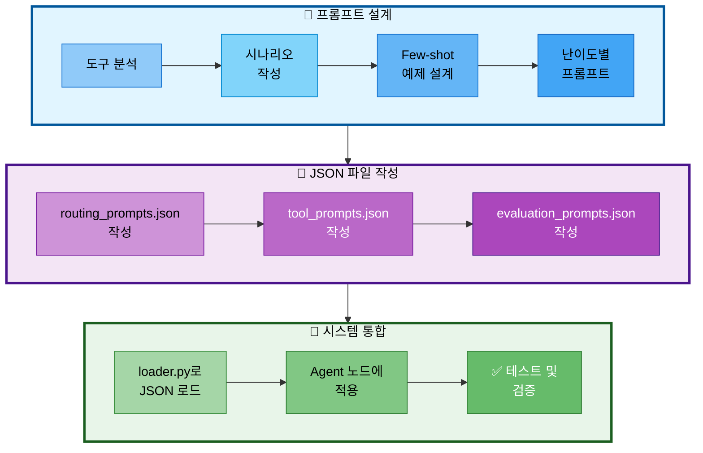

# 담당역할: 임예슬 - 프롬프트 엔지니어링

## 문서 정보
- **작성자**: 최현화[팀장]

## 담당자 정보
- **이름**: 임예슬
- **역할**: 프롬프트 엔지니어링 전담
- **참여 기간**: 전체 기간
- **핵심 역할**: AI Agent 도구 라우팅 프롬프트, 도구별 프롬프트, 평가 프롬프트, 질문 생성 프롬프트

---

## 📌 문서 목적

이 문서는 **프롬프트 엔지니어링에만 집중**합니다.

### 구현 완료된 기능 (다른 담당자)
- ✅ **Streamlit UI** - 최현화 ([담당역할_01-3_최현화_Streamlit_UI_구현.md](담당역할_01-3_최현화_Streamlit_UI_구현.md))
- ✅ **웹 검색 도구** - 최현화
- ✅ **파일 다운로드 기능** - 최현화
- ✅ **LangGraph 노드** - 최현화 & 임예슬 ([담당역할_06_통합_LangGraph_스트리밍.md](담당역할_06_통합_LangGraph_스트리밍.md))

### 임예슬 담당 - 프롬프트 엔지니어링
- ⭐ **AI Agent 도구 라우팅 프롬프트** (최우선순위)
- 도구별 프롬프트 (일반 답변, 웹 검색, 논문 검색, 용어집, 요약, 파일 저장)
- 평가 프롬프트 (LLM-as-a-Judge)
- 질문 생성 프롬프트
- JSON 프롬프트 파일 작성 (prompts/ 폴더)

### 최현화 담당 - 프롬프트 로더 적용
- ✅ **Prompt Loader 초기 구현 완료** (`src/prompts/loader.py`)
- ⭐ **기존 코드에 Prompt JSON 파일 적용** (우선순위 높음)
  - router_node에 JSON 프롬프트 적용
  - 6개 도구 노드에 JSON 프롬프트 적용
  - 하드코딩된 프롬프트 제거

---

## 프롬프트 시스템 아키텍처

### 프롬프트 작업 흐름



**프롬프트 작업 흐름 설명:**
- **설계 단계**: 각 도구의 역할 분석, 사용 시나리오 정의, Few-shot 예제 설계, 난이도별 프롬프트 작성
- **파일 작성 단계**: routing_prompts.json, tool_prompts.json, evaluation_prompts.json 순서로 JSON 파일 작성
- **통합 단계**: loader.py로 JSON 로드, Agent 노드에 적용, 테스트 및 검증

---

## 1. 프롬프트 엔지니어링 개요

### 1.1 프로젝트에서 프롬프트의 역할

**프롬프트가 사용되는 위치:**
1. **도구 라우팅** (`src/agent/nodes.py:router_node`) - 가장 중요!
2. **도구별 시스템 프롬프트** (각 도구 노드)
3. **평가 프롬프트** (`src/evaluation/evaluator.py`)
4. **질문 생성 프롬프트** (자동 질문 생성)

### 1.2 멘토님 인사이트 반영

**멘토링(2025-10-30)에서 강조된 프롬프트 전략:**

1. **도구 설명 상세화**
   - 각 도구의 역할과 사용 시나리오를 명확하게 기재
   - 키워드 리스트 제공

2. **Few-shot 예시**
   - 각 도구별 2-3개의 대표 예시 제공
   - LLM이 패턴을 학습하도록 지원

3. **시나리오 템플릿**
   - 예상되는 질문 패턴을 미리 정의
   - 조건문 명확화 ("만약 ~이면 A 도구 사용")

4. **구조화된 출력**
   - JSON 형식으로 일관된 응답 요청
   - 파싱 오류 최소화

5. **재라우팅 및 Fallback**
   - 잘못된 도구 선택 시 다시 라우팅
   - 하지만 **프롬프팅을 잘해서 처음부터 정확한 도구 선택이 더 중요**

---

## 2. AI Agent 도구 라우팅 프롬프트 ⭐⭐⭐

### 2.1 라우팅 프롬프트의 중요성

**AI Agent의 핵심은 도구 라우팅입니다!**

- 사용자 질문을 정확하게 분석하여 6개 도구 중 가장 적절한 도구 선택
- **라우팅 정확도 = Agent 성능**
- 잘못된 도구 선택 시 답변 품질 저하

### 2.2 6개 도구 목록

1. **general** - 일반 답변 (비교, 설명, 개념 질문)
2. **search_paper** - 논문 데이터베이스 검색 (특정 논문)
3. **web_search** - 웹 검색 (최신 정보, 트렌드)
4. **glossary** - 용어집 (단일 용어 정의만)
5. **summarize** - 논문 요약
6. **save_file** - 파일 저장

### 2.3 라우팅 프롬프트 (상세 버전)

**파일 경로**: `src/prompts/routing_prompts.json`

**현재 위치**: `src/agent/nodes.py:router_node` (하드코딩됨)

**개선된 라우팅 프롬프트:**

```
당신은 사용자 질문을 분석하여 가장 적절한 도구를 선택하는 전문가입니다.

[도구 목록 및 사용 시나리오]

1. **search_paper** (논문 데이터베이스 검색)
   - 사용 시기: 특정 논문 내용, 연구 방법, 알고리즘 검색
   - 키워드: "논문", "연구", "방법", "알고리즘", "찾아줘", "검색", "데이터베이스"
   - 예시:
     * "RAG에 대한 논문 찾아줘"
     * "Transformer 연구 방법 알려줘"
     * "BERT 논문 검색"
   - ❌ 최신 정보는 web_search 사용

2. **web_search** (웹 검색)
   - 사용 시기: 최신 정보, 뉴스, 트렌드, 실시간 검색
   - 키워드: "최신", "2024년", "2025년", "뉴스", "트렌드", "최근"
   - 예시:
     * "최신 AI 뉴스"
     * "2024년 논문 트렌드"
     * "최근 Transformer 발전"
   - ❌ 특정 논문은 search_paper 사용

3. **glossary** (용어집 - 단일 용어 정의만)
   - 사용 시기: 하나의 전문 용어 정의와 설명
   - 키워드: "뭐야", "무엇", "정의", "설명해줘", "의미"
   - 예시:
     * "BERT가 뭐야?"
     * "Attention 설명해줘"
     * "RAG의 정의는?"
   - ❌ 비교 질문은 general 사용 ("A와 B의 차이")
   - ❌ 두 개 이상 용어는 general 사용

4. **summarize** (논문 요약)
   - 사용 시기: 논문 전체 또는 특정 섹션 요약
   - 키워드: "요약", "핵심", "간단히", "정리", "요약해줘"
   - 예시:
     * "이 논문 요약해줘"
     * "Attention Is All You Need 핵심 내용"
     * "논문 간단히 정리해줘"

5. **save_file** (파일 저장)
   - 사용 시기: 대화 내용이나 결과를 파일로 저장
   - 키워드: "저장", "다운로드", "파일", "내보내기"
   - 예시:
     * "파일로 저장해줘"
     * "대화 내용 다운로드"
     * "결과 저장"

6. **general** (일반 답변 - 기본 도구)
   - 사용 시기:
     * 비교 질문 ("A와 B의 차이")
     * 개념 설명 ("어떻게 작동해?")
     * 인사, 감사 ("안녕", "고마워")
     * 위의 특수 도구에 해당하지 않는 모든 경우
   - 키워드: "차이", "비교", "vs", "구별", "설명", "어떻게"
   - 예시:
     * "BERT와 GPT의 차이는?"
     * "Transformer가 RNN보다 나은 이유는?"
     * "안녕하세요"

[중요한 규칙]
- **비교 질문** ("차이", "vs", "비교", "구별") → general
- **두 개 이상의 용어** → general (glossary는 단일 용어만!)
- **최신 정보** ("최신", "2024년", "최근") → web_search
- **특정 논문** ("논문 찾아줘", "논문 검색") → search_paper
- **단일 용어 정의** ("~가 뭐야", "~의 정의") → glossary
- **요약** ("요약해줘", "핵심 내용") → summarize
- **파일 저장** ("저장", "다운로드") → save_file

[선택 규칙]
- 위 6개 도구 중 **하나만** 선택
- 도구 이름만 반환 (예: search_paper)
- 키워드와 사용 시나리오를 기준으로 판단
- 애매한 경우 general 선택

[사용자 질문]
{question}

[선택한 도구]
하나의 도구 이름만 반환하세요:
```

### 2.4 routing_prompts.json 파일 구조

**파일 경로**: `prompts/routing_prompts.json`

**목적**: 사용자 질문을 분석하여 가장 적절한 도구(tool)를 선택하는 라우팅 시스템의 프롬프트

**필수 필드:**

| 필드명 | 타입 | 설명 |
|--------|------|------|
| `routing_prompt` | string | 전체 라우팅 프롬프트 텍스트 (도구 목록, 사용 시나리오, 키워드, 선택 규칙 포함) |
| `few_shot_examples` | array | Few-shot 학습 예시 배열 (10-13개 권장) |

**few_shot_examples 배열의 각 항목 구조:**

| 필드명 | 타입 | 필수 | 설명 |
|--------|------|------|------|
| `question` | string | ✅ | 사용자 질문 예시 |
| `tool` | string | ✅ | 선택되어야 할 도구 이름 (search_paper, web_search, glossary, summarize, save_file, text2sql, general 중 하나) |
| `reason` | string | ✅ | 해당 도구를 선택한 이유 |

**작성 가이드:**
- `routing_prompt`: 7개 도구별로 사용 시기, 키워드, 예시, 주의사항을 명확히 기술
- Few-shot 예시는 각 도구당 최소 1-2개씩 균등하게 분배
- text2sql 도구의 경우 "개수", "순위", "Top", "통계" 등의 키워드를 반드시 포함
- 혼동하기 쉬운 케이스(예: glossary vs general) 구분 예시 필수 포함

**Few-shot 프롬프트 적용 방법:**

**필요 라이브러리**:
- `langchain.prompts.FewShotPromptTemplate`
- `langchain.prompts.PromptTemplate`
- `json`

**구현 단계**:

| 단계 | 작업 | 설명 |
|-----|------|------|
| 1 | JSON 파일 로드 | routing_prompts.json에서 few_shot_examples 로드 |
| 2 | 예시 템플릿 정의 | PromptTemplate with input_variables: question, tool, reason |
| 3 | Few-shot 프롬프트 생성 | FewShotPromptTemplate 생성 (examples, example_prompt, prefix, suffix) |

**FewShotPromptTemplate 파라미터**:

| 파라미터 | 값 | 설명 |
|---------|---|------|
| examples | few_shot_examples[:5] | 상위 5개 예시 사용 |
| example_prompt | PromptTemplate 인스턴스 | 예시 형식 템플릿 |
| prefix | routing_data["routing_prompt"] | 라우팅 프롬프트 전체 텍스트 |
| suffix | "질문: {question}\n도구:" | 사용자 질문 후 도구 선택 요청 |
| input_variables | ["question"] | 입력 변수 |

### 2.5 재라우팅 및 Fallback 처리

**잘못된 도구 선택 시 재시도 로직:**

**함수명**: `route_with_fallback`

**역할**: 재라우팅 및 Fallback 지원 라우팅 함수

**파라미터**:

| 파라미터 | 타입 | 설명 |
|---------|------|------|
| state | AgentState | 에이전트 상태 (question, retry_count 포함) |
| exp_manager | ExperimentManager | 실험 관리 인스턴스 (로깅용) |

**반환값**: `str` - 선택된 도구 이름

**처리 흐름**:

| 단계 | 작업 | 설명 |
|-----|------|------|
| 1 | 상태 추출 | question 및 retry_count 가져오기 |
| 2 | 유효 도구 목록 정의 | ["search_paper", "web_search", "glossary", "summarize", "save_file", "general"] |
| 3 | LLM 호출 | LLMClient로 라우팅 프롬프트 실행 |
| 4 | 응답 파싱 | 첫 번째 단어만 추출 (도구 이름) |
| 5 | 유효성 검증 | tool_choice가 valid_tools에 있는지 확인 |
| 6 | 재시도 로직 | retry_count < 2이면 재귀 호출 |
| 7 | Fallback 처리 | 재시도 초과 시 "general" 반환 |
| 8 | 오류 처리 | Exception 발생 시 "general" 반환 (Fallback) |

**로깅**:
- 잘못된 도구 선택 시: "잘못된 도구 선택: {tool_choice}"
- Fallback 실행 시: "Fallback: general 도구 사용"
- 오류 발생 시: "라우팅 실패: {e}"

---

## 3. 도구별 프롬프트

### 3.1 tool_prompts.json 파일 구조

**파일 경로**: `prompts/tool_prompts.json`

**목적**: 7가지 도구별 시스템 프롬프트 및 사용자 프롬프트 템플릿 관리

**최상위 구조:**

각 도구는 `{tool_name}_prompts` 형태의 키를 가집니다:
- `general_answer_prompts`
- `web_search_prompts`
- `summarize_prompts`
- `glossary_prompts`
- `search_paper_prompts`
- `save_file_prompts`
- `text2sql_prompts`

#### 3.1.1 일반 답변 프롬프트 (general_answer_prompts)

**난이도별 구조:**

| 필드 경로 | 타입 | 필수 | 설명 |
|----------|------|------|------|
| `general_answer_prompts.easy.system_prompt` | string | ✅ | Easy 모드 시스템 프롬프트 (초심자용 설명 규칙) |
| `general_answer_prompts.easy.examples` | array | ⚪ | Few-shot 예시 배열 (선택적) |
| `general_answer_prompts.hard.system_prompt` | string | ✅ | Hard 모드 시스템 프롬프트 (전문가용 설명 규칙) |
| `general_answer_prompts.hard.examples` | array | ⚪ | Few-shot 예시 배열 (선택적) |

**작성 가이드:**
- Easy: 비유, 일상 언어, 핵심 3가지 이내
- Hard: 전문 용어, 시간/공간 복잡도, 논문 비교

#### 3.1.2 웹 검색 프롬프트 (web_search_prompts)

**난이도별 구조:**

| 필드 경로 | 타입 | 필수 | 설명 |
|----------|------|------|------|
| `web_search_prompts.easy.system_prompt` | string | ✅ | Easy 모드 시스템 프롬프트 |
| `web_search_prompts.easy.user_prompt_template` | string | ✅ | Easy 모드 사용자 프롬프트 템플릿 (변수: {formatted_results}, {question}) |
| `web_search_prompts.hard.system_prompt` | string | ✅ | Hard 모드 시스템 프롬프트 |
| `web_search_prompts.hard.user_prompt_template` | string | ✅ | Hard 모드 사용자 프롬프트 템플릿 |

**작성 가이드:**
- 반드시 URL 출처 명시 규칙 포함
- user_prompt_template에 {formatted_results}와 {question} 변수 사용

#### 3.1.3 논문 요약 프롬프트 (summarize_prompts)

**구조:**

| 필드 경로 | 타입 | 필수 | 설명 |
|----------|------|------|------|
| `summarize_prompts.title_extraction.template` | string | ✅ | 논문 제목 추출용 프롬프트 템플릿 (변수: {question}) |
| `summarize_prompts.easy.system_prompt` | string | ✅ | Easy 모드 요약 시스템 프롬프트 |
| `summarize_prompts.easy.summary_template` | string | ✅ | Easy 모드 요약 템플릿 (변수: {system_prompt}, {title}, {authors}, {publish_date}, {abstract}, {combined_text}) |
| `summarize_prompts.hard.system_prompt` | string | ✅ | Hard 모드 요약 시스템 프롬프트 |
| `summarize_prompts.hard.summary_template` | string | ✅ | Hard 모드 요약 템플릿 |

**작성 가이드:**
- title_extraction: 논문 제목만 추출하도록 명확히 지시
- summary_template: 논문 정보(제목, 저자, 날짜, 초록)와 본문({combined_text})을 반영

#### 3.1.4 용어집 프롬프트 (glossary_prompts)

**난이도별 구조:**

| 필드 경로 | 타입 | 필수 | 설명 |
|----------|------|------|------|
| `glossary_prompts.easy.system_prompt` | string | ✅ | Easy 모드 용어 설명 프롬프트 (실생활 비유 사용) |
| `glossary_prompts.hard.system_prompt` | string | ✅ | Hard 모드 용어 설명 프롬프트 (수식, 알고리즘 포함) |

**작성 가이드:**
- 단일 용어 정의에 특화
- Easy: 비유, 간단한 핵심 설명
- Hard: 수식, 논문 언급, 기술적 세부사항

#### 3.1.5 논문 검색 프롬프트 (search_paper_prompts)

**난이도별 구조:**

| 필드 경로 | 타입 | 필수 | 설명 |
|----------|------|------|------|
| `search_paper_prompts.easy.system_prompt` | string | ✅ | Easy 모드 검색 결과 정리 프롬프트 |
| `search_paper_prompts.hard.system_prompt` | string | ✅ | Hard 모드 검색 결과 정리 프롬프트 |

**작성 가이드:**
- 논문 제목, 저자, 발행일 명시 필수
- Hard: 방법론 분석, 기여도와 한계점 포함

#### 3.1.6 파일 저장 프롬프트 (save_file_prompts)

**구조:**

| 필드 경로 | 타입 | 필수 | 설명 |
|----------|------|------|------|
| `save_file_prompts.confirmation_message` | string | ✅ | 저장 준비 완료 메시지 |
| `save_file_prompts.success_message` | string | ✅ | 저장 성공 메시지 (변수: {filepath}) |
| `save_file_prompts.error_message` | string | ✅ | 저장 실패 메시지 (변수: {error}) |

**작성 가이드:**
- 사용자에게 저장 상태를 명확히 전달
- success_message와 error_message에 변수 placeholder 포함

#### 3.1.7 Text-to-SQL 프롬프트 (text2sql_prompts)

**난이도별 구조:**

| 필드 경로 | 타입 | 필수 | 설명 |
|----------|------|------|------|
| `text2sql_prompts.easy.system_prompt` | string | ✅ | Easy 모드 통계 결과 정리 프롬프트 |
| `text2sql_prompts.easy.user_prompt_template` | string | ✅ | Easy 모드 사용자 프롬프트 템플릿 (변수: {db_results}, {question}) |
| `text2sql_prompts.hard.system_prompt` | string | ✅ | Hard 모드 데이터 분석 프롬프트 |
| `text2sql_prompts.hard.user_prompt_template` | string | ✅ | Hard 모드 사용자 프롬프트 템플릿 |

**작성 가이드:**
- 통계 정보를 표나 목록으로 정리하도록 지시
- Easy: 간단한 설명, 보기 쉬운 형식
- Hard: 추세 분석, 패턴 인사이트, 추가 통계 계산

---

## 4. 평가 프롬프트 (LLM-as-a-Judge)

### 4.1 답변 품질 평가 프롬프트

**파일 경로**: `src/evaluation/evaluator.py`

**목적**: 챗봇의 답변 품질을 자동으로 평가

**평가 항목:**
1. **정확도** (0-10점): 논문 내용과 일치하는지
2. **관련성** (0-10점): 질문과 답변이 관련있는지
3. **난이도 적합성** (0-10점): Easy/Hard 모드에 맞는지
4. **출처 명시** (0-10점): 논문 제목, 저자 명시 여부

**파일 경로**: `prompts/evaluation_prompts.json`

**최상위 필드 구조:**

| 필드명 | 타입 | 설명 |
|--------|------|------|
| `evaluation_prompt` | object | 메인 평가 프롬프트 템플릿 |
| `evaluation_criteria` | object | 4가지 평가 기준 상세 설명 |
| `evaluation_examples` | array | Few-shot 평가 예시 (3개 권장) |
| `quality_assurance` | object | 일관성 검증 규칙 |
| `scorer_guidelines` | object | 평가자 가이드라인 |

**evaluation_prompt 객체 구조:**

| 필드명 | 타입 | 필수 | 설명 |
|--------|------|------|------|
| `template` | string | ✅ | 전체 평가 프롬프트 텍스트 (평가 기준, 점수 척도, JSON 반환 형식 포함) |
| `input_variables` | array | ✅ | 템플릿 변수 리스트: ["question", "answer", "reference_docs", "difficulty"] |

**evaluation_criteria 객체 구조 (4개 기준):**

각 기준(accuracy, relevance, difficulty, citation)마다 다음 구조:

| 필드명 | 타입 | 필수 | 설명 |
|--------|------|------|------|
| `name` | string | ✅ | 한글 기준 이름 (예: "정확도", "관련성") |
| `weight` | number | ✅ | 가중치 (합계 1.0, 예: 0.3) |
| `description` | string | ✅ | 기준 설명 |
| `key_questions` | array | ✅ | 핵심 체크리스트 질문 (3개) |

**evaluation_examples 배열 구조:**

각 예시 항목마다 다음 필드 포함:

| 필드명 | 타입 | 필수 | 설명 |
|--------|------|------|------|
| `question` | string | ✅ | 예시 사용자 질문 |
| `answer` | string | ✅ | 예시 AI 답변 |
| `reference_docs` | string | ✅ | 참고 논문 정보 |
| `difficulty` | string | ✅ | 난이도 ("easy" 또는 "hard") |
| `expected_evaluation` | object | ✅ | 기대 평가 결과 (accuracy_score, accuracy_reason, relevance_score, relevance_reason, difficulty_score, difficulty_reason, citation_score, citation_reason, total_score, overall_comment, strengths, weaknesses 포함) |

**quality_assurance 객체 구조:**

| 필드명 | 타입 | 설명 |
|--------|------|------|
| `consistency_check` | string | 일관성 검증 규칙 (예: "±1점 이내") |
| `calibration_rule` | string | 보정 규칙 |
| `edge_cases` | object | 엣지 케이스 처리 방법 (no_reference, answer_refusal, off_topic, perfect_copy, no_difficulty) |

**scorer_guidelines 객체 구조:**

| 필드명 | 타입 | 설명 |
|--------|------|------|
| `approach` | string | 평가 접근 방식 |
| `documentation` | string | 문서화 요구사항 |
| `reasoning` | string | 추론 방식 |
| `improvement` | string | 개선 방안 제시 방법 |

**작성 가이드:**
- `evaluation_prompt.template`: 4개 평가 기준(정확도, 관련성, 난이도 적합성, 출처 명시)별 점수 척도 상세 기술
- `evaluation_criteria`: 각 기준의 가중치는 합계 1.0이 되도록 설정 (예: accuracy=0.3, relevance=0.3, difficulty=0.2, citation=0.2)
- `evaluation_examples`: Easy 모드 1개, Hard 모드 1개, 부족한 답변 1개 등 다양한 케이스 포함
- `quality_assurance.edge_cases`: 참고문서 없음, 답변 거부, 주제 이탈 등의 특수 상황 처리 규칙 정의

**구현 설명:**

**필요 라이브러리**:
- `langchain_openai.ChatOpenAI`
- `langchain.prompts.PromptTemplate`
- `json`

**클래스: `AnswerEvaluator`**

**역할**: LLM-as-a-Judge 방식으로 답변 품질 평가

**`__init__` 메서드**:

| 초기화 항목 | 설정 |
|-----------|------|
| LLM | ChatOpenAI(model="gpt-5", temperature=0) |
| 프롬프트 로드 | evaluation_prompts.json 파일 로드 |
| PromptTemplate | template 및 input_variables 설정 |

**`evaluate` 메서드**:

**파라미터**:

| 파라미터 | 타입 | 설명 |
|---------|------|------|
| question | str | 사용자 질문 |
| answer | str | AI 답변 |
| reference_docs | str | 참고 문서 |
| difficulty | str | 난이도 (easy/hard) |

**반환값**: `dict` - 평가 결과 딕셔너리 (accuracy_score, relevance_score, difficulty_score, citation_score, total_score, comment)

**처리 흐름**:

| 단계 | 작업 | 설명 |
|-----|------|------|
| 1 | 프롬프트 포맷팅 | prompt_template.format()으로 입력값 삽입 |
| 2 | LLM 호출 | self.llm.invoke(prompt) |
| 3 | JSON 파싱 | response.content를 json.loads()로 파싱 |
| 4 | 오류 처리 | JSONDecodeError 발생 시 기본값 반환 (모든 점수 0) |

---

## 5. 질문 생성 프롬프트

### 5.1 자동 질문 생성 프롬프트

**목적**: 논문 기반 테스트용 질문 자동 생성

**파일 경로**: `prompts/question_generation_prompts.json`

**최상위 필드 구조:**

| 필드명 | 타입 | 설명 |
|--------|------|------|
| `question_generation_prompt` | object | 메인 질문 생성 프롬프트 템플릿 |
| `difficulty_definitions` | object | Easy/Hard 난이도 정의 |
| `tool_based_templates` | object | 도구별 질문 생성 템플릿 |
| `question_templates` | object | 난이도별 질문 패턴 |
| `examples` | array | Few-shot 예시 (논문 기반 질문 생성 예시) |

**question_generation_prompt 객체 구조:**

| 필드명 | 타입 | 필수 | 설명 |
|--------|------|------|------|
| `template` | string | ✅ | 전체 질문 생성 프롬프트 텍스트 (논문 정보, 생성 규칙, JSON 반환 형식 포함) |
| `input_variables` | array | ✅ | 템플릿 변수 리스트: ["title", "authors", "abstract", "full_text"] |

**difficulty_definitions 객체 구조:**

| 필드명 | 타입 | 필수 | 설명 |
|--------|------|------|------|
| `easy` | object | ✅ | Easy 난이도 정의 (description, keywords, question_patterns) |
| `hard` | object | ✅ | Hard 난이도 정의 (description, keywords, question_patterns) |

각 난이도 객체:

| 필드명 | 타입 | 설명 |
|--------|------|------|
| `description` | string | 난이도 설명 |
| `keywords` | array | 키워드 리스트 (Easy: ["뭐야", "간단히"], Hard: ["복잡도", "비교"]) |
| `question_patterns` | array | 질문 패턴 예시 리스트 (5-7개) |

**tool_based_templates 객체 구조:**

7개 도구(search_paper, web_search, glossary, summarize, save_file, text2sql, general)별로 다음 구조:

| 필드명 | 타입 | 설명 |
|--------|------|------|
| `description` | string | 도구 설명 |
| `question_patterns` | array | 해당 도구를 호출하는 질문 패턴 (3-5개) |

**question_templates 객체 구조:**

| 필드명 | 타입 | 설명 |
|--------|------|------|
| `easy` | array | Easy 질문 템플릿 리스트 |
| `hard` | array | Hard 질문 템플릿 리스트 |

**examples 배열 구조:**

각 예시 항목:

| 필드명 | 타입 | 필수 | 설명 |
|--------|------|------|------|
| `paper_title` | string | ✅ | 논문 제목 |
| `generated_questions` | array | ✅ | 생성된 질문 리스트 (question, difficulty, expected_tool, reasoning 포함) |

**작성 가이드:**
- `question_generation_prompt.template`: 7개 도구를 균등하게 사용하는 질문 생성 규칙 명시
- `difficulty_definitions`: Easy(초심자용)와 Hard(전문가용) 질문 패턴 명확히 구분
- `tool_based_templates`: 각 도구별 전형적인 질문 패턴 3-5개씩 제공
- `examples`: BERT, Transformer 등 유명 논문 기반 예시 포함 (난이도 균형 있게)

### 5.2 Golden Dataset 구조

**목적**: 시스템 테스트용 표준 질문 데이터셋

**파일 경로**: `prompts/golden_dataset.json`

**최상위 필드 구조:**

| 필드명 | 타입 | 설명 |
|--------|------|------|
| `basic_queries` | array | 기본 질문 카테고리 (용어 정의, 간단한 개념) |
| `search_queries` | array | 검색 관련 질문 (논문 검색, 웹 검색) |
| `comparison_queries` | array | 비교 질문 (모델 비교, 기법 비교) |
| `technical_queries` | array | 기술적 질문 (복잡도, 알고리즘) |
| `statistical_queries` | array | 통계 질문 (text2sql 사용) |
| `edge_cases` | array | 엣지 케이스 (모호한 질문, 불가능한 요청) |
| `realistic_scenarios` | array | 실제 시나리오 (복합 질문) |

**각 질문 항목 공통 구조:**

| 필드명 | 타입 | 필수 | 설명 |
|--------|------|------|------|
| `id` | string | ✅ | 질문 고유 ID (예: "basic_001", "search_001") |
| `question` | string | ✅ | 질문 내용 |
| `user_intent` | string | ✅ | 사용자 의도 설명 |
| `difficulty` | string | ✅ | 난이도 ("easy" 또는 "hard") |
| `expected_tool` | string | ✅ | 예상되는 도구 선택 (search_paper, web_search, glossary, summarize, save_file, text2sql, general 중 하나) |
| `expected_answer` | string | ⚪ | 기대 답변 (선택적) |
| `evaluation_criteria` | object | ✅ | 평가 기준 (key_points, must_include, must_not_include) |

**evaluation_criteria 객체 구조:**

| 필드명 | 타입 | 설명 |
|--------|------|------|
| `key_points` | array | 답변에 포함되어야 할 핵심 포인트 리스트 |
| `must_include` | array | 반드시 포함해야 할 키워드 리스트 |
| `must_not_include` | array | 포함되면 안 되는 키워드 리스트 (환각, 오류) |

**카테고리별 권장 질문 개수:**

| 카테고리 | 개수 | 설명 |
|----------|------|------|
| basic_queries | 5-7개 | 용어 정의, BERT/GPT 등 기본 개념 |
| search_queries | 4-6개 | 논문 검색, 웹 검색 |
| comparison_queries | 3-5개 | 모델/기법 비교 |
| technical_queries | 3-5개 | 복잡도, 알고리즘 분석 |
| statistical_queries | 2-3개 | 개수, 순위, Top N 등 |
| edge_cases | 2-3개 | 모호한 질문, 불가능한 요청 |
| realistic_scenarios | 2-3개 | 복합 질문 |

**작성 가이드:**
- 각 카테고리별로 Easy/Hard 질문을 균형있게 분배
- 7개 도구가 골고루 사용되도록 질문 배치 (각 도구당 최소 2-3개)
- `evaluation_criteria.key_points`: 답변 품질 평가에 사용할 핵심 포인트 3-5개 명시
- `statistical_queries`: "개수", "Top", "순위", "평균" 등 text2sql 트리거 키워드 포함
- `edge_cases`: 시스템 견고성 테스트용 (오타, 모호함, 불가능한 요청)

---

## 6. 프롬프트 파일 매핑

### 6.1 현재 프롬프트 하드코딩 위치

| 파일 경로 | 줄 번호 | 프롬프트 종류 | JSON 파일 위치 |
|----------|--------|--------------|--------------|
| `src/agent/nodes.py` | 44-81 | 라우팅 프롬프트 | `prompts/routing_prompts.json` |
| `src/tools/general_answer.py` | 37-50 | Easy/Hard 시스템 프롬프트 | `prompts/tool_prompts.json` (general_answer) |
| `src/tools/web_search.py` | 119-147 | Easy/Hard 시스템 프롬프트 | `prompts/tool_prompts.json` (web_search) |
| `src/tools/summarize.py` | 58-63 | 논문 제목 추출 프롬프트 | `prompts/tool_prompts.json` (summarize.title_extraction) |
| `src/tools/summarize.py` | 157-168 | Easy/Hard 요약 프롬프트 | `prompts/tool_prompts.json` (summarize) |

### 6.2 JSON 프롬프트 파일 구조

```
prompts/                           # 프롬프트 데이터 (프로젝트 최상위)
├── routing_prompts.json          # 라우팅 프롬프트 + Few-shot 예시
├── tool_prompts.json              # 6개 도구별 프롬프트
├── evaluation_prompts.json        # 평가 프롬프트
├── question_generation_prompts.json  # 질문 생성 프롬프트
└── golden_dataset.json            # Golden Dataset (테스트용 질문)

src/prompts/                       # 프롬프트 로더 코드
├── __init__.py                    # 모듈 초기화 및 Export
├── loader.py                      # JSON 파일 로더 유틸리티
└── README.md                      # 사용 가이드
```

**설계 원칙**: 데이터(`prompts/`)와 코드(`src/prompts/`) 분리
- `prompts/`: JSON 프롬프트 파일 (데이터)
- `src/prompts/`: Python 로더 유틸리티 (코드)

**Prompt Loader 사용법**:

**필요 라이브러리**: `src.prompts` (get_routing_prompt, get_tool_prompt 함수)

**사용 예시**:

| 함수 | 사용법 | 반환값 |
|-----|--------|--------|
| get_routing_prompt() | 라우팅 프롬프트 로드 | str - 라우팅 프롬프트 텍스트 |
| get_tool_prompt("general_answer", "easy") | 도구별 프롬프트 로드 | str - 시스템 프롬프트 텍스트 |
| get_tool_prompt("web_search", "hard") | 웹 검색 Hard 모드 프롬프트 | str - 시스템 프롬프트 텍스트 |

---

## 7. 구현 우선순위

### Phase 1: 라우팅 프롬프트 개선 (최우선)
1. `src/prompts/routing_prompts.json` 파일 생성
2. 상세 라우팅 프롬프트 작성 (6개 도구 시나리오)
3. Few-shot 예시 10개 작성
4. `src/agent/nodes.py:router_node` 수정 (JSON 프롬프트 로드)

### Phase 2: 도구별 프롬프트 JSON화
1. `src/prompts/tool_prompts.json` 파일 생성
2. 6개 도구별 난이도 프롬프트 작성
3. 각 도구 파일 수정 (JSON 프롬프트 로드)

### Phase 3: 평가 프롬프트 구현
1. `src/prompts/evaluation_prompts.json` 파일 생성
2. `src/evaluation/evaluator.py` 구현
3. 평가 결과 DB 저장 로직 추가

### Phase 4: 질문 생성 및 Golden Dataset
1. `src/prompts/question_generation_prompts.json` 파일 생성
2. `src/prompts/golden_dataset.json` 파일 생성 (10개 질문)
3. 테스트 스크립트 작성

---

## 8. ExperimentManager 프롬프트 로깅

### 프롬프트 저장 방법

**함수**: ExperimentManager 메서드 사용

**저장 메서드**:

| 메서드 | 파라미터 | 설명 |
|-------|---------|------|
| save_system_prompt(content, metadata) | content: str<br>metadata: dict | 시스템 프롬프트 저장 |
| save_user_prompt(content, metadata) | content: str<br>metadata: dict | 사용자 프롬프트 저장 |

**도구 노드에서 프롬프트 저장 패턴**:

| 단계 | 작업 | 메서드 호출 |
|-----|------|------------|
| 1 | 시스템 프롬프트 저장 | exp_manager.save_system_prompt(system_content, metadata={"tool": "tool_name", "difficulty": difficulty}) |
| 2 | 사용자 프롬프트 저장 | exp_manager.save_user_prompt(user_prompt, metadata={"question": question}) |

**저장 위치**: `experiments/YYYYMMDD/YYYYMMDD_HHMMSS_session_XXX/prompts/`

### 프롬프트 로그 위치

```
experiments/
└── 20251103/
    └── 20251103_103015_session_001/
        ├── prompts/
        │   ├── system_prompt.txt     # 시스템 프롬프트
        │   ├── user_prompt.txt       # 사용자 프롬프트
        │   └── prompts.json          # 전체 프롬프트 메타데이터
```

---

## 9. 개발 일정

### Phase 1: 라우팅 프롬프트 (1일) ⭐ 최우선
- 라우팅 프롬프트 JSON 파일 생성
- Few-shot 예시 10개 작성
- router_node 수정

### Phase 2: 도구별 프롬프트 (1일)
- 도구 프롬프트 JSON 파일 생성
- 6개 도구 파일 수정

### Phase 3: 평가 프롬프트 (1일)
- 평가 프롬프트 JSON 파일 생성
- evaluator.py 구현

### Phase 4: Golden Dataset (1일)
- 질문 생성 프롬프트 작성
- Golden Dataset 10개 질문 작성
- 테스트 스크립트

---

## 10. Feature 브랜치

**프롬프트 엔지니어링 구현 (임예슬)**

### 권장 브랜치 전략

팀원이 `feature/prompt` 브랜치를 생성했다면, **해당 브랜치에서 모든 프롬프트 작업을 진행해도 무방합니다.**

```bash
# feature/prompt 브랜치로 전환
git checkout feature/prompt

# 작업 진행 (프롬프트 JSON 수정, 로더 코드 수정 등)
# ...

# 커밋 및 푸시
git add .
git commit -m "feat: 라우팅 프롬프트 개선"
git push origin feature/prompt
```

**브랜치 전환이 어려운 경우**:
- `feature/prompt` 브랜치 하나에서 모든 작업 진행
- 커밋 메시지로 작업 구분 (예: "feat: 라우팅 프롬프트 개선", "feat: 평가 프롬프트 추가")

### 세부 브랜치 (선택 사항)

브랜치 관리가 익숙해지면 아래처럼 세부 브랜치를 생성할 수도 있습니다:
- `feature/routing-prompts` - 라우팅 프롬프트
- `feature/tool-prompts` - 도구별 프롬프트
- `feature/evaluation-prompts` - 평가 프롬프트
- `feature/golden-dataset` - Golden Dataset

**중요**: Git 초보인 경우 `feature/prompt` 하나만 사용하는 것을 강력히 권장합니다!

---

## 11. 참고 PRD 문서

### 필수 참고 문서
1. [15_프롬프트_엔지니어링.md](../PRD/15_프롬프트_엔지니어링.md) - 프롬프트 전략
2. [12_AI_Agent_설계.md](../PRD/12_AI_Agent_설계.md) - AI Agent 설계
3. [05_로깅_시스템.md](../PRD/05_로깅_시스템.md) - Logger 사용법
4. [06_실험_추적_관리.md](../PRD/06_실험_추적_관리.md) - ExperimentManager

### 참고 문서
- [담당역할_06_통합_LangGraph_스트리밍.md](담당역할_06_통합_LangGraph_스트리밍.md) - LangGraph 노드 구현
- [docs/minutes/20251030/20251030_멘토링.md](../../minutes/20251030/20251030_멘토링.md) - 멘토 인사이트 (lines 417-553)

---

## 12. 참고 자료

- Langchain Prompts: https://python.langchain.com/docs/modules/model_io/prompts/
- Few-Shot Prompting: https://python.langchain.com/docs/modules/model_io/prompts/few_shot_examples
- Prompt Engineering Guide: https://www.promptingguide.ai/
- LLM-as-a-Judge: https://python.langchain.com/docs/guides/evaluation/

---

## 13. 중요 사항

1. **라우팅 프롬프트가 최우선**
   - AI Agent의 성능은 라우팅 정확도에 달려있음
   - Few-shot 예시 필수

2. **JSON 형식 사용**
   - 프롬프트 관리 및 버전 관리 용이
   - 파싱 오류 최소화

3. **ExperimentManager 사용**
   - 모든 프롬프트 저장 및 로깅
   - 실험 추적 관리

4. **Golden Dataset 구축**
   - 테스트용 질문 10개 이상
   - 라우팅 정확도 검증

---
