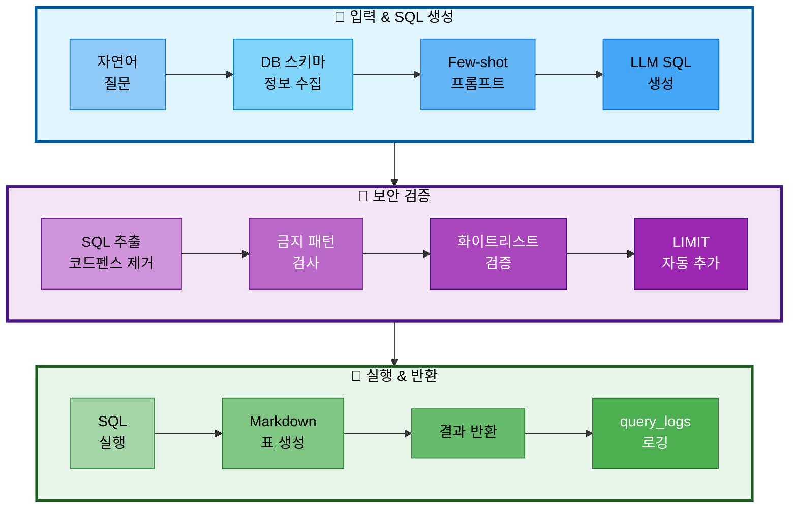

# 담당역할_05-1: Text-to-SQL 도구 구현

## 문서 정보
- **작성일**: 2025-11-04
- **작성자**: 최현화[팀장]
- **프로젝트명**: 논문 리뷰 챗봇 (AI Agent + RAG)
- **팀명**: 연결의 민족
- **담당 기능**: Text-to-SQL 도구, 자연어 → SQL 변환, 논문 통계 조회

---

## 담당자 정보

**담당자**: 신준엽

**역할**: Text-to-SQL 도구 구현 및 AI Agent 통합

---

## 담당 업무 개요

이 역할은 자연어 질문을 SQL 쿼리로 변환하여 논문 통계 정보를 조회하는 **Text-to-SQL 도구**를 구현하는 것을 담당합니다. 사용자가 "2024년에 발표된 논문 개수는?"과 같은 자연어 질문을 하면 자동으로 SQL 쿼리를 생성하고 실행하여 결과를 Markdown 형식으로 반환합니다.

### 주요 책임

1. **Text-to-SQL 도구 구현** (`src/tools/text2sql.py`)
   - LangChain Tool 정의
   - Few-shot 프롬프트 설계
   - SQL 쿼리 생성 (GPT-5o-mini)
   - 보안 및 안전성 강화 (화이트리스트, 금지 패턴)

2. **데이터베이스 연동**
   - PostgreSQL 연결
   - SQL 쿼리 실행
   - 결과 포맷팅 (Markdown 표)

3. **로깅 시스템**
   - query_logs 테이블에 실행 기록 저장
   - 성공/실패 여부, 응답 시간 기록

---

## 참여 기간 및 우선순위

### 참여 기간
- **구현 기간**: 2025-11-01 ~ 2025-11-04 (4일)
- **통합 및 검증**: 2025-11-04 (1일)

### 우선순위
1. **최우선 (Day 1-2)**: Text-to-SQL 도구 구현
   - LangChain Tool 정의
   - Few-shot 프롬프트 설계
   - SQL 생성 및 실행

2. **우선 (Day 3)**: 보안 및 안전성 강화
   - 화이트리스트 방식 (허용 테이블, 컬럼)
   - 금지 패턴 필터링
   - EXPLAIN 안전 점검

3. **선택 (Day 4)**: AI Agent 통합
   - Agent graph에 text2sql 노드 추가
   - 라우팅 프롬프트 업데이트

---

## Text-to-SQL 처리 흐름



---

## 세부 업무 및 구현 내용

### 1. Text-to-SQL 도구 구현

**파일 경로**: `src/tools/text2sql.py`

#### 1.1 LangChain Tool 정의

**필요 라이브러리**: `langchain.tools.tool`

**도구 정의**:

| 속성 | 값 | 설명 |
|-----|---|------|
| 데코레이터 | @tool | LangChain Tool 정의 |
| name | "text2sql" | 도구 이름 |
| return_direct | False | Agent에 결과 반환 (직접 사용자에게 반환 안 함) |

**함수: `text2sql`**

**파라미터**:

| 파라미터 | 타입 | 설명 |
|---------|------|------|
| query | str | 자연어 질문 |

**반환값**: `str` - 쿼리 결과 (Markdown 형식)

**역할**: 자연어 질문을 SQL 쿼리로 변환하여 논문 통계 정보 조회

#### 1.2 Few-shot 프롬프트 설계

**5개 예시**:
1. "2024년에 발표된 논문 개수는?" → `SELECT COUNT(*) FROM papers WHERE EXTRACT(YEAR FROM publish_date)=2024;`
2. "카테고리별 논문 수 보여줘" → `SELECT category, COUNT(*) FROM papers GROUP BY category ORDER BY count DESC;`
3. "가장 많이 인용된 논문 Top 5는?" → `SELECT title, citation_count FROM papers ORDER BY citation_count DESC LIMIT 5;`
4. "arXiv에서 가져온 논문 개수는?" → `SELECT COUNT(*) FROM papers WHERE source='arXiv';`
5. "최근 1년간 발표된 AI 관련 논문은?" → `SELECT COUNT(*) FROM papers WHERE category ILIKE '%AI%' AND publish_date >= NOW() - INTERVAL '1 year';`

#### 1.3 보안 및 안전성

**화이트리스트 방식**:

**허용 테이블**:

| 테이블 | 설명 |
|--------|------|
| papers | 논문 메타데이터 테이블 |

**허용 컬럼** (11개):

| 컬럼 | 타입 | 설명 |
|-----|------|------|
| paper_id | SERIAL | 논문 ID |
| title | VARCHAR | 논문 제목 |
| authors | TEXT | 저자 |
| publish_date | DATE | 발행일 |
| source | VARCHAR | 출처 (arXiv, IEEE 등) |
| url | TEXT | 논문 URL |
| category | VARCHAR | 카테고리 |
| citation_count | INT | 인용 수 |
| abstract | TEXT | 초록 |
| created_at | TIMESTAMP | 생성 시간 |
| updated_at | TIMESTAMP | 수정 시간 |

---

**금지 패턴** (정규식):

| 패턴 | 설명 |
|-----|------|
| `\bDROP\b` | DROP 명령 금지 |
| `\bINSERT\b` | INSERT 명령 금지 |
| `\bUPDATE\b` | UPDATE 명령 금지 |
| `\bDELETE\b` | DELETE 명령 금지 |
| `\bCREATE\b` | CREATE 명령 금지 |
| `\bALTER\b` | ALTER 명령 금지 |
| `\bGRANT\b` | GRANT 명령 금지 |
| `\bREVOKE\b` | REVOKE 명령 금지 |
| `--` | SQL 주석 금지 |
| `;.*SELECT` | 다중 쿼리 금지 |
| `UNION` | UNION 명령 금지 |

---

**쿼리 타입 검증**:

| 검증 항목 | 조건 | 에러 메시지 |
|----------|------|------------|
| SELECT/WITH 시작 | `^\s*(SELECT\|WITH)` 정규식 매치 | "SELECT 또는 WITH 쿼리만 허용됩니다" |

#### 1.4 SQL 실행 및 결과 반환

**함수 1: `_run_query`**

**역할**: SQL 쿼리 실행 및 결과 반환

**파라미터**:

| 파라미터 | 타입 | 설명 |
|---------|------|------|
| conn | psycopg2.connection | PostgreSQL 연결 객체 |
| sql | str | 실행할 SQL 쿼리 |

**반환값**: `tuple(rows, columns)`
- `rows`: List - 쿼리 결과 행들
- `columns`: List[str] - 컬럼 이름 리스트

**처리 흐름**:

| 단계 | 작업 |
|-----|------|
| 1 | cursor 생성 |
| 2 | cursor.execute(sql) 실행 |
| 3 | fetchall()로 결과 조회 |
| 4 | cursor.description에서 컬럼명 추출 |
| 5 | cursor 종료 |
| 6 | (rows, columns) 반환 |

---

**함수 2: `_to_markdown_table`**

**역할**: 쿼리 결과를 Markdown 표 형식으로 변환

**파라미터**:

| 파라미터 | 타입 | 설명 |
|---------|------|------|
| rows | List | 쿼리 결과 행들 |
| columns | List[str] | 컬럼 이름 리스트 |

**반환값**: `str` - Markdown 표 형식 문자열

**처리 흐름**:

| 단계 | 작업 | 예시 |
|-----|------|------|
| 1 | 빈 결과 확인 | rows가 비어있으면 "결과가 없습니다." 반환 |
| 2 | 헤더 생성 | `\| column1 \| column2 \|` |
| 3 | 구분선 생성 | `\| --- \| --- \|` |
| 4 | 데이터 행 생성 | 각 row를 순회하며 `\| val1 \| val2 \|` 형식 |
| 5 | 결과 반환 | 완성된 Markdown 표 |

---

### 2. 로깅 시스템

**파일 경로**: `src/tools/text2sql.py`

**함수: `_log_query`**

**역할**: 쿼리 실행 기록을 query_logs 테이블에 저장

**파라미터**:

| 파라미터 | 타입 | 설명 | 기본값 |
|---------|------|------|--------|
| query | str | 사용자의 자연어 질문 | - |
| sql | str | 생성된 SQL 쿼리 | - |
| success | bool | 실행 성공 여부 | - |
| error_msg | str | 에러 메시지 | None |

**처리 흐름**:

| 단계 | 작업 | 설명 |
|-----|------|------|
| 1 | DB 연결 | _get_conn() |
| 2 | 테이블 생성 | CREATE TABLE IF NOT EXISTS query_logs |
| 3 | 로그 삽입 | INSERT INTO query_logs (user_query, generated_sql, success, error_message) |
| 4 | 커밋 | conn.commit() |
| 5 | 연결 종료 | cursor.close(), conn.close() |

**query_logs 테이블 스키마**:

| 컬럼 | 타입 | 제약조건 | 설명 |
|-----|------|---------|------|
| log_id | SERIAL | PRIMARY KEY | 로그 ID (자동 증가) |
| user_query | TEXT | NOT NULL | 사용자 질문 |
| generated_sql | TEXT | - | 생성된 SQL 쿼리 |
| success | BOOLEAN | DEFAULT TRUE | 실행 성공 여부 |
| error_message | TEXT | - | 에러 메시지 |
| created_at | TIMESTAMP | DEFAULT CURRENT_TIMESTAMP | 생성 시간 |

---

### 3. AI Agent 통합 (최현화 작업)

#### 3.1 Agent Nodes 추가

**파일**: `src/agent/nodes.py`

**필요 라이브러리**: `src.tools.text2sql.text2sql`

**함수: `text2sql_node`**

**역할**: Text-to-SQL 노드 - 자연어 질문을 SQL로 변환하여 논문 통계 조회

**파라미터**:

| 파라미터 | 타입 | 설명 | 기본값 |
|---------|------|------|--------|
| state | AgentState | Agent 상태 (question, final_answer 포함) | - |
| exp_manager | ExperimentManager | 실험 관리 인스턴스 | None |

**반환값**: `AgentState` - 업데이트된 상태 (final_answer에 결과 저장)

**처리 흐름**:

| 단계 | 작업 | 설명 |
|-----|------|------|
| 1 | 질문 추출 | state["question"] 가져오기 |
| 2 | 시작 로그 | "Text-to-SQL 노드 실행: {question}" |
| 3 | 도구 호출 | text2sql.run(question) |
| 4 | 완료 로그 | "SQL 실행 완료: {len} 글자" |
| 5 | 상태 업데이트 | state["final_answer"] = result |
| 6 | 상태 반환 | return state |

#### 3.2 Agent Graph 등록

**파일**: `src/agent/graph.py`

**필요 라이브러리**: `src.agent.nodes.text2sql_node`, `functools.partial`, `langgraph`

**함수: `create_agent_graph`** (수정)

**Graph 등록 단계**:

| 단계 | 작업 | 코드/설명 |
|-----|------|----------|
| 1 | StateGraph 생성 | `workflow = StateGraph(AgentState)` |
| 2 | exp_manager 바인딩 | `text2sql_with_exp = partial(text2sql_node, exp_manager=exp_manager)` |
| 3 | 노드 추가 | `workflow.add_node("text2sql", text2sql_with_exp)` |
| 4 | 조건부 엣지 설정 | router → text2sql 매핑 추가 |
| 5 | 종료 엣지 설정 | `workflow.add_edge("text2sql", END)` |
| 6 | Graph 컴파일 | `workflow.compile()` |

**조건부 엣지 매핑 추가**:

```python
workflow.add_conditional_edges(
    "router",
    route_to_tool,
    {
        # 기존 매핑...
        "text2sql": "text2sql"  # 추가
    }
)
```

**Graph 구조**:
- `router` → (조건: text2sql 선택) → `text2sql` → `END`

#### 3.3 라우팅 프롬프트 업데이트

**파일**: `prompts/routing_prompts.json`

```json
{
  "routing_prompt": "...기존 내용...\n\n6. **text2sql** (논문 통계 정보 조회)\n   - 사용 시기: 논문 통계, 개수, 순위, 분포 조회\n   - 키워드: \"개수\", \"몇 편\", \"순위\", \"Top\", \"평균\", \"분포\", \"카테고리별\"\n   - 예시:\n     * \"2024년에 발표된 논문 개수는?\"\n     * \"카테고리별 논문 수 보여줘\"\n     * \"가장 많이 인용된 논문 Top 5는?\"\n",
  "few_shot_examples": [
    ...,
    {
      "question": "2024년에 발표된 논문 개수는?",
      "tool": "text2sql",
      "reason": "통계 정보 조회 (개수)"
    },
    {
      "question": "카테고리별 논문 수 보여줘",
      "tool": "text2sql",
      "reason": "분포 통계 조회"
    },
    {
      "question": "가장 많이 인용된 논문 Top 5는?",
      "tool": "text2sql",
      "reason": "순위 통계 조회"
    }
  ]
}
```

---

## 참고 PRD 문서

아래 PRD 문서들을 참고하여 구현하세요:

1. **[05_추가선택기능_구현.md](../issues/05_추가선택기능_구현.md)** ⭐⭐⭐
   - Text-to-SQL 구현 가이드
   - 보안 및 안전성 요구사항

2. **[담당역할_05_추가선택기능.md](./담당역할_05_추가선택기능.md)** ⭐⭐⭐
   - Text-to-SQL 도구 상세 설명 (21-192줄)
   - 예제 코드 및 사용법

3. **[11_데이터베이스_설계.md](../PRD/11_데이터베이스_설계.md)** ⭐⭐
   - papers 테이블 스키마
   - 컬럼 목록 및 데이터 타입

---

## 협업 방법

### 다른 담당자와의 협업

#### 1. 최현화 (AI Agent 메인) - Agent 통합
- **협업 내용**: Text-to-SQL 도구를 AI Agent에 통합
- **타이밍**: text2sql.py 구현 완료 후
- **전달 사항**:
  - text2sql Tool 객체 사용법
  - 라우팅 키워드 (통계, 개수, 순위, 분포)
  - 예시 질문 목록

---

## 구현 체크리스트

### Phase 1: Text-to-SQL 도구 구현 (우선순위 1)
- [x] `src/tools/text2sql.py` 파일 생성
- [x] LangChain Tool 정의
- [x] Few-shot 프롬프트 설계 (5개 예시)
- [x] SQL 쿼리 생성 (OpenAI GPT-5o-mini)
- [x] DB 연결 및 쿼리 실행
- [x] 결과 포맷팅 (Markdown 표)

### Phase 2: 보안 및 안전성 강화 (우선순위 2)
- [x] 화이트리스트 방식 구현
  - [x] 허용 테이블: papers
  - [x] 허용 컬럼: 11개
- [x] 금지 패턴 필터링
  - [x] DROP, INSERT, UPDATE, DELETE 금지
  - [x] CREATE, ALTER, GRANT, REVOKE 금지
  - [x] 주석(-), UNION 금지
- [x] SELECT/WITH 쿼리만 허용
- [x] EXPLAIN 안전 점검

### Phase 3: 로깅 시스템 (우선순위 3)
- [x] query_logs 테이블 생성
- [x] 쿼리 실행 기록 저장
  - [x] user_query, generated_sql 저장
  - [x] success, error_message 저장
  - [x] created_at 타임스탬프

### Phase 4: AI Agent 통합 (최현화 작업)
- [x] `src/agent/nodes.py`에 text2sql_node 추가
- [x] `src/agent/graph.py`에 노드 등록
- [x] 조건부 엣지 설정
- [x] 라우팅 프롬프트 업데이트 (`prompts/routing_prompts.json`)

### Phase 5: 테스트 및 문서화
- [x] 단위 테스트 (5개 예시 질문)
- [x] 보안 테스트 (금지 패턴 차단)
- [x] 통합 테스트 (Agent와 연동)
- [x] 사용법 문서화

---

## 규칙 및 주의사항

### 1. 보안 규칙
- **화이트리스트 방식**: 허용된 테이블과 컬럼만 사용
- **SELECT/WITH 전용**: 데이터 조회 쿼리만 허용
- **금지 패턴 차단**: DROP, INSERT, UPDATE, DELETE 등 금지
- **EXPLAIN 검증**: 쿼리 실행 전 안전성 점검

### 2. 코드 품질
- 모든 함수에 한글 주석 작성 (docs/rules/annotate_style.md 준수)
- 섹션 구분선 사용 (등호 20개, 대시 22개)
- 함수별 상세 설명
- 로직 블록별 설명

### 3. 에러 처리
- SQL 생성 실패 시 사용자 친화적 메시지
- DB 연결 실패 시 재시도 로직
- 쿼리 실행 오류 시 상세 에러 메시지

### 4. 성능 고려사항
- 쿼리에 LIMIT 자동 추가 (최대 100행)
- Connection Pool 사용 (psycopg2.pool)
- 응답 시간 목표: p95 ≤ 3000ms

---

## 예상 결과물

### 1. 파일 구조

```
src/
└── tools/
    └── text2sql.py                # Text-to-SQL 도구 (신규)

prompts/
└── routing_prompts.json           # 라우팅 프롬프트 (업데이트)
```

### 2. 사용 예시

**기본 사용 패턴:**

**사용법**:

| 단계 | 작업 | 코드 |
|-----|------|------|
| 1 | 모듈 임포트 | `from src.tools.text2sql import text2sql` |
| 2 | 도구 실행 | `result = text2sql.run("2024년에 발표된 논문 개수는?")` |
| 3 | 결과 확인 | `print(result)` (Markdown 형식 출력) |

**출력 예시:**
```markdown
**질문**: 2024년에 발표된 논문 개수는?

**생성된 SQL**:
\`\`\`sql
SELECT COUNT(*) AS paper_count FROM papers WHERE EXTRACT(YEAR FROM publish_date)=2024;
\`\`\`

**결과**:

| paper_count |
| --- |
| 42 |
```

---

## 추가 참고 사항

### 1. Few-shot 프롬프트 예시

**구조**: 튜플 리스트 `_FEW_SHOTS`

**형식**: 각 항목은 `(질문, SQL 쿼리)` 튜플

**5개 예시**:

| # | 질문 | SQL 쿼리 |
|---|------|---------|
| 1 | "2024년에 발표된 논문 개수는?" | `SELECT COUNT(*) FROM papers WHERE EXTRACT(YEAR FROM publish_date)=2024;` |
| 2 | "카테고리별 논문 수 보여줘" | `SELECT category, COUNT(*) FROM papers GROUP BY category ORDER BY count DESC;` |
| 3 | "가장 많이 인용된 논문 Top 5는?" | `SELECT title, citation_count FROM papers ORDER BY citation_count DESC LIMIT 5;` |
| 4 | "arXiv에서 가져온 논문 개수는?" | `SELECT COUNT(*) FROM papers WHERE source='arXiv';` |
| 5 | "최근 1년간 발표된 AI 관련 논문은?" | `SELECT COUNT(*) FROM papers WHERE category ILIKE '%AI%' AND publish_date >= NOW() - INTERVAL '1 year';` |

**사용 목적**: LLM에게 자연어 → SQL 변환 패턴을 학습시키기 위한 Few-shot 예시

### 2. 환경 변수 설정

`.env` 파일:
```
POSTGRES_HOST=localhost
POSTGRES_PORT=5432
POSTGRES_USER=postgres
POSTGRES_PASSWORD=your_password
POSTGRES_DB=papers

TEXT2SQL_MODEL=gpt-5o-mini
OPENAI_API_KEY=your_openai_key
```

---

## 완료 일자

- **구현 완료**: 2025-11-04
- **통합 완료**: 2025-11-04
- **검증 완료**: 2025-11-04
