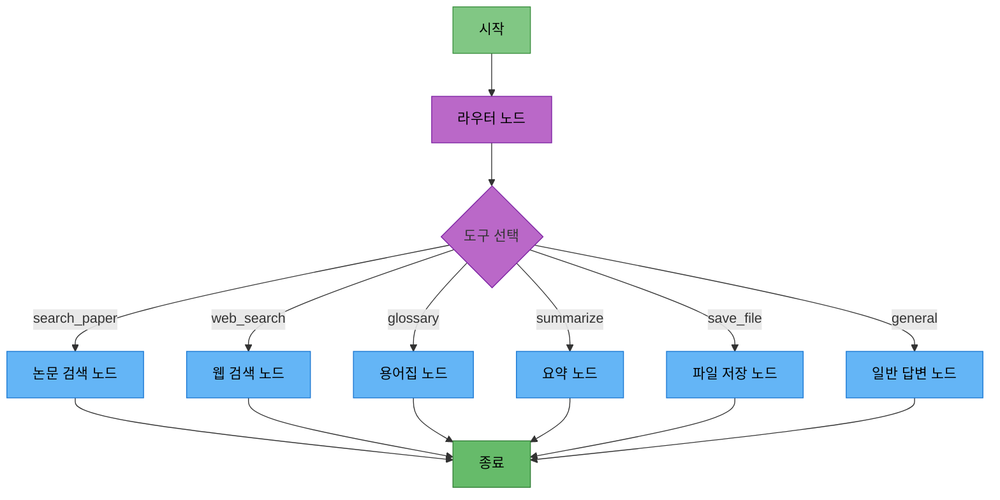

# 담당역할: LangGraph 노드 및 스트리밍 구현

## 문서 정보
- **작성자**: 최현화[팀장]

## 담당자 정보
- **담당자**: 최현화 & 임예슬 (협업)
- **역할**: LangGraph 노드 구현 및 스트리밍 기능
- **참여 기간**: 전체 기간
- **핵심 역할**: Agent 노드 개발, 스트리밍 응답, 도구 노드 통합

---

## 담당 모듈 및 도구

### 1. LangGraph 노드 구현 (`src/agent/nodes.py`)
- 라우터 노드 (도구 선택)
- 6개 도구 노드 (일반 답변, 논문 검색, 웹 검색, 용어집, 요약, 파일 저장)
- 각 노드의 프롬프트 및 LLM 연동

### 2. 스트리밍 응답 (`ui/app_streaming.py`)
- StreamlitCallbackHandler 구현
- astream_events() 비동기 스트리밍
- 실시간 응답 업데이트

### 3. 파일 저장 도구 (`src/tools/file_save.py`)
- Langchain @tool 데코레이터
- 텍스트/Markdown 파일 저장
- Streamlit 다운로드 버튼 연동

---

## 1. 스트리밍 응답 구현

### 기능 설명
LangGraph Agent의 응답을 실시간으로 스트리밍하여 사용자에게 표시

### 구현 방법

**파일 경로**: `ui/app_streaming.py`

#### 1단계: StreamlitCallbackHandler 생성
```python
from langchain.callbacks.streamlit import StreamlitCallbackHandler
import streamlit as st

# 콜백 핸들러 초기화
callback_container = st.container()
callback_handler = StreamlitCallbackHandler(callback_container)
```

#### 2단계: 응답 표시용 placeholder 생성
```python
# 빈 컨테이너 생성
response_placeholder = st.empty()
full_response = ""
```

#### 3단계: Agent 스트리밍 실행
```python
from src.agent.graph import create_agent_graph

# Agent 초기화
agent = create_agent_graph()

# 스트리밍 실행
async for event in agent.astream_events(
    {
        "question": question,
        "difficulty": difficulty
    },
    version="v1"
):
    # 이벤트 처리
    if event["event"] == "on_chat_model_stream":
        chunk = event["data"]["chunk"].content
        full_response += chunk

        # 실시간 업데이트 (커서 효과)
        response_placeholder.markdown(full_response + "▌")

# 최종 응답 표시
response_placeholder.markdown(full_response)
```

#### 4단계: 전체 코드 예제
```python
# ui/app_streaming.py

import streamlit as st
import asyncio
from src.agent.graph import create_agent_graph
from langchain.callbacks.streamlit import StreamlitCallbackHandler

st.title("논문 리뷰 챗봇 (스트리밍)")

# 난이도 선택
difficulty = st.sidebar.radio("난이도", ["easy", "hard"])

# 채팅 히스토리 초기화
if "messages" not in st.session_state:
    st.session_state.messages = []

# 채팅 히스토리 표시
for message in st.session_state.messages:
    with st.chat_message(message["role"]):
        st.markdown(message["content"])

# 사용자 입력
if prompt := st.chat_input("질문을 입력하세요"):
    # 사용자 메시지 추가
    st.session_state.messages.append({"role": "user", "content": prompt})

    with st.chat_message("user"):
        st.markdown(prompt)

    # AI 응답 스트리밍
    with st.chat_message("assistant"):
        response_placeholder = st.empty()
        full_response = ""

        # Agent 초기화
        agent = create_agent_graph()

        # 스트리밍 실행
        async def stream_response():
            global full_response

            async for event in agent.astream_events(
                {
                    "question": prompt,
                    "difficulty": difficulty
                },
                version="v1"
            ):
                if event["event"] == "on_chat_model_stream":
                    chunk = event["data"]["chunk"].content
                    full_response += chunk

                    # 실시간 업데이트 (커서 효과)
                    response_placeholder.markdown(full_response + "▌")

            # 최종 응답 표시
            response_placeholder.markdown(full_response)

        # 비동기 실행
        asyncio.run(stream_response())

        # 응답 저장
        st.session_state.messages.append({"role": "assistant", "content": full_response})
```

### 참고 자료
- [StreamlitCallbackHandler](https://python.langchain.com/docs/integrations/callbacks/streamlit)
- [LangGraph Streaming](https://langchain-ai.github.io/langgraph/how-tos/stream-values/)

---

## 2. LangGraph 노드 구현

### 2.1 웹 검색 노드

**파일 경로**: `src/agent/nodes.py` (또는 `src/tools/web_search.py`의 `web_search_node`)

**구현 방법**:
1. `web_search_node` 함수 정의
   - 인자: state (AgentState)
2. state에서 질문 추출
3. 웹 검색 도구 호출
   - Tavily API로 검색 수행
4. 검색 결과를 state["tool_result"]에 저장
5. 프롬프트 구성
   - 검색 결과와 사용자 질문 포함
6. LLM 호출하여 최종 답변 생성
   - SystemMessage: "당신은 최신 AI/ML 정보를 제공하는 전문가입니다."
   - HumanMessage: 프롬프트
7. 최종 답변을 state["final_answer"]에 저장 후 반환

**예제 코드**:
```python
# src/agent/nodes.py

from src.agent.state import AgentState
from src.tools.web_search import web_search_node

# 웹 검색 노드는 이미 src/tools/web_search.py에 구현됨
# nodes.py에서는 import만 하면 됨

# 또는 직접 구현:
def web_search_node_example(state: AgentState, exp_manager=None):
    """웹 검색 노드 예시"""
    from langchain_community.tools.tavily_search import TavilySearchResults
    import os

    question = state["question"]

    # Tavily Search 도구 초기화
    search_tool = TavilySearchResults(
        max_results=5,
        api_key=os.getenv("TAVILY_API_KEY")
    )

    # 검색 실행
    search_results = search_tool.invoke({"query": question})

    # 검색 결과 포맷팅
    formatted_results = "\n\n".join([
        f"[결과 {i+1}]\n제목: {result.get('title', 'N/A')}\n내용: {result.get('content', 'N/A')}\nURL: {result.get('url', 'N/A')}"
        for i, result in enumerate(search_results)
    ])

    # LLM 프롬프트 구성
    from langchain.schema import SystemMessage, HumanMessage
    from src.llm.client import LLMClient

    difficulty = state.get("difficulty", "easy")
    llm_client = LLMClient.from_difficulty(difficulty)

    messages = [
        SystemMessage(content="당신은 최신 AI/ML 정보를 제공하는 전문가입니다."),
        HumanMessage(content=f"""[검색 결과]
{formatted_results}

[질문]
{question}

위 검색 결과를 바탕으로 질문에 답변해주세요.""")
    ]

    # LLM 호출
    response = llm_client.llm.invoke(messages)

    # 상태 업데이트
    state["tool_result"] = formatted_results
    state["final_answer"] = response.content

    return state
```

### 2.2 파일 저장 노드

**파일 경로**: `src/agent/nodes.py` (또는 `src/tools/save_file.py`의 `save_file_node`)

**구현 방법**:
1. `save_file_node` 함수 정의
   - 인자: state (AgentState)
2. state에서 이전 답변(final_answer) 추출
3. 답변이 있으면 파일 저장 도구 호출
   - save_to_file.invoke()로 저장 수행
   - 저장 결과를 state["final_answer"]에 저장
4. 답변이 없으면 "저장할 내용이 없습니다." 메시지 반환
5. state 반환

**예제 코드**:
```python
# src/agent/nodes.py

from src.agent.state import AgentState

def save_file_node_example(state: AgentState, exp_manager=None):
    """파일 저장 노드 예시"""
    from src.tools.file_save import save_to_file
    from datetime import datetime

    # 이전 답변 추출
    final_answer = state.get("final_answer", "")

    if not final_answer:
        state["final_answer"] = "저장할 내용이 없습니다."
        return state

    # 파일 저장 도구 호출
    timestamp = datetime.now().strftime("%Y%m%d_%H%M%S")
    filename = f"paper_review_{timestamp}.txt"

    result = save_to_file.invoke({
        "content": final_answer,
        "filename": filename
    })

    # 저장 결과 업데이트
    state["final_answer"] = result

    return state
```

### 2.3 기타 노드 (일반 답변, 논문 검색, 용어집, 요약)

**이미 구현된 노드:**
- `general_answer_node` - `src/tools/general_answer.py`
- `search_paper_node` - `src/tools/search_paper.py`
- `glossary_node` - `src/tools/glossary.py`
- `summarize_node` - `src/tools/summarize.py`

**노드 구현 패턴:**
```python
def tool_node(state: AgentState, exp_manager=None):
    """도구 노드 패턴"""
    # 1. 상태에서 질문 추출
    question = state["question"]
    difficulty = state.get("difficulty", "easy")

    # 2. 도구별 로거 생성
    tool_logger = exp_manager.get_tool_logger('tool_name') if exp_manager else None

    # 3. 도구 실행 (검색, LLM 호출 등)
    # ...

    # 4. 결과를 state에 저장
    state["tool_result"] = "도구 실행 결과"
    state["final_answer"] = "최종 답변"

    # 5. 상태 반환
    return state
```

---

## 3. 파일 저장 도구 구현

### 3.1 텍스트 파일 저장

**파일 경로**: `src/tools/file_save.py`

**구현 방법**:
1. `save_to_file` 함수를 @tool 데코레이터로 정의
   - 인자: content (저장할 내용), filename (선택적)
2. 파일명이 없으면 타임스탬프 기반으로 자동 생성
3. output_dir (data/outputs) 생성
4. 파일 경로 생성 및 파일 저장
5. 저장 성공 메시지 반환

**예제 코드**:
```python
# src/tools/file_save.py

from langchain.tools import tool
import os
from datetime import datetime

@tool
def save_to_file(content: str, filename: str = None) -> str:
    """
    내용을 텍스트 파일로 저장합니다.

    Args:
        content: 저장할 내용
        filename: 파일명 (선택, 없으면 자동 생성)

    Returns:
        저장된 파일 경로
    """
    # 파일명이 없으면 타임스탬프 기반으로 자동 생성
    if filename is None:
        timestamp = datetime.now().strftime("%Y%m%d_%H%M%S")
        filename = f"paper_review_{timestamp}.txt"

    # data/outputs 폴더에 저장
    output_dir = "data/outputs"
    os.makedirs(output_dir, exist_ok=True)

    filepath = os.path.join(output_dir, filename)

    # 파일 저장
    with open(filepath, "w", encoding="utf-8") as f:
        f.write(content)

    return f"파일이 저장되었습니다: {filepath}"
```

### 3.2 Markdown 형식 저장

**구현 방법**:
1. `save_to_markdown` 함수를 @tool 데코레이터로 정의
   - 인자: content, title, filename (선택적)
2. 파일명이 없으면 타임스탬프 기반으로 자동 생성
3. Markdown 형식으로 content 포맷팅
   - 제목, 생성일, 내용, 푸터 포함
4. output_dir 생성 및 파일 저장
5. 저장 성공 메시지 반환

**예제 코드**:
```python
@tool
def save_to_markdown(content: str, title: str = "논문 리뷰", filename: str = None) -> str:
    """
    내용을 Markdown 형식으로 저장합니다.

    Args:
        content: 저장할 내용
        title: 문서 제목
        filename: 파일명 (선택, 없으면 자동 생성)

    Returns:
        저장된 파일 경로
    """
    # 파일명이 없으면 타임스탬프 기반으로 자동 생성
    if filename is None:
        timestamp = datetime.now().strftime("%Y%m%d_%H%M%S")
        filename = f"paper_review_{timestamp}.md"

    # Markdown 형식으로 포맷팅
    markdown_content = f"# {title}\n\n"
    markdown_content += f"**생성일**: {datetime.now().strftime('%Y-%m-%d %H:%M:%S')}\n\n"
    markdown_content += "---\n\n"
    markdown_content += content
    markdown_content += "\n\n---\n\n"
    markdown_content += "*이 문서는 논문 리뷰 챗봇에서 자동 생성되었습니다.*\n"

    # data/outputs 폴더에 저장
    output_dir = "data/outputs"
    os.makedirs(output_dir, exist_ok=True)

    filepath = os.path.join(output_dir, filename)

    # 파일 저장
    with open(filepath, "w", encoding="utf-8") as f:
        f.write(markdown_content)

    return f"Markdown 파일이 저장되었습니다: {filepath}"
```

### 3.3 Streamlit 다운로드 버튼 연동

**파일 경로**: `ui/app.py` (파일 저장 UI)

**구현 방법**:
1. 사이드바에 파일 저장 섹션 추가
2. st.radio()로 저장 내용 선택 ("대화 내용" 또는 "마지막 답변만")
3. "파일 저장" 버튼 구현
4. 선택된 옵션에 따라 content 생성
   - "대화 내용": 전체 messages를 순회하며 텍스트 생성
   - "마지막 답변만": assistant 역할의 마지막 메시지 추출
5. st.download_button()으로 다운로드 버튼 생성
   - 타임스탬프 기반 파일명
   - MIME 타입: text/plain

**예제 코드**:
```python
# ui/app.py (파일 저장 섹션)

import streamlit as st
from datetime import datetime

def add_file_download_to_sidebar():
    """사이드바에 파일 다운로드 기능 추가"""
    with st.sidebar:
        st.markdown("---")
        st.markdown("### 파일 저장")

        # 저장 내용 선택
        save_option = st.radio(
            "저장할 내용",
            ["대화 내용", "마지막 답변만"]
        )

        if st.button("파일 저장"):
            # 대화 내용 텍스트로 변환
            if save_option == "대화 내용":
                conversation_text = ""
                for msg in st.session_state.messages:
                    role = "사용자" if msg["role"] == "user" else "AI"
                    conversation_text += f"[{role}]\n{msg['content']}\n\n"

                content = conversation_text
            else:
                # 마지막 assistant 메시지 찾기
                last_assistant_msg = None
                for msg in reversed(st.session_state.messages):
                    if msg["role"] == "assistant":
                        last_assistant_msg = msg["content"]
                        break

                content = last_assistant_msg if last_assistant_msg else "저장할 내용이 없습니다."

            # 파일명 생성
            timestamp = datetime.now().strftime("%Y%m%d_%H%M%S")
            filename = f"conversation_{timestamp}.txt"

            # st.download_button으로 다운로드 제공
            st.download_button(
                label="다운로드",
                data=content,
                file_name=filename,
                mime="text/plain"
            )

            st.success("다운로드 준비 완료!")
```

---

## 4. LangGraph 통합 워크플로우

### 4.1 Agent 그래프 구조



### 4.2 그래프 생성 코드

**파일 경로**: `src/agent/graph.py`

```python
from langgraph.graph import StateGraph
from src.agent.state import AgentState
from src.agent.nodes import (
    router_node,
    general_answer_node,
    search_paper_node,
    web_search_node,
    glossary_node,
    summarize_node,
    save_file_node
)

def create_agent_graph():
    """LangGraph Agent 그래프 생성"""

    # 그래프 초기화
    graph = StateGraph(AgentState)

    # 노드 추가
    graph.add_node("router", router_node)
    graph.add_node("general", general_answer_node)
    graph.add_node("search_paper", search_paper_node)
    graph.add_node("web_search", web_search_node)
    graph.add_node("glossary", glossary_node)
    graph.add_node("summarize", summarize_node)
    graph.add_node("save_file", save_file_node)

    # 엣지 추가
    graph.set_entry_point("router")

    # 라우터에서 도구로 분기
    def route_to_tool(state: AgentState):
        return state["tool_choice"]

    graph.add_conditional_edges(
        "router",
        route_to_tool,
        {
            "general": "general",
            "search_paper": "search_paper",
            "web_search": "web_search",
            "glossary": "glossary",
            "summarize": "summarize",
            "save_file": "save_file"
        }
    )

    # 모든 도구 노드에서 종료
    graph.set_finish_point("general")
    graph.set_finish_point("search_paper")
    graph.set_finish_point("web_search")
    graph.set_finish_point("glossary")
    graph.set_finish_point("summarize")
    graph.set_finish_point("save_file")

    return graph.compile()
```

---

## 5. ExperimentManager 통합

### 노드에서 ExperimentManager 사용

**모든 노드에서 로깅 및 실험 추적을 위해 ExperimentManager 사용**

```python
def example_node(state: AgentState, exp_manager=None):
    """ExperimentManager를 사용하는 노드 예시"""

    # 도구별 로거 생성
    tool_logger = exp_manager.get_tool_logger('tool_name') if exp_manager else None

    if tool_logger:
        tool_logger.write("노드 실행 시작")

    # 프롬프트 저장
    if exp_manager:
        exp_manager.save_system_prompt(system_prompt, metadata={"tool": "tool_name"})
        exp_manager.save_user_prompt(user_prompt, metadata={"question": question})

    # SQL 쿼리 로깅
    if exp_manager:
        exp_manager.log_sql_query(
            query=query,
            params=params,
            result_count=len(results)
        )

    # pgvector 검색 로깅
    if exp_manager:
        exp_manager.log_pgvector_search({
            "tool": "tool_name",
            "collection": "collection_name",
            "query_text": query_text,
            "top_k": k,
            "result_count": len(results)
        })

    return state
```

---

## 6. 개발 일정

### Phase 1: LangGraph 노드 개발 (완료)
- 라우터 노드 구현
- 6개 도구 노드 구현
- Agent 그래프 생성

### Phase 2: 스트리밍 구현 (선택 사항)
- StreamlitCallbackHandler 연동
- astream_events() 구현
- 실시간 응답 업데이트

### Phase 3: 파일 저장 도구 개발 (완료)
- save_to_file 구현
- save_to_markdown 구현
- Streamlit 다운로드 버튼 연동

### Phase 4: 통합 테스트 및 최적화
- 노드 간 연동 테스트
- 스트리밍 성능 최적화
- 오류 처리 강화

---

## 7. Feature 브랜치

**LangGraph 노드 및 스트리밍 구현**
- `feature/langgraph-nodes` - LangGraph 노드 구현
- `feature/streaming-response` - 스트리밍 응답
- `feature/tool-file-save` - 파일 저장 도구

---

## 8. 참고 PRD 문서

### 필수 참고 문서
1. [12_AI_Agent_설계.md](../PRD/12_AI_Agent_설계.md) - LangGraph Agent 설계
2. [05_로깅_시스템.md](../PRD/05_로깅_시스템.md) - Logger 사용법
3. [06_실험_추적_관리.md](../PRD/06_실험_추적_관리.md) - ExperimentManager
4. [16_UI_설계.md](../PRD/16_UI_설계.md) - Streamlit 구현

### 참고 문서
- [담당역할_01_최현화_AI_Agent_메인.md](담당역할_01_최현화_AI_Agent_메인.md) - AI Agent 메인 구현
- [담당역할_01-1_최현화_실험_관리_시스템.md](담당역할_01-1_최현화_실험_관리_시스템.md) - ExperimentManager 상세
- [실험_폴더_구조.md](../rules/실험_폴더_구조.md) - 실험 폴더 구조

---

## 9. 참고 자료

- LangGraph 공식 문서: https://langchain-ai.github.io/langgraph/
- LangGraph Streaming: https://langchain-ai.github.io/langgraph/how-tos/stream-values/
- StreamlitCallbackHandler: https://python.langchain.com/docs/integrations/callbacks/streamlit
- Langchain Tools: https://python.langchain.com/docs/modules/agents/tools/

---
